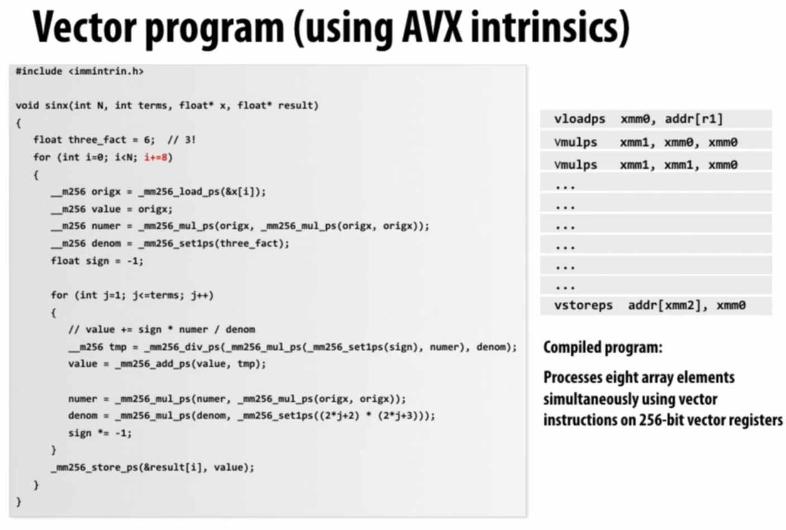
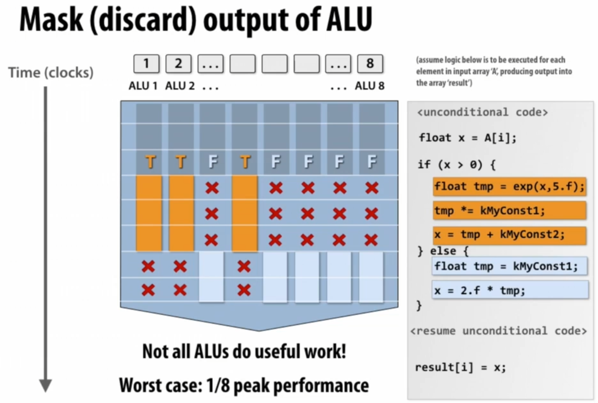
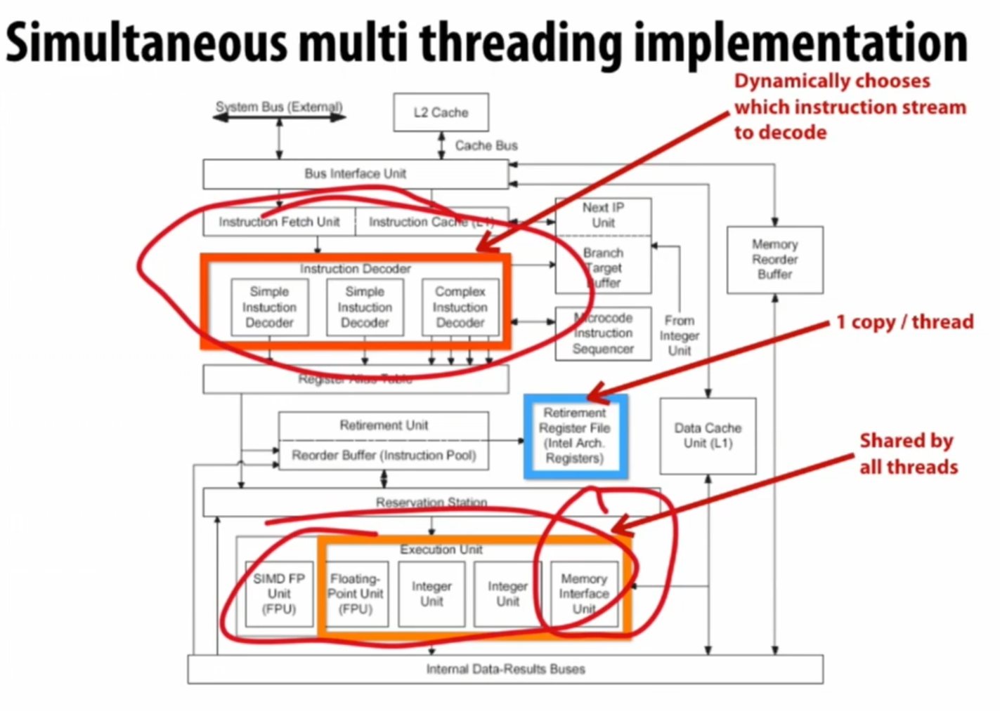
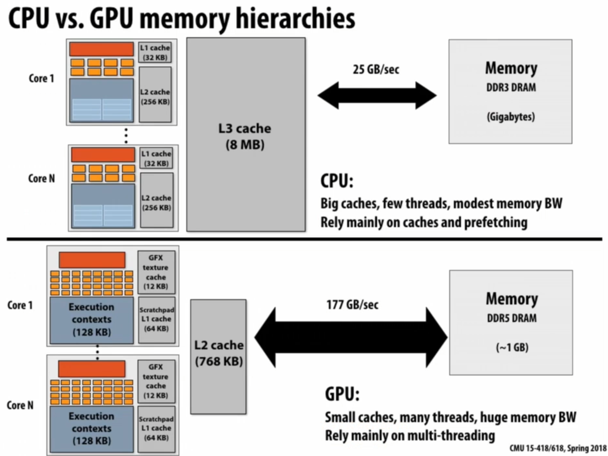

# 基础

A **parallel computer** is <u>a collection of</u> **processing elements** that <u>cooperate</u> to solve problems <u>quickly</u>

加速比定义：
$$speedup_P=\frac{execute\_time_{1}}{execute\_time_{P}}$$ 

# Modern multicore processor

ILP: Instruction Level Parallelism

vector: 例如，把八个数据和其他地方的八个数据加在一起生成八个数据，则称数据被聚合为向量。

比如，要对一个数组的每一项都完全独立地执行一个操作，则可以让八个元素一起被拿出来，然后一起被执行一样的流程操作。

SIMD扩展（AVX intrinsics）：对advanced vector的支持。xmm寄存器是特殊的256bit（32Byte）寄存器，有完全不同的指令集。

>SIMD(Single Instruction Multiple Data)（读作same D）即单指令流多数据流，是一种采用一个控制器来控制多个处理器，同时对一组数据（又称“数据向量”）中的每一个分别执行相同的操作从而实现空间上的并行性的技术。简单来说就是一个指令能够同时处理多个数据。

>ps = pack single

当各个数据的操作存在分支，即操作方式不一样时，可以使用mask来实现分支，“X”表示当前不对该数据进行操作。

- converge: 都做同一件事，从而能最大利用。SIMD追求converge。
- diverge: 分歧。

- **explicit SIMD**: SIMD parallelization is performed at compile time. Can inspect program binary and see instructions(vstoreps,vmulps,etc.)
- **Implicit SIMD**:
	- Compiler generates a scalar binary(scalar instructions). 
	- But N instances of the program are always run together on the processor. `execute(my_function,N); //execute my_function N times`
	- In other words,the interface to the hardware itself is data-parallel.
	- Hardware(not compiler)is responsible for simultaneously executing the same instruction from multiple instances on different data on SIMD ALUs

SIMD width: 可处理的数据量（不是字节数），8~32，一般为32。

stall: 发生数据相关时，会导致运行暂停。而stall的来源的大头是内存访问。内存传输过慢，会生成较大的latency。而cache可以减少暂停的时间（latency）。**prefetch**将数据提前放到cache里面也可以减少stall。

使用**multi-threading**可以在不同thread的stall期间执行其他thread的指令；可以直接在cache-L1里面存thread execution context；线程多的时候hide stall的能力会更强。`hyper-threading`: CPU给多个线程分配不同的寄存器组，实现无需上下文切换的多线程。

Execution Unit用于根据相关性协调决定多个thread的运作方式（顺序）：

GPU尽力拉高吞吐量，来hide latency，达成极高的并发度；缩小cache来把更多空间用于ALU。

