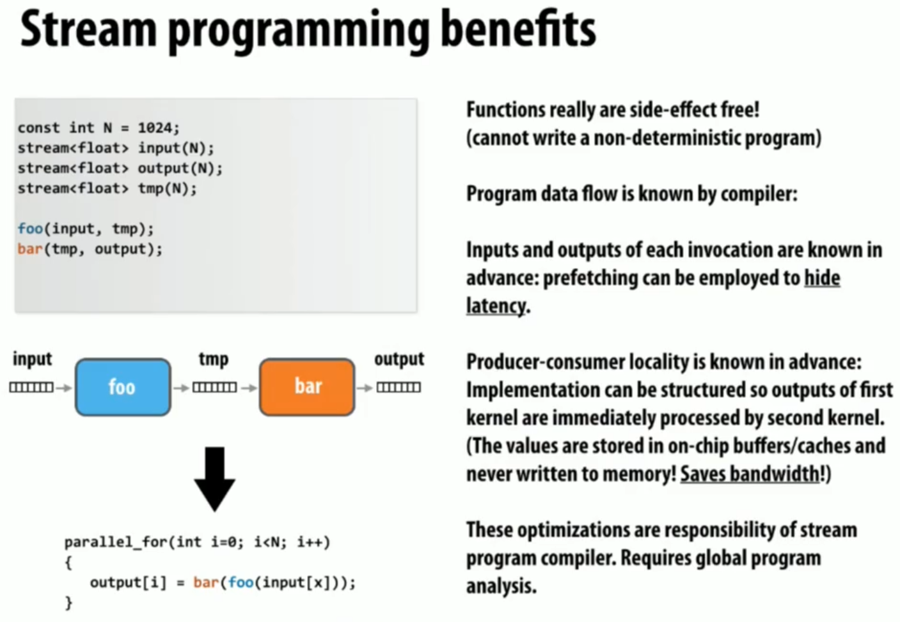
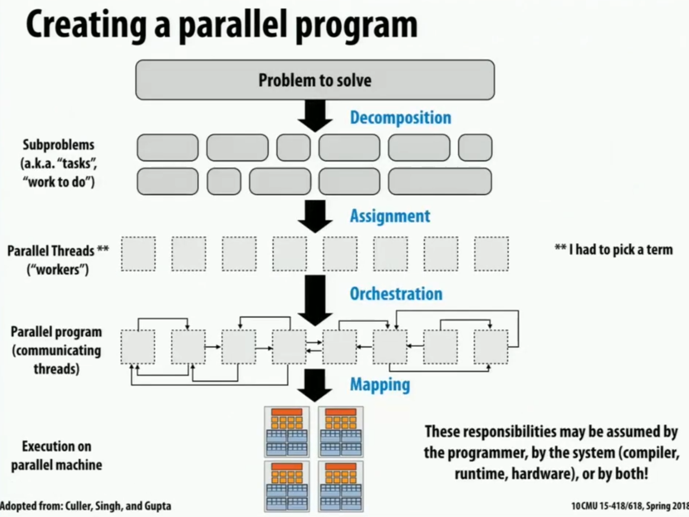
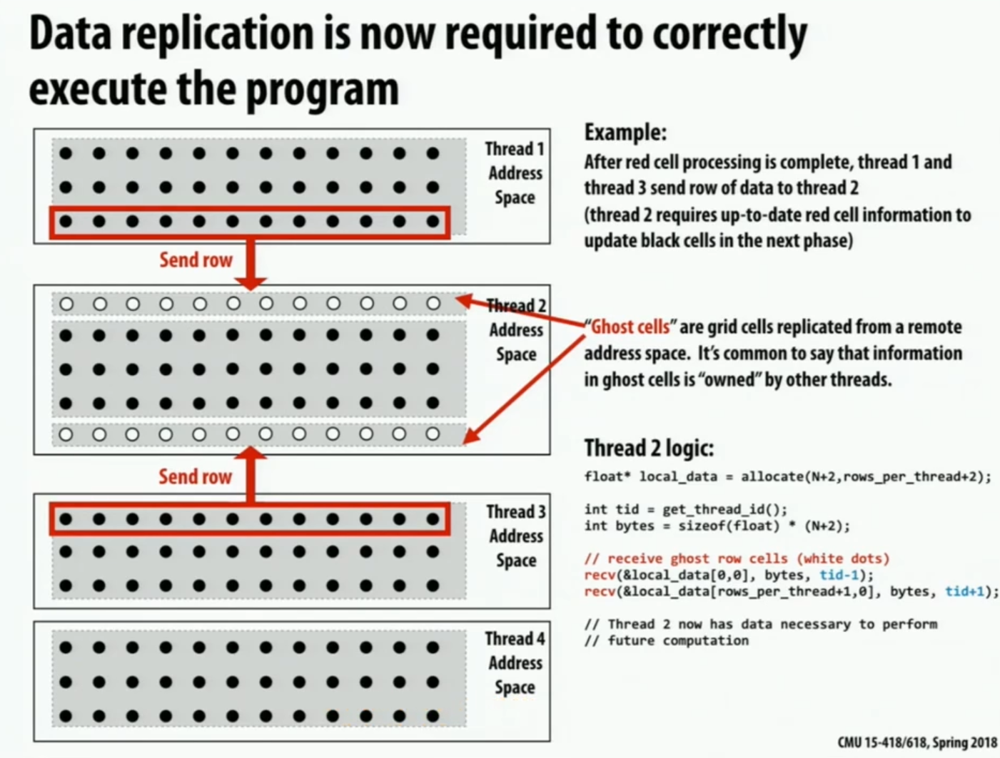

# 基础

A **parallel computer** is <u>a collection of</u> **processing elements** that <u>cooperate</u> to solve problems <u>quickly</u>

加速比定义：
$$speedup_P=\frac{execute\_time_{1}}{execute\_time_{P}}$$ 

# Lec2 Modern Multicore Processor

ILP: Instruction Level Parallelism

vector: 例如，把八个数据和其他地方的八个数据加在一起生成八个数据，则称数据被聚合为向量。

比如，要对一个数组的每一项都完全独立地执行一个操作，则可以让八个元素一起被拿出来，然后一起被执行一样的流程操作。

SIMD扩展（AVX intrinsics）：对advanced vector的支持。xmm寄存器是特殊的256bit（32Byte）寄存器，有完全不同的指令集。

>SIMD(Single Instruction Multiple Data)（读作same D）即单指令流多数据流，是一种采用一个控制器来控制多个处理器，同时对一组数据（又称“数据向量”）中的每一个分别执行相同的操作从而实现空间上的并行性的技术。简单来说就是一个指令能够同时处理多个数据。

>ps = pack single

当各个数据的操作存在分支，即操作方式不一样时，可以使用mask来实现分支，“X”表示当前不对该数据进行操作。

- converge: 都做同一件事，从而能最大利用。SIMD追求converge。
- diverge: 分歧。

- **explicit SIMD**: SIMD parallelization is performed at compile time. Can inspect program binary and see instructions(vstoreps,vmulps,etc.)
- **Implicit SIMD**:
	- Compiler generates a scalar binary(scalar instructions). 
	- But N instances of the program are always run together on the processor. `execute(my_function,N); //execute my_function N times`
	- In other words,the interface to the hardware itself is data-parallel.
	- Hardware(not compiler)is responsible for simultaneously executing the same instruction from multiple instances on different data on SIMD ALUs

SIMD width: 可处理的数据量（不是字节数），8~32，一般为32。

stall: 发生数据相关时，会导致运行暂停。而stall的来源的大头是内存访问。内存传输过慢，会生成较大的latency。而cache可以减少暂停的时间（latency）。**prefetch**将数据提前放到cache里面也可以减少stall。

使用**multi-threading**可以在不同thread的stall期间执行其他thread的指令；可以直接在cache-L1里面存thread execution context；线程多的时候hide stall的能力会更强。`hyper-threading`: CPU给多个线程分配不同的寄存器组，实现无需上下文切换的多线程。

Execution Unit用于根据相关性协调决定多个thread的运作方式（顺序）：

GPU尽力拉高吞吐量，来hide latency，达成极高的并发度；缩小cache来把更多空间用于ALU。

# Lec3 Parallel Programming Abstractions

## ISPC (Intel SPMD Program Compiler)

- ISPC: Intel SPMD Program Compiler，一种语言
- SPMD: single program multiple data，同代码块不同数据
- http://ispc.github.com/

**ISPC会编译出SIMD指令**。SPMD是model，SIMD是implement。由于使用SIMD来增加并发性，因此实际上是单线程的。

ISPC Keywords:
**programCount**: number of simultaneously executing instances in the gang(uniform value). 决定了并发量。
**programIndex**: id of the current instance in the gang.(a non-uniform value:"varying"). 并发的每个程序（instance）都具有不同的programIndex。$[0,programCount)$
**uniform**: A type modifier.All instances have the same value for this variable.Its use is purely an optimization.Not needed for correctness. 标记对并发的每个程序都等同的变量，用于优化。

### interleaved & blocked

**interleaved assignment**: 每个instance的任务是分散的，因此并发时，每个instance完成一个任务后，得到的结果是连续的。（是上面的ISPC代码所决定的）

**blocked assignment**: 每个instance的任务是连续的，但并发的所有instance的第一个任务是分散的。

**interleaved比blocked更优越**，因为它每次都会得到**连续的结果**，而SIMD会把这结果放进**向量寄存器**，如果寄存器内数据是连续的话可以增加效率。blocked需要存储不连续的向量，会消耗更多CPU周期。（blocked看起来对cache更友好，但由于ISPC仅仅是单线程，因此无大用）

### foreach

可以直接使用foreach，将interleaved & blocked的选择交给编译器：

### reduction

求和时，因为结果是共享、可写的，因此标为uniform会编译出错。

解决方法：定义非uniform的partial变量（这会导致foreach出来的所有instance都具有私有、独立的partial。计算完毕后，调用reduce_add就可以将各个instance的partial给加起来）。

## Three Model

Use shared address space programming within a multi-core node of a cluster,use message passing between nodes

### Shared address space model

**Symmetric(shared-memory) multi-processor(SMP)**:
- Uniform memory access time: cost of accessing an uncached 
- memory address is the same for all processors
- **low scalability**

**Non-uniform memory access (NUMA)**: 
- All processors can access any memory location
- the cost of memory access (latency and/or bandwidth) is **different** for different processors
- **high scalability**
- 处理器旁边就有Memory，同时也能较高延迟地访问其他内存

NUMA可以在本地保存运行栈等其他处理器不需要的数据，同时在并发的时候其他处理器不处理的数据也能完全放在本地执行。

### Message passing model

两个线程独立运行，有自己的私有空间，互相之间唯一的交流方式是send/receive message。

MPI: message passing interface

不要求机器实现共享l/s功能，只需要能传递消息。可以用于大型机间传递信息。

### Data-parallel model

**Basic structure**: map a function onto a large collection of data
- Functional:side-effect free execution
- No communication among distinct function invocations (allow invocations to be scheduled in any order,including in parallel)

以前是用vector运算，但现在都是SPMD了。

ISPC中，编程可能会出现不确定性（并行的instance的结果写在同一个地方）。因此要使用更正规的编程方式来避免这些谬误。

functional form: **stream programing model**
- Streams:collections of elements. Elements can be processed independently.
- Kernels:side-effect-free functions. Operate element-wise on collections.

但有一个缺点是，中间这个tmp流在处理过程中不一定有必要，当过程太多的时候可能会需要创建极多的流，造成浪费。最好可以有某种方式把foo和bar整合起来。

gather修改取值来源逻辑，scatter修改赋值目标逻辑。indices是索引流，表示数据位置，将input的按照索引重排列为tmp_input以load，或将output重排列为tmp_input以store，且不发生复制。

# Lec4 Parallel Programming Basics

## Create a parallel program

### Decomposition

要追求获得足够多足够小的task，以在多线程时可以通过调度来让整个机器保持忙碌。

因为Amdahl定律，一定要将大部分复杂任务全都通过并行加速，只留下简单的任务进行串行，否则加速比不会很大。

### Assignment

目标是：
1. 平衡工作压力
2. 减少通信成本

没用foreach的普通的ISPC（programmer-managed assignment）就是**static assignment**；但使用了foreach之后，具体调度交给运行时判断（system-managed assignment），因此是**dynamic assignment**。

ISPC也有一种task分配法，维护task数组，和一个下标，当有worker完成任务时，就会从task数组的下标处领取新任务，然后下标会自增。虽然这很好地实现了负载平衡，但队列本身需要大量的软件开销。

### Orchestration

Involve：
- Structuring communication
- Adding synchronization to preserve dependencies if necessary
- Organizing data structures in memory
- Scheduling tasks

Goals: reduce costs of communication/sync, preserve locality of data reference,reduce overhead,etc.

### Mapping

把worker（thread）分配给硬件单元。可以由os、编译器、硬件来分配。

## example: grid solver

要求把一个矩阵中每个点的上下左右一起求平均数作为当前点的新值，若所有点的新旧值之差的绝对值的平均数少于阈值，则结束程序。由于是图像处理算法因此不要求精确结果。如果全部并发跑的话，会导致数据竞争。

复制一份的方法不被接受，因为数据几乎被严禁复制一份。

一种分离依赖的方法是，同一个对角线上的点不会互相依赖。但这样长短不一非常难以调度，且会出现空间局部性的破坏。

将矩阵分为独立的两个部分，同一个部分内完全都可任意调度，红黑两阶段轮流进行。但也需要barrier来让两阶段分离。

所有thread完成当前阶段后，互相交流更新的结点（此处将各个线程的内存看做独立），然后才能切换阶段。

同一个阶段内的任务分配也有多种。而线程切割线旁边的点会在阶段切换时在不同的线程间交流。

### data-parallel

对红点（或黑点）条件使用for_all，让一个阶段的所有点可以被程序任意地并发调度，无需再理会细节。

### shared address space

需要注意barrier的实现。有三个barrier，作用分别是：
1. 确保对diff的重置完成前没有意外的写入。
2. 确保diff已经收集到所有的myDiff。
3. 防止领先的线程直接进入下个循环将diff置为0，导致后来的线程认为diff足够小，结果将done置为true了。

如果将diff设置为三个，每次只用其中一个，这样的话下一次循环的初始化会提前完成，与目前的读写完全互不干扰，从而可以减少两个barrier。如果只弄两个的话，有可能导致有领先的线程直接跑到了下一轮的初始化位置，把当前任务给初始化掉了。

### message passing

每个线程的内存私有性加强了，无法随意r/l数据了。矩阵被分为多份，且没有重复部分。

那么，为了让边缘点能够被计算，则需要互相发送数据。

但交换数据的一个问题是，阻塞式IO可能造成死锁，可能发送与接收无法匹配。因此，可以让奇数都发送，偶数都接收，完成之后再反过来；或者使用非阻塞IO。

# Work Distribution and Scheduling (Performance Optimization P1)

