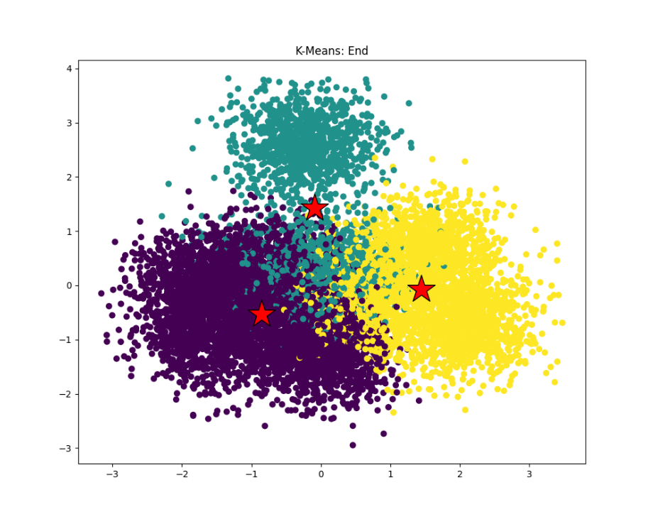

# Program 1: Parallel Fractal Generation Using Threads

8个CPU核，且没hyperthread。

```bash
./mandelbrot --threads 4
```

view1:

| numThreads | speedup |
| ---------- | ------- |
| 2          | 2.01    |
| 3          | 1.63    |
| 4          | 2.43    |
| 5          | 2.48    |
| 6          | 3.25    |
| 7          | 3.26    |
| 8          | 3.83    |
| 16         | 5.11    | 

```
Thread 0 finish work in 0.008 ms
Thread 7 finish work in 0.008 ms
Thread 6 finish work in 0.036 ms
Thread 1 finish work in 0.039 ms
Thread 2 finish work in 0.078 ms
Thread 5 finish work in 0.080 ms
Thread 3 finish work in 0.118 ms
Thread 4 finish work in 0.119 ms
```

view2:

```
Thread 5 finish work in 0.031 ms
Thread 2 finish work in 0.033 ms
Thread 6 finish work in 0.034 ms
Thread 3 finish work in 0.036 ms
Thread 4 finish work in 0.037 ms
Thread 7 finish work in 0.039 ms
Thread 1 finish work in 0.048 ms
Thread 0 finish work in 0.065 ms
```

**线程花费时间不均衡的原因是每一行的计算量是不固定的。**

线程轮流一行一行地取，这样可以做到几乎平均分配，但8线程最多加速6.62倍。

view1：

```
Thread 6 finish work in 0.064 ms
Thread 0 finish work in 0.065 ms
Thread 3 finish work in 0.070 ms
Thread 5 finish work in 0.076 ms
Thread 2 finish work in 0.095 ms
Thread 7 finish work in 0.104 ms
Thread 1 finish work in 0.108 ms
Thread 4 finish work in 0.111 ms
```

view2：

```
Thread 0 finish work in 0.039 ms
Thread 2 finish work in 0.041 ms
Thread 5 finish work in 0.042 ms
Thread 4 finish work in 0.045 ms
Thread 1 finish work in 0.045 ms
Thread 3 finish work in 0.047 ms
Thread 6 finish work in 0.053 ms
Thread 7 finish work in 0.051 ms
```

TODO：继续优化or换个平台

# Program 2: Vectorizing Code Using SIMD Intrinsics

`./myexp -s 3 -l`：

```
CLAMPED EXPONENT (required) 
Results matched with answer!
***************** Printing Vector Unit Execution Log *****************
 Instruction | Vector Lane Occupancy ('*' for active, '_' for inactive)
------------- --------------------------------------------------------
        vset | ****
        vset | ****
        vset | ****
        vset | ****
       vload | ***_
       vload | ***_
         veq | ***_
      vstore | ____
     masknot | ****
     maskand | ****
       vload | ***_
        vsub | ***_
         veq | ***_
     cntbits | ****
     cntbits | ****
     masknot | ****
     maskand | ****
       vmult | ***_
        vsub | ***_
         veq | ***_
     cntbits | ****
     masknot | ****
     maskand | ****
       vmult | ***_
        vsub | ***_
         veq | ***_
     cntbits | ****
     masknot | ****
     maskand | ****
       vmult | ***_
        vsub | ***_
         veq | ***_
     cntbits | ****
     masknot | ****
     maskand | ****
       vmult | ***_
        vsub | ***_
         veq | ***_
     cntbits | ****
     masknot | ****
     maskand | ****
       vmult | *___
        vsub | *___
         veq | *___
     cntbits | ****
         vgt | ***_
        vset | ***_
      vstore | ***_
****************** Printing Vector Unit Statistics *******************
Vector Width:              4
Total Vector Instructions: 48
Vector Utilization:        82.3%
Utilized Vector Lanes:     158
Total Vector Lanes:        192
************************ Result Verification *************************
Passed!!!
```

`./myexp -s 10000`：

```
Vector Width:              2
Total Vector Instructions: 224090
Vector Utilization:        84.8%
Utilized Vector Lanes:     379989
Total Vector Lanes:        448180
```

```
Vector Width:              4
Total Vector Instructions: 131862
Vector Utilization:        79.6%
Utilized Vector Lanes:     419627
Total Vector Lanes:        527448
```

```
Vector Width:              8
Total Vector Instructions: 72440
Vector Utilization:        76.9%
Utilized Vector Lanes:     445671
Total Vector Lanes:        579520
```

```
Vector Width:              16
Total Vector Instructions: 37950
Vector Utilization:        75.7%
Utilized Vector Lanes:     459527
Total Vector Lanes:        607200
```

vector长度过长的时候，很多指令（特别是count循环处）会有特别多空操作。

# Program 3: Parallel Fractal Generation Using ISPC

- This number of concurrent instances is available to the ISPC programmer via the built-in variable `programCount`.
- ISPC code can reference its own program instance identifier via the built-in `programIndex`.

```
view1 :
[mandelbrot serial]:            [211.409] ms
Wrote image file mandelbrot-serial.ppm
[mandelbrot ispc]:              [48.166] ms
Wrote image file mandelbrot-ispc.ppm
[mandelbrot multicore ispc]:    [27.243] ms
Wrote image file mandelbrot-task-ispc.ppm
                                (4.39x speedup from ISPC)
                                (7.76x speedup from task ISPC)

view2 :
[mandelbrot serial]:            [141.939] ms
Wrote image file mandelbrot-serial.ppm
[mandelbrot ispc]:              [34.262] ms
Wrote image file mandelbrot-ispc.ppm
[mandelbrot multicore ispc]:    [23.445] ms
Wrote image file mandelbrot-task-ispc.ppm
                                (4.14x speedup from ISPC)
                                (6.05x speedup from task ISPC)
```

我的CPU是i7-11代，支持支持AVX-512指令集。因此，没开启task时，ispc在单核内使用长度为8的向量进行运算，理想加速是八倍。但现实加速却没有那么多，因为向量计算需要同步，要等若干任务都完成了才能接着往下，但mandelbrot计算量极其不稳定，因此会浪费很多时间。

开启task后，不同的task可以在不同线程执行。

```ispc
// create taskNum tasks
launch[taskNum] mandelbrot_ispc_task(x0, y0, x1, y1,
								 width, height,
								 rowsPerTask,
								 maxIterations,
								 output); 
```

| taskNum | speedup |
| ------- | ------- |
| 2       | 7.76    |
| 4       | 11.26   |
| 8       | 15.71   |
| 16      | 19.96   |
| 80      | 20.88   |
| 400     | 22.76   | 
| 800     | 27.71   |

由于每个task依然跑的是连续的高度，所以也存在类似prog1一样的线程任务不均衡的问题。因此分较多份task会加强均衡性。

线程切换有代价，可测试中并未显现，因为task仅仅如foreach般声明任务可以被并发地任意次序执行，不会真创建了那么多线程。声明如此多的task后，ispc将这些task均匀地调度到每个线程上。

foreach（向量并发）和launch（线程并发）都是对独立的任务的调度，疑似完全可以只提供一种并发方法。但ispc提供了这两种，我的猜想是：
1. 一些体系结构的向量计算和并发之间代价相差较大，ispc可能无法发现。
2. 在本prog中，launch几乎意味着放弃空间局部性，在foreach维护行以内的连续性的同时，launch拆散每一行。
3. gpt3.5说：launch机制适用于那些需要在所有处理单元上执行相同操作的情况，而foreach机制适用于那些需要对数据集中的每个元素执行相同操作的情况。这种分离可以提供更高的灵活性和控制，使得ISPC可以更好地优化并行计算的性能。我的看法：launch确实是进行独立的函数调用而非去凑向量，操作的方向与纯向量是不同的。
# Program 4: Iterative `sqrt`


```
[sqrt serial]:          [754.042] ms
[sqrt ispc]:            [184.924] ms
[sqrt task ispc]:       [31.002] ms
                                (4.08x speedup from ISPC)
                                (24.32x speedup from task ISPC)
```

`values[i] = initialGuess;`后，计算仅仅只有abs，ispc仅优化了这一点计算，而其他性能消耗（如访存、必要的串行任务）都没有优化，因此加速并不多。
```
[sqrt serial]:          [15.674] ms
[sqrt ispc]:            [12.764] ms
[sqrt task ispc]:       [12.296] ms
                                (1.23x speedup from ISPC)
                                (1.27x speedup from task ISPC)
```

>**keep in mind we are using the `--target=avx2` option for ISPC, which generates 8-wide SIMD instructions**

将value初始化为initialGuess后，每八个元素里面就将一个元素设为2.999；这样的话，虽然serial的性能依旧很高，但ispc为了计算一个2.999，会让剩下的七个1等待，浪费时间。开启task之后加速比大于1仅仅是因为有八个线程，向量计算的效率依然很低。
```
[sqrt serial]:          [231.790] ms
[sqrt ispc]:            [310.936] ms
[sqrt task ispc]:       [53.491] ms
                                (0.75x speedup from ISPC)
                                (4.33x speedup from task ISPC)
```

TODO: 使用AVX2手写sqrt


# Program 5: BLAS `saxpy`


`saxpy` is a _trivially parallelizable computation_ and features predictable, regular data access and predictable execution cost.（mandelbrot是不可预测计算成本的）

```
[saxpy ispc]:           [14.143] ms     [21.072] GB/s   [2.828] GFLOPS
[saxpy task ispc]:      [17.155] ms     [17.372] GB/s   [2.332] GFLOPS
                                (0.82x speedup from use of tasks)
```

此程序的瓶颈是内存而非计算。单核就已经几乎花费大部分时间在读写内存，那么即使开多线程也没法提升多少，甚至增加了切换线程的代价。另外，由于数组很长，每个task要处理的数据的跨度会非常大，对cache不友好。

因此少开task反而可以减少线程切换代价、增强空间局部性，提升效率。开两个task时：
```
[saxpy ispc]:           [13.467] ms     [22.130] GB/s   [2.970] GFLOPS
[saxpy task ispc]:      [13.670] ms     [21.802] GB/s   [2.926] GFLOPS
                                (0.99x speedup from use of tasks)
```

内存访问的瓶颈也可以通过更好地运用cache来解决。尝试已失败。

四次内存操作是因为：读一次x，读一次y，读一次result（只放进cache），写一次result（cache写回到内存）。


# Program 6: Making `K-Means` Faster

**isolating a performance hotspot**

main里面提供了代码可以生成本地的数据文件。

题目规定只能并发化一个函数。

初始代码结果：
```
Reading data.dat...
Running K-means with: M=1000000, N=100, K=3, epsilon=0.100000
[Total Time]: 10938.367 ms
```

计时结果：
```
Reading data.dat...
Running K-means with: M=1000000, N=100, K=3, epsilon=0.100000
[computeAssignments Time]: 9680.297 ms
[computeCentroids Time]: 1265.477 ms
[computeCost Time]: 2084.194 ms
[dist Time]: 6063.137 ms
[Total Time]: 13030.091 ms
```



computeAssignments具有较大的优化潜力，且将其做成并发应当是比dist粒度更大，减少线程创建、清除、切换的开销。

`Assign datapoints to closest centroids`的两层for循环是可以反转的。里面只有对数组下标m的写入，只要线程之间不共用m即可。因此要基于m进行并发。采用prog1的解决方案，使用`for (int m = arg->threadId; m < arg->wockerArgs->M; m+=arg->numThreads)`来分配m范围，使得任务分配均衡。

```
Reading data.dat...
Running K-means with: M=1000000, N=100, K=3, epsilon=0.100000
[Total Time]: 5175.655 ms
```

得到加速比为2.11。# Assignment 2: Building A Task Execution Library from the Ground Up