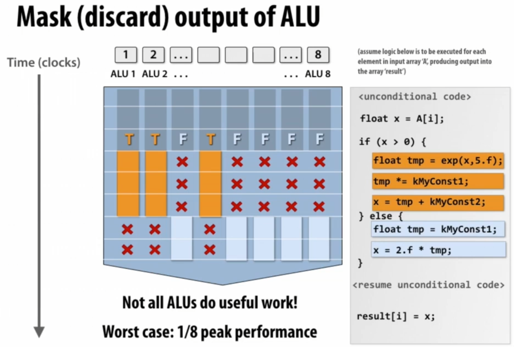
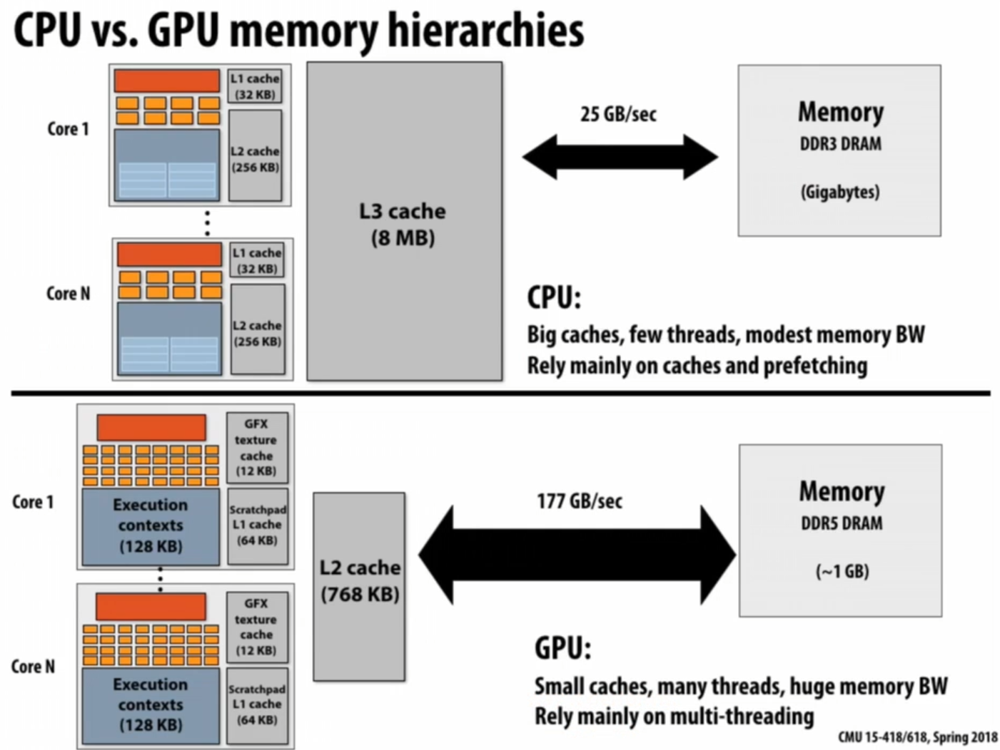
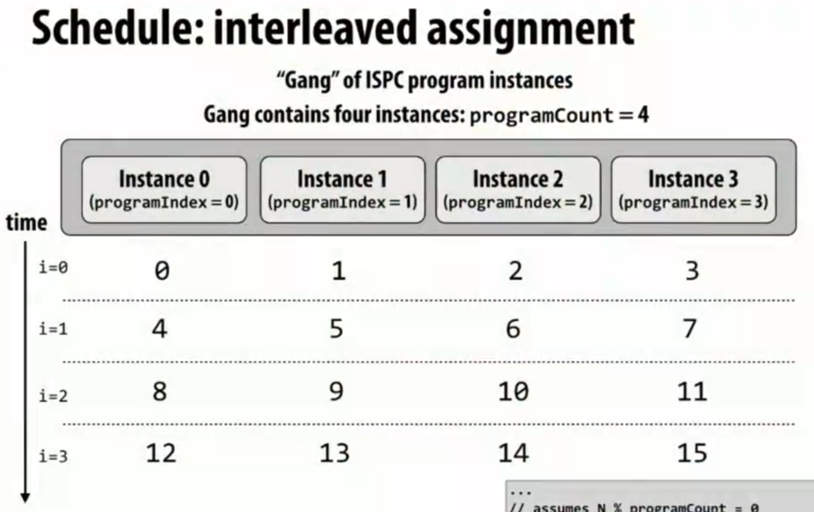
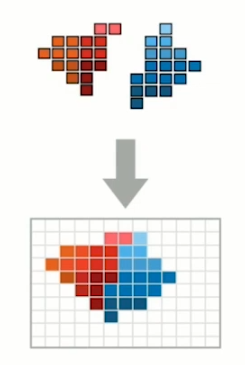

# 基础

A **parallel computer** is <u>a collection of</u> **processing elements** that <u>cooperate</u> to solve problems <u>quickly</u>

加速比定义：
$$speedup_P=\frac{execute\_time_{1}}{execute\_time_{P}}$$ 

# Lec2 Modern Multicore Processor

ILP: Instruction Level Parallelism

vector: 例如，把八个数据和其他地方的八个数据加在一起生成八个数据，则称数据被聚合为向量。

比如，要对一个数组的每一项都完全独立地执行一个操作，则可以让八个元素一起被拿出来，然后一起被执行一样的流程操作。

SIMD扩展（AVX intrinsics）：对advanced vector的支持。xmm寄存器是特殊的256bit（32Byte）寄存器，有完全不同的指令集。

>SIMD(Single Instruction Multiple Data)（读作same D）即单指令流多数据流，是一种采用一个控制器来控制多个处理器，同时对一组数据（又称“数据向量”）中的每一个分别执行相同的操作从而实现空间上的并行性的技术。简单来说就是一个指令能够同时处理多个数据。

>ps = pack single


当各个数据的操作存在分支，即操作方式不一样时，可以使用mask来实现分支，“X”表示当前不对该数据进行操作。



- converge: 都做同一件事，从而能最大利用。SIMD追求converge。
- diverge: 分歧。

- **explicit SIMD**: SIMD parallelization is performed at compile time. Can inspect program binary and see instructions(vstoreps,vmulps,etc.)
- **Implicit SIMD**:
	- Compiler generates a scalar binary(scalar instructions). 
	- But N instances of the program are always run together on the processor. `execute(my_function,N); //execute my_function N times`
	- In other words,the interface to the hardware itself is data-parallel.
	- Hardware(not compiler)is responsible for simultaneously executing the same instruction from multiple instances on different data on SIMD ALUs

SIMD width: 可处理的数据量（不是字节数），8~32，一般为32。

stall: 发生数据相关时，会导致运行暂停。而stall的来源的大头是内存访问。内存传输过慢，会生成较大的latency。而cache可以减少暂停的时间（latency）。**prefetch**将数据提前放到cache里面也可以减少stall。

使用**multi-threading**可以在不同thread的stall期间执行其他thread的指令；可以直接在cache-L1里面存thread execution context；线程多的时候hide stall的能力会更强。`hyper-threading`: CPU给多个线程分配不同的寄存器组，实现无需上下文切换的多线程。

Execution Unit用于根据相关性协调决定多个thread的运作方式（顺序）：


GPU尽力拉高吞吐量，来hide latency，达成极高的并发度；缩小cache来把更多空间用于ALU。



# Lec3 Parallel Programming Abstractions

## ISPC (Intel SPMD Program Compiler)

- ISPC: Intel SPMD Program Compiler，一种语言
- SPMD: single program multiple data，同代码块不同数据
- http://ispc.github.com/

**ISPC会编译出SIMD指令**。SPMD是model，SIMD是implement。由于使用SIMD来增加并发性，因此实际上是单线程的。

每次调用函数的时候，ISPC都会创建“并发”任务。


ISPC Keywords:
**programCount**: number of simultaneously executing instances in the gang(uniform value). 决定了并发量。
**programIndex**: id of the current instance in the gang.(a non-uniform value:"varying"). 并发的每个程序（instance）都具有不同的programIndex。$[0,programCount)$
**uniform**: A type modifier.All instances have the same value for this variable.Its use is purely an optimization.Not needed for correctness. 标记对并发的每个程序都等同的变量，用于优化。

### interleaved & blocked

**interleaved assignment**: 每个instance的任务是分散的，因此并发时，每个instance完成一个任务后，得到的结果是连续的。（是上面的ISPC代码所决定的）



**blocked assignment**: 每个instance的任务是连续的，但并发的所有instance的第一个任务是分散的。


**interleaved比blocked更优越**，因为它每次都会得到**连续的结果**，而SIMD会把这结果放进**向量寄存器**，如果寄存器内数据是连续的话可以增加效率。blocked需要存储不连续的向量，会消耗更多CPU周期。（blocked看起来对cache更友好，但由于ISPC仅仅是单线程，因此无大用）

### foreach

普通的for循环是imperative，描述如何分配任务；而foreach是declarative，仅仅描述任务的集合。

可以直接使用foreach，将interleaved & blocked的选择交给编译器：


### reduction

求和时，因为结果是共享、可写的，因此标为uniform会编译出错。

解决方法：定义非uniform的partial变量（这会导致foreach出来的所有instance都具有私有、独立的partial。计算完毕后，调用reduce_add就可以将各个instance的partial给加起来）。


## Three Model


Use shared address space programming within a multi-core node of a cluster,use message passing between nodes

### Shared address space model

**Symmetric(shared-memory) multi-processor(SMP)**:
- Uniform memory access time: cost of accessing an uncached 
- memory address is the same for all processors
- **low scalability**


**Non-uniform memory access (NUMA)**: 
- All processors can access any memory location
- the cost of memory access (latency and/or bandwidth) is **different** for different processors
- **high scalability**
- 处理器旁边就有Memory，同时也能较高延迟地访问其他内存


NUMA可以在本地保存运行栈等其他处理器不需要的数据，同时在并发的时候其他处理器不处理的数据也能完全放在本地执行。

### Message passing model

两个线程独立运行，有自己的私有空间，互相之间唯一的交流方式是send/receive message。

MPI: message passing interface

不要求机器实现共享l/s功能，只需要能传递消息。可以用于大型机间传递信息。

### Data-parallel model

**Basic structure**: map a function onto a large collection of data
- Functional:side-effect free execution
- No communication among distinct function invocations (allow invocations to be scheduled in any order,including in parallel)

以前是用vector运算，但现在都是SPMD了。

ISPC中，编程可能会出现不确定性（并行的instance的结果写在同一个地方）。因此要使用更正规的编程方式来避免这些谬误。

functional form: **stream programing model**
- Streams:collections of elements. Elements can be processed independently.
- Kernels:side-effect-free functions. Operate element-wise on collections.


但有一个缺点是，中间这个tmp流在处理过程中不一定有必要，当过程太多的时候可能会需要创建极多的流，造成浪费。最好可以有某种方式把foo和bar整合起来。

gather修改取值来源逻辑，scatter修改赋值目标逻辑。indices是索引流，表示数据位置，将input的按照索引重排列为tmp_input以load，或将output重排列为tmp_input以store，且不发生复制。


# Lec4 Parallel Programming Basics

## Create a parallel program


### Decomposition

要追求获得足够多足够小的task，以在多线程时可以通过调度来让整个机器保持忙碌。

因为Amdahl定律，一定要将大部分复杂任务全都通过并行加速，只留下简单的任务进行串行，否则加速比不会很大。

### Assignment

目标是：
1. 平衡工作压力
2. 减少通信成本

没用foreach的普通的ISPC（programmer-managed assignment）就是**static assignment**；但使用了foreach之后，具体调度交给运行时判断（system-managed assignment），因此是**dynamic assignment**。

ISPC也有一种task分配法，维护task数组，和一个下标，当有worker完成任务时，就会从task数组的下标处领取新任务，然后下标会自增。虽然这很好地实现了负载平衡，但队列本身需要大量的软件开销。这种方法叫**work queue**。


### Orchestration

Involve：
- Structuring communication
- Adding synchronization to preserve dependencies if necessary
- Organizing data structures in memory
- Scheduling tasks

Goals: reduce costs of communication/sync, preserve locality of data reference,reduce overhead,etc.

### Mapping

把worker（thread）分配给硬件单元。可以由os、编译器、硬件来分配。


## example: grid solver

要求把一个矩阵中每个点的上下左右一起求平均数作为当前点的新值，若所有点的新旧值之差的绝对值的平均数少于阈值，则结束程序。由于是图像处理算法因此不要求精确结果。如果全部并发跑的话，会导致数据竞争。

复制一份的方法不被接受，因为数据几乎被严禁复制一份。

一种分离依赖的方法是，同一个对角线上的点不会互相依赖。但这样长短不一非常难以调度，且会出现空间局部性的破坏。


将矩阵分为独立的两个部分，同一个部分内完全都可任意调度，红黑两阶段轮流进行。但也需要barrier来让两阶段分离。


所有thread完成当前阶段后，互相交流更新的结点（此处将各个线程的内存看做独立），然后才能切换阶段。


同一个阶段内的任务分配也有多种。而线程切割线旁边的点会在阶段切换时在不同的线程间交流。


### data-parallel

对红点（或黑点）条件使用for_all，让一个阶段的所有点可以被程序任意地并发调度，无需再理会细节。

### shared address space

需要注意barrier的实现。有三个barrier，作用分别是：
1. 确保对diff的重置完成前没有意外的写入。
2. 确保diff已经收集到所有的myDiff。
3. 防止领先的线程直接进入下个循环将diff置为0，导致后来的线程认为diff足够小，结果将done置为true了。


如果将diff设置为三个，每次只用其中一个，这样的话下一次循环的初始化会提前完成，与目前的读写完全互不干扰，从而可以减少两个barrier。如果只弄两个的话，有可能导致有领先的线程直接跑到了下一轮的初始化位置，把当前任务给初始化掉了。


### message passing

每个线程的内存私有性加强了，无法随意r/l数据了。矩阵被分为多份，且没有重复部分。

那么，为了让边缘点能够被计算，则需要互相发送数据。


但交换数据的一个问题是，阻塞式IO可能造成死锁，可能发送与接收无法匹配。因此，可以让奇数都发送，偶数都接收，完成之后再反过来；或者使用非阻塞IO。


# Lec5 Work Distribution and Scheduling (Performance Optimization P1)

目标：
1. balance workload
2. reduce communication
3. reduce extra work

TIP 1: Always implement the simplest solution first, then measure performance to determine if you need to do better.

static assignment要求任务的数量和执行时间是可预计的，从而能提前估计、分配。

dynamic assignment中，work queue方法被归类为**fine granularity partitioning**（1"task"=1 element）。这样可以非常好地负载均衡，但同步的开销很大（锁）。一种优化方式是Increasing task granularity，每次都同时领取多个任务，增加粒度，从而减少锁开销，但会降低负载均衡能力，因此需要权衡。

若work queue中每个task大小不一，那么，优先分配大任务是最好的，因为这样分配到最后的时候，各线程的任务差距就不会很大，不会发生到末尾的时候一个线程突然领了个特别大的任务的情况。

Distributed work queues：每个线程都有自己的work queue。刚开始时进行粗略的直接分配，当一个线程跑完自己的任务后，就可以从别人的队列steal任务。依然有锁逻辑，但由于大部分情况下只有thread自己在用锁，使得实际上锁的消耗几乎没有。不过steal的目标是谁、steal多少任务依旧是个问题。


当task之间存在依赖性时，在一个task的所有依赖被满足（如指定的若干个task全部完成）之前，不会离开队列，即不会分配给worker。

## Fork-join parallelism (Cilk Plus)

Fork-join parallelism: a natural way to express divide-and-conquer algorithms.

Cilk Plus: runtime implements spawn/sync abstraction with a locality-aware work stealing scheduler. 是对Cpp的一种拓展。

- `cilk_spawn`(fork): 加在函数调用的前面，使得该函数会异步执行（potential parallelism）（但究竟如何异步是运行时环境决定的）。
- `cilk_sync`(join): 阻塞，直到当前函数所有的`cilk_spawn`都结束。所有函数调用在return前都隐式执行`cilk_sync`。

多线程执行任务的时候，要注意不浪费主线程（第二种代码是不推荐的）：


并发快排时，我们应该在任务足够小时不再进行并发（PARALLEL_CUTOFF），而是串行执行。


具体实现中，若有太多太多的异步任务的话，全都并发执行是有极大副作用的。**parallel slack**: ratio of independent work to machine's parallel execution capability (in practice:~8 is a good ratio).

### child & continuation

```cpp
cilk_spawn foo();
bar();
cilk_sync;
```

- spawn child: `foo()`。
- continuation: `bar(); cilk_sync;`及之后的剩余部分。

上面的程序执行的时候，若采用child first策略，则当thread_0执行到`cilk_spawn foo();`时，则会开始执行foo，并且将continuation（bar）放入work queue；thread_1无事可做，就会从thread_0的work queue里窃取continuation去执行。


>Cilk选用child first。
### 循环

当continuation first时，在偷窃发生之前，会一直执行循环，直到把所有任务都放进queue里面。空间复杂度较高。类似BFS。执行顺序相比于串行会被打乱。


当child first时，本地会执行foo，然后将循环的条件放入work queue；其他线程窃取该循环条件（或者原线程执行完毕）后，才会继续执行新的任务。queue里面永远最多只有一个任务。类似DFS。


### 递归

分治法的时候，队列顶（上）到底（下）的任务规模会逐渐变小。显然偷走大的任务会提高效率，因此窃取策略是从顶部窃取。


### sync

当所有spawn结束后，最后谁来负责统计和继续执行也是个问题。

如果记录里面没有任何其他worker窃取过自己，则可以认为sync时不需要做任何事，自己做完了等于所有人都做完了。
#### stalling join policy

stalling join策略将一个数据结构放在thread_0里，其他线程spawn或done时会通知它，于是thread_0可以统计被spawn了多少次、done了多少个。全部完成后thread_0就可以直接知道sync已完成，继续执行。


#### greedy policy

把数据结构放到work queue中。所有线程只要还空闲就会尝试窃取，并修改其spawn和done。谁窃取到时发现全部完成了，则这个线程自发结束sync，并往下继续执行。

>Cilk选用greedy policy。


# Recitation 1-ILP.SIMD instructions

乘法很耗时，除法更耗时。

尽量把loop中的重复计算给提取出来。

可以使用strace，来看看系统调用是不是频繁在申请内存，可以用于观察内存泄漏或不合理使用。

loop本身也开销极大，因为每次循环都需要检测一次条件，然而实际有意义的只有最后一次。循环展开（loop unrolling）可以缓解此问题，但循环展开后指令长度过长，使得instruction cache不够用，即空间局部性差。

编译器会做很多事情，如循环展开、SIMD，但某些情况下编译器无法认知到独立性，从而难以进行优化。当我们做最简实现的时候，可以查看汇编代码，看看编译器已经做了什么。

把能提取的都提取出来，甚至另起炉灶多来个for循环来储存中间值，这样会使得有更多变量可以设为uniform。

# Lec6 Graphic Processing Utils and CUDA

## graphics pipeline


- **Input, Vertex Generation**: a list of vertices in 3D space (and their connectivity into primitives). 根据点集，每三个vertices（vertex的复数）构成一个triangle


- **Step 1, Vertex Processing**: given a scene camera position, compute where the vertices lie on screen.

- **Step 2, Primitive Generation**: group vertices into primitives.


**Step 3, Fragment Generation**: generate one fragment for each pixel a primitive overlaps.


**Step 4, Fragment Processing**: compute color of primitive for each fragment(based on scene lighting and primitive material properties).

**Step 5, Pixel Operations**: put color of the "closest fragment"
to the camera in the output image.



Vertex Processing 和 Fragment Processing都可以插入用户程序shader来改变渲染逻辑。


## CUDA


CUDA的thread抽象和p thread的thread很像，但二者的具体实现非常不同。

较高层面上，CUDA像是data parallel计算模型，每个thread对不同data进行计算。

### block

Grid是thread的点阵，每个thread被赋予一个三维的编号（下面例子是二维的），高维的编号更易进行问题的计算。若干的相邻thread会被划分为一个block，每个block也有对应维数的编号。

>高维是由CUDA支持的。


使用CPU代码（**Host代码**）对待处理的问题进行划分。如矩阵相加，根据块大小来划分任务，然后使用**thread launch**（`<<< ... >>>`）调用GPU代码（**Device代码**）。GPU代码（kernel function，使用`__global__`声明）可以通过block编号以及block中线程的编号来计算得到对应线程所负责的任务。


block对硬件来说是virtual的，是CUDA语言的一种抽象，但实际上反映出其对GPU的调用方式。Block大小不能超过1024。

>GPU丢弃了CPU那些让单核运行更快的技术，如分支预测、乱序执行、大量cache，把这些丢弃后更容易进行高并发的各种简单计算，能耗低。


有可能矩阵尺寸并不是block大小的整数倍，因此有些非法数据。此时只要**不对外进行赋值即可**，内部计算了也不会有事：


>Block的思想结构能帮助我们的对其的编程。

CUDA的模型是SPMD（Single Program Multiple Data），即单一的kernel code被多个thread调用。

block的数量是无限的，就好像GPU有无限的单元一样，这给予了我们非常纯粹的data parallel抽象。但实际上的调用并不是这样的，GPU是有限的。

### memory

CPU和GPU有不同的地址空间。再加上并发模型不同，因此很难进行shared memory。


如果device要访问host的数据，则需要显式地进行`cudaMemcpy`。


>从`cudaMalloc`可以看出新式的c库函数风格：传入一个指针作为结果放置的位置，而函数的返回值用于指示是否调用成功。

CUDA的内存有三种：
1. 公共内存 **Device global memory**: 全员可访问。
2. block私有内存 **Per-block shared memory**: block内所有线程可访问。
3. 线程私有内存 **Per-thread private memory**: 单线程自己可访问。

三层的内存机制形成了**software cache**，可以通过程序指定哪些数据放在哪里。


### 例子

卷积操作，将相邻的三个元素加到一起。

>所有在函数内直接定义的变量都是per-thread private memory。

下面代码的输入和输出都来自于device global memory，没有利用cache，效率低。


可以使用`__shared__`来修饰变量的定义，以在per-block shared memory上创建变量。

block内的每个线程都负责从global载入一个元素到block中（要额外加载两个）。使用`__syncthreads()`来确保加载完毕，之后就能自由使用support数组了。


### synchronization


各个block类似于ISPC的for_all，即可以以任意顺序调度。但thread之间有同步操作，有较强的数据相关（使用per-block shared memory），因此不太能任意调度。
### CUDA abstractions


### assignment

block数量可以是无限的，但GPU资源是有限的，因此GPU需要进行assignment。

CUDA将每个block（被视为一个work）分配给每个GPU计算单元，使用动态分配。


### 现实显卡

2014年的NVIDIA GTX 980使用了Warp技术，将任务状态保存在各个warp中，每次都会调用可执行的任务放到ALU中去执行（一个thread如果在读取内存的话，可能就会切换另一个warp去执行）。


# Recitation 2-CUDA programming 1