CMU 15-418 Parallel Computer Architecture and Programming **sp18**
# 基础

A **parallel computer** is <u>a collection of</u> **processing elements** that <u>cooperate</u> to solve problems <u>quickly</u>

加速比定义：
$$speedup_P=\frac{execute\_time_{1}}{execute\_time_{P}}$$ 

# Lec 2 - Modern Multicore Processor

ILP: Instruction Level Parallelism

vector: 例如，把八个数据和其他地方的八个数据加在一起生成八个数据，则称数据被聚合为向量。

比如，要对一个数组的每一项都完全独立地执行一个操作，则可以让八个元素一起被拿出来，然后一起被执行一样的流程操作。

SIMD扩展（AVX intrinsics）：对advanced vector的支持。xmm寄存器是特殊的256bit（32Byte）寄存器，有完全不同的指令集。

>SIMD(Single Instruction Multiple Data)（读作same D）即单指令流多数据流，是一种采用一个控制器来控制多个处理器，同时对一组数据（又称“数据向量”）中的每一个分别执行相同的操作从而实现空间上的并行性的技术。简单来说就是一个指令能够同时处理多个数据。

>ps = pack single


当各个数据的操作存在分支，即操作方式不一样时，可以使用mask来实现分支，“X”表示当前不对该数据进行操作。


- converge: 都做同一件事，从而能最大利用。SIMD追求converge。
- diverge: 分歧。

- **explicit SIMD**: SIMD parallelization is performed at compile time. Can inspect program binary and see instructions(vstoreps,vmulps,etc.)
- **Implicit SIMD**:
	- Compiler generates a scalar binary(scalar instructions). 
	- But N instances of the program are always run together on the processor. `execute(my_function,N); //execute my_function N times`
	- In other words,the interface to the hardware itself is data-parallel.
	- Hardware(not compiler)is responsible for simultaneously executing the same instruction from multiple instances on different data on SIMD ALUs

SIMD width: 可处理的数据量（不是字节数），8~32，一般为32。

stall: 发生数据相关时，会导致运行暂停。而stall的来源的大头是内存访问。内存传输过慢，会生成较大的latency。而cache可以减少暂停的时间（latency）。**prefetch**将数据提前放到cache里面也可以减少stall。

使用**multi-threading**可以在不同thread的stall期间执行其他thread的指令；可以直接在cache-L1里面存thread execution context；线程多的时候hide stall的能力会更强。`hyper-threading`: CPU给多个线程分配不同的寄存器组，实现无需上下文切换的多线程。

Execution Unit用于根据相关性协调决定多个thread的运作方式（顺序）：


GPU尽力拉高吞吐量，来hide latency，达成极高的并发度；缩小cache来把更多空间用于ALU。


# Lec 3 - Parallel Programming Abstractions

## ISPC (Intel SPMD Program Compiler)

- ISPC: Intel SPMD Program Compiler，一种语言
- SPMD: single program multiple data，同代码块不同数据
- http://ispc.github.com/

**ISPC会编译出SIMD指令**。SPMD是model，SIMD是implement。由于使用SIMD来增加并发性，因此实际上是单线程的。

每次调用函数的时候，ISPC都会创建“并发”任务。


ISPC Keywords:
**programCount**: number of simultaneously executing instances in the gang(uniform value). 决定了并发量。
**programIndex**: id of the current instance in the gang.(a non-uniform value:"varying"). 并发的每个程序（instance）都具有不同的programIndex。$[0,programCount)$
**uniform**: A type modifier.All instances have the same value for this variable.Its use is purely an optimization.Not needed for correctness. 标记对并发的每个程序都等同的变量，用于优化。

### interleaved & blocked

**interleaved assignment**: 每个instance的任务是分散的，因此并发时，每个instance完成一个任务后，得到的结果是连续的。（是上面的ISPC代码所决定的）


**blocked assignment**: 每个instance的任务是连续的，但并发的所有instance的第一个任务是分散的。


**interleaved比blocked更优越**，因为它每次都会得到**连续的结果**，而SIMD会把这结果放进**向量寄存器**，如果寄存器内数据是连续的话可以增加效率。blocked需要存储不连续的向量，会消耗更多CPU周期。（blocked看起来对cache更友好，但由于ISPC仅仅是单线程，因此无大用）

### foreach

普通的for循环是imperative，描述如何分配任务；而foreach是declarative，仅仅描述任务的集合。

可以直接使用foreach，将interleaved & blocked的选择交给编译器：
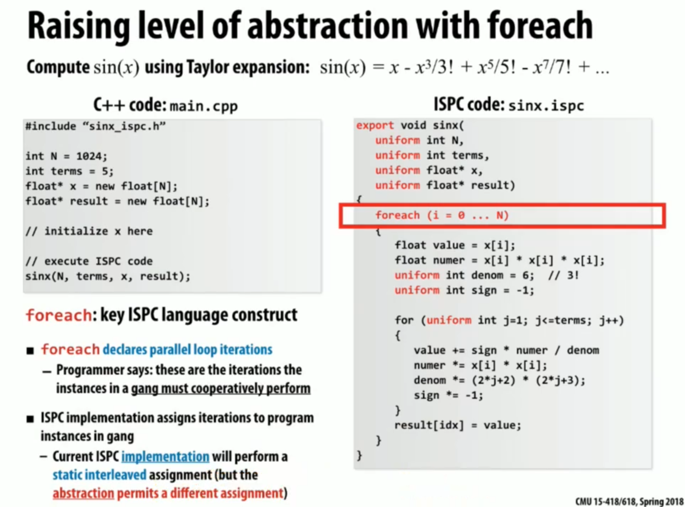

### reduction

求和时，因为结果是共享、可写的，因此标为uniform会编译出错。

解决方法：定义非uniform的partial变量（这会导致foreach出来的所有instance都具有私有、独立的partial。计算完毕后，调用reduce_add就可以将各个instance的partial给加起来）。


## Three Model


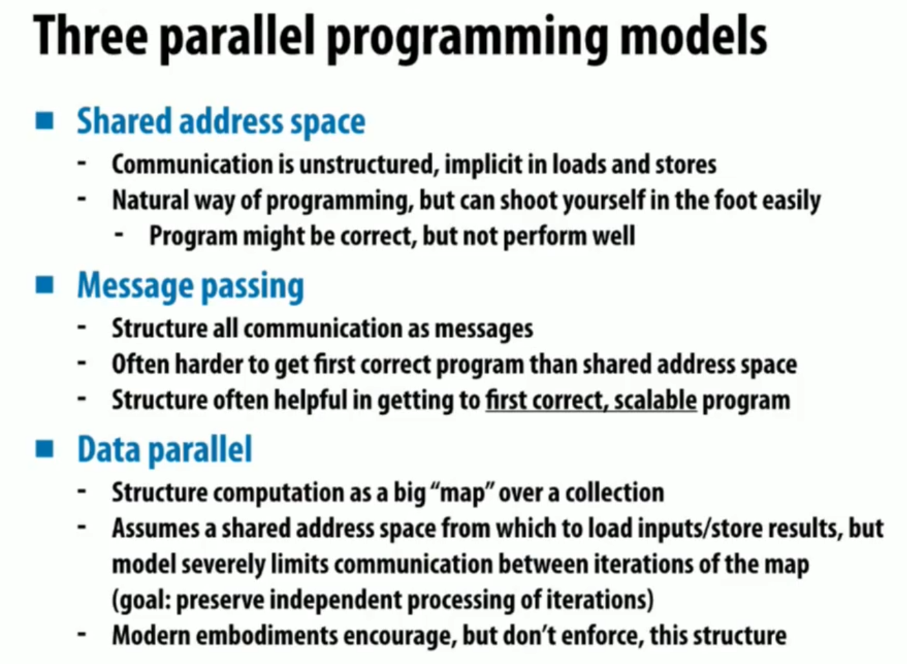

Use shared address space programming within a multi-core node of a cluster,use message passing between nodes

### Shared address space model

**Symmetric(shared-memory) multi-processor(SMP)**:
- Uniform memory access time: cost of accessing an uncached 
- memory address is the same for all processors
- **low scalability**

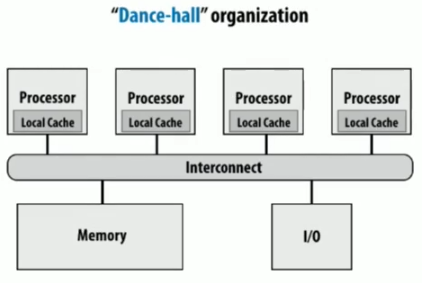


**Non-uniform memory access (NUMA)**: 
- All processors can access any memory location
- the cost of memory access (latency and/or bandwidth) is **different** for different processors
- **high scalability**
- 处理器旁边就有Memory，同时也能较高延迟地访问其他内存

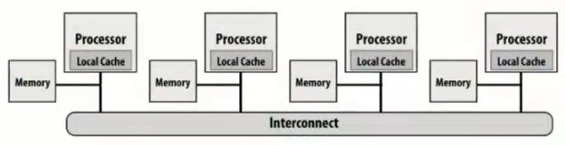

NUMA可以在本地保存运行栈等其他处理器不需要的数据，同时在并发的时候其他处理器不处理的数据也能完全放在本地执行。

> [!info]
> 普通的计算机也有**NUMA性质**, 体现在cache上. 但真正的NUMA计算机必须是体现在内存上.

### Message passing model

两个线程独立运行，有自己的私有空间，互相之间唯一的交流方式是send/receive message。

MPI: message passing interface

不要求机器实现共享l/s功能，只需要能传递消息。可以用于大型机间传递信息。

### Data-parallel model

**Basic structure**: map a function onto a large collection of data
- Functional:side-effect free execution
- No communication among distinct function invocations (allow invocations to be scheduled in any order,including in parallel)

以前是用vector运算，但现在都是SPMD了。

ISPC中，编程可能会出现不确定性（并行的instance的结果写在同一个地方）。因此要使用更正规的编程方式来避免这些谬误。

functional form: **stream programing model**
- Streams:collections of elements. Elements can be processed independently.
- Kernels:side-effect-free functions. Operate element-wise on collections.


但有一个缺点是，中间这个tmp流在处理过程中不一定有必要，当过程太多的时候可能会需要创建极多的流，造成浪费。最好可以有某种方式把foo和bar整合起来。

- gather: 修改取值来源逻辑（将多地的数据给聚到一起）。
- scatter: 修改赋值目标逻辑（将数据放到buffer里然后分配到不同的地方）。

indices是索引流，表示数据位置，将input的按照索引重排列为tmp_input以load，或将output重排列为tmp_input以store，且不发生复制。


# Lec 4 - Parallel Programming Basics

## Create a parallel program

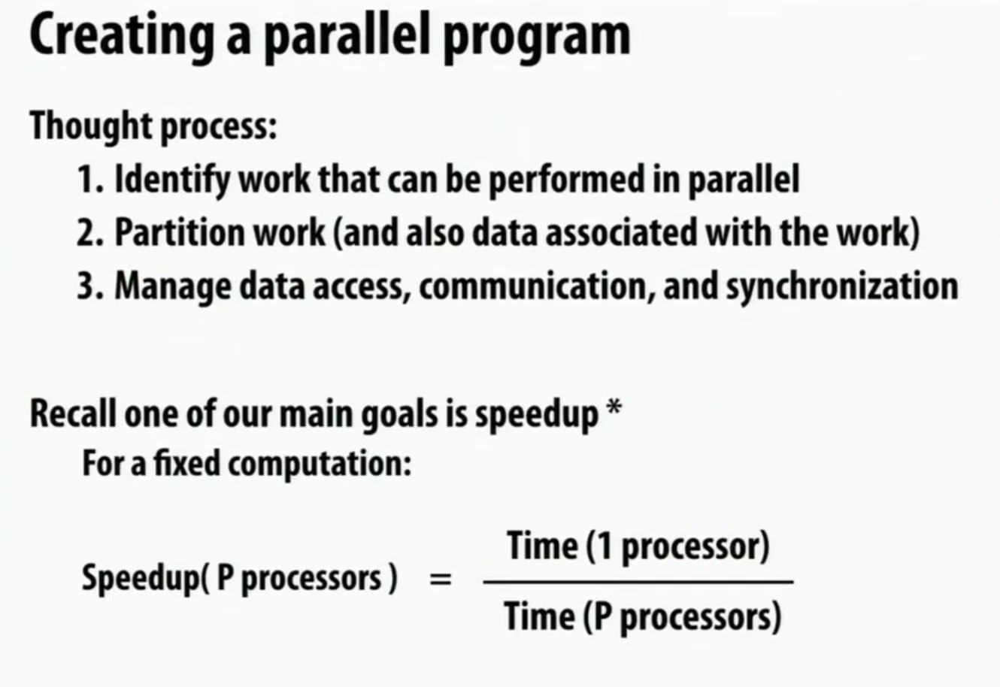


### Decomposition

要追求获得足够多足够小的task，以在多线程时可以通过调度来让整个机器保持忙碌。

因为Amdahl定律，一定要将大部分复杂任务全都通过并行加速，只留下简单的任务进行串行，否则加速比不会很大。

### Assignment

目标是：
1. 平衡工作压力
2. 减少通信成本

没用foreach的普通的ISPC（programmer-managed assignment）就是**static assignment**；但使用了foreach之后，具体调度交给运行时判断（system-managed assignment），因此是**dynamic assignment**。

ISPC也有一种task分配法，维护task数组，和一个下标，当有worker完成任务时，就会从task数组的下标处领取新任务，然后下标会自增。虽然这很好地实现了负载平衡，但队列本身需要大量的软件开销。这种方法叫**work queue**。


### Orchestration

Involve：
- Structuring communication
- Adding synchronization to preserve dependencies if necessary
- Organizing data structures in memory
- Scheduling tasks

Goals: reduce costs of communication/sync, preserve locality of data reference,reduce overhead,etc.

### Mapping

把worker（thread）分配给硬件单元。可以由os、编译器、硬件来分配。


## example: grid solver

要求把一个矩阵中每个点的上下左右一起求平均数作为当前点的新值，若所有点的新旧值之差的绝对值的平均数少于阈值，则结束程序。由于是图像处理算法因此不要求精确结果。如果全部并发跑的话，会导致数据竞争。

复制一份的方法不被接受，因为数据几乎被严禁复制一份。

一种分离依赖的方法是，同一个对角线上的点不会互相依赖。但这样长短不一非常难以调度，且会出现空间局部性的破坏。


将矩阵分为独立的两个部分，同一个部分内完全都可任意调度，红黑两阶段轮流进行。但也需要barrier来让两阶段分离。
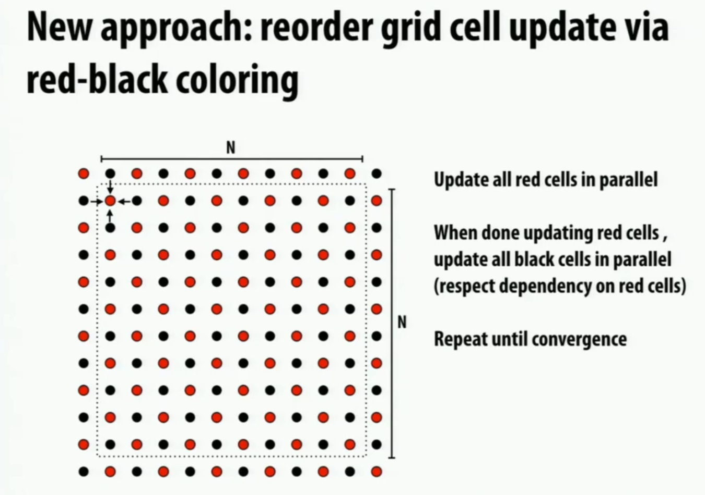

所有thread完成当前阶段后，互相交流更新的结点（此处将各个线程的内存看做独立），然后才能切换阶段。
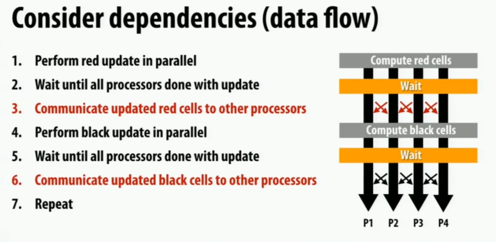

同一个阶段内的任务分配也有多种。而线程切割线旁边的点会在阶段切换时在不同的线程间交流。


### data-parallel

对红点（或黑点）条件使用for_all，让一个阶段的所有点可以被程序任意地并发调度，无需再理会细节。

### shared address space

需要注意barrier的实现。有三个barrier，作用分别是：
1. 确保对diff的重置完成前没有意外的写入。
2. 确保diff已经收集到所有的myDiff。
3. 防止领先的线程直接进入下个循环将diff置为0，导致后来的线程认为diff足够小，结果将done置为true了。


如果将diff设置为三个，每次只用其中一个，这样的话下一次循环的初始化会提前完成，与目前的读写完全互不干扰，从而可以减少两个barrier。如果只弄两个的话，有可能导致有领先的线程直接跑到了下一轮的初始化位置，把当前任务给初始化掉了。


### message passing

每个线程的内存私有性加强了，无法随意r/l数据了。矩阵被分为多份，且没有重复部分。

那么，为了让边缘点能够被计算，则需要互相发送数据。


但交换数据的一个问题是，阻塞式IO可能造成死锁，可能发送与接收无法匹配。因此，可以让奇数都发送，偶数都接收，完成之后再反过来；或者使用非阻塞IO。


# Lec 5 - Performance Optimization P1: Work Distribution and Scheduling

目标：
1. balance workload
2. reduce communication
3. reduce extra work

TIP 1: Always implement the simplest solution first, then measure performance to determine if you need to do better.

static assignment要求任务的数量和执行时间是可预计的，从而能提前估计、分配。

dynamic assignment中，work queue方法被归类为**fine granularity partitioning**（1"task"=1 element）。这样可以非常好地负载均衡，但同步的开销很大（锁）。一种优化方式是Increasing task granularity，每次都同时领取多个任务，增加粒度，从而减少锁开销，但会降低负载均衡能力，因此需要权衡。

若work queue中每个task大小不一，那么，优先分配大任务是最好的，因为这样分配到最后的时候，各线程的任务差距就不会很大，不会发生到末尾的时候一个线程突然领了个特别大的任务的情况。

Distributed work queues：每个线程都有自己的work queue。刚开始时进行粗略的直接分配，当一个线程跑完自己的任务后，就可以从别人的队列steal任务。依然有锁逻辑，但由于大部分情况下只有thread自己在用锁，使得实际上锁的消耗几乎没有。不过steal的目标是谁、steal多少任务依旧是个问题。


当task之间存在依赖性时，在一个task的所有依赖被满足（如指定的若干个task全部完成）之前，不会离开队列，即不会分配给worker。

## Fork-join parallelism (Cilk Plus)

Fork-join parallelism: a natural way to express divide-and-conquer algorithms.

Cilk Plus: runtime implements spawn/sync abstraction with a locality-aware work stealing scheduler. 是对Cpp的一种拓展。

- `cilk_spawn`(fork): 加在函数调用的前面，使得该函数会异步执行（potential parallelism）（但究竟如何异步是运行时环境决定的）。
- `cilk_sync`(join): 阻塞，直到当前函数所有的`cilk_spawn`都结束。所有函数调用在return前都隐式执行`cilk_sync`。

多线程执行任务的时候，要注意不浪费主线程（第二种代码是不推荐的）：
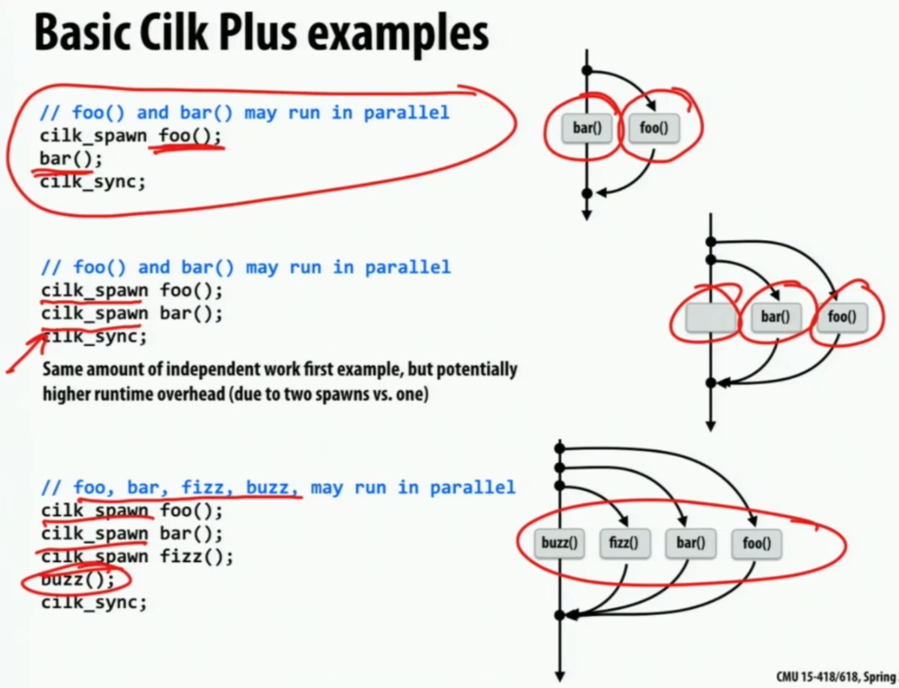

并发快排时，我们应该在任务足够小时不再进行并发（PARALLEL_CUTOFF），而是串行执行。


具体实现中，若有太多太多的异步任务的话，全都并发执行是有极大副作用的。**parallel slack**: ratio of independent work to machine's parallel execution capability (in practice:~8 is a good ratio).

### child & continuation

```cpp
cilk_spawn foo();
bar();
cilk_sync;
```

- spawn child: `foo()`。
- continuation: `bar(); cilk_sync;`及之后的剩余部分。

上面的程序执行的时候，若采用child first策略，那么当thread_0执行到`cilk_spawn foo();`时，就会开始执行foo，并且将continuation（bar）放入work queue；thread_1无事可做，就会从thread_0的work queue里窃取continuation去执行。


>Cilk选用child first。
### 循环

当continuation first时，在偷窃发生之前，会一直执行循环，直到把所有任务都放进queue里面。空间复杂度较高。类似BFS。执行顺序相比于串行会被打乱。


当child first时，本地会执行foo，然后将循环的条件放入work queue；其他线程窃取该循环条件（或者原线程执行完毕）后，才会继续执行（产生）新的任务（循环条件i的值直接表示了主线程的continuation，也即可以生成下一个任务）。queue里面永远最多只有一个任务。类似DFS。
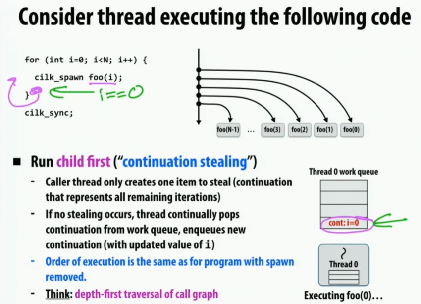

### 递归

分治法的时候，队列顶（上）到底（下）的任务规模会逐渐变小。显然偷走大的任务会提高效率，因此窃取策略是从顶部窃取。


### sync

当所有spawn结束后，最后谁来负责统计和继续执行也是个问题。

如果记录里面没有任何其他worker窃取过自己，则可以认为sync时不需要做任何事，自己做完了等于所有人都做完了。
#### stalling join policy

stalling join策略将一个数据结构放在thread_0里，其他线程spawn或done时会通知它，于是thread_0可以统计被spawn了多少次、done了多少个。全部完成后thread_0就可以直接知道sync已完成，继续执行。

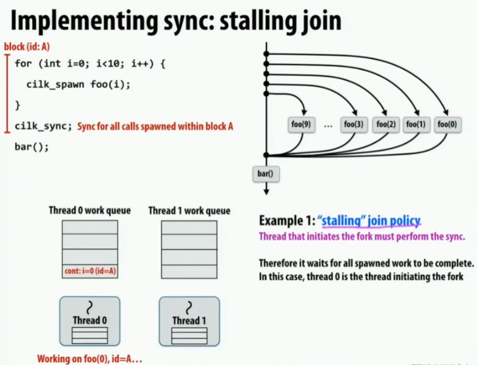


#### greedy policy

把数据结构放到work queue中。所有线程只要还空闲就会尝试窃取，并修改其spawn和done。谁窃取到时发现全部完成了，则这个线程自发结束sync，并往下继续执行。

>Cilk选用greedy policy。


# Recitation 1- ILP,SIMD Instructions

乘法很耗时，除法更耗时。

尽量把loop中的重复计算给提取出来。

可以使用strace，来看看系统调用是不是频繁在申请内存，可以用于观察内存泄漏或不合理使用。

loop本身也开销极大，因为每次循环都需要检测一次条件，然而实际有意义的只有最后一次。循环展开（loop unrolling）可以缓解此问题，但循环展开后指令长度过长，使得instruction cache不够用，即指令的空间局部性差。

编译器会做很多事情，如循环展开、SIMD，但某些情况下编译器无法认知到独立性，从而难以进行优化。当我们做最简实现的时候，可以查看汇编代码，看看编译器已经做了什么。

把能提取的都提取出来，甚至另起炉灶多来个for循环来储存中间值，这样会使得有更多变量可以设为uniform。

# Lec 6 - Graphic Processing Utils and CUDA

## graphics pipeline


- **Input, Vertex Generation**: a list of vertices in 3D space (and their connectivity into primitives). 根据点集，每三个vertices（vertex的复数）构成一个triangle


- **Step 1, Vertex Processing**: given a scene camera position, compute where the vertices lie on screen.

- **Step 2, Primitive Generation**: group vertices into primitives.


**Step 3, Fragment Generation**: generate one fragment for each pixel a primitive overlaps.


**Step 4, Fragment Processing**: compute color of primitive for each fragment(based on scene lighting and primitive material properties).

**Step 5, Pixel Operations**: put color of the "closest fragment"
to the camera in the output image.


Vertex Processing 和 Fragment Processing都可以插入用户程序shader来改变渲染逻辑。


## CUDA


CUDA的thread抽象和p thread的thread很像，但二者的具体实现非常不同。

较高层面上，CUDA像是data parallel计算模型，每个thread对不同data进行计算。

### block

Grid是thread的点阵，每个thread被赋予一个三维的编号（下面例子是二维的），高维的编号更易进行问题的计算。若干的相邻thread会被划分为一个block，每个block也有对应维数的编号。

>高维是由CUDA支持的。


使用CPU代码（**Host代码**）对待处理的问题进行划分。如矩阵相加，根据块大小来划分任务，然后使用**thread launch**（`<<< ... >>>`）调用GPU代码（**Device代码**）。GPU代码（kernel function，使用`__global__`声明）可以通过block编号以及block中线程的编号来计算得到对应线程所负责的任务。


block对硬件来说是virtual的，是CUDA语言的一种抽象，但实际上反映出其对GPU的调用方式。Block大小不能超过1024。

>GPU丢弃了CPU那些让单核运行更快的技术，如分支预测、乱序执行、大量cache，把这些丢弃后更容易进行高并发的各种简单计算，能耗低。


有可能矩阵尺寸并不是block大小的整数倍，因此有些非法数据。此时只要**不对外进行赋值即可**，内部计算了也不会有事：


>Block的思想结构能帮助我们的对其的编程。

CUDA的模型是SPMD（Single Program Multiple Data），即单一的kernel code被多个thread调用。

block的数量是无限的，就好像GPU有无限的单元一样，这给予了我们非常纯粹的data parallel抽象。但实际上的调用并不是这样的，GPU是有限的。

### memory

CPU和GPU有不同的地址空间。再加上并发模型不同，因此很难进行shared memory。


如果device要访问host的数据，则需要显式地进行`cudaMemcpy`。


>从`cudaMalloc`可以看出新式的c库函数风格：传入一个指针作为结果放置的位置，而函数的返回值用于指示是否调用成功。

CUDA的内存有三种：
1. 公共内存 **Device global memory**: 全员可访问。
2. block私有内存 **Per-block shared memory**: block内所有线程可访问。
3. 线程私有内存 **Per-thread private memory**: 单线程自己可访问。

三层的内存机制形成了**software cache**，可以通过程序指定哪些数据放在哪里。


### 例子

卷积操作，将相邻的三个元素加到一起。

>所有在函数内直接定义的变量都是per-thread private memory。

下面代码的输入和输出都来自于device global memory，没有利用cache，效率低。


可以使用`__shared__`来修饰变量的定义，以在per-block shared memory上创建变量。

block内的每个线程都负责从global载入一个元素到block中（要额外加载两个）。使用`__syncthreads()`来确保加载完毕，之后就能自由使用support数组了。


### synchronization


各个block类似于ISPC的for_all，即可以以任意顺序调度。但thread之间有同步操作，有较强的数据相关（使用per-block shared memory），因此不太能任意调度。
### CUDA abstractions


### assignment

block数量可以是无限的，但GPU资源是有限的，因此GPU需要进行assignment。

CUDA将每个block（被视为一个work）分配给每个GPU计算单元，使用动态分配。


### NVIDIA与Warp

2014年的NVIDIA GTX 980使用了Warp技术，将任务状态保存在各个warp中，每次都会调用可执行的任务放到ALU中去执行（一个thread如果在读取内存的话，可能就会切换另一个warp去执行）。


warp并没有在CUDA中被抽象，它在程序上透明，但针对warp的性质进行编程能大幅提高效率。

**Streaming Multiprocessor (SM)**。

（抄自知乎）以下是关于 warp 的一些关键点：
1. **同步执行**: 在一个 warp 中的所有线程都会同时执行相同的指令，这种机制也被称为 SIMD（单指令多数据）或 SIMT（单指令多线程）模型。
2. **线程调度**: GPU 的调度单元以 warp 为单位进行调度，而不是单个线程。这意味着整个 warp 会被分配到一个流多处理器（SM）上并一起执行。
3. **分支处理**: 如果 warp 中的所有线程都采取相同的分支路径（例如，都满足某个条件语句），则它们会继续同步执行。但是，如果线程在分支上有不同的路径（即分歧），则 warp 会执行每个路径，但不是所有线程都会在每个路径上活跃。这可能导致效率下降，因为即使某些线程在特定路径上没有工作，整个 warp 也必须等待该路径完成。
4. **性能优化**: 了解 warp 的行为对于优化 CUDA 程序的性能至关重要。例如，为了确保高效执行，开发人员可能需要确保他们的代码减少 warp 分歧。
5. **占用率**: 在 CUDA 中，占用率是一个重要的性能指标，表示每个 SM 上激活的 warps 与 SM 可以支持的最大 warp 数量的比例。更高的占用率通常意味着更好的硬件利用率。

因此似乎把每个warp看成大型的向量计算比较好。
# Recitation 2 - CUDA Programming 1

## 术语和基本语法


调试工具：


## Advice


## SPMD model

SPMD只有barrier进行同步。


Long tail problem: 有少数任务过长导致其他任务等待。


## CUDA Program


下面的二维编程相当于把block按二维坐标顺序排好，就可以得到一个大的thread方阵，其尺寸和矩阵C的尺寸一样。这样就能让一个thread对应C的一个点了。**block和thread的编号是横x竖y，以左上角为起点**。


32是warp size，因此每个block的thread数必须是32的整数（因为warp不能跨block）。


>严格意义上说，warp是一堆指令，而数据存在对应的内存中，但我们依然可以通过抽象让数据跟着warp走。

>host可以持有指向device内存的指针（很合理），但不能对目标内存进行读写。

### Inverted Indexing

将x和y反过来用得到inverted写法，但会导致效率慢十倍。


每个warp的y固定、x连续，需要追求在一个warp内达到最高效率。影响效率是不是cache，而是读写速度，如果读写不连续就不得不使用gather和scatter。


通过“y固定，x连续”的规则，结合向量计算的性质（如循环变量在任意的一个瞬间在每个thread中相等），就可以推导出一个warp中各个变量的性质，然后再做分析。

warp中每个thread的k在某个瞬间里都是相等的话，那么一个warp里所有thread读$(k,j)$的时候，就是读一段连续内存。而$(i,k)$中的i是全warp的thread固定使用的。

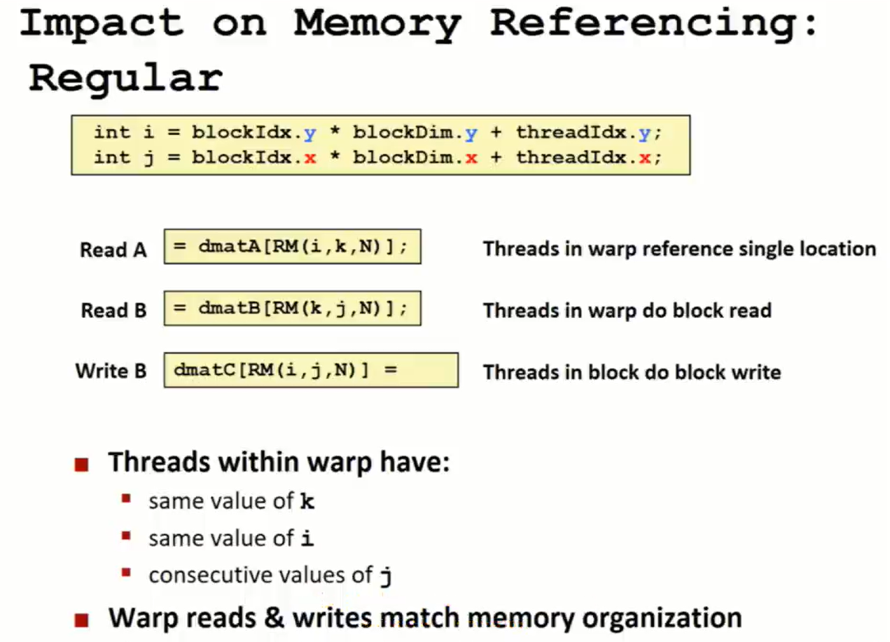

翻转后，由于warp中每个thread在一个瞬间要使用不同的i，并且$(i,k)$分散在不同的地方，就需要gather。j都相同，因此$(k,j)$固定，但$(i,j)$和$(i,k)$一样分散，需要scatter。


另一个看待inverted逻辑的角度是，它的每个warp之间有过多的重复内存使用，可以看成一种memory conflict。

如果提前转置第二个矩阵的话，其效率和inverted几乎一样。因为乘法里面的$(j,k)$出现了gather，而scatter以及转置的gather只执行一次因此影响小。**二者宏观上都可以看做单纯进行了多次的gather**。


## GPU Hierarchy

warp内部是lockstep的，它们像向量运算一样全部步调一致地执行指令，也因此完全不存在同步问题。


## Programming with Blocks

在单block中的运算可以使用`__shared__`定义的变量，本地性更好。


所有thread先负责获取一个变量到shared memory，那么整个block都执行完获取后（需要同步，因为不是单warp），就能获取到所有等一下需要的变量。然后就可以随意计算了。


使用barrier的时候要小心，不能随意直接跳过barrier同步代码。下面这段代码在触发continue之后会直接跳过`__syncthreads()`，这就导致该barrier永远无法等到所有thread到达（根据具体情况，程序可能卡在不同的时机）。


**计算负荷<<内存负荷**，因此要首先确保内存速度做到位，为了内存的优化带来的计算消耗几乎都是可以忽略不计的。


有一种加速是更好地利用内存总线（应该是指总线宽度，每次都读取满满当当的数据），来加大内存吞吐量：


# Lec 7 - Performance Optimization P2: Locality, Communication, and Contention

## 涉及交流的多线程算法

回到方阵计算的例子，每个点都需要从它的四个邻居处获得信息，在计算后更新自己。那么基于行分块之后，就需要通过消息传递将边缘的数据给分享出去。


使用阻塞式IO的话容易死锁，非阻塞式IO的话可能会出现缓冲区溢出（如果接收者太慢）。

非阻塞式IO使用buffer、新线程来辅助发送与接收。


## 交流模型

- Latency: 单个操作从发起到完成的延迟，单位为$时间$。
- Bandwidth: 所有操作完成的速率，单位为$个/时间$，或者$流量/时间$。

传播时间一般不加考虑，因为只影响刚开始启动时。


一般的传输模型的延迟都可以看成
$$Total\_Communication\_Time = overhead + occupancy + network\_delay$$
- overhead: 处理器花在communication上的时间（$T_0$）。
- occupancy: 数据通过路径上**最慢的部分**的时间，往往成为速度瓶颈（也因此与较快的部分割裂考虑）。
- network delay: 剩下的所有延迟，包括较快的部分的通过时间、拷贝到接收方的buffer内的时间。


流水线下，加速的一个关键点是让最慢的部分（蓝色）一直保持工作。


而cost指那些完全阻碍其他东西的部分，如上面的蓝色部分。不阻碍其他东西（可以与其他东西并行操作）的部分称为overlap。因为在实际操作中，overlap只是影响了性能，但cost却实实在在地影响了系统的进度。


系统越往下，交流成本就越高，因此需要尽可能让交流在上层就完成，也就说明了locality的重要性。


## 两类communication
### Inherent communication
**Inherent communication**: information that fundamentally must be moved between processors to carry out the algorithm given the specified assignment(assumes unlimited capacity caches, minimum granularity transfers,etc.)

衡量Inherent communication的一种方式是**Communication-to-computation ratio** = **amount of communication**(e.g.,bytes) / **amount of computation**(e.g.,instructions)。是Arithmetic intensity（计算强度）的倒数。Arithmetic intensity越高，则CPU的算力利用率就越高。

对于$N*N$的方阵例子来说，若有$P$个核心（线程），则每个线程的的计算量是$N^2/P$，交流量是$2N$，则Arithmetic intensity为$N/2P$。因此核心数越多，强度越低，越有可能浪费计算力。

如果修改算法，让每个处理器都交错地处理行，则每一行就要进行两次交流，最后得到强度为$1/2$，因此这个算法很差。

继续修改算法，为了使面积周长比尽可能大（同时要密铺），使用正方形去划分任务。这样，当添加更多处理器（总算力增加）的时候，计算强度（算力利用率）下降的不快。


值得注意的是，最边缘的点是不需要交换信息的，因此划分量比较少的时候，不一定是正方形算法更好。

### Artifactual communication

**Artifactual communication**: all other communication(artifactual communication results from practical details of system implementation).

Artifactual communication是一些“实现”或“现实”中会出现的其他交流，并不是算法要求的东西。


### 4 "C"s

原本有三种Cache miss，现在拓展为四种"C"s。

- Cold miss: 第一次访问数据。在线性程序中不可避免。
- Capacity miss: working set大于cache。可以通过添加cache容量改善。
- Conflict miss: 由cache的管理机制引发，如在直接相联或组相联的cache中，不同的块由于其在cache上的映射位置相同而导致相互替换（即使cache中有足够的空间来存储这些数据）。可以通过修改cache associativity或者data access pattern in application来改善。
- **Communication miss** (new): Due to inherent or artifactual communication in parallel system


## Techniques for reducing communication
### Changing Grid Traversal Order

因为每个点都需要周围四个点，因此cache会连着存三行，那么如果纯粹按行遍历的话，就无法充分利用上一行遍历中留下的cache了（Capacity miss）。通过分块遍历，可以保证cache的高命中率。分块遍历后，每次遍历完都会完整地存储下一行和本行的数据，那么下次遍历就只需要缓存再下一行的数据就行了。（说是cache，其实任意的缓存机制也需要像这样优化）


### Fusing Loops

通过**fusing loops**暴力压行、强拆模块，可以减少内存读写次数，增加计算强度。如果不是数组计算的话就应该不用管，因为单个数字直接放寄存器里就行了，但大数组的话遍历完一遍之后寄存器和cache基本等于全部失效。（猜测：也许纯函数编程或者说data parallel能解决一部分问题）


### Sharing Data

尽量让一部分数据在同一个时空下被尽可能地完成处理，就可以提高效率。


### Exploiting Spatial Locality

cache是有粒度的，要在优化中被考虑到。如读取方阵左右两边的数据，这些数据是不连续的，相当于每段cache line大小的内存只读取一个元素，浪费了cache空间。


#### False sharing

如果两个线程使用同一个cache line里面的数据，一旦发生了写，这个cache就废掉了。如果两个线程轮流对这个cache line进行写的话，则每次都要重新缓存，会产生极大的额外消耗。这也称为**False Sharing**。

给一个结构体增加padding可以避免false sharing，特别是当把各个线程要用的结构体放到同一个数组里面的时候。


### Blocked Data Layout

可以修改二维数组的存储方式，从row-major变成block-major（也叫4D layout），以block顺序存储，block里面按row-major存储。老师提到有软件可以帮助自动按块存储，以防止大量的重写。


## Contention

多处需要使用共享资源时，它们可能需要排队；共享资源被完全充分地利用了，但需求者消耗的排队时间太多。


例如，Distributed work queues就缓解了单work queue的contention。

举个例子，**如果把二维空间划分为16个cell，然后判断1M个particles在哪个cell中**。

如果让每个cell都建立一个线程，然后遍历所有particles。这样的话每个线程的工作量完全相等，但会导致cell数量次重复的粒子遍历，并且并发量也只有cell数量，无法满足CUDA的并发级别要求。


如果让每个particles都建立一个线程，然后遍历所有cell。这满足了并发量，但会创造单一热点，带来极大的contention。


让每个cell分别持有锁，以减少锁粒度的话，就会创造cell数量个热点，相比Solution 2减少了cell数量倍contention，但依旧很严重。


可以将partial分为N组，每一组在一个独立的block中进行任意形式的计算，计算完毕后再对每个block进行merge。只会带来两个消耗：每个块都要存储cell数组，以及计算完毕后的合并。这使得contention直接下降N倍，并且由于local化，各方面效率都更高。


也可以让particle本地保存它属于哪个cell；之后将**particle编号以及其所属的cell编号一起**根据cell编号排序，这样相同cell就会靠在一起；然后可以通过parallel可以并行地得到每个cell从第几个开始、第几个结束，也就相应地得到了每个cell中particle的数量，并且能知道是哪些particle。额外的开销是排序，particle数量的内存消耗，以及实现带来的内存传递。（排序的消耗这么大，因此猜测这种算法是在用空间和时间来换取低的交流量和低的contention）


# Lec 8 - Parallel Programming Case Studies

本次Lec的所有问题都放在NUMA机器中，即每个处理器都能访问所有内存，但能更快地访问本地附近的内存。

## Simulating of ocean currents

将3D的海洋按层分解，分为多个独立的2D平面来进行独立的计算。


**critial working sets** 是一个灵活的概念，通常在某一个小的时间段上被表述，并随时间改变。


## Galaxy evolution

模拟多个粒子之间由于重力产生的运动。从一开始先计算受力，然后计算delta t后的位置，然后重新计算力，以此类推。

使用Barnes-Hut算法，将较远的多个粒子视为一个整体质点，以减少计算。


二维中，以正方向进行分割，则可以得到四叉树（三维是八叉树）。每个结点记录其子树的总质量。那么当计算红色粒子时，根据正方形距离目标粒子的距离，可以选择某一深度的树结点来进行计算（即选择某一正方形大小）（越近的往往遍历深度要越大），然后忽略其子树。

只有叶子结点是粒子，因此要计算的是每个叶子结点受到其他所有结点的力。如果要并发化的话，就是把叶子结点分配到不同的处理器中。

比如绿色正方形，离红色点较远，因此不需要完全遍历到里面的七个粒子；但也不是特别远，因此要遍历到深度4。


每个粒子的计算是接近$lg N$的。

比较巧的地方是，相邻的几个粒子计算引力的时候所需是数据基本是差不多的，因此空间局部性较好。


有一个现象是：即使每个处理器被分配到了差不多数量的粒子，但其工作量可能并不相同。同时我们希望每个处理器的工作量几乎相同，且具有一定的局部性。另外，一个重要的性质是，随着时间的推进，每个粒子所需的计算量的变化是十分缓慢的。因此，如果可以在运行时得知一个粒子的计算量的话，就可以通过重新分配粒子来在一定的时间内平衡每个处理器的工作量。

**semi-static assignment**: 在每个time step中统计每个粒子的工作量，并且周期性的根据累加的工作量来重新分配粒子到处理器。

从Barnes-Hut中也能发现，树本身就带有局部性属性。将要处理的域（正方形网格）进行不规则的、连续的划分（**cost zones**），就能得到具有局部性的树。然后使用depth-first的方式就能进行较好的计算。这就是。


Barnes-Hut的working set：


而Barnes-Hut的一大问题是如何存储数据，因为任务划分不规则、可能发生变化、以高维的方式连续，这会导致很难利用cache。

> 如果摆烂不想利用cache的话，最好进行随机储存，这样可以减少不同数据集下意料之外的性能波动。

cost-zones assignment: 每次发生划分变化的时候，就重整数据存储，让属于同一个划分的数据被存在连续处。虽然负载均衡不如随机存储，但依然有一定的加速力。


ORB(Orthogonal Recursive Bisection): 另一种工作划分方法，每次画一条线，将粒子切割为等量的两份；再次划分的话，更换正交的方向对每一份粒子进行等量划分；一直划分知道每个处理器都能分配到一份粒子。

如果能预估粒子计算量的话，可以对其进行加权后再划分。

在该问题中效率不如四叉树。


## Parallel Scan

scan指的是数据集合被从前往后一个一个纳入计算。


### 普通并行算法

进行多次操作，每次操作都合并一个偏差一定位置的数字，从而一步一步将$a_x$变成$a_{0-x}$。第一次操作总共要进行N-1次计算，第二次需要N-2次，以此类推。进行的操作次数（称作Span）为$O(logN)$。总计算次数（称作Work）为$O(NlogN)$。计算次数比线性算法还要多！


### Work-efficient 算法

下面的算法分为两部分。第一部分进行预处理，第二部分中实线表示计算，虚线表示简单位移。此图中的箭头并没有任何省略。第二部分会首先寻找已经是答案的数（如$0$和$a_{0-7}$等），这样就可以通过添加后缀来得到新答案数（如$a_{0-7}$添加了$a_{8-11}$就得到了$a_{0-11}$），同时将原来的答案保存到所添加的后缀的位置（这种后缀只能被用一次，用完就被覆盖）。答案数的移动也使其能不断以整齐的方式遇到下一个对应的后缀。


计算次数是N的固定倍数，略多于线性算法。由于计算经常涉及很远的数进行计算，因此空间局限性很差。


### 双核实现 Work-efficient 算法

该算法的第二部分像是一种不太整齐的分治法。如果使用两个CPU核心进行计算，将整个算法过程一分为二的话，则只需要在第二部分的第一次操作中交换一次数据，而其他计算都是完全独立的。


### SIMD 实现普通并行算法

使用SIMD（CUDA）实现的话，可以直接使用最初的算法，每执行一行if，一个操作就被执行完成；所有if执行完就能得到结果。不过需要注意要让所有“线程”都在同一个向量计算中进行。

这种算法的Work虽然还是$O(NlogN)$，但是实际上也只进行了五步计算。


如果数组大于向量宽度，则必须要进行数据交流。实际上，如果一个子数组的下标范围为$[x,y]$，那么它在scan后就会得到$a_{x}$，$a_{x-(x+1)}$，...，$a_{x-y}$；对此数组全部加上$a_{0-(x-1)}$（称作base）后，就能得到$a_{0-x}$，$a_{0-(x+1)}$，...，$a_{0-y}$这一段答案数组。

将所有warp内进行scan后的最后一个数据$a_{x-y}$给拿出来放在一起，由于它们的x和y都是前后连续衔接的（上一个warp的$y$就是下一个warp的$x-1$），因此可以将这些数据进行一次scan得到若干$a_{0-y}$，然后将warp编号$i$得到的$a_{0-y}$传递给$i+1$，从而使得下一个warp得到了$a_{0-(x-1)}$（即base）以算出其答案。

- 需要传递出去的数据只有每个Warp的负责区域的最后一个。
- 由Warp 0来统一处理这些数据。
- 处理完毕后，各Wrap就能获取其base，让自己的数组都加上base即可得到答案。


这种方式只能在一个Block内完成，如果数据量过于大的话，就要进行多层多次的汇总与分发了。把每个Block的warp 0处理出的Base的最后一个给拿出来，在下一次kernel launch的时候进行scan，并在再下一次kernel launch重新分发即可解决问题。Scan要用的Block数量多于一个Block内的线程数的话，就无法在单一的Block内完成（用来求Base的）Scan，就需要在第二步进行一次多Block的Scan。


### 总结


## Ray Tracing
光线追踪让每个像素对摄像头（一个点）发出光，通过追踪光线射在哪个模型面上来进行渲染。


下面使用**Ray packet tracing**方法。

可以让距离近的模型面一起计算，以树的形式来建构模型间关系。一个结点表示一个区域（packet），一个区域包含多个模型面。父结点完全包裹子结点。


通过对树自上而下递归，就可以逐渐解析光线能射到什么地方，一步步往下，要解析的光线越来越少。还要考虑遮挡问题，如r6被4遮挡，因此只过E不过F。


但是，如果光不是这么一簇而是随机的话，就很难去解析它能到达哪个地方，树结构本身不再对光线追踪起到大的帮助。比如在一次漫反射或球形反射中，光方向被扩散，此时就很难解析了。


一种优化方式就是在一定时机进行光线的编号重排，即认为一个小区域中只有若干活动的、相关的光线，从而减少解析的复杂度。但随机光线只有在较小的区域中才变得相关。


可以发现，光线相关性在大的区域是很高的，因此可以直接使用树来完成；而最细小的面，只有少数随机的光线的话，就得逐个光线地进行计算来获得精确值；可以通过重排列光线来尽可能利用相关性，从而推迟单光线解析，从而增加效率。


## 总结

- Only need enough parallelism to keep all processing elements busy(e.g.,data-
parallel scan vs.simple multi-core scan)
- Different parallelization strategies may be applicable under different workloads (packets vs.no packets) or different locations in the machine(different implementations of scan internal and external to warp)

# Recitation 3 - CUDA Programming 2

## 性能优化


指令吞吐量和内存吞吐量都有上限（甚至没差多少），计算其比例，然后计算程序中指令与内存操作的比例，就能大致估计当前程序的短板在于指令还是内存。


### Algorithmic Analysis


### Analysis with the Profiler

profiler会追踪某一个SM，统计其指令与内存情况。最终的指令访问数量要乘上核心数。只能得到一个大致的参考值。


由于GPU的具体运行情况是运行时调度决定的，因此每次的执行情况都会不同，profiler的结果也会不同。


### Analysis with Modified Source Code

通过修改代码，使其只保留内存操作，和只保留计算操作，从而计算内存和指令分别使用的时间，以观察瓶颈情况与重叠情况。


内存和指令直接相加会大于总和延迟，因为内存和指令操作有可能**重叠**着同时执行，这种重叠被称为**hide latency**。前面的内存与指令的吞吐量比例的意义就在于二者重叠的时候能尽量互补地完成，避免互相成为瓶颈。下图第四种的重叠就不太好，使得绿＋蓝基本就是黄，延迟未被隐藏，不管内存与指令的比例如何都会有较高的延迟；其他情况下，都是哪个要素多，最终的延迟就接近该要素。


在提纯内存操作的时候，要尽量保持内存吞吐量不变，否则就很可能发生了意料之外的编译器优化（如无用的内存读取），影响程序分析。而提纯计算操作的时候，要防止因为计算结果不需要输出而导致程序段被优化（丢弃）。


提纯计算操作时，如果创造了一个只读的函数，里面有一些计算，那么就在末尾写个if，里面放一个永远不被执行的写操作；if里面的条件要包含运行时值，其中的flag由程序员保证永远传入0。这样的话编译器就会认为此函数是有写的，即使实际上永远不发生写。


修改代码会影响寄存器使用量，而该使用量可能会影响硬件调度的线程数量（只有有限的寄存器可以使用）。这就使得当寄存器数量成为瓶颈的时候，修改代码会带来意想不到的加速（要统计的目标是执行程序过程中某一方面的时间占比，如果线程隐式地以不同的并发度被调度的话，就计算不了其执行时间比例了）。


内存提纯代码的指令数和计算提纯代码的指令数加起来不等于原代码指令数，因为代码是被魔改出来的而不是拿剪刀完美割开的。


### 总结


## Local Memory

从概念上分析，global内存的cache效果不太好（因为要频繁保证相干性），而local内存（LMEM）很需要cache。实际上，LMEM是从global内存中分出来的**内存区域**，由编译器管理，这块内存**可以使用cache**，并且由各线程私有。


sl操作与普通程序基本一样，都miss后就得访问DRAM。


在**寄存器使用过多**或在**定义数组**的时候会使用LMEM。和普通程序差不多。


一旦使用了LMEM，就会**增加内存使用量，并增加指令数**（要取地址等操作）。


- 增加寄存器数量可以减少内存的使用，但副作用是增加了线程占用。不能直接确定能提升还是降低效率。
- 让global内存不使用cache可能可以减少L1冲突率。
- 增大L1也可以增加效率。L1是可以由编译器增加的，让cache更多地去服务LMEM（而非global内存）。


# Lec 9 - Workload-driven Performance Evaluation

如果问题太小，处理器又太多，那么交流的代价就会占比更大，导致增加处理器的时候效率可能不升反降。


增加处理器也有可能出现超线性的加速，因为每个处理器都有自己的cache，而良好的解决方案会利用好这些cache，从而有更高的加速比。在问题极大的时候通常会出现明显的超线性。


如果一种解决方案想变得通用，那么它就要被设计得可以适应不同规模的硬件。


架构往往也要考虑这种scalability，使得一种设计可以用来制造小的、便宜的产品，又能制造高性能的产品。


scaling也有两种类型：
- 将一个问题分到多个处理器上，追求让加速比接近处理器增多的比例。
- 让问题规模随处理器数量按比例增长，追求尽量不出现额外代价。


## Scaling constraints

重点是resource-oriented scaling properties。


**Problem-constrained(PC)** 追求最普通的加速比，要求尽可能快地完成固定的任务。不改变任务的规模，但会改变单个处理器的任务规模。


**Time-constrained(TC)** 追求固定时间内完成的work的量（规定的固定时间有可能大于实际完成所需时间），但work的衡量比较难。效率变化就会改变任务的规模，也会改变单个处理器的任务规模。

很多问题都是被时间约束的，如：
- 游戏需要在流畅度允许的短时间内完成计算与渲染。
- 天文望远镜需要每天晚上进行扫描后来计算并进行信息交互。
- 金融行业一些计算要在规定时间内完成否则就成了无用数据。
- 网站加载需要尽可能降低延迟来保证用户体验。
- 一些计算机视觉问题，如自动驾驶骑车，需要反应力，如果不在一个阈值时间内完成任务就会出事故。


**Memory-constrained(MC)** 是为了解决更大的问题（硬盘太慢，追求只用内存解决问题），如果不增加内存就**无法解决更大的问题**。它是一种weak scaling，追求增加处理器（配套增加内存）来让更大的问题可以被解决。由于问题变得更大了，因此要取**单位时间完成的work**来作为加速衡量，此处追求的是总效率的提升。会大大改变任务的规模，但不改变单个处理器的任务规模。


Memory-constrained的例子都是一些不得不叠内存的问题，内存越大，能力越大。


- 渲染电影里的一张图是一个固定的任务，且没有固定的时间要求，因此是PC，追求任务尽快完成。
- 一些场景制作工具要尽可能快地进行渲染，这样在制作者进行调整的时候，能在固定的时间内（固定的帧率）提供尽可能高的保真度的图像（3D制作器在调整镜头后，图像立刻发生变化，但渲染质量是从低到高慢慢变的，该过程中制作者依然可以自由进行操作，渲染质量提高的越快越有利于制作者开发），因此是TC，追求在固定时间内完成尽可能多的work。
- 进行物理模拟时，内存多了才能模拟更复杂、更大的场景，因此的MC，追求使用更多处理器（更多内存）来解决更大的问题，并希望效率也尽可能提高。


## Case: 2D grid

计算scaling的时候将原解决方案的所有参数（N）都视为不变的常数，可以在O符号内省略。

计算TC scaling的时候，要假设在时间不变的情况下，新解决方案能解决$K*K$的方阵（原来是$N*N$）；然后，发现（假设）$K^3/P=N^3$，从而建立K与N、P的数量关系；首先通过K推导出新解决方案的各项数值，再把K换成N和P，就能得到结果。

计算MC scaling的时候，问题规模从$N^2$变成$N^2P$，而每个核心依然只计算$N^2$项。由于每个核心内部点数固定，而交流次数与点数数量有关，因此交流计算比是不变的。


大部分例子都不太可能只有N一个参数，而是有多个的、相关的参数。


## Scaling 总结


## Simulation


如果一个机器有很多参数并且很难看出关联性和单调性，那么可以记录很多情况下的能量消耗与性能，画在图上，然后取各性能下能量最低的点，这些点就是最佳的曲线，然后根据性能需求自由选择曲线上某个点。比该曲线高的点永远有同性能单能量更低的方案，因此不再被考虑。


## 开发所需的scaling down/up

在进行时间较长、强度较大的大型测试之前，需要在小型问题上进行快速测试来debug与观察行为。


改变问题规模后，很多东西也会随之改变，使得小型测试可能不能很好地反映大型情景的情况。


如果单纯缩小图片的话，会导致圆所占的方格大大减少，甚至很难出现跨方格的圆，使得测试与实际情况较不匹配。可以考虑将图片裁剪，只计算一部分，这样的话圆的特性就不会改变，比较贴合实际情况。


## Understand the performance of parallel software

Always, always, always try the simplest parallel solution first, then measure performance to see where you stand.

需要分析程序是被什么给限制了性能，同时也要分析机器所决定的各方面的high watermarks（理论最高性能）。


使用不同计算强度的程序，测出其性能，画在图上，则斜线处表示程序是内存带宽受限的（内存操作需求量越小，程序性能越高），横线处表示计算受限了（CPU爆满，再加计算量也不会加快性能，当然也不会被内存限制）。


- 增加数学计算，如果执行时间变长，说明是指令受限（要注意别被编译器优化）。
- 大量丢弃数学计算，如果执行时间没降多少，则很可能是内存受限。
- 把数组访问全部指向数组首地址，这样大部分cache问题就会被抛掉，如果执行时间显著变少的话，那就是locality出问题了。
- 把所有涉及线程间同步的东西去掉，如果性能变快不少说明受限于这些操作。


利用工具进行分析，包括现代处理器会提供性能监视接口。


# Lec 10 - Snooping-based Cache Coherence

## Coherence

在write-back cache里面，如果写操作时目标内存没有被缓存的话，就需要先把目标内存读到cache里面，然后进行写。


write-back cache会导致写操作无法进行及时的同步。另外，读操作的目标如果被cache的话，也不会被及时更新。


为了让程序员觉得cache只是一种加速，从而可以将内存抽象化，无需考虑细节，于是就要追求coherence。

该架构把各个核心的L2都一起连接到单个共享的L3，以实现协调。


即使是单核CPU，也会在IO场景下出现coherence问题。
- 写操作没同步到内存的话，发送设备无法获取到新数据。
- 读操作被缓存的话，接收设备传来的新输入可能无法被读到。


单纯使用时间来追求coherence的话，是很难的，因为有可能在极短时间内不同处理器进行了互斥操作，这种情况很难同步。

但是，在顺序程序（Sequential Program）里（多线程程序中的一个线程也可以看做是顺序程序），可以将coherence看作对程序执行顺序的合理性保证。


一串读写可以以线性的顺序写出来，则可以认为内存系统是coherence的。也叫sequential consistency（顺序一致性）。


更细分的定义：
1. obeys program order：在单个处理器中，应当有local consistency，即本地写后读可以读新值。
2. write propagation：如果一个处理器写后，另一个处理器在隔够长的时间后进行读，可以读到新值。只要求**eventually**能传递写操作就行了，对时间不作要求。
3. write serialization：同一个地址的写操作永远是单一的线性，即任意两次对同一地址的写在所有处理器看来都是以固定的顺序发生的。


## Write-through cache


先考虑单份数据在write-through cache下的coherence。在进行X的写操作时，interconnect会进行一次广播，让其他所有cache内的X失效；又由于是write-through cache，下次读的时候就能读到新值。


- Invalidation Based Protocol（重点关注）: 仅仅通过标记cache条目无效来保证数据同步。
- Update Based Protocol: 将cache条目的新值告知所有cache以直接更新。


- cache的服务目标有两个：所在处理器的内存操作；其他cache发送的message。
- 所有cache controller都需要良好地实现同一个目标规则，以完成协作。
- 所有cache控制（包括coherence的保证）都以cache line为粒度。


下面的write-through invalidation的状态图假设write-through cache同时为write no-allocate，即对未缓存内存的写操作不会进行缓存，只进行内存写。可以看出只有其他处理器的内存写操作（蓝线）才会导致当前缓存由V转向I。


interconnect保证了所有内存写事务的可视化与顺序化，使得所有cache controller可以完成原子而一致的控制，例如可以有效地解决同时写的问题。


## Write-back cache


一个cache line只会在一个cache上拥有所有权（exclusive ownership），并且拥有所有权的cache要负责将数据传给其他cache。


MSI协议中的cache line有三种状态：
- I：相当于被从cache中剔除。
- S：被缓存，但不保证唯一性。
- M：严格仅在当前cache缓存，是可任意修改的。

特殊的BusRdX操作（read exclusive），表示进行一次之后会发现写的读，这就要求其他cache不再缓存此cache line。


- 如果有处理器进行了写操作（其cache会进行内存RdX操作），那么它的cache就会得到唯一的M状态；而其他cache都会变成I，使得它们无法读到旧数据。
- 如果其他cache要进行内存读的话，M就会失去所有权变成S，并将新数据flush到内存，让数据被共享。
- 如果其他cache要进行内存写的话，M就会转交所有权变成I，并将新数据flush到内存，让数据所有权归新cache。


MSI在进行读后写时会有较大的花费，而读后写又是个很平常的操作。MESI协议添加了E状态（exclusive clean），表示当前仅有此cache缓存了目标cache line（相当于特殊的S状态）。E状态转成M状态不需要任何interconnect操作。


- E状态下，如果有其他cache进行了对应的读取，那么就要转成S（在别的cache进行I到S的事务时完成）。
- E变成M完全是处理器内部的操作，不涉及总线，操作不被其他cache直接感知。
- E和M状态的区别就是在其他cache进行读时要不要flush。


在E和S状态下的cache是可以合法地将数据直接从本cache分享到其他cache的，但究竟该由cache还是内存来提供数据要看具体设计。


两个非常相似的协议：
- MESIF使用F状态来标记在数据被只读分享的时候负责向其他cache分享数据的cache，这样的话miss时的数据传输会比较井然有序。
- MOESI中，当数据被共享后，原本为M的cache变成O，负责分发数据。大部分工作都通过cache间交流完成，当出现miss时直接找O状态的cache索取数据。只有当cache满了的时候数据才会被写回内存。相比于MESIF，该协议的内存往往是不新鲜的，不能直接读取。


## 关于write-back update protocol

一个write-back update protocol的例子：


为了保证同步，update协议会更多地进行总线操作，影响性能。

update协议的miss率低得多：


但是update协议的总线traffic高得多（使得低miss率带来的性能增加基本没用）：


## 多层cache

在多层cache下如何保证coherence是个问题，因为不能让每一层的cache都连接到interconnect。


由于多层cache可以维护Inclusion性质，即接近处理器的cache的所有内容必然被远cache完全包含，因此完全可以使用远cache来直接管理近cache，而不需要进行跨核心的同步。


# Lec 11 - Directory-based Cache Coherence

## Why directory


spooning依赖于广播，一旦miss发生，广播会波及到每一个cache。这使得spooning的coherence机制的scalability不太好。

cache coherence的低scalability会影响到整个内存系统的scalability。NUMA中进行广播可能拖慢整个内存系统。


Hierarchical snooping将处理器分组，在同一组内的处理器进行数据分享的时候就不会波及其他层和其他组的东西了。


使用一个中心位置存储所有cache中cache line的情况，就可以避免广播。这个中心位置成为directory。这样，coherence只需要通过点对点地联系即可完成。


## Directory 机制

内存中的每一个line（即一个cache line容量的内存）都有对应的directory条目。directory条目的第一位标记数据是否是dirty的；剩下的位数等于处理器的数量，用于记录哪些处理器缓存了对应的内存line。


如果内存是分离的话，directory 也可以是分离的。下面的例子中，每一个处理器都有一个local内存，那么也就有一个 local directory；处理器＋directory＋内存称为一个 node；处理器读取内存时，就会从 Requesting Node （需要数据的node）向 Home Node （拥有数据的node）发起读取请求。


cache miss后，询问负责目标内存的directory。如果数据是clean的，就直接读取内存中的目标数据，并且该directory记录哪一个处理器缓存了该cache line。


如果目标数据是 dirty 的话，就需要告知请求者哪个node是owner。


请求者向owner请求数据；owner回复数据后，失去写权限，并且将脏数据写回home node；对应的directory将其标记为clean，并更新缓存node记录。


进行写操作时，如果目标数据为clean，则directory会标记目标为dirty并只让request node持有此数据。


之后，request node负责通知分享了此数据的node，令它们失效。


这是一个basic version，难以应付并发写或读写操作。

## Bus traffic 性能问题

读的话最多只需要点对点联系，写操作的话联系数量取决于分享了此数据的node的数量。


但是分享数据的数量一般不多。读多的时候，写的性能消耗就可以忽视；很多时候是单纯地转移数据使用者，从一个处理器转到另一个处理器，不会出现多少分享数量；频繁读写时，在读的数量积攒起来之前就进行了写，清空了分享数量；但是**高contention的锁**在阻塞时被多个处理器读，在释放时进行写操作，就会波及到非常多的处理器。


## 优化：降低directory所需容量

对于每个内存line，都需要一行directory，而一行directory需要占用P+1 bit，因此如果处理器数量过多的话，directory的存储量就会极大；同时，directory的速度要求也很高，因此花费也非常大。


增加line大小可以减少directory所需的条目数，但会有一些副作用。可以将一部分node拼成一个大node，大node内部通过spooning进行管理；对外只提供一个directory，记录整个大node的缓存信息；大node包含的处理器越多，就越能降低directory所需容量，但spooning造成的代价也就更大。


当处理器数量远远大于一个数据同时分享的数量时，**列出所有的node**比用bit标注所有node所需的容量更小。Limited pointer schemes 使用二进制表示node编号，然后一个数据对应多个编号，表示数据被缓存到这些处理器中了。每个数据能记录的最大编号数是固定的。


这个机制就可能出现分享数量太多导致记不下的问题（overflow）。当数据记不下后，可以使用broadcast来处理（反正此时缓存数量多，broadcast性能消耗更可以被接受）。如果不允许broadcast的话，就得做出限制，在overflow时使用相关机制淘汰掉某个sharer；甚至可以直接回退成bit表示法。


这种优化思路就是针对common case的优化，让大部分情况下的效率尽可能提高，而边缘情况只需要考虑正确性就行。有一个副作用是，上层使用者（如程序员）难以理解不同case的分界点在哪里，于是不好做针对性的优化。


Sparse directory考虑到任意时刻大部分内存都不会被缓存到cache中，因此没必要在directory中出现。因此，每个directory只要存储**整个系统中cache的line的总和**（$P*C$）就行了，使用Tag标记内存地址，并在缓存内存变换的时候进行修改。


## 优化：减少message数量

读miss的时候，需要五个message来完成操作，但最后两步数据传递是可并发化的（即有一个不在critical path上）。


如果在读取的时候由home node来完成flush相关操作的话，就能少一步owner id的传递。


最后的数据传递也可以进行并发化，一个传给home node来更新，另一个直接给request node。这种方式会导致请求目标与响应来源不严格配对。


## 现实例子

**L3 directory**机制使得L3拥有所有被缓存到L3的内存的directory，这样核内的traffic就会降低。


在 multi-socket 中，使用**in-memory directory**来降低核心间的traffic。


## Summary


# Lec 12 - A Basic Snooping-Based Multi-Processor Implementation


## Inclusion

当L2大于L1时，**inclusion也不是自动满足的**，主要是二者的读写记录不同，如果都使用LRU策略的话，就会在evict的时候出现分歧。


需要保证当L2的cache line失效时要同时通知L1。在L2中，给所有line加上一个bit，标记其是否也在L1中；当bit被标记的line被evict的时候，就会额外地通知L1.


需要保证L1修改数据后，L2也能探知这个修改。再加一个bit，标记line是否被L1写；当bit被标记的line被interconnect索求时，就会先从L1读取修改后的数据。当L1第一次对此line进行写的时候，会通知L2来标记此bit。


## Deadlock, Livelock and Starvation


deadlock的四个必要条件：


livelock就是在不形成deadlock的情况下也无法继续运行。所有车同时后退给别人让，但又同时发现能走了于是又往前走，这些车（线程）太过于同步了。

starvation描述的是在总体不断向前运行的时候，若干部分完全没有进度。例如在有优先级的情况下，如果高优先级连续不断地出现，那么低优先级的任务就无法运行。也因此starvation一般不是永久的，可能可以在时间足够长后得到解决。


## Part 1: A basic implementation of snooping (assuming an atomic bus)


cache通过查看tag来检查自己是否需要进行数据读取；当cache需要数据的时候，先请求总线占用权；被授权后将地址、命令写到总线上；等待命令被执行并换成数据，之后就能从总线读取数据了。


cache的每一个tag都会同时出现处理器事务和bus事务，每一个tag都需要考虑这些事务的调度情况，对事务的优先级控制的不同会出现不同的表现。


可以在只读的时候，让tag可以完全自由地被访问；但如果该tag被一个controller写的话，就需要阻塞另一个controller，以保证原子性。


snoop的结果如何进行响应也是的个问题，cache需要知道一个line是否dirty、share，还要标记一下snoop是否完成。


在bus上建立三个额外通道，所有处理器都要向其中塞入自己的状态，而通道将这些状态通过or逻辑合成起来。例如，如果有任意一个处理器的snoop没有完成的话，snoop-pending就一直为1；当snoop-pending为0时，表示全部完成，可以进行下一步。


内存访问DRAM的时候，无法知道自己现在的内存是不是合法的。如果内存通过snoop响应知道有一个cache现在正拥有着这段内存的最新拷贝的话，就不公布自己的新数据，以此让对应的cache先去响应这部分数据；如果内存发现cache不在拥有此数据的话，就将读取DRAM的数据传输出来。这使得DRAM读取的新数据被暂时压抑，直到cache放弃数据。


write back触发的时候，是请求处理器对脏数据进行请求，因此脏数据的写回与读取是连着完成的，但是写回需要等待内存，拖慢了读取的时间。使用**write-back buffer**可以让脏数据一经返回就马上可以转发给请求处理器，而内存的写回被异步地完成。


但这也使得内存操作都必须先询问write-back buffer，否则可能就会出现不一致性。这让coherence系统更复杂了。


line的状态变换不是原子性的，需要通过各种机制保证其正确性。


出现cache同时进行操作的时候，要求cache能够做到在等待响应的时候监听其他请求，并且随时修改自己的请求。


如果等待请求和接收请求无法同时进行处理的话，就有可能形成死锁条件，产生互相等待。


可能会出现所有权的互相抢占形成振荡，内存操作一直没时间执行。因此要求获取所有权后必然可以完成相关的内存操作。


当RdX被放到bus上并被所有cache确认时，write操作被commit了。commit不等于complete，commit只是保证了事务的相互关系。因为会保证RdX后必然能完成内存操作，并且write-back buffer会被其他事务检查，所以这个瞬间过后写操作必然能影响之后的所有相关事务。


starvation的发生在于不公平性，导致在高contention的情况下有处理器一直没机会拿到数据。


## Part 2: Building the system around non-atomic bus transactions

non-atomic bus 也叫 **split transaction bus**。


Problem: Bus is idle when response is pending.


New issues arise due to split transactions:
1. How to match requests with responses?
2. How to handle conflicting requests on bus?Consider:
	- P1 has outstanding request for line A
	- Before response to P1 occurs,P2 makes request for line A
3. Flow control:how many requests can be outstanding at a time,
and what should be done when buffers fill up?
4. When are snoop results reported?During the request?or during
the response?

### 基本设计

A basic design:
- Up to **eight** outstanding requests at a time(system wide)
- Responses need not occur in the same **order** as requests
	- But request order establishes the total order for the system
- Flow control via negative acknowledgements(**NACK**s)
	- When a buffer is full,client can NACK a transaction,causing a retry

可以把这种bus看成两个独立的bus，分别进行**请求 request**（包含cmd+address）和**响应 response**（包含data）。
- **请求**时，会先向bus arbiter（仲裁器）索取request bus的访问权限，请求成功后会获取到transaction tag（此处是3bit），然后进一步进行请求装载。
- 在**响应**的时候，这个tag也会被带上，使得进行了对应tag的请求事务的cache可以接收此响应。响应也需要通过arbiter来索取 response bus 的访问权限。
- 这使得多个处理器可以随时发起请求并同时等待响应（由于tag只有3bit，因此**最多允许八个事务同时等待**）。


一次完整的事务分为三个phase：请求、响应仲裁、响应数据。

从bus的视角来看，一次**请求**操作需要分为五个步骤（第四步DCD不使用bus）（ACK只是snoop结果ready了，而不会传输数据）：


而**响应**操作的**准备** （data arbitration）分为三步（也没有传输数据）：


准备完成后开始真正地**传输数据**（可见数据传输的时间占比其实不是很大）：


由于总线的使用被分离成了独立的、有序的三个部分，所以是可以**流水线**化的。但不是所有事务都是这样的形式，write back 和 BusUpg都非常特殊（主要是。


另外，这种流水线化并不保证请求与响应的顺序一致（请求顺序与完成顺序可以不同）（out-of-order completion）。图中的transaction 4由于只需要request bus就能完成，使其比更早发起请求的transaction 3要更早地完成。（不过图中的数据传输顺序依然是符合请求顺序的，gpt说可以乱序，暂时无法确定）。


### 细节问题解决

要避免冲突的请求。这里禁止cache发出冲突的请求，实现方法是让每个cache都维护同样的request table，然后禁止自己发送和table内的request相冲突的request。


例如当一个处理器向读取X，但一个与X相关的事务已经被装载到bus上时：

查询request table，找到与X有关的事务，发现是不冲突的BusRd；同时，也可以发现**不需要再新建事务**了，直接监听这个BusRd request的响应就行了。


如果发现有冲突的事务，则自己就得一直等待直到冲突消失（必须等待后执行，而不能直接取消，因为不可能让上层应用取消数据读取）。


为什么在并发系统里面需要queue队列？因为生产者和消费者之间可能因为其他依赖关系或逻辑存在**延迟、错位**，此时使用queue可以**使生产者不会因为与消费者错位而阻塞**。如果生产者和消费者的**吞吐量**差不多的话，使用queue可以使二者**几乎完全解耦**，不互相影响。


下图是各种miss和dirty情况下的流程图. 另外, 这图也体现出进行**事务分离的合理性**: L2显然可以对这个请求进行**立即**的<u>控制响应</u>(因为它能马上知道数据就在这个处理器上), 但是<u>数据本身</u>(修改后的版本)却在L1中, 需要更多时间才能进行响应.


如果两边同时向对方发起请求, 那么要是在等待响应时无法处理请求的话就会造成死锁.


在发送接收处设置的queue本身也会带来死锁问题. 若返回给对方的响应和自己发出的请求都放在同一个queue里面, 那么如果整个queue都被请求塞满, 那么响应就被隔断了, 此时对方就无法收到response; 自己也有可能因为同样的原因无法收到对方的response, 导致死锁. 这里也许想表达的意思是, 两个queue满了之后任意一方都无法<u>生成</u>response, 也因此失去了接收request的能力, 互相腾不出空间, 导致死锁. 一种解决方案是把queue的容量增加到能容纳所有request, 但这样开销就很大.


将request和response要用的queue分离可以解决问题. 因为response不会产生额外影响, 将其独立处理就能无副作用地腾出queue空间.


## 一个变量的定义语句会发生什么


# Recitation 5 - Matrix-vector product (OpenMP, OMP)


使用`#pragma omp parallel`定义 **parallel region**:
```cpp
#pragma omp parallel {
	...
}
```

两种等价的声明并行for的方式:
```cpp
#pragma omp parallel
{
#pragma omp for
    for (int i=1; i < N-1; i++)
        a[i] = (b[i+1] - b[i-1]) / 2;
}

#pragma omp parallel for
    for (int i=1; i < N-1; i++)
        a[i] = (b[i+1] - b[i-1]) / 2h;
```

默认情况下, 定义在parallel region外的变量都是shared(各线程共享), 定义在其内的都是private(对应线程私有). 可以使用 **shared & private declarations** 来指定. 如果循环用的`i`是在`for(...)`里面定义的话, 就不需要手动指定private.
```cpp
int main (int argc, char *argv[]) {
    double a[N], b[N], c[N];
    int i;

    #pragma omp parallel for shared(a,b,c,N) private(i)
    for (i=0; i < N; i++)
        a[i] = b[i] = (double) i;

    #pragma omp parallel for shared(a,b,c,N) private(i)
    for (i=0; i<N; i++)
        c[i] = a[i] + sqrt(b[i]);
}
```

普通的`#pragma omp for`会在for循环<u>结尾</u>加上**barrier**, 如果<u>不需要</u>的话就标记`nowait`.

> [!info]
> 编译期基本上无法并发化内部循环.

> [!notice]
> OpenMP只能发现小部分的依赖关系. 需要程序员自己注意并发正确性.

如果for循环要进行数组内部的操作, 那么通过**拆分循环**分离依赖关系可以使其被正确地并行化:


使用`reduction`来**规约**每个子线程的结果(使得程序员免于进行手动原子化操作). reduction声明的变量对每个子线程是private, 在子线程结束后它们的各个对应变量通过指定的运算符结合成<u>单一结果变量</u>. 这就要求指定的运算符必须有*交换律*和*结合律*. 

下面的例子中, 对于每个子线程来说, sum都是`0.0`; 每个子线程都加上了一个数组元素, 然后结果被规约, 最后的输出即是数组元素和.
```cpp
int sum = 0;

#pragma omp parallel for reduction(+:sum)
for (int i = 0; i < N; i++) {
	sum += a[i];
}

printf("Sum = %f\n", sum);
```

使用`schedule`来规定**调度**的<u>方式(static或dynamic)</u>和<u>单位尺寸(一个线程一次拿多少个任务)</u>. 剩下的不足单位尺寸数量的就统一做一次分配.


不指定schedule, 就把任务以<u>最大连续块</u>的方式分配给指定线程; 指定粒度为2的static时, 就每2个连续任务为一块进行分配.


关于**共享的堆内存**: 很多情况下, 申请的堆内存的其中一部分只被其中某个线程操作. 如果在申请堆内存之后马上初始化它的话, 在NUMA系统里面就会导致对该内存的访问很慢. 因此, 需要**在各任务内部对其进行初始化**, 使得任务被调度的时候, NUMA机器可以直接为其在附近划出所需的内存 (注: malloc只是分配内存起终点, 在初始化前其内存都是非法的, 于是对其的读写不需要进行迁移复制). 


OpenMP也是个API, 但它提供的这些函数是底层的, 一般不用.


# Lec 13 - Memory Consistency

- Cache Coherence: do all <u>loads</u> and <u>stores</u> to **a given cache block** behave correctly? 对同一个内存区域进行读写的时候, 往往仅仅涉及 cache coherence 问题.
- Memory Consistency Model (sometimes called "Memory Ordering"): do all <u>loads</u> and <u>stores</u>, even to **separate cache blocks**,behave correctly? 这要求对不同内存的读写操作也要满足一定的一致性.

现代处理器会**乱序执行**, 以将内存访问的巨大延迟尽量掩盖. 虽然处理器会保证当前线程会有 <u>program order</u> 执行的*幻象*, 但其他线程却直接看到了乱序的结果.


多个内存操作可以通过**并发化**来掩盖延迟. **write buffer**把写操作放在工作队列里面, 而读操作可以通过查询write buffer来加速(直接从中读取); write buffer不一定是FIFO的, 因为如果有cache miss的话, 就应当让下一个写操作并发进行.


此外, 如果若干指令被一个昂贵内存操作阻塞的话, 那么就可以先执行之后的与之**没有依赖的指令**.

条件判断语句中, 处理器也会对条件真假进行猜测, 然后进行预测性的执行, 如果猜错了就回滚. 该过程中的存储操作都会使用store buffer, 只有当确信猜测正确了才会将其真正写到内存中 (预测读永远是合法的).


一种比喻: 每个线程里面各个指令被乱序执行, 像是长条气球里面的空气分子一样随机. 为了保证要求的内存序, 即是要求执行完一部分指令后才能执行另一部分指令, 这相当于给气球拧了一个结进行隔离.


例: 线程1对A和Ready按序进行写操作, 线程2在读到Ready的写操作已发生后, 去读取A. 但是, 有可能线程1对A的写操作尚未被线程2观察到 (即使对Ready的写操作已经被观察到了), 使得线程2依然读到了尚未被写过的A.


例: 线程1对A进行写, 线程2观测到A的改变时就对B进行写, 线程3观测到B的改变时就对A进行读, 该过程依然会出现A被线程3观测到的时间过于晚的问题.


## Sequential Consistency


每个线程以 <u>program order</u> 执行; 内存在每个瞬间只能被一个CPU访问, 且被哪个CPU以何频率访问是不可预测的. 


相当于将各线程的指令 在保持顺序的同时, 任意交叉地放在一个线性执行顺序上. 这也意味着, 所有线程对某一个线程的指令执行顺序的观测总是一样的 (不过程序跑多次的话每次都有不一样的结果).

可以使用箭头描述在一个读取实例下各个指令的执行先后顺序, 其中program order就天然规定了一个线程中的各操作的执行顺序; 如果有环说明实例不合法.

> [!notice]
> 只有SC可以这么做, 因为它假定了HSO, 也就是那个线性的执行序列.


一种SC的实现方式是: 在保证cache coherence的前提下, 要求每个处理器每个瞬间只进行一次内存访问, 即只有当认为上一个内存访问complete了, 才能进行下一次访问. 


**complete**指该内存访问已经保证会被执行.
- **读操作complete**: <u>只需要读到数据</u>, 无论是从cache还是内存读到的.
- **写操作complete**: 新值对其他所有处理器<u>可见(visible)</u>时. 说明已经进入了缓存协议的一定步骤 (比如让应当失效的 cache 失效).

**visible**:
- 并不是指其他处理器已经看到了该值.
- 它指新值已经被commit到了 **hypothetical serializable order (HSO)**.
- 在这之后, 对于在HSO的目标区域的读取只会读到<u>不比该值旧</u>的值.
- (此处假设写操作都是原子的)


## Weak Ordering

- Total Store Ordering (TSO) 允许在一次写没完成的时候就进行读, 这相当于允许 write buffer.
- Partial Store Ordering (PSO) 相当于对一次写之后不进行任何约束, 这相当于不要求FIFO的 write buffer.


很多情况下, 并不一定每一个读写操作需要同步, 例如mutex式编程, 只需要 解锁前同步所有前面的操作, 并且上锁后才能执行任意操作.


如果两次内存访问是对同一个地址, 并且至少一个是写, 那么就称这两次访问**conflict**; 如果不同处理器上有两个conflict的内存访问, 并且没有手动干预使其ordered, 那么就称发生了**data race**. 程序员应当*显式*使用同步工具, 以保证程序是良好地被排序的.


在持有锁的时候, 可看做private活动, 其余部分看成public; private内的所有操作都是可重排序的, 但是一旦变成public, 就需要将其结果(以某种方式运行完毕的操作结果, 或者说固定下来的一种操作顺序)展现给**所有**线程(每个线程看到同样的东西).


在 Weak Ordering (WO) 上的一个被良好实现的程序, 既可以获得较好的性能, 也可以保证其像是在SC机器上跑(所有操作可线性化).


### MFENCE

Intel使用**MFENCE**来完成这种同步. 它会阻塞直到write buffer被清空.


MFENCE不是全局宣言, 而仅仅是对write buffer的清空. 它可以看做**线程的被观测情况的一个保证**, 要求其上和其下在被观测时产生一个先后顺序, 使得它在多线程下也不会被打乱; 所有线程都观测到同样的这个先后顺序. 特别地, 如果给每个读写操作后都加上MFENCE, 那么就是严格的SC, 所有线程按 program order 组合.


下面的例子中(只是简化的写法, 要把读写顺序的副作用看作无穷大):
- 1和4处由于没有干任何事, 因此加了MFENCE也没有效果; 
- 3和6处因为不再有别的事情要做了, 因此也不会有效果. 
- P0的中间的MFENCE保证了两次写是按program order排的, 当其他线程看到Ready被更新后, A必然也被更新了.
- P1的中间的MFENCE保证了两次读是按program order排的, 使其在第一次读取到Ready的新值的时候, 必然可知A也被P0更新了.


## Release Consistency

- 上锁可以看做是对数据访问权的请求(acquire)
- 解锁可以看做是对数据访问权的释放(release)

- 在release之前的操作都是可乱序化的, 包括上锁前(1)和后(2), 并且在release之前执行完毕. 即位于release之前的所有操作在release完毕后对其他处理器可见(推送数据).
- 在acquire之后的操作都是可乱序化的, 包括解锁前(2)和后(3), 并且在acquire之后才发生. 即在 位于acquire后的操作被可见 之前, 先获取好共享数据(拉取数据).
- 二者合在一起会要求临界区位于acquire和release中间执行, 只不过它有概率和非临界区代码乱序执行.


### LFENCE & SFENCE

Intel使用LFENCE来线性化读操作, 使用SFENCE线性化写操作. 它们能用于实现RC.


P0只有写操作, 因此只需要加SFENCE; 同理P1只有写操作, 只需要加LFENCE.


## 总结

如果考虑 Weak Ordering 的话, 很多os课的并发程序都不能用了(下面这个普通Peterson算法应该写的有问题, 无伤大雅). 应当使用xchg或MFENCE来保证正确性.


# Recitation 6 - MPI

MPI: Message Passing Interface, 是一个message-passing library specification.

两种 One-Sided Operation, 包括了远程内存读写, 这种操作只需要一个进程显式参与, 而不需要配对进行. MPI支持*阻塞式*和*非阻塞式*的**发送**与**等待**操作.


MPI标准没有规定如何运行程序, 因此甚至可以使用mpiexec命令来调用程序.

- `MPI_comm_size`返回总进程数.
- `MPI_comm_rank`返回当前线程的编号(**rank**)($[0, size-1]$).

```cpp
#include "mpi.h"
#include <stdio.h>

int main(int argc, char *argv[]) {
    int rank, size;
    MPI_Init( &argc, &argv );
    MPI_Comm_rank( MPI_COMM_WORLD, &rank );
    MPI_Comm_size( MPI_COMM_WORLD, &size );
    printf( "I am %d of %d\n", rank, size );
    MPI_Finalize();
    return 0;
}
```

阻塞式发送实际上是在 等待数据被处理.

- 进程可以被组织为**groups**.
- message必须在一个**context**里面被发送, 且必须在*同一个*context里面被接收.
- 一个<u>group</u>和<u>context</u>一起形成了**communicator**. `MPI_COMM_WORLD`是默认的communicator, 它包含了所有初始进程.

被发送的信息使用三元组表示: `(address, count, datatype)`.
- address: 起始地址
- count: 发送数据数量
- datatype: 发送数据类型(也包含了单个数据大小信息)

An MPI **datatype** (如`MPI_INT`, `MPI_DOUBLE_PRECISION`) is recursively defined as:
- predefined, corresponding to a data type from the language (e.g., MPI_INT, MPI_DOUBLE_PRECISION)
- a contiguous <u>array</u> of MPI datatypes
- a strided <u>block</u> of datatypes
- an indexed array of blocks of datatypes
- an arbitrary <u>structure</u> of datatypes

消息在发送的时候可以携带一个用户自定义的 **tag** (一个Integer) (也被称为**message type**). 接收方可以限制tag来筛选消息, 也能指定`MPI_ANY_TAG`来接收所有tag.

阻塞式发送消息:
```cpp
MPI_SEND (start, count, datatype, dest, tag, comm)
```
- start, count, datatype: 定义一个message
- dest: 目标进程在由`comm`指定的communicator中的rank
- tag: 标记tag
- comm: communicator

阻塞式接收消息:
```cpp
MPI_RECV(start, count, datatype, source, tag, comm, status)
```
- 等待直到接收到source+tag的消息.
- 接收少于count的消息是可以的, 但多于count就是error.

非阻塞式发送消息:
```cpp
int MPI_Isend(
    const void *buf,
    int count,
    MPI_Datatype datatype,
    int dest,
    int tag,
    MPI_Comm comm,
    MPI_Request *request
)
```

非阻塞式接收消息:
```cpp
int MPI_Irecv(
    void *buf,
    int count,
    MPI_Datatype datatype,
    int source,
    int tag,
    MPI_Comm comm,
    MPI_Request *request
)
```

```cpp
// 主动在一个非阻塞请求上阻塞
int MPI_Wait(
    MPI_Request *request,
    MPI_Status *status
)

// 检查非阻塞接收请求是否完成(使用flag)
// 返回值指示是否成功
int MPI_Test(
    MPI_Request *request,
    int *flag,
    MPI_Status *status
)
```

status结构体, 可以传递更多的信息
```cpp
typedef struct _MPI_Status {
    int count;
    int cancelled;
    int MPI_SOURCE;
    int MPI_TAG;
    int MPI_ERROR;
} MPI_Status, *PMPI_Status;
```

`MPI_BCAST`把一个进程(root)的数据广播到communicator里的其他所有进程去.

`MPI_RESUCE`把communicator里所有进程的数据聚集到一个进程里面. 比如说指定`MPI_SUM`把所有东西加起来.

阻塞操作下, 如果目标没有足够的内存(buffer满了), 那么一个send就必须等待对方通过receive开辟内存空间. 因此如果两个进程互相给对方先发后收, 那么就是**unsafe**的, 可能因为buffer已满而出现*死锁*(平时不会死锁). 一种解决方案是使用<u>非阻塞</u>(写完若干非阻塞操作后等待所有这些操作完成), 此时发送接收操作是可能被**调换顺序执行**的, 从而可以跳出死锁.


# Lec 14 - Performance Monitoring Tools

使用shell的`top`指令, 查询当前机器的占用情况, 以初步排除过多无关任务导致的缓慢问题. id即idle(空闲). 每个线程占用的CPU是以单个硬件线程为100%的, 因此多线程程序在八核上可以接近800%.


`time`命令只给出进程的基本信息, 而使用`/usr/bin/time`则十分详细. 给出的CPU占用没到期望的核数的部分是被sequential部分拖慢了.


instrumentation可以放在编译期或运行期.


## Program Optimization
### GProf

使用**GProf**可以统计运行中每个函数占据的总**时间**(包括本身运行时间和下层调用树积累时间), 从而可以专注于时间长的模块来重点优化. 原理是在前后插入时间记录的代码.


### Perf

**Perf**工具能记录多个<u>counter</u>, 可以查看cache miss, 分支预测错误等.


perf的**record**版本帮助定位问题出现的地方(如cache miss). 它会在一个event计数器<u>溢出</u>的时候记录此时的指令(基于计数器溢出的采样, 计数器溢出的时候发出中断, 即 **PMI, Performance Monitoring Interrupt**, 然后记录PC值). 例如每5w次cache miss记录一次, 那么在一个500w次cache miss的程序运行后就能得到500条记录(这些记录有更大概率就出现在cache有大问题的地方). 

PC记录是有**延迟**的, 因此PC值可能指向真实发生的指令的后一两个指令上.


Perf report 默认采集的是**cycles**事件, 直接反映了运行时间情况, 由此可以得到**指令粒度的占用时间估计**.


查看一个函数内各指令触发cycles事件溢出的次数, 可以得到它们的占用时间估计. 虽然最后的cmp记录的次数最多, 但由于延迟, 所以更应该怀疑占用时间的是上面的lock操作.


### VTune

**VTune**类似于Perf. 属于Intel, 付费.

可以分析出内存受限占多少, 并且给出其中不同Cache和Memory的受限占比. 此外, 还能给出不同运行时段下的内存占比图.


## Program Debugging

### Valgrind

非常重量级的检测工具(独立的二进制工具), 监控所有值, 从而可以检查非法内存访问. **只支持单线程**. 起码会造成四倍的程序开销.


memcheck检测:
- 一处内存仅被释放一次.
- 不访问未分配内存.
- 不读取未初始化的内存.
产生10到20倍的开销.


### Address Sanitizer

是一个编译器工具(gcc和llvm支持), 使用`-fsanitize=address"`即可开启. 支持**并发**程序. 只有两倍开销.


## Advanced Analysis

### Pin

可以统计使用了某个指令的数量; 统计内存访问(消耗非常大).


它像虚拟机一样跑程序, 并且为了检测进行一定的重编译.

可以模拟cache, 从而给出详细的cache报告.


### Contech


## 总结


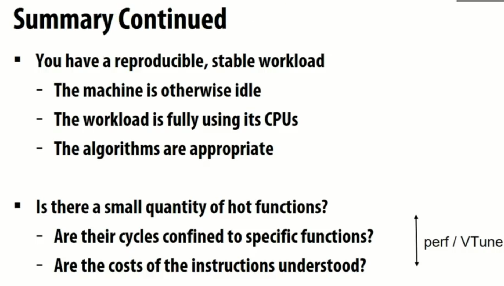


# Lec 15 - Interconnection Networks


问题: 如何构建在并发CPU中的高性能interconnection.


要考虑scalability, 性能以及能量消耗.


设计要素:
- 拓扑, 如何连接switch.
- 路由, 数据如何传输, 逻辑是静态还是动态.
- 网络中数据的内容, 是否要分片.
- 如何管理buffer空间.

- routing distance 路由距离: 两个结点之间的link(hop)的数量.
- diameter 直径: 最大的路由距离.
- average distance 平均路由距离: 所有合法节点之间的平均距离(可能往往与直径差不多).

direct network中, 结点本身也是路由(因此图里是结点和路由一一对应).


bisection bandwidth 对分带宽: 把网络切分成等量节点的两部分需要去除的link数量. 对分带宽越低的话, link的压力会越大.

non-block网络指任意节点对都被连接, 使得任意消息不会收到其他消息影响 的网络, 否则就是block网络.


<u>拓扑</u>, <u>路由算法</u>和<u>拥塞控制(flow control)</u>共同决定了**最低延迟**和**最大吞吐量**:


## Interconnect 例子

**Bus(总线)**, 只抢一个link:


**Crossbar**, 让所有节点对之间可以使用<u>一跳</u>来到达, 是<u>non-blocking</u>的:


**Ring**, 环形连接:


intel使用ring来连接cache等. 使用四个ring; L3 cache被分成多份来连接, 且一个bank会连到两个ring.


**Mesh**, 网状密铺((在芯片里常见). 一般会先一个方向传播完毕后再于另一个方向传播, 以防止死锁等问题.


**Torus**, 在Mesh的基础上连接一行或一列的两端, 减少结点对之间的距离差距. 但是这样新增的link都特别长.


**Folded Torus**, 在Torus的基础上, 把环形的一行变成均匀的环, 使得节点之间的link长度相比mesh翻倍, 但消除了特别长的link. 注意, 数字编号是按环顺序来标记的, 因此体现为交错.


**Tree**:
- 左边这个叫**H-Tree**, 拓扑上即是一个二叉树, 叶子是结点, 中心路由是树根. 二分带宽永远是1.
- 右边这个叫**Fat-Tree**. 虽然拓扑一样, 但Fat-Tree为了应对二分带宽问题,越接近根结点的link越要有高带宽承载能力, 每一层都翻倍. 二分带宽是$O(N)$.


二叉树的路由: 由于结点按序号排在叶子上, 因此, 只需要看其编号的二进制, 就能得到源结点也目标结点的第一公共祖先; 先一路往上路由到公共祖先, 然后往下根据每一位是0还是1进行左右路由.


Fat-Tree的路由逻辑和上面的一样, 但有多个可选link时进行随机选择. 这就导致了一个问题, <u>每一层的交换机都有不同的接口数量</u>, 因此需要不同的设计, 在可扩放性上会出问题.


**Constant-Width Fat Tree** 解决了交换机接口数量的问题, 使得中间层的所有交换机的度数都是4, 顶层都是2. 在超级电脑等高性能设备里面用的多.


**Hypercude**: 通过创建更高维的立方体来获得更多的节点容量, 加一维翻一倍, 四维的能容纳16个结点. 加一维就是把低一维的立方体复制一下, 然后把每个对应节点都相连. 其<u>路由</u>也简单, 任意点上都有着和维度数一样的link数量, 而每个维度都对应独立的二进制位, 因此路由只需要随便挑选不一致的二进制位来走就行(缩短汉明距离).
- 对分带宽是$O(N)$.
- 维度变高后, 在物理世界很难布局.
- 有一种扩展是, 让每一维度不只占用一位.


**Multi-stage logarithmic**: 使用二进制位进行路由. 每个路由的右边是两个一上一下的出口link; 从所连的第一个路由开始, 根据目标结点编号的高位是0还是1来选择下或上的link; 这使得给出目标结点后, 从不同结点出发, 以此模式都能走到目标结点.


- Cost指link和交换机的数量.


## Buffering & Flow Control

- circuit switching: 连续的持续连接
- packet switching: 按包为单位的连接


冲突的三种解决:
- 缓存到buffer稍后发送(目前考虑)
- 丢弃
- 重路由(当下研究热点)


**Store-and-forward**: 很多数据包被分开存在buffer内, 一个一个发送, buffer存储后再转发.


**Cut-through**: 当接收完一个包的头时, 如果判断其能继续发送(下一跳link可用), 那么就直接开始转发此包(流式转发), 而不需要等待包被自己完全接收; 否则完全接收此包到buffer内.


**Wormhole**: 把包分成小块的Flit; 像是贪吃蛇.
- head flit 包含元数据, 它*引导*了后面所有flit的行为(路由等). 它阻塞的话后面的flit也会停止.
- 中间的flit没有元数据, 因此在<u>遇到tail之前</u>接收方会一直接收flit, 也因此经过的link都被此包*独占*, 直到发送完毕(tail flit经过); 这些中间的flit会被按head flit的路径进行转发.
- 由于flit很小, 因此一个大数据包可能会被存储在<u>非常多的路径上的路由</u>内.
- 网络从繁忙到通畅时, 各个大数据包往往已经分布在网络的很长一条线上(每个路由缓存了各个包的极小一份), 可以很快被最终接收方接到, 并且以flit为单位慢慢接受完毕. 因此这是<u>完全流水线</u>的, 且大数据包的延迟与网络距离几乎无关.


 **head-of-line blocking** 问题: 由于head flit经过link之后会独占此link, 直到tail flit之后才会释放, 因此被阻塞的包可能会拥堵其他未被阻塞的包的路径, 甚至在设计不当时造成死锁(通过先移动一个方向再移动正交方向即可避免死锁). 例如下图中, 阻塞了的灰色包把未阻塞的蓝色包的前路堵住了.


**Virtual channel**: 添加虚拟通道层, 使得多个包可以共用一个物理link, 以避免独占link导致的互相阻塞问题.


通过让请求和响应使用不同的虚拟通道可以避免死锁. 另外, 还能进行优先级控制.


# Lec 16 - Implementing Synchronization


Primitives for ensuring mutual exclusion
- Locks
- Atomic primitives (e.g., atomic_add)
- Transactions (later in the course)

Primitives for event signaling
- Barriers
- Flags

三种同步事件:
- 要求访问权
- 等待访问权的方式
- 释放访问权给别的线程


等待访问权的方式:
- 忙等待(busy waiting)(也叫spinning), 不断轮询一个条件直到其为true, 且之后假设它一直是true.
- 阻塞(blocking)指要不到资源的时候就不调度此线程.

忙等待有时候比阻塞还要好:
1. 预期的等待时间非常短, 以至于少于调度时间.
2. 目标资源不被其他任务索求, 因此不会发生争夺.


> [!note]
> 由于cache coherence协议的特性, 对一个数据的只读轮询是不会产生什么消耗的, 这也是一个优化的切入点.


## 实现锁

忙等待的非原子化的错误实现, 实际上不会直接导致内存写冲突, 而是让不同核的cache都想将锁更新为新值, 然后通过cache coherence的一系列操作后, 各自都认为自己成功得到了锁.


使用**test-and-set**汇编来实现lock.


显然, 锁住的时候, 其他核依然会不断轮询(使用BusRdx, 会进行<u>合法cache line的争抢</u>), 浪费性能. 注意: 持有锁的核心只在上锁和解锁的**瞬间**拥有<u>合法的锁变量缓存</u>, 只不过被夺走的锁变量也没变.


cmpxchg命令.


Simple Test-and-Set Lock:>
- **Latency**: Low (under low contention)
- **Traffic**: High
- **Scaling**: Poor
- **Storage Cost**: Low (one int)
- **Fairness**: No provisions for fairness


**test-and-test-and-set lock**: 不断读取本地cache的锁值, 如果发现是解锁的值, 则进行上锁尝试.


轮询的过程是只读的, 即只进行BusRd; 发现本地的锁被解锁之后, 就开始使用BusRdX去进行上锁. 相当于解锁之后, 主动通知其他核开始争抢此锁.


每次释放锁时发生抢锁, 会产生$O(P^2)$的流量.


**test-and-set lock with back off**: 每次获取锁失败都指数退避.


**ticket lock**: 每个线程准备上锁的时候拿上一个自增的唯一的数字作为"票". 如果`now_serving`等于自己的票, 说明轮到自己了; 自己执行完毕之后, 就递增`now_serving`, 把锁交给下一个线程.
- 只有在取票的时候有一次原子操作(每次产生$O(P)$流量), 等待锁时仅仅是非常单纯的只读操作. 
- 只有在锁释放的瞬间, 每个核的锁变量被更新, 轮到的核就自知轮到自己了, 不需要争抢, 因此产生的流量仅为$O(P)$.


> [!note]
> 由于cache一致性协议保证了<u>单个内存读写的原子性</u>, 因此`now_serving`不需要加锁. 而`atomic_increment`是为了**写后读的原子性**.

**array-based lock**: 在事先知道有P个进程在抢锁的前提下(不抢锁就进行不下去), 让每个进程占用长度为P的数组的某一项, 从而检测是否轮到自己获得锁; 释放的时候就循环式地修改下一个元素以递交锁, 从而实现轮流循环获得锁.
- 加锁的时候会涉及`head`, 因此产生的流量是$O(P)$. 不过, 原子循环加操作消耗相对较大.
- 解锁的时候只需要和下一个进程交互, 因此流量是$O(1)$.


queue-based lock (MCS lock): 类似链表的东西, 依然是处理后在本地进行spin.


## 实现Barrier

**centralized barrier**: 通过使用锁, 维护一个并发安全数据结构, 来进行完成数量计数; 使用`flag`表示是否完成; 所有线程等待`flag`, 最后一个线程设置`flag`.
- 会在两次使用的时候出问题, 即当一个线程发现barrier结束后, 再次进入barrier时, 其他某个线程可能尚未得知第一个barrier已经结束(未被及时调度), 导致它们又会继续卡在第一个barrier.


正确做法是添加`leave_counter`, 在所有线程离开barrier之前, 禁止开启新一轮的barrier.


**centralized barrier with sense reversal**: 每次使用barrier都反转flag的意义(通过每个核私有的`local_sense`变量), 使得新一轮barrier开始的时候不会改变flag, 从而让前一轮的所有线程得以正常退出.
- 相比`centralized barrier`, 增加了一个私有变量, 减少了一个spin.


使用combining tree来实现barrier, 使得对锁的竞争减少, 一个子树完成barrier后再向上提交.


如果有的情况下, 并发量很低, 极大概率不会出现两个线程访问同一个临界资源的情况. 那么如何在降低锁消耗的同时, 防止偶然出现的竞争导致的错误? 有一种方式是事务内存.


# Lec 17 - Fine-grained Synchronization & Lock-free Programming

gpt 24


