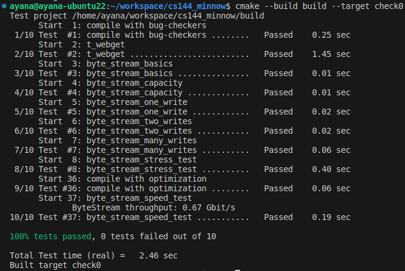
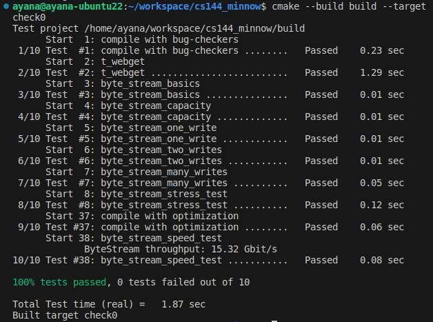
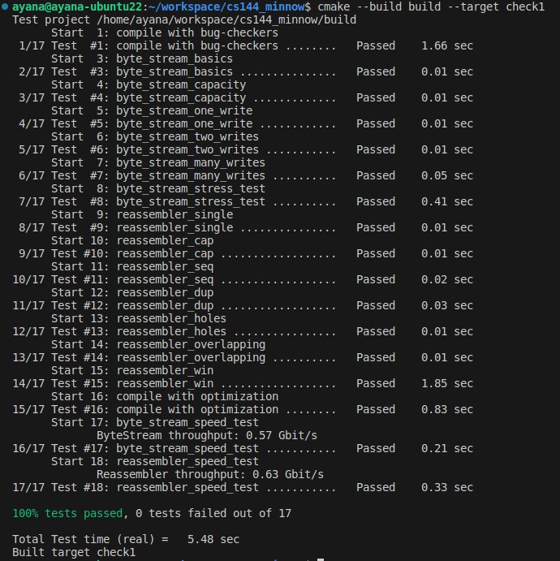
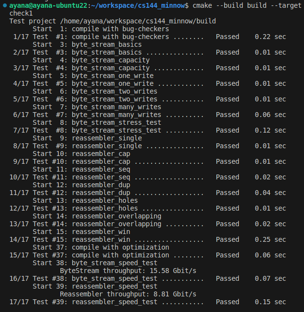
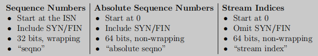
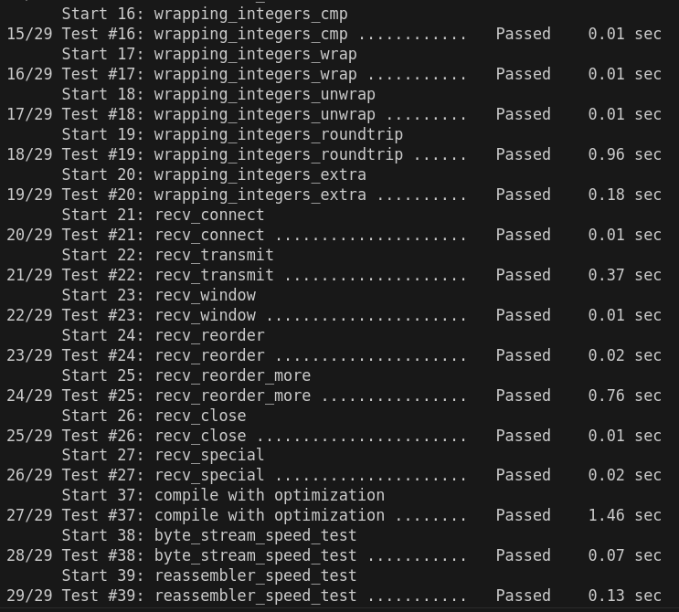
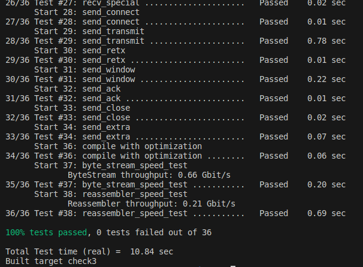
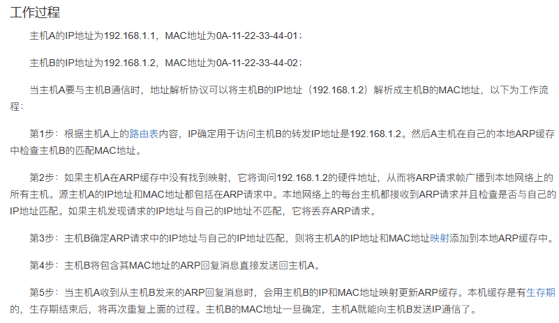
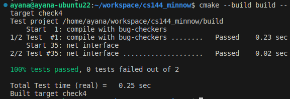
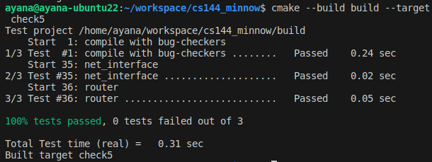

2023 minnow
# checkpoint 0
## 环境

ubuntu20.04默认apt不到gcc12，需要：[ubuntu 22.04 切 gcc/g++ 版本 - 知乎](https://zhuanlan.zhihu.com/p/639332690)

CMake 3.24.2也要手动安装：[Ubuntu安装cmake-3.24.2（成功案例）\_ubuntu 安装cmake\_处女座佩奇的博客-CSDN博客](https://blog.csdn.net/qq_42264030/article/details/128142926)

vscode的架构选择linux-gcc-x64就没有头文件红线了。
## 尝试

`Fetch a Web page`时要快速地输入那几条命令，否则会报超时。
```bash
ayana@ayana-ubuntu22:~$ telnet cs144.keithw.org http
Trying 104.196.238.229...
Connected to cs144.keithw.org.
Escape character is '^]'.
GET /hello HTTP/1.1
Host: cs144.keithw.org
Connection: close

HTTP/1.1 200 OK
Date: Tue, 17 Oct 2023 02:36:11 GMT
Server: Apache
Last-Modified: Thu, 13 Dec 2018 15:45:29 GMT
ETag: "e-57ce93446cb64"
Accept-Ranges: bytes
Content-Length: 14
Connection: close
Content-Type: text/plain

Hello, CS144!
Connection closed by foreign host.
```

```bash
ayana@ayana-ubuntu22:~$ netcat -v -l -p 9090
Listening on 0.0.0.0 9090
Connection received on localhost 55182
aaa
abc
^C

ayana@ayana-ubuntu22:~$ telnet localhost 9090
Trying 127.0.0.1...
Connected to localhost.
Escape character is '^]'.
aaa
abc
Connection closed by foreign host.
```

the socket looks like an ordinary **file descriptor** (similar to a file on disk, or to the stdin or stdout I/O streams).When two stream sockets are connected, any bytes written to one socket will eventually come out in the same order from the other socket on the other computer.

Internet datagrams: 数据报，被尽力发到对方。
1. lost
2. delivered out of order
3. delivered with the contents altered
4. duplicated and delivered more than once.

**“best-effort datagrams”** (the abstraction the Internet provides) --> **“reliable byte streams”** (the abstraction that applications usually want)

## 开发标准

>We want to avoid “paired” operations (e.g. malloc/free, or new/delete), where it might be possible for the second half of the pair not to happen (e.g., if a function returns early or throws an exception). Instead, operations happen in the constructor to an object, and the opposite operation happens in the destructor. This style is called “Resource acquisition is initialization,” or RAII.

- 永远别用 malloc/free 和 new/delete！！！
- 不用裸指针，也只在必要的时候使用智能指针
- 函数和变量能加const就加const

- `cmake --build build --target tidy` for **suggestions** on how to improve the code related to C++ programming practices
- `cmake --build build --target format` to **format** the code consistently

## socket.hh & file_descriptor.hh

>Please read over the public interfaces (the part that comes after “public:” in the files util/socket.hh and util/file descriptor.hh.

>a Socket is a type of FileDescriptor, and a TCPSocket is a type of Socket.

## webget

发送的内容其实就是个简短的GET http request。

read函数自带清空和扩展容量，因此什么字符串都能传入。

read在eof前应当一直执行，因为可能会分多次回应。使用测试用例时给每个读取结果加`-------------------`分隔符就会得到：
```
Function called: get_URL(cs144.keithw.org, /nph-hasher/xyzzy)
HTTP/1.1 200 OK
-------------------
Content-type: text/plain
-------------------

7SmX-------------------
qWkrLKzVBCE-------------------
albSPqBcvs11Pw263K7x4Wv3JckI
-------------------
-------------------
```

## in-memory reliable byte stream

>**What should the behaviour of my program be if the caller tries to pop with a `len` greater than what is available?**
We don't have any preference on the behavior if the caller tries to pop more than is buffered in the stream, as long as you behave reasonably and don't crash in that situation. If you want to pop the maximum available, that is fine with us. If you want to throw an exception, that is also fine with us.

## 命令

运行测试：
```bash
cmake --build build --target test_name
```

运行单个测试：
```bash
ctest -R single_test_name
```

格式化代码：
```bash
cmake --build build --target format
```

## byte stream

```cpp
/*
 * read: A helper function thats peeks and pops up to `len` bytes
 * from a ByteStream Reader into a string;
 */
void read( Reader& reader, uint64_t len, std::string& out )
{
  out.clear();

  while ( reader.bytes_buffered() and out.size() < len ) {
    auto view = reader.peek();

    if ( view.empty() ) {
      throw std::runtime_error( "Reader::peek() returned empty string_view" );
    }

    view = view.substr( 0, len - out.size() ); // Don't return more bytes than desired.
    out += view;
    reader.pop( view.size() );
  }
}
```



突然发现对API理解有误，peek可以返回包含多个字节的string_view，只要前缀正确即可，因此不需要一个一个char存储。改写后, 如果一个string特别长, 而且最后剩下一个字符没被pop出去, 那么这段string就不会被删除, 因此此时内存存储字节量达到的上界应该是2\*capacity.

重写后的结果：


> [!note]
> 后来又优化了一下, 代码更快了一点点, 但是莫名其妙不能输出速度信息了.


# checkpoint 1

The TCP sender is dividing its byte stream up into short segments (substrings no more than about 1,460 bytes apiece) so that they each fit inside a datagram.

May substrings provided to the insert() function overlap? Yes.

If the caller provides redundant knowledge about the same index,

the Reassembler should only store one copy of this information.

图的箭头方向是往右，指的是下标从左到右从小到大，并且重排序的过程也是从左到右。

The Reassembler’s will not store any bytes that can’t be pushed to the ByteStream either immediately, or as soon as earlier bytes become known.

如果进来的部分下标过大，不小于first_acceptable_index，则超过部分会被截断。这样的话，即使最开始的index迟迟不来，后面的index疯狂到来，也不会挤占掉最开始的index的位置。

一个设想：也许可以使用循环队列记录数据，同时维护一个map来记录所有起始点和终点。



重写byte stream后，结果如下：


# checkpoint 2

These “receiver messages” are responsible for telling the sender:
1. the index of the “first unassembled” byte, which is called the “**acknowledgment number**” or “**ackno**.” This is the first byte that the receiver needs from the sender. 尚未被装配的都被视为没收到；或者说要让装配成功必须要求first unassembled的到达。
2. the available **capacity** in the output ByteStream. This is called the “**window size**” 读缓冲区+装配缓冲区=窗口

Together, the ackno and window size describe describes the receiver’s **window**: **a range of indexes** that <u>the TCP sender is allowed to send</u>.

- left edge： ackno
- right edge： ackno + window_size
- --> need $[left edge, right edge)$

>TCP is a protocol that reliably conveys a pair of flow-controlled byte streams (one in each direction) over unreliable datagrams. Two parties, or “peers,” participate in the TCP connection, and each peer acts as both “sender” (of its own outgoing byte stream) and “receiver” (of an incoming byte stream) at the same time.

>These signals are crucial to TCP’s ability to provide the service of a flow-controlled, reliable byte stream over an unreliable datagram network. In TCP, acknowledgment means, “What’s the index of the next byte that the receiver needs so it can reassemble more of the ByteStream?” This tells the sender what bytes it needs to send or resend. Flow control means, “What range of indices is the receiver interested and willing to receive?” (a function of its available capacity). This tells the sender how much it’s allowed to send.

receiver收到消息后，还要负责构建之后回复的信息内容，包括确认信息和流量控制信息。

这里输入输出应该都是被从报文里面提取拆分出来了, 也因此Sender和Receiver解耦.

The first sequence number in the stream is a random 32-bit number called the Initial Sequence Number (ISN). This is the sequence number that represents the “zero point” or the SYN (beginning of stream).

In addition to ensuring the receipt of all bytes of data, TCP makes sure that the **beginning and ending of the stream are received reliably**. Thus, in TCP the SYN (beginning-of stream) and FIN (end-of-stream) control flags are assigned sequence numbers. **Each of these occupies one sequence number.** (The sequence number occupied by the SYN flag is the ISN.) Keep in mind that SYN and FIN aren’t part of the stream itself and aren’t “bytes”—they represent the beginning and ending of the byte stream itself.

there are two streams—one in each direction. Each stream has separate sequence numbers and a different random ISN.

2^64 Byte可以视为无限，因为要网络用满这么多要很久很久。



猜测，unwrap时的checkpoint应当全部使用已存储的absolute seqno。

The sequence number of the first arriving segment that has the SYN flag set is the initial sequence number.

Reassembler expects stream indexes starting at zero; you will have to unwrap the seqnos to produce these.

sequence_length表示占用的序列号大小，已经考虑的SYN和FIN。
```c
size_t sequence_length() const { return SYN + payload.size() + FIN; }
```

由于<u>累计确认</u>会在`Reassambler`完成, 并且`Reassambler`会同步地提交所有确认了的东西, 因此需要使用`inbound_stream.bytes_pushed()`(已提交的合法数据量)来进行ACK下标的更新.

window size超过65535时，视为65535。



# checkpoint 3

The TCPSender is a tool that translates from an outbound byte stream to segments that will become the payloads of unreliable datagrams, responsible for reading from a ByteStream (created and written to by some sender-side application), and turning the stream into a sequence of outgoing TCP segments. **given an outgoing ByteStream, split it up into segments, send them to the receiver, and if they don’t get acknowledged soon enough, keep resending them.**

The sender should keep sending segments until either the window is full or the outbound ByteStream has nothing more to send.

“outstanding” segments：Keep track of which segments have been sent but not yet acknowledged by the receiver.

The basic principle is to send whatever the receiver will allow us to send (filling the window), and keep retransmitting until the receiver acknowledges each segment. This is called “automatic repeat request” (ARQ).

Periodically, the owner of the TCPSender will call the TCPSender’s tick method, indicating the passage of time.

**retransmission timeout (RTO)** is <u>the number of milliseconds to wait</u> before resending an outstanding TCP segment. The value of the RTO will change over time, but the “initial value” stays the same. The starter code saves the “initial value” of the RTO in a member variable called initial retransmission timeout.

timer：每次有效信息发送时，若timer关闭，则将其重置为RTO。所有outstanding data被确认后，timer会关闭。收到了ack，但依然还有outstanding data，则重置timer为RTO。

RTO超时时，会统计连续重传次数，用于决定是否abort；然后将RTO翻倍（exponential backoff）。

You’ll want to make sure that every TCPSenderMessage you send fits fully inside the receiver’s window. Make each individual message as big as possible, but no bigger than the value given by TCPConfig::MAX PAYLOAD SIZE (1452 bytes).

SYN and FIN flags also occupy a sequence number each, which means that they occupy space in the window. window_size大小虽然是实际数据意义上的，但此处为了一致性似乎也将flag考虑为占位置的内容。

窗口大小为0的时候，也应当（仅仅在push方法里面）看做是1，发送小部分数据，以求得对方回复来获取window size的更新信息。刚开始的时候也默认窗口大小是1.

ack大于某个seg的全部seq时，才认为该seg被确认。

a segment which occupies no sequence numbers doesn’t need to be kept track of as “outstanding” and won’t ever be retransmitted.

FIN的话看reader关没关就行，就像Receiver看writer关没关一样。

后来的数据排在后面, 重传的数据要插队, 因此待发送数据结构使用deque

先塞SYN，剩下还有空间就塞数据，然后再剩下空间就塞FIN。 没空间塞数据很容易搞，但没空间塞FIN的时候就需要留下标记，保证能触发下一轮push, 以构造纯FIN报文。

`Impossible ackno (beyond next seqno) is ignored`说明receive到非法(比当前seq还大)的ack时要丢弃。这种ack可以认为是以前的数据包的遗留.

即使没有ack，也要记录window size。

初始windows size为1, 是为了在SYN丢包的时候触发RTO.

> [!note]
> 代码结构是, 上层主动使用`push`把数据从流里面输出到Sender对象内, 然后再使用`maybe_send`把保存的数据给发出去. push的时候就把包构造好了.



# checkpoint 4

这是最底层的接口，输出数据链路层包。

If the network interface already sent an ARP request about the same IP address in the last five seconds, don’t send a second request. ARP的单飞.

```c
// 对象转字符串
// Helper to serialize any object (without constructing a Serializer of the caller's own)
template<class T>
std::vector<Buffer> serialize( const T& obj )
{
  Serializer s;
  obj.serialize( s );
  return s.output();
}

// 字符串转对象
// Helper to parse any object (without constructing a Parser of the caller's own). Returns true if successful.
template<class T>
bool parse( T& obj, const std::vector<Buffer>& buffers )
{
  Parser p { buffers };
  obj.parse( p );
  return not p.has_error();
}
```



ARP的supported好像是给parser用的。

知道目标就把包放入send队列; 不知道目标则把ARP放入send队列, 把包放入等待队列; ARP接收成功则把相应的所有包放入发送队列. 上层会调用`maybe_send`以发送所有能发生的包.

> [!info]
> 25年版本有transmit, 会更加直接; 23年只能这样依赖`maybe_send`.

等待队列设计: `std::unordered_map<uint32_t, std::vector<std::shared_ptr<EthernetFrame>>>`.



TODO: 使用红黑树轮询定时器, 每次删除最早的.

# checkpoint 5

找到next hop之后，将其传给checkpoint 4的NetworkInterface。

prefix：网络码，prefix匹配上了就是网络匹配上了。

The interface num gives the index of the router’s NetworkInterface that should use to send the datagram to the next hop. You can access this interface with the interface(interface num) method.

匹配方式: **longest-prefix-match**：• Among the matching routes, the router chooses the route with the **biggest** value of **prefix length**. 实现: Trie.

the router sends the modified datagram on the appropriate interface ( interface(interface num).send datagram() ) to the appropriate next hop

If the router is directly attached to the network in question, the next hop will be an **empty optional**. In that case,<u> the next hop is the datagram’s destination address</u>.

路由表：根据网络码确认下一跳地址和输出用的端口。

对数据报的任何更新都需要重新计算checksum！！！如更新TTL时，否则会报parse失败。




