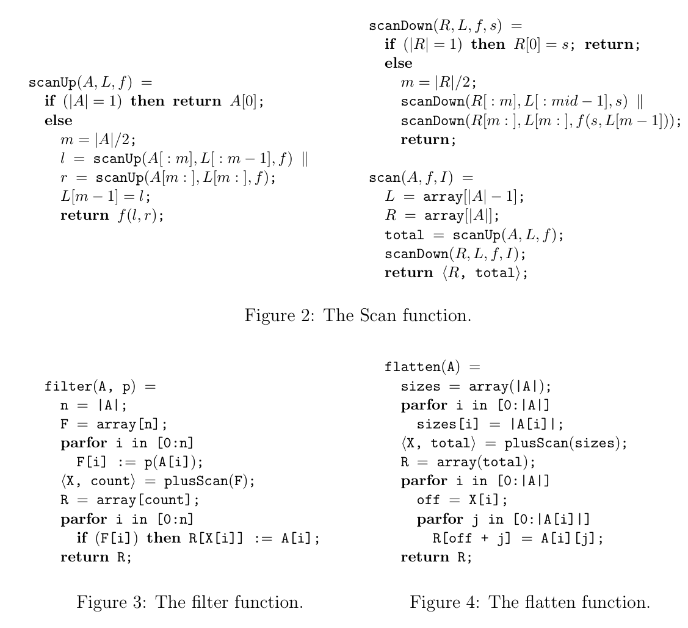

# 安装

总共有这几个东西要注意安装版本正确：
- 显卡驱动
- CUDA
- CUDA toolkit

安装好toolkit后，在`./bashrc`里面配置nvcc路径：
```bash
# CUDA toolkit
export PATH=/usr/local/cuda/bin:$PATH
export LD_LIBRARY_PATH=/usr/local/cuda/lib64:$LD_LIBRARY_PATH
```

## 多版本toolkit

安装多个版本后，`/usr/local`下可能会包含以下这些目录：
```
cuda cuda-12 cuda-12.9 cuda-13 cuda-13.0
```
它们互相通过软链接来表达“默认”语义。
- 例如，一些程序的makefile指定的链接：`-L/usr/local/cuda/lib64/ -lcudart`，表示链接当前系统内配置的默认cuda版本，例如可能是13.0。
- 配置nvcc环境变量的时候，使用的是`/usr/local/cuda/bin`，表示使用当前系统的默认cuda版本下的nvcc。

直接使用update-alternatives来切换默认cuda版本：
```bash
/usr/local$ sudo update-alternatives --config cuda
There are 2 choices for the alternative cuda (providing /usr/local/cuda).

  Selection    Path                  Priority   Status
------------------------------------------------------------
* 0            /usr/local/cuda-13.0   130       auto mode
  1            /usr/local/cuda-12.9   129       manual mode
  2            /usr/local/cuda-13.0   130       manual mode

Press <enter> to keep the current choice[*], or type selection number: 1
update-alternatives: using /usr/local/cuda-12.9 to provide /usr/local/cuda (cuda) in manual mode
```

如果只是编译好了的二进制文件在**运行时**需要链接特定版本的CUDA库，则下载安装对应版本的toolkit就行，**不需要切换版本**。

## wsl

wsl会使用Windows的CUDA driver，而一般的CUDA toolkit会自带CUDA driver并进行覆盖，这会造成wsl的CUDA出错。因此，安装wsl的时候，要指定使用wsl版本的toolkit，会保证不覆盖driver：[CUDA Toolkit 12.9 Update 1 Downloads | NVIDIA Developer](https://developer.nvidia.com/cuda-12-9-1-download-archive?target_os=Linux&target_arch=x86_64&Distribution=WSL-Ubuntu&target_version=2.0&target_type=deb_local)。

# 工程

使用saxpy介绍CUDA中与GPU的交互的基本写法：[An Easy Introduction to CUDA C and C++ | NVIDIA Technical Blog](https://developer.nvidia.com/blog/easy-introduction-cuda-c-and-c/)

核函数定义的时候，在最前面加上`__global__`（可被CPU调用）或`__device__`（只能被其他核函数调用）即可。核函数内部可以直接访问`blockIdx`、`blockDim`、`threadIdx`等变量，它们都与具体的线程有关。
```cpp
__global__ void  
judge_repeat_kernel(int* data, const int length, int* result) {  
    // 一维情况下的下标计算
    int index = blockIdx.x * blockDim.x + threadIdx.x;  
    // ...  
}
```

核函数调用的时候，函数参数依然是普通的参数，而于CUDA相关的参数都写在`<<<>>>`里面。第一个参数是block数量，第二个参数是每个block里面的thread数量。
```cpp
func_kernel<<<blocks, THREADS_PER_BLOCK>>>(data, length, result);
```

因为核函数的启动是以block为单位的，因此被启动的线程数量不一定和所需的线程数量相对应，所以一般都要在核函数参数里面加上边界信息（如`length`），然后在index超出边界的时候（如`index >= length`）不执行任何操作。

kernel的装载是异步的，可以使用`cudaDeviceSynchronize()`来等待所有CUDA任务完成。
- cudaMemcpy总是会等待对应任务完成。
- 多个CUDA任务之间按照调用顺序完成任务。
因此，大部分情况下不需要特地同步。

使用`__constant__`可以把只读数据定义在GPU的常量区。

使用`__shared__`定义变量的时候，block一启动它就初始化完毕了，因此这种变量自带static，定义在函数内的时候也不会重复申请资源。

## debug

debug的时候使用的宏，可以包裹在各个CUDA API调用的外面:
```cpp
#define CUDA_DEBUG  
  
#ifdef CUDA_DEBUG  
#define cudaCheckError(ans) { cudaAssert((ans), __FILE__, __LINE__); }  
#define cudaCheckLastError() { cudaAssert((cudaGetLastError()), __FILE__, __LINE__); }  
inline void cudaAssert(cudaError_t code, const char *file, int line, bool abort=true)  
{  
    if (code != cudaSuccess)  
    {  
        fprintf(stderr, "CUDA Error: %s at %s:%d\n",  
          cudaGetErrorString(code), file, line);  
        if (abort) exit(code);  
    }  
}  
#else  
#define cudaCheckError(ans) ans  
#define cudaCheckLastError(ans) do{}while(0)  
#endif
```
示例：
```cpp
cudaCheckError( cudaMalloc(&a, size*sizeof(int)) );
kernelRenderPixels<<<gridDim, blockDim>>>();  
cudaCheckLastError()  
cudaCheckError(cudaDeviceSynchronize());
```
不能直接包裹在kernel launch外面。一般包裹在紧接着的cudaDeviceSynchronize外面。
```cpp
kernel<<<1,1>>>(a); // suppose kernel causes an error!
cudaCheckError( cudaDeviceSynchronize() ); // error is printed on this line
```

在调用程序的shell命令前加上`compute-sanitizer`，即可探测执行错误位置。为了显示行号，需要在编译的时候在`nvcc`命令里面添加选项`-g -G`。
```bash
compute-sanitizer ./myexe
```

# 算法

scan，filter，flatten：

