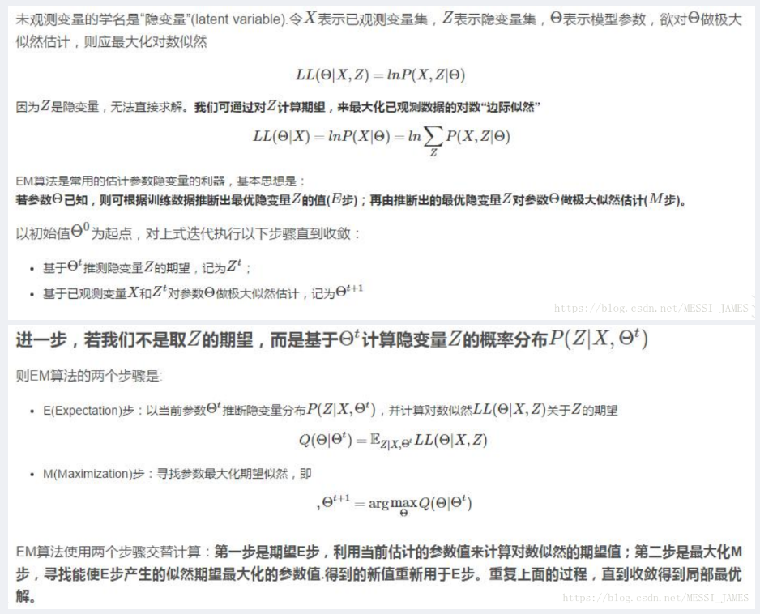
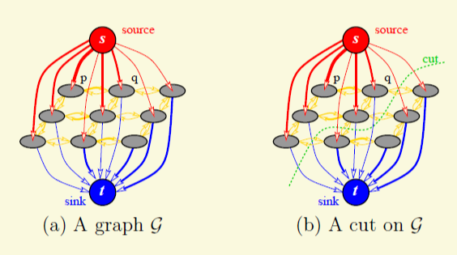
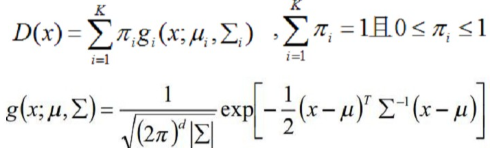

# 生词 & 关键词

iterative 迭代的
camouflflage 伪装，迷彩
interaction 交互
artefacts 伪影
segmentation 分割
monochrome 黑白的
opacity 透明度

made two enhancements to the graph cuts mechanism:
- iterative estimation: 进行一次之后有了一定的前景背景差别，第二次进行会更加准确。
- incomplete labelling: 用户只标记Tb。

trimap: 三分图，分为前景Tf、背景Tb、未知灰色区域Tu

# 后备知识

## MLE 最大似然估计

求取一种高斯分布，使得所有样本同时发生的概率最大。取log是为了好拆式子，但GMM的话由于log里面还有连加，拆不出来。

## EM 期望最大算法

推导过程中一个常用的公式：

$$p(x|θ)=\frac{p(x,z|θ)}{p(z|x,θ)}$$

每次迭代，$θ^t$都可看做常量。

EM算法的目的就是解决隐变量。如抛两个不均匀的硬币得到了一堆样本，但我们不知道它们属于哪个硬币，于是就要迭代来不断聚类。

- E-Step: 把$Q(θ,θ^{(t)})$（argmax右边的式子）给列出来。
- M-Step: 求解Q取最大值时对应的参数值。

## GMM 高斯混合模型

每个GMM由K个Component组成，每个Component都是一个Gaussian分布。

若有一堆样本，我们猜测它是由两个高斯分布组成的，那么我们就需要猜测它属于哪个高斯分布。这个归属z（有时写成π）就称作隐变量latent variable。EM要解决的就是隐变量。

样本x为观测数据observed variable。

二者结合的(x,z)为完整数据complete data。

这些Component以z为权求加权平均数即可得到整个GMM的概率密度函数。

EM结论：

- $p_{k}^{(t+1)}=\frac{1}{N}\sum_{i=1}^{n}{P(z_{i}=c_{k}|x_{i},θ^{(t)})}$ 即所有样本属于该分布的概率的算数平均数。

>两个高斯分量里面x样本的出现概率分别是$$\begin{aligned}p(x|k=1)\\p(x|k=2)\end{aligned}$$
>但我们需要的是一个后验概率：x样本出现时属于某高斯分量的概率，分别是：
>$$\begin{aligned}
 p(k=1|x)=p(x|k=1)*p(k=1)/p(x) \\ 
 p(k=2|x)=p(x|k=2)*p(k=2)/p(x)
 \end{aligned}$$
 要比大小的话，p(x)两式都有，可以忽略。

# 小记

最小割问题等价于最大流问题。

以S（前景）和T（背景）作为源点和终点，做最小割之后，即可用最小的代价将背景和前景分开。

argmin: 代入指定的参数的所有可能值，返回所得的最小结果所代入的参数。

- t-link: 与S、T相连的边的权值。
- n-link: 图像中相邻像素之间的边的权值。
## Graph Cut

- z: 图像数据
- α: 对像素的判定结果
- θ: 分布模型，或者说参数

E(α,θ,z) = U(α,θ,z) + V(α,z)

- U: the fit of the opacity distribution α to the data z
- V: smoothness term

- C: the set of pairs of neighboring pixels
- dis(·): the Euclidean distance of neighbouring pixels.
- <·>: expectation over an image sample
- β: 图片整体的对比度越低，β越大，从而能在低对比度图片下工作
- γ: 50 , a versatile setting for a wide variety of images

相邻（neighboring）为八向（上下左右对角皆可）。

- First, the monochrome image model is replaced for colour by a Gaussian Mixture Model (GMM) in place of histograms. 
- Secondly, the one-shot minimum cut estimation algorithm is replaced by a more powerful, iterative procedure that alternates between estimation and parameter learning. 
- Thirdly, the demands on the interactive user are relaxed by allowing incomplete labelling — the user specififies only TB for the trimap, and this can be done simply by placing a rectangle or a lasso around the object.

## GrabCut

Each GMM, one for the background and one for the foreground, is taken to be a full-covariance Gaussian mixture with K components (typically K = 5).具有K个分量的全协方差高斯混合

E(α,k,θ,z) = U(α,k,θ,z) + V(α,z)

In order to deal with the GMM tractably, in the optimization framework, an additional vector k = {k1,...,kn,...,kN} is introduced, with kn ∈ {1,...K}, assigning, to each pixel, a unique GMM component, one component either from the background or the foreground model, according as αn = 0 or 11 .

- K: 5 高斯分量数
- k、kn: 第n个像素对应哪个高斯分量，1~K。

- D: 某个像素在其所归属的GMM的高斯分量里面的概率密度（省去了π相关项，因为所有D都有这一个常量加数）乘上其权重然后取-log。相乘的结果必然在0和1之间，那么取-log之后必然不小于0。越合理的像素的D越小、越接近于0。
- π: 权重，这里表示成当前高斯分量的样本数占所在GMM（而不是俩GMM）的总样本数。

式9的第二第三项是对高斯分布的正态密度求log后取负，涉及多元统计的知识。∑在这里表示方差。

混合高斯模型：

画矩形相当于初始化背景部分Tb。

总共有2*K个高斯模型，每个像素都要判断在哪个模型里面自己出现的概率最大（D最大）。

从式10下面的注释可以发现，作者觉得用“隐变量有概率分布的GMM从而可以使用EM”是吃力不讨好的，不如让每个像素只完全归属于其中一个高斯分量。

构建图的时候，每个像素都会和S、T两个点连接，则最小割就会倾向于割去这两个边中小的那一个（由于还要考虑V，因此有可能选择割大的来避免割大V）。但是D是越合理越小，因此，和前景相连的边的权应当是背景的D。另外，**之所以要取-log而不是简单合理的log，是因为最小割算法不应该出现负数边**。而**此时割掉的所有边的和也恰好就是能量E**。

流程：初始就分Tb和Tu两个。Tb就是矩形之外的背景，α设为**固定**0，Tu则全部为1（之后用户可能会添加一些点让其固定为背景或前景，则都和Tb一样，在迭代中是固定不可变的）。使用kmeans初始化2\*5个GMM模型的高斯分量（背景像素炼背景的，前景像素炼前景的）。第一步，对每个像素，寻找α所对应的GMM里面的5个高斯分量中哪个分量的D最小（也即最容易产生自己）；第二步，分配完成后，对每个高斯分量重新计算三参数，即生成一个更符合自己手下的参数的高斯分布，这是它的学习过程；第三步，构建图形并切割，从而更新α。第三步里面由于每个像素都要和前景背景连接，因此相当于遍历所有2\*5个（经历过重新学习的）高斯分量以寻找最佳解（当然，“最佳解“不是直接结果，因为还要考虑V）。

？ Note that for effificiency the optimal flow, computed by Graph Cut, can be re-used during user edits.

# 实现

穷举边时，虽然每个点都有八个邻居，但每个点只要算四个方向，就能覆盖所有邻居连线。例如，右上、右、右下、下。

可能要注意不把用户指定的前景背景给迭代更新了。

可能要提前kmeans来初始化GMM。

用户指定的前景背景都要锁死，因此和算法推演的前景背景类型要分开。

不知道为什么固定为前景时，和前景的连接线为lambda=9\*gamma。

RGB三通道对应的mat.type为CV_8UC3。

