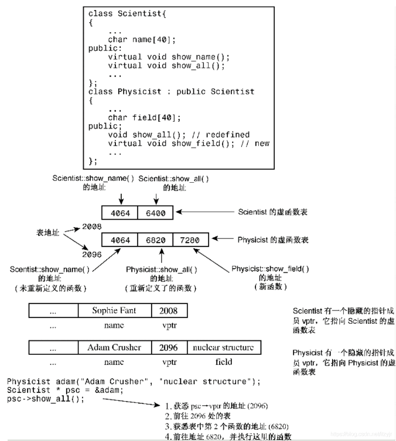
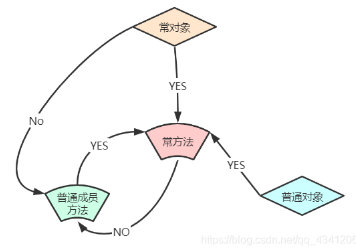
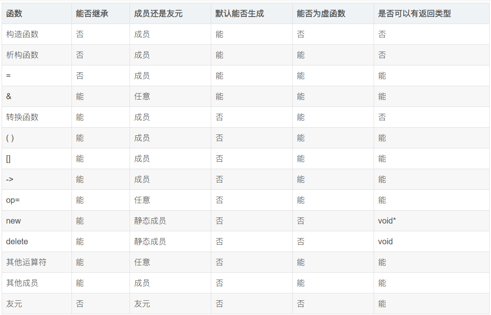

# 链接

[C++11中关键字 - 知乎](https://zhuanlan.zhihu.com/p/157523014)

[C++STL中的常用容器总结\_stl容器总结\_SeeDoubleU的博客-CSDN博客](https://blog.csdn.net/SeeDoubleU/article/details/124507029)

[C++模板元编程详细教程（之三）\_c++模板元编程实战\_borehole打洞哥的博客-CSDN博客](https://blog.csdn.net/fl2011sx/article/details/128314495)
# 规范与注意事项
## 类

成员首先按public, protected, private的顺序分块。

每一块中成员的顺序如下：

1. typedef，enum，struct，class 定义的嵌套类型
2. 常量
3. 构造函数
4. 析构函数
5. 成员函数,含静态成员函数
6. 数据成员,含静态数据成员

构造函数的初始化列表中的每个项，应独占一行。

类中不能存在不知道大小的成员。前向声明并不能提供某个类的大小，但可以取它的指针，因为指针的大小是固定的。

## STL

STL默认以vector为容器、以`operator<`为比较方式。

# 面向对象

[第13章-cpp类继承\_cpp 继承\_itzyjr的博客-CSDN博客](https://blog.csdn.net/itzyjr/article/details/103424450)

## 三大特征

1. **封装（Encapsulation）**：封装隐藏对象的属性，并且外界只能通过对外提供的接口进行访问。
2. **继承（Inheritance）**：子类可以复用父类的成员和方法，并且可以在现有代码的基础上进行功能扩展。
3. **多态（Polymorphism）**：
	1. 编译时多态：同名函数有不同的参数列表，则能够在编译时识别出调用的是哪个函数。处理函数**重载**。
	2. 运行时多态：运行时，根据传入的对象的类型决定调用哪个类的某个函数。这个函数是虚函数，被子类重写，函数名、参数列表完全一样。处理函数**重写**。

## 访问控制

同一个类的两个不同对象是可以互相访问private成员的。因为访问级别是编译时概念而非运行时。对象a和b都为Class Cls，它们都能知道Cls下有私有成员x，则a里面就可以访问b.x。

对于外部来说，protected的行为与private相似；但对于派生类来说，protected的行为与public相似。
## 向上兼容

可以用基类指针或引用指向派生类对象，如`Base *b = new Derived;`或`Derived d; Base &b = d;`。

注意，不能用`Base b = Derived();`，这会导致对象切割，本质还是在存Base。

若`Base *b = new Derived;`，则`*b`（对指针解引用）返回的是Base类型，似乎会发生对象切割。

可以把派生类指针赋值给基类指针。

[对象切割](Cpp.md#对象切割（object%20slicing）)

## 重写 & virtual

虚函数可以被重写。被重写的虚函数自动成为虚函数，但一般最好手动加virtual。

使用了virtual之后程序将根据**对象类型**而不是引用或指针的类型来选择方法版本，或者说会挑选该方法的**可获取的最“后代”的**版本，即**动态联编**；否则直接根据**指针类型**去判断要调用哪个函数，即**静态联编**。

这是**运行时多态**。

```cpp
class Base {
public:
    void func() { cout << "Base::func\n"; }
    virtual void vfunc() { cout << "Base::vfunc\n"; }
};

class Derived : public Base {
public:
    void func() { cout << "Derived::func\n"; }
    void vfunc() override { cout << "Derived::vfunc\n"; }
};

Base* b = new Derived;
b->func();  // Outputs "Base::func" 由指针类型决定
b->vfunc(); // Outputs "Derived::vfunc" 由对象类型决定
```

### 纯虚函数 & 抽象基类

```cpp
virtual T func(args) = 0;
```

当类声明中包含纯虚函数时，不能创建该类的对象。包含纯虚函数的类只用作基类。

包含纯虚函数的类成为**抽象基类（abstract base class，ABC）**。ABC的一个目的是实现接口约定。

`= 0`的作用仅仅是说明**可以在此类中不提供其实现**，但是依然是**可以进行实现**的。因此，一个拥有纯虚函数func的类作为一个不可实例化的基类，而其所有派生类的func代码完全一样时，不妨就在基类中实现它。

### 重写注意点

虚函数被重写时，会把所有名字一样的都给覆盖，即使参数列表和返回值不一样。若不一样，编译器可能发出警告，但不会编译失败。因此，如果基类有三个同名虚函数，则派生类最好要么都不重写，要么都重写。如下所示：

```cpp
class Dwelling {
public:
    // 三个重载的showperks()
    virtual void showperks(int a) const;
    virtual void showperks(double x) const;
    virtual void showperks() const;
    ...
};
class Hovel : public Dwelling {
public:
    // 三个重新定义的showperks()
    virtual void showperks(int a) const;
    virtual void showperks(double x) const;
    virtual void showperks() const;
    ...
};
```

另外，在设计上，允许在重写时仅对返回值进行修改：如果返回类型是基类引用或指针，则可以修改为指向派生类的引用或指针。这种特性被称为**返回类型协变（covariance of return type）**，因为允许返回类型随类类型的变化而变化。如下所示：

```cpp
class Dwelling {
public:
    // a base method
    virtual Dwelling & build(int n);
    ...
};
class Hovel : public Dwelling {
public:
    // 一个派生类方法，返回类型协变
    virtual Hovel & build(int n); // 相同的参数特征标
    ...
};
```

### 具体函数

**析构函数**一般要设为虚函数，因为若类被继承，则新的成员变量很可能需要特殊的析构函数去管理；有虚析构函数后，任意派生类都会先执行最子类的析构函数，然后自动执行父类的析构函数。只有析构函数有全自动的调用基类的机制。

构造函数不设为虚函数，因为派生类不继承基类的构造函数，而是隐式调用默认构造函数或显式调用某个构造函数。

友元不能是虚函数，因为友元不是类成员，而**只有成员才能是虚函数**。
### 虚函数处理原理

给每个对象添加一个隐藏成员是一个指向函数地址数组的指针，且尽可能靠前。这种数组称为虚函数表（virtual function table，vtbl）。vtbl和类进行绑定，每个对象的指针隐藏指针都指向同一个vtbl。

虚函数表中存储了为类对象进行声明的虚函数的地址。例如，基类对象包含一个指针，该指针指向基类中所有虚函数的地址表。派生类对象将包含一个指向另一个属于自己的vtbl的指针。如果派生类提供了虚函数的新定义，该虚函数表将保存新函数的地址；如果派生类没有重新定义虚函数，该vtbl将保存函数原始版本的地址。如果派生类定义了新的虚函数，则该函数的地址也将被添加到vtbl中。

不管一个派生类被什么指针指着，那个指针都能访问到这个唯一的隐藏指针，也就定位到了基于对象真实类型的虚函数表。




## 重载

同名方法不同参数列表，即可根据参数在编译期自动选择哪个方法。

这是**编译时多态**。

先把所有同名函数作为候选者，然后匹配：
1. 精确匹配。
2. 通过默认参数能够匹配。
3. 通过默认类型转换能够匹配。

若出现二义性或者完全找不到，则报错。

```cpp
// Function overload #1
void display(int num) {
    std::cout << "Displaying int: " << num << std::endl;
}

// Function overload #2
void display(double num) {
    std::cout << "Displaying double: " << num << std::endl;
}

// Function overload #3
void display(char const *str) {
    std::cout << "Displaying string: " << str << std::endl;
}

int main() {
    display(5); // Calls function overload #1
    display(5.5); // Calls function overload #2
    display("Hello"); // Calls function overload #3

    return 0;
}
```

## 对象切割（object slicing）

把子类对象赋值给父类对象（形如`Father f = Son();`）时，会把子的多余成员变量给切割掉。

```cpp
class Father {
public:
    int a;
};

class Son : public Father {
public:
    int b;
};

int main() {
    Son s;
    s.a = 1;
    s.b = 2;

    Father f = s;
    // f now only has 'a', 'b' is sliced off
}
```

## 确定运行时对象的类

基类指针指向派生类对象时，我们有可能要根据派生类的真正类型来判断要调用什么方法，或想要调用派生类有而基类没有的方法。

### dynamic_cast

可以实现**指针安全转换**。`dynamic_cast<D*>(B)`在B能转成D时返回转换后的指针，否则返回nullptr。

转换前后的指针指向同一个对象。

```cpp
Base *bp = /* ... */;
Derived1 *d1 = dynamic_cast<Derived1*>(bp);
if (d1 != nullptr) {
    // bp points to an object of type Derived1
} else {
    Derived2 *d2 = dynamic_cast<Derived2*>(bp);
    if (d2 != nullptr) {
        // bp points to an object of type Derived2
    }
}
```

### 利用virtual性质

若`Base *b=new Derived1();`且Base中有virtual函数func、Derived1中重写了func，则`b->func()`会调用Derived1的函数。利用这个性质，可以在Derived::func中反馈“这个指针b指向的是Derived1类而不是Derived2或者Base”。

**单分派（single dispatch）、双分派（double dispatch）**：传入一个（两个）参数，根据参数的运行时类型确定该使用哪个方法处理它们。

双分派例子：父类Shape，有三个子类Circle、Square、Triangle。要求定义一个函数intersect(Shape* s1, Shape* s2)，使得输入两个子类对象之后，能判断两个对象是否属于同一个类。

#### 解法1

令Shape包含：

```cpp
virtual bool intersect_sec(Shape* const s) = 0;
virtual bool judgeIntersect(Circle& s) = 0;
virtual bool judgeIntersect(Square& s) = 0;
virtual bool judgeIntersect(Triangle& s) = 0;
```

子类将实现它们。每个judgeIntersect函数都在参数类型与自己类型一样时返回true，否则返回false。比如`Square::judgeIntersect(Square& s)`恒返回true，其他两个返回false。

intersect函数先调用`s1->intersect_sec(s2)`，这样就调用了s1内的intersect_sec，也就相当于知道了s1的类型。而每个子类里面的intersect_sec函数都是这样实现的：

```cpp
bool intersect_sec(Shape* const s){
	return s->judgeIntersect(*this);
}
```

`*this`将s1自己以确切的类型传给s2，使用s2的judgeIntersect很快就判断出是否是同类型了。

#### 解法2

先化为两个单分派问题，获取人为规定的类型标识，然后进行判断即可。

```cpp
enum ShapeType { CIRCLE, SQUARE, TRIANGLE };

class Shape {
public:
    virtual ~Shape() {}
    virtual ShapeType getType() const = 0; // Pure virtual function
};

class Circle : public Shape {
public:
    ShapeType getType() const override { return CIRCLE; }
};

class Square : public Shape {
public:
    ShapeType getType() const override { return SQUARE; }
};

class Triangle : public Shape {
public:
    ShapeType getType() const override { return TRIANGLE; }
};

bool intersect(const Shape* s1, const Shape* s2) {
    return s1->getType() == s2->getType();
}
```

## 继承访问控制

继承时可以指定访问等级，使得继承后基类成员的访问等级不得高于继承访问等级。


## 调用基类函数/运算符

派生类中，如果想调用基类的函数，但这个函数在派生类中被重写了或正在重写中，则要显式地指定基类函数，如`Base::func()`。如果是运算符的话，则用函数表示法写出，如`Base::operator=(arg)`。

```cpp
hasDMA & hasDMA::operator=(const hasDMA & hs) {
    if (this == &hs) 
        return *this;
    baseDMA::operator=(hs); // 用[函数表示法]赋值基类部分，这样才不会形成递归调用！
    delete [] style; // 为新style作准备
    style = new char[std::strlen(hs.style) + 1];
    std::strcpy(style, hs.style);
    return *this;
}
```

## 类间互相依赖问题

首先明确，两个文件是不能互相include的，编译也是有执行顺序的（只有类内部才有类似拉链回填的机制）。

#### 成员变量类型相互依赖

两个类的其中一个成员变量的类型为对方。编译时只能先编译其中一个类，此时它就不知道另一个类，导致编译失败。

使用前向声明可以解决一部分问题，因为声明是廉价的，声明之后就可以得知存在另一个类，即使不知道它有什么内容。

但是，一个类编译完成时，其大小是确定的。但是此时不知道另一个类的内容，也就不知道另一个类的大小，使得总大小不确定。将类型换成指针即可，因为指针虽然可以指向各种不同类型，但其本身的大小是固定的（如64bit）。


```cpp
class ClassB; // Forward declaration

class ClassA {
    private:
        ClassB* classBInstance; // Use pointer instead of object
};

class ClassB {
    private:
        ClassA* classAInstance; // Use pointer instead of object
};
```

#### 静态变量类型相互依赖

**警告：这个疑似没什么用**

两个类各有一个静态成员变量的类型为对方。由于static是必须立刻初始化的，因此我们无法做到真正初始化它们。

可以都初始化为nullptr，并在第一次访问时真正初始化。

```cpp
class ClassB; // Forward declaration

class ClassA {
    private:
        static ClassB* classBInstance;
    public:
        static ClassB* getClassBInstance();
};

class ClassB {
    private:
        static ClassA* classAInstance;
    public:
        static ClassA* getClassAInstance();
};

// Implementations
ClassB* ClassA::classBInstance = nullptr;
ClassA* ClassB::classAInstance = nullptr;

ClassB* ClassA::getClassBInstance() {
    if (classBInstance == nullptr) {
        classBInstance = new ClassB();
    }
    return classBInstance;
}

ClassA* ClassB::getClassAInstance() {
    if (classAInstance == nullptr) {
        classAInstance = new ClassA();
    }
    return classAInstance;
}
```


# 库与语法

## 空指针

空指针指向特定范围的存储空间，这个空间永远不会与物理存储器有映射。

对空指针的delete不会报错。

>delete一个指针后，它不会指向空指针，而是指向非法空间，造成野指针错误。因此可以考虑delete一个指针后将其赋值为nullptr。

**nullptr是有类型的，且仅可以被隐式转化为指针类型。**

NULL可能会被定义为0，若有两个同名不同参的函数（重载），一个的参数类型为指针、另一个的参数类型为int，则传入NULL时可能执行参数类型为int的那一个函数。
## 命名空间

`using namespace xxx`表示使用xxx整个命名空间；而`using xxx:fx`表示使用xxx命名空间下的fx。

## explicit

[C++11 新特性 之 explicit关键字 - 显示构造与隐式构造\_explicit 构造\_cpp\_learners的博客-CSDN博客](https://blog.csdn.net/cpp_learner/article/details/117883912)

定义一个类的构造函数时，默认可以通过赋值的形式经由此构造函数构建对象：

```cpp
Student S1(22); // 显示构造 
Student S2 = 23; // 隐式构造
```

而在构造函数前加上`explicit`即可禁用该构造函数的隐式构造。

## const

被const修饰的东西为常量，必须初始化。类的常量成员使用初始化表来初始化。

>C语言中const被当做变量来编译，可以不初始化。c++中所有出现const常量名字的地方，都被常量的初始值替换了。

```cpp
//a本身不能被更改
const int a = 20;

//不能通过p间接修改其指向的内存，因为此时修饰着*p，表示解引用后的数据
const int *p;
int const *p;

//不能修改p本身，因为此时直接修饰p，为常指针
int* const p;

//p本身不能改，也不能通过p修改其指向的内存
const int *const p;

//函数返回值上的const都是为了防止出现左值、指针等导致外部对内部可修改
const int* func1();

//不能更改调用此方法的对象。此const可以看做是在修饰this
void Obj::func() const {...} 
```


## 类函数



## 数据机制

[【Modern C++】深入理解移动语义](https://mp.weixin.qq.com/s/GYn7g073itjFVg0OupWbVw)
### 引用

- 左值引用，使用T&，只能绑定左值
- 右值引用，使用T&&，只能绑定右值
- 常量左值，使用const T&,既可以绑定左值，又可以绑定右值，但是不能对其进行修改
- 具名右值引用，**编译器会认为是个左值**

[CPP11-右值引用 - 简书](https://www.jianshu.com/p/06b0b17c62bc)

要把右值引用看成用于接住右值、给它续命的东西。

由于具名右值引用被视为左值，因此我们要把它转回右值引用时就需要再用move或forward。

#### 引用折叠

- X& &、X& &&、X&& &都折叠成X&。
- X&& &&折叠为X&&。

### 特殊成员函数

- 默认构造函数 `Obj()`
- 析构函数 `~Obj()`
- 拷贝构造函数 `Obj(const Obj&)`
- 拷贝赋值运算符 `Obj& operator=(const Obj&)`
- 移动构造函数 `Obj(Obj&&)`
- 移动赋值运算符 `Obj& operator=(Obj&&)`

特殊成员函数若未被定义，则会由编译器自动生成。

>注意，xx构造函数都叫构造函数，都不能为virtual！

- `Obj o2=o1;`调用**拷贝构造函数**
- `Obj o2; o2=o1;`调用**拷贝赋值运算符**
- `Obj o2=move(o1);`调用**移动构造函数**
- `Obj o2; o2=move(o1);`调用**移动赋值运算符**
- `Obj o2=Obj();`调用**移动构造函数**（因为传的是右值）
- `Obj &&o1; Obj o2=o1;`调用**拷贝构造函数**（因为具名右值引用被视为左值）


移动相关：
- 只有一个类没有显示定义**拷贝构造函数、赋值运算符以及析构函数**，且类的**每个非静态成员都可以移动**时，编译器才会生成默认的**移动构造函数或者移动赋值运算符**。这是为了防止生成的移动不是开发人员想要的（因为开发人员选择自己管理复制和释放），或存在有问题的移动。
- 如果类中没有提供移动构造函数和移动赋值运算符，且编译器不会生成默认的，那么我们在代码中通过std::move()调用的移动构造或者移动赋值的行为将**被转换为调用拷贝构造或者赋值运算符**。因此对于不可移动的数据类型也可以像可移动的数据类型一样写代码，会自动变成复制操作。
- 移动构造函数和移动赋值运算符的生成是**不独立**的，若只实现了其中一个，则编译器**不会**自动生成另一个。这是为了防止移动出现问题。

拷贝相关：
- 如果显式声明了**移动构造函数或移动赋值运算符**，则**拷贝构造函数和拷贝赋值运算符**将被 **隐式删除**。
- 拷贝构造函数和拷贝赋值运算符的生成是**独立**的，若只实现了其中一个，则编译器也**会**自动生成另一个。

基础数据类型都没有实现移动。

#### 特殊成员函数编写规范

复制、移动操作应该是无副作用的。而且如果有副作用的话，会因为编译器的优化导致出现意想不到的结果。

构造函数不要抛出异常。

复制操作应该尽可能进行复制，特别是new出来的东西要复制一份一模一样的而不是共用。

移动操作尽可能实现move语义，保证原对象被吃干抹净。

### 完整对象示例

```cpp
class BigObj { 
public: 
	// Constructor
	explicit BigObj(size_t length) : length_(length), data_(new int[length]) { } 
	// Destructor. 
	~BigObj() { 
		if (data_ != NULL) { 
			delete[] data_; 
			length_ = 0; 
		} 
	} 
	
	// 拷贝构造函数 
	BigObj(const BigObj& other) : length_(other.length_), data(new int[other.length_]) { 
		//直接复制数据
		std::copy(other.mData, other.mData + mLength, mData); 
	} 
	
	// 赋值运算符 
	BigObj& operator=(const BigObj& other) { 
		if (this != &other;) { 

			//删去自己原有的数据
			delete[] data_; 

			//重建并复制数据
			data_ = new int[length_]; 
			length_ = other.length_; 
			std::copy(other.data_, other.data_ + length_, data_); 
		} 
		return *this; 
	} 
	
	// 移动构造函数 
	BigObj(BigObj&& other) : data_(nullptr), length_(0) { 

		//获取数据所有权
		data_ = other.data_; 
		length_ = other.length_; 

		//剥夺对方的数据所有权
		other.data_ = nullptr; 
		other.length_ = 0; 
	} 
	
	// 移动赋值运算符 
	BigObj& operator=(BigObj&& other) { 
		if (this != &other;) { 

			//删去自己原有的数据
			delete[] data_; 

			//获取数据所有权
			data_ = other.data_; 
			length_ = other.length_; 

			//剥夺对方的数据所有权
			other.data_ = NULL; 
			other.length_ = 0; 
		} 
		return *this; 
	} 
	
private: 
	size_t length_; 
	int* data_; 
};
```

### std::static_cast

用于类型转换（替代了C风格的`(Type)var`）。
### std::copy

```cpp
template<class InputIterator, class OutputIterator>
  OutputIterator copy (InputIterator first, InputIterator last, OutputIterator result)
{
  while (first!=last) {
    *result = *first;
    ++result; ++first;
  }
  return result;
}
```

指定源的起点、终点，和目标的起点，即可将`[first,last)`处的数据进行逐个复制。调用的是拷贝赋值运算符。

目标要有容纳这些被拷贝的数据项的空间。

目标不应在`[first,last)`当中。

### std::move

```cpp
//C++11 std::move的实现 
template<typename T> 
typename remove_reference<T>::type&& move(T&& param) { 
	using ReturnType = typename remove_reference<T>::type&&; 
	return static_cast<ReturnType>(param); 
}
```

>std::move is used to indicate that an object t may be "moved from", i.e. allowing the efficient transfer of resources from t to another object. In particular, std::move produces an xvalue expression that identifies its argument t. It is exactly equivalent to a static_cast to an rvalue reference type.

- 如果传递的是左值，则推导为左值引用，然后由static_cast转换为右值引用
- 如果传递的是右值，则推导为右值引用，然后static_cast转换为右值引用

转换的过程不存在复制，也不存在数据剥夺，在运行时什么都没做，只是个单纯的数据转换。

若将move结果赋值给一个变量（左值），则会调用其移动操作。

**move语义**：将左值对应的内存的所有权进行转交，原对象在move后不可使用。移动操作应当以move语义为目标。

因此，移动操作一般要做到：将原对象的数据移至自己的手下，并让原对象失去数据。

**自定义的类不会自动带有真正的、完整的move语义**，编译器自动生成的移动构造函数只是可以调用其各个成员变量的移动构造函数。因此，对于自定义类来说，想实现移动语义必须实现非常具体的移动构造函数。

移动构造函数在删除原对象对数据的所有权时，**要那些指针设为nullptr**。因为即使一个左值a被move到另一个左值b，a本身是不会被消除的，**在a的生命周期结束后会自动调用其析构函数**，从而可能触发野指针错误或者对一个数据进行多次析构（a和b都会调用析构函数）。

### forward 完美转发 

能转发：
```cpp
[const] T &[&]
即：
const T &
T &
const T &&
T &&
```

**万能引用**：由于引用折叠，模板函数参数为右值引用形式（T&&）时可以无害地接收左右值：

```cpp
template<typename T> 
void f(T&&);

int i = 42;
f(i)
```

如果是其他模板的话T为int，但这里会例外地推断出T为int&，从而实例化f(T& &&)，即f(T&)。

万能引用接收参数的时候，可能会出现右值变左值（具名右值引用）等问题。使用`std::forward<T>(x)`可以保证其不发生改变，左值回归左值，右值回归右值，从而正确地调用拷贝操作/移动操作。

和move差不多，都在运行时没做任何改动，仅仅是转换。

```cpp
#include <iostream>
#include <memory>
#include <utility>
 
struct A {
    A(int&& n) { std::cout << "rvalue overload, n=" << n << "\n"; }
    A(int& n)  { std::cout << "lvalue overload, n=" << n << "\n"; }
};
 
class B {
public:
    template<class T1, class T2, class T3>
    B(T1&& t1, T2&& t2, T3&& t3) :
        a1_{std::forward<T1>(t1)},
        a2_{std::forward<T2>(t2)},
        a3_{std::forward<T3>(t3)}
    {
    }
 
private:
    A a1_, a2_, a3_;
};
 
template<class T, class U>
std::unique_ptr<T> make_unique1(U&& u)
{
    return std::unique_ptr<T>(new T(std::forward<U>(u)));
}
 
template<class T, class... U>
std::unique_ptr<T> make_unique2(U&&... u)
{
    return std::unique_ptr<T>(new T(std::forward<U>(u)...));
}
 
int main()
{   
    auto p1 = make_unique1<A>(2); // 右值
    int i = 1;
    auto p2 = make_unique1<A>(i); // 左值
 
    std::cout << "B\n";
    auto t = make_unique2<B>(2, i, 3);
}
```

输出：

```txt
rvalue overload, n=2
lvalue overload, n=1
B
rvalue overload, n=2
lvalue overload, n=1
rvalue overload, n=3
```

## ROV & NROV

两个优化都自动将返回的目标左值作为隐式参数以引用的形式传入到函数中，以减少多余的构造、析构和拷贝。

### RVO 返回值优化（Return Value Optimization）

返回为临时对象时有效。

```cpp
T f() { 
	return T(); 
} 

int main(){
	T t=f();
}
```

上面的代码若未优化，则`return T()`会进行一次构造，然后拷贝再析构。优化后`f()`等价于：

```cpp
void f(T &t){
	t=T();
	return;
}
```

但是，如果是返回被命名的变量，也即函数内局部变量的话：

```cpp
Data process(int i) {
    Data data;
    data.mem_var = i;
    return data;
}

int main() {
    Data data;
    data = process(5);
}
```

则等价于：

```cpp
void process(Data &data,int i) {
    Data d;
    d.mem_var = i;
    data=d; //data=Data(d);
    return;
}
```

还是有多余的构造、拷贝、析构。

>从`c++17`开始，`copy elision`得到保证，强制使用RVO

### NRVO 命名返回值优化（Named Return Value Optimization）

若返回的变量是函数内的局部变量时（注意，不能是函数参数）有效。

```cpp
Data process(int i) {
    Data data;
    data.mem_var = i;
    return data;
}

int main() {
    Data data;
    data = process(5);
}
```

上面的代码若没有优化，则process内部也会构造一个对象，然后复制给外部的data变量，随后析构。

优化后，process函数等价于：

```cpp
void process(Data& data,int i) {
    data.mem_var = i;
    return;
}
```

NRVO无法优化的情况：
- 返回类型具有非默认的析构函数。
- 函数有多处return，且返回的变量不同。

编译时添加选项`-fno-elide-constructors`可以关闭NRVO。

## 后置返回值类型
[模板函数——后置返回值类型（trailing return type）\_模板函数返回\_HerofH\_的博客-CSDN博客](https://blog.csdn.net/qq_28114615/article/details/100553186)

```cpp
template <class T>  
auto Get(std::string_view key) const -> const T *;
```

auto为占位符，实际上是箭头后的`T*`。

由于返回值是无法推导的，而使用decltype需要使用函数参数，但此时函数参数未定义，于是一般使返回值后置并使用decltype进行推导。

## 智能指针
### unique_ptr转shared_ptr

```cpp
std::shared_ptr<T>(std::move(ptr))
```

### make_unique新建对象

泛型为类，参数会被传入类的构造函数。

```cpp
std::make_unique<TrieNodeWithValue<T>>(children_, value_)
```

## std::ref

传入参数时就指定使用引用输入（平时都是在接收的时候才决定是引用）。
## string_view
对string的一个引用，不发生拷贝。

## 函数（谓词）
### 仿函数（闭包）

若一个类重载了`operater()`，则其实现是个可调用对象，也叫仿函数、闭包。

### Lambda表达式

```cpp
[ 捕获 ] ( 形参 ) -> ret { 函数体 };
```

式子会返回一个匿名、右值的闭包。

当编译器可以推导返回值类型的时候（包括无返回值时），可以不写`-> ret`。

底层逻辑其实就是仿函数，即编译器自动生成一个重载了`operater()`的类。

#### 捕获
在调用lambda表达式时不需要把捕获中的变量当成参数输入，就可以把它们传进去（相当于在定义时而非在调用时传入变量）。

```txt
[]：默认不捕获任何变量；
[=]：默认以复制捕获所有变量；
[&]：默认以引用捕获所有变量；
[x]：仅以复制捕获x，其它变量不捕获；
[x…]：以包展开方式复制捕获参数包变量；
[&x]：仅以引用捕获x，其它变量不捕获；
[&x…]：以包展开方式引用捕获参数包变量；
[=, &x]：默认以复制捕获所有变量，但是x是例外，通过引用捕获；
[&, x]：默认以引用捕获所有变量，但是x是例外，通过复制捕获；
[this]：通过引用捕获当前对象（其实是复制指针）；
[*this]：通过复制方式捕获当前对象；
```

### std::function （包装器）

`function<int(int, int) >`可以统一所有的函数类型，它可以是函数指针、仿函数和Lambda表达式。

使用样例：作为map的键的类型，这样就可以用Lambda表达式来传值。

### std::bind

将函数包装器与参数进行绑定（也可使用`std::placeholders`进行缺省），返回类型也是包装器，可以直接调用。

```cpp
#include <iostream>
#include <functional>
​
void func(int i)
{
    std::cout << "i = " << i << std::endl;
}
​
int main()
{
    auto f1 = std::bind(func, 222);
    f1();
    auto f2 = std::bind(func, std::placeholders::_1);
    f2(333);
    return 0;
}

```

## decltype

将参数的类型返回，用于推断类型。

```cpp
// sum的类型就是函数f返回的类型
decltype(f()) sum = x;
```

decltype返回类型说明符（如int、double之类）。

参数可以为表达式。参数中的表达式并没有真被计算，函数也不会真被执行，而只是单纯由编译器分析。

## sort函数

默认从小到大。

重载`operator<`即可重建该对象的排序规则。

也可以添加比较函数：
```cpp
//比较函数，使其从大到小排
int cmp(const int &a, const int &b) { 
	if(a > b) { 
		return true; 
	} 
	return false; 
}
sort(arr, arr+len, cmp);
```


## stable_sort函数（稳定排序）

和sort函数用法一样，但是稳定。

## less greater 比较类

在头文件`functional`中。

如int的比较类就是`greater<int>`，表示取大（`>`）。将其对象传入sort就是从大到小排序：
```cpp
sort(arr, arr+len, greater<int>());
```

## priority_queue 优先级队列

就是个堆。

优先级：排前面（上面）的优先级高。在sort中排在后面的，在priority_queue中就排在前面，也就是优先级高。

默认为大顶堆。

在头文件`queue`中。

```cpp
priority_queue<类型,容器,比较函数类型>

//大顶堆（降序）
priority_queue<int> big_heap;
priority_queue<int,vector<int>,less<int>> big_heap2;

//小顶堆（升序）
priority_queue<int,vector<int>,greater<int>> small_heap;

//传入自定义函数
priority_queue<pair<int, int>, vector<pair<int, int>>, decltype(&cmp)> q(cmp);

//使用仿函数
struct cmp{
    bool operator ()(const node &a, const node &b){
        return a.value>b.value; //按照value从小到大排列
    }
};
priority_queue<node, vector<node>, cmp>q;

//重定义运算符
struct node{
    int value;
    friend bool operator<(const node &a,const node &b){
        return a.value<b.value; //按value从大到小排列
    }
};
priority_queue<node>q;
```

| 方法      | 功能                             |
| --------- | -------------------------------- |
| push()    | 在优先级队列末尾插入新元素并调整 |
| emplace() | 在优先级队列末尾构造新元素并调整 |
| pop()     | 删除优先级最高的元素             |
| top()     | 获取优先级最高的元素             |
| size()    | 获取优先级队列的大小             |
| empty()   | 验证队列是否为空                 |
|   swap()        | 交换两个优先级队列的内容                                 |

## 字符串

[C++中将Char转换成String的4种方法\_C 语言\_脚本之家](https://www.jb51.net/article/277515.htm)
### String

| 方法      | 功能                                                                                                                 |
| --------- | -------------------------------------------------------------------------------------------------------------------- |
| Operators | 可以用 == ， >， <， >=， <=， and !=比较字符串。 可以用 + 或者 += 操作符连接两个字符串， 并且可以用[]获取特定的字符 |
| append()  | 在字符串的末尾添加文本（就是+=）                                                                                     |
| compare() | 比较两个字符串                                                                                                       |
| empty()   | 如果字符串为空，返回真                                                                                               |
| erase()   | 删除字符                                                                                                             |
| insert()  | 插入字符，也可以插入另一个字符串的子串                                                                               |
| length()  | 返回字符串的长度                                                                                                     |
| replace() | 替换字符                                                                                                             |
| size()    | 返回字符串中字符的数量（结果等价于length）                                                                           |
| substr()  | 返回某个子字符串                                                                                                     |
| swap()    | 交换两个字符串的内容                                                                                                 |
|  c_str()         |      返回字符数组（const char\*）                                                                                                                |

```cpp
//erase
string s("1234567890123456789012345");//总共25个字符
cout << s << endl;
cout << s.erase(10, 6) << endl;//从下标第10的字符开始删除，一共删除6个。
cout << s.erase(10) << endl;//删除下标为10的字符及之后的 ==保留下标小于10的字符
cout << s.erase();//清空字符串
```

```cpp
//String转字符数组
char c[20];
string s="1234";
strcpy(c,s.c_str());

//数组字符转String
s=c;
```

#### find()

```cpp
string s="this is buaa";
	
int sfy=s.find("is");
cout<< sfy <<" ";
cout<< s.find("is")<<" ";
cout<<"\n";

int sfn=s.find("isj");
cout<< sfn <<" ";
cout<< s.find("isj")<<" ";
cout<<s.npos<<" "<<std::string::npos<<" ";
cout<<(s.find("isj")==s.npos)<<" ";
cout<<(s.find("isj")==-1)<<" ";
cout<<"\n";
```

输出：
```cpp
1
2 2
-1 4294967295 4294967295 4294967295 1 1
```

找到了就返回起始下标值，找不到就返回`std::string::npos`，等于-1。
### C风格字符串操作

都是对char数组的操作（参数为char*）。

- strcpy(p, p1) 复制字符串 
- strncpy(p, p1, n) 复制指定长度字符串 
- strcat(p, p1) 附加字符串 
- strncat(p, p1, n) 附加指定长度字符串 
- strlen(p) 取字符串长度 
- strcmp(p, p1) 比较字符串 
- strcasecmp(p, p1)忽略大小写比较字符串 
- strncmp(p, p1, n) 比较指定长度字符串 
- strchr(p, c) 在字符串中查找指定字符 
- strrchr(p, c) 在字符串中反向查找 
- strstr(p, p1) 查找字符串 
- strpbrk(p, p1) 以目标字符串的所有字符作为集合，在当前字符串查找该集合的任一元素 
- strspn(p, p1) 以目标字符串的所有字符作为集合，在当前字符串查找不属于该集合的任一元素的偏移 
- strcspn(p, p1) 以目标字符串的所有字符作为集合，在当前字符串查找属于该集合的任一元素的偏移

### char字符检查函数

参数都为char。

- isalpha() 检查是否为字母字符 
- isupper() 检查是否为大写字母字符 
- islower() 检查是否为小写字母字符 
- isdigit() 检查是否为数字 
- isxdigit() 检查是否为十六进制数字表示的有效字符 
- isspace() 检查是否为空格类型字符 
- iscntrl() 检查是否为控制字符 
- ispunct() 检查是否为标点符号 
- isalnum() 检查是否为字母和数字 
- isprint() 检查是否是可打印字符 
- isgraph() 检查是否是图形字符，等效于 isalnum() | ispunct()

## iterator迭代器

### distance()

返回两个迭代器之间的元素个数，类似于两者之差。

```cpp
#include <iostream> // std::cout
#include <iterator> // std::distance
#include <list> // std::list
using namespace std;

int main() {
	//创建一个空 list 容器
	list<int> mylist;
	//向空 list 容器中添加元素 0~9
	for (int i = 0; i < 10; i++) {
		mylist.push_back(i);
	}
	//指定 2 个双向迭代器，用于执行某个区间
	list<int>::iterator first = mylist.begin();//指向元素 0
	list<int>::iterator last = mylist.end();//指向元素 9 之后的位置
	//获取 [first,last) 范围内包含元素的个数
	cout << "distance() = " << distance(first, last);
	return 0;
}
```

输出：

```txt
distance() = 10
```

## 随机数

```cpp
#include <random>

std::random_device rd;  
auto gen = std::default_random_engine(rd());  
std::uniform_int_distribution<int> dis(0,10);  
  
for (int i=0; i<10; ++i) {  
    std::cout<<"rand: " << dis(gen) << " ";  
}
```

## 模板

模板代码本身什么都不能做，它需要被使用后知道要生成哪些实例。并且所有实例都自带inline，不会重复定义。

（在预编译之后）声明和实现必须在同一个文件里面。如果把声明放在头文件、把实现放在cpp文件，则另一个cpp文件只会include头文件而会忽视cpp文件，于是只能通过模板函数声明推导出函数声明语句，而不会推导实现语句，使得实例（如`f<int>()`)会找不到实现。
### 函数模板
#### 基本使用


```cpp
template <typename T> 
void f(const T &t); 

template <typename T> 
void f(const T &t) {} // 当然，文件内部没有声明依赖关系的时候，声明和实现可以合并
```

### using

```cpp
// 重定义unsigned int
typedef unsigned int uint_t;
using uint_t = unsigned int;
// 重定义std::map
typedef std::map<std::string, int> map_int_t;
using map_int_t = std::map<std::string, int>;
```

```cpp
template <typename Val> 
using str_map_t = std::map<std::string, Val>; 
// ... 
str_map_t<int> map1;
```

```cpp
/* C++98/03 */
template <typename T>
struct func_t
{
    typedef void (*type)(T, T);
};
// 使用 func_t 模板
func_t<int>::type xx_1;
/* C++11 */
template <typename T>
using func_t = void (*)(T, T);
// 使用 func_t 模板
func_t<int> xx_2;//模板别名（alias template）
```

### 函数模板的默认模板参数

```cpp
template <typename T = int>
void func() { 
	// ... 
}
```

然后即可直接像函数一样调用，不需要指定类型（如果是类模板的话即使有默认模板参数也要在使用时传入类型）。

```cpp
int main() { 
	func(); //T = int 
	return 0; 
}
```

>没有必须写在参数表最后的限制。甚至于，根据实际场景中函数模板被调用的情形，编译器还可以自行推导出部分模板参数的类型。

```cpp
template <typename R = int, typename U>
R func(U val){
    return val;
}
int main(){
    func(97);               // R=int, U=int
    func<char>(97);         // R=char, U=int
    func<double, int>(97);  // R=double, U=int
    return 0;
}
```


### 特化

有时候对模板类型的操作不能通用，需要单独特殊处理，则可以用特化。

```cpp
#include <cstring>

template <typename T>
void add(T &t1, const T &t2) {
  t1 += t2;
}

template <> // 模板特化也要用模板前缀，但由于已经特化了，所以参数为空
void add<char *>(char *&t1, char *const &t2) { // 特化要指定模板参数，模板体中也要使用具体的类型
  std::strcat(t1, t2);
}

void Demo() {
  int a = 1, b = 3;
  add(a, b); // add<int>是通过通用模板生成的，因此本质是a += b，符合预期

  char c1[16] = "abc";
  char c2[] = "123";

  add(c1, c2); // add<char *>有定义特化，所以直接调用特化函数，因此本质是strcat(c1, c2)，符合预期
}
```

### 全特化

确定了所有模板参数后即为全特化。全特化已经是个实例，因此要当成普通函数/类来对待。如果要和模板函数/类一起写在头文件的话，要提防重复定义，如手动加上inline。

# 问题、技巧、解决方案

## 通用头文件

```cpp
#include<bits/stdc++.h>
```

## 获取数组长度

```cpp
int len=sizeof(arr)/sizeof(arr[0]);
```

## 计算时间间隔

```cpp
#include <chrono> 

auto start = std::chrono::system_clock::now(); 
//do something 
auto end = std::chrono::system_clock::now(); 
auto elapsed = std::chrono::duration_cast<std::chrono::milliseconds>(end - start); 
std::cout << elapsed.count() <<"ms" << '\n';
```

## 头文件放什么

>以下所有内容都可以放入头文件中，并且可以多次包含在不同的翻译单元中。   类类型（第9节），枚举类型（7.2），带有外部链接的内联函数（7.1.2），类模板（第14节），非静态函数模板（14.5.5）可以有多个定义，类模板的静态数据成员（14.5.1.3），类模板的成员函数（14.5.1.1），或者在程序中未指定某些模板参数（14.7,14.5.4）的模板特化，前提是每个模板定义出现在不同的翻译单元中，并且定义满足以下要求。 要求基本上归结为每个定义必须相同。请注意，如果您的枚举类型本身没有名称，那么该规则不会涵盖它。另一个翻译单元中的每个定义都定义了一个新的枚举类型，并且不会相互冲突。 将它们放入标题是一个好地方，如果它应该是公开的。将它们放在实现文件中是一个好地方，如果它应该是对该单个文件的私有。在后一种情况下，要么将它们放入未命名的命名空间，要么将它们命名为未命名（就像枚举示例中的情况一样），以便它不会与具有相同名称的另一个枚举冲突。

# CMake

## CMakeList

### 复杂目录项目构建

`add_library`会将当前目录编译为库供其他项目使用，因此必须要自己就能编译通过，所以不太适合用来将一个项目的多个目录进行整合。

利用`target_sources`，可以很方便地管理各子目录。

父目录CMakeList示例：

```cmake
#建立项目，可以使用add_executable
add_library(MyPro MainController.cpp)  
#指定该项目的include目录为./include。只用include_directories会导致该项设置无法传递到子目录
target_include_directories(MyPro PUBLIC include)   

#添加各子目录。要写在创建项目的后面 
add_subdirectory(ui)  
add_subdirectory(util)
```

子目录CMakeList示例：

```cmake
#将子目录的cpp文件加载到项目中。
#若父目录里面的add_subdirectory写在建立项目之前，则会报重复定义错误。也就是说target_sources里面的target（第一项）匹配不到的话会自己建立一个项目
target_sources(
	MyPro  
    PUBLIC        
	    a.cpp
	    b.cpp
)
```

# 编译过程

## 1、预处理（Preprocess）

`.i`: Intermediate file

```bash
gcc -E test.c -o test.i
```

处理`#define`（字符串替换）、`#include`（复制粘贴）、条件编译等，并把注释给去掉。
## 2、编译（Compilation）

`.s`: Assembly file

```bash
gcc -S test.i -o test.s
```

词法语法语义分析，生成汇编代码文件。

## 3、汇编（Assembly）

`.o`: object file

```bash
gcc -c test.s -o test.o
```

把汇编文件汇编为二进制机器码。以机器码的形式包含了编译单元里所有的函数和数据、导出符号表、未解决符号表、地址重定向表等。

每个cpp文件都是个编译单元（Translation Unit），生成一个`.o`目标文件。

## 4、链接（Linking）

```bash
gcc test.o -o test.exe
```

将目标文件与启动文件、其他库文件、其他目标文件进行链接。

可见性：
- 内部链接(internal linkage): 只能在该编译单元使用，如：
	- 常量（const）
	- 内联函数（inline）
	- 静态函数（static）
	- 类（class）
- 外部链接(external linkage): 全局可引用，如：
	- 函数
	- extern声明的变量

全局变量必须唯一不得重名，也因此只能被定义一次。多个文件用同一个全局变量时使用extern声明。

static可以理解成“只能自己用的全局变量”。因此多文件开发时尽量避免全局变量，尽量加上static。


# 编译相关

`#pragma optimize("", off)`可以关闭所有编译优化。把off改成on则恢复默认优化。

- `-o xxx` 输出文件的名字 
- `-std=c++11` 切换为cpp11标准
- `-Og` 将编译器的优化等级调整为符合C语言原程序的结构，方便学习


# 杂记

INT_MAX即为int类型的最大值的宏。


