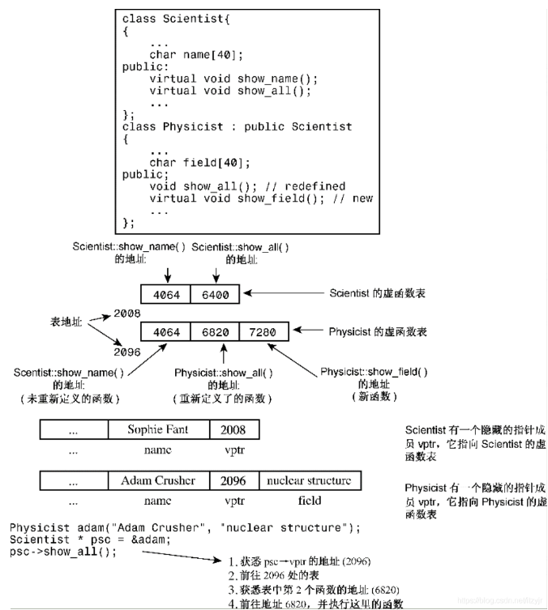
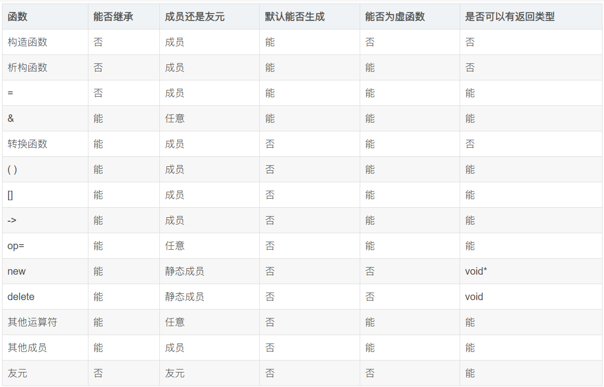
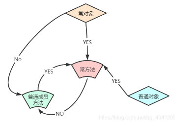
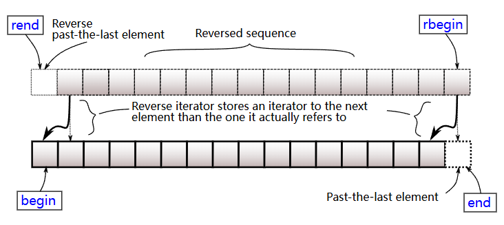

# 网址链接

[cppreference.com](https://en.cppreference.com/w/)

[cppreference.com 中文](https://zh.cppreference.com/w/%E9%A6%96%E9%A1%B5)

[C++11中关键字 - 知乎](https://zhuanlan.zhihu.com/p/157523014)

[C++STL中的常用容器总结\_stl容器总结\_SeeDoubleU的博客-CSDN博客](https://blog.csdn.net/SeeDoubleU/article/details/124507029)

[C++模板元编程详细教程（之三）\_c++模板元编程实战\_borehole打洞哥的博客-CSDN博客](https://blog.csdn.net/fl2011sx/article/details/128314495)

[现代 C++ 模板教程](https://mq-b.github.io/Modern-Cpp-templates-tutorial/)
# 规范与注意事项
## 类

成员首先按public, protected, private的顺序分块。

每一块中成员的顺序如下：

1. typedef，enum，struct，class 定义的嵌套类型
2. 常量
3. 构造函数
4. 析构函数
5. 成员函数,含静态成员函数
6. 数据成员,含静态数据成员

构造函数的初始化列表中的每个项，应独占一行。

类中不能存在不知道大小的成员。前向声明并不能提供某个类的大小，但可以取它的指针，因为指针的大小是固定的。

## STL

STL默认以vector为容器、以`operator<`为比较方式。

## 头文件

在第一行添加`#pragma once`(或者使用下面的`#ifndef`)可以防止头文件被重复包含. 这是为了解决在单个编译单元中重复展开出现的错误(类似重复声明), 但不能解决重复定义问题.
```cpp
#ifndef EXAMPLE_H
#define EXAMPLE_H
// 头文件内容...
#endif
```

# 面向对象

[第13章-cpp类继承\_cpp 继承\_itzyjr的博客-CSDN博客](https://blog.csdn.net/itzyjr/article/details/103424450)

## 三大特征

1. **封装（Encapsulation）**：封装隐藏对象的属性，并且外界只能通过对外提供的接口进行访问。
2. **继承（Inheritance）**：子类可以复用父类的成员和方法，并且可以在现有代码的基础上进行功能扩展。
3. **多态（Polymorphism）**：
	1. 编译时多态：同名函数有不同的参数列表，则能够在编译时识别出调用的是哪个函数。处理函数**重载**。
	2. 运行时多态：运行时，根据传入的对象的类型决定调用哪个类的某个函数。这个函数是虚函数，被子类重写，函数名、参数列表完全一样。处理函数**重写**。

> [!info]
> 查找虚表(运行时多态)相当于`(*(b->vfptr)[n])(b)`, 有两次内存访问.

### 表现多态的条件 / 无需查虚表的情况

下面这段代码, `b`是一个**值**, 那么在编译期就可以确定它的虚函数的确切实现, 于是编译器在编译期就进行了**确定的**函数绑定, 而**无需运行时**访问虚表.
```cpp
void fun(Base b) {
    b.virtualFun(); 
}
```

只有**指针或引用**可以表现出多态性, 如通过`b`指针访问虚函数的时候, 不得不通过查询虚表来完成正确的函数定位.
```cpp
void fun(Base *b) {
    b->virtualFun(); 
}
```

> [!info]
> 编译器优化力度很大, 如果能在运行期就推导出调用的虚函数应该是哪个, 就不再会去访问虚表了.

**限定名字查找**也限死了函数:
```cpp
void f(Base * p, Base & r)
{
    p->Base::virtualFun();
    r.Base::virtualFun();
}
```

如果`Base`类型的`virtualFun`被标上的`final`, 那么在它以下就不再表示多态性, 因为`b->virtualFun`必然指向`Base::virtualFun`.

> [!info]
> cpp20可以在new和delete和虚函数上使用constexpr, 因此一个constexpr操作流里面可以做这些面向对象的事情; 而此时编译器就能完全确定所有的虚函数实现, 因此该过程(如果确实被编译期计算的话)不会造成任何运行期开销.


## 访问控制

同一个类的两个不同对象是可以互相访问private成员的。因为访问级别是编译时概念而非运行时。对象a和b都为Class Cls，它们都能知道Cls下有私有成员x，则a里面就可以访问b.x。

对于外部来说，protected的行为与private相似；但对于派生类来说，protected的行为与public相似。

> [!info]
> private表示"如果外部对其进行访问, 则要报错", 而不是单纯的"找不到". 因此, 声明中private的东西也要和类的其他成员一起写, 在类被使用时出现在对应的上下文中.


## 向上兼容

可以用基类指针或引用指向派生类对象，如`Base *b = new Derived;`或`Derived d; Base &b = d;`。

注意，不能用`Base b = Derived();`，这会导致对象切割，本质还是在存Base。

若`Base *b = new Derived;`，则`*b`（对指针解引用）返回的是Base类型，似乎会发生对象切割。

可以把派生类指针赋值给基类指针。

[对象切割](Cpp.md#对象切割（object%20slicing）)

## 调用基类构造函数

**派生类在构造时必须调用基类的构造函数**. 

如果基类有默认构造函数(参数值全有默认值的构造函数或无参构造函数), 那么子类的构造函数就会默认调用此函数, 这称为**隐式调用**.

其他情况下必须**显式调用**. 在<u>初始化列表</u>的**任意位置**调用基类构造函数即可:
```cpp
Student::Student(char *name, int age, float score): 
m_score(score), People(name, age){ }
```

**总是**会先调用基类构造函数再干其他所有事情(与其在初始化列表中的顺序无关).

> [!tip]
> 如果基类没有默认构造函数, 那么派生类就不得不每次都进行显式调用.

> [!info]
> 如果想直接使用父类构造函数的话, 可以使用[继承构造函数](Cpp/Cpp.md#继承构造函数).

## 重写 & virtual

虚函数可以被重写。被重写的虚函数自动成为虚函数，但一般最好手动加virtual。

使用了virtual之后程序将根据**对象类型**而不是引用或指针的类型来选择方法版本，或者说会挑选该方法的**可获取的最“后代”的**版本，即**动态联编**；否则直接根据**指针类型**去判断要调用哪个函数，即**静态联编**。

这是**运行时多态**。

```cpp
class Base {
public:
    void func() { cout << "Base::func\n"; }
    virtual void vfunc() { cout << "Base::vfunc\n"; }
};

class Derived : public Base {
public:
    void func() { cout << "Derived::func\n"; }
    void vfunc() override { cout << "Derived::vfunc\n"; }
};

Base* b = new Derived;
b->func();  // Outputs "Base::func" 由指针类型决定
b->vfunc(); // Outputs "Derived::vfunc" 由对象类型决定
```

### override & final

写在函数末尾, `override`声明当前函数为重写, 使编译器去检查这是否真的发生了重写. 而`final`声明当前虚函数不可被重写.

### 纯虚函数 & 抽象基类

```cpp
virtual T func(args) = 0;
```

当类声明中包含纯虚函数时，不能创建该类的对象。包含纯虚函数的类只用作基类。

包含纯虚函数的类成为**抽象基类（abstract base class，ABC）**。ABC的一个目的是实现接口约定。

`= 0`的作用仅仅是说明**可以在此类中不提供其实现**，但是依然是**可以进行实现**的。因此，一个拥有纯虚函数func的类作为一个不可实例化的基类，而其所有派生类的func代码完全一样时，不妨就在基类中实现它。

### 重写注意点

虚函数被重写时，会把**所有名字一样的**都给覆盖，即使参数列表和返回值不一样。若不一样，编译器可能发出警告，但不会编译失败。因此，如果基类有三个同名虚函数，则派生类最好要么都不重写，要么都重写。如下所示：

```cpp
class Dwelling {
public:
    // 三个重载的showperks()
    virtual void showperks(int a) const;
    virtual void showperks(double x) const;
    virtual void showperks() const;
    ...
};
class Hovel : public Dwelling {
public:
    // 三个重新定义的showperks()
    virtual void showperks(int a) const;
    virtual void showperks(double x) const;
    virtual void showperks() const;
    ...
};
```

允许在重写时仅对返回值进行修改：如果返回类型是基类引用或指针，则可以修改为指向派生类的引用或指针。这种特性被称为**返回类型协变（covariance of return type）**，因为允许返回类型随类类型的变化而变化。如下所示：
```cpp
class Dwelling {
public:
    // a base method
    virtual Dwelling &build(int n);
    ...
};
class Hovel : public Dwelling {
public:
    // 一个派生类方法，返回类型协变
    virtual Hovel &build(int n); // 相同的参数特征标
    ...
};
```

于是, 重写的时候, 两个函数仅可以有两点不同:
1. 返回值类型. 但新类型必须是子类型.
2. 参数名称.

### 具体函数

**析构函数**一般要设为虚函数，因为若类被继承，则新的成员变量很可能需要特殊的析构函数去管理；有虚析构函数后，任意派生类都会先执行最子类的析构函数，然后自动执行父类的析构函数。只有析构函数有全自动的调用基类的机制。

**构造函数**不设为虚函数，因为派生类不继承基类的构造函数，而是隐式调用默认构造函数或显式调用某个构造函数。

**友元**<u>不能</u>是虚函数，因为友元不是类成员，而**只有成员才能是虚函数**。

### 虚函数处理原理

给每个对象添加一个隐藏成员是一个指向函数地址数组的指针，且尽可能靠前。这种数组称为虚函数表（virtual function table，vtbl）。vtbl和类进行绑定，每个对象的指针隐藏指针都指向同一个vtbl。

虚函数表中存储了为类对象进行声明的虚函数的地址。例如，基类对象包含一个指针，该指针指向基类中所有虚函数的地址表。派生类对象将包含一个指向另一个属于自己的vtbl的指针。如果派生类提供了虚函数的新定义，该虚函数表将保存新函数的地址；如果派生类没有重新定义虚函数，该vtbl将保存函数原始版本的地址。如果派生类定义了新的虚函数，则该函数的地址也将被添加到vtbl中。

不管一个派生类被什么指针指着，那个指针都能访问到这个唯一的隐藏指针，也就定位到了基于对象真实类型的虚函数表。




## 重载

同名方法不同参数列表，即可根据参数在编译期自动选择哪个方法。

这是**编译时多态**。

先把所有同名函数作为候选者，然后匹配：
1. 精确匹配。
2. 通过默认参数能够匹配。
3. 通过默认类型转换能够匹配。

若出现二义性或者完全找不到，则报错。

```cpp
// Function overload #1
void display(int num) {
    std::cout << "Displaying int: " << num << std::endl;
}

// Function overload #2
void display(double num) {
    std::cout << "Displaying double: " << num << std::endl;
}

// Function overload #3
void display(char const *str) {
    std::cout << "Displaying string: " << str << std::endl;
}

int main() {
    display(5); // #1
    display(5.5); // #2
    display("Hello"); // #3

    return 0;
}
```

## 对象切割（object slicing）

把子类对象赋值给父类对象（形如`Father f = Son();`）时，会把子的多余成员变量给切割掉。

```cpp
class Father {
public:
    int a;
};

class Son : public Father {
public:
    int b;
};

int main() {
    Son s;
    s.a = 1;
    s.b = 2;

    Father f = s;
    // f now only has 'a', 'b' is sliced off
}
```

## 确定运行时对象的类

基类指针指向派生类对象时，我们有可能要根据派生类的真正类型来判断要调用什么方法，或想要调用派生类有而基类没有的方法。

### dynamic_cast

可以实现**指针安全转换**。`dynamic_cast<D*>(B)`在B能转成D时返回转换后的指针，否则返回nullptr。

转换前后的指针指向同一个对象。

```cpp
Base *bp = /* ... */;
Derived1 *d1 = dynamic_cast<Derived1*>(bp);
if (d1 != nullptr) {
    // bp points to an object of type Derived1
} else {
    Derived2 *d2 = dynamic_cast<Derived2*>(bp);
    if (d2 != nullptr) {
        // bp points to an object of type Derived2
    }
}
```

### 利用virtual性质

若`Base *b=new Derived1();`且Base中有virtual函数func、Derived1中重写了func，则`b->func()`会调用Derived1的函数。利用这个性质，可以在Derived::func中反馈“这个指针b指向的是Derived1类而不是Derived2或者Base”。

**单分派（single dispatch）、双分派（double dispatch）**：传入一个（两个）参数，根据参数的运行时类型确定该使用哪个方法处理它们。

双分派例子：父类Shape，有三个子类Circle、Square、Triangle。要求定义一个函数intersect(Shape* s1, Shape* s2)，使得输入两个子类对象之后，能判断两个对象是否属于同一个类。

#### 解法1

令Shape包含：

```cpp
virtual bool intersect_sec(Shape* const s) = 0;
virtual bool judgeIntersect(Circle& s) = 0;
virtual bool judgeIntersect(Square& s) = 0;
virtual bool judgeIntersect(Triangle& s) = 0;
```

子类将实现它们。每个judgeIntersect函数都在参数类型与自己类型一样时返回true，否则返回false。比如`Square::judgeIntersect(Square& s)`恒返回true，其他两个返回false。

intersect函数先调用`s1->intersect_sec(s2)`，这样就调用了s1内的intersect_sec，也就相当于知道了s1的类型。而每个子类里面的intersect_sec函数都是这样实现的：

```cpp
bool intersect_sec(Shape* const s){
	return s->judgeIntersect(*this);
}
```

`*this`将s1自己以确切的类型传给s2，使用s2的judgeIntersect很快就判断出是否是同类型了。

#### 解法2

先化为两个单分派问题，获取人为规定的类型标识，然后进行判断即可。

```cpp
enum ShapeType { CIRCLE, SQUARE, TRIANGLE };

class Shape {
public:
    virtual ~Shape() {}
    virtual ShapeType getType() const = 0; // Pure virtual function
};

class Circle : public Shape {
public:
    ShapeType getType() const override { return CIRCLE; }
};

class Square : public Shape {
public:
    ShapeType getType() const override { return SQUARE; }
};

class Triangle : public Shape {
public:
    ShapeType getType() const override { return TRIANGLE; }
};

bool intersect(const Shape* s1, const Shape* s2) {
    return s1->getType() == s2->getType();
}
```

## 继承访问控制

继承时可以指定访问等级，使得继承后基类成员的访问等级不得高于继承访问等级。

| 继承类型 \\ 存取模式 | public    | protected | private |
| ------------ | --------- | --------- | ------- |
| public       | public    | protected | private |
| protected    | protected | protected | private |
| private      | private   | private   | private |


## 调用基类函数/运算符

派生类中，如果想调用基类的函数，但这个函数在派生类中被重写了或正在重写中，则要显式地指定基类函数，如`Base::func()`。如果是运算符的话，则用函数表示法写出，如`Base::operator=(arg)`。

```cpp
hasDMA & hasDMA::operator=(const hasDMA & hs) {
    if (this == &hs) 
        return *this;
    baseDMA::operator=(hs); // 用[函数表示法]赋值基类部分，这样才不会形成递归调用！
    delete [] style; // 为新style作准备
    style = new char[std::strlen(hs.style) + 1];
    std::strcpy(style, hs.style);
    return *this;
}
```

## 类间互相依赖问题

#### 成员变量类型相互依赖

两个类的其中一个成员变量的类型为对方。编译时只能先编译其中一个类，此时它就不知道另一个类，导致编译失败。

使用前向声明可以解决一部分问题，因为声明是廉价的，声明之后就可以得知存在另一个类，即使不知道它有什么内容。

虽然一个类编译完成时，其大小是确定的；但是此时不知道另一个类的内容，也就不知道另一个类的大小，使得总大小不确定。将类型换成指针即可，因为指针虽然可以指向各种不同类型，但其本身的大小是固定的（如64bit）。

```cpp
class ClassB; // Forward declaration

class ClassA {
    private:
        ClassB* classBInstance; // Use pointer instead of object
};

class ClassB {
    private:
        ClassA* classAInstance; // Use pointer instead of object
};
```

#### 静态变量类型相互依赖

**警告：这个疑似没什么用**

两个类各有一个静态成员变量的类型为对方。由于static是必须立刻初始化的，因此我们无法做到真正初始化它们。

可以都初始化为nullptr，并在第一次访问时真正初始化。

```cpp
class ClassB; // Forward declaration

class ClassA {
    private:
        static ClassB* classBInstance;
    public:
        static ClassB* getClassBInstance();
};

class ClassB {
    private:
        static ClassA* classAInstance;
    public:
        static ClassA* getClassAInstance();
};

// Implementations
ClassB* ClassA::classBInstance = nullptr;
ClassA* ClassB::classAInstance = nullptr;

ClassB* ClassA::getClassBInstance() {
    if (classBInstance == nullptr) {
        classBInstance = new ClassB();
    }
    return classBInstance;
}

ClassA* ClassB::getClassAInstance() {
    if (classAInstance == nullptr) {
        classAInstance = new ClassA();
    }
    return classAInstance;
}
```


# 数据机制

## Data Category

[Value categories - cppreference.com](https://en.cppreference.com/w/cpp/language/value_category)

Each C++ [expression](https://en.cppreference.com/w/cpp/language/expressions "cpp/language/expressions") (an operator with its <u>operands</u>, a <u>literal</u>, a <u>variable name</u>, etc.) is characterized by two independent properties: a **type** and a **value category**. Each expression has some non-reference type, and each expression belongs to exactly one of the three <u>primary value categories</u>: **prvalue**, **xvalue**, and **lvalue**.

- **glvalue** (“generalized” lvalue) (**泛左值**): 是一个表达式，其求值可以确定一个对象或函数的 identity。要么是 lvalue 要么是 xvalue。
- **prvalue** (“pure” rvalue) (**纯右值**): 是一个表达式，其求值可以计算运算符的一个操作数（没有result object），或初始化一个对象（有result object）。
- **xvalue** (“eXpiring” value) (**将亡值**): 是一个 <u>glvalue</u>，可以提供出一个对象，该对象的资源可重复使用（通常是因为它接近其生存期的末尾）。
- **lvalue** (**左值**): 是*非 xvalue* 的 <u>glvalue</u>。
- **rvalue** (**右值**): 是一个 <u>prvalue</u> 或 <u>xvalue</u>。要么是prvalue 要么是xvalue。
``


xvalue的情况:
- 把一个变量(lvalue)套move, 或者说`static_cast<T&&>`; 或函数返回的右值引用. 即未具名的右值引用.
- 访问临时对象(prvalue)的成员.
- 范围for循环中的临时容器.

## 引用

[Reference declaration - cppreference.com](https://en.cppreference.com/w/cpp/language/reference)

- 左值引用 (lvalue reference)，`T&`，只能绑定左值
- 右值引用 (rvalue reference)，`T&&`，只能绑定右值
- 常量左值引用，`const T&`,既可以绑定左值，又可以绑定右值，但是不能对其进行修改

> [!info]
> 萧叶轩の言, 不确定正确性: **左值表达式的类型是左值引用**, 所以当把左值变量`a`赋值给左值引用的时候, 相当于把*整个*左值表达式都赋值了, 因此`int& v = a`会保证v与a的修改同步. 而普通的`int v = a`则相当于拿a作为构造参数去创建v对象, 决定v内容的值.

在`int a = std::move(b)`中, `std::move(b)`这个函数调用语句是一个**xvalue**, 但左边的`a`(**具名右值引用**)是个**lvalue**.

由于具名右值引用被视为左值，因此我们要把它转回右值引用时就需要再用`move`(再次交出左值)或`forward`(具名赋值的逆操作)。

> [!tip]
> cpp中的引用是通过等号来实现的, 如`int &a = b`和`int &&a = 1`, 而函数的传参也相当于进行了等号操作. 这有时候看起来像是特别奇怪的隐式类型转换.

使用`static_cast`也能产生正常使用的左值引用:
```cpp
int i = 1;
auto &a = static_cast<int &>(i);
a = 2;
std::cout << i << std::endl; // 2
```

### 从左值转化成右值引用

```cpp
int i = 0;
int &&k1 = i; //编译失败
int &&k2 = static_cast<int&&>(i); //编译成功
```

## std::move

[【Modern C++】深入理解移动语义](https://mp.weixin.qq.com/s/GYn7g073itjFVg0OupWbVw)

```cpp
//C++11 std::move的实现 
template<typename T> 
typename remove_reference<T>::type&& move(T&& param) { 
	using ReturnType = typename remove_reference<T>::type&&; 
	return static_cast<ReturnType>(param); 
}
```

因此`std::move(arg)`等价于:
```cpp
static_cast<std::remove_reference<decltype(arg)>::type&&>(arg)
```

> [!info]
>std::move is used to indicate that an object t may be "moved from", i.e. allowing the efficient transfer of resources from t to another object. In particular, std::move produces an **xvalue** expression that identifies its argument t. It is exactly equivalent to a static_cast to an rvalue reference type.

转换的过程不存在复制，也不存在数据剥夺，在运行时什么都没做，只是个单纯的类型转换。

若将move结果赋值给一个变量（左值），则会调用其移动赋值函数。

**move语义**：将左值对应的内存的所有权进行转交，原对象在move后不可使用。移动操作应当以move语义为目标。语义仅仅是语义, 没有额外的魔法保证.

因此，移动操作一般要做到：将原对象的数据移至自己的手下，并让原对象失去数据。

**自定义的类不会自动带有真正的、完整的move语义**，编译器自动生成的移动构造函数只是可以调用其各个成员变量的移动构造函数。因此，对于自定义类来说，想实现移动语义必须实现非常具体的移动构造函数。

移动构造函数在删除原对象对数据的所有权时，**要那些指针设为nullptr**。因为即使一个左值a被move到另一个左值b，a本身是不会被消除的，**在a的生命周期结束后会自动调用其析构函数**，从而可能触发野指针错误或者对一个数据进行多次析构（a和b都会调用析构函数）。

## std::forward 完美转发 

[std::forward - cppreference.com](https://en.cppreference.com/w/cpp/utility/forward)

`forward`能把一个函数形参还原成它在此函数被调用时传入的值的data category，从而触发不同的函数。结合[万能引用](Cpp/Cpp.md#万能引用%20universal%20reference)使用.

它能转发[forwarding references](https://en.cppreference.com/w/cpp/language/reference#Forwarding_references). 这些东西在形式上是：
```cpp
[const] T &[&]
即：
const T &
T &
const T &&
T &&
```

> 和move一样在<u>运行时</u>没做任何改动，仅仅是类型转换。

```cpp
#include <iostream>
#include <memory>
#include <utility>
 
struct A {
    A(int&& n) { std::cout << "rvalue overload, n=" << n << "\n"; }
    A(int& n)  { std::cout << "lvalue overload, n=" << n << "\n"; }
};
 
class B {
public:
    template<class T1, class T2, class T3>
    B(T1&& t1, T2&& t2, T3&& t3) :
        a1_{std::forward<T1>(t1)},
        a2_{std::forward<T2>(t2)},
        a3_{std::forward<T3>(t3)}
    {
    }
 
private:
    A a1_, a2_, a3_;
};
 
template<class T, class U>
std::unique_ptr<T> make_unique1(U&& u)
{
    return std::unique_ptr<T>(new T(std::forward<U>(u)));
}
 
template<class T, class... U>
std::unique_ptr<T> make_unique2(U&&... u)
{
    return std::unique_ptr<T>(new T(std::forward<U>(u)...));
}
 
int main()
{   
    auto p1 = make_unique1<A>(2); // 右值
    int i = 1;
    auto p2 = make_unique1<A>(i); // 左值
 
    std::cout << "B\n";
    auto t = make_unique2<B>(2, i, 3);
}
```

输出：

```txt
rvalue overload, n=2
lvalue overload, n=1
B
rvalue overload, n=2
lvalue overload, n=1
rvalue overload, n=3
```

### forward_as_tuple

[std::forward\_as\_tuple - cppreference.com](https://en.cppreference.com/w/cpp/utility/tuple/forward_as_tuple)

将参数组成tuple的形式，并且每个参数都被forward了。可以用于全部完美转发地传参数列表。而且如果参数是临时变量的话，不会将其存储（即不会延长生命周期）；如果不在表达式结束前使用完毕，则会造成悬垂引用。

## 各种cast

`reinterpret_cast`把一个数据对象直接重新按指定数据类型解释. 纯编译期. 允许任意转换.

`static_cast`进行运行期类型转换, 并且在编译期进行类型转换的可行性检查.

`dynamic_cast`可以把父指针转变为子指针(向下转换), 并且在转换失败时返回`nullptr`. 纯运行期.

`const_cast`是对cv限定符进行增删:
```cpp
void legacyFunction(int* ptr) {
    // 一个不接受 const 的旧函数
}

int main() {
    const int x = 10;
    // legacyFunction(&x); // 错误：无法将 const int* 转为 int*
    
    int y = 20;
    const int* p = &y;
    legacyFunction(const_cast<int*>(p)); // 合法：y 本身不是 const
    // legacyFunction(const_cast<int*>(&x)); // UB：x 是 const
}
```

# 类与对象

## 类成员变量默认初始化


可以在类成员函数处直接指定其默认初始化值, 而不需要全都写在初始化列表里面. 优先级低于初始化列表, 即会被初始化列表指定的值覆盖.

```cpp
class X {
  private:
    int a = 1;
    double b{1.};
};
```

## 类函数性质



## 特殊成员函数

- 默认构造函数 `Obj()`
- 析构函数 `~Obj()`
- 拷贝构造函数 `Obj(const Obj&)`
- 拷贝赋值运算符 `Obj& operator=(const Obj&)`
- 移动构造函数 `Obj(Obj&&)`
- 移动赋值运算符 `Obj& operator=(Obj&&)`

特殊成员函数若未被定义，则会由编译器自动生成。

>注意，xx构造函数都叫构造函数，都不能为virtual！

- `Obj o2 = o1;`调用**拷贝构造函数**
- `Obj o2; o2 = o1;`调用**拷贝赋值运算符**
- `Obj o2 = move(o1);`调用**移动构造函数**
- `Obj o2; o2 = move(o1);`调用**移动赋值运算符**
- `Obj o2 = Obj();`调用**移动构造函数**（因为传的是右值）
- `Obj &&o1; Obj o2 = o1;`调用**拷贝构造函数**（因为具名右值引用是左值）


移动相关：
- 只有一个类没有显示定义**拷贝构造函数、赋值运算符以及析构函数**，且类的**每个非静态成员都可以移动**时，编译器才会生成默认的**移动构造函数或者移动赋值运算符**。这是为了防止生成的移动不是开发人员想要的（因为开发人员选择自己管理复制和释放），或存在有问题的移动。
- 如果类中没有提供移动构造函数和移动赋值运算符，且编译器不会生成默认的，那么我们在代码中通过std::move()调用的移动构造或者移动赋值的行为将**被转换为调用拷贝构造或者赋值运算符**。因此对于不可移动的数据类型也可以像可移动的数据类型一样写代码，会自动变成复制操作。
- 移动构造函数和移动赋值运算符的生成是**不独立**的，若只实现了其中一个，则编译器**不会**自动生成另一个。这是为了防止移动出现问题。

拷贝相关：
- 如果显式声明了**移动构造函数或移动赋值运算符**，则**拷贝构造函数和拷贝赋值运算符**将被 **隐式删除**。
- 拷贝构造函数和拷贝赋值运算符的生成是**独立**的，若只实现了其中一个，则编译器也**会**自动生成另一个。

基础数据类型都没有实现移动。

### 特殊成员函数编写规范

复制、移动操作应该是无副作用的。而且如果有副作用的话，会因为编译器的优化导致出现意想不到的结果。

构造函数不要抛出异常。

复制操作应该尽可能进行复制，特别是new出来的东西要复制一份一模一样的而不是共用。

移动操作尽可能实现move语义，保证原对象被吃干抹净。

### explicit

如果类`X`的某个构造函数只有`Y y`一个参数, 那么`X x = y;`语句会调用此构造函数. 这是一种**隐式类型转换**, 使得`T`类型可以被直接隐式转为`X`类型.

```cpp
Student S1(22); // 显式构造 
Student S2 = 23; // 隐式构造
```

> [!info]
> 因此，等号赋值也可能是触发了构造函数，这在查cppref的时候要注意。

在这种**单参数的构造函数**的<u>前面</u>加上explicit可以防止在等号表达式中调用此构造函数:
```cpp
struct X {
	explicit X(Y y) {...}
}
```

### delete & default


声明特殊函数后在<u>后面</u>加上
- ` = default`: 生成默认的对应函数(**要求**编译器生成)
- ` = delete`: 删除默认的对应函数(**阻止**编译器生成)

```cpp
struct X {
	f1() = default;
	virtual ~f2() = delete;
	f3(const MyType &);
};
X::f3(const MyType &) = default;
```

### 委托构造函数

**委托构造函数**请求**代理构造函数**代为初始化, 即调用本类型的另一个构造函数.

```cpp
class X {
public:
	X() : X(0,0.) {} // X()是委托, X(int a,double b)是代理
	X(int a) : X(a,0.) {}
	X(double b) : X(0,b) {}
	X(int a,double b): a_(a), b_(b) { CommonInit(); }
private:
	void CommonInit();
	int a_;
	double b_;
};
```

<u>委托构造函数</u>**无法**在<u>初始化列表</u>里面进行成员初始化, 因此想干的额外的事情都要写进函数体.

执行顺序:
1. 代理构造函数的初始化列表
2. 代理构造函数的主体
3. 委托构造函数的主体

如果代理构造函数完成后, 委托构造函数出现异常, 则会调用该类型的析构函数(因为此时认为代理方已经完成了本类型的构造).

可以委托**模板构造函数**来简化多个构造函数的编写.
```cpp
class X {
	template<class T> X(T first, T last): l_(first,last){
	std::list<int> l_;
public:
	X(std::vector<short>&);
	X(std::deque<int>&);
};

X:X(std::vector<short>& v): X(v.begin(), v.end()){}
X:X(std::deque<int>& v): X(v.begin(), v.end()) {}
```

### 继承构造函数

使用using可以直接把基类的所有构造函数**都搬过来**.
```cpp
class Derived: public Base {
public:
	using Base::Base;
};
```

- <u>不会继承</u>基类的**默认构造函数**和**拷贝构造函数**, 因为在相应的时机默认就<u>必然会调用</u>它们, 因此继承是没有必要的.
- 同时, 不会影响派生类的默认构造函数.
- 如果派生类定义了一个构造函数, 其**签名**与基类的某个构造函数一样, 那么就<u>不会继承</u>那个基类构造函数.
- 继承多个**签名**相同的构造函数时会报<u>二义性错误</u>.

## 完整对象示例

```cpp
class BigObj { 
public: 
	// Constructor
	explicit BigObj(size_t length) : length_(length), data_(new int[length]) { } 
	// Destructor. 
	~BigObj() { 
		if (data_ != NULL) { 
			delete[] data_; 
			length_ = 0; 
		} 
	} 
	
	// 拷贝构造函数 
	BigObj(const BigObj& other) : length_(other.length_), data(new int[other.length_]) { 
		//直接复制数据
		std::copy(other.mData, other.mData + mLength, mData); 
	} 
	
	// 赋值运算符 
	BigObj& operator=(const BigObj& other) { 
		if (this != &other;) { 

			//删去自己原有的数据
			delete[] data_; 

			//重建并复制数据
			data_ = new int[length_]; 
			length_ = other.length_; 
			std::copy(other.data_, other.data_ + length_, data_); 
		} 
		return *this; 
	} 
	
	// 移动构造函数 
	BigObj(BigObj&& other) : data_(nullptr), length_(0) { 

		//获取数据所有权
		data_ = other.data_; 
		length_ = other.length_; 

		//剥夺对方的数据所有权
		other.data_ = nullptr; 
		other.length_ = 0; 
	} 
	
	// 移动赋值运算符 
	BigObj& operator=(BigObj&& other) { 
		if (this != &other;) { 

			//删去自己原有的数据
			delete[] data_; 

			//获取数据所有权
			data_ = other.data_; 
			length_ = other.length_; 

			//剥夺对方的数据所有权
			other.data_ = NULL; 
			other.length_ = 0; 
		} 
		return *this; 
	} 
	
private: 
	size_t length_; 
	int* data_; 
};
```

## 聚合类型

聚合类型的定义是, 它可以是一个<u>普通数组</u>, 或者要<u>同时满足</u>:
- 没有用户提供的构造函数(delete和default都没问题)
- 没有私有和受保护的非静态数据成员
- 没有虚函数

在新的扩展中，如果类存在<u>继承</u>关系，额外满足这些条件的也是聚合类型:
- 必须是公开的基类，不能是私有或者受保护的基类
- 必须是非虚继承

```cpp
// 一个非常简单, 平凡, 赤裸裸的类型
class X {
  public:
    int a;
    double b;
};
```

聚合类型**天然支持**[列表初始化](Cpp/Cpp.md#列表初始化), 相当于直接给每个成员变量按顺序赋值, 例如:
```cpp
class X {
  public:
    int a;
    double b;
};

int main() {
    X v = {2, 5.5};
    std::cout << v.a << " " << v.b << std::endl;
    // Output: 2 5.5
}
```

cpp20中, 也能使用**小括号**代替大括号来初始化(仿佛为我们自动生成了一个完整的构造函数). 与初始化列表的区别是它能<u>支持隐式缩窄转换</u>.
```cpp
X v(2, 5.5);
```


## 初始化

- 直接初始化: 使用括号来初始化, 如 `X v(5);`
- 拷贝初始化: 使用等号来初始化, 如 `X v = 5`
这两个概念没有本质区别, 它们都只会调用符合要求的构造函数(包括拷贝构造函数), 只不过一般会使用`explicit`防止拷贝初始化调用非拷贝函数.

### 指定初始化

```cpp
struct Point {
	int x;
	int y;
};
Point p{ .x = 4, .y = 2 };
```

语法要求:
1. 必须是一个**聚合类型**
2. 数据成员必须是非静态数据成员
3. 数据成员最多只能初始化一次
4. 非静态数据成员的初始化**必须按照声明的顺序**进行
5. 针对联合体中的数据成员只能初始化一次，不能同时指定
6. 不能嵌套指定初始化数据成员
7. 一旦使用指定初始化就不能混用其他方法对数据成员初始化了
8. 禁止对数组使用指定初始化


### 列表初始化

[std::initializer\_list - cppreference.com](https://en.cppreference.com/w/cpp/utility/initializer_list)

- `int x{1};` 是直接初始化
- `int x = {1};` 是拷贝初始化
同样, 这两种写法没有本质区别.

```cpp
std::vector v{ 1, 2, 3 };
std::map<std::string, int> m = { {"bob", 3}, {"Alice", 5} };
```

[聚合类型](Cpp/Cpp.md#聚合类型)**天然支持**列表初始化.

一个非聚合类型想要支持列表初始化, 需要拥有一个参数为`std::initializer_list<T>`的构造函数.

`std::initializer_list`是可迭代的, 因此也能使用增强型for循环来遍历.

```cpp
#include <initializer_list>

class Numbers {
private:
    int* values;
    size_t size;

public:
    // 使用 initializer list 的构造函数
    Numbers(std::initializer_list<int> list) : 
        size(list.size()),
        values(new int[list.size()])
    {
        int i = 0;
        for (auto item : list) {
            values[i] = item;
            i++;
        }
    }
};

int main() {
    // 使用 initializer list 创建对象
    Numbers nums = {1, 2, 3, 4, 5};
    Numbers numsList[] = { {1, 2}, {6, 8} };
    return 0;
}
```

无法支持(或者发出警告)**隐式**[窄化转换](https://zh.cppreference.com/w/cpp/language/list_initialization#.E7.AA.84.E5.8C.96.E8.BD.AC.E6.8D.A2)(即强表达类型转成弱的), 如`int`转成`char`时:
```cpp
int x = 9;
char c1 = 9; // Correct
char c2 = {9}; // Error or Warning
```

## 运算符

### 三向比较运算符`<=>`

两个数的比较可以有三种结果, 使用**spaceship运算符**`<=>`得到三个结果的其中一个.

器返回值只能和0进行比较(否则报错), 从而反映不同的结果.
```cpp
bool b = 7 <=> 11 < 0; // true
```

对于不同的类型, 其进行的比较以及返回值的类型都是不同的:
- strong_ordering (如int)
	- `std::strong_ordering::less`
	- `std::strong_ordering::equal` (可以互相替换)
	- `std::strong_ordering::greater`
- weak_ordering (如忽略大小写的字符串)
	- `std::weak_ordering::less`
	- `std::weak_ordering::equivalent` (相等但不能互相替换)
	- `std::weak_ordering::greater`
- partial_ordering (如float)
	- `std::partial_ordering::less`
	- `std::partial_ordering::equivalent` (相等但不能互相替换)
	- `std::partial_ordering::greater`
	- `std::partial_ordering::unordered` (不可比)

cpp20规定, 如果一个类型声明了三向比较运算符`<=>`的话, 编译器就自动为其生成 `<`, `>`, `<=`, `>=` 这四种运算符函数. 

> [!info]
> 不自动生成`==`运算符函数是因为一般来说判断是否相等的逻辑会更加简单, 例如判断容器是否等同一般都先比较长度, 长度不同才需要进行遍历.

实现了`<`和`==`的类型会自动实现`<=>`.


### 类型转换运算符

在类型`X`中定义`operator Y()`函数即可定义从`X`到`Y`的类型转换(可以是隐式的). 加上`explicit`之后就只能进行显式类型转换(`static_cast`)了.
```cpp
struct X {
	explicit operator Y() {
		...
	}
}
```


### 默认按值比较

默认比较运算符函数可以是一个参数为`const C&`的非静态成员函数，或则是两个参数为`const C&`或`C`的友元函数。加上`= default`之后, 编译器会生成按值判断相等的函数.

```cpp
struct c {
	int i;
	friend bool operator==(C,C) = default;
};
```


# 库, 语法与特性

## 空指针

空指针指向特定范围的存储空间，这个空间永远不会与物理存储器有映射。

对空指针的delete不会报错。

>delete一个指针后，它不会指向空指针，而是指向非法空间，造成野指针错误。因此可以考虑delete一个指针后将其赋值为nullptr。

**nullptr是有类型的，且仅可以被隐式转化为指针类型。**

NULL可能会被定义为0，若有两个同名不同参的函数（重载），一个的参数类型为指针、另一个的参数类型为int，则传入NULL时可能执行参数类型为int的那一个函数。

## 数组类型

- `T[]`: 未知长度的数组, 往往退化为指针, 也可看做指针类型的语法糖. 模板中常见.
- `T[N]`: 已知长度的数组, 不同的长度是不同的类型.


## 命名空间

`using namespace xxx`表示使用xxx整个命名空间；而`using xxx::fx`表示使用xxx命名空间下的fx。

## 作用域解析运算符 `::`

通常用于命名空间.

`::f`表示使用全局作用域下的`f`(而不是当前局部内的). 这即使不在命名空间的情况下也生效(例如区分局部和全局变量).

## 输入输出操作器

把输出操作器使用`<<`传递给`cout`, 即可获得一个定制的输出器.
- `std::hexfloat`: 使浮点数以十六进制格式输出
- `std::hexfloat`: 使浮点数用默认十进制输出
- `std::boolalpha`: 把bool变量以`true`和`false`文本形式输出.


## 字面量

```cpp
#include <iostream>

int main() {
    double float_array[]{
		    0x1.7p+2, 0x1.f4p+9, 0x1.df3b64p-4
	    };
    for (auto elem : float_array) {
        std::cout 
        << std::hexfloat << elem << "=" 
        << std::defaultfloat << elem 
        << std::endl;
    }
}

// Output:
// 0x1.7p+2=5.75      
// 0x1.f4p+9=1000     
// 0x1.df3b64p-4=0.117
```

二进制使用`0b`前缀表示, 如`0b11010011`.

使用单引号作为**整数分隔符**(任意进制都能用):
```cpp
constexpr int x = 123'456;
static_assert(x == 0x1e'240);
static_assert(x == 036'11'00);
static_assert(x == 0b11'110'001'001'000'000);
```

使用`R"(...)"`来表示**原生字符串**`...`, 可以不用转义字符:
```cpp
// 缩进也会被考虑在内
char str[] = R"(abc/\&"%
	tt)";
// Value:
// abc/\&"%
//     tt

// 如果字符串里面有`)"`, 
// 则可以在开头结尾的`"`和 `(`或`)` 之间
// 插入任意标识符, 只有带上标识符的`)mark"`才会被识别成终点
char str[] = R"mark1(bbb)")mark1";
// Value:
// bbb)"
```

可以**自定义字面量**, 使得给其他字面量<u>加后缀</u>就能进行<u>数据处理</u>. 默认是在运行时调用处理函数; 想在编译期完成处理的话就要把处理函数标记为`constexpr`.

```cpp
long double operator"" _mm(long double x) {
    return x;
}

long double operator"" _cm(long double x) {
    return x * 10;
}

long double operator"" _m(long double x) {
    return x * 1000;
}

int main() {
    // height = 30.0
    auto height = 3.0_cm;
    // length = 1230.0
    auto length = 1.23_m;
}
```

## 常量相关
### const

被const修饰的东西为常量，必须初始化。类的常量成员使用初始化表来初始化。

>C语言中const被当做变量来编译，可以不初始化。c++中所有出现const常量名字的地方，都被常量的初始值替换了。

```cpp
//a本身不能被更改
const int a = 20;

//不能通过p间接修改其指向的内存，因为此时修饰着*p，表示解引用后的数据
const int *p;
int const *p;

//不能修改p本身，因为此时直接修饰p，为常指针
int* const p;

//p本身不能改，也不能通过p修改其指向的内存
const int *const p;

//函数返回值上的const都是为了防止出现左值、指针等导致外部对内部可修改
const int* func1();

//不能更改调用此方法的对象。此const可以看做是在修饰this
void Obj::func() const {...} 
```



### mutable

用于修饰成员变量, 来完全突破const的限制, 包括对象本身为const或使用它的函数为const.

```cpp
struct ST {
  int a;
  mutable int b;
};

const ST st={1,2};
st.a=11;//编译错误
st.b=22;//允许
```

### constexpr

表示一个东西**可以**在编译期完成求值. 不强制完成.

编译期就能完成计算的表达式可以使用constexpr, 使其在编译期被处理完.

使用`if constexpr (...)`使得当条件可以在编译期被计算时, 可以只编译符合条件的那部分代码块.

在函数<u>前面</u>加上`constexpr`可以定义常量表达式函数, 其值应当可以在编译期算出来. 也可以定义常量表达式构造函数, 使得对象可以在编译期被构造.

```cpp
constexpr int square(int x) {
	return x * x;
}
```

cpp14对常量表达式函数要求的放松:
- 函数体允许声明变量，除了没有初始化, `static`和`thread_local`变量
- 函数允许出现`if`和`switch`语句，不能使用`go`语句
- 函数允许所有的循环语句，包括`for`,`while`,`do-while`
- 函数可以修改生命周期和常量表达式相同的对象
- 函数的返回值可以声明为`void`
- `constexpr`修饰的成员函数不再具有`const`属性

cpp20对常量表达式要求的放松:
- 允许在constexpr中进行平凡的默认初始化
- 允许在constexprk函数中出现Try-catch
- 允许在constexpr中更改联合类型的有效成员
- 允许dynamic_cast和typeid出现在常量表达式中

在修饰变量的时候, `constexpr` 和 `const`是完全等价的.

### consteval

使用consteval声明立即函数, 保证编译期**必须**计算(constexpr只是"可以").

### constinit

使用constinit声明变量, 可以保证它是**通过常量来初始化**的(它本身不需要是常量). 

这可以用来保证static变量的初始化不依赖于其他static变量, 也就保证其于static变量的初始化顺序无关.

## volatile

用于修饰成员变量, 使得每次访问此变量的时候都**从内存读取**, 而不能进行<u>寄存器</u>寄存的优化. 

- 当变量可能在编译器未知的情况下发生改变的时候使用, 如中断（异步回调等）; 
- 对此内存的读写不能跳过的时候使用, 如 Memory Mapped IO.

使用`volatile`修饰成员函数的话, 表示其对本对象的volatile情况的兼容. 就像const一样, 用于对volatile对象的操作, 也只能访问到volatile的成员函数.


## 函数修饰总结

### 函数名前

- `template`: 模板函数.
- `virtual`: 虚函数.
- `inline`: 内联.
- `static`: 对成员函数来说, 则表示静态成员函数, 不从属于具体对象; 对普通函数来说, 表示其作用域为当前文件.
- `extern`: 声明一个外部的函数.
- `explicit`: 构造函数专用, 防止隐式转换.
- `friend`: 友元函数, 使其能访问类内非公成员.
- `constexpr`: 表示编译期可计算.

### 函数名后

使用等号`=`来指定实现:
- `=0`: 虚函数专用, 表示纯虚函数.
- `=default`: 特殊成员函数专用, 表示使用默认实现.
- `=delete`: 特殊成员函数专用, 表示删除其默认实现.

- `const`: 表示函数不会修改对象, 但不包括`mutable`修饰的成员变量. 在自身内只能调用const成员方法.
- `volatile`: 表示使用此函数时对象状态随时会变. 在自身内只能调用volatile成员方法.
- `&`: 表示此成员函数只能被左值对象使用.
- `&&`: 表示此成员函数只能被右值对象使用.
- `override`: 表示此成员函数覆盖父类的对应虚函数, 如果没覆盖到就会报错.
- `final`: 表示此成员函数是最终实现, 子类不能再对此定义或覆盖.
- `noexcept`: 表示函数不会抛出异常.


## static

定义类静态成员的时候, 需要声明和定义分离, 但是在cpp17后, 可以加上inline或constexpr(后者自动蕴含了inline), 就无需分离.

```cpp
struct X1{
    static int n;
};
int X1::n;

struct X2 {
    inline static int n;
};

struct X3 {
    constexpr static int n = 1; // constexpr 必须初始化，并且它还有 const 属性
};
```

在函数或闭包内定义**静态局部变量**, 就可以让这些变量(被放在全局存储)仅仅在此上下文被使用, 每次调用函数都能访问此变量, 且永远不会被释放或重置. **它只会在第一次执行该函数时被初始化，而且这种初始化在 C++11 标准之后是线程安全的（magic static）**。因此, 使用magic static即可实现单例模式:
```cpp
// 这里的代码仅保证了“单例”功能是安全的，具体的访问控制应该另做。
class Singleton {
public:
    static Singleton& getInstance() {
        static Singleton instance;  // Magic Static
        return instance;
    }

private:
    Singleton() = default;
    ~Singleton() = default;

    // 禁止拷贝和赋值
    Singleton(const Singleton&) = delete;
    Singleton& operator=(const Singleton&) = delete;
};
```


## RVO & NRVO

两个优化都自动将返回的目标左值作为隐式参数以引用的形式传入到函数中，以减少多余的构造、析构和拷贝。

### RVO 返回值优化（Return Value Optimization）

返回为临时对象时有效. 任何时候都可以完成优化.

```cpp
T f() { 
	return T(); 
} 

int main(){
	T t=f();
}
```

上面的代码若未优化，则`return T()`会进行一次构造，然后拷贝再析构。优化后`f()`等价于：

```cpp
void f(T &t){
	t=T();
	return;
}
```

但是，如果是返回被命名的变量，也即函数内局部变量的话：

```cpp
Data process(int i) {
    Data data;
    data.mem_var = i;
    return data;
}

int main() {
    Data data;
    data = process(5);
}
```

则等价于：

```cpp
void process(Data &data,int i) {
    Data d;
    d.mem_var = i;
    data=d; //data=Data(d);
    return;
}
```

还是有多余的构造、拷贝、析构。此时就需要NRVO来进一步优化.

> [!info]
> 从`c++17`开始，copy elision得到保证，强制使用RVO, 即使拷贝和移动构造函数还有其他作用.

### NRVO 命名返回值优化（Named Return Value Optimization）

若返回的变量是函数内的局部变量时（注意，不能是函数参数）有效。

```cpp
Data process(int i) {
    Data data;
    data.mem_var = i;
    return data;
}

int main() {
    Data data;
    data = process(5);
}
```

上面的代码若没有优化，则process内部也会构造一个对象，然后复制给外部的data变量，随后析构。

优化后，process函数等价于：

```cpp
void process(Data& data, int i) {
    data.mem_var = i;
    return;
}
```

NRVO无法优化的情况：
- 返回类型具有非默认的析构函数。
- 函数有多处return，且返回的变量不同。

编译时添加选项`-fno-elide-constructors`可以关闭NRVO。

## ADL TODO

[实参依赖查找 - cppreference.com](https://zh.cppreference.com/w/cpp/language/adl)

## 基于范围的for循环

> 类似于java的增强型for循环.

要求目标是可迭代的, 具体来说:
- 该类型必须有一组和其类型相关的`begin`和`end`函数，它们可以是类型的成员函数也可以是独立函数。
- `begin`和`end`函数需要返回一组类似迭代器的对象，并且这组对象必须支持`operator*`, `operator!=`和`operator++`运算符函数。

cpp20中, 可以在这种for循环前加上初始化语句:
```cpp
T thing foo();
for (auto &x: thing.items()) {}

//C++20
for (T thing = foo(); auto &x: thing.items()) {}
```

## 带初始化语句的 if/switch

在判断语句的前面声明的变量的**生命周期会一直往下持续到整个if-else结束**, 因此`b1`在下面的`else if`语句块中也能使用.

```cpp
if(bool b1 = foo1(); b1) {
	...
} else if(bool b2 = foo2(); b2) {
	...
}
```

可以利用初始化语句进行加锁保护:
```cpp
if (std::lock_guard<std::mutex> lock(mx); shared_flag)
	shared_flag = false;
}
```

switch的相关语法和if完全一样.

## std::copy

```cpp
template<class InputIterator, class OutputIterator>
  OutputIterator copy (InputIterator first, InputIterator last, OutputIterator result)
{
  while (first!=last) {
    *result = *first;
    ++result; ++first;
  }
  return result;
}
```

指定源的起点、终点，和目标的起点，即可将`[first,last)`处的数据进行逐个复制。调用的是拷贝赋值运算符。

目标要有容纳这些被拷贝的数据项的空间。

目标不应在`[first,last)`当中。


## 后置返回值类型


[模板函数——后置返回值类型（trailing return type）\_模板函数返回\_HerofH\_的博客-CSDN博客](https://blog.csdn.net/qq_28114615/article/details/100553186)

```cpp
auto foo() -> int {...}
```

```cpp
template <class T>  
auto Get(std::string_view key) const -> const T *;
```

若要使用decltype推导返回值类型, 则需要使用函数参数，于是使用返回值后置使得函数参数先被声明然后才被使用。

### 省略返回值类型

可以不指定返回值, 只写个auto, 编译器会自动根据函数体推导.

```cpp
auto foo() {
	return 0;
}
```


## 智能指针
### unique_ptr转shared_ptr

```cpp
std::shared_ptr<T>(std::move(ptr))
```

### make_unique新建对象

泛型为目标类。参数会被传入类的构造函数作为参数。

```cpp
std::make_unique<TrieNodeWithValue<T>>(children_, value_)
```

## 结构化绑定

把一个tuple给拆开成多个变量, 原本需要使用`std::tie`来完成:
```cpp
int x = 0, y = 0;
std::tie(x, y) = return_multiple_values();
```

现在可以使用:
```cpp
auto [x, y] = return_multiple_values();
```

配合自动推导返回值类型的特性, 可以使其看起来像是能让函数返回多个变量:
```cpp
auto return_multiple_values() {
	return std::make_tuple(11, 7);
}

int main() {
	auto[x, y] = return_multiple_values();
}
```

总共有三种结构化绑定:
1. 绑定**原始数组**, 将从前往后的每一项提出来
2. 绑定**结构体与类**, 将<u>当前可访问</u>的非静态成员变量提出来
3. 绑定**元组**或**类元组**对象

> [!example] 类的结构化绑定不一定要public的例子
> 一个类的友元函数中对该类的对象进行结构化绑定时, 编译器会判断把private的变量也给提出来, 因为此时作用域内是可以访问private的.

## 函数（谓词）
### 仿函数（闭包）

若一个类重载了`operater()`，则其实现是个可调用对象，也叫仿函数、闭包。

### Lambda表达式

[Lambda expressions (since C++11) - cppreference.com](https://en.cppreference.com/w/cpp/language/lambda)

```cpp
[ 捕获 ] ( 形参 ) -> ret { 函数体 };
```

式子会返回一个匿名、右值的闭包。

每个lambda表达式都有唯一的类型(即使签名相同), 这是为了[方便编译器优化](Rust/Rust.md#函数类型唯一性与编译器优化理论).

当编译器可以推导返回值类型的时候（包括无返回值时），可以不写`-> ret`。

底层逻辑其实就是仿函数，即编译器自动生成一个重载了`operater()`的类。

#### 捕获 (capture)

在调用lambda表达式时不需要把捕获中的变量当成参数输入，就可以把它们传进去（相当于在定义时而非在调用时传入变量）。

```txt
[]：默认不捕获任何变量；
[=]：默认以复制捕获所有变量；
[&]：默认以引用捕获所有变量；
[x]：仅以复制捕获x，其它变量不捕获；
[x…]：以包展开方式复制捕获参数包变量；
[&x]：仅以引用捕获x，其它变量不捕获；
[&x…]：以包展开方式引用捕获参数包变量；
[=, &x]：默认以复制捕获所有变量，但是x是例外，通过引用捕获；
[&, x]：默认以引用捕获所有变量，但是x是例外，通过复制捕获；
[this]：通过引用捕获当前对象（其实是复制指针）；
[*this]：通过复制方式捕获当前对象；
```

**广义捕获**包括**简单捕获**和**初始化捕获**. 上面的捕获是简单捕获. 初始化捕获的例子:
```cpp
int x = 5;
auto foo = [r = x + 1]{ return r; }
```

所有**值捕获**都默认是`const`, 想要其<u>可变</u>的话就要在参数后面加上`mutable`.

#### 泛型lambda表达式

参数中使用auto来定义泛型lambda表达式, 从而兼容多种类型：
```cpp
auto foo = [](auto a){ return a; }
int three = foo(3);
char const* hello = foo("hello");
```

也可以使用模板语法:
```cpp
auto foo = []<typename T>(std::vector<T> vec) {...}
```


#### 捕获this

如果定义的上下文是在对象里面, 那么**当前对象的this指针**可以捕获进lambda表达式(`[this]`). 显然, <u>this指针</u>只能进行**值捕获**.

但是, 也可以直接拷贝当前对象进去, 即`[*this]`.

虽然<u>目前</u>`[=]`也包含了对`this`的捕获, 但是可以写成`[=, this]`来让语义更显式. 这也是为了与`[=, *this]`(捕获所有变量并且复制当前对象)相区分.

#### 可构造和可赋值的无状态lambda表达式

cpp20中, 允许无状态(无捕获)的lambda表达式可以被构造和赋值(拷贝), 即为其保留默认构造函数和拷贝构造函数. cpp20前, 闭包类型不是默认可构造的.

例如下面的代码中, 想要用模板类型参数来指定`cmp`, 并且不希望通过传值来传递`cmp`闭包的话, 就要在`std::map`的构造函数内部对`decltype(greater)`这个无状态闭包类型进行构造. 这是cpp20才支持的, 以前还要给`mymap`额外传`greater`参数.
```cpp
auto greater = [](auto x, auto y) { return x > y;};  
std::map<std::string, int, decltype(greater)> mymap;
```

而下面这段代码需要greater拥有拷贝构造函数, 也是cpp20才支持:
```cpp
auto greater = [](auto x, auto y) { return x > y;};  
std::map<std::string, int, decltype(greater)> mymap1, mymap2;  
mymap1 = mymap2;
```

### std::function （包装器）

`function<int(int, int)>`可以统一所有的对应出入参的函数类型，它可以是函数指针、仿函数和Lambda表达式。

使用样例：作为map的键的类型，这样就可以用Lambda表达式来传值。

### std::bind

将函数包装器与参数进行绑定（也可使用`std::placeholders`进行缺省），返回类型也是包装器，可以直接调用。

```cpp
#include <functional>
#include <iostream>

void func(int i, int j) {
    std::cout << i << " " << j << std::endl;
}

int main() {
    auto f1 = std::bind(func, 1, 2);
    f1();
    auto f2 = std::bind(func, std::placeholders::_1, 4);
    f2(3);
    return 0;
}

// Output:
// 1 2
// 3 4
```

只能绑定值类型, 可以使用[std::ref](Cpp/Cpp.md#std%20ref)实现绑定引用.

## std::ref

`std::ref(t)`可以被<u>隐式类型转换</u>为对`t`的**引用**.

有时候函数参数只能传递值类型, 比如在使用[std::bind](Cpp/Cpp.md#std%20bind)时, 以及当模板类型为`T`而不是`T&`的时候, 可以通过使用`std::ref(t)`来实现传递引用(因为`std::ref`本身是个变量, 可以值传递).

## sort函数

默认从小到大。

重载`operator<`即可重建该对象的排序规则。

也可以添加比较函数：
```cpp
//比较函数，使其从大到小排
int cmp(const int &a, const int &b) { 
	if(a > b) { 
		return true; 
	} 
	return false; 
}
sort(arr, arr+len, cmp);
```

> [!info]
> 可以使用`ranges::sort`.

## max min 函数

[std::max - cppreference.com](https://zh.cppreference.com/w/cpp/algorithm/max)

可以使用初始化列表来比较多个值, 如`max({1, 2, 3})`.

## stable_sort函数（稳定排序）

和sort函数用法一样，但是稳定。

## less greater 比较类

在头文件`functional`中。是个仿函数，因此`greater<T>`表示一种类型。如int的比较类就是`greater<int>`，表示取大（`>`）。

直接比较：
```cpp
template <class T>
struct greater {
    bool operator()(const T& a, const T& b) const {
        return a > b; // 返回 a 是否大于 b
    }
};
```

使用空参数创建对象，传入sort，就能指定其从大到小排序：
```cpp
sort(arr, arr+len, greater<int>());
```

或者把类作为模板参数：
```cpp
priority_queue<int,vector<int>,less<int>> big_heap;
```
## priority_queue 优先级队列

就是个堆。

优先级：排前面（上面）的优先级高。在sort中排在后面的，在priority_queue中就排在前面，也就是优先级高。

默认为大顶堆。

在头文件`queue`中。

```cpp
priority_queue<类型,容器,比较函数类型>

// 大顶堆（降序）
priority_queue<int> big_heap;
priority_queue<int,vector<int>,less<int>> big_heap2;

// 小顶堆（升序）
priority_queue<int,vector<int>,greater<int>> small_heap;

// 传入自定义函数
priority_queue<pair<int, int>, vector<pair<int, int>>, decltype(&cmp)> q(cmp);

// 传入自定义闭包
auto cmp = [](const ListNode* a, const ListNode* b){
	return a->val > b->val;
};
priority_queue<ListNode*, vector<ListNode*>, decltype(cmp)> pq;

// 使用仿函数
struct cmp {
    bool operator ()(const node &a, const node &b){
        return a.value>b.value; //按照value从小到大排列
    }
};
priority_queue<node, vector<node>, cmp>q;

// 重定义运算符
struct node{
    int value;
    friend bool operator<(const node &a,const node &b){
        return a.value<b.value; //按value从大到小排列
    }
};
priority_queue<node>q;
```

| 方法      | 功能                             |
| --------- | -------------------------------- |
| push()    | 在优先级队列末尾插入新元素并调整 |
| emplace() | 在优先级队列末尾构造新元素并调整 |
| pop()     | 删除优先级最高的元素             |
| top()     | 获取优先级最高的元素             |
| size()    | 获取优先级队列的大小             |
| empty()   | 验证队列是否为空                 |
|   swap()        | 交换两个优先级队列的内容                                 |

## 数学函数

- `std::gcd`: 最大公约数
- `std::lcm`: 最小公倍数
- `std::floor`: 不比参数大的最近(最大)整数
- `std::ceil`: 不比参数小的最近(最小)整数
- `std::trunc`: 绝对值不比参数大的最近整数（即截断小数）
- `std::round`: 四舍五入(绝对值意义上)

## 二分查找

都必须应用于有序容器. 有`std::xxx`版本和`ranges::xxx`版本.

### upper_bound & lower_bound

假设有一个有序容器，给出它的两个迭代器，就能使用这两个函数来通过**二分查找**找到满足要求的一个元素的迭代器:
- `upper_bound`: `>`
- `lower_bound`: `>=`
如果有一个**从小到大**排序好的数组`nums`，则：
```cpp
// 得到第一个大于等于10的元素的迭代器
auto it1 = lower_bound(nums.begin(), nums.end() , 10);
// 得到第一个大于10的元素的迭代器
auto it1 = upper_bound(nums.begin(), nums.end() , 10);
```

要在**从大到小**的数组里面查找的话，要使用`greater<int>()`：
```cpp
auto it = upper_bound(nums.begin(), nums.end(), 10, greater<int>());
```

还有一个参数是`proj`, 语义为投影. 例如, 在`vector<vector<int>> matrix`(按下标0元素大小升序排列)中, 寻找下标0处的元素大于`target`的第一个元素:
```cpp
auto col_it = ranges::upper_bound(matrix, target,
		ranges::less{}, [](auto&& v){return v[0];});
```

### equal_range

`equel_range`寻找等于目标的范围. 具体来说返回的是这样一个pair:
- 左边是第一个不小于目标值的元素.
- 右边是第一个大于目标值的元素.
因此, 如果<u>不存在目标值</u>, 则**左右相等**, 都是第一个大于目标值的元素.

```cpp
template <class ForwardIt, class T>
std::pair<ForwardIt, ForwardIt> equal_range(ForwardIt first, ForwardIt last, const T& value);
```

### binary_search

`binary_search`仅返回是否存在目标(`bool`).

## 字符串

[C++中将Char转换成String的4种方法\_C 语言\_脚本之家](https://www.jb51.net/article/277515.htm)
### C风格字符串操作

都是对char数组的操作（参数为char*）。

- strcpy(p, p1) 复制字符串 
- strncpy(p, p1, n) 复制指定长度字符串 
- strcat(p, p1) 附加字符串 
- strncat(p, p1, n) 附加指定长度字符串 
- strlen(p) 取字符串长度 
- strcmp(p, p1) 比较字符串 
- strcasecmp(p, p1)忽略大小写比较字符串 
- strncmp(p, p1, n) 比较指定长度字符串 
- strchr(p, c) 在字符串中查找指定字符 
- strrchr(p, c) 在字符串中反向查找 
- strstr(p, p1) 查找字符串 
- strpbrk(p, p1) 以目标字符串的所有字符作为集合，在当前字符串查找该集合的任一元素 
- strspn(p, p1) 以目标字符串的所有字符作为集合，在当前字符串查找不属于该集合的任一元素的偏移 
- strcspn(p, p1) 以目标字符串的所有字符作为集合，在当前字符串查找属于该集合的任一元素的偏移

### char字符检查函数

参数都为char。

- isalpha() 检查是否为字母字符 
- isupper() 检查是否为大写字母字符 
- islower() 检查是否为小写字母字符 
- isdigit() 检查是否为数字 
- isxdigit() 检查是否为十六进制数字表示的有效字符 
- isspace() 检查是否为空格类型字符 
- iscntrl() 检查是否为控制字符 
- ispunct() 检查是否为标点符号 
- isalnum() 检查是否为字母和数字 
- isprint() 检查是否是可打印字符 
- isgraph() 检查是否是图形字符，等效于 isalnum() | ispunct()

### string

| 方法      | 功能                                                                                                                 |
| --------- | -------------------------------------------------------------------------------------------------------------------- |
| Operators | 可以用 == ， >， <， >=， <=， and !=比较字符串。 可以用 + 或者 += 操作符连接两个字符串， 并且可以用[]获取特定的字符 |
| append()  | 在字符串的末尾添加文本（就是+=）                                                                                     |
| compare() | 比较两个字符串                                                                                                       |
| empty()   | 如果字符串为空，返回真                                                                                               |
| erase()   | 删除字符                                                                                                             |
| insert()  | 插入字符，也可以插入另一个字符串的子串                                                                               |
| length()  | 返回字符串的长度                                                                                                     |
| replace() | 替换字符                                                                                                             |
| size()    | 返回字符串中字符的数量（结果等价于length）                                                                           |
| substr()  | 返回某个子字符串                                                                                                     |
| swap()    | 交换两个字符串的内容                                                                                                 |
|  c_str()         |      返回字符数组（const char\*）                                                                                                                |

使用`string s = {'a', 'b'};`来将单个或多个char转为字符串.

```cpp
//erase
string s("1234567890123456789012345");//总共25个字符
cout << s << endl;
cout << s.erase(10, 6) << endl;//从下标第10的字符开始删除，一共删除6个。
cout << s.erase(10) << endl;//删除下标为10的字符及之后的 ==保留下标小于10的字符
cout << s.erase();//清空字符串
```

```cpp
//String转字符数组
char c[20];
string s="1234";
strcpy(c,s.c_str());

//数组字符转String
s=c;
```

使用`std::to_string`函数可以将数字转变为字符串(替代`itoa`).

#### find()

```cpp
string s = "this is buaa";

int sfy = s.find("is");
cout << sfy << " ";
cout << s.find("is") << " ";
cout << "\n";

int sfn = s.find("isj");
cout << sfn << " ";
cout << s.find("isj") << endl;

cout << s.npos << " " << std::string::npos << endl;
cout << boolalpha << (s.find("isj") == s.npos) << " ";
cout << boolalpha << (s.find("isj") == -1) << " ";
cout << "\n";
```

输出：
```cpp
2 2 
-1 18446744073709551615
18446744073709551615 18446744073709551615
true true 
```

找到了就返回起始下标值，找不到就返回`std::string::npos`，等于`-1`。

### string_view

[std::basic\_string\_view - cppreference.com](https://zh.cppreference.com/w/cpp/string/basic_string_view)

对`string`的引用，不进行拷贝。要手动管理生命周期，保证被引用的string有效。

直接使用`string_view sv = string_view(s)`或者`string_view sv = s`即可创建字符串`s`的引用，因为标准库定义了string到string_view的隐式转换：[std::basic\_string\<CharT,Traits,Allocator\>::operator basic\_string\_view - cppreference.com](https://en.cppreference.com/w/cpp/string/basic_string/operator_basic_string_view.html)。
```cpp
#include <iostream>
#include <string_view>

void printSubstring(std::string_view str)
{
    std::cout << "Substring: " << str << std::endl;
}

int main()
{
    std::string fullString = "Hello, World!";
    std::string_view substring(fullString.data() + 7, 5); // 获取子串 "World"
    
    // UB，悬空指针，指向了临时对象
    // std::string_view substring = fullString.substr(7, 5);

    printSubstring(substring);

    return 0;
}
```

### substr

`string`的`substr`是$O(n)$的，会直接拷贝出子串；但`string_view`的`substr`是$O(1)$的，不会发生拷贝。因此, 如果只是拿一个字符串的一部分出来做临时比较的话, 应该使用`string_view(s).substr(2, 5)`这样的形式来取引用值.


## iterator 迭代器

### reverse_iterator

[std::reverse\_iterator - cppreference.com](https://en.cppreference.com/w/cpp/iterator/reverse_iterator)

`reverse_iterator`是反向迭代器, 可以<u>由一个普通迭代器创建</u>. 

如果反向迭代器`r`由普通迭代器`i`创建, 那么(在可解引用的情况下)总是满足`&*r == &*(i-1)`, 即反向迭代器总是左偏一格. 应该是为了保证`rbegin`(末尾元素)和`rend`(首元素的前一格)的用法与`begin`和`end`一致).



使用`r.base()`可以获取其对应的**普通迭代器**(注意会右偏一格).

### distance()

返回两个迭代器之间的元素个数，类似于两者之差。

```cpp
#include <iostream> // std::cout
#include <iterator> // std::distance
#include <list> // std::list
using namespace std;

int main() {
	//创建一个空 list 容器
	list<int> mylist;
	//向空 list 容器中添加元素 0~9
	for (int i = 0; i < 10; i++) {
		mylist.push_back(i);
	}
	//指定 2 个双向迭代器，用于执行某个区间
	list<int>::iterator first = mylist.begin();//指向元素 0
	list<int>::iterator last = mylist.end();//指向元素 9 之后的位置
	//获取 [first,last) 范围内包含元素的个数
	cout << "distance() = " << distance(first, last);
	return 0;
}
```

输出：
```txt
distance() = 10
```

## 随机数

```cpp
#include <random>

std::random_device rd;  
auto gen = std::default_random_engine(rd());  
std::uniform_int_distribution<int> dis(0,10);  
  
for (int i=0; i<10; ++i) {  
    std::cout<<"rand: " << dis(gen) << " ";  
}
```

## tuple

[std::tuple - cppreference.com](https://zh.cppreference.com/w/cpp/utility/tuple)

## 元组式 tuple-like

[tuple-like, pair-like - cppreference.com](https://zh.cppreference.com/w/cpp/utility/tuple/tuple-like)

pair-like就是恰好有两个项的tuple-like.

规定了array, pair, tuple, subrange等的统一特性, 包括:
- 实现了元组协议, 能使用`std::get<1>`等.
- 可以结构化绑定.
- 实现三向比较运算符.
- 使用`apply(func, tuple)`函数可以把元组式值的每一项作为参数传给`func`函数.

## span

[std::span - cppreference.com](https://zh.cppreference.com/w/cpp/container/span)

`span<T, Extent>`是一段**连续**内存的**引用**, 内存的单位类型为`T`, 长度为`Extent`(也可以是动态长度).

## ranges

[Ranges library (C++20) - cppreference.com](https://en.cppreference.com/w/cpp/ranges)

> [!info]
> `std::ranges::views`被起了别名: `std::views`.

### range concept

库中定义了`range` concept: [std::ranges::range - cppreference.com](https://en.cppreference.com/w/cpp/ranges/range)
```cpp
template< class T >
concept range = requires(T& t) {
  ranges::begin(t); // equality-preserving for forward iterators
  ranges::end  (t);
};
```

满足了`range` concept的类型就可以使用ranges库的东西了.

例如, 可以简化`sort`等函数的传参, 因为满足该concept后, 必然可以正常获取首尾迭代器.
```cpp
vector<int> vec{3,5,2,8,10};
std::ranges::sort(vec);
std::ranges::sort(vec, std::greater());
```


### 管道运算符 `|` & Range Adaptors

[范围适配器闭包对象 (Range Adaptor Closure Object) ](https://zh.cppreference.com/w/cpp/named_req/RangeAdaptorClosureObject)才能被用于管道运算符右侧用于接收参数, 例如, 若`C`是*范围适配器闭包对象*, 且`R`是`ranges`的话, 则`C(R)`等价于`R | C`.

而**范围适配器闭包对象**的来源, 要么是一元的[范围适配器对象 (Range Adaptor Object) ](https://zh.cppreference.com/w/cpp/named_req/RangeAdaptorObject), 要么直接继承[std::ranges::range\_adaptor\_closure](https://zh.cppreference.com/w/cpp/ranges/range_adaptor_closure).

**范围适配器对象**被定义为: 第一个参数为[std::ranges::viewable_range](https://zh.cppreference.com/w/cpp/ranges/viewable_range), 返回值为[std::ranges::view](https://zh.cppreference.com/w/cpp/ranges/view). *范围适配器对象*接收足够多的参数从而被变成一元后，就变成了*范围适配器闭包对象*。

自己实现管道运算符:
```cpp
#include <iostream>
#include <vector>
#include <functional>

std::vector<int>& operator|(std::vector<int>& v, std::function<void(int&)> func)
{
    for (int& i:v)
        func(i);
    return v;
}

int main()
{
    std::vector<int> v{1, 2, 3};
    std::function f{[](const int& i) {std::cout<< i << ' ';}};
    auto f2 = [](int& i) {i *= i;};
    v | f2 | f;
    return 0;
}
```

更通用的写法:
```cpp
template<class T>
std::vector<T>& operator|(std::vector<T>& v, std::invocable<T&> auto const &func)
{
    for (T& i:v)
        func(i);
    return v;
}
```

range adaptors可以加工满足要求的东西, 如`std::views::take`, `std::views::transform` 和 `std::views::filter`. 下面的代码是通过嵌套调用来完成的: 
```cpp
std::vector<int> vec{20, 1, 12, 4, 20, 3, 10, 1};

auto even = [](const int &a) { return a % 2 == 0; };
auto square = [](const int &a) { return a * a; };

for (int i : 
	 std::views::take(
		 std::views::transform(
			 std::views::filter(vec, even), 
		 square), 
	 2)
	 ) {
	std::cout << i << " ";
}

// Output:
// 400 144
```

显然, 这种嵌套类似于链式调用. cpp提供了管道运算符让前一个函数的输出变成下一个函数的参数, 从而增强可读性:
```cpp
for (int i : 
	 vec | std::views::filter(even) |
	 std::views::transform([](const int &a) {return a * a;}) |
	 std::views::take(2)
	) {
	std::cout << i << " ";
}
```

range adaptors 是**懒求值**的, 或者说取的都是引用(`xxx_view`).

一般来说, 要么对view直接进行迭代, 要么使用`to`来把view变回容器.

view下的这些适配器是全局对象：
- 通过模板`operator()`来适配不同的输入（自动推导），返回范围适配器闭包对象。当然，无需额外参数的适配器（例如enumerate）本身就是个范围适配器闭包对象。
- 得到的范围适配器闭包对象通过模板`operator|`来适配不同的输入view。由于输入的view被作为`operator|`的参数，因此也可以自动推导模板。
而`std::ranges::to`必须显式指定模板参数（cpp无法根据所需返回值自动推导模板），因此被设计成了模板函数的形式，要使用`std::ranges::to<T>()`来获得对应的范围适配器闭包对象。

### ranges 库函数使用

`std::ranges`下的有些函数需要导入`#include <algorithm>`才有.

`view`可以看做引用, 交给`std::ranges`的函数来对容器进行原地操作; 而`std::views`的函数仅仅是把`view`再变换为新的`view`(例如`ranges::reverse`和`views::reverse`).

#### 适配的旧函数

旧函数一般需要传入`v.begin(), v.end()`两个参数, 新的ranges内的对应函数则只需要传入`v`就行了.

`sort`, `for_each`, `lower_bound`等.

对`vector<vector<int>>`按照数组首元素大小进行升序排列:
- `ranges::less`要求六个比较都成立才可以使用.
- `[](auto&& v){return v[0];}`定义了投影.
```cpp
ranges::sort(intervals, ranges::less{}, 
	[](auto&& v){return v[0];});
```

#### 使用to, 在views操作后依然输出容器

[std::ranges::to - cppreference.com](https://en.cppreference.com/w/cpp/ranges/to)

一般用于不同类型的容器之间的转换. 注意一般情况下会发生复制. 使用`views::as_rvalue`可以把所有权传入`to`的目标容器, 从而<u>去除不必要的拷贝</u>.

`std::ranges::to<std::unordered_map>()`会生成一个 可以让某视图转变成`unordered_map`的适配器, 该适配器可以被管道运算符调用.

```cpp
std::vector<int> nums = {10, 20, 30, 20, 40};

auto m = nums | std::views::enumerate // 生成 [(index, value)]
		 | std::views::transform([](auto &&t) {
			   auto &&[idx, v] = t;
			   return std::make_pair(v, idx);
		   }) |
		 std::ranges::to<std::unordered_map>(); // 转换为 unordered_map

// 结果：{10→0, 20→3, 30→2, 40→4}（重复的20被覆盖）
```

> [!notice]
> `std::ranges::to`一定要写括号`()`!


#### 查找容器最后一个目标值的位置

[std::ranges::find\_last, std::ranges::find\_last\_if, std::ranges::find\_last\_if\_not - cppreference.com](https://en.cppreference.com/w/cpp/algorithm/ranges/find_last)

利用`ranges::find_last`, 在一个`ranges::forward_range`上寻找最后一个等于目标值的项, 返回以此项为开头的子range. 之后使用`ranges::distance`求range的begin之差以获取下标值.
```cpp
std::vector<int> vec = {0, 0, 1, 0, 1, 0};
auto aim_rit = std::ranges::find_last(vec, 1);
int aim_idx = std::ranges::distance(vec.begin(), aim_rit.begin());
assert(aim_idx == 4);
```

根据情况，可能更高效的方式是从后往前查询. 使用`ranges::find`查找第一个满足要求的东西. 传入目标的**反向迭代器**, 就能实现**反向查询**. 最后计算下标时, 使用`base()`把反向迭代器转成正向迭代器以简单求得下标.
```cpp
std::vector<int> vec = {0, 0, 1, 0, 1, 0};
auto aim_rit = std::ranges::find(vec.rbegin(), vec.rend(), 1);
int aim_idx = std::ranges::distance(vec.begin(), aim_rit.base()) - 1;
assert(aim_idx == 4);
```

> [!info]
> 这两种`find`都是支持传入满足`forward_iterator`的东西.

#### 截取容器进行操作

部分二分查找: 如果一个容器只有一部分有序, 只需要在这一部分里面查找, 那么:
```cpp
std::vector<int> vec = {9, 8, 1, 2, 3, 4, 5, 3, 2, 1};
auto part_vec = vec | std::views::drop(2) | std::views::take(5);
auto aim_it = std::ranges::lower_bound(vec, 3);
auto index = std::ranges::distance(vec.begin(), aim_it);
assert(index == 4);
```

部分翻转: [189. 轮转数组 - 力扣（LeetCode）](https://leetcode.cn/problems/rotate-array)
```cpp
void rotate(vector<int>& nums, int k) {
	int len = nums.size();
	k %= len;
	ranges::reverse(nums);
	ranges::reverse(nums | views::take(k));
	ranges::reverse(nums | views::drop(k));
}
```


#### 使用transform (即map)

[1170. 比较字符串最小字母出现频次 - 力扣（LeetCode）](https://leetcode.cn/problems/compare-strings-by-frequency-of-the-smallest-character)

```cpp
vector<int> numSmallerByFrequency(vector<string>& queries, vector<string>& words) {
	// f
	auto count = [](const string &s) {
		char aim_ch = s[0];
		int cnt = 0;
		for(auto&& ch: s) {
			if(ch < aim_ch) {
				aim_ch = ch;
				cnt = 0;
			}
			if(ch == aim_ch) {
				cnt++;
			}
		}
		return cnt;
	};

	auto fw = words | views::transform(count) | ranges::to<vector<int>>();
	ranges::sort(fw);
	
	auto fq = queries | views::transform(count) | ranges::to<vector<int>>();

	// 满足的word的个数
	auto search = [&fw](const int &q){
		auto it = ranges::upper_bound(fw, q);
		return distance(it, fw.end());
	};

	auto ans = fq | views::transform(search) | ranges::to<vector<int>>();
	return ans;
}
```

#### 使用fold_left (即reduce)

[std::ranges::fold\_left - cppreference.com](https://zh.cppreference.com/w/cpp/algorithm/ranges/fold_left)

```cpp
int sum = ranges::fold_left(v.begin(), v.end(), 0, std::plus<int>());

int sum = ranges::fold_left_first(nums, plus<int>()).value();
```

```cpp
int sum = ranges::fold_left(nums, 0, 
			[&](int acc, const int &v){
				return acc + (v-1)/mid + 1;
			});
```

`fold_left_first`把第一个元素作为初值; 其返回值为`optional<T>`而非`T`, 因为有可能参数容器为空.

#### 使用join

即flatten。结合transform一起可以形成`flat_map`(monad bind)逻辑.

```cpp
std::vector<int> nums = {10, 20, 30, 20, 40};
auto out =
	nums |
	std::views::transform([](auto &&v) { return std::to_string(v); }) |
	std::views::join | std::ranges::to<std::string>();

// Output:
// 1020302040
```

#### 元组式值操作

[std::views::enumerate](https://en.cppreference.com/w/cpp/ranges/enumerate_view.html)把`value`变成`[index, value]`.

[std::views::elements](https://zh.cppreference.com/w/cpp/ranges/elements_view)可以取出元组式值的某一项, 例如`std::views::elements<2>`可以取出`[6, 7, 8, 9]`的`8`.

[std::views::values](https://zh.cppreference.com/w/cpp/ranges/values_view)是`ranges::elements_­view<R, 1>`的别名, 取元组式值的第二项. [std::views::keys](https://zh.cppreference.com/w/cpp/ranges/keys_view)同理取第一项.
```cpp
std::map<int, std::string> map{{1, "alpha"}, {2, "beta"}};
for (auto const& value : std::views::values(map))
    std::cout << value << ' ';
// 打印: alpha beta
```

#### 使用串算法

[std::ranges::search - cppreference.com](https://zh.cppreference.com/w/cpp/algorithm/ranges/search)

使用`ranges::search`实现kmp, 在`haystack`中匹配`needle`(`search`文档里面也是这么称呼的):
```cpp
int strStr(string haystack, string needle) {
	auto res = ranges::search(haystack, needle);
	auto ans = res.begin();
	if(ans == haystack.end()) {
		return -1;
	}
	return distance(haystack.begin(), ans);
}
```


## piecewise_construct

有的函数参数是用单个tuple接收的。因此，编译器可能不知道应该去匹配tuple为参数的函数，还是单纯有若干个参数（和tuple内部结构一样）的函数。

此时，只要在传参的时候在第一个参数前附上`std::piecewise_construct`，就能显式地匹配单纯有若干个参数的函数。


## inline

[inline specifier - cppreference.com](https://en.cppreference.com/w/cpp/language/inline)

- 内联函数或变量的定义必须在访问它的翻译单元可达.
- 带外部链接的内联函数或变量允许在多个翻译单元中有相同的定义, 最后都会使用同一个地址.

### 将static类成员变量的声明和定义放一起

类中的static变量需要在class的定义中声明, 而class的定义一般写在头文件, 而头文件里面不应当对变量初始化, 于是不得不将其声明与定义分离. 现在使用inline即可在一处直接声明并初始化.

```cpp
class X {
	inline static std::string text{ "hello" };
}
```

## 多可能值

### std::variant

[std::variant - cppreference.com](https://en.cppreference.com/w/cpp/utility/variant)

是一个 **type-safe union**, 能存取任意类型, 存取时使用泛型参数进行类型检查, 检查失败会返回异常.

### std::optional

[std::optional - cppreference.com](https://en.cppreference.com/w/cpp/utility/optional)

有或没有某个值. 没有值时, 它包含的是`std::nullopt_t`.

### std::expected

[std::expected - cppreference.com](https://en.cppreference.com/w/cpp/utility/expected)

就是Rust的`Result<T, E>`.


# 异常 TODO

[std::exception - cppreference.com](https://en.cppreference.com/w/cpp/error/exception)

- 错误应当被当场处理的(对其进行分支性的操作), 则不该用异常.
- 若要中止后序所有逻辑 并 进入一段独立的处理流程, 则都该设为异常.


# 模板

模板代码本身什么都不能做，它需要被使用后(隐式实例化)才知道要生成哪些实例。并且所有实例都自带inline，不会重复定义。

(隐式实例化语境下)（在预编译之后）**声明和实现必须在同一个文件里面**。如果把声明放在头文件、把实现放在cpp文件，则另一个cpp文件只会include头文件而会忽视cpp文件，于是只能通过模板函数声明推导出函数声明语句，而不会推导实现语句，使得实例（如`f<int>()`)会找不到实现。一般把模板写在**头文件**`.h`里面, 也可以按约定写在`.hpp`文件里.

模板里的typename都允许写成class.

## 各种模板基础

### 函数模板

```cpp
// 声明
template <typename T> 
void f(const T &t); 

// 实现
template <typename T> 
void f(const T &t) {...} 
// 文件内部没有声明依赖关系的时候，声明和实现可以合并
```

#### 简写函数模板

cpp20的特性, 当参数为auto的时候, 自动为其生成一个(虚构的)模板参数; 在auto前面可以使用concept对类型进行约束.

> [!info]
> 类似于rust的impl Trait, 不过cpp可以完全不进行约束. 想要同时进行多个约束的话, 可以提前对concept进行`||`组合.

```cpp
void f1(auto); // same as template<class T> void f1(T)
void f2(C1 auto); // same as template<C1 T> void f2(T), if C1 is a concept
void f3(C2 auto...); // same as template<C2... Ts> void f3(Ts...), if C2 is a concept
void f4(const C3 auto*, C4 auto&); // same as template<C3 T, C4 U> void f4(const T*, U&);
 
template<class T, C U>
void g(T x, U y, C auto z); // same as template<class T, C U, C W> void g(T x, U y, W z);
 
template<>
void f4<int>(const int*, const double&); // specialization of f4<int, const double>
```

```cpp
namespace {
 
//template<typename T>
//T get_sum(T a, T b)
auto get_sum(auto a, auto b) // 不受约束的auto
{
    return (a + b);
}
 
template <typename T>
concept C = std::is_integral_v<T> || std::is_floating_point_v<T>;
 
auto get_sum2(C auto a, C auto b) // 受约束的auto
{
    return (a + b);
}
 
} // namespace
 
int test_abbreviated_function_template()
{
    std::cout << "sum: " << get_sum(6, 8) << std::endl;
    std::cout << "sum: " << get_sum(6, 8.8) << std::endl;
    std::cout << "sum: " << get_sum(std::string("hello"), std::string(", world")) << std::endl;
 
    std::cout << "sum2: " << get_sum2(6, 8) << std::endl;
    std::cout << "sum2: " << get_sum2(6, 8.8) << std::endl;
    //std::cout << "sum2: " << get_sum2(std::string("hello"), std::string(", world")) << std::endl; // // error C2672: "get_sum2":未找到匹配的重载函数
 
    return 0;
}
```

更复杂的类型推导:
```cpp
#include <concepts>

decltype(auto) max(const std::integral auto& a, const std::integral auto& b) {
    return a > b ? a : b;
}

max(1, 2);     // OK
max('1', '2'); // OK
max(1u, 2u);   // OK
max(1l, 2l);   // OK
max(1.0, 2);   // Error! 未满足关联约束
```


### 类模板

```cpp
template<typename T>
struct Test {};

int main(){
    Test<void> t;
    Test<int> t2;
    //Test t;       // Error!
}
```

```cpp
template<typename T>
struct Test{
    T t;
};

int main(){
	// Test<void> t;  // Error!
	Test<int> t2;     
	// Test t3;       // Error!
	Test t4{ 1 };     // C++17 OK！
}
```

### 变量模板

```cpp
template<typename T>
T v;
```

变量模板实例化后就是个全局变量.

变量模板即使都有默认实参, 也不能省略`<>`.

> [!note]
> 所以不用加`<>`就能直接用的看起来像变量的东西，都不是变量模板。例如`std::views::enumerate`就只是普通的全局变量。

```cpp
template<typename T>
constexpr T v{};

v<int>; // 相当于 constexpr int v = 0;
```

```cpp
template<std::size_t...values>
constexpr std::size_t array[]{ values... };

int main() {
    for (const auto& i : array<1, 2, 3, 4, 5>) {
        std::cout << i << ' ';
    }
}
```

可以用于类静态成员变量:
```cpp
struct limits{
    template<typename T>
    static const T min; // 静态数据成员模板的声明
};

// 同样地, 可以使用inline或constexpr, 从而无需分离
template<typename T>
const T limits::min = {}; // 静态数据成员模板的定义
```


## 推导

[模板实参推导 - cppreference.com](https://zh.cppreference.com/w/cpp/language/template_argument_deduction)

cpp17加入了**类模板实参推导(CTAD)**([类模板实参推导（CTAD）(C++17 起) - cppreference.com](https://zh.cppreference.com/w/cpp/language/class_template_argument_deduction)), 使其通常可以像函数模板一样推导. 但是<u>类成员变量不提供自动推导</u>, 即使模板形参全都有默认实参了, 也必须加上空的`<>`.

> [!info]
> 虽然有的编译器可能允许在类成员变量里面不写`<>`, 但还是别这么写.

例如, 下面代码可以编译通过:
```cpp
#include<vector>

using namespace std;

int main() {
  vector v(3, vector<int>(5));
}
```

推导本身不带隐式类型转换, 因此在许多地方得手动写明模板参数类型, 或者在传参的时候使用显式类型转换.
```cpp
max<double>(1, 1.2); 
max<std::string>("luse"s, "乐");
max(static_cast<double>(1), 1.2);
```

### 引用折叠 (reference collapsing)

- X& &、X& &&、X&& &都折叠成X&。
- X&& &&折叠为X&&。

```cpp
typedef int&  lref;
typedef int&& rref;
int n;
 
lref&  r1 = n; // int&
lref&& r2 = n; // int&
rref&  r3 = n; // int&
rref&& r4 = 1; // int&&
```

> [!note]
> - 只要带了引用, 就永远不会被折叠成非引用.
> - 带有左值引用的会一直是左值引用, <u>只有纯粹的右值引用的叠加才是右值引用</u>.

### 万能引用 (universal reference)

特殊的模板推导机制: 如果 `P` 是到无 cv 限定模板形参的右值引用（也就是[转发引用](https://zh.cppreference.com/w/cpp/language/reference#.E8.BD.AC.E5.8F.91.E5.BC.95.E7.94.A8 "cpp/language/reference")）且对应函数的调用实参是左值，那么将到 `A` 的左值引用类型用于 `A` 的位置进行推导. 这个特殊机制使得传入普通左值时也能被推导成左值引用.

由于引用折叠机制, 一个引用带上`&&`之后, 得到的引用类别由引用本身决定, 同时带上引用之后永远不会被推导为非引用, 因此在模板函数中使用`T&&`可以接收任何引用：
```cpp
template<typename T> 
void f(T&&);

int i = 42;
f(i); // 实例化`f(int &)`
f(std::move(i)); // 实例化`f(int &&)`
```

万能引用接收右值参数的时候，在函数体内(形参)就会变成左值（具名右值引用）。使用`std::forward<T>(x)`可以让其回归右值引用，且对左值情况没有任何影响，从而正确地触发拷贝操作/移动操作。

`auto &&`也能做到类似的事情. 于是可以在for循环中写成:
```cpp
for(auto &&elem: vec) {...}
```

### 函数模板: 例: 类型参数间推导及简化

使用三目表达式的话, 由于它要求第二项和第三项之间能进行隐式类型转换, 因此能给出两个类型之间的"公共类型".

> [!note]
> 这个功能可以使用[std::common_type_t](https://zh.cppreference.com/w/cpp/types/common_type)完成.

```cpp
template<typename T1,typename T2,typename RT = 
    decltype(true ? T1{} : T2{}) >
RT max(const T1& a, const T2& b) { // RT 是 std::string
    return a > b ? a : b;
}

int main(){
    auto ret = ::max("1", "2"s);
    std::cout << ret << '\n';
}
```

既然使用了decltype, 那么理应就能将其直接写在函数签名里面. 要注意此时只能使用<u>完整形参类型</u>, 即`const T1&`和`const T2&`, 而非之前使用的`T1`和`T2`.
```cpp
template<typename T1,typename T2>
auto max(const T1& a, const T2& b) -> decltype(true ? a : b){
    return a > b ? a : b;
}
```

利用返回类型推导, 进一步简化:
```cpp
decltype(auto) max(const auto& a, const auto& b)  {
    return a > b ? a : b;
}
```

### 类模板: 用户定义的推导指引

使用`Type(T1) -> Type<T2>`, 即可定义: 如果`Type`的<u>构造函数</u>的参数被推导出`T1`类型, 则设定最终得到的Type实例的类型参数为`T2`类型.

`int`变成`size_t`:
```cpp
template<typename T>
struct Test{
    Test(T v) :t{ v } {}
private:
    T t;
};

Test(int) -> Test<std::size_t>;

Test t(1);      // t 是 Test<size_t>
```

指针变数组:
```cpp
template<typename T>
Test(T*) -> Test<T[]>;

char* p = nullptr;

Test t(p);      // t 是 Test<char[]>
```

想要推导数组类型及其长度:
```cpp
template<class Ty, std::size_t size>
struct array {
    Ty arr[size];
};

::array arr{1, 2, 3, 4, 5};     // Error!
```
则需要结合使用形参包, 把构造时的第一个参数(上例的数字`1`)拿出来推导出数组元素类型`T`, 剩余的所有参数可以计算出`size - 1`, 从而使用`sizeof...(Args) + 1`得到真正的`size`([std::array 的推导指引 - cppreference.com](https://zh.cppreference.com/w/cpp/container/array/deduction_guides)):
```cpp
template<typename T, typename ...Args>
array(T t,Args...) -> array<T, sizeof...(Args) + 1>;
```

> [!note]
> 数组无法互相构造(拷贝), 因此传数组(包括字符串字面量)的时候*很可能*会被隐式转换为指针.
> ```cpp
> int a = 0;
> int b = a;            // OK!
> 
> int arr[1]{1};
> int arr2[1] = arr;    // Error!
> int arr3[1] = {arr};  // Error!
> ```

## auto

[使用模板实参推导](https://zh.cppreference.com/w/cpp/language/template_argument_deduction#.E5.85.B6.E4.BB.96.E8.AF.AD.E5.A2.83)来推导auto类型.

```cpp
int a = 100;
const int b = 100;
auto a1 = 3; // a1为int
auto a2 = a; // a2为int
auto& a3 = a;// a3为int&,左引用
auto&& a4 = a;// a4为int&,左引用
auto&& a5 = 102;// a5为int&&,右引用
auto&& a6 = b;// a6为const int&,左引用
const auto& a7 = b;// a7为const int&,左引用
const auto&& a8 = 103;// a8为const int&&,右引用
auto* p1 = &a;// p1为int*
const auto* p2 = &a;// p2为const int*
auto p3 = &TestType::v1; // p3为int TestType::*,成员对象指针
```

## decltype

将参数的类型返回，用于推断类型。

```cpp
// sum的类型就是函数f返回的类型
decltype(f()) sum = x;
```

decltype返回类型说明符（如int、double之类）。

参数可以为表达式。参数中的表达式并没有真被计算，函数也不会真被执行，而只是单纯由编译器分析。

`decltype(e)`(其中`e`的类型为`T`)的**推导规则**有五条：
1. 如果是一个<u>未加括号</u>的**标识符表达式**（结构化绑定除外）或者<u>未加括号</u>的**类成员访问**，则`decltype(e)`推断出的类型是`e`的类型`T`。如果并不存在这样的类型，或者e是一组重载函数，则无法进行推导。
2. 如果`e`是一个函数调用或者仿函数调用，那么`decltype(e)`推断出的类型是其返回值的类型。
3. 如果`e`是一个类型为T的左值，则`decltype(e)`是`T&`。
4. 如果`e`是一个类型为T的将亡值，则`decltype(e)`是`T&&`.
5. 除去以上情况，则`decltype(e)`是`T`。

> [!info]
> 使用括号可以恢复变量本身的各种类型信息(最重要的就是变回左值).

```cpp
const int&& foo();
int i;
struct A {
	double x;
};
const A* a = new A();

decltype(foo()); // const int&&
decltype(i); // int
decltype(a->x); // double, 把成员变量自己的类型拿出来了
decltype((a->x)); // const double&, 是整个访问表达式给出的结果
```

### decltype(auto)

相当于直接把auto替换成后面的表达式, 然后进行decltype推导. 会保留cv限定符.

```cpp
auto x1=(i); // int
decltype(auto)x2 (i); // int&
```

```cpp
int a11 = 100;
const int& refa = a11;
decltype(auto) da1 = refa; // da1为a11的const左引用
decltype(auto) da11 = a11; // int型，拷贝
decltype(auto) da111 = (a11); // int&型，引用
std::vector<int> vec = { 100,101 };
auto va = vec[0]; //拷贝
decltype(auto) da2 = vec[0]; // da2为int型左引用
```

## using

using可以替代typedef, 但其最大的作用是创建**别名模板(alias template)**.

```cpp
// 重定义unsigned int
typedef unsigned int uint_t;
using uint_t = unsigned int;
// 指定std::map的模板参数 (别名模板)
typedef std::map<std::string, int> map_int_t;
using map_int_t = std::map<std::string, int>;
```

## 默认模板参数

```cpp
template <typename T = int>
void func() { 
	// ... 
}
```

然后即可直接像函数一样调用，不需要指定类型（如果是类模板的话即使有默认模板参数也要在使用时传入类型）。

```cpp
int main() { 
	func(); //T = int 
	return 0; 
}
```

>没有必须写在参数表最后的限制。甚至于，根据实际场景中函数模板被调用的情形，编译器还可以自行推导出部分模板参数的类型。

```cpp
template <typename R = int, typename U>
R func(U val){
    return val;
}
int main(){
    func(97);               // R=int, U=int
    func<char>(97);         // R=char, U=int
    func<double, int>(97);  // R=double, U=int
    return 0;
}
```

## 非类型模板形参

即传**值**的模板参数. 也可以有默认值.

```cpp
template<std::size_t N>
void f() { std::cout << N << '\n'; }

f<100>();
```

## 重载函数模板

模板函数和普通函数之间可以重载, 且通常优先选择普通函数.

```cpp
template<typename T>
void test(T) { std::puts("template"); }

void test(int) { std::puts("int"); }

test(1);        // 匹配到test(int)
test(1.2);      // 匹配到模板
test("1");      // 匹配到模板
```

## 可变参数模板

[形参包](https://zh.cppreference.com/w/cpp/language/pack): 
- **模板形参包**是接受零个或更多个模板实参（非类型、类型或模板）的模板形参。
- **函数形参包**是接受零个或更多个函数实参的函数形参。

这使得模板类型参数可以有任意多个, 且参数类型可以不一致. 

> [!note]
> - 是`typename... Args` 而不是 `typename ...Args`
> - 是`Args &&...args` 而不是 `Args&&... args`

通过`sizeof...`获取其参数个数.

使用[包展开](https://zh.cppreference.com/w/cpp/language/pack#.E5.8C.85.E5.B1.95.E5.BC.80)获得其中的参数.

```cpp
void f(const char*, int, double) { puts("值"); }
void f(const char**, int*, double*) { puts("&"); }

template<typename... Args>
void sum(Args... args){  // const char * args0, int args1, double args2
    f(args...);   // 相当于 f(args0, args1, args2)
    f(&args...);  // 相当于 f(&args0, &args1, &args2)
}

int main() {
    sum("luse", 1, 1.2);
}
```

`&args...`中的`&arg`就是**模式**, 会被展开为模式实例. `&arg`模式会给每个展开的参数前面加上`&`以取其地址. 

利用模式来打印所有参数. 
- 使用参数操作的结果创建了一个没用的数组`_[]`; 
- 为了满足语法要求, 使用`(xxx,0)` (逗号运算符会返回最后一个表达式作为值)来让每一个参数的操作都会返回`0`, 从而可以构造数组;
- 加一个`0`作为默认元素, 防止在形参包为空的情况下构造空数组(非良构).
```cpp
template<typename...Args>
void print(const Args&...args){    // const char (&args0)[5], const int & args1, const double & args2
    int _[]{ 0, (std::cout << args << ' ' ,0)... };
}

int main() {
    print("luse", 1, 1.2);
}

// 优化: 别名 + 弃值表达式`(void)`, 创建直接丢弃的临时数组
template<typename...Args>
void print(const Args&...args){
    using Arr = int[];
    (void)Arr{ 0, (std::cout << args << ' ' ,0)... };
}
```

例: 打印数组的若干个下标下的值:
```cpp
template<typename T,std::size_t N, typename...Args>
void f(const T (&array)[N], Args...index) {
	// 以模式`array[xxx]`展开
    print(array[index]...); //print是上面写的
}

int main() {
    int array[10]{ 1, 2, 3, 4, 5, 6, 7, 8, 9, 10 };
    f(array, 1, 3, 5);
}
```

sum的实现:
```cpp
#include <iostream>
#include <type_traits>

// RT是所有参数都可隐式转换的公共类型
template<typename...Args,typename RT = std::common_type_t<Args...>>
RT sum(const Args&...args) {
	// 参数转数组
	// 要使用显式转换, 否则会被列表初始化的窄化转换机制给限制
    RT _[]{ static_cast<RT>(args)... };
	// 可以直接std::accumulate
    RT n{};
    for (int i = 0; i < sizeof...(args); ++i) {
        n += _[i];
    }
    return n;
}

int main() {
    double ret = sum(1, 2, 3, 4, 5, 6.7);
    std::cout << ret << '\n';       // 21.7
}
```

递归计算sum:
```cpp
// 递归终点, 只剩一个参数的时候
template<class T>
T sum(T arg) {
	return arg;
}

// 每次都提取出第一个参数
template<class T1, class ...Args>
auto sum(T1 arg1, Args ...args){
	return arg1 + sum(args...);
}

int main() {
	std::cout << sum(1, 5.0, 11.7) << std::endl;
}
```


### 折叠表达式

```
( 形参包 运算符 ... )              (1) 一元右折叠
( ... 运算符 形参包 )              (2) 一元左折叠
( 形参包 运算符 ... 运算符 初值 )   (3) 二元右折叠
( 初值 运算符 ... 运算符 形参包 )   (4) 二元左折叠
```

1. 一元右折叠 `(E 运算符 ...)` 成为 `(E1 运算符 (... 运算符 (EN-1 运算符 EN)))`
2. 一元左折叠 `(... 运算符 E)` 成为 `(((E1 运算符 E2) 运算符 ...) 运算符 EN)`
3. 二元右折叠 `(E 运算符 ... 运算符 I)` 成为 `(E1 运算符 (... 运算符 (EN−1 运算符 (EN 运算符 I))))`
4. 二元左折叠 `(I 运算符 ... 运算符 E)` 成为 `((((I 运算符 E1) 运算符 E2) 运算符 ...) 运算符 EN)` （其中 N 是包展开中的元素数量）

> [!notice]
> 注意要加括号.

> [!note]
> 二元折叠可看做: 将一个初值和形参包的第一个值进行自定义的计算, 然后再按照一元折叠继续计算.

利用折叠表达式实现sum:
```cpp
template<class...Args>
auto sum(Args ...args) {
	return (args + ...); // 包展开, 每个参数之间用`+`连接
}

int main() {
	std::cout << sum(1 ,5.0, 11.7) << std::endl;
}
```

利用折叠表达式优化打印所有参数的print:
```cpp
template<typename...Args>
void print1(const Args&...args) {
	// 把所有参数按此模式, 以逗号运算符为间隔进行展开
	// 逗号没有副作用, 因此左右结合没区别
    ((std::cout << args << ' '), ...);
}
print1("luse", 1, 1.2); // luse 1 1.2

// 展开后的函数
void print1_etd(const char(&args0)[5], const int& args1, const double& args2) {
    (std::cout << args0 << ' '), ((std::cout << args1 << ' '), (std::cout << args2 << ' '));
}

// 二元左折叠
template<typename... Args>
void print2(Args&&... args){
	// 初值是 std::cout, 两个运算符都是`<<`
    (std::cout << ... << args) << '\n';
}
print2("luse", 1, 1.2); // luse11.2
```

```cpp
template<int...I>
constexpr int v_right = (I - ...);  // 一元右折叠

template<int...I>
constexpr int v_left = (... - I);   // 一元左折叠

int main(){
    std::cout << v_right<4, 5, 6> << '\n';  //(4-(5-6)) 5
    std::cout << v_left<4, 5, 6> << '\n';   //((4-5)-6) -7
}
```

```cpp
// 二元右折叠
template<int...I>
constexpr int v = (I + ... + 10);    // 1 + (2 + (3 + (4 + 10)))
// 二元左折叠
template<int...I>
constexpr int v2 = (10 + ... + I);   // (((10 + 1) + 2) + 3) + 4

std::cout << v<1, 2, 3, 4> << '\n';  // 20
std::cout << v2<1, 2, 3, 4> << '\n'; // 20
```

逗号可以实现**从左往右**执行命令, 而赋值符号`=`可以实现**从右往左**, 不过一般需要一个变量帮助其符合赋值语法; 由于需要提供左值初值变量, 因此只能使用左折叠:
```cpp
// 把参数逆序存入数组
template<class ...Args>
auto Reverse(Args&&... args) {
    std::vector<std::common_type_t<Args...>> res{};
    bool tmp{ false };
    (tmp = ... = (res.push_back(args), false));
    return res;
}

// 两个参数时此折叠表达式的展开:
(tmp = (res.push_back(args1) , false)) = (res.push_back(args2) , false);
// 执行方式:
tmp = (res.push_back(arg2), false);
tmp = (res.push_back(arg1), false);
```


## 类模板: 模板模板形参

在类模板的`template`里面再整`template`, 实际上就是在给一个模板形参定义模板形参, 如`template<typename Ty,template<typename T> typename C >` 就是`Type<Ty, C<T>>`; 虽然最终需要推导`Ty`, `C`和`T`, 但对`Type`来说只有`Ty`和`C`两个形参, 而`T`仅仅用来声明`C`是有一个形参的.

```cpp
template<typename T>
struct my_array{
    T arr[10];
};

template<typename Ty,template<typename T> typename C >
struct Array {
    C<Ty> array;
};

Array<int, my_array>arr;
// 即 my_array<int>, 也即 int arr[10]
```

同样可以指定默认实参, 但当然也要求此默认实参有一个形参, 如`template<typename Ty, template<typename T> typename C = my_array >`

同样支持形参包.

结合非类型模板形参:
```cpp
template<std::size_t N>
struct X {};

// 这里省略了 template<std::size_t N> 的名字 N
template<template<std::size_t> typename C>
struct Test {};

Test<X> arr;
```


## 特化

有时候对模板类型的操作不能通用，需要单独特殊处理，则可以用特化。

### 全特化

确定了<u>所有模板参数</u>后即为**全特化**。全特化已经是个实例，因此要当成普通函数/类来对待。如果要和模板函数/类一起写在头文件的话，要提防重复定义，如手动加上inline。

```cpp
template<typename T,typename T2>
auto f(const T& a, const T2& b)  {
    return a + b;
}

// 全特化
template<>
auto f(const double& a, const int& b){
    return a - b;
}

// 写明类型(更推荐)
template<>
auto f<double, int>(const double& a, const int& b) {
    return a - b;
}
```

`is_xxx`和`is_xxx_v`通过特化进行实现:
```cpp
#include <iostream>

template<typename T> // 主模板
struct is_void{
    static constexpr bool value = false;
};
template<>           // 对 T = void 的显式特化
struct is_void<void>{
    static constexpr bool value = true;
};

template<typename T>
constexpr bool is_void_v = is_void<T>::value;

int main(){
    std::cout <<std::boolalpha<< is_void_v<char> << '\n';    // false
    std::cout << std::boolalpha << is_void_v<void> << '\n';  // true
}
```

或者直接使用变量模板:
```cpp
template<typename T>
constexpr bool is_void_v = false;

template<>
constexpr bool is_void_v<void> = true;

int main(){
    std::cout << std::boolalpha << is_void_v<char> << '\n';   // false
    std::cout << std::boolalpha << is_void_v<void> << '\n';   // true
}
```

类模板的特化, 可以是完全新的类定义（即只要求类名一样）:
```cpp
template<typename T>
struct X{
    void f()const{
        puts("f");
    }
};

template<>
struct X<int>{
    void f1()const{
        puts("X<int>");
    }
    void f2()const{}

    int n;
};

int main(){
    X<void> x;
    X<int> x_i;
    
    x.f();         // 打印 f
    // x.f2();     // Error!
    
    // x_i.f();    // Error!
    x_i.f1();      // 打印 X<int>
    x_i.f2();
}
```

声明和定义分离的类模板特化(**不建议类外特化**):
```cpp
template<>
struct A<void>{
    void f();       // 类内声明
};

void A<void>::f(){  // 类外定义
    // ...
}
```

类内的模板的定义和特化也同理, 写明一路的特化参数即可, 且注意有几层模板就要写对应个数的`template`:
```cpp
template<>
// 设类型A里面定义了类型C<U>
template<class U>
struct A<int>::C{
    void f();               // 类内声明
};
// template<> 会用于定义被特化为类模板的显式特化的成员类模板的成员
template<>
template<class U>
void A<int>::C<U>::f(){     // 类外定义
    // ...
}
```

```cpp
template<typename T>
struct X {
    template<typename T2>
    void f(T2) {}

    template<>
    void f<int>(int) {            // 类内特化，对于 函数模板 f<int> 的情况
        std::puts("f<int>(int)"); 
    }
};

template<>
template<>
void X<void>::f<double>(double) { // 类外特化，对于 X<void>::f<double> 的情况
    std::puts("X<void>::f<double>");
}

X<void> x;
x.f(1);    // f<int>(int)
x.f(1.2);  // X<void>::f<double>
x.f("");
```

**特化必须在导致隐式实例化的首次使用之前**. 因此特化基本上不写在程序的中间(指单纯的源码位置, 与执行顺序无关).

<u>只有声明没有定义</u>的模板特化可以像其他<u>不完整类型</u>一样使用:
```cpp
template<class T> // 主模板
class X;
template<>        // 特化（声明，不定义）
class X<int>;
 
X<int>* p;       // OK：指向不完整类型的指针
X<int> x;        // 错误：不完整类型的对象
```

各种修饰和属性都以特化为准, 特化没写那么该特化就没有.
```cpp
template<typename T>
int f(T) { return 6; }
template<>
constexpr int f<int>(int) { return 6; }   // OK，f<int> 是以 constexpr 修饰的

template<class T>
constexpr T g(T) { return 6; }            // 这里声明的 constexpr 修饰函数模板是无效的
template<>
int g<int>(int) { return 6; }             //OK，g<int> 不是以 constexpr 修饰的

int main(){
    constexpr auto n = f<int>(0);         // OK，f<int> 是以 constexpr 修饰的，可以编译期求值
    //constexpr auto n2 = f<double>(0);   // Error! f<double> 不可编译期求值

    //constexpr auto n3 = g<int>(0);      // Error! 函数模板 g<int> 不可编译期求值

    constexpr auto n4 = g<double>(0);     // OK! 函数模板 g<double> 可编译期求值
}
```

### 偏特化

对模板参数特化不彻底就是**偏特化**. **函数模板没有偏特化**!

比如, 只特化参数的部分情况:
```cpp
template<typename T>
const char* s = "?";            // 主模板

template<typename T>
const char* s<T*> = "pointer";  // 偏特化，对指针这一类类型

template<typename T>
const char* s<T[]> = "array";   // 偏特化，对 T[] 这一类类型

std::cout << s<int> << '\n';            // ?
std::cout << s<int*> << '\n';           // pointer
std::cout << s<std::string*> << '\n';   // pointer
std::cout << s<int[]> << '\n';          // array
std::cout << s<double[]> << '\n';       // array
std::cout << s<int[1]> << '\n';         // ?
```

或者, 只把部分参数特化了:
```cpp
template<typename T,typename T2>
const char* s = "?";

template<typename T2>
const char* s<int, T2> = "T == int";

std::cout << s<char, double> << '\n';       // ?
std::cout << s<int, double> << '\n';        // T == int
std::cout << s<int, std::string> << '\n';   // T == int
```


## 显式实例化


直接使用一个模板, 会进行**隐式实例化**. 这会导致无法对模板的声明和定义进行分文件. 而**显式实例化**只需要其上下文中有原模板即可, 而其他地方只需要能链接到这个实例就能进行使用, 因此这些显式实例化是可以与声明分文件的. 显式实例化定义不能放在头文件中, 防止重复定义.

加上`extern`(显式实例化声明)则会阻止隐式实例化, 使得当一个代码想要使用<u>该实例</u>时, 必须从<u>其他地方</u>寻找明确的显式实例化.

函数模板显示实例化通过在`()`中传递类型来对模板进行**显式实例化**.

```
template 返回类型 名字 < 实参列表 > ( 形参列表 ) ;          (1)
template 返回类型 名字 ( 形参列表 ) ;                      (2)
extern template 返回类型 名字 < 实参列表 > ( 形参列表 ) ;   (3) (C++11 起)
extern template 返回类型 名字 ( 形参列表 ) ;               (4) (C++11 起)
```

```cpp
// test_function_template.h
#pragma once

#include <iostream>
#include <typeinfo>

template<typename T>
void f_t(T);

// test_function_template.cpp
#include"test_function_template.h"

template<typename T>
void f_t(T) { std::cout << typeid(T).name() << '\n'; }

template void f_t<int>(int); // 显式实例化定义 实例化 f_t<int>(int)
template void f_t<>(char);   // 显式实例化定义 实例化 f_t<char>(char)，推导出模板实参
template void f_t(double);   // 显式实例化定义 实例化 f_t<double>(double)，推导出模板实参
```

类模板通过指定`<>`内实参进行实例化.

```
template 类关键词 模板名 < 实参列表 > ;	        (1)	
extern template 类关键词 模板名 < 实参列表 > ;	(2)	(C++11 起)
```

```cpp
// test_class_template.h
#pragma once

#include <iostream>
#include <typeinfo>

namespace N {

    template<typename T>
    struct X {
        int a{};
        void f();
        void f2();
    };

    template<typename T>
    struct X2 {
        int a{};
        void f();
        void f2();
    };
};

// test_class_template.cpp
#include "test_class_template.h"

template<typename T>
void N::X<T>::f(){
    std::cout << "f: " << typeid(T).name() << "a: " << this->a << '\n';
}

template<typename T>
void N::X<T>::f2() {
    std::cout << "f2: " << typeid(T).name() << "a: " << this->a << '\n';
}

template void N::X<int>::f();    // 显式实例化定义 成员函数，这不是显式实例化类模板

template<typename T>
void N::X2<T>::f() {
    std::cout << "X2 f: " << typeid(T).name() << "a: " << this->a << '\n';
}

template<typename T>
void N::X2<T>::f2() {
    std::cout << "X2 f2: " << typeid(T).name() << "a: " << this->a << '\n';
}

template struct N::X2<int>;      // 类模板显式实例化定义
```

## 待决名 Dependent Name

[待决名 - cppreference.com](https://zh.cppreference.com/w/cpp/language/dependent_name)

待决名指在模板中**依赖于模板参数**的**名称**. 这些名称的具体含义需要等到模板实例化时才能确定, 编译器在解析模板时无法直接推断其类型或作用, 需要使用关键字辅助编译器解析.

> [!info]
> 即使通过穷举发现一个模板只能以满足要求的形式实例化, 但是依然要假设它不定.


### typename消除歧义

> 在模板（包括别名模版）的声明或定义中，不是当前实例化的成员且取决于某个模板形参的名字**不会被认为是类型**，除非**使用关键词 typename** 或它**已经被设立为类型名**（例如用 typedef 声明或通过用作基类名）.

下面的代码中, 编译器不将`f`的`type`视为类型, 于是产生编译错误. 因为`type`是否是个类型取决于`T`.
```cpp
template<typename T>
const T::type& f(const T&) {
    return 0;
}

struct X{
    using type = int;
};

int main(){
    X x;
    f(x);
}
```

解决方案是在模板中添加`typename`, 以指示`type`是个类型:
```cpp
template<typename T>
const typename T::type& f(const T&) {
    return 0;
}
```

```cpp
int p = 1;

template<typename T>
void foo(const std::vector<T>& v){
    // std::vector<T>::const_iterator 是待决名，
    typename std::vector<T>::const_iterator it = v.begin();

    // 下列内容因为没有 'typename' 而会被解析成
    // 类型待决的成员变量 'const_iterator' 和某变量 'p' 的乘法。
    // 因为在此处有一个可见的全局 'p'，所以此模板定义能编译。
    std::vector<T>::const_iterator* p;

    typedef typename std::vector<T>::const_iterator iter_t;
    iter_t* p2; // iter_t 是待决名，但已知它是类型名, 通过编译
}

int main(){
    std::vector<int>v;
    foo(v); // 实例化失败
}
```

### template消除歧义

> 模板定义中不是当前实例化的成员的待决名同样**不被认为是模板名**，除非**使用消歧义关键词 template**，或它**已被设立为模板名**.

下面的代码中, 编译器不认为`foo`有模板参数, 因此不把`<T>`解析为模板参数操作. 因为s的类型`S<T>`是依赖于`T`的, 这使得`foo`是否有模板参数也是依赖`T`的.
```cpp
template<typename T>
struct S{
    template<typename U>
    void foo() {}
};
 
template<typename T>
void bar(){
    S<T> s;
    s.foo<T>();          // 错误：< 被解析为小于运算符
    s.template foo<T>(); // OK
}
```

解决方案是在`foo`前标上`template`, 以指示这是在操作模板参数:
```cpp
s.template foo<T>()
```

关键词 `template` 只能以这种方式用于运算符 `::`（作用域解析）、`->`（通过指针的成员访问）和 `.`（成员访问）之后，下列表达式都是合法示例：
- `T::template foo<X>();`
- `s.template foo<X>();`
- `this->template foo<X>();`
- `typename T::template iterator<int>::value_type v;`

> [!info]
> `typename`和`template`都可以标注在不必要标的地方, 没有作用但合法.

### 绑定与查找规则

[名字查找 - cppreference.com](https://zh.cppreference.com/w/cpp/language/lookup)

> 对待决名和非待决名的名字查找和绑定有所不同. 非待决名在**模板定义点**查找并绑定。即使在模板实例化点有更好的匹配，也保持此绑定.

- 非待决名：检查该模板的定义时将进行无限定的名字查找
- 待决名：它的查找会推迟到得知它的模板实参之时

下面的代码中, `g`作为非待决名, 直接从模板定义点开始找`g`, 因此绑定了上面的`void g(double)`, 而非下面的`g(int)`.
```cpp
#include <iostream>

void g(double) { std::cout << "g(double)\n"; }

template<class T>
struct S{
    void f() const{
        g(1); // "g" 是非待决名，现在绑定
    }
};

void g(int) { std::cout << "g(int)\n"; }

int main(){
    g(1);  // 调用 g(int)

    S<int> s;
    s.f(); // 调用 g(double)
}
```

下面的代码中, 由于`this->f()`是待决名, 因此推迟到`y.t()`处才会查找, 此时已经知道父类`X<T>`了, 因此可以找到成员函数; 而`f()`非待决, 因此直接找全局函数.
```cpp
#include<iostream>

template<class T>
struct X {
    void f()const { std::cout << "成员\n"; }
};

void f() { std::cout << "全局\n"; }

template<class T>
struct Y : X<T> {
    void t()const {
        this->f(); // 待决
    }
    void t2()const {
        f(); // 非待决
    }
};

int main() {
    Y<void>y;
    y.t();
    y.t2();
}

// Output:
// 成员
// 全局
```


## SFINAE

代换失败不是错误(Substitution Failure Is Not An Error, SFINAE). 在函数模板的[重载决议](https://zh.cppreference.com/w/cpp/language/overload_resolution)中会使用: 当模板形参在替换成显式指定的类型或推导出的类型失败时，从重载集中丢弃这个特化，而非导致编译失败.

对函数模板形参进行两次代换（由模板实参所替代）：
- 在模板实参推导前，对显式指定的模板实参进行代换
- 在模板实参推导后，对推导出的实参和从默认项获得的实参进行替换

> 只有在函数类型或其模板形参类型或其 explicit 说明符 (C++20 起)的<u>立即语境</u>中的类型与表达式中的失败，才是 **SFINAE错误(即代换错误)**。如果对代换后的类型/表达式的<u>求值导致副作用</u>，例如实例化某模板特化、生成某隐式定义的成员函数等，那么这些副作用中的错误都被当做**硬错误**。

> [!note]
> SFINAE只考虑在把实参代换进去的时候会不会代不进去; 而代进去之后接着出现的错误就是硬错误, 无法通过编译.

> [!notice]
> 只有在函数签名中才有SFINAE机制!

下面的代码是可编译的:
```cpp
#include <iostream>

template<typename A>
struct B { using type = typename A::type; }; // 待决名，C++20 之前必须使用 typename 消除歧义

template<
    class T,
    class U = typename T::type,              // 如果 T 没有成员 type 那么就是 SFINAE 失败（代换失败）
    class V = typename B<T>::type>           // 如果 T 没有成员 type 那么就是硬错误 不过标准保证这里不会发生硬错误，因为到 U 的默认模板实参中的代换会首先失败
void foo(int) { std::puts("SFINAE T::type B<T>::type"); }

template<typename T>
void foo(double) { std::puts("SFINAE T"); }

int main(){
    struct C { using type = int; };

    foo<B<C>>(1);       // void foo(int)    输出: SFINAE T::type B<T>::type
    foo<void>(1);       // void foo(double) 输出: SFINAE T
}
```

在实现`add`函数的时候, 把对`operator+`的要求体现在签名上, 以通过SFINAE来在传入非法参数的时候报 "**未找到匹配的重载函数**"错误 而非 "实例化模板错误", 后者报错内容可能极其难读.
```cpp
template<typename T>
auto add(const T& t1, const T& t2) -> decltype(t1 + t2){   // C++11 后置返回类型，在返回类型中运用 SFINAE
    std::puts("SFINAE +");
    return t1 + t2;
}
```

### 设施

SFINAE的标准库设施使用: [SFINAE 标准库支持 | 现代 C++ 模板教程](https://mq-b.github.io/Modern-Cpp-templates-tutorial/md/%E7%AC%AC%E4%B8%80%E9%83%A8%E5%88%86-%E5%9F%BA%E7%A1%80%E7%9F%A5%E8%AF%86/10%E4%BA%86%E8%A7%A3%E4%B8%8E%E5%88%A9%E7%94%A8SFINAE#%E6%A0%87%E5%87%86%E5%BA%93%E6%94%AF%E6%8C%81)

#### enable_if

`enable_if`在第一个参数`B`为`true`的时候, 其内部才拥有`type`(等于第二个参数`T`); `enable_if_t`表现为: 要么为真 则 返回第二个参数, 要么为假 则 代换失败. 
```cpp
template<bool B, class T = void>
struct enable_if {};
 
template<class T> // 类模板偏特化
struct enable_if<true, T> { typedef T type; };     // 只有 B 为 true，才有 type，即 ::type 才合法

template< bool B, class T = void >
using enable_if_t = typename enable_if<B,T>::type; // C++14 引入
```

如果仅仅用来**限制形参特性**而不关心`enable_if_t`的返回, 那么可以不写第二个参数`T`, 让其默认为`void`:
```cpp
// 不关心形参SFINAE到底是什么
template<typename T,typename SFINAE = 
    std::enable_if_t<std::is_same_v<T,int>>>
void f(T){}
```

或者把`enable_if_t`的范围作为一个非类型形参的类型, 不过此时要为它赋予一个值才能通过编译, 于是可以让其为`int`(不允许`void`类型的非类型形参), 然后为其默认赋值`0`:
```cpp
template<typename T,
    std::enable_if_t<std::is_same_v<T,int>,int> =0>
void f(T){}
```

用户定义的推导指引, 以推导数组类型及其长度, 还能检查类型是否一致:
```cpp
template <class Type, class... Args>
array(Type, Args...) -> array<std::enable_if_t<(std::is_same_v<Type, Args> && ...), Type>, sizeof...(Args) + 1>;
```

#### void_t

`void_t`可以把任意多的任意参数转变为`void`, 因此可以在其参数中做出很多SFINAE限制(每个都可以用decltype套一下).
```cpp
template< class... >
using void_t = void;
```

(下面的例子还有待使用`declval`优化)
- 有`operator+`: `decltype(T{} + T{})`.
- 含有`type`别名: `typename T::type`.
- 有成员变量`value`和成员函数`f`: `decltype(&T::value)`和`decltype(&T::f)`. 其中`&T::xxx`是[成员指针](https://zh.cppreference.com/w/cpp/language/pointer#.E6.88.90.E5.91.98.E6.8C.87.E9.92.88), 若它合法则说明`T`有`xxx`成员.
```cpp
#include <iostream>
#include <type_traits>

template<typename T,
    typename SFINAE = std::void_t<
    decltype(T{} + T{}), typename T::type, decltype(&T::value), decltype(&T::f) >>
auto add(const T& t1, const T& t2) {
    std::puts("SFINAE + | typename T::type | T::value");
    return t1 + t2;
}

struct Test {
    int operator+(const Test& t)const {
        return this->value + t.value;
    }
    void f()const{}
    using type = void;
    int value;
};

int main() {
    Test t{ 1 }, t2{ 2 };
    add(t, t2);  // OK
    //add(1, 2); // 未找到匹配的重载函数
}
```

#### declval

`declval<T>()`的返回类型为`T&&`. 这是它唯一的功能, 因此它只能用于不求值语境, 即可用于SFINAE.
```cpp
template<class T>
typename std::add_rvalue_reference<T>::type declval() noexcept;
```

> [!note]
> 它返回`T&&`是因为这样更通用, 可以兼容各种类型, 且不会出现直接的`T`带来的拷贝或移动问题. 此外, 它依然兼容`void`使其返回`void`而不是非法的`void&&`(通过`::type`).

在`void_t`的例子中, 使用`decltype(T{} + T{})`来要求`T`可以进行`operator+`; 但是, 这同时也要求了`T`有默认构造函数. 若要去掉此限制, 就要使用`declval`:
```cpp
template<typename T, typename SFINAE = std::void_t<decltype(std::declval<T>() + std::declval<T>())> >
auto add(const T& t1, const T& t2) {
    std::puts("SFINAE +");
    return t1 + t2;
}
```

这也使得成员可以直接通过`declval`给出的`T&&`来获取, 而不需要使用成员指针; 此外, 成员指针无法约束成员函数的参数情况, 在此也得到弥补:
```cpp
template<typename T,typename SFINAE = decltype(std::declval<T>().f(1))>
void f(int) { std::puts("f int"); }

template<typename T, typename SFINAE = decltype(std::declval<T>().f())>
void f(double) { std::puts("f"); }

struct X{
    void f()const{}
};
struct Y{
    void f(int)const{}
};

int main(){
    f<X>(1); // f 
    f<Y>(1.1); // f int
}
```


### 偏特化中的SFINAE

```cpp
#include <iostream>

template<typename T,typename T2 = void>
struct X{
    static void f() { std::puts("主模板"); }
};

template<typename T>
struct X<T, std::void_t<typename T::type>>{
    using type = typename T::type;
    static void f() { std::puts("偏特化 T::type"); }
};

struct Test { using type = int; };
struct Test2 { };

int main(){
    X<Test>::f();       // 偏特化 T::type
    X<Test2>::f();      // 主模板
}
```

## concept

[Constraints and concepts (since C++20) - cppreference.com](https://en.cppreference.com/w/cpp/language/constraints)

[Requires expression (since C++20) - cppreference.com](https://en.cppreference.com/w/cpp/language/requires)

> [!info]
> concept名称一般写成`snake_case`.

类模板，函数模板，以及非模板函数（通常是类模板的成员），可以与一项约束（constraint）相关联，它指定了对模板实参的一些要求(requirements)，这些要求可以被用于选择最恰当的函数重载和模板特化。

这种requirements的<u>具名集合</u>被称为概念（concept）。每个concept都是一个谓词，它在编译时求值，并在将之用作约束时成为模板接口的一部分。

> [!note]
> "满足"requirement指的是代入后合法.

定义一个concept:
```cpp
template < 模板形参列表 >
concept 概念名 属性 (可选) = 约束表达式;
```

```cpp
template<class T, class U>
concept Derived = std::is_base_of<U, T>::value;
```

定义要求`operator+`的concept, 然后使用它:
```cpp
// Add最好首字母小写, 这里仅为区分
template<typename T>
// 使用requires表达式作为约束表达式
concept Add = requires(T a) {
    a + a; // "需要表达式 a+a 是可以通过编译的有效表达式"
};

// 使用`Add T`要求T满足Add指定的约束
template<Add T>
auto add(const T& t1, const T& t2){
    std::puts("concept +");
    return t1 + t2;
}

// 测试其求值
std::cout << std::boolalpha << Add<int> << '\n';        // true
std::cout << std::boolalpha << Add<char[10]> << '\n';   // false
constexpr bool r = Add<int>;                            // true
```

简写函数模板, 使用`std::integral`约束参数必须是整数类型:
```cpp
#include <concepts>

decltype(auto) max(const std::integral auto& a, const std::integral auto& b) {
    return a > b ? a : b;
}

max(1, 2);     // OK
max('1', '2'); // OK
max(1u, 2u);   // OK
max(1l, 2l);   // OK
max(1.0, 2);   // Error! 未满足关联约束

// integral的定义
template< class T >
concept integral = std::is_integral_v<T>;
```

```cpp
#include <cstddef>
#include <concepts>
#include <functional>
#include <string>
 
// Declaration of the concept “Hashable”, which is satisfied by any type “T”
// such that for values “a” of type “T”, the expression std::hash<T>{}(a)
// compiles and its result is convertible to std::size_t
template<typename T>
concept Hashable = requires(T a)
{
    { std::hash<T>{}(a) } -> std::convertible_to<std::size_t>;
};
 
struct meow {};
 
// Constrained C++20 function template:
template<Hashable T>
void f(T) {}

// Alternative ways to apply the same constraint:

// 紧跟模板参数后面
template<typename T>
    requires Hashable<T>
void f1(T) {}

// 函数声明后面
template<typename T>
void f2(T) requires Hashable<T> {}

// 直接写入声明中, 不用写模板参数了.
// 而这个参数类型本身成为concept的第一个参数
void f3(Hashable auto /* parameter-name */) {}
 
int main()
{
    using std::operator""s;
 
    f("abc"s);    // OK, std::string satisfies Hashable
    // f(meow{}); // Error: meow does not satisfy Hashable
}
```

### requires子句

`requires` 子句期待一个能够<u>编译期</u>产生 `bool` 值的<u>表达式</u>. requires 子句中，**关键词 requires 必须后随某个常量表达式**.

```cpp
// 这里的requires是约束表达式
template<typename T>
concept add = requires(T t) {
    t + t;
};

// requires子句, 要求后面的编译期可计算的值为真
template<typename T>
    requires std::is_same_v<T, int>
void f(T){}

// requires子句, 要求后面的concept计算得到的值为真
template<typename T> requires add<T>
void f2(T) {}

// 两个requires: 第一个是requires子句, 第二个是约束表达式
template<typename T>
void f3(T)requires requires(T t) { t + t; }
{}
```

### 约束

约束是逻辑操作和操作数的序列，它指定了对模板实参的要求。它们可以在 requires 表达式中出现，也可以直接作为concept的主体。

可以使用合取`&&`和析取`||`来结合约束, 使用`!`反转. 有和bool判断一样的短路机制.
```cpp
template<class T>
concept Integral = std::is_integral_v<T>;
template<class T>
concept SignedIntegral = Integral<T> && std::is_signed_v<T>;
template<class T>
concept UnsignedIntegral = Integral<T> && !SignedIntegral<T>;

template<typename T>
concept number = std::integral<T> || std::floating_point<T>;
```

### requires表达式

```
requires { 要求序列 }
requires ( 形参列表 (可选) ) { 要求序列 }
```

把模板参数带入到 requires 表达式中，是否符合语法，符合就返回 `true`，不符合就返回 `false`。

```cpp
#include <iostream>

template<typename T>
void f(T) {
    constexpr bool v = requires{ T::type; }; // 此处可不使用 typename
    std::cout << std::boolalpha << v << '\n';
}

struct X { using type = void; };
struct Y { static constexpr int type = 0; };

int main() {
    f(1);   // false 因为 int::type 不是合法表达式
    f(X{}); // false 因为 X::type   在待决名中不被认为是类型，需要添加 typename
    f(Y{}); // true  因为 Y::type   是合法表达式
}
```

requires表达式里面写的是**要求序列**, 分为:
- 简单要求
- 类型要求
- 复合要求
- 嵌套要求

**简单要求**是任何不以关键词 requires 开始的表达式语句. 不求值, 仅检查其是否可编译. 如`a + b`.

**类型要求**是关键词 **`typename`** 后面接一个可以被限定的<u>类型名称</u>. 要求所指名的类型是有效的. 用来验证:
1. 某个指名的嵌套类型是否存在;
2. 某个类模板特化是否指名了某个类型;
3. 某个别名模板特化是否指名了某个类型.
```cpp
struct Test{
    struct X{};
    using type = int;
};

template<typename T>
struct S{};

template<typename T>
using Ref = T&;

template<typename T>
concept C = requires{
    typename T::X;      // 需要嵌套类型
    typename T::type;   // 需要嵌套类型
    typename S<T>;      // 需要类模板特化. 如果`S`只要非类型模板参数或不要参数, 则失败
    typename Ref<T>;    // 需要别名模板代换
};

std::cout << std::boolalpha << C<Test> << '\n'; // true
```

**复合要求**还会对返回值类型进行进一步的约束检查:
```
{ 表达式 } noexcept(可选) 返回类型要求 (可选) ;

# 返回类型要求:
-> 类型约束（concept）
```

- 如果有`noexcept`, 则表达式不能抛出异常.
- `decltype((表达式))`要满足返回值类型要求的约束.

```cpp
template<typename T>
concept C2 = requires(T x){
    // 表达式 *x 必须合法
    // 并且 类型 T::inner 必须存在
    // 并且 *x 的结果必须可以转换为 T::inner
    {*x} -> std::convertible_to<typename T::inner>;

    // 表达式 x + 1 必须合法
    // 并且 std::same_as<decltype((x + 1)), int> 必须满足
    // 即, (x + 1) 必须为 int 类型的纯右值
    {x + 1} -> std::same_as<int>;

    // 表达式 x * 1 必须合法
    // 并且 它的结果必须可以转换为 T
    {x * 1} -> std::convertible_to<T>;

    // 复合："x.~T()" 是不会抛出异常的合法表达式
    { x.~T() } noexcept;
};

// 符合要求的一个类型
struct X{
    int operator*()const { return 0; }
    int operator+(int)const { return 0; }
    X operator*(int)const { return *this; }
    using inner = int;
};

std::cout << std::boolalpha << C2<X> << '\n'; // true
```

> [!note]
> 析构函数只有在其显式标明`noexcept(false)`的时候才是非`noexcept`的.

**嵌套要求**是在 requires表达式 里面使用 requires子句, 来引入其他约束:
```
requires 约束表达式 ;
```

```cpp
template<typename T>
concept C3 = requires(T a, std::size_t n) {
    requires std::is_same_v<T*, decltype(&a)>;
    requires std::same_as<T*, decltype(new T[n])>; // 和is_same_v等价
    requires requires{ a + a; }; // 直接写成 a + a 就行了
    requires sizeof(a) > 4;
};
std::cout << std::boolalpha << C3<int> << '\n';    // false
std::cout << std::boolalpha << C3<double> << '\n'; // true
```


### 偏特化中的concept

```cpp
#include <iostream>

template<typename T>
concept have_type = requires{
    typename T::type;
};

template<typename T>
struct X {
    static void f() { std::puts("主模板"); }
};

template<have_type T>
struct X<T> {
    using type = typename T::type;
    static void f() { std::puts("偏特化 T::type"); }
};

struct Test { using type = int; };
struct Test2 { };

int main() {
    X<Test>::f();       // 偏特化 T::type
    X<Test2>::f();      // 主模板
}
```

## 例子

### 生成指定长度的斐波那契数列


```cpp
#include <array>
#include <iostream>
#include <utility> // for std::index_sequence

using namespace std;

// 计算单个斐波那契数
template <size_t N> struct Fib {
    static const int value = Fib<N - 1>::value + Fib<N - 2>::value;
};

template <> struct Fib<0> {
    static const int value = 0;
};

template <> struct Fib<1> {
    static const int value = 1;
};

// 辅助模板展开索引序列生成数组
template <typename> struct FibonacciArrayHelper; // 定义没用但必需的主模板

template <size_t... Is>
struct FibonacciArrayHelper<std::index_sequence<Is...>> {
    static const std::array<int, sizeof...(Is)> value;
};

// 使用`std::index_sequence<Is...>`的`Is...`展开数组
template <size_t... Is>
const std::array<int, sizeof...(Is)>
    FibonacciArrayHelper<std::index_sequence<Is...>>::value = {
        Fib<Is>::value...};

template <size_t N>
const std::array<int, N> FibonacciArray =
    FibonacciArrayHelper<std::make_index_sequence<N>>::value;

// 使用示例
int main() {
    const auto &fib5 = FibonacciArray<6>;
    for (auto &&v : fib5) {
        cout << v << " ";
    }
    cout << endl;
    return 0;
}

// Output:
// std::array<int,5>{0, 1, 1, 2, 3, 5}
```

`std::make_index_sequence<N>::value`会生成`std::index_sequence<Is...>`, 其中`Is...`为`1, 2, ..., N`; 然后, 对`Is...`使用折叠表达式, 在解包的同时直接生成各个`Fib<I>`.

> [!note]
> `index_sequence`是空类型, 其唯一作用就是存储参数包, 使得当`index_sequence<Is...>`被使用的时候, 模板参数会推导出参数包`Is...`, 以供他者使用.


# 并发编程

## 锁包装

`lock_guard`在定义时给传入的`mutex`上锁，在生命周期结束后自动释放锁(**RAII锁**). [std::lock\_guard - cppreference.com](https://zh.cppreference.com/w/cpp/thread/lock_guard)

```cpp
std::mutex g_i_mutex;

void safe_increment(int iterations) {
    const std::lock_guard<std::mutex> lock(g_i_mutex);
    while (iterations-- > 0)
        g_i = g_i + 1;
    std::cout << "线程 #" << std::this_thread::get_id() << ", g_i: " << g_i << '\n';

    // g_i_mutex 在锁离开作用域时自动释放
}
```

`unique_lock`相对于`lock_guard`提供了关于锁的更多的功能, 包括能手动`unlock`. 条件变量也必须使用`unique_lock`. [std::unique\_lock - cppreference.com](https://zh.cppreference.com/w/cpp/thread/unique_lock)

`std::scoped_lock`允许传入多个mutex一起上锁, 且自动帮忙解决上锁顺序导致的死锁问题. [std::scoped\_lock - cppreference.com](https://zh.cppreference.com/w/cpp/thread/scoped_lock)

## 条件变量

[std::condition\_variable - cppreference.com](https://zh.cppreference.com/w/cpp/thread/condition_variable)

conditional variable的wait函数第一个参数是`unique_lock`，第二个(可选)参数是返回`bool`的谓词; 这个锁会保护谓词的检查目标。传入的锁必须是已经锁上的。
```cpp
// 基本等待：释放锁并阻塞，直到被唤醒
void wait(std::unique_lock<std::mutex>& lock);

// 带谓词的等待：自动检查条件，避免虚假唤醒
template <typename Predicate>
void wait(std::unique_lock<std::mutex>& lock, Predicate pred);
```

被notify时，会自动上锁，然后检查谓词返回值是否为true，是的话继续执行，不是的话释放锁继续等待。最开始进入wait之前也会检查一次谓词返回值(因此不会必然进入等待, 也因此不需要提前额外检查谓词目标)。 

- 锁机制和谓词可以避免(广义的)**虚假唤醒**, 包括`notify_all`后却无法得到目标数据, 又或者是条件变量的实现导致的凭空唤醒. 
- notify最好写在锁unlock之后, 从而加速.

> [!note] 为什么要锁
> 等待+检查 需要**锁**, 是为了<u>让条件检查和进入等待成为原子操作</u>, 以避免通知丢失:
> 1. A: 检查条件发现需要等待.
> 2. B: 修改条件.
> 3. B: 发出通知.
> 4. A: 进入等待.
> 
> 加锁后, 1和4必然在一起, 所以要么是A直接进入等待, 然后收到B的通知而被唤醒; 要么就是B先修改了条件, 然后A就不会再进入等待了.
> 
> 这也是为什么即使条件检查的目标变量是原子变量, 也需要在锁内操作.

各种通知, 以及等待的各种原子操作, 总是会在该条件变量上呈现线性顺序(**单独的全序关系**(total order)). 这保证了一个线程连着执行 唤醒+等待 的时候, 不会自己被自己唤醒.

> [!note]
> 多个条件变量可以使用同一个mutex, 从而使它们保护的变量是一样的, 但是通知的范围不同.


## atomic

[std::atomic - cppreference.com](https://zh.cppreference.com/w/cpp/atomic/atomic)

`std::atomic<T>`将`T`声明为原子操作. 对于**基础类型**, `atomic`是**无锁**的(可以使用`is_lock_free`或`is_always_lock_free`来检查); 对于普通类型, 它就像是Rust的`Mutex<T>`.
- 主模板要求`T`满足可平凡复制, 允许移动或拷贝的构造或赋值, 并且无cv限定符.
- `atomic<bool>`也使用主模板.
- 整数类型的特化额外给予了`fetch_xxx`等操作.

单个运算符(包括赋值和复合运算符, 如`a++`和`a += 1`)是原子的, 但分开写的多个运算符(如`a = a + 1`)就不是原子的.

## CAS

compare and swap

[std::atomic\<T\>::compare\_exchange\_weak, std::atomic\<T\>::compare\_exchange\_strong - cppreference.com](https://zh.cppreference.com/w/cpp/atomic/atomic/compare_exchange)

`compare_exchange_weak`是原子变量的一个成员函数:
- `expected`表示原子变量的期望值. 
- `desired`表示希望原子变量更新后的值. 
- 只有当`expected`等于实际的原子变量值的时候, 才会把`desired`写给原子变量, 并返回`true`; 否则, 把`expected`更新为原子变量的新值, 从而方便再次调用.
- 每次失败后, 一般都要重新计算`desired`(`expected`变量在调用后会被自动更新).
```cpp
// 默认情况下是三个参数, 第三个参数order默认是seq
bool compare_exchange_weak( T& expected, T desired,
                            std::memory_order success,
                            std::memory_order failure );
```

CAS原子计数器:
```cpp
#include <atomic>
#include <iostream>

std::atomic<int> counter(0);  // 原子计数器

void increment_counter() {
    int old_val = counter.load(std::memory_order_relaxed);
    int new_val;
    do {
        new_val = old_val + 1;
        // 尝试CAS：若counter == old_val，则更新为new_val
    } while (!counter.compare_exchange_weak(
        old_val, new_val,
        std::memory_order_release,  // 成功时的内存序
        std::memory_order_relaxed   // 失败时的内存序
    ));
}

int main() {
    // 多线程调用increment_counter
    increment_counter();
    std::cout << "Counter: " << counter << std::endl;  // 输出1
    return 0;
}
```

- `std::memory_order success`: 读-修改-写 操作的内存序. 一般设为release, 就能保证一旦获取锁成功, 那么之前进行的相关操作必然可见 (当然需要其他线程使用acquire来读取结果).
- `std::memory_order failure`: 加载 操作的内存序（更新`expected`）. 单纯读原子变量, relax就行.

`weak`会出现假性失败(Spurious Failure), **即使相等也可能错认为不相等**; 但是性能好, 而且使用循环就不会出bug. `strong`会在相等时严格执行. 当在使用`strong`后就不再需要循环的情况下, 推荐用`strong`.
- 单次CAS, 且CAS返回值直接导致程序分歧时, 很可能最好`strong`.

### ABA问题

CAS有ABA问题. 因为它是通过判断原值是否未改变来判断是否原子化的. 那么, 如果一个值A被其他线程改成B后马上又被其他线程改成A, 那么本线程可能误以为它没变, 于是误以为可以操作.

例如无锁栈, 一个线程想pop掉栈顶A, 但是可能在其他线程瞬间发生了pop A + push C + push A, 然后当前线程觉得栈顶还是A没变, 于是进行pop, 但设置的新栈顶却是旧的, 导致本该有的C也被pop掉了.

因此需要让CAS的目标值是单调的, 例如给值加上版本号 (可以使用doubleword CAS同时CAS两个值, 其中一个是版本号).


## Memory Order

[std::memory\_order - cppreference.com](https://en.cppreference.com/w/cpp/atomic/memory_order)

[CMU-15418 Memory Consistency 笔记](../CMU15418_CS149%20Parallel%20Computer%20Architecture%20and%20Programming/课堂笔记.md#Lec%2013%20-%20Memory%20Consistency)

acq-rel内存序保证了因果一致性, 即: 当**rel的写**被acq读到时, <u>rel之前</u>的所有写也必然能被<u>acq之后</u>读到（即有synchronizes-with关系）.
- rf = read-from
- sw = synchronizes-with


> [!note]
> 与LFENCE和SFENCE不同, cpp的acq-rel并不是在指令的某个地方插了个memory barrier, 而是在逻辑上要求在两边读写发生连通时保证同步.

如果acq读到的不是rel的写, 那即使读到的是更加新的值, 也不会触发因果同步:


**IRIW (Independent Reads of Independent Writes, 独立写入的独立读取)问题**: 两个线程进行独立的写操作后, 其他两个线程所探知的写操作顺序可能是不一致的. 发生于弱内存序.
```cpp
// 共享变量，初始值为0
int x = 0, y = 0;

// 线程A：写入x=1
void threadA() { x = 1; }

// 线程B：写入y=1
void threadB() { y = 1; }

// 线程C：读取x，然后读取y
void threadC() {
    int r1 = x;
    int r2 = y;
}

// 线程D：读取y，然后读取x
void threadD() {
    int r3 = y;
    int r4 = x;
}
```

**Out-of-Thin-Air (凭空值问题)** 是超级放松的内存序的"bug", 即在relax下, 理论上x和y都可能会被赋予凭空出现的任何值, 是反直觉的, 也无法在现实机器跑出来, 却无法推出矛盾.
```cpp
#include <atomic>
#include <thread>

std::atomic<int> x(0), y(0);
int r1 = 0, r2 = 0;

void thread_a() {
    r1 = y.load(std::memory_order_relaxed); // 读取 y
    x.store(r1, std::memory_order_relaxed); // 写入 x
}

void thread_b() {
    r2 = x.load(std::memory_order_relaxed); // 读取 x
    y.store(r2, std::memory_order_relaxed); // 写入 y
}

int main() {
    std::thread t1(thread_a);
    std::thread t2(thread_b);
    t1.join();
    t2.join();

    // 理论上可能输出 x=42, y=42，即使从未显式赋值 42
    std::cout << "x=" << x << ", y=" << y << std::endl;
    return 0;
}
```


## 线程局部存储 thread_local

在声明变量的时候在前面标上`thread_local`即可让该变量变成线程局部存储变量, 即只需声明一次, 但每个线程都能独立地拥有此变量. 

行为有点像`static`, 只会被初始化一次, 通常在线程结束时销毁. 其地址在运行时决定. 可以但不建议将其指针传递给其他线程.

每个线程都有一个TLS表, 表内存储`thread_local`变量. 因此读取`thread_local`变量需要一次解引用和一次偏移, 所以访问性能较差.
```asm
; x86-64 示例（GCC）
mov %fs:0x0, %rax    ; 获取 TLS 基地址
add $offset_x, %rax  ; 加上变量偏移量
mov (%rax), %eax     ; 读取变量值
```

## 其他

`std::this_thread::get_id()`可以获取当前线程的id.


## 实践例子

### 实现读写锁

写优先的读写锁:
- 一旦有写请求就不再分发读锁.
- 等到读锁全部释放后才开始分发写锁.
- 等到写锁全部释放后才重新分发读锁.
```cpp
#include <mutex>
#include <condition_variable>

class ReadWriteLock {
public:
    ReadWriteLock() : readers(0), writers_waiting(0), writer_active(false) {}

    void lock_read() {
        std::unique_lock<std::mutex> lock(mtx);
        read_cv.wait(lock, [this]() {
            return !writer_active && writers_waiting == 0;
        });
        ++readers;
    }

    void unlock_read() {
        std::unique_lock<std::mutex> lock(mtx);
        --readers;
        if (readers == 0) {
            write_cv.notify_one();
        }
    }

    void lock_write() {
        std::unique_lock<std::mutex> lock(mtx);
        ++writers_waiting;
        write_cv.wait(lock, [this]() {
            return readers == 0 && !writer_active;
        });
        --writers_waiting;
        writer_active = true;
    }

    void unlock_write() {
        std::unique_lock<std::mutex> lock(mtx);
        writer_active = false;
        if (writers_waiting > 0) {
            write_cv.notify_one();
        } else {
            read_cv.notify_all();
        }
    }

    // RAII辅助类，用于自动管理读锁
    class ReadLock {
    public:
        explicit ReadLock(ReadWriteLock &lock) : rw_lock(lock) {
            rw_lock.lock_read();
        }
        ~ReadLock() {
            rw_lock.unlock_read();
        }
        ReadLock(const ReadLock&) = delete;
        ReadLock& operator=(const ReadLock&) = delete;
    private:
        ReadWriteLock &rw_lock;
    };

    // RAII辅助类，用于自动管理写锁
    class WriteLock {
    public:
        explicit WriteLock(ReadWriteLock &lock) : rw_lock(lock) {
            rw_lock.lock_write();
        }
        ~WriteLock() {
            rw_lock.unlock_write();
        }
        WriteLock(const WriteLock&) = delete;
        WriteLock& operator=(const WriteLock&) = delete;
    private:
        ReadWriteLock &rw_lock;
    };

private:
    std::mutex mtx;
    std::condition_variable read_cv;
    std::condition_variable write_cv;
    int readers;            // 当前活跃的读者数量
    int writers_waiting;    // 等待中的写者数量
    bool writer_active;     // 是否有写者活跃。这保证了读写者都为空时，新来的写者能开始工作
};
```

# 问题、技巧、解决方案

## 通用头文件

```cpp
#include<bits/stdc++.h>
```

## 打印类型名

使用`typeid`后, 通过`name`方法获取类型名.

```cpp
int i = 1;
std::cout << typeid(i).name() << std::endl;
```

## 获取算数类型的信息

[std::numeric\_limits - cppreference.com](https://en.cppreference.com/w/cpp/types/numeric_limits)

例如查询`long long`的最大值用`std::numeric_limits<long long>::max()`.

注意要包含`#include <limits>`.

## vector越界检查

使用`at`访问数据而非`[]`，可以在越界时抛出异常。

## 生成随机数

生成0~1：
```cpp
#include <iostream>
#include <random>

int main() {
  std::mt19937 gen(std::random_device{}());
  std::uniform_real_distribution<double> dis(0, 1);
  for(int i=0;i<100; i++) {
    std::cout<< dis(gen) << std::endl;
  }
}
```

或者用闭包：
```cpp
function<double()> rand = [] {
	static std::mt19937 gen(std::random_device{}());
	static std::uniform_real_distribution<double> dis(0, 1);
	return dis(gen);
};
```

## 获取c数组长度

```cpp
int len=sizeof(arr)/sizeof(arr[0]);
```

## 重载cout输出

写在头文件中
```cpp
friend std::ostream& operator<<(std::ostream& os, const BinarySquareMatrix& matrix) {  
    for (const auto& row : matrix.data) {  
        for (const auto& elem : row) {  
            os << elem << ' ';  
        }  
        os << '\n';  
    }  
    return os;  
}
```
## 计算时间间隔

```cpp
#include <chrono> 

auto start = std::chrono::system_clock::now(); 
//do something 
auto end = std::chrono::system_clock::now(); 
auto elapsed = std::chrono::duration_cast<std::chrono::milliseconds>(end - start); 
std::cout << elapsed.count() <<"ms" << '\n';
```

## 头文件放什么

> [!info]
> 以下所有内容都可以放入头文件中，并且可以多次包含在不同的翻译单元中。   类类型（第9节），枚举类型（7.2），带有外部链接的内联函数（7.1.2），类模板（第14节），非静态函数模板（14.5.5）可以有多个定义，类模板的静态数据成员（14.5.1.3），类模板的成员函数（14.5.1.1），或者在程序中未指定某些模板参数（14.7,14.5.4）的模板特化，前提是每个模板定义出现在不同的翻译单元中，并且定义满足以下要求。 要求基本上归结为每个定义必须相同。请注意，如果您的枚举类型本身没有名称，那么该规则不会涵盖它。另一个翻译单元中的每个定义都定义了一个新的枚举类型，并且不会相互冲突。 将它们放入标题是一个好地方，如果它应该是公开的。将它们放在实现文件中是一个好地方，如果它应该是对该单个文件的私有。在后一种情况下，要么将它们放入未命名的命名空间，要么将它们命名为未命名（就像枚举示例中的情况一样），以便它不会与具有相同名称的另一个枚举冲突。

## 遍历枚举

将枚举的最后一项设为专门用于记录枚举数量，即可使用`N_TASKSYS_IMPLS`对枚举进行for循环遍历：
```cpp
enum TaskSystemType {
    SERIAL,
    PARALLEL_SPAWN,
    PARALLEL_THREAD_POOL_SPINNING,
    PARALLEL_THREAD_POOL_SLEEPING,
    N_TASKSYS_IMPLS, // This must be in the last position.
};
```

## 将不能copy的对象放入map

只能使用emplace，但似乎由于emplace的普通使用依然会进行拷贝（TODO: 暂时搞不懂为什么不能普通地写，连move都不行）。

先传入`piecewise_construct`，表示分开构造key和value，因此还需要传入两个tuple。使用`forward_as_tuple(0)`构造key，然后使用`forward_as_tuple(10)`真原地构造不可复制的对象。如果参数（如上面的0和10）不需要完美转发的话，直接`make_tuple`也是没问题的，但有弊无利。无参的话直接`tuple<>()`。

```cpp
class NoCopyClass {  
    std::mutex mu;  
public:  
    NoCopyClass() = default;  
    explicit NoCopyClass(int value) {} // 构造函数  
};  
  
int main() {  
    std::unordered_map<int, NoCopyClass> no_copy_map;  
    // 触发默认构造函数  
    no_copy_map.emplace(std::piecewise_construct,  
                        std::forward_as_tuple(0),  
                        std::tuple<>());  
    // 以完美转发的形式（此处为右值）  
    no_copy_map.emplace(std::piecewise_construct,  
                        std::forward_as_tuple(1),  
                        std::forward_as_tuple(10));  
    // 普通地构造tuple传进去，没有完美转发  
    no_copy_map.emplace(std::piecewise_construct,  
                        std::make_tuple(2),  
                        std::make_tuple(10));  

	// no_copy_map.emplace(3, NoCopyClass()); // Error: In template: no matching constructor for initialization of 'std::pair<const int, NoCopyClass>'

	// no_copy_map.insert({3, NoCopyClass()}); // Error: No matching member function for call to 'insert'

	// no_copy_map.emplace(std::piecewise_construct, std::make_tuple(3), std::forward_as_tuple(NoCopyClass())); // Error: In template: call to implicitly-deleted copy constructor of 'NoCopyClass'

    return 0;  
}
```

## 移除有序容器中的重复元素

>[!note]
 排好序的vector也能用。

```cpp
hbound.erase(
	unique(hbound.begin(), hbound.end()), 
	hbound.end()
);
```

# CMake

## CMakeList

### 复杂目录项目构建

`add_library`会将当前目录编译为库供其他项目使用，因此必须要自己就能编译通过，所以不太适合用来将一个项目的多个目录进行整合。

利用`target_sources`，可以很方便地管理各子目录。

父目录CMakeList示例：

```cmake
#建立项目，可以使用add_executable
add_library(MyPro MainController.cpp)  
#指定该项目的include目录为./include。只用include_directories会导致该项设置无法传递到子目录
target_include_directories(MyPro PUBLIC include)   

#添加各子目录。要写在创建项目的后面 
add_subdirectory(ui)  
add_subdirectory(util)
```

子目录CMakeList示例：

```cmake
#将子目录的cpp文件加载到项目中。
#若父目录里面的add_subdirectory写在建立项目之前，则会报重复定义错误。也就是说target_sources里面的target（第一项）匹配不到的话会自己建立一个项目
target_sources(
	MyPro  
    PUBLIC        
	    a.cpp
	    b.cpp
)
```

# 编译过程

## 1、预处理（Preprocess）

`.i`: Intermediate file

```bash
gcc -E test.c -o test.i
```

处理`#define`（字符串替换）、`#include`（复制粘贴）、条件编译等，并把注释给去掉。

头文件展开后, 一个cpp文件就是最小的一个**编译单元**.
## 2、编译（Compilation）

`.s`: Assembly file

```bash
gcc -S test.i -o test.s
```

词法语法语义分析，生成汇编代码文件。

## 3、汇编（Assembly）

`.o`: **目标文件(object file)**

```bash
gcc -c test.s -o test.o
```

把汇编文件汇编为二进制机器码。以机器码的形式包含了编译单元里所有的函数和数据、导出符号表、未解决符号表、地址重定向表等。

每个cpp文件都是个编译单元（Translation Unit），生成一个`.o`目标文件。

**目标文件内容**：
- **代码段（`.text`）**：二进制指令。
- **数据段（`.data`/`.bss`）**：初始化/未初始化全局变量。
- **符号表**：函数/变量名及其地址（未最终确定）。

## 4、链接（Linking）

```bash
gcc test.o -o test.exe
```

将目标文件与启动文件、其他库文件、其他目标文件进行链接。

可见性：
- 内部链接(internal linkage): 只能在该编译单元使用，如：
	- 常量（const）
	- 内联函数（inline）
	- 静态函数（static）
	- 类（class）
- 外部链接(external linkage): 全局可引用，如：
	- 函数
	- extern声明的变量

全局变量必须唯一不得重名，也因此只能被定义一次。多个文件用同一个全局变量时使用extern声明。

static可以理解成“只能自己用的全局变量”。因此多文件开发时尽量避免全局变量，尽量加上static。

# 编译相关

`#pragma optimize("", off)`可以关闭所有编译优化。把off改成on则恢复默认优化。

- `-o xxx` 输出文件的名字 
- `-std=c++11` 切换为cpp11标准
- `-Og` 将编译器的优化等级调整为符合源程序的结构，方便学习

# 杂记

INT_MAX即为int类型的最大值的宏。


