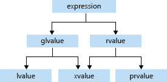

[← C++](Cpp.md)

# 数据机制

## Data Category

[Value categories - cppreference.com](https://en.cppreference.com/w/cpp/language/value_category)

Each C++ [expression](https://en.cppreference.com/w/cpp/language/expressions "cpp/language/expressions") (an operator with its <u>operands</u>, a <u>literal</u>, a <u>variable name</u>, etc.) is characterized by two independent properties: a **type** and a **value category**. Each expression has some non-reference type, and each expression belongs to exactly one of the three <u>primary value categories</u>: **prvalue**, **xvalue**, and **lvalue**.

- **glvalue** (“generalized” lvalue) (**泛左值**): 是一个表达式，其求值可以确定一个对象或函数的 identity。要么是 lvalue 要么是 xvalue。
- **prvalue** (“pure” rvalue) (**纯右值**): 是一个表达式，其求值可以计算运算符的一个操作数（没有result object），或初始化一个对象（有result object）。
- **xvalue** (“eXpiring” value) (**将亡值**): 是一个 <u>glvalue</u>，可以提供出一个对象，该对象的资源可重复使用（通常是因为它接近其生存期的末尾）。
- **lvalue** (**左值**): 是*非 xvalue* 的 <u>glvalue</u>。
- **rvalue** (**右值**): 是一个 <u>prvalue</u> 或 <u>xvalue</u>。要么是prvalue 要么是xvalue。
``


xvalue的情况:
- 把一个变量(lvalue)套move, 或者说`static_cast<T&&>`; 或函数返回的右值引用. 即未具名的右值引用.
- 访问临时对象(prvalue)的成员.
- 不要仅凭“临时容器”判断：范围 for 的隐藏引用是具名变量，使用它的名字仍是左值表达式。

## 引用

[Reference declaration - cppreference.com](https://en.cppreference.com/w/cpp/language/reference)

- 非 const 左值引用 (lvalue reference)，`T&`，只能绑定左值
- 右值引用 (rvalue reference)，`T&&`，只能绑定右值
- 常量左值引用，`const T&`,既可以绑定左值，又可以绑定右值，但是不能对其进行修改

> [!info]
> 萧叶轩の言, 不确定正确性: **左值表达式的类型是左值引用**, 所以当把左值变量`a`赋值给左值引用的时候, 相当于把*整个*左值表达式都赋值了, 因此`int& v = a`会保证v与a的修改同步. 而普通的`int v = a`则相当于拿a作为构造参数去创建v对象, 决定v内容的值.

> 勘误：上面的说法保留作当时的理解。表达式的类型与值类别是两回事；`int& v = a`是在初始化引用，使其指向同一对象，并非把“左值表达式整体赋值”。见本节开头的 value category 定义。

在`int a = std::move(b)`中，`std::move(b)`是 **xvalue**；`a`的类型是`int`，使用名字`a`的表达式是 **lvalue**。若写`int&& a = std::move(b)`，`a`才是右值引用变量，但其名字仍是左值表达式。

由于具名右值引用被视为左值，因此我们要把它转回右值引用时就需要再用`move`(再次交出左值)或`forward`(具名赋值的逆操作)。

> [!tip]
> cpp中的引用是通过等号来实现的, 如`int &a = b`和`int &&a = 1`, 而函数的传参也相当于进行了等号操作. 这有时候看起来像是特别奇怪的隐式类型转换.

使用`static_cast`也能产生正常使用的左值引用:
```cpp
int i = 1;
auto &a = static_cast<int &>(i);
a = 2;
std::cout << i << std::endl; // 2
```

### 从左值转化成右值引用

```cpp
int i = 0;
int &&k1 = i; //编译失败
int &&k2 = static_cast<int&&>(i); //编译成功
```

## std::move

[【Modern C++】深入理解移动语义](https://mp.weixin.qq.com/s/GYn7g073itjFVg0OupWbVw)

```cpp
//C++11 std::move的实现 
template<typename T> 
typename remove_reference<T>::type&& move(T&& param) { 
	using ReturnType = typename remove_reference<T>::type&&; 
	return static_cast<ReturnType>(param); 
}
```

因此`std::move(arg)`等价于:
```cpp
static_cast<std::remove_reference<decltype(arg)>::type&&>(arg)
```

> [!info]
>std::move is used to indicate that an object t may be "moved from", i.e. allowing the efficient transfer of resources from t to another object. In particular, std::move produces an **xvalue** expression that identifies its argument t. It is exactly equivalent to a static_cast to an rvalue reference type.

转换的过程不存在复制，也不存在数据剥夺，在运行时什么都没做，只是个单纯的类型转换。

将 move 结果用于赋值时会参与重载决议，可能调用移动赋值，也可能拷贝或编译失败；初始化则对应构造。尤其 `const` 对象通常不能绑定到移动操作的非 const 右值引用参数。

**移动语义**：移动操作可以转移资源，但 `std::move` 本身只做转换。标准库对象被移动后通常处于**有效但未指定的状态**，仍可析构、重新赋值；其他操作须满足其前置条件。自定义类由自身契约决定。[标准库移后状态](https://eel.is/c++draft/lib.types.movedfrom)。

因此，移动操作一般要做到：将原对象的数据移至自己的手下，并让原对象失去数据。

编译器生成的移动构造逐成员移动；如果成员已用 `unique_ptr`、容器等管理资源，通常遵循 **Rule of Zero** 即可。直接拥有裸指针等资源时，才需要仔细实现或禁用相关特殊成员；并非每个自定义类都必须手写移动。

若通过裸指针独占资源，移动构造在转移所有权后通常**把原对象的拥有型指针设为 nullptr**（或其他安全空状态）。因为即使一个左值a被move到另一个左值b，a本身是不会被消除的，**在a的生命周期结束后会自动调用其析构函数**，从而可能触发野指针错误或者对一个数据进行多次析构（a和b都会调用析构函数）。

## std::forward 完美转发 

[std::forward - cppreference.com](https://en.cppreference.com/w/cpp/utility/forward)

`forward`能把一个函数形参还原成它在此函数被调用时传入的值的data category，从而触发不同的函数。结合[万能引用](%E6%A8%A1%E6%9D%BF%E5%9F%BA%E7%A1%80%E4%B8%8E%E6%8E%A8%E5%AF%BC.md#%E4%B8%87%E8%83%BD%E5%BC%95%E7%94%A8%20universal%20reference)使用.

它能转发[forwarding references](https://en.cppreference.com/w/cpp/language/reference#Forwarding_references). 这些东西在形式上是：
```cpp
[const] T &[&]
即：
const T &
T &
const T &&
T &&
```

> 和move一样在<u>运行时</u>没做任何改动，仅仅是类型转换。

```cpp
#include <iostream>
#include <memory>
#include <utility>
 
struct A {
    A(int&& n) { std::cout << "rvalue overload, n=" << n << "\n"; }
    A(int& n)  { std::cout << "lvalue overload, n=" << n << "\n"; }
};
 
class B {
public:
    template<class T1, class T2, class T3>
    B(T1&& t1, T2&& t2, T3&& t3) :
        a1_{std::forward<T1>(t1)},
        a2_{std::forward<T2>(t2)},
        a3_{std::forward<T3>(t3)}
    {
    }
 
private:
    A a1_, a2_, a3_;
};
 
template<class T, class U>
std::unique_ptr<T> make_unique1(U&& u)
{
    return std::unique_ptr<T>(new T(std::forward<U>(u)));
}
 
template<class T, class... U>
std::unique_ptr<T> make_unique2(U&&... u)
{
    return std::unique_ptr<T>(new T(std::forward<U>(u)...));
}
 
int main()
{   
    auto p1 = make_unique1<A>(2); // 右值
    int i = 1;
    auto p2 = make_unique1<A>(i); // 左值
 
    std::cout << "B\n";
    auto t = make_unique2<B>(2, i, 3);
}
```

输出：

```txt
rvalue overload, n=2
lvalue overload, n=1
B
rvalue overload, n=2
lvalue overload, n=1
rvalue overload, n=3
```

### forward_as_tuple

[std::forward\_as\_tuple - cppreference.com](https://en.cppreference.com/w/cpp/utility/tuple/forward_as_tuple)

将参数组成tuple的形式，并且每个参数都被forward了。可以用于全部完美转发地传参数列表。而且如果参数是临时变量的话，不会将其存储（即不会延长生命周期）；如果不在表达式结束前使用完毕，则会造成悬垂引用。

## 各种cast

`reinterpret_cast`把一个数据对象直接重新按指定数据类型解释. 纯编译期. 允许任意转换.

`static_cast`进行运行期类型转换, 并且在编译期进行类型转换的可行性检查.

`dynamic_cast`可以把父指针转变为子指针(向下转换), 并且在转换失败时返回`nullptr`. 纯运行期.

`const_cast`是对cv限定符进行增删:
```cpp
void legacyFunction(int* ptr) {
    // 一个不接受 const 的旧函数
}

int main() {
    const int x = 10;
    // legacyFunction(&x); // 错误：无法将 const int* 转为 int*
    
    int y = 20;
    const int* p = &y;
    legacyFunction(const_cast<int*>(p)); // 合法：y 本身不是 const
    // legacyFunction(const_cast<int*>(&x)); // UB：x 是 const
}
```

