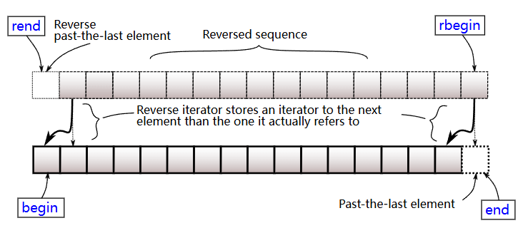

[← C++](Cpp.md)

## 函数（谓词）
### 仿函数（闭包）

若一个类重载了`operater()`，则其实现是个可调用对象，也叫仿函数、闭包。

### Lambda表达式

[Lambda expressions (since C++11) - cppreference.com](https://en.cppreference.com/w/cpp/language/lambda)

```cpp
[ 捕获 ] ( 形参 ) -> ret { 函数体 };
```

式子会返回一个匿名、右值的闭包。

每个lambda表达式都有唯一的类型(即使签名相同), 这是为了[方便编译器优化](../Rust/%E5%AE%9E%E8%B7%B5%E9%97%AE%E9%A2%98.md#%E5%87%BD%E6%95%B0%E7%B1%BB%E5%9E%8B%E5%94%AF%E4%B8%80%E6%80%A7%E4%B8%8E%E7%BC%96%E8%AF%91%E5%99%A8%E4%BC%98%E5%8C%96%E7%90%86%E8%AE%BA).

当编译器可以推导返回值类型的时候（包括无返回值时），可以不写`-> ret`。

底层逻辑其实就是仿函数，即编译器自动生成一个重载了`operater()`的类。

#### 捕获 (capture)

在调用lambda表达式时不需要把捕获中的变量当成参数输入，就可以把它们传进去（相当于在定义时而非在调用时传入变量）。

```txt
[]：默认不捕获任何变量；
[=]：默认以复制捕获所有变量；
[&]：默认以引用捕获所有变量；
[x]：仅以复制捕获x，其它变量不捕获；
[x…]：以包展开方式复制捕获参数包变量；
[&x]：仅以引用捕获x，其它变量不捕获；
[&x…]：以包展开方式引用捕获参数包变量；
[=, &x]：默认以复制捕获所有变量，但是x是例外，通过引用捕获；
[&, x]：默认以引用捕获所有变量，但是x是例外，通过复制捕获；
[this]：通过引用捕获当前对象（其实是复制指针）；
[*this]：通过复制方式捕获当前对象；
```

**广义捕获**包括**简单捕获**和**初始化捕获**. 上面的捕获是简单捕获. 初始化捕获的例子:
```cpp
int x = 5;
auto foo = [r = x + 1]{ return r; }
```

所有**值捕获**都默认是`const`, 想要其<u>可变</u>的话就要在参数后面加上`mutable`.

#### 泛型lambda表达式

参数中使用auto来定义泛型lambda表达式, 从而兼容多种类型：
```cpp
auto foo = [](auto a){ return a; }
int three = foo(3);
char const* hello = foo("hello");
```

也可以使用模板语法:
```cpp
auto foo = []<typename T>(std::vector<T> vec) {...}
```


#### 捕获this

如果定义的上下文是在对象里面, 那么**当前对象的this指针**可以捕获进lambda表达式(`[this]`). 显然, <u>this指针</u>只能进行**值捕获**.

但是, 也可以直接拷贝当前对象进去, 即`[*this]`.

虽然<u>目前</u>`[=]`也包含了对`this`的捕获, 但是可以写成`[=, this]`来让语义更显式. 这也是为了与`[=, *this]`(捕获所有变量并且复制当前对象)相区分.

#### 可构造和可赋值的无状态lambda表达式

cpp20中, 允许无状态(无捕获)的lambda表达式可以被构造和赋值(拷贝), 即为其保留默认构造函数和拷贝构造函数. cpp20前, 闭包类型不是默认可构造的.

例如下面的代码中, 想要用模板类型参数来指定`cmp`, 并且不希望通过传值来传递`cmp`闭包的话, 就要在`std::map`的构造函数内部对`decltype(greater)`这个无状态闭包类型进行构造. 这是cpp20才支持的, 以前还要给`mymap`额外传`greater`参数.
```cpp
auto greater = [](auto x, auto y) { return x > y;};  
std::map<std::string, int, decltype(greater)> mymap;
```

而下面这段代码需要greater拥有拷贝构造函数, 也是cpp20才支持:
```cpp
auto greater = [](auto x, auto y) { return x > y;};  
std::map<std::string, int, decltype(greater)> mymap1, mymap2;  
mymap1 = mymap2;
```

### std::function （包装器）

`function<int(int, int)>`可以统一所有的对应出入参的函数类型，它可以是函数指针、仿函数和Lambda表达式。

使用样例：作为map的键的类型，这样就可以用Lambda表达式来传值。

### std::bind

将函数包装器与参数进行绑定（也可使用`std::placeholders`进行缺省），返回类型也是包装器，可以直接调用。

```cpp
#include <functional>
#include <iostream>

void func(int i, int j) {
    std::cout << i << " " << j << std::endl;
}

int main() {
    auto f1 = std::bind(func, 1, 2);
    f1();
    auto f2 = std::bind(func, std::placeholders::_1, 4);
    f2(3);
    return 0;
}

// Output:
// 1 2
// 3 4
```

只能绑定值类型, 可以使用[std::ref](#std%3A%3Aref)实现绑定引用.

## std::ref

`std::ref(t)`可以被<u>隐式类型转换</u>为对`t`的**引用**.

有时候函数参数只能传递值类型, 比如在使用[std::bind](#std%3A%3Abind)时, 以及当模板类型为`T`而不是`T&`的时候, 可以通过使用`std::ref(t)`来实现传递引用(因为`std::ref`本身是个变量, 可以值传递).

## sort函数

默认从小到大。

重载`operator<`即可重建该对象的排序规则。

也可以添加比较函数：
```cpp
//比较函数，使其从大到小排
int cmp(const int &a, const int &b) { 
	if(a > b) { 
		return true; 
	} 
	return false; 
}
sort(arr, arr+len, cmp);
```

> [!info]
> 可以使用`ranges::sort`.

## max min 函数

[std::max - cppreference.com](https://zh.cppreference.com/w/cpp/algorithm/max)

可以使用初始化列表来比较多个值, 如`max({1, 2, 3})`.

## stable_sort函数（稳定排序）

和sort函数用法一样，但是稳定。

## less greater 比较类

在头文件`functional`中。是个仿函数，因此`greater<T>`表示一种类型。如int的比较类就是`greater<int>`，表示取大（`>`）。

直接比较：
```cpp
template <class T>
struct greater {
    bool operator()(const T& a, const T& b) const {
        return a > b; // 返回 a 是否大于 b
    }
};
```

使用空参数创建对象，传入sort，就能指定其从大到小排序：
```cpp
sort(arr, arr+len, greater<int>());
```

或者把类作为模板参数：
```cpp
priority_queue<int,vector<int>,less<int>> big_heap;
```
## priority_queue 优先级队列

就是个堆。

优先级：排前面（上面）的优先级高。在sort中排在后面的，在priority_queue中就排在前面，也就是优先级高。

默认为大顶堆。

在头文件`queue`中。

```cpp
priority_queue<类型,容器,比较函数类型>

// 大顶堆（降序）
priority_queue<int> big_heap;
priority_queue<int,vector<int>,less<int>> big_heap2;

// 小顶堆（升序）
priority_queue<int,vector<int>,greater<int>> small_heap;

// 传入自定义函数
priority_queue<pair<int, int>, vector<pair<int, int>>, decltype(&cmp)> q(cmp);

// 传入自定义闭包
auto cmp = [](const ListNode* a, const ListNode* b){
	return a->val > b->val;
};
priority_queue<ListNode*, vector<ListNode*>, decltype(cmp)> pq;

// 使用仿函数
struct cmp {
    bool operator ()(const node &a, const node &b){
        return a.value>b.value; //按照value从小到大排列
    }
};
priority_queue<node, vector<node>, cmp>q;

// 重定义运算符
struct node{
    int value;
    friend bool operator<(const node &a,const node &b){
        return a.value<b.value; //按value从大到小排列
    }
};
priority_queue<node>q;
```

| 方法      | 功能                             |
| --------- | -------------------------------- |
| push()    | 在优先级队列末尾插入新元素并调整 |
| emplace() | 在优先级队列末尾构造新元素并调整 |
| pop()     | 删除优先级最高的元素             |
| top()     | 获取优先级最高的元素             |
| size()    | 获取优先级队列的大小             |
| empty()   | 验证队列是否为空                 |
|   swap()        | 交换两个优先级队列的内容                                 |

## 数学函数

- `std::gcd`: 最大公约数
- `std::lcm`: 最小公倍数
- `std::floor`: 不比参数大的最近(最大)整数
- `std::ceil`: 不比参数小的最近(最小)整数
- `std::trunc`: 绝对值不比参数大的最近整数（即截断小数）
- `std::round`: 四舍五入(绝对值意义上)

## 二分查找

都必须应用于有序容器. 有`std::xxx`版本和`ranges::xxx`版本.

### upper_bound & lower_bound

假设有一个有序容器，给出它的两个迭代器，就能使用这两个函数来通过**二分查找**找到满足要求的一个元素的迭代器:
- `upper_bound`: `>`
- `lower_bound`: `>=`
如果有一个**从小到大**排序好的数组`nums`，则：
```cpp
// 得到第一个大于等于10的元素的迭代器
auto it1 = lower_bound(nums.begin(), nums.end() , 10);
// 得到第一个大于10的元素的迭代器
auto it1 = upper_bound(nums.begin(), nums.end() , 10);
```

要在**从大到小**的数组里面查找的话，要使用`greater<int>()`：
```cpp
auto it = upper_bound(nums.begin(), nums.end(), 10, greater<int>());
```

还有一个参数是`proj`, 语义为投影. 例如, 在`vector<vector<int>> matrix`(按下标0元素大小升序排列)中, 寻找下标0处的元素大于`target`的第一个元素:
```cpp
auto col_it = ranges::upper_bound(matrix, target,
		ranges::less{}, [](auto&& v){return v[0];});
```

### equal_range

`equel_range`寻找等于目标的范围. 具体来说返回的是这样一个pair:
- 左边是第一个不小于目标值的元素.
- 右边是第一个大于目标值的元素.
因此, 如果<u>不存在目标值</u>, 则**左右相等**, 都是第一个大于目标值的元素.

```cpp
template <class ForwardIt, class T>
std::pair<ForwardIt, ForwardIt> equal_range(ForwardIt first, ForwardIt last, const T& value);
```

### binary_search

`binary_search`仅返回是否存在目标(`bool`).

## 字符串

[C++中将Char转换成String的4种方法\_C 语言\_脚本之家](https://www.jb51.net/article/277515.htm)
### C风格字符串操作

都是对char数组的操作（参数为char*）。

- strcpy(p, p1) 复制字符串 
- strncpy(p, p1, n) 复制指定长度字符串 
- strcat(p, p1) 附加字符串 
- strncat(p, p1, n) 附加指定长度字符串 
- strlen(p) 取字符串长度 
- strcmp(p, p1) 比较字符串 
- strcasecmp(p, p1)忽略大小写比较字符串 
- strncmp(p, p1, n) 比较指定长度字符串 
- strchr(p, c) 在字符串中查找指定字符 
- strrchr(p, c) 在字符串中反向查找 
- strstr(p, p1) 查找字符串 
- strpbrk(p, p1) 以目标字符串的所有字符作为集合，在当前字符串查找该集合的任一元素 
- strspn(p, p1) 以目标字符串的所有字符作为集合，在当前字符串查找不属于该集合的任一元素的偏移 
- strcspn(p, p1) 以目标字符串的所有字符作为集合，在当前字符串查找属于该集合的任一元素的偏移

### char字符检查函数

参数都为char。

- isalpha() 检查是否为字母字符 
- isupper() 检查是否为大写字母字符 
- islower() 检查是否为小写字母字符 
- isdigit() 检查是否为数字 
- isxdigit() 检查是否为十六进制数字表示的有效字符 
- isspace() 检查是否为空格类型字符 
- iscntrl() 检查是否为控制字符 
- ispunct() 检查是否为标点符号 
- isalnum() 检查是否为字母和数字 
- isprint() 检查是否是可打印字符 
- isgraph() 检查是否是图形字符，等效于 isalnum() | ispunct()

### string

| 方法      | 功能                                                                                                                 |
| --------- | -------------------------------------------------------------------------------------------------------------------- |
| Operators | 可以用 == ， >， <， >=， <=， and !=比较字符串。 可以用 + 或者 += 操作符连接两个字符串， 并且可以用[]获取特定的字符 |
| append()  | 在字符串的末尾添加文本（就是+=）                                                                                     |
| compare() | 比较两个字符串                                                                                                       |
| empty()   | 如果字符串为空，返回真                                                                                               |
| erase()   | 删除字符                                                                                                             |
| insert()  | 插入字符，也可以插入另一个字符串的子串                                                                               |
| length()  | 返回字符串的长度                                                                                                     |
| replace() | 替换字符                                                                                                             |
| size()    | 返回字符串中字符的数量（结果等价于length）                                                                           |
| substr()  | 返回某个子字符串                                                                                                     |
| swap()    | 交换两个字符串的内容                                                                                                 |
|  c_str()         |      返回字符数组（const char\*）                                                                                                                |

使用`string s = {'a', 'b'};`来将单个或多个char转为字符串.

```cpp
//erase
string s("1234567890123456789012345");//总共25个字符
cout << s << endl;
cout << s.erase(10, 6) << endl;//从下标第10的字符开始删除，一共删除6个。
cout << s.erase(10) << endl;//删除下标为10的字符及之后的 ==保留下标小于10的字符
cout << s.erase();//清空字符串
```

```cpp
//String转字符数组
char c[20];
string s="1234";
strcpy(c,s.c_str());

//数组字符转String
s=c;
```

使用`std::to_string`函数可以将数字转变为字符串(替代`itoa`).

#### find()

```cpp
string s = "this is buaa";

int sfy = s.find("is");
cout << sfy << " ";
cout << s.find("is") << " ";
cout << "\n";

int sfn = s.find("isj");
cout << sfn << " ";
cout << s.find("isj") << endl;

cout << s.npos << " " << std::string::npos << endl;
cout << boolalpha << (s.find("isj") == s.npos) << " ";
cout << boolalpha << (s.find("isj") == -1) << " ";
cout << "\n";
```

输出：
```cpp
2 2 
-1 18446744073709551615
18446744073709551615 18446744073709551615
true true 
```

找到了就返回起始下标值，找不到就返回`std::string::npos`，等于`-1`。

### string_view

[std::basic\_string\_view - cppreference.com](https://zh.cppreference.com/w/cpp/string/basic_string_view)

对`string`的引用，不进行拷贝。要手动管理生命周期，保证被引用的string有效。

直接使用`string_view sv = string_view(s)`或者`string_view sv = s`即可创建字符串`s`的引用，因为标准库定义了string到string_view的隐式转换：[std::basic\_string\<CharT,Traits,Allocator\>::operator basic\_string\_view - cppreference.com](https://en.cppreference.com/w/cpp/string/basic_string/operator_basic_string_view.html)。
```cpp
#include <iostream>
#include <string_view>

void printSubstring(std::string_view str)
{
    std::cout << "Substring: " << str << std::endl;
}

int main()
{
    std::string fullString = "Hello, World!";
    std::string_view substring(fullString.data() + 7, 5); // 获取子串 "World"
    
    // UB，悬空指针，指向了临时对象
    // std::string_view substring = fullString.substr(7, 5);

    printSubstring(substring);

    return 0;
}
```

### substr

`string`的`substr`是$O(n)$的，会直接拷贝出子串；但`string_view`的`substr`是$O(1)$的，不会发生拷贝。因此, 如果只是拿一个字符串的一部分出来做临时比较的话, 应该使用`string_view(s).substr(2, 5)`这样的形式来取引用值.


## iterator 迭代器

### reverse_iterator

[std::reverse\_iterator - cppreference.com](https://en.cppreference.com/w/cpp/iterator/reverse_iterator)

`reverse_iterator`是反向迭代器, 可以<u>由一个普通迭代器创建</u>. 

如果反向迭代器`r`由普通迭代器`i`创建, 那么(在可解引用的情况下)总是满足`&*r == &*(i-1)`, 即反向迭代器总是左偏一格. 应该是为了保证`rbegin`(末尾元素)和`rend`(首元素的前一格)的用法与`begin`和`end`一致).



使用`r.base()`可以获取其对应的**普通迭代器**(注意会右偏一格).

### distance()

返回两个迭代器之间的元素个数，类似于两者之差。

```cpp
#include <iostream> // std::cout
#include <iterator> // std::distance
#include <list> // std::list
using namespace std;

int main() {
	//创建一个空 list 容器
	list<int> mylist;
	//向空 list 容器中添加元素 0~9
	for (int i = 0; i < 10; i++) {
		mylist.push_back(i);
	}
	//指定 2 个双向迭代器，用于执行某个区间
	list<int>::iterator first = mylist.begin();//指向元素 0
	list<int>::iterator last = mylist.end();//指向元素 9 之后的位置
	//获取 [first,last) 范围内包含元素的个数
	cout << "distance() = " << distance(first, last);
	return 0;
}
```

输出：
```txt
distance() = 10
```

## 随机数

```cpp
#include <random>

std::random_device rd;  
auto gen = std::default_random_engine(rd());  
std::uniform_int_distribution<int> dis(0,10);  
  
for (int i=0; i<10; ++i) {  
    std::cout<<"rand: " << dis(gen) << " ";  
}
```

## tuple

[std::tuple - cppreference.com](https://zh.cppreference.com/w/cpp/utility/tuple)

## 元组式 tuple-like

[tuple-like, pair-like - cppreference.com](https://zh.cppreference.com/w/cpp/utility/tuple/tuple-like)

pair-like就是恰好有两个项的tuple-like.

规定了array, pair, tuple, subrange等的统一特性, 包括:
- 实现了元组协议, 能使用`std::get<1>`等.
- 可以结构化绑定.
- 实现三向比较运算符.
- 使用`apply(func, tuple)`函数可以把元组式值的每一项作为参数传给`func`函数.

## span

[std::span - cppreference.com](https://zh.cppreference.com/w/cpp/container/span)

`span<T, Extent>`是一段**连续**内存的**引用**, 内存的单位类型为`T`, 长度为`Extent`(也可以是动态长度).

## ranges

[Ranges library (C++20) - cppreference.com](https://en.cppreference.com/w/cpp/ranges)

> [!info]
> `std::ranges::views`被起了别名: `std::views`.

### range concept

库中定义了`range` concept: [std::ranges::range - cppreference.com](https://en.cppreference.com/w/cpp/ranges/range)
```cpp
template< class T >
concept range = requires(T& t) {
  ranges::begin(t); // equality-preserving for forward iterators
  ranges::end  (t);
};
```

满足了`range` concept的类型就可以使用ranges库的东西了.

例如, 可以简化`sort`等函数的传参, 因为满足该concept后, 必然可以正常获取首尾迭代器.
```cpp
vector<int> vec{3,5,2,8,10};
std::ranges::sort(vec);
std::ranges::sort(vec, std::greater());
```


### 管道运算符 `|` & Range Adaptors

[范围适配器闭包对象 (Range Adaptor Closure Object) ](https://zh.cppreference.com/w/cpp/named_req/RangeAdaptorClosureObject)才能被用于管道运算符右侧用于接收参数, 例如, 若`C`是*范围适配器闭包对象*, 且`R`是`ranges`的话, 则`C(R)`等价于`R | C`.

而**范围适配器闭包对象**的来源, 要么是一元的[范围适配器对象 (Range Adaptor Object) ](https://zh.cppreference.com/w/cpp/named_req/RangeAdaptorObject), 要么直接继承[std::ranges::range\_adaptor\_closure](https://zh.cppreference.com/w/cpp/ranges/range_adaptor_closure).

**范围适配器对象**被定义为: 第一个参数为[std::ranges::viewable_range](https://zh.cppreference.com/w/cpp/ranges/viewable_range), 返回值为[std::ranges::view](https://zh.cppreference.com/w/cpp/ranges/view). *范围适配器对象*接收足够多的参数从而被变成一元后，就变成了*范围适配器闭包对象*。

自己实现管道运算符:
```cpp
#include <iostream>
#include <vector>
#include <functional>

std::vector<int>& operator|(std::vector<int>& v, std::function<void(int&)> func)
{
    for (int& i:v)
        func(i);
    return v;
}

int main()
{
    std::vector<int> v{1, 2, 3};
    std::function f{[](const int& i) {std::cout<< i << ' ';}};
    auto f2 = [](int& i) {i *= i;};
    v | f2 | f;
    return 0;
}
```

更通用的写法:
```cpp
template<class T>
std::vector<T>& operator|(std::vector<T>& v, std::invocable<T&> auto const &func)
{
    for (T& i:v)
        func(i);
    return v;
}
```

range adaptors可以加工满足要求的东西, 如`std::views::take`, `std::views::transform` 和 `std::views::filter`. 下面的代码是通过嵌套调用来完成的: 
```cpp
std::vector<int> vec{20, 1, 12, 4, 20, 3, 10, 1};

auto even = [](const int &a) { return a % 2 == 0; };
auto square = [](const int &a) { return a * a; };

for (int i : 
	 std::views::take(
		 std::views::transform(
			 std::views::filter(vec, even), 
		 square), 
	 2)
	 ) {
	std::cout << i << " ";
}

// Output:
// 400 144
```

显然, 这种嵌套类似于链式调用. cpp提供了管道运算符让前一个函数的输出变成下一个函数的参数, 从而增强可读性:
```cpp
for (int i : 
	 vec | std::views::filter(even) |
	 std::views::transform([](const int &a) {return a * a;}) |
	 std::views::take(2)
	) {
	std::cout << i << " ";
}
```

range adaptors 是**懒求值**的, 或者说取的都是引用(`xxx_view`).

一般来说, 要么对view直接进行迭代, 要么使用`to`来把view变回容器.

view下的这些适配器是全局对象：
- 通过模板`operator()`来适配不同的输入（自动推导），返回范围适配器闭包对象。当然，无需额外参数的适配器（例如enumerate）本身就是个范围适配器闭包对象。
- 得到的范围适配器闭包对象通过模板`operator|`来适配不同的输入view。由于输入的view被作为`operator|`的参数，因此也可以自动推导模板。
而`std::ranges::to`必须显式指定模板参数（cpp无法根据所需返回值自动推导模板），因此被设计成了模板函数的形式，要使用`std::ranges::to<T>()`来获得对应的范围适配器闭包对象。

### ranges 库函数使用

`std::ranges`下的有些函数需要导入`#include <algorithm>`才有.

`view`可以看做引用, 交给`std::ranges`的函数来对容器进行原地操作; 而`std::views`的函数仅仅是把`view`再变换为新的`view`(例如`ranges::reverse`和`views::reverse`).

#### 适配的旧函数

旧函数一般需要传入`v.begin(), v.end()`两个参数, 新的ranges内的对应函数则只需要传入`v`就行了.

`sort`, `for_each`, `lower_bound`等.

对`vector<vector<int>>`按照数组首元素大小进行升序排列:
- `ranges::less`要求六个比较都成立才可以使用.
- `[](auto&& v){return v[0];}`定义了投影.
```cpp
ranges::sort(intervals, ranges::less{}, 
	[](auto&& v){return v[0];});
```

#### 使用to, 在views操作后依然输出容器

[std::ranges::to - cppreference.com](https://en.cppreference.com/w/cpp/ranges/to)

一般用于不同类型的容器之间的转换. 注意一般情况下会发生复制. 使用`views::as_rvalue`可以把所有权传入`to`的目标容器, 从而<u>去除不必要的拷贝</u>.

`std::ranges::to<std::unordered_map>()`会生成一个 可以让某视图转变成`unordered_map`的适配器, 该适配器可以被管道运算符调用.

```cpp
std::vector<int> nums = {10, 20, 30, 20, 40};

auto m = nums | std::views::enumerate // 生成 [(index, value)]
		 | std::views::transform([](auto &&t) {
			   auto &&[idx, v] = t;
			   return std::make_pair(v, idx);
		   }) |
		 std::ranges::to<std::unordered_map>(); // 转换为 unordered_map

// 结果：{10→0, 20→3, 30→2, 40→4}（重复的20被覆盖）
```

> [!notice]
> `std::ranges::to`一定要写括号`()`!


#### 查找容器最后一个目标值的位置

[std::ranges::find\_last, std::ranges::find\_last\_if, std::ranges::find\_last\_if\_not - cppreference.com](https://en.cppreference.com/w/cpp/algorithm/ranges/find_last)

利用`ranges::find_last`, 在一个`ranges::forward_range`上寻找最后一个等于目标值的项, 返回以此项为开头的子range. 之后使用`ranges::distance`求range的begin之差以获取下标值.
```cpp
std::vector<int> vec = {0, 0, 1, 0, 1, 0};
auto aim_rit = std::ranges::find_last(vec, 1);
int aim_idx = std::ranges::distance(vec.begin(), aim_rit.begin());
assert(aim_idx == 4);
```

根据情况，可能更高效的方式是从后往前查询. 使用`ranges::find`查找第一个满足要求的东西. 传入目标的**反向迭代器**, 就能实现**反向查询**. 最后计算下标时, 使用`base()`把反向迭代器转成正向迭代器以简单求得下标.
```cpp
std::vector<int> vec = {0, 0, 1, 0, 1, 0};
auto aim_rit = std::ranges::find(vec.rbegin(), vec.rend(), 1);
int aim_idx = std::ranges::distance(vec.begin(), aim_rit.base()) - 1;
assert(aim_idx == 4);
```

> [!info]
> 这两种`find`都是支持传入满足`forward_iterator`的东西.

#### 截取容器进行操作

部分二分查找: 如果一个容器只有一部分有序, 只需要在这一部分里面查找, 那么:
```cpp
std::vector<int> vec = {9, 8, 1, 2, 3, 4, 5, 3, 2, 1};
auto part_vec = vec | std::views::drop(2) | std::views::take(5);
auto aim_it = std::ranges::lower_bound(vec, 3);
auto index = std::ranges::distance(vec.begin(), aim_it);
assert(index == 4);
```

部分翻转: [189. 轮转数组 - 力扣（LeetCode）](https://leetcode.cn/problems/rotate-array)
```cpp
void rotate(vector<int>& nums, int k) {
	int len = nums.size();
	k %= len;
	ranges::reverse(nums);
	ranges::reverse(nums | views::take(k));
	ranges::reverse(nums | views::drop(k));
}
```


#### 使用transform (即map)

[1170. 比较字符串最小字母出现频次 - 力扣（LeetCode）](https://leetcode.cn/problems/compare-strings-by-frequency-of-the-smallest-character)

```cpp
vector<int> numSmallerByFrequency(vector<string>& queries, vector<string>& words) {
	// f
	auto count = [](const string &s) {
		char aim_ch = s[0];
		int cnt = 0;
		for(auto&& ch: s) {
			if(ch < aim_ch) {
				aim_ch = ch;
				cnt = 0;
			}
			if(ch == aim_ch) {
				cnt++;
			}
		}
		return cnt;
	};

	auto fw = words | views::transform(count) | ranges::to<vector<int>>();
	ranges::sort(fw);
	
	auto fq = queries | views::transform(count) | ranges::to<vector<int>>();

	// 满足的word的个数
	auto search = [&fw](const int &q){
		auto it = ranges::upper_bound(fw, q);
		return distance(it, fw.end());
	};

	auto ans = fq | views::transform(search) | ranges::to<vector<int>>();
	return ans;
}
```

#### 使用fold_left (即reduce)

[std::ranges::fold\_left - cppreference.com](https://zh.cppreference.com/w/cpp/algorithm/ranges/fold_left)

```cpp
int sum = ranges::fold_left(nums, 0, std::plus<int>());

int sum = ranges::fold_left_first(nums, plus<int>()).value();
```

```cpp
int sum = ranges::fold_left(nums, 0, 
			[&](int acc, const int &v){
				return acc + (v-1)/mid + 1;
			});
```

`fold_left_first`把第一个元素作为初值; 其返回值为`optional<T>`而非`T`, 因为有可能参数容器为空.

#### 使用join

即flatten。结合transform一起可以形成`flat_map`(monad bind)逻辑.

```cpp
std::vector<int> nums = {10, 20, 30, 20, 40};
auto out =
	nums |
	std::views::transform([](auto &&v) { return std::to_string(v); }) |
	std::views::join | std::ranges::to<std::string>();

// Output:
// 1020302040
```

#### 元组式值操作

[std::views::enumerate](https://en.cppreference.com/w/cpp/ranges/enumerate_view.html)把`value`变成`[index, value]`.

[std::views::elements](https://zh.cppreference.com/w/cpp/ranges/elements_view)可以取出元组式值的某一项, 例如`std::views::elements<2>`可以取出`[6, 7, 8, 9]`的`8`.

[std::views::values](https://zh.cppreference.com/w/cpp/ranges/values_view)是`ranges::elements_­view<R, 1>`的别名, 取元组式值的第二项. [std::views::keys](https://zh.cppreference.com/w/cpp/ranges/keys_view)同理取第一项.
```cpp
std::map<int, std::string> map{{1, "alpha"}, {2, "beta"}};
for (auto const& value : std::views::values(map))
    std::cout << value << ' ';
// 打印: alpha beta
```

#### 使用串算法

[std::ranges::search - cppreference.com](https://zh.cppreference.com/w/cpp/algorithm/ranges/search)

使用`ranges::search`实现kmp, 在`haystack`中匹配`needle`(`search`文档里面也是这么称呼的):
```cpp
int strStr(string haystack, string needle) {
	auto res = ranges::search(haystack, needle);
	auto ans = res.begin();
	if(ans == haystack.end()) {
		return -1;
	}
	return distance(haystack.begin(), ans);
}
```


## piecewise_construct

有的函数参数是用单个tuple接收的。因此，编译器可能不知道应该去匹配tuple为参数的函数，还是单纯有若干个参数（和tuple内部结构一样）的函数。

此时，只要在传参的时候在第一个参数前附上`std::piecewise_construct`，就能显式地匹配单纯有若干个参数的函数。


## inline

[inline specifier - cppreference.com](https://en.cppreference.com/w/cpp/language/inline)

- 内联函数或变量的定义必须在访问它的翻译单元可达.
- 带外部链接的内联函数或变量允许在多个翻译单元中有相同的定义, 最后都会使用同一个地址.

### 将static类成员变量的声明和定义放一起

类中的static变量需要在class的定义中声明, 而class的定义一般写在头文件, 而头文件里面不应当对变量初始化, 于是不得不将其声明与定义分离. 现在使用inline即可在一处直接声明并初始化.

```cpp
class X {
	inline static std::string text{ "hello" };
}
```

## 多可能值

### std::variant

[std::variant - cppreference.com](https://en.cppreference.com/w/cpp/utility/variant)

是一个 **type-safe union**, 能存取任意类型, 存取时使用泛型参数进行类型检查, 检查失败会返回异常.

### std::optional

[std::optional - cppreference.com](https://en.cppreference.com/w/cpp/utility/optional)

有或没有某个值. 没有值时, 它包含的是`std::nullopt_t`.

### std::expected

[std::expected - cppreference.com](https://en.cppreference.com/w/cpp/utility/expected)

就是Rust的`Result<T, E>`.


# 异常 TODO

[std::exception - cppreference.com](https://en.cppreference.com/w/cpp/error/exception)

- 错误应当被当场处理的(对其进行分支性的操作), 则不该用异常.
- 若要中止后序所有逻辑 并 进入一段独立的处理流程, 则都该设为异常.


