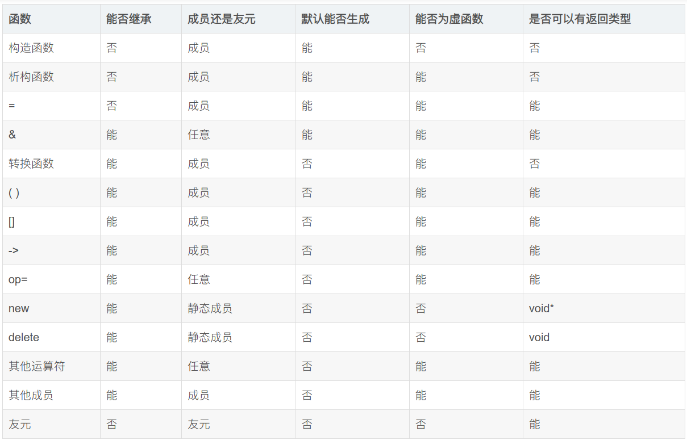

[← C++](Cpp.md)

# 类与对象

## 类成员变量默认初始化


可以在类成员函数处直接指定其默认初始化值, 而不需要全都写在初始化列表里面. 优先级低于初始化列表, 即会被初始化列表指定的值覆盖.

```cpp
class X {
  private:
    int a = 1;
    double b{1.};
};
```

## 类函数性质



## 特殊成员函数

- 默认构造函数 `Obj()`
- 析构函数 `~Obj()`
- 拷贝构造函数 `Obj(const Obj&)`
- 拷贝赋值运算符 `Obj& operator=(const Obj&)`
- 移动构造函数 `Obj(Obj&&)`
- 移动赋值运算符 `Obj& operator=(Obj&&)`

特殊成员函数若未被定义，则会由编译器自动生成。

>注意，xx构造函数都叫构造函数，都不能为virtual！

- `Obj o2 = o1;`调用**拷贝构造函数**
- `Obj o2; o2 = o1;`调用**拷贝赋值运算符**
- `Obj o2 = move(o1);`调用**移动构造函数**
- `Obj o2; o2 = move(o1);`调用**移动赋值运算符**
- `Obj o2 = Obj();`调用**移动构造函数**（因为传的是右值）
- `Obj &&o1; Obj o2 = o1;`调用**拷贝构造函数**（因为具名右值引用是左值）


移动相关：
- 只有一个类没有显示定义**拷贝构造函数、赋值运算符以及析构函数**，且类的**每个非静态成员都可以移动**时，编译器才会生成默认的**移动构造函数或者移动赋值运算符**。这是为了防止生成的移动不是开发人员想要的（因为开发人员选择自己管理复制和释放），或存在有问题的移动。
- 如果类中没有提供移动构造函数和移动赋值运算符，且编译器不会生成默认的，那么我们在代码中通过std::move()调用的移动构造或者移动赋值的行为将**被转换为调用拷贝构造或者赋值运算符**。因此对于不可移动的数据类型也可以像可移动的数据类型一样写代码，会自动变成复制操作。
- 移动构造函数和移动赋值运算符的生成是**不独立**的，若只实现了其中一个，则编译器**不会**自动生成另一个。这是为了防止移动出现问题。

拷贝相关：
- 如果显式声明了**移动构造函数或移动赋值运算符**，则**拷贝构造函数和拷贝赋值运算符**将被 **隐式删除**。
- 拷贝构造函数和拷贝赋值运算符的生成是**独立**的，若只实现了其中一个，则编译器也**会**自动生成另一个。

基础数据类型都没有实现移动。

### 特殊成员函数编写规范

复制、移动操作应该是无副作用的。而且如果有副作用的话，会因为编译器的优化导致出现意想不到的结果。

构造函数不要抛出异常。

复制操作应该尽可能进行复制，特别是new出来的东西要复制一份一模一样的而不是共用。

移动操作尽可能实现move语义，保证原对象被吃干抹净。

### explicit

如果类`X`的某个构造函数只有`Y y`一个参数, 那么`X x = y;`语句会调用此构造函数. 这是一种**隐式类型转换**, 使得`T`类型可以被直接隐式转为`X`类型.

```cpp
Student S1(22); // 显式构造 
Student S2 = 23; // 隐式构造
```

> [!info]
> 因此，等号赋值也可能是触发了构造函数，这在查cppref的时候要注意。

在这种**单参数的构造函数**的<u>前面</u>加上explicit可以防止在等号表达式中调用此构造函数:
```cpp
struct X {
	explicit X(Y y) {...}
}
```

### delete & default


声明特殊函数后在<u>后面</u>加上
- ` = default`: 生成默认的对应函数(**要求**编译器生成)
- ` = delete`: 删除默认的对应函数(**阻止**编译器生成)

```cpp
struct X {
	f1() = default;
	virtual ~f2() = delete;
	f3(const MyType &);
};
X::f3(const MyType &) = default;
```

### 委托构造函数

**委托构造函数**请求**代理构造函数**代为初始化, 即调用本类型的另一个构造函数.

```cpp
class X {
public:
	X() : X(0,0.) {} // X()是委托, X(int a,double b)是代理
	X(int a) : X(a,0.) {}
	X(double b) : X(0,b) {}
	X(int a,double b): a_(a), b_(b) { CommonInit(); }
private:
	void CommonInit();
	int a_;
	double b_;
};
```

<u>委托构造函数</u>**无法**在<u>初始化列表</u>里面进行成员初始化, 因此想干的额外的事情都要写进函数体.

执行顺序:
1. 代理构造函数的初始化列表
2. 代理构造函数的主体
3. 委托构造函数的主体

如果代理构造函数完成后, 委托构造函数出现异常, 则会调用该类型的析构函数(因为此时认为代理方已经完成了本类型的构造).

可以委托**模板构造函数**来简化多个构造函数的编写.
```cpp
class X {
	template<class T> X(T first, T last): l_(first,last){
	std::list<int> l_;
public:
	X(std::vector<short>&);
	X(std::deque<int>&);
};

X:X(std::vector<short>& v): X(v.begin(), v.end()){}
X:X(std::deque<int>& v): X(v.begin(), v.end()) {}
```

### 继承构造函数

使用using可以直接把基类的所有构造函数**都搬过来**.
```cpp
class Derived: public Base {
public:
	using Base::Base;
};
```

- <u>不会继承</u>基类的**默认构造函数**和**拷贝构造函数**, 因为在相应的时机默认就<u>必然会调用</u>它们, 因此继承是没有必要的.
- 同时, 不会影响派生类的默认构造函数.
- 如果派生类定义了一个构造函数, 其**签名**与基类的某个构造函数一样, 那么就<u>不会继承</u>那个基类构造函数.
- 继承多个**签名**相同的构造函数时会报<u>二义性错误</u>.

## 完整对象示例

```cpp
class BigObj { 
public: 
	// Constructor
	explicit BigObj(size_t length) : length_(length), data_(new int[length]) { } 
	// Destructor. 
	~BigObj() { 
		if (data_ != NULL) { 
			delete[] data_; 
			length_ = 0; 
		} 
	} 
	
	// 拷贝构造函数 
	BigObj(const BigObj& other) : length_(other.length_), data(new int[other.length_]) { 
		//直接复制数据
		std::copy(other.mData, other.mData + mLength, mData); 
	} 
	
	// 赋值运算符 
	BigObj& operator=(const BigObj& other) { 
		if (this != &other;) { 

			//删去自己原有的数据
			delete[] data_; 

			//重建并复制数据
			data_ = new int[length_]; 
			length_ = other.length_; 
			std::copy(other.data_, other.data_ + length_, data_); 
		} 
		return *this; 
	} 
	
	// 移动构造函数 
	BigObj(BigObj&& other) : data_(nullptr), length_(0) { 

		//获取数据所有权
		data_ = other.data_; 
		length_ = other.length_; 

		//剥夺对方的数据所有权
		other.data_ = nullptr; 
		other.length_ = 0; 
	} 
	
	// 移动赋值运算符 
	BigObj& operator=(BigObj&& other) { 
		if (this != &other;) { 

			//删去自己原有的数据
			delete[] data_; 

			//获取数据所有权
			data_ = other.data_; 
			length_ = other.length_; 

			//剥夺对方的数据所有权
			other.data_ = NULL; 
			other.length_ = 0; 
		} 
		return *this; 
	} 
	
private: 
	size_t length_; 
	int* data_; 
};
```

## 聚合类型

聚合类型的定义是, 它可以是一个<u>普通数组</u>, 或者要<u>同时满足</u>:
- 没有用户提供的构造函数(delete和default都没问题)
- 没有私有和受保护的非静态数据成员
- 没有虚函数

在新的扩展中，如果类存在<u>继承</u>关系，额外满足这些条件的也是聚合类型:
- 必须是公开的基类，不能是私有或者受保护的基类
- 必须是非虚继承

```cpp
// 一个非常简单, 平凡, 赤裸裸的类型
class X {
  public:
    int a;
    double b;
};
```

聚合类型**天然支持**[列表初始化](#%E5%88%97%E8%A1%A8%E5%88%9D%E5%A7%8B%E5%8C%96), 相当于直接给每个成员变量按顺序赋值, 例如:
```cpp
class X {
  public:
    int a;
    double b;
};

int main() {
    X v = {2, 5.5};
    std::cout << v.a << " " << v.b << std::endl;
    // Output: 2 5.5
}
```

cpp20中, 也能使用**小括号**代替大括号来初始化(仿佛为我们自动生成了一个完整的构造函数). 与初始化列表的区别是它能<u>支持隐式缩窄转换</u>.
```cpp
X v(2, 5.5);
```


## 初始化

- 直接初始化: 使用括号来初始化, 如 `X v(5);`
- 拷贝初始化: 使用等号来初始化, 如 `X v = 5`
这两个概念没有本质区别, 它们都只会调用符合要求的构造函数(包括拷贝构造函数), 只不过一般会使用`explicit`防止拷贝初始化调用非拷贝函数.

### 指定初始化

```cpp
struct Point {
	int x;
	int y;
};
Point p{ .x = 4, .y = 2 };
```

语法要求:
1. 必须是一个**聚合类型**
2. 数据成员必须是非静态数据成员
3. 数据成员最多只能初始化一次
4. 非静态数据成员的初始化**必须按照声明的顺序**进行
5. 针对联合体中的数据成员只能初始化一次，不能同时指定
6. 不能嵌套指定初始化数据成员
7. 一旦使用指定初始化就不能混用其他方法对数据成员初始化了
8. 禁止对数组使用指定初始化


### 列表初始化

[std::initializer\_list - cppreference.com](https://en.cppreference.com/w/cpp/utility/initializer_list)

- `int x{1};` 是直接初始化
- `int x = {1};` 是拷贝初始化
同样, 这两种写法没有本质区别.

```cpp
std::vector v{ 1, 2, 3 };
std::map<std::string, int> m = { {"bob", 3}, {"Alice", 5} };
```

[聚合类型](#%E8%81%9A%E5%90%88%E7%B1%BB%E5%9E%8B)**天然支持**列表初始化.

一个非聚合类型想要支持列表初始化, 需要拥有一个参数为`std::initializer_list<T>`的构造函数.

`std::initializer_list`是可迭代的, 因此也能使用增强型for循环来遍历.

```cpp
#include <initializer_list>

class Numbers {
private:
    int* values;
    size_t size;

public:
    // 使用 initializer list 的构造函数
    Numbers(std::initializer_list<int> list) : 
        size(list.size()),
        values(new int[list.size()])
    {
        int i = 0;
        for (auto item : list) {
            values[i] = item;
            i++;
        }
    }
};

int main() {
    // 使用 initializer list 创建对象
    Numbers nums = {1, 2, 3, 4, 5};
    Numbers numsList[] = { {1, 2}, {6, 8} };
    return 0;
}
```

无法支持(或者发出警告)**隐式**[窄化转换](https://zh.cppreference.com/w/cpp/language/list_initialization#.E7.AA.84.E5.8C.96.E8.BD.AC.E6.8D.A2)(即强表达类型转成弱的), 如`int`转成`char`时:
```cpp
int x = 9;
char c1 = 9; // Correct
char c2 = {9}; // Error or Warning
```

## 运算符

### 三向比较运算符`<=>`

两个数的比较可以有三种结果, 使用**spaceship运算符**`<=>`得到三个结果的其中一个.

器返回值只能和0进行比较(否则报错), 从而反映不同的结果.
```cpp
bool b = 7 <=> 11 < 0; // true
```

对于不同的类型, 其进行的比较以及返回值的类型都是不同的:
- strong_ordering (如int)
	- `std::strong_ordering::less`
	- `std::strong_ordering::equal` (可以互相替换)
	- `std::strong_ordering::greater`
- weak_ordering (如忽略大小写的字符串)
	- `std::weak_ordering::less`
	- `std::weak_ordering::equivalent` (相等但不能互相替换)
	- `std::weak_ordering::greater`
- partial_ordering (如float)
	- `std::partial_ordering::less`
	- `std::partial_ordering::equivalent` (相等但不能互相替换)
	- `std::partial_ordering::greater`
	- `std::partial_ordering::unordered` (不可比)

cpp20规定, 如果一个类型声明了三向比较运算符`<=>`的话, 编译器就自动为其生成 `<`, `>`, `<=`, `>=` 这四种运算符函数. 

> [!info]
> 不自动生成`==`运算符函数是因为一般来说判断是否相等的逻辑会更加简单, 例如判断容器是否等同一般都先比较长度, 长度不同才需要进行遍历.

实现了`<`和`==`的类型会自动实现`<=>`.


### 类型转换运算符

在类型`X`中定义`operator Y()`函数即可定义从`X`到`Y`的类型转换(可以是隐式的). 加上`explicit`之后就只能进行显式类型转换(`static_cast`)了.
```cpp
struct X {
	explicit operator Y() {
		...
	}
}
```


### 默认按值比较

默认比较运算符函数可以是一个参数为`const C&`的非静态成员函数，或则是两个参数为`const C&`或`C`的友元函数。加上`= default`之后, 编译器会生成按值判断相等的函数.

```cpp
struct c {
	int i;
	friend bool operator==(C,C) = default;
};
```


