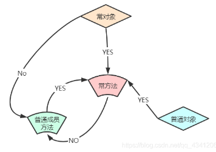

[← C++](Cpp.md)

# 库, 语法与特性

## 空指针

空指针指向特定范围的存储空间，这个空间永远不会与物理存储器有映射。

对空指针的delete不会报错。

>delete一个指针后，它不会指向空指针，而是指向非法空间，造成野指针错误。因此可以考虑delete一个指针后将其赋值为nullptr。

**nullptr是有类型的，且仅可以被隐式转化为指针类型。**

NULL可能会被定义为0，若有两个同名不同参的函数（重载），一个的参数类型为指针、另一个的参数类型为int，则传入NULL时可能执行参数类型为int的那一个函数。

## 数组类型

- `T[]`: 未知长度的数组, 往往退化为指针, 也可看做指针类型的语法糖. 模板中常见.
- `T[N]`: 已知长度的数组, 不同的长度是不同的类型.


## 命名空间

`using namespace xxx`表示使用xxx整个命名空间；而`using xxx::fx`表示使用xxx命名空间下的fx。

## 作用域解析运算符 `::`

通常用于命名空间.

`::f`表示使用全局作用域下的`f`(而不是当前局部内的). 这即使不在命名空间的情况下也生效(例如区分局部和全局变量).

## 输入输出操作器

把输出操作器使用`<<`传递给`cout`, 即可获得一个定制的输出器.
- `std::hexfloat`: 使浮点数以十六进制格式输出
- `std::hexfloat`: 使浮点数用默认十进制输出
- `std::boolalpha`: 把bool变量以`true`和`false`文本形式输出.


## 字面量

```cpp
#include <iostream>

int main() {
    double float_array[]{
		    0x1.7p+2, 0x1.f4p+9, 0x1.df3b64p-4
	    };
    for (auto elem : float_array) {
        std::cout 
        << std::hexfloat << elem << "=" 
        << std::defaultfloat << elem 
        << std::endl;
    }
}

// Output:
// 0x1.7p+2=5.75      
// 0x1.f4p+9=1000     
// 0x1.df3b64p-4=0.117
```

二进制使用`0b`前缀表示, 如`0b11010011`.

使用单引号作为**整数分隔符**(任意进制都能用):
```cpp
constexpr int x = 123'456;
static_assert(x == 0x1e'240);
static_assert(x == 036'11'00);
static_assert(x == 0b11'110'001'001'000'000);
```

使用`R"(...)"`来表示**原生字符串**`...`, 可以不用转义字符:
```cpp
// 缩进也会被考虑在内
char str[] = R"(abc/\&"%
	tt)";
// Value:
// abc/\&"%
//     tt

// 如果字符串里面有`)"`, 
// 则可以在开头结尾的`"`和 `(`或`)` 之间
// 插入任意标识符, 只有带上标识符的`)mark"`才会被识别成终点
char str[] = R"mark1(bbb)")mark1";
// Value:
// bbb)"
```

可以**自定义字面量**, 使得给其他字面量<u>加后缀</u>就能进行<u>数据处理</u>. 默认是在运行时调用处理函数; 想在编译期完成处理的话就要把处理函数标记为`constexpr`.

```cpp
long double operator"" _mm(long double x) {
    return x;
}

long double operator"" _cm(long double x) {
    return x * 10;
}

long double operator"" _m(long double x) {
    return x * 1000;
}

int main() {
    // height = 30.0
    auto height = 3.0_cm;
    // length = 1230.0
    auto length = 1.23_m;
}
```

## 常量相关
### const

被const修饰的东西为常量，必须初始化。类的常量成员使用初始化表来初始化。

>C语言中const被当做变量来编译，可以不初始化。c++中所有出现const常量名字的地方，都被常量的初始值替换了。

```cpp
//a本身不能被更改
const int a = 20;

//不能通过p间接修改其指向的内存，因为此时修饰着*p，表示解引用后的数据
const int *p;
int const *p;

//不能修改p本身，因为此时直接修饰p，为常指针
int* const p;

//p本身不能改，也不能通过p修改其指向的内存
const int *const p;

//函数返回值上的const都是为了防止出现左值、指针等导致外部对内部可修改
const int* func1();

//不能更改调用此方法的对象。此const可以看做是在修饰this
void Obj::func() const {...} 
```



### mutable

用于修饰成员变量, 来完全突破const的限制, 包括对象本身为const或使用它的函数为const.

```cpp
struct ST {
  int a;
  mutable int b;
};

const ST st={1,2};
st.a=11;//编译错误
st.b=22;//允许
```

### constexpr

表示一个东西**可以**在编译期完成求值. 不强制完成.

编译期就能完成计算的表达式可以使用constexpr, 使其在编译期被处理完.

使用`if constexpr (...)`使得当条件可以在编译期被计算时, 可以只编译符合条件的那部分代码块.

在函数<u>前面</u>加上`constexpr`可以定义常量表达式函数, 其值应当可以在编译期算出来. 也可以定义常量表达式构造函数, 使得对象可以在编译期被构造.

```cpp
constexpr int square(int x) {
	return x * x;
}
```

cpp14对常量表达式函数要求的放松:
- 函数体允许声明变量，除了没有初始化, `static`和`thread_local`变量
- 函数允许出现`if`和`switch`语句，不能使用`go`语句
- 函数允许所有的循环语句，包括`for`,`while`,`do-while`
- 函数可以修改生命周期和常量表达式相同的对象
- 函数的返回值可以声明为`void`
- `constexpr`修饰的成员函数不再具有`const`属性

cpp20对常量表达式要求的放松:
- 允许在constexpr中进行平凡的默认初始化
- 允许在constexprk函数中出现Try-catch
- 允许在constexpr中更改联合类型的有效成员
- 允许dynamic_cast和typeid出现在常量表达式中

在修饰变量的时候, `constexpr` 和 `const`是完全等价的.

### consteval

使用consteval声明立即函数, 保证编译期**必须**计算(constexpr只是"可以").

### constinit

使用constinit声明变量, 可以保证它是**通过常量来初始化**的(它本身不需要是常量). 

这可以用来保证static变量的初始化不依赖于其他static变量, 也就保证其于static变量的初始化顺序无关.

## volatile

用于修饰对象或访问路径，使 volatile 访问按实现规定成为可观察行为；不宜记成“每次必读物理内存”。常用于实现支持的 Memory Mapped IO 等场景。

**volatile 不提供原子性或线程间同步**。多线程共享变量应使用原子操作或锁；它也不是异步回调、中断共享数据的通用安全方案。

使用`volatile`修饰成员函数的话, 表示其对本对象的volatile情况的兼容. 就像const一样, 用于对volatile对象的操作, 也只能访问到volatile的成员函数.


## 函数修饰总结

### 函数名前

- `template`: 模板函数.
- `virtual`: 虚函数.
- `inline`: 内联.
- `static`: 对成员函数来说, 则表示静态成员函数, 不从属于具体对象; 对普通函数来说, 表示其作用域为当前文件.
- `extern`: 声明一个外部的函数.
- `explicit`: 构造函数专用, 防止隐式转换.
- `friend`: 友元函数, 使其能访问类内非公成员.
- `constexpr`: 表示编译期可计算.

### 函数名后

使用等号`=`来指定实现:
- `=0`: 虚函数专用, 表示纯虚函数.
- `=default`: 特殊成员函数专用, 表示使用默认实现.
- `=delete`: 特殊成员函数专用, 表示删除其默认实现.

- `const`: 表示函数不会修改对象, 但不包括`mutable`修饰的成员变量. 在自身内只能调用const成员方法.
- `volatile`: 表示使用此函数时对象状态随时会变. 在自身内只能调用volatile成员方法.
- `&`: 表示此成员函数只能被左值对象使用.
- `&&`: 表示此成员函数只能被右值对象使用.
- `override`: 表示此成员函数覆盖父类的对应虚函数, 如果没覆盖到就会报错.
- `final`: 表示此成员函数是最终实现, 子类不能再对此定义或覆盖.
- `noexcept`: 表示函数不会抛出异常.


## static

定义类静态成员的时候, 需要声明和定义分离, 但是在cpp17后, 可以加上inline或constexpr(后者自动蕴含了inline), 就无需分离.

```cpp
struct X1{
    static int n;
};
int X1::n;

struct X2 {
    inline static int n;
};

struct X3 {
    constexpr static int n = 1; // constexpr 必须初始化，并且它还有 const 属性
};
```

在函数或闭包内定义**静态局部变量**, 就可以让这些变量(被放在全局存储)仅仅在此上下文被使用, 每次调用函数都能访问此变量, 且永远不会被释放或重置. **它只会在第一次执行该函数时被初始化，而且这种初始化在 C++11 标准之后是线程安全的（magic static）**。因此, 使用magic static即可实现单例模式:
```cpp
// 这里的代码仅保证了“单例”功能是安全的，具体的访问控制应该另做。
class Singleton {
public:
    static Singleton& getInstance() {
        static Singleton instance;  // Magic Static
        return instance;
    }

private:
    Singleton() = default;
    ~Singleton() = default;

    // 禁止拷贝和赋值
    Singleton(const Singleton&) = delete;
    Singleton& operator=(const Singleton&) = delete;
};
```


## RVO & NRVO

记忆：在最终结果对象的存储位置直接构造，省掉中间对象。可以用“隐藏结果地址”帮助想象，但不是把返回值改写成对已存在对象的赋值。

### RVO 返回值优化（Return Value Optimization）

```cpp
T f() { return T(); }
T t = f();
```

C++17 起，这种同类型 prvalue 初始化直接构造结果对象，不需要中间的拷贝/移动；析构函数仍须可访问且未删除。不能推广成任何 return 都强制消除拷贝。

### NRVO 命名返回值优化（Named Return Value Optimization）

```cpp
Data process(int i) {
    Data data;
    data.mem_var = i;
    return data;
}
Data data = process(5); // 初始化：可配合 NRVO 直接构造
// data = process(5);   // 对已有对象赋值：仍需赋值操作
```

返回同类型的非 volatile 局部对象（不是函数参数）时允许 NRVO，但不保证实施。自定义析构函数并不禁止 NRVO；不要为了“移动”而把 `return data;` 写成 `return std::move(data);`，后者不符合 NRVO 条件。

[核对：copy elision](https://eel.is/c++draft/class.copy.elision)。

## ADL TODO

[实参依赖查找 - cppreference.com](https://zh.cppreference.com/w/cpp/language/adl)

## 基于范围的for循环

> 类似于java的增强型for循环.

要求目标是可迭代的, 具体来说:
- 该类型必须有一组和其类型相关的`begin`和`end`函数，它们可以是类型的成员函数也可以是独立函数。
- `begin`和`end`函数需要返回一组类似迭代器的对象，并且这组对象必须支持`operator*`, `operator!=`和`operator++`运算符函数。

cpp20中, 可以在这种for循环前加上初始化语句:
```cpp
T thing foo();
for (auto &x: thing.items()) {}

//C++20
for (T thing = foo(); auto &x: thing.items()) {}
```

## 带初始化语句的 if/switch

在判断语句的前面声明的变量的**生命周期会一直往下持续到整个if-else结束**, 因此`b1`在下面的`else if`语句块中也能使用.

```cpp
if(bool b1 = foo1(); b1) {
	...
} else if(bool b2 = foo2(); b2) {
	...
}
```

可以利用初始化语句进行加锁保护:
```cpp
if (std::lock_guard<std::mutex> lock(mx); shared_flag)
	shared_flag = false;
}
```

switch的相关语法和if完全一样.

## std::copy

```cpp
template<class InputIterator, class OutputIterator>
  OutputIterator copy (InputIterator first, InputIterator last, OutputIterator result)
{
  while (first!=last) {
    *result = *first;
    ++result; ++first;
  }
  return result;
}
```

指定源的起点、终点，和目标的起点，即可将`[first,last)`处的数据进行逐个复制。调用的是拷贝赋值运算符。

目标要有容纳这些被拷贝的数据项的空间。

目标不应在`[first,last)`当中。


## 后置返回值类型


[模板函数——后置返回值类型（trailing return type）\_模板函数返回\_HerofH\_的博客-CSDN博客](https://blog.csdn.net/qq_28114615/article/details/100553186)

```cpp
auto foo() -> int {...}
```

```cpp
template <class T>  
auto Get(std::string_view key) const -> const T *;
```

若要使用decltype推导返回值类型, 则需要使用函数参数，于是使用返回值后置使得函数参数先被声明然后才被使用。

### 省略返回值类型

可以不指定返回值, 只写个auto, 编译器会自动根据函数体推导.

```cpp
auto foo() {
	return 0;
}
```


## 智能指针
### unique_ptr转shared_ptr

```cpp
std::shared_ptr<T>(std::move(ptr))
```

### make_unique新建对象

泛型为目标类。参数会被传入类的构造函数作为参数。

```cpp
std::make_unique<TrieNodeWithValue<T>>(children_, value_)
```

## 结构化绑定

把一个tuple给拆开成多个变量, 原本需要使用`std::tie`来完成:
```cpp
int x = 0, y = 0;
std::tie(x, y) = return_multiple_values();
```

现在可以使用:
```cpp
auto [x, y] = return_multiple_values();
```

配合自动推导返回值类型的特性, 可以使其看起来像是能让函数返回多个变量:
```cpp
auto return_multiple_values() {
	return std::make_tuple(11, 7);
}

int main() {
	auto[x, y] = return_multiple_values();
}
```

总共有三种结构化绑定:
1. 绑定**原始数组**, 将从前往后的每一项提出来
2. 绑定**结构体与类**, 将<u>当前可访问</u>的非静态成员变量提出来
3. 绑定**元组**或**类元组**对象

> [!example] 类的结构化绑定不一定要public的例子
> 一个类的友元函数中对该类的对象进行结构化绑定时, 编译器会判断把private的变量也给提出来, 因为此时作用域内是可以访问private的.

