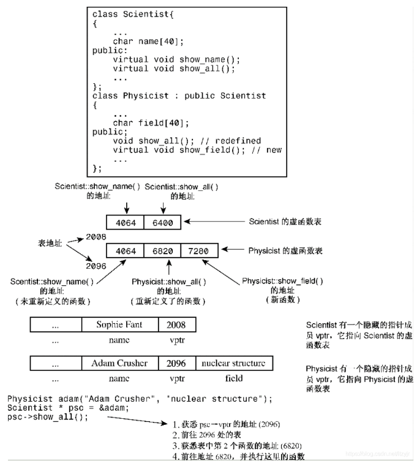

[← C++](Cpp.md)

# 规范与注意事项
## 类

成员首先按public, protected, private的顺序分块。

每一块中成员的顺序如下：

1. typedef，enum，struct，class 定义的嵌套类型
2. 常量
3. 构造函数
4. 析构函数
5. 成员函数,含静态成员函数
6. 数据成员,含静态数据成员

构造函数的初始化列表中的每个项，应独占一行。

类中不能存在不知道大小的成员。前向声明并不能提供某个类的大小，但可以取它的指针，因为指针的大小是固定的。

## STL

STL默认以vector为容器、以`operator<`为比较方式。

## 头文件

在第一行添加`#pragma once`(或者使用下面的`#ifndef`)可以防止头文件被重复包含. 这是为了解决在单个编译单元中重复展开出现的错误(类似重复声明), 但不能解决重复定义问题.
```cpp
#ifndef EXAMPLE_H
#define EXAMPLE_H
// 头文件内容...
#endif
```

# 面向对象

[第13章-cpp类继承\_cpp 继承\_itzyjr的博客-CSDN博客](https://blog.csdn.net/itzyjr/article/details/103424450)

## 三大特征

1. **封装（Encapsulation）**：封装隐藏对象的属性，并且外界只能通过对外提供的接口进行访问。
2. **继承（Inheritance）**：子类可以复用父类的成员和方法，并且可以在现有代码的基础上进行功能扩展。
3. **多态（Polymorphism）**：
	1. 编译时多态：同名函数有不同的参数列表，则能够在编译时识别出调用的是哪个函数。处理函数**重载**。
	2. 运行时多态：运行时，根据传入的对象的类型决定调用哪个类的某个函数。这个函数是虚函数，被子类重写，函数名、参数列表完全一样。处理函数**重写**。

> [!info]
> 查找虚表(运行时多态)相当于`(*(b->vfptr)[n])(b)`, 有两次内存访问.

### 表现多态的条件 / 无需查虚表的情况

下面这段代码, `b`是一个**值**, 那么在编译期就可以确定它的虚函数的确切实现, 于是编译器在编译期就进行了**确定的**函数绑定, 而**无需运行时**访问虚表.
```cpp
void fun(Base b) {
    b.virtualFun(); 
}
```

只有**指针或引用**可以表现出多态性, 如通过`b`指针访问虚函数的时候, 不得不通过查询虚表来完成正确的函数定位.
```cpp
void fun(Base *b) {
    b->virtualFun(); 
}
```

> [!info]
> 编译器优化力度很大, 如果能在运行期就推导出调用的虚函数应该是哪个, 就不再会去访问虚表了.

**限定名字查找**也限死了函数:
```cpp
void f(Base * p, Base & r)
{
    p->Base::virtualFun();
    r.Base::virtualFun();
}
```

如果`Base`类型的`virtualFun`被标上的`final`, 那么在它以下就不再表示多态性, 因为`b->virtualFun`必然指向`Base::virtualFun`.

> [!info]
> cpp20可以在new和delete和虚函数上使用constexpr, 因此一个constexpr操作流里面可以做这些面向对象的事情; 而此时编译器就能完全确定所有的虚函数实现, 因此该过程(如果确实被编译期计算的话)不会造成任何运行期开销.


## 访问控制

同一个类的两个不同对象是可以互相访问private成员的。因为访问级别是编译时概念而非运行时。对象a和b都为Class Cls，它们都能知道Cls下有私有成员x，则a里面就可以访问b.x。

对于外部来说，protected的行为与private相似；但对于派生类来说，protected的行为与public相似。

> [!info]
> private表示"如果外部对其进行访问, 则要报错", 而不是单纯的"找不到". 因此, 声明中private的东西也要和类的其他成员一起写, 在类被使用时出现在对应的上下文中.


## 向上兼容

可以用基类指针或引用指向派生类对象，如`Base *b = new Derived;`或`Derived d; Base &b = d;`。

注意，不能用`Base b = Derived();`，这会导致对象切割，本质还是在存Base。

若`Base *b = new Derived;`，则`*b`（对指针解引用）返回的是Base类型，似乎会发生对象切割。

可以把派生类指针赋值给基类指针。

[对象切割](#%E5%AF%B9%E8%B1%A1%E5%88%87%E5%89%B2%EF%BC%88object%20slicing%EF%BC%89)

## 调用基类构造函数

**派生类在构造时必须调用基类的构造函数**. 

如果基类有默认构造函数(参数值全有默认值的构造函数或无参构造函数), 那么子类的构造函数就会默认调用此函数, 这称为**隐式调用**.

其他情况下必须**显式调用**. 在<u>初始化列表</u>的**任意位置**调用基类构造函数即可:
```cpp
Student::Student(char *name, int age, float score): 
m_score(score), People(name, age){ }
```

**总是**会先调用基类构造函数再干其他所有事情(与其在初始化列表中的顺序无关).

> [!tip]
> 如果基类没有默认构造函数, 那么派生类就不得不每次都进行显式调用.

> [!info]
> 如果想直接使用父类构造函数的话, 可以使用[继承构造函数](%E7%B1%BB%E4%B8%8E%E5%AF%B9%E8%B1%A1.md#%E7%BB%A7%E6%89%BF%E6%9E%84%E9%80%A0%E5%87%BD%E6%95%B0).

## 重写 & virtual

虚函数可以被重写。被重写的虚函数自动成为虚函数，但一般最好手动加virtual。

使用了virtual之后程序将根据**对象类型**而不是引用或指针的类型来选择方法版本，或者说会挑选该方法的**可获取的最“后代”的**版本，即**动态联编**；否则直接根据**指针类型**去判断要调用哪个函数，即**静态联编**。

这是**运行时多态**。

```cpp
class Base {
public:
    void func() { cout << "Base::func\n"; }
    virtual void vfunc() { cout << "Base::vfunc\n"; }
};

class Derived : public Base {
public:
    void func() { cout << "Derived::func\n"; }
    void vfunc() override { cout << "Derived::vfunc\n"; }
};

Base* b = new Derived;
b->func();  // Outputs "Base::func" 由指针类型决定
b->vfunc(); // Outputs "Derived::vfunc" 由对象类型决定
```

### override & final

写在函数末尾, `override`声明当前函数为重写, 使编译器去检查这是否真的发生了重写. 而`final`声明当前虚函数不可被重写.

### 纯虚函数 & 抽象基类

```cpp
virtual T func(args) = 0;
```

当类声明中包含纯虚函数时，不能创建该类的对象。包含纯虚函数的类只用作基类。

包含纯虚函数的类成为**抽象基类（abstract base class，ABC）**。ABC的一个目的是实现接口约定。

`= 0`的作用仅仅是说明**可以在此类中不提供其实现**，但是依然是**可以进行实现**的。因此，一个拥有纯虚函数func的类作为一个不可实例化的基类，而其所有派生类的func代码完全一样时，不妨就在基类中实现它。

### 重写注意点

虚函数被重写时，会把**所有名字一样的**都给覆盖，即使参数列表和返回值不一样。若不一样，编译器可能发出警告，但不会编译失败。因此，如果基类有三个同名虚函数，则派生类最好要么都不重写，要么都重写。如下所示：

```cpp
class Dwelling {
public:
    // 三个重载的showperks()
    virtual void showperks(int a) const;
    virtual void showperks(double x) const;
    virtual void showperks() const;
    ...
};
class Hovel : public Dwelling {
public:
    // 三个重新定义的showperks()
    virtual void showperks(int a) const;
    virtual void showperks(double x) const;
    virtual void showperks() const;
    ...
};
```

允许在重写时仅对返回值进行修改：如果返回类型是基类引用或指针，则可以修改为指向派生类的引用或指针。这种特性被称为**返回类型协变（covariance of return type）**，因为允许返回类型随类类型的变化而变化。如下所示：
```cpp
class Dwelling {
public:
    // a base method
    virtual Dwelling &build(int n);
    ...
};
class Hovel : public Dwelling {
public:
    // 一个派生类方法，返回类型协变
    virtual Hovel &build(int n); // 相同的参数特征标
    ...
};
```

于是, 重写的时候, 两个函数仅可以有两点不同:
1. 返回值类型. 但新类型必须是子类型.
2. 参数名称.

### 具体函数

**析构函数**一般要设为虚函数，因为若类被继承，则新的成员变量很可能需要特殊的析构函数去管理；有虚析构函数后，任意派生类都会先执行最子类的析构函数，然后自动执行父类的析构函数。只有析构函数有全自动的调用基类的机制。

**构造函数**不设为虚函数，因为派生类不继承基类的构造函数，而是隐式调用默认构造函数或显式调用某个构造函数。

**友元**<u>不能</u>是虚函数，因为友元不是类成员，而**只有成员才能是虚函数**。

### 虚函数处理原理

给每个对象添加一个隐藏成员是一个指向函数地址数组的指针，且尽可能靠前。这种数组称为虚函数表（virtual function table，vtbl）。vtbl和类进行绑定，每个对象的指针隐藏指针都指向同一个vtbl。

虚函数表中存储了为类对象进行声明的虚函数的地址。例如，基类对象包含一个指针，该指针指向基类中所有虚函数的地址表。派生类对象将包含一个指向另一个属于自己的vtbl的指针。如果派生类提供了虚函数的新定义，该虚函数表将保存新函数的地址；如果派生类没有重新定义虚函数，该vtbl将保存函数原始版本的地址。如果派生类定义了新的虚函数，则该函数的地址也将被添加到vtbl中。

不管一个派生类被什么指针指着，那个指针都能访问到这个唯一的隐藏指针，也就定位到了基于对象真实类型的虚函数表。




## 重载

同名方法不同参数列表，即可根据参数在编译期自动选择哪个方法。

这是**编译时多态**。

先把所有同名函数作为候选者，然后匹配：
1. 精确匹配。
2. 通过默认参数能够匹配。
3. 通过默认类型转换能够匹配。

若出现二义性或者完全找不到，则报错。

```cpp
// Function overload #1
void display(int num) {
    std::cout << "Displaying int: " << num << std::endl;
}

// Function overload #2
void display(double num) {
    std::cout << "Displaying double: " << num << std::endl;
}

// Function overload #3
void display(char const *str) {
    std::cout << "Displaying string: " << str << std::endl;
}

int main() {
    display(5); // #1
    display(5.5); // #2
    display("Hello"); // #3

    return 0;
}
```

## 对象切割（object slicing）

把子类对象赋值给父类对象（形如`Father f = Son();`）时，会把子的多余成员变量给切割掉。

```cpp
class Father {
public:
    int a;
};

class Son : public Father {
public:
    int b;
};

int main() {
    Son s;
    s.a = 1;
    s.b = 2;

    Father f = s;
    // f now only has 'a', 'b' is sliced off
}
```

## 确定运行时对象的类

基类指针指向派生类对象时，我们有可能要根据派生类的真正类型来判断要调用什么方法，或想要调用派生类有而基类没有的方法。

### dynamic_cast

可以实现**指针安全转换**。`dynamic_cast<D*>(B)`在B能转成D时返回转换后的指针，否则返回nullptr。

转换前后的指针指向同一个对象。

```cpp
Base *bp = /* ... */;
Derived1 *d1 = dynamic_cast<Derived1*>(bp);
if (d1 != nullptr) {
    // bp points to an object of type Derived1
} else {
    Derived2 *d2 = dynamic_cast<Derived2*>(bp);
    if (d2 != nullptr) {
        // bp points to an object of type Derived2
    }
}
```

### 利用virtual性质

若`Base *b=new Derived1();`且Base中有virtual函数func、Derived1中重写了func，则`b->func()`会调用Derived1的函数。利用这个性质，可以在Derived::func中反馈“这个指针b指向的是Derived1类而不是Derived2或者Base”。

**单分派（single dispatch）、双分派（double dispatch）**：传入一个（两个）参数，根据参数的运行时类型确定该使用哪个方法处理它们。

双分派例子：父类Shape，有三个子类Circle、Square、Triangle。要求定义一个函数intersect(Shape* s1, Shape* s2)，使得输入两个子类对象之后，能判断两个对象是否属于同一个类。

#### 解法1

令Shape包含：

```cpp
virtual bool intersect_sec(Shape* const s) = 0;
virtual bool judgeIntersect(Circle& s) = 0;
virtual bool judgeIntersect(Square& s) = 0;
virtual bool judgeIntersect(Triangle& s) = 0;
```

子类将实现它们。每个judgeIntersect函数都在参数类型与自己类型一样时返回true，否则返回false。比如`Square::judgeIntersect(Square& s)`恒返回true，其他两个返回false。

intersect函数先调用`s1->intersect_sec(s2)`，这样就调用了s1内的intersect_sec，也就相当于知道了s1的类型。而每个子类里面的intersect_sec函数都是这样实现的：

```cpp
bool intersect_sec(Shape* const s){
	return s->judgeIntersect(*this);
}
```

`*this`将s1自己以确切的类型传给s2，使用s2的judgeIntersect很快就判断出是否是同类型了。

#### 解法2

先化为两个单分派问题，获取人为规定的类型标识，然后进行判断即可。

```cpp
enum ShapeType { CIRCLE, SQUARE, TRIANGLE };

class Shape {
public:
    virtual ~Shape() {}
    virtual ShapeType getType() const = 0; // Pure virtual function
};

class Circle : public Shape {
public:
    ShapeType getType() const override { return CIRCLE; }
};

class Square : public Shape {
public:
    ShapeType getType() const override { return SQUARE; }
};

class Triangle : public Shape {
public:
    ShapeType getType() const override { return TRIANGLE; }
};

bool intersect(const Shape* s1, const Shape* s2) {
    return s1->getType() == s2->getType();
}
```

## 继承访问控制

继承时可以指定访问等级，使得继承后基类成员的访问等级不得高于继承访问等级。

| 继承类型 \\ 存取模式 | public    | protected | private |
| ------------ | --------- | --------- | ------- |
| public       | public    | protected | private |
| protected    | protected | protected | private |
| private      | private   | private   | private |


## 调用基类函数/运算符

派生类中，如果想调用基类的函数，但这个函数在派生类中被重写了或正在重写中，则要显式地指定基类函数，如`Base::func()`。如果是运算符的话，则用函数表示法写出，如`Base::operator=(arg)`。

```cpp
hasDMA & hasDMA::operator=(const hasDMA & hs) {
    if (this == &hs) 
        return *this;
    baseDMA::operator=(hs); // 用[函数表示法]赋值基类部分，这样才不会形成递归调用！
    delete [] style; // 为新style作准备
    style = new char[std::strlen(hs.style) + 1];
    std::strcpy(style, hs.style);
    return *this;
}
```

## 类间互相依赖问题

#### 成员变量类型相互依赖

两个类的其中一个成员变量的类型为对方。编译时只能先编译其中一个类，此时它就不知道另一个类，导致编译失败。

使用前向声明可以解决一部分问题，因为声明是廉价的，声明之后就可以得知存在另一个类，即使不知道它有什么内容。

虽然一个类编译完成时，其大小是确定的；但是此时不知道另一个类的内容，也就不知道另一个类的大小，使得总大小不确定。将类型换成指针即可，因为指针虽然可以指向各种不同类型，但其本身的大小是固定的（如64bit）。

```cpp
class ClassB; // Forward declaration

class ClassA {
    private:
        ClassB* classBInstance; // Use pointer instead of object
};

class ClassB {
    private:
        ClassA* classAInstance; // Use pointer instead of object
};
```

#### 静态变量类型相互依赖

**警告：这个疑似没什么用**

两个类各有一个静态成员变量的类型为对方。由于static是必须立刻初始化的，因此我们无法做到真正初始化它们。

可以都初始化为nullptr，并在第一次访问时真正初始化。

```cpp
class ClassB; // Forward declaration

class ClassA {
    private:
        static ClassB* classBInstance;
    public:
        static ClassB* getClassBInstance();
};

class ClassB {
    private:
        static ClassA* classAInstance;
    public:
        static ClassA* getClassAInstance();
};

// Implementations
ClassB* ClassA::classBInstance = nullptr;
ClassA* ClassB::classAInstance = nullptr;

ClassB* ClassA::getClassBInstance() {
    if (classBInstance == nullptr) {
        classBInstance = new ClassB();
    }
    return classBInstance;
}

ClassA* ClassB::getClassAInstance() {
    if (classAInstance == nullptr) {
        classAInstance = new ClassA();
    }
    return classAInstance;
}
```


