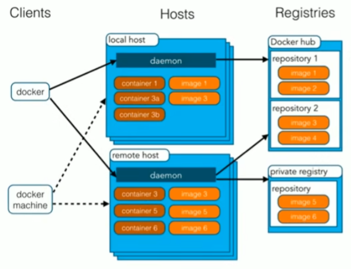
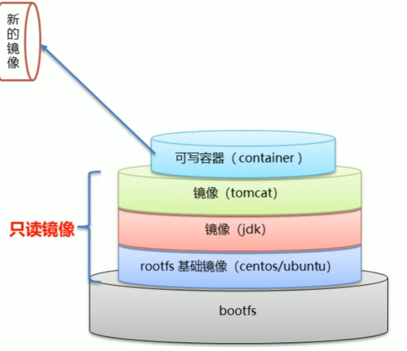
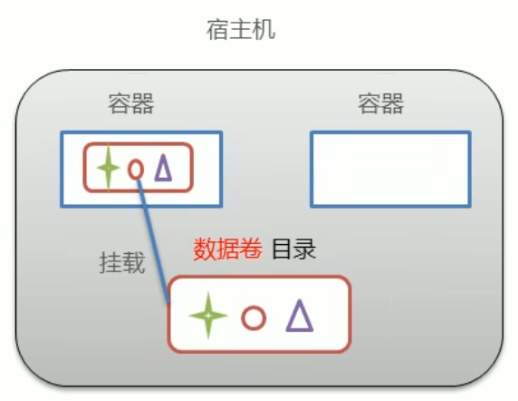
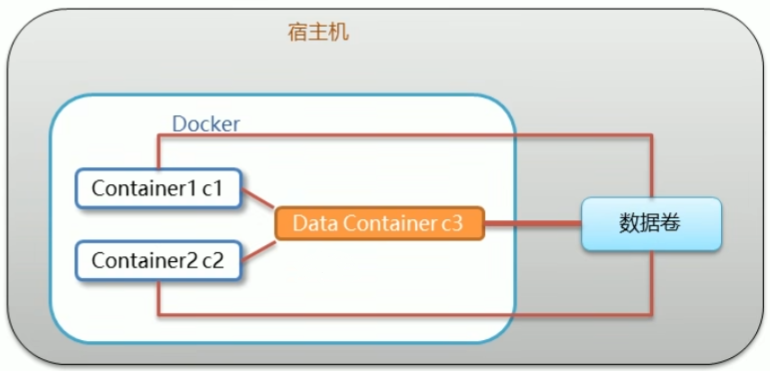

# Docker基础
## 基本结构
image（镜像）相当于“类”，container（容器）即为类实现的“对象”。仓库里存的都是镜像。

想搜索镜像信息可以去官网：[Docker](https://hub.docker.com/)


## 镜像原理

- Docker镜像是由特殊的文件系统叠加而成。
- 最底端是bootfs,并**使用宿主机的bootfs**（linux的各个发行版的bootfs基本相同，因此可直接利用。这也是为什么Docker依赖于Linux）。
- 第二层是root文件系统rootfs,称为base image。
- 然后再往上可以叠加其他的镜像文件。
- 统一文件系统(Union File System)技术能够将不同的层整合成一个文件系统，为这些层提供了一个统一的视角,这样就隐藏了多层的存在，在用户的角度看来，只存在一个文件系统（对外暴露最顶端）。
- 一个镜像可以放在另一个镜像的上面。位于下面的镜像称为父镜像，最底部的镜像成为基础镜像。
- 当从一个镜像启动容器时，Docker会在最顶层加载一个读写文件系统作为容器。

分层的目的是为了复用，一个镜像（或其组成部分）可以成为另一个镜像的依赖。


## 数据卷
### 概念
- 数据卷是宿主机中的一个目录或文件。
- 当容器目录和数据卷目录绑定后，对方的修改会立即同步。
- 一个数据卷可以被多个容器同时挂载。
- 一个容器也可以挂载多个数据卷。


### 作用
- 容器数据持久化
- 外部机器和容器间接通信
- 容器之间数据交换（挂载同一个数据卷）
### 数据卷操作
使用`docker inspect xx`显示xx容器的细节，在HostConfig里面的Binds可以看到数据卷关系，Mounts里也有。当然也有更专门的数据卷操作命令。

数据卷是不会自动回收的，要在删除容器时附加`-v`参数来删除相关的数据卷，或者也可以使用`docker volume prune`删除无主的数据卷。
### 数据卷容器
c3作为c1和c2的数据卷容器，会把自己的所有数据卷设置都传给c1和c2，也因此即使c3关掉了也不会影响c1和c2。



### 端口映射
外部机器访问宿主机，宿主机将对应端口映射到容器中，从而可以实现外部机器与容器的通信。
## 命令
命令查询：[Docker 备忘清单 & docker cheatsheet & Quick Reference](http://bbs.laoleng.vip/reference/docs/docker.html)
### 服务相关命令
使用`systemctl`对docker本身的服务进行设置：
- 启动docker服务：`systemctl start docker`
- 停止docker服务：`systemctl stop docker`
- 重启docker服务：`systemctl restart docker`
- 查看docker服务状态：`systemctl status docker`
- 设置开机启动docker服务：`systemctl enable docker`
### 版本指定
`ImageName:3.1`可以指定使用3.1版本的ImageName（无论是下载还是运行）。

实际上就是指定TAG。
### Docker Run 参数
#### 启动方式相关
`-i`表示进入交互模式，也即打开输入流。即使没有客户机也不会停止运行。一般和`-t`一起使用。

`-t`为容器分配一个“伪输入终端”。`-it`即是生成伪输入终端并开放输入流，从而可以让我们对容器进行输入。

`-d`为后台运行（守护模式），需使用`docker exec -it xxx /bin/bash`进入容器，在使用`exit`退出容器后不会关闭容器。若加上`-i`可解决连接波动的问题。

`-it`：交互式容器。`-id`：守护式容器。
#### 其他
- `-v 宿主机目录:容器内目录`：设定数据卷。必须是绝对路径。若目录不存在则会自动创建。可以缺省宿主机目录与冒号，此时会自动指定宿主机的一个文件夹（在`/var/lib/docker`里面）参与数据卷。

- `--volumes-from xx`：令xx成为当前容器的数据卷容器。
## 容器转镜像
```bash
#容器变成镜像
docker commit 容器id 镜像名称：版本号

#镜像生成压缩包（否则无法分享）
docker save -o 压缩文件名称 镜像名称：版本号

#压缩包生成镜像
docker load -i 压缩文件名称
```

## 具体部署
### 问题
数据卷的宿主机路径都使用了`$PSW`，因此创建容器前一定要注意终端当前目录是什么！

ping得通但连接不到时首先考虑端口开没开：


也可能是路由没开放导致Docker无法接触外网：


### MySQL
#### 创建
以当前目录为数据卷创建mysql：

```bash
docker run -id \
--name mysql \
-p 3306:3306 \
-v $PWD/conf:/etc/mysql/conf.d \
-v $PWD/logs:/logs \
-v $PWD/data:/var/1ib/mysql \
-e MYSQL_ROOT_PASSWORD=1234 \
mysql:8.0.30
```

#### 问题
一些权限设置：

```sql
#给予所有主机通过root访问数据库的权限
GRANT ALL PRIVILEGES ON *.* TO 'root'@'%' WITH GRANT OPTION;

#刷新使设置生效
FLUSH PRIVILEGES;

#查表可以看到权限变化（也可以通过改表完成权限设置）
SELECT user,host FROM mysql.user;
```

外部机连接时可能出现`Public Key Retrieval is not allowed`错误，可这样解决：[MySQL 8.0的Public Key Retrival错误，毫无规律可言怎么破？ - 知乎](https://zhuanlan.zhihu.com/p/371161553)

### Tomcat
以当前目录为webapp创建Tomcat:

```bash
docker run -id \
--name tomcat \
-p 8080:8080 \
-v $PWD:/usr/local/tomcat/webapps \
tomcat
```

这样只要给当前目录里面放入web项目即可被访问。

### Nginx
提前准备好配置文件`$PWD/conf/nginx.conf`：

```conf
user nginx;
worker_processes 1;

error_log /var/log/nginx/error.log warn;
pid /var/run/ndinx.pid;

events{
	worker_connections 1024;
}

http{
	include /etc/nginx/mime.types;
	default_type application/octet-stream;
	
	log_format main '$remote_addr - $remote_user [$time_local] "$request"'
					'$status $body_bytes_sent "$http_referer"'
					'"$http_user_agent" "$http_x_forwarded_for"';
					
	access_log /var/log/nginx/access.log main;

	sendfile on;
	#tcp_nopush on;
	
	keepalive_timeout 65;
	
	#gzip on;
	
	include /etc/nginx/conf.d/*.conf;
}
```

创建容器：

```bash
docker run -id \
--name nginx \
-p 80:80 \
-v $PWD/conf/nginx.conf:/etc/nginx/nginx.conf \
-v $PWD/logs:/var/log/nginx \
-v $PWD/html:/usr/share/nginx/html \
nginx:1.22
```

### Redis
无需配置数据卷，直接创建容器：

```bash
docker run -id \
--name redis \
-p 6379:6379 \
redis:7.0
```

# DockerFile


