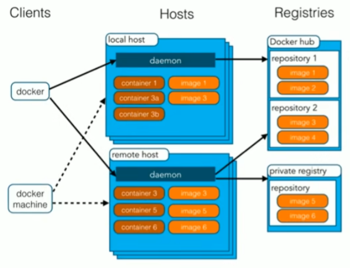
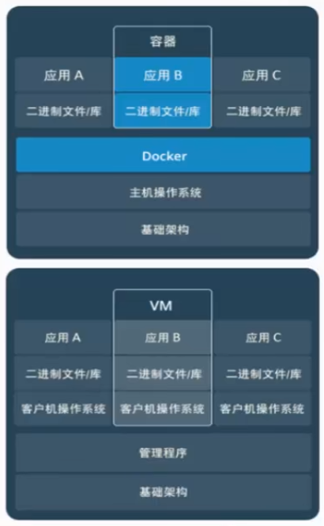
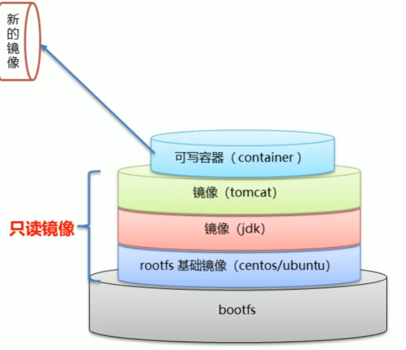
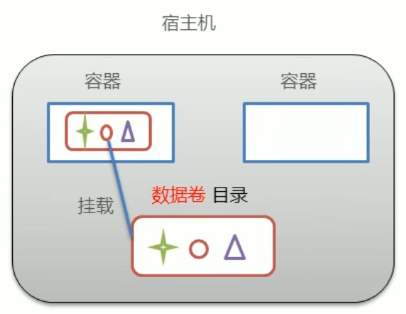
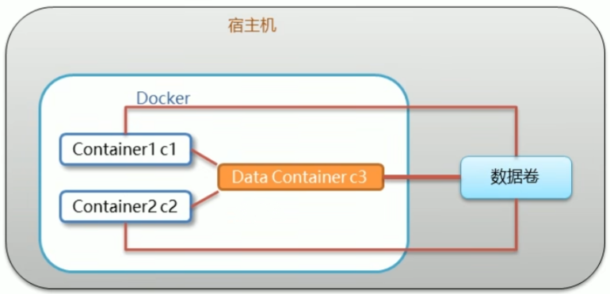

# 安装

[Install Docker Engine on Ubuntu | Docker Docs](https://docs.docker.com/engine/install/ubuntu/)

[docker去掉sudo权限方法\_解除docker sudo权限-CSDN博客](https://blog.csdn.net/jason_src/article/details/87862124)

# Docker基础

>Docker 基于容器这个更为概括的概念。关于容器和虚拟机之间最大的不同是，虚拟机会执行整个的 OS 栈，包括内核（即使这个内核和主机内核相同）。与虚拟机不同，容器避免运行其他内核实例，而是与主机分享内核。在Linux环境中，有LXC机制来实现，并且这能使一系列分离的主机像是在使用自己的硬件启动程序，而实际上是共享主机的硬件和内核。因此容器的开销小于完整的虚拟机。
 另一方面，容器的隔离性较弱而且只有在主机运行相同的内核时才能正常工作。例如，如果你在macOS 上运行 Docker，Docker 需要启动 Linux虚拟机去获取初始的 Linux内核，这样的开销仍然很大。最后，Docker 是容器的特定实现，它是为软件部署而定制的。基于这些，它有一些奇怪之处：例如，默认情况下，Docker 容器在重启之间不会有以任何形式的存储。
## 基本结构
image（镜像）相当于“类”，container（容器）即为类实现的“对象”。仓库里存的都是镜像。

想搜索镜像信息可以去官网：[Docker](https://hub.docker.com/)



容器**虚拟化操作系统**，虚拟机虚拟化硬件。


## 镜像原理

- Docker镜像是由特殊的文件系统叠加而成。
- 最底端是bootfs,并**使用宿主机的bootfs**（linux的各个发行版的bootfs基本相同，因此可直接利用。这也是为什么Docker依赖于Linux）。
- 第二层是root文件系统rootfs,称为base image。
- 然后再往上可以叠加其他的镜像文件。
- 统一文件系统(Union File System)技术能够将不同的层整合成一个文件系统，为这些层提供了一个统一的视角,这样就隐藏了多层的存在，在用户的角度看来，只存在一个文件系统（对外暴露最顶端）。
- 一个镜像可以放在另一个镜像的上面。位于下面的镜像称为父镜像，最底部的镜像成为基础镜像。
- 当从一个镜像启动容器时，**Docker会在最顶层加载一个读写文件系统作为容器**。

分层的目的是为了复用，一个镜像（或其组成部分）可以成为另一个镜像的依赖。


## 数据卷
### 概念
- 数据卷是宿主机中的一个目录或文件。
- 当容器目录和数据卷目录绑定后，对方的修改会立即同步。
- 一个数据卷可以被多个容器同时挂载。
- 一个容器也可以挂载多个数据卷。


### 作用
- 容器数据持久化
- 外部机器和容器间接通信
- 容器之间数据交换（挂载同一个数据卷）
### 数据卷操作
使用`docker inspect xx`显示xx容器的细节，在HostConfig里面的Binds可以看到数据卷关系，Mounts里也有。当然也有更专门的数据卷操作命令。

数据卷是不会自动回收的，要在删除容器时附加`-v`参数来删除相关的数据卷，或者也可以使用`docker volume prune`删除无主的数据卷。
### 数据卷容器
c3作为c1和c2的数据卷容器，会把自己的所有数据卷设置都传给c1和c2，也因此即使c3关掉了也不会影响c1和c2。



### 端口映射
外部机器访问宿主机，宿主机将对应端口映射到容器中，从而可以实现外部机器与容器的通信。
## 命令
命令查询：[Docker 备忘清单 & docker cheatsheet & Quick Reference](http://bbs.laoleng.vip/reference/docs/docker.html)
### 服务相关命令
使用`systemctl`对docker本身的服务进行设置：
- 启动docker服务：`systemctl start docker`
- 停止docker服务：`systemctl stop docker`
- 重启docker服务：`systemctl restart docker`
- 查看docker服务状态：`systemctl status docker`
- 设置开机启动docker服务：`systemctl enable docker`
### 版本指定
`ImageName:3.1`可以指定使用3.1版本的ImageName（无论是下载还是运行）。

实际上就是指定TAG。
### Docker Run 参数
#### 启动方式相关
`-i`表示进入交互模式，也即打开输入流。即使没有客户机也不会停止运行。一般和`-t`一起使用。

`-t`为容器分配一个“伪输入终端”。`-it`即是生成伪输入终端并开放输入流，从而可以让我们对容器进行输入。

`-d`为后台运行（守护模式），需使用
```bash
docker exec -it xxx /bin/bash
```
进入容器，在使用`exit`退出容器后不会关闭容器。若加上`-i`可解决连接波动的问题。

`-it`：交互式容器。`-id`：守护式容器。

#### 日志查看

`docker logs -f ipfs_host`: 追踪查看日志。

#### 其他
- `-v 宿主机目录:容器内目录`：设定数据卷。必须是绝对路径。若目录不存在则会自动创建。可以缺省宿主机目录与冒号，此时会自动指定宿主机的一个文件夹（在`/var/lib/docker`里面）参与数据卷。
- `--volumes-from xx`：令xx成为当前容器的数据卷容器。
- `-p`：端口映射。宿主机帮助转发。
- `--net=host`：直接使用宿主机的对应端口（相当于运行在宿主机上）。并使`-p`失效。
### 开机自动启动
```bash
sudo docker update ContainerName --restart always
```

### 查看实时性能消耗

```sh
docker stats
```
## 容器转镜像
```bash
#容器变成镜像
docker commit 容器id 镜像名称：版本号

#镜像生成压缩包（否则无法分享）
docker save -o 压缩文件名称 镜像名称：版本号

#压缩包生成镜像
docker load -i 压缩文件名称
```

# Docker Desktop

其实就是装了一个专门用于docker的wsl2虚拟机，然后提供好看的客户端界面。

[使用软链接的方式把Docker Desktop数据迁移到其他盘](https://blog.csdn.net/qq_45602658/article/details/129416841)

[换源](https://blog.csdn.net/sunyuhua_keyboard/article/details/131256771)

安装之后，windows的cmd也能直接用docker命令了。但是，在wsl里面运行docker带执行的命令的时候，会报错：
```shell
ayana@DESKTOP-2LR3H8Q:/mnt/c/Users/DeathWind$ docker run hello-world
docker: Cannot connect to the Docker daemon at unix:///var/run/docker.sock. Is the docker daemon running?
```
这就需要在Docker Desktop里面打开这个选项：


# DockerFile

使用一系列命令来构建一个Docker Image。

备忘查询：[Dockerfile 备忘清单 & dockerfile cheatsheet & Quick Reference](http://bbs.laoleng.vip/reference/docs/dockerfile.html)

## 基础

RUN是在构件时运行的命令，而CMD是其被运行时会执行的命令。CMD一般用来启动项目。

[Dockerfile中执行命令的几种方式 - 知乎](https://zhuanlan.zhihu.com/p/684444339)

尽量压缩多个命令一起执行以减少Image层数。

```dockerfile
RUN apt-get update && \
    apt-get upgrade -y && \
    apt-get install -y software-properties-common && \
    add-apt-repository ppa:deadsnakes/ppa && \
    apt-get install -y python3.6 && \
    apt-get clean
```

每一层都会被缓存。因此，若一层前面的状态都不变，就不会重新跑。这样可以用来避免一些长时间的操作，如下载依赖。

## multi-stage build

[_multi-stage_ build](https://docs.docker.com/develop/develop-images/multistage-build/)

Dockerfile可以有多个FROM，最后一个FROM产生真正的Image，前面的FROM只是过程。

可以使用一个dockerfile来编译，另一个来进行实际运行。这样编译的依赖就不会影响到运行了。

```dockerfile
FROM rust:latest as builder  
ARG APP_NAME  
WORKDIR /usr/src/${APP_NAME}  
COPY . .  
RUN cd ./crates/${APP_NAME} && \  
    cargo build --release  
  
FROM debian:buster-slim  
ARG APP_NAME  
COPY --from=builder /usr/src/${APP_NAME}/target/release/${APP_NAME} /usr/local/bin/${APP_NAME}  
CMD ["sh", "-c", "/usr/local/bin/$APP_NAME"]
```

## 部署SpringBoot项目
dockerfile写法如下：

```txt
#定义父镜像
FROM java:8

#定义作者信息
MAINTAINER ayana

#将jar包添加到容器（app.jar是容器内的jar包名）
ADD springboot_name.jar app.jar

#定义容器启动执行的命令
CMD java -jar app.jar
```

```bash
#通过dockerfile构建镜像（不加版本就是latest，写成`镜像名称 .`）
docker bulid -f dockerfile文件路径 -t 镜像名你:版本
```

# Docker Compose

> 新版的docker中，compose是docker的一个组成部分，因此使用`docker compose`而非`docker-compose`。

Docker Compose是一个编排多容器分布式部署的工具，提供命令集管理容器化应用的完整开发周期，包括服务构建，启动和停止。即使对于单个镜像，也能当成配置文件使用。使用步骤：
1. 利用Dockerfile定义运行环境镜像
2. 使用docker-compose,yml定义组成应用的各服务
3. 运行docker-compose up启动应用

`docker-compose.yml`:

```yml
version: '3'
services:
 nginx:
  image: nginx
  ports:
   - 80:80
  links:
   - app
  volumes:
   - ./nginx/conf.d:/etc/nginx/conf.d
 app:
  image: springboot_hello
  expose:
   - "8080"
```

在yml所在目录输入如下命令即可管理容器：

```bash
#启动
docker-compose -f standalone-derby.yaml up
#关闭
docker-compose -f standalone-derby.yaml stop
#移除
docker-compose -f standalone-derby.yaml rm
#关闭并移除
docker-compose -f standalone-derby.yaml down
```

开机自启动：
```bash
restart: always
```

## 容器间通信

由于docker重启就会改变IP，因此docker compose使用dns进行容器间通信。通常将服务名作为environment参数传给其他容器，这样其他容器就能以dns的形式访问服务了。
# 其他问题

## 高硬盘占用

无用的image以及多次构建产生的Build cache会占用很多的存储空间。

可以使用下面的命令查看硬盘占用情况，加上`-v`可以看更多细节：
```sh
docker system df
```

使用下面的命令来进行尽可能的清理：
```sh
docker system prune -a
```

[如何删除所有 Docker 镜像——Docker 清理指南](https://www.freecodecamp.org/chinese/news/how-to-remove-all-docker-images-a-docker-cleanup-guide/)
# 具体部署
## 问题
数据卷的宿主机路径都使用了`$PSW`，因此创建容器前一定要注意终端当前目录是什么！

ping得通但连接不到时首先考虑端口开没开：


也可能是路由没开放导致Docker无法接触外网：


## MySQL
### 创建
以当前目录为数据卷创建mysql：

```bash
docker run -id \
--name mysql \
-p 3306:3306 \
-v $PWD/conf:/etc/mysql/conf.d \
-v $PWD/logs:/logs \
-v $PWD/data:/var/1ib/mysql \
-e MYSQL_ROOT_PASSWORD=1234 \
mysql:8.0.30
```

### 问题
一些权限设置：

```sql
#给予所有主机通过root访问数据库的权限
GRANT ALL PRIVILEGES ON *.* TO 'root'@'%' WITH GRANT OPTION;

#刷新使设置生效
FLUSH PRIVILEGES;

#查表可以看到权限变化（也可以通过改表完成权限设置）
SELECT user,host FROM mysql.user;
```

外部机连接时可能出现`Public Key Retrieval is not allowed`错误，可这样解决：[MySQL 8.0的Public Key Retrival错误，毫无规律可言怎么破？ - 知乎](https://zhuanlan.zhihu.com/p/371161553)

## Tomcat
以当前目录为webapp创建Tomcat:

```bash
docker run -id \
--name tomcat \
-p 8080:8080 \
-v $PWD:/usr/local/tomcat/webapps \
tomcat
```

这样只要给当前目录里面放入web项目即可被访问。

## Nginx
提前准备好配置文件`$PWD/conf/nginx.conf`：

```conf
user nginx;
worker_processes 1;

error_log /var/log/nginx/error.log warn;
pid /var/run/ndinx.pid;

events{
	worker_connections 1024;
}

http{
	include /etc/nginx/mime.types;
	default_type application/octet-stream;
	
	log_format main '$remote_addr - $remote_user [$time_local] "$request"'
					'$status $body_bytes_sent "$http_referer"'
					'"$http_user_agent" "$http_x_forwarded_for"';
					
	access_log /var/log/nginx/access.log main;

	sendfile on;
	#tcp_nopush on;
	
	keepalive_timeout 65;
	
	#gzip on;
	
	include /etc/nginx/conf.d/*.conf;
}
```

创建容器：

```bash
docker run -id \
--name nginx \
-p 80:80 \
-v $PWD/conf/nginx.conf:/etc/nginx/nginx.conf \
-v $PWD/logs:/var/log/nginx \
-v $PWD/html:/usr/share/nginx/html \
nginx:1.22
```

## Redis
`redis-server /etc/redis/redis.conf`就是以配置文件创建容器。

```bash
docker run -id \
--name redis \
-p 6379:6379 \
-v $PWD/data:/data \
-v $PWD/conf/redis.conf:/etc/redis/redis.conf \
redis:7.0 \
redis-server /etc/redis/redis.conf
```

## Nacos
准备配置文件`$PWD/init.d/custom.properties`（未知作用）：

```properties
management.endpoints.web.exposure.include=*
```

从容器中的`/conf`中复制`application.properties`并放到`$PWD/conf/application.properties`，然后修改以设置数据库，从而可以持久化数据：

```properties
spring.datasource.platform=mysql
spring.sql.init.platform=mysql
nacos.cmdb.dumpTaskInterval=3600
nacos.cmdb.eventTaskInterval=10
nacos.cmdb.labelTaskInterval=300
nacos.cmdb.loadDataAtStart=false
db.num=${MYSQL_DATABASE_NUM:1}
db.url.0=jdbc:mysql://192.168.177.114:3306/nacos_config?MYSQL_SERVICE_DB_PARAM:characterEncoding=utf8&connectTimeout=1000&socketTimeout=3000&autoReconnect=true&useSSL=false&allowPublicKeyRetrieval=true
db.user.0=root
db.password.0=1234
```

从容器中的`/conf`复制sql，创建`nacos_config`数据库。

注意事项：
- 必须要开三个端口映射或者用`--net=host`否则微服务无法正常访问。
- 只有使用了`--net=host`才能在`application.properties`里将sql的url设为localhost。
- 配置文件里面要设置一下allowPublicKeyRetrieval=true否则无法找到数据库。
- mysql可能要设置时区，暂未知是否必要。

```bash
docker run -id \
--name nacos \
--net host \
-e JVM_XMS=256m \
-e JVM_XMX=256m \
-e MODE=standalone \
-e PREFER_HOST_MODE=hostname \
-v $PWD/init.d/custom.properties:/home/nacos/init.d/custom.properties \
-v $PWD/logs:/home/nacos/logs \
-v $PWD/conf/application.properties:/home/nacos/conf/application.properties \
--privileged=true \
--restart always \
nacos/nacos-server

##-p 8848:8848 \
##-p 9848:9848 \
##-p 9849:9849 \
```

更推荐使用Docker Compose创建该容器，这样就不需要修改`application.properties`了。


