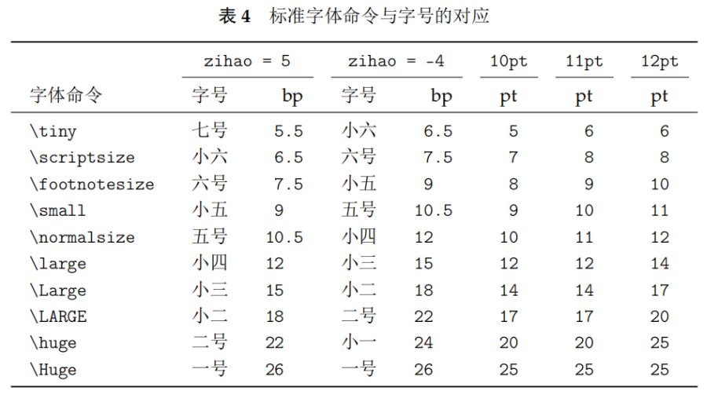
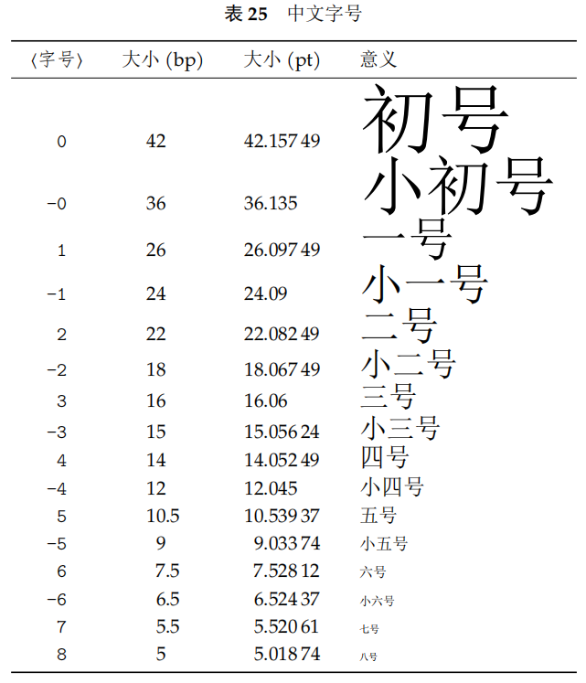

# 模板

```latex
\documentclass[11pt]{paper}

\usepackage{ctex}
\usepackage[colorlinks,linkcolor=black,anchorcolor=black,citecolor=black]{hyperref}
\usepackage{setspace}

\title{xxx}
\author{aaa}
\date{2023/5/11}
  
\begin{document}
%下方居中显示页码
\pagestyle{plain}
  
\begin{titlepage}
    \begin{center}%开始插题目
        \vspace{4mm}  %插入间距
        \begin{spacing}{2}%行距2
            Lab Report of "Fourier Analysis and Synthesis of Waveforms" experiment
        \end{spacing}
        \vspace{4mm}  %插入间距
        \large{       %调大以下内容的字号
            \begin{tabular}{ll} %用表格的方式插入学生信息
                \textbf{Name:}           & Fisher' C        \\
                \textbf{Student number:} & 666666           \\
                \textbf{College email:}  & kekeke@gmail.com \\
            \end{tabular}
        }
    \end{center}
\end{titlepage}
  
\newpage
\pagenumbering{roman}
  
\vspace{10mm}
\setcounter{tocdepth}{2}%只显示到2级标题
\tableofcontents
  
\newpage
\pagenumbering{arabic}
  
\section{Objective}
\heiti
你好

\end{document}
```

# 基本语法

## HelloWorld

```latex
\documentclass{article}

\usepackage{ctex}

\begin{document}
 你好
\end{document}
```

## 基本结构

```latex
%导言区
\documentclass{article}

\author{abc}
\date{2023/5/11}

%正文区（文稿区）
\begin{document}
\maketitle
hello
\end{document}
```

`$ xxxx $`内的是数学模式，外部是文本模式。

`$ xxxx $`为行内公式，`$$ xxxx $$`为行间公式（会另起一行）。

## 定义新命令

在导言区使用`\newcommand\xxx{abc}`即可定义新命令`\xxx`。类似于函数，比如可以封装字体。

## 带编号的行间公式

```latex
\begin{equation}
xxxxxxxxxxx
\end{equation}
```

## 变量

```latex
\setlength{\baselineskip}{20pt}
```

## 隐藏标号

在标题标签后加上`*`可以隐藏标题序号（前缀），公式也能用它隐藏标号。

## 中文加粗

使用`AutoFakeBold`让当前字体在遇到`\textbf`的时候像word里面一样变粗（而不是换字体）。

```tex
\setCJKmainfont[AutoFakeBold=true]{SimSun}
```

## 设置固定行间距

```latex
\setlength{\baselineskip}{20pt}
```

## 字体

```latex
%在紧跟的括号里设置字体族
\textrm{Roman Family}
\textsf{Sans Serif Family}
\texttt{Typewriter Family}

%在接下来的作用域内设置字体族
{\rmfamily Roman Family}
{\sffamily Sans Serif Family}
{\ttfamily Typewriter Family}
```

```latex
%中文的粗体就是黑体，斜体就是楷书。
\emph{强调}
\textbf{粗体}
\textit{斜体}
\underline{下划线}
```





# Beamer

示例：

```tex
\documentclass{beamer}

\usepackage{ctex}
\usepackage{fontspec}
\usepackage{graphicx}
\usepackage{tikz}

\graphicspath{
    {./assets}
}

% 字体
\setCJKsansfont[AutoFakeBold=true]{SimHei}
\setsansfont{Arial}

% beamer
\setbeamerfont{title}{size=\huge}
\setbeamerfont{institute}{size=\normalsize}

\usecolortheme{rose}
\usecolortheme{seahorse}

\setbeamertemplate{navigation symbols}{} % 禁用导航栏
\setbeamertemplate{title page}[default][rounded=true,shadow=true]
\setbeamertemplate{blocks}[rounded][shadow=true]
\setbeamertemplate{itemize items}[circle]

% metadata
\title{智慧西安总体描述}
\author{陈禹译}
\institute{学号: SY2406326}
\date{}

\begin{document}

\begin{frame}[plain]
    \begin{center}
        \vspace{1.5cm}
        {\textbf{\usebeamerfont{title} \Huge \inserttitle}} \\[1.2cm]
        {\normalsize \insertauthor} \\[0.5cm]
        {\normalsize \insertinstitute}
    \end{center}
\end{frame}

\begin{frame}{概述}

    在 Urban20（G20城市参与小组）组织、世界城地组织亚太区主办的“促进城市间合作，加快应对气候变化、疫情和经济复苏”主题峰会上，西安市应邀在这一世界舞台上分享了智慧城市建设经验。智慧西安建设的一个主要方向是数据资源和生产要素建设。而依托新型基础测绘开展城市\textbf{实景三维建设}，是智慧西安建设的基础。

    \vspace{0.4cm}

    \begin{block}{\textbf{智慧西安}为各方面提供了\textbf{智慧化建设}的“数字空间底座”}

        \vspace{-0.25cm} % 减少奇怪的上方空白
        \begin{columns}[c]
            \column{0.5\textwidth}
            \begin{itemize}
                \item 西安城市治理
                \item 环境保护
                \item 规划建设
            \end{itemize}

            \column{0.5\textwidth}
            \begin{itemize}
                \item 交通运行
                \item 安全生产
                \item 文化旅游
            \end{itemize}
        \end{columns}
    \end{block}

\end{frame}

\begin{frame}{实景三维西安}

    2019年1月，随着《中共西安市委关于加快推进新型智慧城市建设的决定》发布，西安新型智慧城市建设进入加速期。2020年11月,自然资源部批准西安成为我国\textbf{新型基础测绘建设试点城市}后，西安市政府在前期研究的基础上划定了150平方公里的试验区，并组织力量迅速编制完成《实景三维西安—国家新型基础测绘建设西安试点实施方案》。

    \begin{center}
        \includegraphics[scale=0.3]{实景3D}
    \end{center}

\end{frame}

\begin{frame}{成果体系：1+1+1+3+6}

    \begin{columns}[c]

        \column{0.5\textwidth}
        \begin{block}{一个新型基础测绘数据库}
            \begin{itemize}
                \item 实景三维西安，包括地物实体、地理单元、地理网格、地理场景以及属性信息等数据
            \end{itemize}
        \end{block}

        \begin{block}{一个实景三维西安服务平台}
            \begin{itemize}
                \item 多方向采集数据，能在线或离线提供数据、接口、功能和知识服务
            \end{itemize}
        \end{block}

        \begin{block}{一套政策标准体系}
            \begin{itemize}
                \item 为相关行业制定若干规范
            \end{itemize}
        \end{block}

        \column{0.5\textwidth}
        \begin{block}{三个示范应用}
            \begin{itemize}
                \item 基于实景三维的自然资源“地理底座”服务系统
                \item 基于实景三维的城市公共服务资源管理系统
                \item 基于实景三维的社区信息管理系统
            \end{itemize}
        \end{block}

        \begin{block}{六类知识服务研究}
            \begin{itemize}
                \item 通过数据挖掘，相关部门可结合西安城市管理和发展中的痛点和难点开展各项知识服务
            \end{itemize}
        \end{block}
    \end{columns}

\end{frame}

\begin{frame}{技术层次结构}

    \begin{center}
        \hspace{-0.8cm}
        \includegraphics[scale=0.8]{技术架构图.pdf}
    \end{center}

\end{frame}

\end{document}
```

# 杂记

## 查看宏包文档

```bash
texdoc xxx
```

而`texdoc lshort-zh`可以查看中文教程文档。


# 配置

## vscode配置
设置的json添加：
```json
"latex-workshop.latex.autoBuild.run": "never",
"latex-workshop.showContextMenu": true,
"latex-workshop.intellisense.package.enabled": true,
"latex-workshop.message.error.show": true,
"latex-workshop.message.warning.show": true,
"latex-workshop.latex.tools": [
  {
	  "name": "xelatex",
	  "command": "xelatex",
	  "args": [
		  "-synctex=1",
		  "-interaction=nonstopmode",
		  "-file-line-error",
		  "%DOCFILE%"
	  ]
  },
  {
	  "name": "pdflatex",
	  "command": "pdflatex",
	  "args": [
		  "-synctex=1",
		  "-interaction=nonstopmode",
		  "-file-line-error",
		  "%DOCFILE%"
	  ]
  },
  {
	  "name": "latexmk",
	  "command": "latexmk",
	  "args": [
		  "-synctex=1",
		  "-interaction=nonstopmode",
		  "-file-line-error",
		  "-pdf",
		  "-outdir=%OUTDIR%",
		  "%DOCFILE%"
	  ]
  },
  {
	  "name": "bibtex",
	  "command": "bibtex",
	  "args": [
		  "%DOCFILE%"
	  ]
  },
  {
	"name": "biber",
	"command": "biber",
	"args": [
	  "%DOCFILE%"
	]
  }
],
"latex-workshop.latex.recipes": [
  {
	  "name": "XeLaTeX",
	  "tools": [
		  "xelatex"
	  ]
  },
  {
	  "name": "PDFLaTeX",
	  "tools": [
		  "pdflatex"
	  ]
  },
  {
	  "name": "BibTeX",
	  "tools": [
		  "bibtex"
	  ]
  },
  {
	  "name": "LaTeXmk",
	  "tools": [
		  "latexmk"
	  ]
  },
  {
	"name": "xe->biber->xe->xe",
	"tools": [
	  "xelatex",
	  "biber",
	  "xelatex",
	  "xelatex"
	]
  },
  {
	  "name": "xelatex -> bibtex -> xelatex*2",
	  "tools": [
		  "xelatex",
		  "bibtex",
		  "xelatex",
		  "xelatex"
	  ]
  },
  {
	  "name": "pdflatex -> bibtex -> pdflatex*2",
	  "tools": [
		  "pdflatex",
		  "bibtex",
		  "pdflatex",
		  "pdflatex"
	  ]
  },
],
"latex-workshop.latex.clean.fileTypes": [
  "*.aux",
  "*.bbl",
  "*.blg",
  "*.idx",
  "*.ind",
  "*.lof",
  "*.lot",
  "*.out",
  "*.toc",
  "*.acn",
  "*.acr",
  "*.alg",
  "*.glg",
  "*.glo",
  "*.gls",
  "*.ist",
  "*.fls",
  "*.log",
  "*.fdb_latexmk"
],
"latex-workshop.latex.autoClean.run": "onFailed",
"latex-workshop.latex.recipe.default": "lastUsed",
"latex-workshop.view.pdf.internal.synctex.keybinding": "double-click",
```


