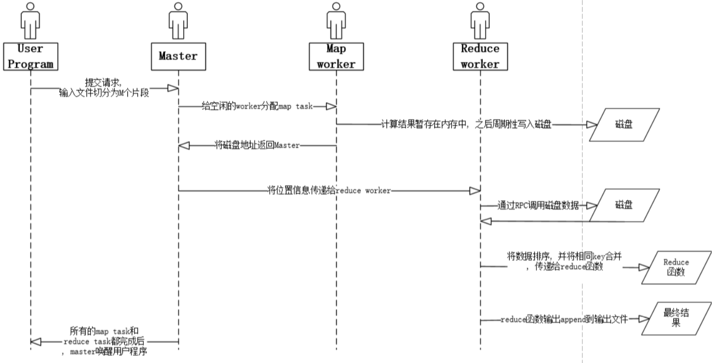

[6.824 Home Page: Spring 2020](http://nil.csail.mit.edu/6.824/2020/)

## 概念

- Key-Value = KV: 目前的理论、开发都是基于KV系统的，输入都是Map操作。
- fault tolerance: 容错
	- availability: 即使是很少发生的小错误，在一个集群里面可能天天发生。要保证一定范围内的错误发生时依旧可用。
	- recoverability: 可以通过恢复系统解决故障，也可以在失去可用性后重新可用。
- consistency: 一致性
	- non-volatile storage (NV storage): 非易失性存储
	- replication: 拷贝（副本）

## MapReduce

输入调用Map（emit(k,v)），产出中间输出，然后调用Reduce（emit(k,list(v))）（value以数组形式聚合到一句Reduce中）以实际生成数据。

>有一个经典的例子就是word-counter，我们输入的是若干篇文章，也就是`list(k1, v1)`，其中`k1`就是文章的filename，`v`就是content。然后，master会将所有的文章分成M份，分别派发给这么多的worker去做（不一定是同一时刻）。那么worker执行map的时候，就会把每个`(k1, v1)`都去执行map-function（用户定义的），然后得到的结果是`(k2, v2)`，这里的`k2`就是word，`v2`就是word出现的次数。然后，将所有的`(k2, v2)`对分成R份，存在磁盘中。那么，等所有的map都做完后，其实是有M\*R个文件的。后面reduce过程就会将其reduce id对应的所有map result收集起来，因为一个word会在不同的map result中出现，所以我们整理会得到一个`(k2, list(v2))`，再对每一个这样的pair调用reduce-function，就会得到`(k2, v2)`，也就是把同一个单词出现的次数都加起来了。然后存在结果中就好了，等待merge。

 - intermediate output: 中间输出 每个Map以一组KV作为输出。
 - job / task: 整个计算成为job，而每次调用MapReduce都是task。
 - GFS = Google File System: 这种文件系统在收到大文件的时候会将其自动拆分并均匀分配到所有GFS中。
 - shuffle: 洗牌，指行Map转为行Reduce。
 - RPC = Remote Procedure Call: 远程过程调用。直接调用其他进程（机器）上的方法。go的RPC包很好用。
 - parallelism: 并行化
 - coordination: 协作。线程间同步（如等待其他线程完成任务）。

## GFS

高性能和低异常不可兼得：
| From        | To              | 备注                                                         |
| ----------- | --------------- | ------------------------------------------------------------ |
| Performance | Sharding        | 通过分片提高性能，但分片太多总有某些服务器会出错导致数据出错 |
| Faults      | Tolerance       | 使用容错机制解决错误                                         |
| Tolerance   | Replication     | 最简单的容错就是复制                                         |
| Replication | Inconsistency   | 复制可能带来不一致性问题                                     |
| Consistency | Low Performance | 想要保持一致性需要很多努力                                   | 

- sharding: 分片
- anomalous behavior: 异常行为
- replication(REPL): 复制

朴素的replication有一个问题是无法保证写操作执行顺序相同：

