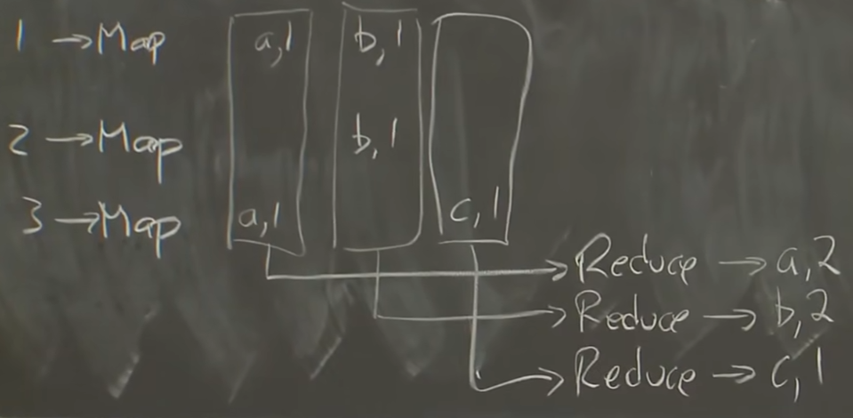

[6.824 Home Page: Spring 2020](http://nil.csail.mit.edu/6.824/2020/)

## 概念

- Key-Value = KV: 目前的理论、开发都是基于KV系统的，输入都是Map操作。
- fault tolerance: 容错
	- availability: 即使是很少发生的小错误，在一个集群里面可能天天发生。要保证一定范围内的错误发生时依旧可用。
	- recoverability: 可以通过恢复系统解决故障，也可以在失去可用性后重新可用。
- consistency: 一致性
	- non-volatile storage (NV storage): 非易失性存储
	- replication: 拷贝（副本）

## MapReduce

输入调用Map（emit(k,v)），产出中间输出，然后调用Reduce（emit(k,list(v))）（value以数组形式聚合到一句Reduce中）以实际生成数据。

>有一个经典的例子就是word-counter，我们输入的是若干篇文章，也就是`list(k1, v1)`，其中`k1`就是文章的filename，`v`就是content。然后，master会将所有的文章分成M份，分别派发给这么多的worker去做（不一定是同一时刻）。那么worker执行map的时候，就会把每个`(k1, v1)`都去执行map-function（用户定义的），然后得到的结果是`(k2, v2)`，这里的`k2`就是word，`v2`就是word出现的次数。然后，将所有的`(k2, v2)`对分成R份，存在磁盘中。那么，等所有的map都做完后，其实是有M\*R个文件的。后面reduce过程就会将其reduce id对应的所有map result收集起来，因为一个word会在不同的map result中出现，所以我们整理会得到一个`(k2, list(v2))`，再对每一个这样的pair调用reduce-function，就会得到`(k2, v2)`，也就是把同一个单词出现的次数都加起来了。然后存在结果中就好了，等待merge。

 - intermediate output: 中间输出 每个Map以一组KV作为输出。
 - job / task: 整个计算成为job，而每次调用MapReduce都是task。
 - GFS = Google File System: 这种文件系统在收到大文件的时候会将其自动拆分并均匀分配到所有GFS中。
 - shuffle: 洗牌，指行Map转为行Reduce。
 - RPC = Remote Procedure Call: 远程过程调用。直接调用其他进程（机器）上的方法。go的RPC包很好用。
 - parallelism: 并行化
 - coordination: 协作。线程间同步（如等待其他线程完成任务）。

## GFS

高性能和低异常不可兼得：
| From        | To              | 备注                                                         |
| ----------- | --------------- | ------------------------------------------------------------ |
| Performance | Sharding        | 通过分片提高性能，但分片太多总有某些服务器会出错导致数据出错 |
| Faults      | Tolerance       | 使用容错机制解决错误                                         |
| Tolerance   | Replication     | 最简单的容错就是复制                                         |
| Replication | Inconsistency   | 复制可能带来不一致性问题                                     |
| Consistency | Low Performance | 想要保持一致性需要很多努力                                   | 

- sharding: 分片
- anomalous behavior: 异常行为
- replication/replica (REPL): 复制
- volatile: 易失的

朴素的replication有一个问题是无法保证写操作执行顺序相同：

GFS特点：
- 只有单个机房（数据中心）
- 只能内部使用，不公开
- 只处理大文件的顺序访问（牺牲延时换取吞吐量）
- 不需要很强的一致性，web相关信息允许一些错误

Master Datas（注：v表示易失，存在内存里面，nv存在硬盘里面）:
- FileName
	- Array of chunk handles: nv
- Handle（对应一个chunk；根据handle可以找到chunk在哪个chunkserver）:
	- List of chunkservers: v
	- version: nv
	- primary: v
	- lease expiration (租期): v
- Log & CheckPoint -> Disk

每个chunk一般有三个备份，一个primary两个secondary。

使用log而非数据库的理由：数据库的索引会导致随机存取，而log只需要找EOF。

CheckPoint会挑时间保存**master**的完整快照（而不是log），可以加快master的重启，只要加载checkpoint然后重新执行checkpoint之后的日志就行了。

之所以version必须是非易失的，是因为如果某个chunkserver宕机了一段时间，其版本号就会匹配不上，则请求数据的时候不会去匹配这个chunk。

master重启时会询问所有的chunkserver（平时也会定期询问），来确定handle。若把version选为这些chunkserver中最新的那个，有一个风险是，持有最新版本的chunkserver在master重启时无法回应，导致整个系统只能使用旧版本。

master若发现现有的chunkserver都是旧版本的，则会一直等待直到对应版本被发现。

若发现有拥有比version更高的版本号的chunk，则master会认为在分配primary时出现了错误，于是重新选择版本号。

Brain Split （脑裂）问题：一个primary正在工作，但由于网络问题master联系不到primary，结果误新指定了个primary导致同时存在两个primary。虽然master会告诉client新的primary，但client可能还在和旧primary正常通信。解决方法就是租期，master知道什么时候租约到期。当master联系不上primary时，就等待租约到期后再重新指定即可。

添加新文件（没有任何chunk与之相关）时，master会新建各种信息、随机指定P和S并进行特殊的创建工作。
### Read

应用想读取一个文件的字节偏移a到b范围内的数据，则把文件名和始终偏移量传给master，由master来找文件名、寻找chunk。

客户端能算得出来自己要读的文件在第几个chunk、要几个chunk，但它不知道chunkserver是哪个。

### Write

（对某个chunk）<u>如果没有primary</u>，master寻找到最新版本，并且决定哪个是primary、哪个是secondary。之后自增版本号，并通知这些P、S。此时会定下租期，告诉P这个primary身份的期限。但版本号的持久化时机老师并没有确切回答。

>只有在无primary时才改变版本号，同时决定P和S。

会有多个client发送请求，而P可以决定执行顺序，不需要S再去调度。

master告诉client哪个是primary。primary接收client的信息，并选择一个偏移量（要保证能存的下）；同时通知其他secondary该偏移量。这样，所有replica就存在了同一个地方。

S会告诉P成功or失败。有任何一个失败就会通知client操作失败，要求client重新走流程（当做上个请求完全没发生）。因此，即使失败，也会有某些cs执行了该写操作，导致能不能读到的随机的。但是，client知道失败后，自然会重新发起请求直到写入成功。只要操作进行到底，就能保证全部写入成功。但每次请求的偏移量都不同，所以之前的偏移量的地方有没有该记录也是随机的。换句话说，保证最终必然有一块一方存储了这个写入数据。

