# 链接
[6.824 Home Page: Spring 2020](http://nil.csail.mit.edu/6.824/2020/)

[〖项目笔记〗分布式架构详解 - 哔哩哔哩](https://www.bilibili.com/read/cv19361441)
# 基本概念

- Key-Value = KV: 目前的理论、开发都是基于KV系统的，输入都是Map操作。
- fault tolerance: 容错
	- availability: 即使是很少发生的小错误，在一个集群里面可能天天发生。要保证一定范围内的错误发生时依旧可用。
	- recoverability: 可以通过恢复系统解决故障，也可以在失去可用性后重新可用。
- consistency: 一致性
	- non-volatile storage (NV storage): 非易失性存储
	- replication: 拷贝（副本）

# MapReduce

输入调用Map（emit(k,v)），产出中间输出，然后调用Reduce（emit(k,list(v))）（value以数组形式聚合到一句Reduce中）以实际生成数据。

>有一个经典的例子就是word-counter，我们输入的是若干篇文章，也就是`list(k1, v1)`，其中`k1`就是文章的filename，`v`就是content。然后，master会将所有的文章分成M份，分别派发给这么多的worker去做（不一定是同一时刻）。那么worker执行map的时候，就会把每个`(k1, v1)`都去执行map-function（用户定义的），然后得到的结果是`(k2, v2)`，这里的`k2`就是word，`v2`就是word出现的次数。然后，将所有的`(k2, v2)`对分成R份，存在磁盘中。那么，等所有的map都做完后，其实是有M\*R个文件的。后面reduce过程就会将其reduce id对应的所有map result收集起来，因为一个word会在不同的map result中出现，所以我们整理会得到一个`(k2, list(v2))`，再对每一个这样的pair调用reduce-function，就会得到`(k2, v2)`，也就是把同一个单词出现的次数都加起来了。然后存在结果中就好了，等待merge。

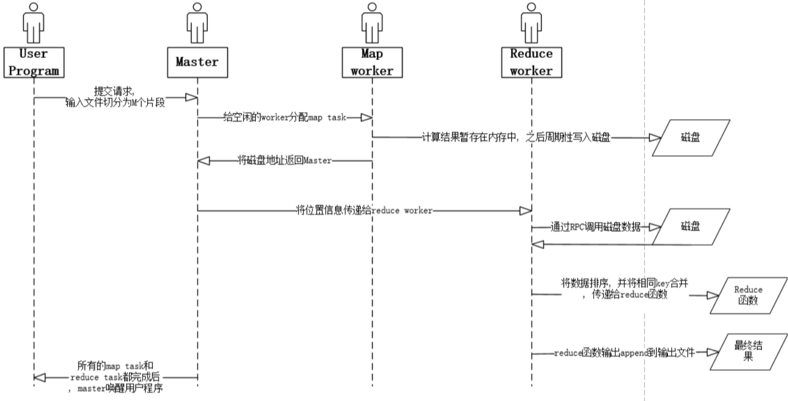

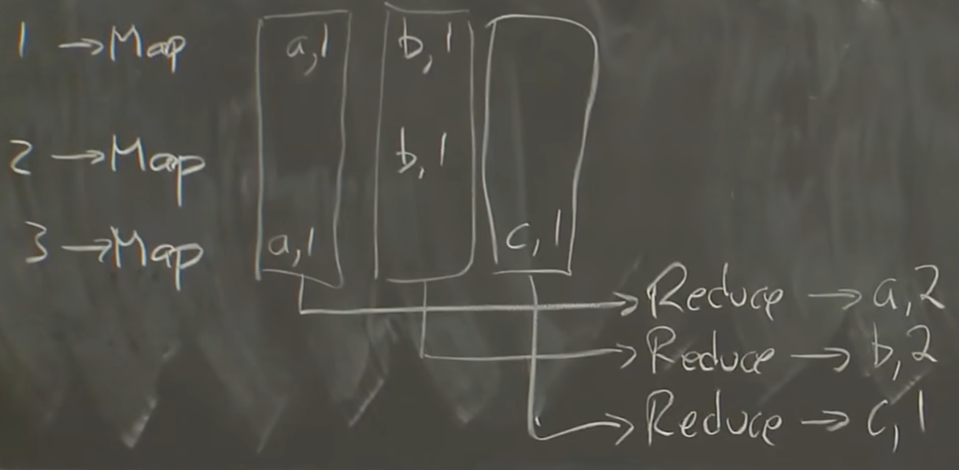

 - intermediate output: 中间输出 每个Map以一组KV作为输出。
 - job / task: 整个计算成为job，而每次调用MapReduce都是task。
 - GFS = Google File System: 这种文件系统在收到大文件的时候会将其自动拆分并均匀分配到所有GFS中。
 - shuffle: 洗牌，指行Map转为行Reduce。
 - RPC = Remote Procedure Call: 远程过程调用。直接调用其他进程（机器）上的方法。go的RPC包很好用。
 - parallelism: 并行化
 - coordination: 协作。线程间同步（如等待其他线程完成任务）。

# GFS

高性能和低异常不可兼得：

| From        | To              | 备注   |
| ----------- | --------------- | ----- |
| Performance | Sharding        | 通过分片提高性能，但分片太多总有某些服务器会出错导致数据出错 |
| Faults      | Tolerance       | 使用容错机制解决错误     |
| Tolerance   | Replication     | 最简单的容错就是复制       |
| Replication | Inconsistency   | 复制可能带来不一致性问题  |
| Consistency | Low Performance | 想要保持一致性需要很多努力 | 

- sharding: 分片
- anomalous behavior: 异常行为
- replication/replica (REPL): 复制
- volatile: 易失的

朴素的replication有一个问题是无法保证写操作执行顺序相同：

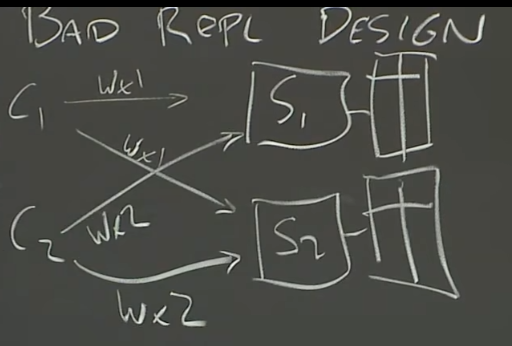

GFS特点：
- 只有单个机房（数据中心）
- 只能内部使用，不公开
- 只处理大文件的顺序访问（牺牲延时换取吞吐量）
- 不需要很强的一致性，web相关信息允许一些错误

Master Datas（注：v表示易失，存在内存里面，nv存在硬盘里面）:
- FileName
	- Array of chunk handles: nv
- Handle（对应一个chunk；根据handle可以找到chunk在哪个chunkserver）:
	- List of chunkservers: v
	- version: nv
	- primary: v
	- lease expiration (租期): v
- Log & CheckPoint -> Disk

每个chunk一般有三个备份，一个primary两个secondary。

使用log而非数据库的理由：数据库的索引会导致随机存取，而log只需要找EOF。

CheckPoint会挑时间保存**master**的完整快照（而不是log），可以加快master的重启，只要加载checkpoint然后重新执行checkpoint之后的日志就行了。

之所以version必须是非易失的，是因为如果某个chunkserver宕机了一段时间，其版本号就会匹配不上，则请求数据的时候不会去匹配这个chunk。

master重启时会询问所有的chunkserver（平时也会定期询问），来确定handle。若把version选为这些chunkserver中最新的那个，有一个风险是，持有最新版本的chunkserver在master重启时无法回应，导致整个系统只能使用旧版本。

master若发现现有的chunkserver都是旧版本的，则会一直等待直到对应版本被发现。

若发现有拥有比version更高的版本号的chunk，则master会认为在分配primary时出现了错误，于是重新选择版本号。

Brain Split （脑裂）问题：一个primary正在工作，但由于网络问题master联系不到primary，结果误新指定了个primary导致同时存在两个primary。虽然master会告诉client新的primary，但client可能还在和旧primary正常通信。解决方法就是租期，master知道什么时候租约到期。当master联系不上primary时，就等待租约到期后再重新指定即可。

添加新文件（没有任何chunk与之相关）时，master会新建各种信息、随机指定P和S并进行特殊的创建工作。
## Read

应用想读取一个文件的字节偏移a到b范围内的数据，则把文件名和始终偏移量传给master，由master来找文件名、寻找chunk。

客户端能算得出来自己要读的文件在第几个chunk、要几个chunk，但它不知道chunkserver是哪个。

## Write

（对某个chunk）<u>如果没有primary</u>，master寻找到最新版本，并且决定哪个是primary、哪个是secondary。之后自增版本号，并通知这些P、S。此时会定下租期，告诉P这个primary身份的期限。但版本号的持久化时机老师并没有确切回答。

>只有在无primary时才改变版本号，同时决定P和S。

会有多个client发送请求，而P可以决定执行顺序，不需要S再去调度。

master告诉client哪个是primary。primary接收client的信息，并选择一个偏移量（要保证能存的下）；同时通知其他secondary该偏移量。这样，所有replica就存在了同一个地方。

S会告诉P成功or失败。有任何一个失败就会通知client操作失败，要求client重新走流程（当做上个请求完全没发生）。因此，即使失败，也会有某些cs执行了该写操作，导致能不能读到是随机的。但是，client知道失败后，自然会重新发起请求直到写入成功。只要操作进行到底，就能保证全部写入成功。但每次请求的偏移量都不同，所以之前的偏移量的地方有没有该记录也是随机的。换句话说，保证最终必然有一块地方存储了这个写入数据，且核心管理逻辑只会记录那块地方而忽视失败处。

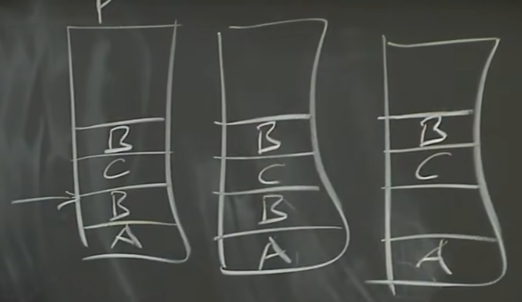

似乎一般都是加写数据，写在chunk中已存储的最后位置之后。

如果一个文件的顺序很重要，比如电影文件，那就应该连续一次性写完，而不是分多次写。

# Primary-Backup Replication

只能解决fail-stop faults，而不能解决bug。

> VMM: virtual machine monitor

解决方法：
- State Transfer 复制状态（类似快照）（不关心是否并行）
- Replicated State Machine 传递外部事件（类似日志）（不能用于新建replica）

P/B sync: Backup往往比Primary慢，当P宕机时，B不一定能赶得上进度。

Non-determined Event: 例如生成随机数和获取当前时间，不能交给主从机两个机子做。从机必须拿主机的计算结果。

B只有在知道自己什么时候能停下时，才会开始执行。使用buffer缓存这些指令。

主机要回复client时，等从机接收client的指令并发来ACK后主机才真正回复。

假如出现一种情况，主从先后发了同一个回复给client，也不会出问题。因为回复的时刻主从状态完全相同，则网络包的各种东西都完全相同，在协议里面被视为重传而丢弃。各种方案几乎都可能产生这样的重复输出。

Test and Set Server: 具有一把锁决定哪个机器能上线（成为P）

# Raft

[分布式算法：Raft论文翻译 - 知乎](https://zhuanlan.zhihu.com/p/343560811)

任何时候，服务器是领导者、追随者和候选人三个中的一种状态。在正常操作中，只有一个leader，而其他所有服务器都是follower。

- follower是被动的：他们自己不发出请求，而只是响应leader和candidate的请求。
- leader处理所有客户请求（如果客户联系follower，则follower将其重定向到leader）。 
- candidate，用于选举新的领导者。

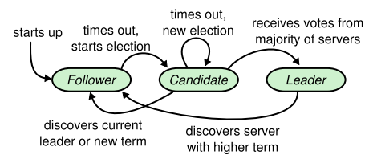

每个任期(term)开始一次选举(election)，其中一个或者更多的candidate试图成为leader。 如果candidate在选举中获胜，则在该任期剩余时间中将担任leader。 在某些情况下，选举将导致投票分裂。 在这种情况下，任期将以没有leader的情况结束；新的任期(新的选举)会很短。Raft保证一个任期内最多只有一个leader。

所有人都选自己以及比自己新的，则每一个被选为leader的服务器所包含的日志肯定被复制到了超半数的服务器上，也就都是已提交的日志。（但某一日志即使被复制超半数也不一定是已提交，这在后面会提到）

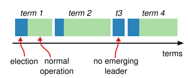

Raft使用心跳机制来触发leader的选举过程。当服务器开始工作，它们成为follower。只要服务器收到来自leader或者candidate有效RPC，他就会保持follower状态。leader向所有follower发送周期性的心跳信号（不携带日志条目的AppendEntries RPC），以维护其领导地位。如果follower在称为选举超时(election timeout)的时间段内没有任何通信，则它假定没有可行的leader，并开始竞选新leader。

- split votes: 分裂投票

- RequestVote RPC 由Candidate在选举期间启动
- AppendEntries RPC 由Leader启动用来复制日志条目并提供一种形式的心跳

当等待投票的时候，candidate可能收到另一个服务器声明已经成为leader的AppendEntries RPC。如果这个leader的任期不低于这个candidate的任期，这个candidate就承认leader的正当性然后成为follower。如果这个RPC中的任期比candidate的任期小，这个candidate就就拒绝这个RPC，然后继续保持candidate状态。

>If election timeout elapses without receiving AppendEntries RPC from current leader or granting vote to candidate: convert to candidate

每个服务器的选举超时时间都是随机的（大于心跳周期，比心跳周期大几倍就相当于容许丢失几个心跳周期）。

投票后也会重置定时器。

如果发送和接收的任何RPC中的对方任期比自己任期大，则**自己变为follower且更新自己的任期**。
## 日志

日志由条目组成，这些条目按顺序编号。 每个条目包含创建它的任期（每个框中的数字）和状态机指令。 如果可以安全地将该条目应用于状态机，则认为该条目被提交。每个日志条目还有一个数字索引表示它在日志中的位置。

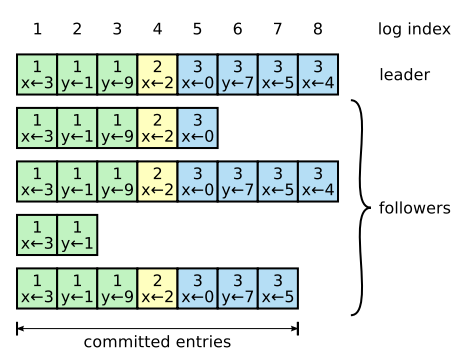

条目的提交会把以前的所有条目给提交，因为几条记录的是最高索引。该索引会包含在AppendEntries RPC中使得follower都知道哪些条目被提交了。**若得知该条目被提交，则可将其正式应用与本地状态机。**

如果两个在不同日志的条目有相同的索引和任期，那么它们储存同样的指令，且这两个日志中该索引之前的条目都是相同的

发送AppendEntries RPC时，leader在其中包括其日志中下一条新条目之前的索引和任期(当前已提交的最大索引和任期)。 如果follower在其日志中找不到具有相同索引和任期的条目，它拒绝该条目。 一致性检查是一个归纳步骤：日志的初始空白状态满足LogMatching属性，并且每次扩展日志时，一致性检查都会维持Log Matching属性。结果，只要AppendEntries成功返回，leader就会知道follower的日志和自己的新条目之前的日志完全相同。

>在Raft中，leader通过强制follower复制leader的日志来解决不一致问题。这意味着follower中冲突的条目会被leader的日志覆盖。leader会找到两个日志中相同的最新日志条目，然后删除follower日志中该条目之后的所有内容，然后将leader中该条目之后的所有条目发给follower。 所有这些操作用来响应AppendEntriesRPC执行的一致性检查。 
>leader为每个follower维护一个nextIndex，这是leader将发送给该follower的下一个日志条目的索引。当leader刚选举出来时，它将所有nextIndex值初始化为其日志中的最大索引之后的索引（图7中的11）。 如果follower的日志与leader的日志不一致，则下一个AppendEntries RPC中的一致性检查将失败。失败之后，leader递减nextIndex并重试AppendEntries RPC。 最终nextIndex将到达leader和follower日志匹配的点。至此，AppendEntries将成功执行，这将删除follower日志中的所有冲突条目，并从leader的日志中添加附加条目（如果有）。 一旦AppendEntries成功，follower的日志将与leader的日志保持一致，并且在本任期的其余部分中将保持这种状态。

## 应用日志

过半的服务器响应AppendEntries时，leader（S1）回应客户端“提交成功”，并让各个服务器将其应用到本地（也许是在下一个AE中）。

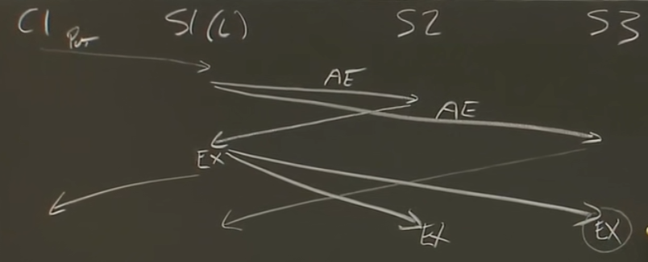

## 快速备份

当leader发现一个follower日志不匹配时，会一项一项地往前试知道发现匹配项。如果一台服务器宕机了很久，那就得一直回滚非常多次，浪费时间。

- XTerm: 冲突项的任期
- XIndex: 冲突项所在任期的第一个项的下标
- XLen: 空白的长度（prev的index与当前日志的最大index之差）

- Leader拿到XTerm，然后找到自己的**XTerm的日志**的**最后一项**的下一项（**大于Xterm的日志**的**第一项**），将其设为nextIndex。
- 若Leader的日志里面没有该Xterm，则将nextIndex设为**XIndex**（即把XTerm全部覆盖掉）。
- Follower没有该prev下标时，返回XTerm为-1，XLen为下标差。Leader将nextIndex减去XLen。

第二种情况有一个错误的想法是让其和第一种统一，即把nextIndex设为**大于Xterm的日志**的**第一项**。考虑如下情况（下标从1开始）：

- F: 3 4 5 5 5 5
- L: 3 4 4 4 6 6 6

若使用该错误想法的话，nextIndex退到5就无法再退了。退到3才是正确的。

## 安全性

这个算法让**上任leader所有提交的条目在新leader中都存在**（所有已提交的条目都会被leader包含，也就是说**没有被提交后又被废弃的条目**）。而被提交的条目才会被服务器正式应用。

日志条目只有一个流向，从leader到follower，而且<u>leader从不修改它已存在的日志</u>。

>RequestVote RPC 包含有关candidate日志的信息。如果follower自己的日志比candidate的日志新，则拒绝投票。

>Raft通过比较日志中最后一个条目的索引和任期来确定两个日志中哪个是最新(up-to-date)。 如果日志中的最后一个条目具有不同的任期，则带有**较新任期**的日志将是最新的。 如果日志以相同的任期结尾，则**更大索引**的日志是最新的。

一个条目即使被复制到了大多数服务器，也不一定是已提交的。若还在复制但未达到提交就宕机、重启后又有新的输入的话，**旧的输入复制再多也不算提交**，只有最新的输入被复制到过半服务器了才算提交（因为这样的话就不会投票给其他leader导致新旧输入都被覆盖）。

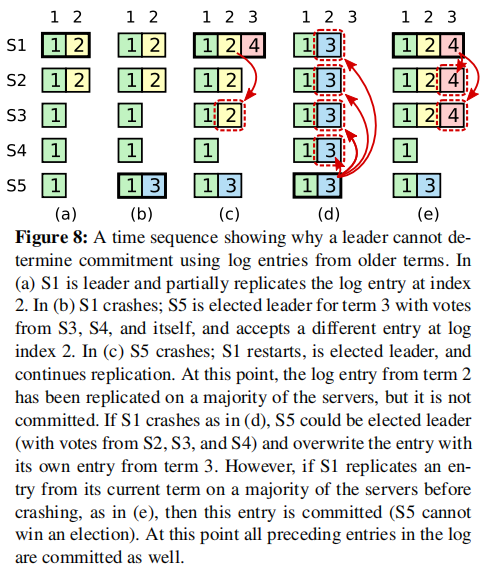

如果服务器S1添加（收到AppendEntries）了S2的条目，而S3没有添加S2的条目，此时S1不可能投票（收到RequestVote）给S3。

## 持久化

要持久化log、currentTerm、votedFor。

要存当前任期和投票给谁是为了防止服务器在一个选举期之内宕机又恢复导致一个人投两票。

要存任期是为了防止所有服务重启后不知道当前进行到哪一个任期，随意选择的话可能和其他日志冲突（如选出小term的leader）。

## 线性一致性

Linearizability: 线性一致性，等同于强一致性（strong consistency）。在该lab里面等价于正确性。

- 历史记录中的操作具有顺序（意味着可以画出箭头来标明各个操作的开始与结束之间的时序关联）
- 这些操作的顺序与非并发的请求现实时序是匹配的（现实中的先后也构成箭头）
- 每次读取都能读到最近一次写操作的结果（规定了某个读必须在某个写后面，要画上箭头）

该图内每个操作的做竖线表示发起请求，右竖线表示收到确认。叉叉表示服务器操作这片内存的时间点。箭头表示的是叉叉之间的关系。

当画好箭头后出现环，则说明不是线性一致的。


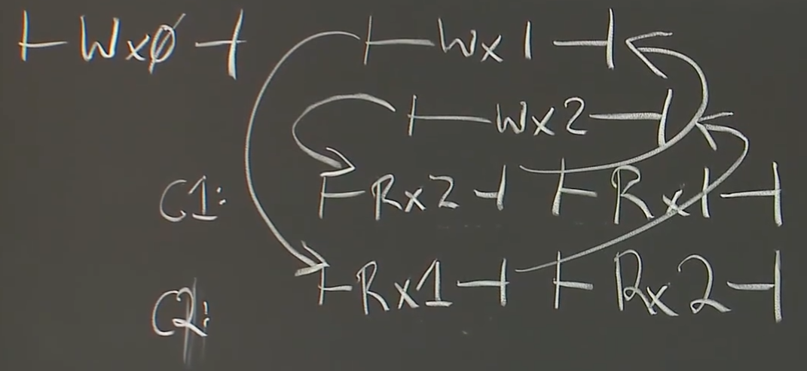

多副本很容易打破线性一致性，因为很可能出现乱序请求或过时信息。这也是为什么它也叫强一致性。良好的线性一致性使得分布式系统表现得就像一个单线程系统一样。

## 请求响应过迟问题

即使满足了线性一致性，如果一个请求的响应时间太迟，就可能让应用程序读到过期的数据。此时，应用程序应当包含对此现象的容错机制。

# ZooKeeper

## 分布式部分

Raft不是一个可以直接通信的独立服务，而是一个库，必须包含在具体的程序中被显式地调用。ZooKeeper的目的就是构建一个人人可用的独立服务。

问题：
1. API: general-purpose coordination service （一个人人可用的独立服务的API应该长什么样）
2. N台服务器能提供N倍的效益吗——由于读可以发给replica，因此可以趋向正相关（Raft是反相关，因为都是leader干活）

ZK允许把只读请求发送给replica，得到的回复有可能是过期（stale）的而非新鲜（fresh）的。

ZK的保证：
1. Linearizability writes 线性一致性写（不符合线性一致性）
2. FIFO client order 
	1. 写的顺序是client specifified order，即client可以指定其发送的请求的处理顺序。
	2. 读时，虽然可能会有过期数据，但保证每次读都不会比上次旧。日志都会有版本编号zxid，client在读时会记录zxid，并在读请求时携带；replica只有当自己的日志更新到比zxid新时，才会去回复这个读请求。因此，读都是随时间往前的，或是说是沿日志号往前的。
	3. 写时也可记录写的日志的zxid，在之后的读就要求比此zxid新才行。这样的话，就保证对于一个client来说，必能读到其自己之前写的东西。

读的时候可以开启watch，若对应部分被更改，将其设为watch的client会收到通知。这样可以防止分多次读时部分过期的问题。replica会维护watch table来记录被watch的部分。但replica崩溃时并不会转移watch table，而是告诉client它崩溃了，让client做好相关应对。

## API部分

每次操作都会递增对应文件的版本号。操作可以指定版本号，对不上版本就不会进行操作并返回错误。

- CREATE(PATH,DATA,FLAGs): 创建文件，必须是唯一的，让客户端知道它是唯一管理这个文件的客户端（exclusive）。FLAGs决定其用途（形式）。
- DELETE(PATH,V): 删除文件。可以指定版本。
- EXIST(PATH,WATCH): 查询该文件是否存在。若设置了WATCH，则ZK会在该文件被删除/创造时通知客户端。
- GETDATA(PATH,WATCH): 获取文件内容。WATCH会监听文件内容。
- SETDATA(PATH,DATA,V): 修改文件内容。可以指定版本。

### 例1： count

需求：多个客户端都要求对一个变量做自增操作。

```python
while true
 x,V = GETDATA("f")
 if SETDATA("f",x+1,V)
	 break
```

解释：如果GET和SET期间有其他客户端完成了自增，或者GET的replica过时，则V会不对，导致要重新走一遍流程，直到执行期间没有任何其他客户端完成自增。

一旦成功，即是一次原子读写。也是个微事务mini transaction （MTR）。

>MySQL中的 mini transaction (MTR): mini-transaction不是用户事务. 它是一个短原子操作，由下面两部分组成:index，表空间或page锁;对page的修改。
>mini-transaction不能回滚。它是原子的。
>一个MTR可以嵌入到另一个MTR中。
>MTR的持久性取决于redo log buffer被写入redo log files的时间点，恢复可能错过一些最新的mtr提交。
>MTR 提交会做:将日志追加到redo log buffer；释放所有锁。

若有n个客户端，则完成这件事的复杂度为O(n^2)，因此不适合大量用户，更不适合大型数据。因此ZK通常用于管理配置而不是存储大数据。

>**羊群效应（Herd Effect）**: 有个目标就一呼而上、最后只有一个客户端能成功的现象。

### 例2： 获取锁

需求：建立互斥锁。

多个客户端抢着创建一个文件，这个文件就被当做锁来用，删除文件就是释放锁。

>开启ephemeral后，客户端死亡时会自动删除文件。

```python
1 if CREATE("f" , ephemeral=T) return #创建成功就结束
2 if EXISTS("f" , watch=T)
3     wait #等待直到watch触发，即文件被删除
4 goto 1 #重新尝试创建文件
```


### 例3： 通过文件序列来管理锁

需求：建立一个无羊群效应的互斥锁。

>开启sequential时，ZK会在创建文件后加上后缀编号，而且只会不断变大，不会重用。

数个客户端抢着创建带后缀编号的文件f，则可以自动排序（数字越小的抢的越快），每个客户端都只有在比它们编号小的文件都删除后（先抢到的客户端都不再要锁后）才能算获得锁。

```python
1 CREATE("f",data,sequential=T,ephemeral=T) #创建文件并获取对应编号
2 LIST "f*" #列出文件列表
3 if no lower file return #没有比自己编号小的文件了，说明得到了锁
4 if EXISTS(next lower f , watch = T) #只需要监听最接近自己的编号小的文件
5     wait #等待直到目标文件被删除
6 goto 2 #重新检测是否获得锁
```

如果有文件f1、f2、f4、f6，则拥有f6的客户端只要不断检测f4是否存在，因为正常情况下锁都是**从小到大被一个一个释放**。

之所以要每次循环都重新列出文件列表、并且最接近自己的编号小的文件被删除后也不等价于获得锁，是因为**有可能客户端提前挂了或者不想再要锁了，导致其文件被提前删除**，如f1、f2、f4、f6直接变成f1、f2、f6，此时f6需要转而监听f2而非f4。
# CRAQ

**CRAQ**(Chain Replication with Apportioned Queries: 读均摊的链式复制)

CR: 假如有五台服务器，对于写操作，Client发给S1，S1做完后发给S2，一直发到S5，然后S5**直接**发给Client说“提交完毕”。S1称为Head，S5称为Tail。对于读操作，CR只能从Tail读。因此，**读到的东西都是被提交了的**。

保证线性一致性。

每个服务器收到请求后，将对应数据存为dirty版本；收到确认后，将对应数据进行“commit”，变成clean版本。每个数据可以有多个dirty版本，但最多有一个clean版本。

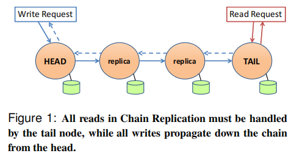

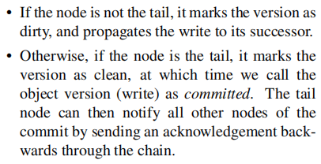

CRAQ的读可以给各个服务器读，但也不会读脏数据。如果发现该数据有dirty版本，则说明自己的版本可能不够新（也可能是新的），于是向Tail发送一个轻量级的请求询问“哪个版本是当下正确的版本”，然后将对应版本的数据返回给client。

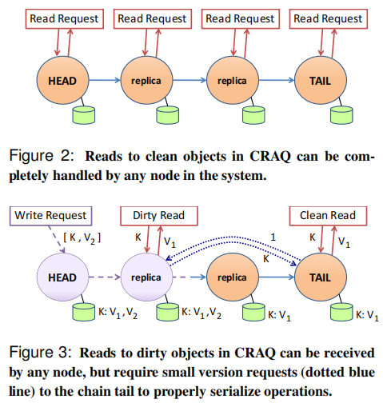


**故障**发生于写请求的传递过程。

- Head故障了，则直接让下一个结点当Head即可。
- 中间节点故障了，则将其踢出，并把请求重新发给下一个结点。
- Tail故障了，则直接用前一个结点当Tail即可，因为对中间节点故障的处理使得Tail和其前一个结点的状态是一致的，就差了这个新请求；Tail故障后，新Tail就把这个新请求提交。如果此时不提交的话可能面临重复请求等问题。


**性能**：Leader只需要向一个服务器发请求，而不像Raft一样全都要发，减少了Leader的压力。但问题是，如果有一个服务器变慢了，就会拖累整个系统，Raft就没有这种问题。

**网络割裂导致脑裂**：如果head结点到其他结点的网络断了，则head认为其他结点都宕机，自己一人挑起全家；下一个结点认为head故障了，把head踢掉自己当，并且通知Client要向自己发请求。于是产生了**脑裂**问题。此时需要配置服务器等第三方手段来记录存活情况，所有节点都得听配置服务器的，它说结点死了就是死了。配置服务器通常由Raft、Paxos、ZK等算法实现。

# Aurora

## EBS

elastic block store，Amazon的一个服务，相当于硬盘。硬盘操作会发送到一个EBS服务器，然后该服务器发给其他EBS；全都完成后返回确认。体现为硬盘的复制备份服务。

它并不知道硬盘里面存了什么逻辑，只是无脑复制。因此它是个通用存储系统（general-purpose storage）。

## Aurora的改进

EBS会不断发8KB大的page，不如发只有一点点大的log entries（这使得Aurora要求网络容量更甚于CPU性能）。但这就**要求处理的每个存储服务器replica都知道日志条目是什么意思，而不能是单纯的存储系统**。这就是针对应⽤程序的存储系统（application specifific storage system），使得数据库和存储系统以一种有趣的方式集成在了一起。Aurora的这个优化**通过模糊服务和底层基础架构的边界来获得35倍的性能提升**。

这种log称为**Write-ahead logging（WAL）**。
## Qourum Replication

Qourum: 法定人数，表示支持的人数够了就是合法的。

每次把请求发送给所有replica，在获取一定数量的确认后算完成，无需等待剩余的服务器的响应。

>Raft可以认为是一种强Quorum的实现（读写操作都要过半服务器认可）。

三个参数：
- N: Replica数量
- W: 完成Write要求的确认数量
- R: 完成Read要求的确认数量

要求R+W>N，这样的话读的时候必然可以接触到一个以上的之前写的服务器。

设N=3，R=W=2，假如在S1和S2写，在S2和S3读，由于会维护版本号，读的时候就会发现S2版本新，于是取用S2的数据并让S3去同步。

如果W=N，R=1，则为WARO(Write All Read one)机制。

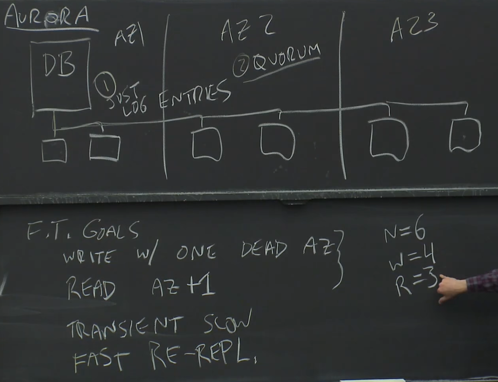

每个服务器都是状态（pages）+日志。当对一个服务器发起读时，对应的日志就被应用。

实际上，读的时候不需要Qourum，因为数据库服务器（主服务器）可以知晓并管理所有服务器的当前版本，当发生读时，数据库服务器能知道哪个服务器有对应的最新数据，并向其发起读请求。

数据库服务器的crash发生之后，会告诉新数据库服务器要进行清理操作。在恢复的时候，会通过Qourum Read发现有一个日志条目缺失了（未提交）（例如只有101、102、104而无103），于是告诉所有服务器丢弃103以后的所有**未提交**的事务。另外，前102的日志也可能是未提交的，要进行检测。

## Protection Group

PG可以看做分片的其中一片集群，它可以拓展存储上限（replica再多也不会改变上限）。

虽然对每个用户来说，每个PG都是把10GB存储了多份，但实际上每个实体机都可能有10TB的物理容量，同时负责几百个数据库。因此我们可能要给每个实体机备份10TB数据，但不能直接备份，因为10TB太大了。不妨顺其道而行之，以10GB为单位部署备份服务器，使得一个实体机宕机后，可以并发地从几百个不同的地方收集恢复数据。

## 只读数据库

专门用来读。因此它会直接问存储服务器要data pages来缓存到本地。它也会收到数据库服务器发来的log以更新缓存。

问题：
1. 要避免读到未commit事务。因此发来的log流中应指明commit情况。
2. 要避免读到B+树的中间过程。由于直接读data pages，可能会读到B+树进行平衡时的中间状态，这是非法的。

而其也能保证微事务（MTR）的原子性，当一个只读数据库需要向存储服务器查看一个data page时，存储服务器会小心的，要么展示微事务之前的状态，要么展示微事务之后的状态，但是绝不会展示中间状态。

# Frangipani

每个Work Station都安装了Frangipani，它们都连向Petal存储服务器（作为共享存储系统）。每个WS都能从Petal获取共享文件。

共享文件在本地大量缓存，用户的修改直接在本地修改而非对远程服务器调用RPC（Write-Back缓存）。

Cache Coherence: 缓存一致性，一处的修改要被另一处看到。（而非存储服务器的一致性）

Frangipani遇到的挑战：
1. Cache Coherence 修改可见
2. Atomicity 同时操作一个地方时都要成功
3. Crash Recovery 当Write-Back缓存将修改同步到Petal时，可能发生崩溃，这时候要保证文件系统依然是一致的而非损坏的。

## Cache Coherence

Lock Server 锁服务器: 管理锁，逻辑上独立但可以看做和Petal一起运行。

规则：
- 工作站只有在持有一个数据的锁之后，才能在本地缓存它。
- 工作站只有把对缓存数据的修改上传到Petal之后，才能释放锁。

持有锁并进行读写时，锁被标记为Busy。而活干完后，锁被标记为Idle，而非直接归还释放。只有当LS要求归还这个锁、并且锁是Idle状态时，才同步数据并释放掉锁。这样的话可以方便在别人不用的时候一直对这块数据进行操作。**通过这种逻辑可以保证已经完成的操作都可以被其他人看到。**

四种网络消息:
1. Request (WS->LS): 工作站向锁服务器申请一个锁。
2. Grant (LS->WS): 若一次请求没拿到锁，而后来锁被释放了，则一个Grant消息会发给要锁的客户端。
3. Revoke (LS->WS): LS收到一个客户端对一个锁的请求时，询问持有这个锁的客户端，要求其释放锁。
4. Release (WS->LS): 持有锁的客户端收到Revoke、并且锁在Idle状态时，上传其修改过的缓存数据，然后向锁服务器发Release表示同意释放锁。

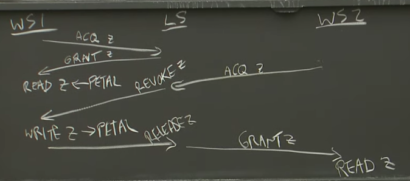

>其实锁可以是为写入提供的排他锁（Exclusive Lock），也可以是为只读提供的共享锁（Shared Lock）。

>就像Petal只是一个块存储服务，并不理解文件系统。锁服务器也不理解文件，目录，还有文件系统，它只是维护lock表单，表单中记录的是锁的名字和锁的持有者。Frangipani可以理解锁与某个文件相关联。实际上Frangipani在这里使用的是Unix风格的inode号来作为lock表单的key，而不是文件的名字。

为了防止WS崩溃导致修改丢失，它也会每隔30s上传一次修改（而不是只在回收锁时上传）。

## Atomicity

对于每个事务，都先获取要用的所有锁，在做完全部操作后上传，然后释放锁。

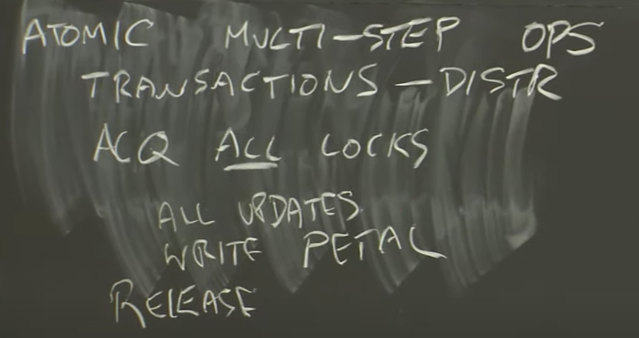

>Frangipani使用锁实现了两个几乎相反的目标：
>对于缓存一致性，Frangipani使用锁来确保写操作的结果对于任何读操作都是立即可见的，所以对于缓存一致性，这里使用锁来确保写操作可以被看见。
>对于原子性，锁确保了人们在操作完成之前看不到任何写操作，因为在所有的写操作完成之前，工作站持有所有的锁。

## Crash Recovery

在Petal中为每个WS保存一份log（既不保存在WS本地，也不追求统一的log，而是每人一份log存在云端）。

每个WS都独立为自己的log编号。编号是为了崩溃后能找到末尾最高编号的log。

每个Log条目还有一个用来描述一个特定操作中所涉及到的所有数据修改的数组。数组中的每个元素由三部分组成：
1. Petal中的块号（Block Number）
2. 版本号
3. 写入的数据

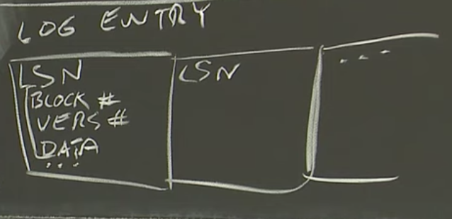

log只包含了对于元数据的修改，比如说文件系统中的目录、inode、bitmap的分配，而不包含具体的数据（用户信息）。这是因为发生错误时，我们只需要保证文件系统的一致性，而不需要对出错的操作进行彻底恢复。

日志的发送时机在收到Revoke后的第一步，也即上传本地修改之前。

如果一个WS宕机（比如不返回Release）就会让另一个WS去读取它的log以代为执行。

>这里有个比较烦人的问题就是，WS3在执行恢复，但是其他的工作站还在频繁的读取文件系统，持有了一些锁并且在向Petal写数据。WS3在执行恢复的过程中，WS2是完全不知道的。WS2可能还持有目录 d的锁，而WS3在扫描故障工作站WS1的Log时，需要读写目录d，但是目录d的锁还被WS2所持有。我们该如何解决这里的问题？
>
 一种不可行的方法是，让执行恢复的WS3先获取所有关联数据的锁，再重新执行Log。这种方法不可行的一个原因是，有可能故障恢复是在一个大范围电力故障之后，这样的话谁持有了什么锁的信息都丢失了，因此我们也就没有办法使用之前的缓存一致性协议，因为哪些数据加锁了，哪些数据没有加锁在断电的过程中丢失了。
>
 但是幸运的是，执行恢复的工作站可以直接从Petal读取数据而不用关心锁。这里的原因是，执行恢复的工作站想要重新执行Log条目，并且有可能修改与目录d关联的数据，它就是需要读取Petal中目前存放的目录数据。接下来只有两种可能，要么故障了的工作站WS1释放了锁，要么没有。如果没有的话，那么没有其他人不可以拥有目录的锁，执行恢复的工作站可以放心的读取目录数据（相当于锁被继承了），没有问题。如果释放了锁，那么在它释放锁之前，它必然将有关目录的数据写回到了Petal。这意味着，Petal中存储的版本号，至少会和故障工作站的Log条目中的版本号一样大，因此，之后恢复软件对比Log条目的版本号和Petal中存储的版本号，它就可以发现Log条目中的版本号并没有大于存储数据的版本号，那么这条Log条目就会被忽略。所以这种情况下，执行恢复的工作站可以**不持有锁直接读取块数据**，但是它最终不会更新数据。因为如果锁被释放了，那么Petal中存储的数据版本号会足够高，表明在工作站故障之前，Log条目已经应用到了Petal。所以这里不需要关心锁的问题。


# Distributed Transaction

**事务Transaction = 并发控制 Concurrency Control + 原子提交 Atomic Commit**

>可以这么理解事务：程序员有一些不同的操作，或许针对数据库不同的记录，他们希望所有这些操作作为一个整体，不会因为失败而被分割，也不会被其他活动看到中间状态。事务处理系统要求程序员对这些读操作、写操作标明起始和结束，这样才能知道事务的起始和结束。事务处理系统可以保证在事务的开始和结束之间的行为是可预期的。

Abort: 事务可能因为某种理由（如访问到空、非法运算、死锁）失败或决定失败。

## Concurrency Control - 2PL

并发控制分为：
- **悲观并发控制（Pessimistic Concurrency Control）**: 发现锁被占用后，延时等待。
- **乐观并发控制（Optimistic Concurrency Control）**: 不管锁，直接做；但如果同时有其他事务操作了自己用的数据，则abort并重试。

**两阶段锁（Two-Phase Locking，2PL）**是一种悲观并发控制。

1. 使用数据前必须获得锁。
2. 持有锁直到事务完成。（不强的也能在收缩阶段随意释放）

两阶段：
1. 增长阶段: 只能获得锁不能释放锁。
2. 收缩阶段: 只能释放锁不能获得锁（严格的只能在提交后释放）。

增长阶段和收缩阶段的目的：保证冲突可串行化。

冲突可串行化使得事务满足线性一致性，即全部正确执行的结果等价于串行执行的结果。

严格2PL要最后才能释放写锁。目的：防止脏读（因为读到的数据必然已被其他事务提交），也能进一步解决级联回滚问题。

强2PL要最后才能释放读写锁。目的：在严格2PL的基础上进一步解决不可重复读问题。

## Atomic Commit - 2PC

**原子提交协议（Atomic Commit Protocols）**: 若干个计算机要完成一个事务，要么全都完成，要么全都不做。

**两阶段提交（Two-Phase Commit，2PC）**就是一种原子提交协议。

两阶段：
1. 请求阶段（commit-request phase）/表决阶段（voting phase）: 通知事务内容并表决其可行性。
2. 提交阶段（commit phase）: 协调者将基于第一个阶段的投票结果进行决策：提交或取消。当且仅当所有的参与者同意提交事务协调者才通知所有的参与者提交事务，否则协调者将通知所有的参与者取消事务。参与者在接收到协调者发来的消息后将执行响应的操作。

缺点：过程中一直持有锁的同时一直等待，毕竟表示事务能成功运行之后必须保持相关现场不变动，否则可能嘴上说可以实际会失败。

### 术语

事务ID（Transaction ID），简称为TID。由事务协调器来分配。每个服务器都有一个表单来记录每个锁被哪个事务（TID）所持有。

TC（Transaction Coordinator）: 事务协调者。

Participants: 参与者，参与到一个事务中的服务器。

当事务到来时，TC对其分配TID，如95；然后在本地记录事务95的状态，并给参与者S1和S2打上95的标记。

### 2PC内容

事务结束后提交的目的（结果）：
- 释放所有锁
- 使事务的结果对外部可见
- 回复客户端

2PC步骤：
1. Client向TC发起事务。
2. TC向各个参与者发送相应的操作信息。
3. TC向各个参与者发送PREPARE消息，询问是否可以执行成功。
4. *(For Recovery)* 参与者收到PREPARE消息，将事务内容持久化到Log，并回答YES。
5. TC收到各个参与者的YES/NO答复。
6. *(For Recovery)* TC收到所有答复后将表决结果和TID持久化到Log，
7. TC根据标决结果：
	1. 若全为YES，则向各个参与者发送COMMIT消息，让其提交事务（应用到本地进行持久化）并发回ACK。
	2. 否则，向各个参与者发送ABORT消息，让其取消事务。
8. 若成功提交，则TC向Client返回得到的数据。
9. 参与者释放所有锁（2PL）。

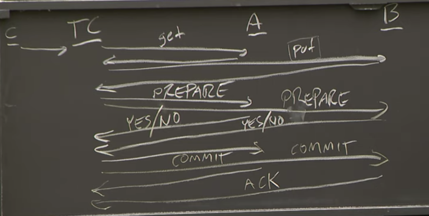

参与者回复NO可能是因为该事务会导致死锁，或者本地（Log）并没有此事务的信息。

### 2PC Crach Recovery

#### 参与者 Crash

若B断点重启，原始的解决方法是让其对正在进行的事务的信息一无所知。此时，若B收到PREPARE，那它完全不认识该事务，必然回复NO，没问题；但如果A、B之前都回复了YES，B重启后收到了COMMIT，它就无法完成任务，也无法让A回退。

因此，B**必须在断点重启后也要记住正在执行的事务的状态**。在参与者回复YES之前，要先在Log中记录所有有关提交事务必须的信息，包括所有**由Put创建的新的数值**和**锁的完整列表**（所有修改和所有锁），然后**持久化到磁盘**。这样，每次收到COMMIT的时候，就会在Log里面找到对应的事务信息并继续执行。

**参与者里Log的删除时机**是：此事务确实提交（持久化完毕）或被Abort。也可以看做**发ACK时删Log**。可以把Log看成TODO。

如果B在处理完COMMIT后崩溃的话，持久化修改、锁释放了、Log被删，但ACK没有被TC接收。则TC会向其发送第二次COMMIT消息。此时B也会去Log里面找，但找不到，则**直接简单地回复ACK**。若事务确实提交后在Log中的信息不及时删除的话，此处可能会导致事务被执行多次。

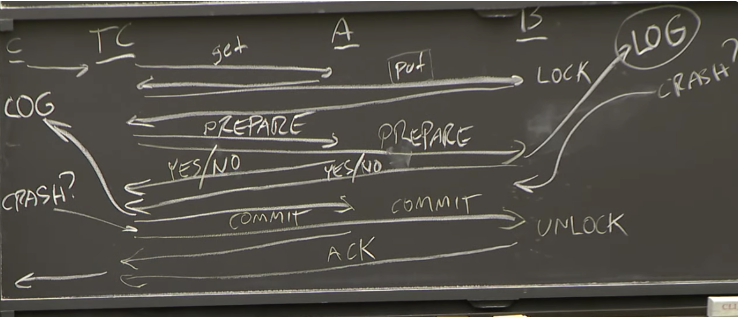

#### TC Crash

若TC没发送COMMIT就宕机了，则不会发生什么。虽然参与者可以从其Log看到事务的信息，但TC不会去让这些事务被提交。

若TC发送一个或多个COMMIT后宕机，则必须要求它重启后也能完成事务，这就要求事务信息在TC本地也要持久化。事务协调者在收到**所有**对于Prepare消息的Yes/No投票后，会将**结果**和**TID**写进Log并持久化到磁盘中，之后才会开始发送Commit消息。这样就可以在恢复后知道哪些事务不是Abort、又没有完全commit，即**做到一半的事务**。对这些事务，只要给全部参与者发COMMIT消息就行了，不会重复执行，也防止漏发。

**TC里的Log的删除时机**是：已收到所有参与者的ACK。因为这样的话，TC就能明白，所有的参与者都知道这个事务被Commit或Abort了，也就不需要再管了。

#### 其它情况

如果TC在统计YES/NO时发现没收集完整（可能是丢包或者参与者崩溃），则可以一直重发。但也可以单方面Abort该事务并广播ABORT消息。如果一个参与者从故障中恢复，发现某个事务一直没消息，于是向TC询问；TC发现本地没有此事务的信息，说明该事务被Abort了，于是向该参与者发对应的ABORT消息。

如果一个参与者在等待PREPARE时超时，说明此事务必然是未被提交的，那么它可以选择单方面Abort掉此事务。后来TC再次发送PREPARE时，参与者会因为不知道此事务从而回复NO，触发总的Abort。这使得该参与者可以及时释放锁。

然而，如果一个参与者在等待COMMIT时超时，则不能决定ABORT或是COMMIT，只能一直等，因为它不知道其他服务器是否收到了COMMIT并完成操作。这种现象称为**Block**，是2PC的特性。


# Spanner

目标：加速只读事务，同时实现Geographic replication（地理区域级别的复制）。

对一个数据库进行分片，然后对每个分片进行replication（使用Paxos，每个分片都属于不同的Paxos组）。但是，每处服务器都会有所有分片的replica。这样的话，如果向就近服务器进行读取时，可以读到所有的数据。

两个问题：
- 由于是Paxos，所以要解决读到过时数据的问题。
- 若涉及多个数据分片，则要接触多个Paxos分组，因此需要分布式事务。

两种事务：读写事务（R/W）和只读事务（R/O）。
## 读写事务（R/W）

使用标准的2PL+2PC。

若我们想让x=x+1和y=x+1，则需要俩读俩写。首先，向x所在组和y所在组的leader分别请求x和y的锁，请求成功后返回x和y的值。然后client会自己计算，得到应该要写回的x和y的值。**client会把所有写请求一次性地发回去**。

>一个锁对应一个数据，有对应锁了才能进行读写。锁信息存在Leader里。

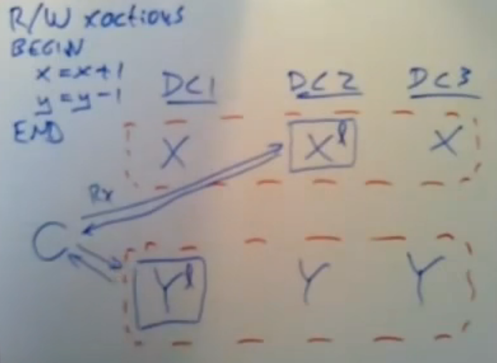

client在写前，会首先选择某一个Paxos组作为TC（事务协调器），例如y所在分组。则写请求里面会带上y的Paxos组的id。

发出写请求后，Leader收到该请求，于是给所有本组成员发送PREPARE消息，并**在得到多数成员响应后向TC发出YES消息**（此PREPARE操作就像其他读写操作一样会被加入到日志中等待应用到状态机）（如果没有crash或者丢掉对应的锁的话，就可以保证执行成功）。

TC收到所有参与者的YES后，给所有参与者的Leader发COMMIT，然后各Leader给自己组的所有replica发送COMMIT。

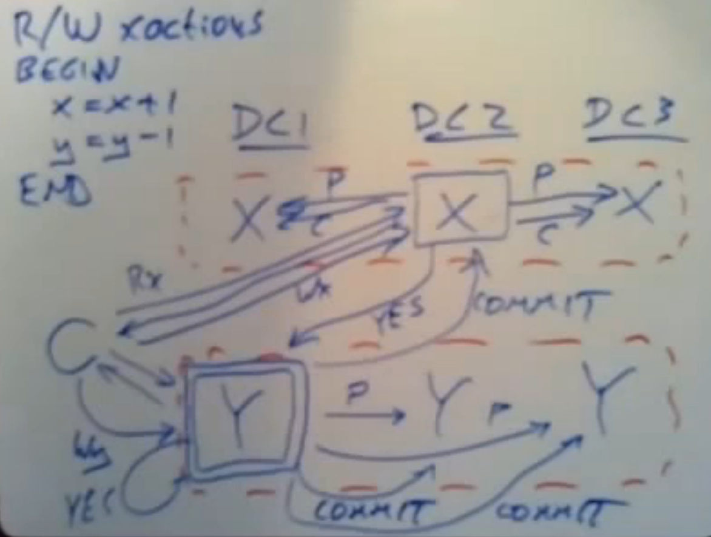

2PC在发送COMMIT前会把表决结果持久化，此处则体现为：TC的Leader将表决结果存储到log并复制到多数服务器，之后才开始发COMMIT。因此，如果TC的Leader出问题了，其他同组的replica都能接手变成TC而不丢失数据。


## 只读事务（R/O）

目标：直接找附近的服务器读，不需要找Leader，也不需要TC。

正确性约束：
1. 让事务的执行保持有序，即一个只读事务的读操作要能看到在其之前所有写操作的结果，且不能看到在它之后的写操作。因此，要让⼀个夹在两个读写事务之间的只读事务的所有读操作都放在这两个读写事务中间
2. 外部一致性（external consistency），等价于线性一致性，即如果一个事务要在前一个事务执行结束后开始执行的话，就必然能读到前一个事务的结果；且所有事务都能读到所有commited的结果，而不能读到过时数据。

即使每次都要求读最新版本也不能保证正确性，原因如下图，T1和T2是读写事务，T3是只读事务。如果T3很慢，导致读在T2的两边分别发生，那么显然我们无法将其线性化，不满足要求。

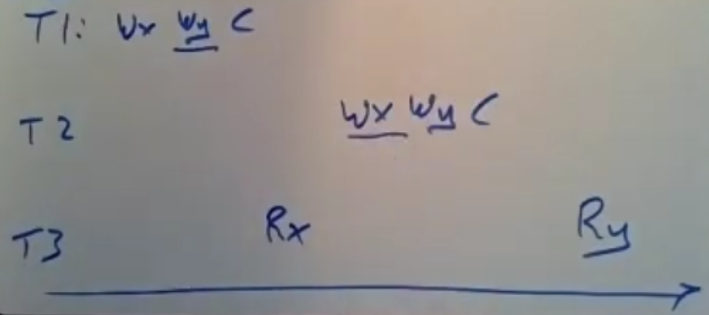

## 正确性问题：快照隔离（Snapshot Isolation）

**目标：忽略过时问题的情况下满足正确性约束。**

每个服务器都维护一个**同步的时钟**。

对于每个事务，都有时间戳（timestamp , TS）。
- R/W TS = Commit Time
- R/O TS = Start Time

目标是让事务拥有时间戳从小到大的逻辑顺序。

每个数据都会有多个版本，每个版本都标记了一个时间戳。读写型事务依然使用2PL和2PC，所以它不用比较时间戳，只需要在完成事务后给新版本标记上Commit Time就好了（此Time来自于Leader）。而只读事务就会去读取比自己的时间戳小的版本里面时间戳最大的数据。

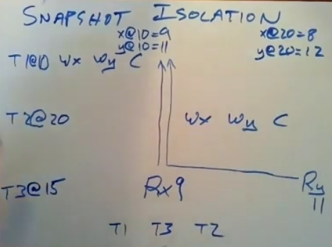

>这样做的合法性在于，T2和T3本质上是并行的，而在线性一致性中我们容许其以任意的形式被执行。

## 过时问题：安全时间（Safe Time）

**目标：保证只读事务不读取过时数据。**

随着事务的不断提交，Leader传来的时间戳也在不断增加。于是，若只读事务的时间戳为15，那就必须等拥有大于等于15的时间戳的事务被传到该replica中。这样就保证没有任何小于等于15的事务被漏掉了。

## 时钟同步问题

Leader给每个读写事务生成时间戳；每个服务器都给在其上的只读事务分配时间戳。

读写事务不受时钟同步问题影响。但在只读事务中，如果它被分配了太大的时间戳，就可能无意义地去等待，甚至导致超时；如果太小，则会读过期的那部分数据，相当于逻辑上一直比Leader慢那么多时间。**这直接导致了外部一致性被违反。**

每个数据中心都有GPS接收器和多台time master服务器。time master服务器通过GPS一直更新时间。数据中心中的服务器定时访问time master以同步时间。

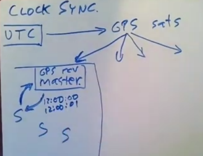

误差来源：
1. 信号传播延迟。
2. 查询请求发送延迟。
3. time master响应延迟。
4. 本地时钟误差（即使同步的那一个瞬间完全准了，后面也必须依靠自己本地的时钟来走钟，不可能精准，有快有慢）。

**True time**: 不返回精准的时间，而是返回TT区间（TT interval），是个形如(earliest,latest)的pair，表示正确的时间必然是这个区间里的某一点。

随着时间的推移，earliest和latest会一直不停地大小变动，但永远包含真实时间并且earliest\<latest。

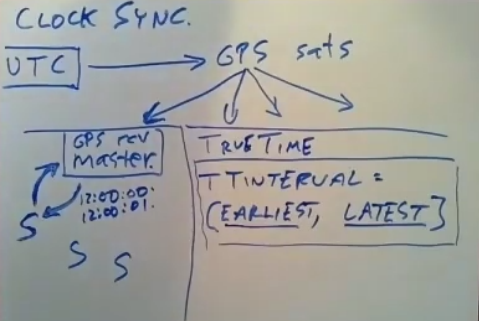

解决方案为**Start Rule**+**Commit Wait**。

**Start Rule**: ⼀个事务所选择的时间戳(TS)等于**TT.now().latest**。这让读写事务在所有已发生的事务之后提交，防止插队；让只读事务等更新的数据，防止读到过时数据。

**Commit Wait**: 当replica收到一个读写事务的commit请求时，不立刻commit，而是**等待直到TS<TT.now().earlist** （注：TS不变，TT.now().earlist会不断变大）后再commit。这就保证，如果真正commit后有只读事务要读这个事务的结果，就会发现读写事务100%在只读事务之前完成，于是可以放心使用读写事务的结果；真正commit前若有只读事务需要读写事务的结果，则只读事务会等待直到读写事务被真正commit，并且读到的数据依然遵循逻辑上的commit时间，满足外部一致性。

>为什么读写事务的commit时间保证早于earlist，但只读事务的TS却选latest？我的想法，对于若两个事务发生的确切时间为t1和t2，且t1<=t2，则只能保证t1.earlist<=t2.latest，其他都不能保证。而让只读事务延期是无害的，读到更新的数据（t1为只读事务，并且t1.latest>t2.earlist，就导致t1早于t2却读到t2)似乎是可容忍的。


# FaRM optimistic concurrency control

所有replica放在同一个数据中心中（没有大的网络延迟问题），且有一个confifiguration manager（配置管理器）（用ZooKeeper实现），决定primary和backup服务器。

每个数据分片对应一个primary和一个backup。

replication方式：一个数据更新了就必须更新所有对应的服务器。容错效果：只要有一个replica还正常工作，那么系统就能正常运行。

有TC，和存储服务器一起运行，但行为类似于Client+TC的混合物。

## 持久化

**服务器将数据都存入RAM**，因此效率非常高。单纯用RAM保存数据无法避免断电，于是需要**NVRAM（⾮易失性RAM）**，即：将所有数据存到RAM上；断电时，启用备用电池，并停止所有操作，然后将RAM内容写到磁盘中。但是NVRAM只能应对断点故障，其他故障需要replica来防范。

## 网络加速

- kernel bypass: 通过对内核保护机制进⾏配置，让应⽤程序直接访问⽹络接⼝卡（NIC）、访问其上的寄存器，控制其行为，以提升网络效率。副作用是TCP的逻辑要应用层来写，但可以用DPDK的⼯具包。
- DMA直接把数据传到应用程序的内存里面；要发送时，让网络接口卡通过DMA获取数据以直接发送。

因此，网络发送不需要内核参与了。

一种特殊的NIC可以支持RDMA(remote direct memory access）（论文中称为one-side RDMA），在不对服务器发出中断信号的情况下，通过NIC接收数据包并通过指令直接对服务器内存中的数据进⾏读写（本质是直接读取，或给⽬标对象的incoming message queue追加消息），由目标对象轮询来进行收取。这个过程没有CPU参与。

## 并发控制

使用**乐观锁并发控制（OCC,optimistic concurrency control）**。读的时候不管有没有权限（锁），直接读；写也是直接发出写请求，但修改会被缓存起来。事务在提交前进行验证（validation），若使用了脏数据（读写过程中被其他事务修改的数据），则会取消提交、尝试重新执行。

FaRM的API编程如下：
```cpp
txCreate() //声明新事务的开始
o=txRead(OID) //读取OID对应数据对象的副本
o.f+=1 //在本地内存中对数据对象的字段进行操作
txWrite(OID,o) //表示更新（不是直接更新，而是进入缓存）
ok=txCommit() //提交事务，此时会发生validation
```

OID是复合的，有以下组成部分：
1. region: 由于服务器内存被划分为区域进行管理，因此要先标记区域，需要区域编号。
2. address: 区域中的地址。

Server Memory由多个region组成，每个region有很多的数据对象，每个数据对象里面有个header，而header的高位处为一个锁、低位处是一个版本号。

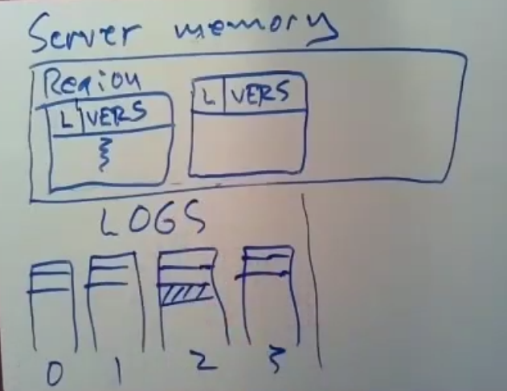

若系统中除自己以外还有四个服务器，则内存中还会保存四个日志（或incoming message queue），RDMA会append这些日志。所有服务器总共有$N^2$个日志。


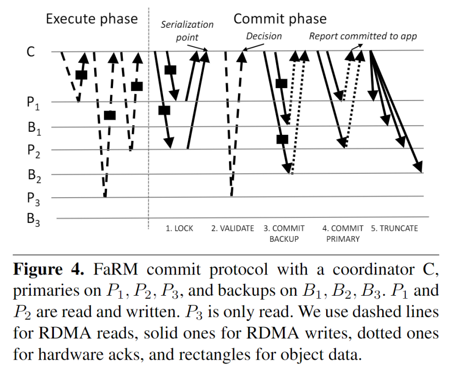

在execute phase中，C会从Primary服务器中获取所有要用于此次事务读或写的数据（及其版本号）。获取到后，即可在本地进行操作，之后进行txCommit以进入commit phase。

lock阶段，C将所有要更新的对象的目标值发送给Primary，使其存入对应的log。log内容为：
1. 想写⼊object的OID
2. C⼀开始读取该object时它的版本号
3. object的新值

然后Primary会轮询这些log，处理新到来的log。如果**对象被锁上了**，则使用RDMA回复No；否则，检查**对象目前的版本号是否与log中的版本号一致**，若不一致则回复No；否则，对其**加锁**并回复Yes。


