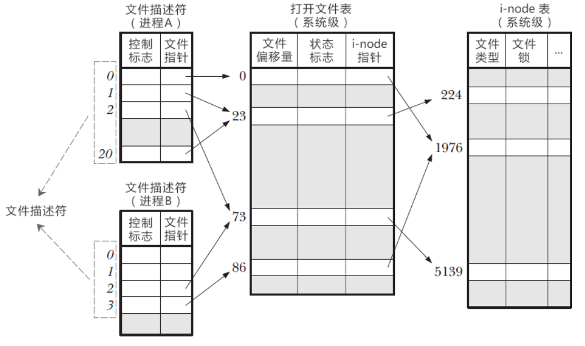

# 文件


## inode

磁盘中固定有一个区域要用来放inode。每个文件被创建的时候都会创建对应的inode，里面存储了文件的属性，包括使用了哪些块、各种信息等。每个inode都有一个inode号作为唯一标识。

由于inode一个文件的信息被存在了一起，因此inode的读取比较高效；只有在打开文件的时候才会把该文件所对应的inode内容存入内存，而不像文件分配表（File Allocation Table, FAT）要把整个表都读到内存中。

## 文件描述符（file descriptor）

用于唯一指定被打开的文件。用整数表示。每个文件被打开的时候都会获得当前未被占用的最小的文件描述符。

前三个文件描述符是固定的：0是标准输入，1是标准输出，2是标准错误。

- 进程级的文件描述符表：PCB（的一项）的内部有一个文件描述符表（File descriptor table），用于标记它所在的进程里面所有打开的文件。与其他进程独立。
- 系统级的打开文件描述符表：与被打开的文件一一对应，存有inode的id来表示指向的文件。




# 进程

## fork

作用：复制当前进程以创建子进程。是linux中唯一的创建新进程的方法。一个进程调用fork（）函数后，系统先给新的进程分配资源，例如存储数据和代码的空间。然后把原来的进程的所有值都复制到新的新进程中，只有少数值与原来的进程的值不同。相当于克隆了一个自己。

复制之后，fork会返回一个值，有三种返回：
- 出错，返回负值。
- 对于父进程，返回创建的子进程的值。
- 对于子进程，返回0。

因此，可以通过判断返回值是否为0来判断当前是原进程还是被新建的进程。

>在Linux中，fork的时候**只复制当前线程到子进程**，也就是说除了调用fork的线程外，其他线程在子进程中“蒸发”了。假设在fork之前，一个线程对某个锁进行的lock操作，即持有了该锁，然后另外一个线程调用了fork创建子进程。可是在子进程中持有那个锁的线程却"消失"了，从子进程的角度来看，这个锁被“永久”的上锁了，因为它的持有者“蒸发”了。
## exec

作用：根据指定的文件名找到可执行文件,替换当前进程的**代码、数据、堆和栈**等内容，但不会改变**文件描述符、进程 ID 和父进程 ID**等信息。不会创建新的进程。

标准C库的exec函数族里面的系统调用被定义在`<unistd.h>`头文件中，包括：

```c
//执行一个指定路径下的程序，并传递给它命令行参数列表。
int execl(const char *path, const char *arg0, …, const char *argn, (char *) NULL);

//执行一个指定路径下的程序，并传递给它命令行参数列表。
int execv(const char *path, char *const argv[]);

//执行一个指定路径下的程序，并传递给它命令行参数列表以及环境变量。
int execle(const char *path, const char *arg0, …, const char *argn, (char *) NULL, char *const envp[]);

//执行一个指定路径下的程序，并传递给它命令行参数列表以及环境变量。
int execve(const char *path, char *const argv[], char *const envp[]);

//在当前的环境变量中查找指定的可执行文件，并运行它。
int execlp(const char *file, const char *arg0, …, const char *argn, (char *) NULL);

//在当前的环境变量中查找指定的可执行文件，并运行它。
int execvp(const char *file, char *const argv[]);
```

>l表示参数list，一个一个写进函数参数里面去（`char*`）；v则直接传参数数组（`char**`）。
>e表示环境变量envp。
>p表示不从路径找可执行文件，而是直接在环境变量里面匹配一个。

这些函数的返回值：
- 如果成功，则不会返回。
- 如果失败，则返回 -1，并设置 errno 变量来表明错误类型。

# 虚拟化

虚拟化架构模式
- **Type I（裸金属型）**：Hypervisor 直接运行在**物理硬件**上，不依赖宿主操作系统，性能更优、隔离性更强，适合对实时性、安全性要求高的场景（如嵌入式、关键业务系统）。
- **Type II（宿主型）**：Hypervisor 运行在 **宿主操作系统（如 Linux、Windows）** 之上，依赖宿主 OS 管理硬件资源，部署更灵活，但性能和隔离性易受宿主系统影响。


