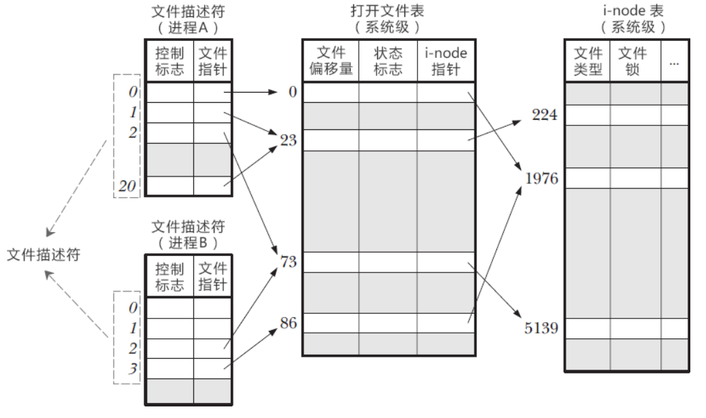

# 文件


## inode

在 inode 类文件系统中，inode 记录文件属性及数据位置等元数据；具体磁盘布局由文件系统决定，不一定是单个固定区域。inode 号在所属文件系统内标识 inode，多个硬链接可指向同一个 inode。

inode 可以按需读入并缓存；路径查找、stat 等也可能访问它，并非只有 open 才加载。不要把 inode/FAT 的区别等同于“按文件缓存/必须全表载入”，缓存策略还取决于实现。

## 文件描述符（file descriptor）

用于唯一指定被打开的文件。用整数表示。每个文件被打开的时候都会获得当前未被占用的最小的文件描述符。

约定 0、1、2 分别用于标准输入、标准输出、标准错误；它们仍可被关闭或重定向，并非不可改变。

- 进程级的文件描述符表：PCB（的一项）的内部有一个文件描述符表（File descriptor table），用于标记它所在的进程里面所有打开的文件。与其他进程独立。
- 系统级的 **open file description**：记录偏移和打开状态等。同一文件多次 open 可产生不同描述；dup 或 fork 得到的描述符又可共享同一个描述及偏移。[open(2)](https://man7.org/linux/man-pages/man2/open.2.html)。




# 进程

## fork

作用：复制当前进程以创建子进程，可以记作“克隆自己”，但不是 Linux 唯一的创建机制（还有 clone 等）。地址空间逻辑上分离，实际常通过写时复制共享物理页，不是一开始复制全部数据。[fork(2)](https://man7.org/linux/man-pages/man2/fork.2.html)。

复制之后，fork会返回一个值，有三种返回：
- 出错，返回负值。
- 对于父进程，返回子进程的 PID。
- 对于子进程，返回0。

因此，可以通过判断返回值是否为0来判断当前是原进程还是被新建的进程。

>在Linux中，fork的时候**只复制当前线程到子进程**，也就是说除了调用fork的线程外，其他线程在子进程中“蒸发”了。假设在fork之前，一个线程对某个锁进行的lock操作，即持有了该锁，然后另外一个线程调用了fork创建子进程。可是在子进程中持有那个锁的线程却"消失"了，从子进程的角度来看，这个锁被“永久”的上锁了，因为它的持有者“蒸发”了。
## exec

作用：根据指定的文件名找到可执行文件,替换当前进程的**代码、数据、堆和栈**等内容，保留进程 ID 和父进程 ID，不创建新进程。文件描述符通常保留，但设置了 **FD_CLOEXEC** 的会关闭；其他属性也有各自的保留/重置规则。[execve(2)](https://man7.org/linux/man-pages/man2/execve.2.html)。

POSIX 的 exec 函数族声明在 `<unistd.h>` 中；下列多为 libc 封装，Linux 上 execve 是系统调用。下面用省略号示意可变参数：

```c
//执行一个指定路径下的程序，并传递给它命令行参数列表。
int execl(const char *path, const char *arg0, …, const char *argn, (char *) NULL);

//执行一个指定路径下的程序，并传递给它命令行参数列表。
int execv(const char *path, char *const argv[]);

//执行一个指定路径下的程序，并传递给它命令行参数列表以及环境变量。
int execle(const char *path, const char *arg0, …, const char *argn, (char *) NULL, char *const envp[]);

//执行一个指定路径下的程序，并传递给它命令行参数列表以及环境变量。
int execve(const char *path, char *const argv[], char *const envp[]);

//在当前的环境变量中查找指定的可执行文件，并运行它。
int execlp(const char *file, const char *arg0, …, const char *argn, (char *) NULL);

//在当前的环境变量中查找指定的可执行文件，并运行它。
int execvp(const char *file, char *const argv[]);
```

>l表示参数list，一个一个写进函数参数里面去（`char*`）；v则直接传参数数组（`char**`）。
>e表示环境变量envp。
>p 表示文件名不含斜线时，按 PATH 环境变量列出的目录搜索；并非在任意环境变量中匹配。

这些函数的返回值：
- 如果成功，则不会返回。
- 如果失败，则返回 -1，并设置 errno 变量来表明错误类型。

# 内核

用户态的ioctl可以将文件描述符+操作码+参数传给内核模块；

内核模块可以自定义文件操作结构体以自定义设备的read, write, ioctl的行为。

下面是原项目片段；`class_create` 的版本分支依赖当时使用的内核，不能当作所有主线内核的兼容模板。移植时核对目标内核头文件及返回值处理。
```C++
static int shyper_service_init(void) {
    // ...

    /*初始化cdev结构*/
    cdev_init(&shyper_dev.cdev, &shyper_fops);
    /* 注册字符设备 */
    ret = alloc_chrdev_region(&devno, 0, 2, "shyper");

    if (ret < 0) {
        WARNING("%s: alloc dev fail, errno %d", __func__, ret);
    } else {
        INFO("major %d minor %d", MAJOR(devno), MINOR(devno));
    }
    cdev_add(&shyper_dev.cdev, devno, 2);
    
    #ifdef CONFIG_RISCV
        #if LINUX_VERSION_CODE >= KERNEL_VERSION(6, 0, 0)
            shyper_class = class_create("shyper");
        #else
            shyper_class = class_create(THIS_MODULE, "shyper");
        #endif
    #else
        shyper_class = class_create(THIS_MODULE, "shyper");
    #endif
    
    device_create(shyper_class, NULL, devno, NULL, "shyper");
    
    // ...
}

/*文件操作结构体*/
static const struct file_operations shyper_fops = {
    .open = shyper_open,
    .release = shyper_release,
    .compat_ioctl = shyper_ioctl,
    .unlocked_ioctl = shyper_ioctl,
    .read = shyper_read,
};

static ssize_t shyper_read(struct file *filp, char __user *buffer, size_t count,
                           loff_t *ppos) {
    void *addr = queue_pop(shyper_dev.usr_arg_queue);
    if (addr == 0) {
        return 0;
    }
    if (copy_to_user(buffer, addr, count))
        return -EFAULT;
    return count;
}
```

# 虚拟化

虚拟化架构模式
- **Type I（裸金属型）**：Hypervisor 直接运行在**物理硬件**上，不依赖宿主操作系统，性能更优、隔离性更强，适合对实时性、安全性要求高的场景（如嵌入式、关键业务系统）。
- **Type II（宿主型）**：Hypervisor 运行在 **宿主操作系统（如 Linux、Windows）** 之上，依赖宿主 OS 管理硬件资源，部署更灵活，但性能和隔离性易受宿主系统影响。


# 构建rootfs

## buildroot

[Buildroot根文件系统的构建 — \[野火\]嵌入式Linux镜像构建与部署——基于LubanCat-i.MX6ULL开发板 文档](https://doc.embedfire.com/lubancat/build_and_deploy/zh/latest/building_image/buildroot/buildroot.html)

```shell
# 配置
make menuconfig

# 编译
sudo make -j12

# 清空编译结果（不删除配置）
sudo make clean
```


