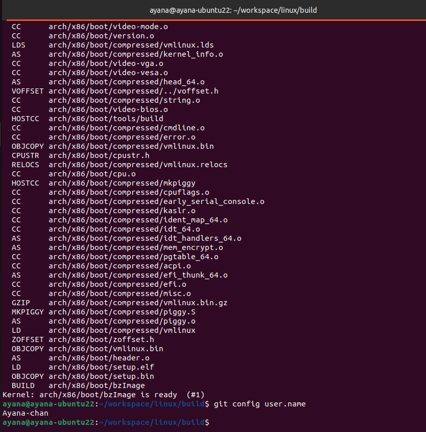

显示github昵称：
```bash
git config user.name
```


# 编译rust for linux

安装bindgen：`cargo install --locked --version $(scripts/min-tool-version.sh bindgen) bindgen-cli`

`ARCH=x86_64`

bindgen会根据系统的c语言接口生成rust接口，而kernel crate则对这些接口进行了安全抽象，供驱动开发者使用。

编译成功：



