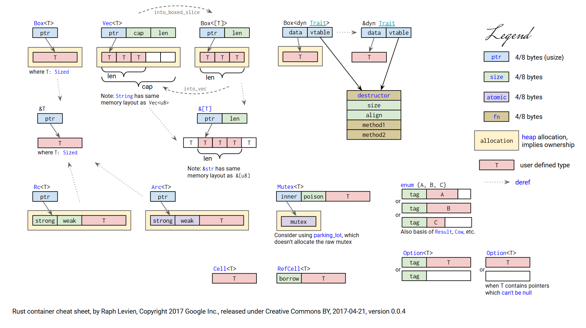

[← Rust](Rust.md)

# 安装与起步

[Rust使用国内Crates 源、 rustup源 |字节跳动新的 Rust 镜像源以及安装rust\_rust镜像-CSDN博客](https://blog.csdn.net/inthat/article/details/106742193)

[Rust安装配置\_rust下载到d盘\_Andreby的博客-CSDN博客](https://blog.csdn.net/andrewby/article/details/75139736)

Clion中，安装Rust插件，进行如下配置：

- Toolchain Location: `...\.rustup\toolchains\stable-x86_64-pc-windows-gnu\bin`
- Standard Library: `...\.rustup\toolchains\stable-x86_64-pc-windows-gnu\lib\rustlib\src\rust`

>这里不知道什么时候可以自动填入了，且toolchain路径为`...\.cargo\bin`。可能是因为我下了且在用nightly版本。

如果Standard Library找不到的话，运行下方命令即可：
```bash
rustup component add rust-src --toolchain stable-x86_64-pc-windows-gnu
```

`rustup doc`可以离线查看教程。

换源，`...\.cargo\config`：

```config
[source.crates-io]
# 替换成你偏好的镜像源
replace-with = 'tuna'
 
# 清华大学 5mb
[source.tuna]
registry = "https://mirrors.tuna.tsinghua.edu.cn/git/crates.io-index.git"
 
# 中国科学技术大学 2mb
[source.ustc]
registry = "https://mirrors.ustc.edu.cn/crates.io-index"
# 上海交通大学 2mb
[source.sjtu]
registry = "https://mirrors.sjtug.sjtu.edu.cn/git/crates.io-index"
 
# rustcc社区 2mb
[source.rustcc]
registry = "https://crates.rustcc.cn/crates.io-index"
# 字节跳动 10mb
[source.rsproxy]
registry = "https://rsproxy.cn/crates.io-index"
```

# 基础

Rust是静态强类型的。

代码包或库被称为crate。

变量默认为immutable，即`不可变变量`，不可进行二次赋值；想要让它可变需要在声明时加上`mut`。

- 不可变变量可以声明赋值分开，即赋值是不确定的，仅仅是无法二次赋值；
- 而const常量必须进行一次初始化，且必须指定类型。

use很像cpp的using namespace。有的crate是默认导入（prelude，预导入模块）的，如std::io。

```rust
use std::io;  
  
fn main() {  
    println!("Input: ");  
    let mut input=String::new(); //声明并用String的new赋值一个可变变量
    io::stdin().read_line(&mut input).expect("Fail to read line");  
    //read_line返回 io::Result，交由expect处理
    println!("Your input is: {}",input)  
}
```

trait: 可视为接口，提供了一些方法，如`rand::Rng`。

不应当使用`while true{...}`来表示无限循环，而是使用`loop{...}`，因为rust在哲学上追求高度一致，while仅用于while condition。

数字可以使用下划线分割来增加可读性，如100_000。

变量名、函数名使用snack_case命名规范，其他都是大驼峰。

有些东西在预导入模块（prelude）里，不需要use。

T代表所有类型，包括&T和&mut T；而&T和&mut T完全没有交集。

Rust container 内存结构:


## Move

若一个结构体没有实现Copy trait（标量类型自带实现），那么赋值的时候类似于cpp的`std::move`，会将**所有权**转交出去。

这是rust的一种抽象，相当于让编译器来检测move行为是否规范。

它并不是真正的内存Move，毕竟无法在编译期确定所有的所有权归属，某些地方Move依旧会在内存里面进行Copy，如[深入理解 move - Rust语言圣经(Rust Course)](https://course.rs/profiling/performance/deep-into-move.html)。但是，若是正常地、较合理地使用Move的话，似乎很难出现大型的隐式Copy，因为那些Move所在的代码基本也是Cpp里面的最佳实践，很多都是可以被编译器优化的，不会产生很大的内存复制消耗。

## shadowing

rust允许定义同名的新变量来shadow（隐藏）旧变量，常用于类型转换。新旧的变量的类型可以完全不同，也可以都是不可变变量。

## 数据类型

`let valName: type = value`可以显式定义变量类型。

类型推断可以做到从下往上推断。而所有变量应当在编译期就能推断出确定的类型。

### 标量类型

#### 整数


| Length  | Signed | Unsigned |
| ------- | ------ | -------- |
| 8-bit   | i8     | u8       |
| 16-bit  | i16    | u16      |
| 32-bit  | i32    | u32      |
| 64-bit  | i64    | u64      |
| 128-bit | i128   | u128     |
| arch    | isize  | usize    |

isize和usize由计算机架构决定，64位计算机就是64bit。主要用于对某种集合进行索引操作。

整数默认类型是i32。

字面值：

| Number Literals | Example     |
| --------------- | ----------- |
| Decimal         | 98_222      |
| Hex             | 0xff        |
| Octal           | 0077        |
| Binary          | 0b1111_0000 |
| Byte(u8 only)   | b'A'        |

除Byte以外都能加类型后缀，如57u8。

在调试模式下发生溢出则会panic；发布模式下256u8会变成0,257u8变成11。

#### 浮点

IEEE-754

- f32，32位，单精度
- f64，64位，双精度（默认）
#### 布尔

bool

占1个字节。

#### 字符

char

占4个字节。使用unicorn编码。


### 复合类型

Rust提供了两个基本复合类型：元组Tuple和数组。

#### 元组

使用点-索引进行取值。

```rust
let tp: (i32, i64, f64) = (45, 32, 6.7);  
println!("tp: {},{},{}", tp.0, tp.1, tp.2); 
```

可以使用解构赋值来拆分：

```rust
let tp: (i32, i64, f64) = (45, 32, 6.7);  
let (t0, t1, t2) = tp;  
println!("tp: {},{},{}", t0, t1, t2);
```

也可以以此让函数返回多个值：

```rust
fn calculate_values() -> (i32, i32) {
    let x = 5;
    let y = 10;
    (x, y)
}
```

#### 数组

长度是固定的。

用数组而不用vector通常是为了保存固定长度的数据或者让数据存在栈而非堆上。

```rust
let array = [12,34,63];
```

标注类型时可以标注长度，如：
```rust
let arr: [i32:5] = [1,2,3,4,5]
```

`let arr = [3;5]`等价于`let arr = [3,3,3,3,3]`。

rust禁止数组越界访问，会在运行时报错。编译时只能检查出简单的越界错误。

## 溢出问题

[数值类型 - 溢出问题 - Rust语言圣经(Rust Course)](https://course.rs/basic/base-type/numbers.html#%E6%95%B4%E5%9E%8B%E6%BA%A2%E5%87%BA)

rust在数字计算时, 会检测溢出, panic掉程序. 虽然`--release`下不会panic, 会和cpp一样处理, 但依然要视其为错误行为. 要想显式表示一次运算可以接受溢出, 应当使用规定的方法:
- 使用 `wrapping_*` 方法在所有模式下都按照补码循环溢出规则处理，例如 `wrapping_add`.
- 如果使用 `checked_*` 方法时发生溢出，则返回 `None` 值.
- 使用 `overflowing_*` 方法返回该值和一个指示是否存在溢出的布尔值.
- 使用 `saturating_*` 方法，可以限定计算后的结果不超过目标类型的最大值或低于最小值.

`u32.wrapping_add(u32)` 等价于模 $2^{32}$ 加法.


## 语句与表达式

>表达式加了分号就算是语句了。

语句的返回值为空的Tuple：`()`，而表达式返回其值。块的最后一个表达式或语句会成为块的返回值：

```rust
let y = {
	let x=2;
	x+1
};

let z = if 99>88{ 1 } else { -1 }; //为了满足一致性，以此替代三目表达式
```
## 函数

函数不需要关心前后关系，不需要前向声明。

```rust
fn fun_name(x: i32,y: i32) -> i32 {
	println!("fun {} {}",x,y);
	x+y
}
```

## Range类型

`(1..4)`就是个Range类型，表示 $[1,4)$ ，即1,2,3。`(1..4).rev()`则翻转变成3,2,1。而`(1..=4)`则为 $[1,4]$ ，包含4。

可以被for循环遍历，也可使用迭代器方法。

```rust
//阶乘
pub fn factorial(num: u64) -> u64 {
	(1..=num).fold(1, |acc, e| acc * e)
}
```
## for循环

```rust
let arr = [11, 22, 33, 44, 55];  
//使用迭代器
for ele in arr.iter() {  
    println!("for1: {}", ele);  
}
//使用Range
for index in 0..5 {  
    println!("for2: {}", arr[index]);  
}
//enumerate对迭代器进行包装，返回Tuple
for (i,&ele) in arr.iter().enumerate(){  
    println!("for3: {} {}", i, ele);  
}
```

for不仅可以解构，还能通过`&item`接收来进行解引用，可以理解为`&item=&i32`即为`item=i32`。

```rust
fn func1(list: &[i32]){
	let mut largest: i32 = 0;
	for &item in list{
		if item > largest {
			largest = item;
		}
	}
	largest
}
//等价于
fn func2(list: &[i32]){
	let mut largest: i32 = 0;
	for item in list{
		if *item > largest {
			*largest = item;
		}
	}
	largest
}
```

### 跳出多层循环

break想要跳出多层循环时，传统的写法要么使用标志变量，要么使用goto，而rust可以通过给循环起名字来选择跳到哪一层。

```rust
let a = vec![1;5];
let b = vec![2;6];
'outer: for i in a {
	println!("{}", i);
	'inner: for j in b.iter() {
		print!("{}", j);
		break 'outer;   // 跳出外层循环，如果不加标记，默认跳出最内层循环
	}
}
```

## 结构体

```rust
//定义
struct StructName{
	variable_name: type,
	...
}
```

```rust
//实例化
//缺少字段会报错
let object_name = StructName{
	variable_name: value,
	...
};
```

整个struct要么都可变，要么都不可变。

像js一样，字段值和给它赋值的变量名一样时可简写，如`v_name: v_name`可直接写成`v_name`。

struct的所有引用变量都要进行生命周期标注。标注后，该变量的生命周期必须要长于struct。

### struct更新语法

如果S的两个实例s1和s2只有若干字段不同，则可以先给这几个字段赋值，然后加上`..s2`：

```rust
let person = Person {
	name: String::from("Alice"),
	age: 20,
};
let updated_person = Person {
	name: String::from("Bob"),
	..person
};
```

### Tuple Struct

类似于对Tuple的typedef。

```rust
struct Color(i32,i32,i32);
let black = Color(0,0,0);
```

### Unit-Like Struct

没有定义任何字段是struct，与`()`（空Tuple）（单元类型）相似。想实现trait但不需要存储数据的时候会用到。


### 方法

```rust
struct Rectangle {
    width: u32,
    height: u32,
}

impl Rectangle {
    fn area(&self) -> u32 {
        self.width * self.height
    }
}
```

方法的第一个参数总是self，非引用、不可变引用或可变引用都行。

调用方法时，会自动给调用方法的对象加上`&`、`&mut`或`*`，以匹配方法中的self。

>一个结构体的可以写多个impl块。

### 关联函数

如果定义的时候没有传入self，则称为关联方法。对象无法调用关联方法，只能使用`结构体名::关联函数名`的形式调用，类似于其他语言的静态函数。

```rust
struct Circle {
    radius: f64,
}

impl Circle {
    fn new(radius: f64) -> Circle {
        Circle { radius }
    }
}
```

### 私有性

给struct加上pub后，可以被上级模块访问到，但其内部的成员默认都是私有的。想让成员公有则必须在成员的前面也加上pub。

### 结构化绑定

以结构体的方式解构变量。

```rust
let mut a = A {
        x: 1,
        y: 2,
    };
let A { x, y } = &mut a; //x和y都是&mut引用且生命周期相同
```

## 枚举

枚举的值种类叫做变体。枚举的访问使用`MyEnum::V1`。

```rust
enum Direction {
    North,
    South,
    East,
    West,
}

let direction = Direction::North;
```

变体可以携带数据，且各个变体能有不同的类型：

```rust
enum Message {
    Quit,
    ChangeColor(i32, i32, i32),
    Move { x: i32, y: i32 }, //类结构体枚举变体(struct-like enum variant)
    Write(String),
}

let msg = Message::ChangeColor(0, 160, 255);
```

枚举也能和方法一样用impl定义方法。

### 私有性

给enum加上pub后，可以被上级模块访问到，且其内部的成员默认都为公共。


## Option枚举

是为了去除null而诞生的，表示该类型变量可空。不用`Option<T>`的都可以直接视为不可能空，可放心使用。

在预导入模块中，`Option<T>`、`Some(T)`、`None`都是能直接用的。

```rust
//标准库中的定义
enum Option<T>{
	Some(T),
	None, //表示变量为空
}
```

`Option<T>`和`T`被视为两种类型，不能混用。若想把`Option<T>`当成`T`用，则需要先进行类型转换（相当于强制检测一次null）。

```rust
let num1: Option<i32> = None;
let num2: Option<i32> = Some(5);
```

使用match对空进行判断：

```rust
match x {
	None => println!("Empty"),
	Some(i) => println!("{}",i),
}
```

### &Option(x) Option(&x)
`&Option(x)`严格弱于`Option(&x)`。使用`as_ref()`来转化。

### as_deref

可以触发Some内数据的Deref trait，可以让`Option<String>`被转变为`Option<&str>`，否则使用`as_deref`只能变成`Option<&String>`。

```rust
fn main() {
    let opt: Option<String> = Some("some value".to_owned());
    let value = opt.as_deref().unwrap_or("default string");
}
```

### flatten

把`Option<Option<T>>` 拍平成 `Option<T>`.

### unwrap_or_default

使用`unwrap_or_default()`，在Some时返回提取的内容，在None时返回Default trait的`default()`的结果。

### and & and_then

`and(x)`: 如果是Some，则返回`Some(x)`，否则直接返回None。

`and_then(|x| {...})`: 如果是Some，则将内部数据当做闭包参数调用闭包，且闭包返回值类型是Option；否则直接返回None。


### 将`Option<String>`变成`Option<&str>`

使用[as_deref](#as_deref).

```rust
fn main() {
    let opt: Option<String> = Some("some value".to_owned());
    let value = opt.as_deref().unwrap_or("default string");
}
```


### `Option<T>`克隆为`Option<Arc<T>>`

```rust
pub fn get_t_ref(&self) -> Option<Arc<T>> {
	self.t_var.as_ref().map(Arc::clone)
}
```

## 打印

使用`#[derive(Debug)]`派生宏，使得ST由Debug trait派生；打印时使用`{:?}`即可行内打印，使用`{:#?}`即可换行打印。这样可以完整地打印结构体或枚举。

```rust
#[derive(Debug)]
struct ST{
	v1: i32,
	v2: f64,
}

let st = ST{
	v1: 1,
	v2: 3.5,
};
println!("{:?}",st)
println!("{:#?}",st)

// 输出：
// ST { v1: 1, v2: 3.5 }  
// ST {  
//     v1: 1,  
//     v2: 3.5,  
// }
```

`dbg!`宏可以在打印的时候输出代码所在行编号，以及被打印的表达式本身。没有`format!`相关语法，只能打印完整的一个表达式。会获得表达式的所有权，因此必要时可以通过传引用。

```rust
dbg!(12 + 13);

// 输出：
// [src\main.rs:17] 12 + 13 = 25
```

在`println!`的`{}`里面加东西之后, 会影响**整个**输出情况, 例如以十六进制的形式打印数组:
```rust
println!("{:08x?}", my_vec);
```


## 错误

Rust没有异常系统。

- 可恢复错误: `Result<T,E>`
- 不可恢复错误: `panic!`宏

### 不可恢复错误 Panic

panic发生时，默认会**展开（unwind）** 调用栈，往回走，把遇到的所有函数的数据都给清理掉。可以选择不展开，而是**中止（abort）**，不清理而直接停止程序，由操作系统回收内存。中止也可以让二进制文件更小。

```toml
[profile.release]
panic = 'abort'
```

为了让panic发生时打印回溯错误信息，需要：

```bash
#windows
set RUST_BACKTRACE=1 && cargo run
#linux
RUST_BACKTRACE=1 cargo run
```

### 可恢复错误 Result

```rust
enum Result<T,E> {
	Ok(T),
	Err(E),
}
```

可以把T或E写成`()`表示不关心该返回值。
#### 错误处理

可以提取出Err的参数热然后调用kind()以进一步match错误类型：

```rust
use std::fs::File;
use std::io::ErrorKind;

let file = File::open("non_existent_file.txt");

match file {
    Ok(_) => println!("File opened successfully"),
    Err(e) => match e.kind() {
        ErrorKind::NotFound => println!("File not found"),
        ErrorKind::PermissionDenied => println!("Permission denied"),
        other => println!("Some other error: {:?}", other),
    },
}
```

也可以直接调用**unwrap**方法，如果是Ok则返回Ok的数据，否则调用panic!。但无法自定义panic信息。

```rust
let file = File::open("non_existent_file.txt").unwrap();
```

若调用**expect**方法即可自定义panic信息。

```rust
let file = File::open("non_existent_file.txt").expect("Expect Panic Msg");
```

#### 错误传递

只要返回值为result，就可以传递错误，如可以写为`Result<String,io::Error>`。

使用`?`运算符可以在输出为Result::Err的时候自动将其return。

但是使用`?`时要注意，它在成功的时候返回的并不是Result，因此正确地返回时应当用Ok再做包装。

在`?`返回的Err与要求的返回值不匹配时，会隐式地调用from函数进行转换，前提是转化的目标错误对原错误实现了from函数。

```rust
use std::fs::File;
use std::io;
use std::io::Read;

fn read_file() -> io::Result<String> { //等价于Result<String,io::Error>
    let mut f = File::open("file.txt")?;
    let mut buffer = String::new();

    f.read_to_string(&mut buffer)?; //等价于match到Err(e)后return Err(e)

    Ok(buffer)
}

fn main() {
    match read_file() {
        Ok(content) => println!("File content: {}", content),
        Err(e) => println!("An error occurred: {}", e),
    }
}
```

#### Result转Option

使用`ok()`或`err()`方法可以将Result枚举转换为Option枚举：
```rust
let x: Result<u32, &str> = Ok(2);
assert_eq!(x.ok(), Some(2));

let x: Result<u32, &str> = Err("Nothing here");
assert_eq!(x.ok(), None);
```
### 错误使用指南

如果确定必然是Ok的，则直接使用unwrap获取结果值。

## 解构赋值

```rust
let p = Point{ x: 1 , y: 3 };
let Point{ x_num , y_num } = p;
let Point{ x , y } = p; //解构的变量名和结构体的成员变量名相同的时候可简写
```

## 静态变量 static

```rust
static MY_STATIC_VA: &str = "Hello World";
static mut COUNT: u32 = 0;
```

- 使用SCREAMING_SNAKE_CASE来命名
- 必须指定类型
- 存储引用时，生命周期只能是`'static`

即使是可变静态变量，对其的修改也是不安全的，要在unsafe中进行。

不能直接用RefCell，因为不能保证线程安全（有内部可变性的类型也都受此约束），必须unsafe地实现Sync trait，对其做一层封装。例如：
```rust
pub struct UPSafeCell<T> {
    /// inner data
    inner: RefCell<T>,
}

unsafe impl<T> Sync for UPSafeCell<T> {}

impl<T> UPSafeCell<T> {
    /// User is responsible to guarantee that inner struct is only used in
    /// uniprocessor.
    pub unsafe fn new(value: T) -> Self {
        Self { inner: RefCell::new(value) }
    }
    /// Panic if the data has been borrowed.
    pub fn exclusive_access(&self) -> RefMut<'_, T> {
        self.inner.borrow_mut()
    }
}
```

当一个静态变量需要在运行时进行赋值时，可以使用`lazy_static`外部库，让`lazy_static!`宏中的静态变量在首次被使用时才赋值。
## main函数

main函数的默认返回值为`()`，即单元类型。但也可以改成`Result<String, Box<dyn std::error::Error>>`，表示可以接收**任意错误**，但要在main末尾添上`Ok(())`。

```rust
use std::fs::File;
use std::io::Read;

fn read_file() -> Result<String, Box<dyn std::error::Error>> {
    let mut f = File::open("file.txt")?;
    let mut buffer = String::new();

    f.read_to_string(&mut buffer)?;

    Ok(buffer)
}

fn main() -> Result<(), Box<dyn std::error::Error>> {
    let content = read_file()?;
    println!("File content: {}", content);
    Ok(())
}
```

