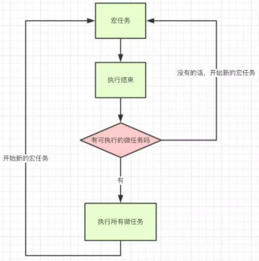

# async/await

使用async的函数不会被阻塞，可以视作每次调用该函数都会开启一个新的线程去异步执行。

对于一个async函数可以进行await，可以视作当前线程阻塞等待该async函数调用结束。await本身也只能写在async函数内。

async函数直接返回的是promise，可以进行then。

被await的async函数返回的是函数的返回值而非promise。

宏任务和微任务都是队列，宏任务有script、setTimeout、setInterval等，微任务有Promise.then catch finally、process.nextTick等。先执行第一个宏任务，执行结束后，执行所有的微任务，然后执行下个宏任务。

