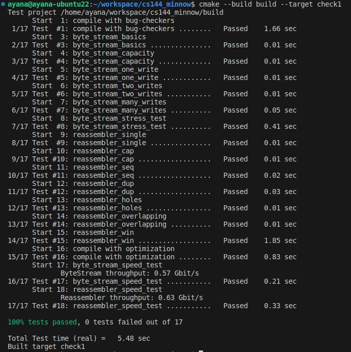

# checkpoint 0
## 环境

ubuntu20.04默认apt不到gcc12，需要：[ubuntu 22.04 切 gcc/g++ 版本 - 知乎](https://zhuanlan.zhihu.com/p/639332690)

CMake 3.24.2也要手动安装：[Ubuntu安装cmake-3.24.2（成功案例）\_ubuntu 安装cmake\_处女座佩奇的博客-CSDN博客](https://blog.csdn.net/qq_42264030/article/details/128142926)

vscode的架构选择linux-gcc-x64就没有红线了。
## 尝试

`Fetch a Web page`时要快速地输入那几条命令，否则会报超时。
```bash
ayana@ayana-ubuntu22:~$ telnet cs144.keithw.org http
Trying 104.196.238.229...
Connected to cs144.keithw.org.
Escape character is '^]'.
GET /hello HTTP/1.1
Host: cs144.keithw.org
Connection: close

HTTP/1.1 200 OK
Date: Tue, 17 Oct 2023 02:36:11 GMT
Server: Apache
Last-Modified: Thu, 13 Dec 2018 15:45:29 GMT
ETag: "e-57ce93446cb64"
Accept-Ranges: bytes
Content-Length: 14
Connection: close
Content-Type: text/plain

Hello, CS144!
Connection closed by foreign host.
```

```bash
ayana@ayana-ubuntu22:~$ netcat -v -l -p 9090
Listening on 0.0.0.0 9090
Connection received on localhost 55182
aaa
abc
^C

ayana@ayana-ubuntu22:~$ telnet localhost 9090
Trying 127.0.0.1...
Connected to localhost.
Escape character is '^]'.
aaa
abc
Connection closed by foreign host.
```

the socket looks like an ordinary **file descriptor** (similar to a file on disk, or to the stdin or stdout I/O streams).When two stream sockets are connected, any bytes written to one socket will eventually come out in the same order from the other socket on the other computer.

Internet datagrams: 数据报，被尽力发到对方。
1. lost
2. delivered out of order
3. delivered with the contents altered
4. duplicated and delivered more than once.

**“best-effort datagrams”** (the abstraction the Internet provides) --> **“reliable byte streams”** (the abstraction that applications usually want)

## 开发标准

>We want to avoid “paired” operations (e.g. malloc/free, or new/delete), where it might be possible for the second half of the pair not to happen (e.g., if a function returns early or throws an exception). Instead, operations happen in the constructor to an object, and the opposite operation happens in the destructor. This style is called “Resource acquisition is initialization,” or RAII.

- 永远别用 malloc/free 和 new/delete！！！
- 不用裸指针，也只在必要的时候使用智能指针
- 函数和变量能加const就加const

- `cmake --build build --target tidy` for **suggestions** on how to improve the code related to C++ programming practices
- `cmake --build build --target format` to **format** the code consistently

## socket.hh & file_descriptor.hh

>Please read over the public interfaces (the part that comes after “public:” in the files util/socket.hh and util/file descriptor.hh.

>a Socket is a type of FileDescriptor, and a TCPSocket is a type of Socket.

## webget

发送的内容其实就是个简短的GET http request。

read函数自带清空和扩展容量，因此什么字符串都能传入。

read在eof前应当一直执行，因为可能会分多次回应。使用测试用例时给每个读取结果加`-------------------`分隔符就会得到：
```
Function called: get_URL(cs144.keithw.org, /nph-hasher/xyzzy)
HTTP/1.1 200 OK
-------------------
Content-type: text/plain
-------------------

7SmX-------------------
qWkrLKzVBCE-------------------
albSPqBcvs11Pw263K7x4Wv3JckI
-------------------
-------------------
```

## in-memory reliable byte stream

>**What should the behaviour of my program be if the caller tries to pop with a `len` greater than what is available?**
We don't have any preference on the behavior if the caller tries to pop more than is buffered in the stream, as long as you behave reasonably and don't crash in that situation. If you want to pop the maximum available, that is fine with us. If you want to throw an exception, that is also fine with us.
# checkpoint 1

The TCP sender is dividing its byte stream up into short segments (substrings no more than about 1,460 bytes apiece) so that they each fit inside a datagram.

May substrings provided to the insert() function overlap? Yes.

If the caller provides redundant knowledge about the same index,

the Reassembler should only store one copy of this information.

图的箭头方向是往右，指的是下标从左到右从小到大，并且重排序的过程也是从左到右。

The Reassembler’s will not store any bytes that can’t be pushed to the ByteStream either immediately, or as soon as earlier bytes become known.

如果进来的部分下标过大，不小于first_acceptable_index，则超过部分会被截断。这样的话，即使最开始的index迟迟不来，后面的index疯狂到来，也不会挤占掉最开始的index的位置。




