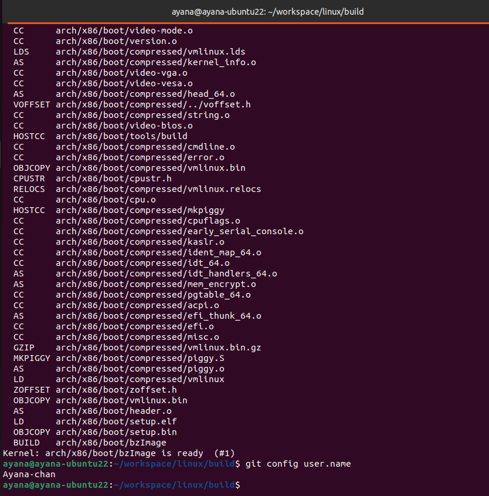

显示github昵称：
```bash
git config user.name
```


# 编译rust for linux

安装bindgen：`cargo install --locked --version $(scripts/min-tool-version.sh bindgen) bindgen-cli`

`ARCH=x86_64`

bindgen会根据系统的c语言接口生成rust接口，而kernel crate则对这些接口进行了安全抽象，供驱动开发者使用。

编译成功：


# 模块

`.github/workflows/qemu-initramfs.desc`：
```
dir     /bin                                          0755 0 0
dir     /sys                                          0755 0 0
dir     /dev                                          0755 0 0
file    /bin/busybox  busybox                         0755 0 0
slink   /bin/sh       /bin/busybox                    0755 0 0
file    /init         .github/workflows/qemu-init.sh  0755 0 0

file    /rust_minimal.ko            build/samples/rust/rust_minimal.ko            0755 0 0
file    /rust_print.ko              build/samples/rust/rust_print.ko              0755 0 0
file    /rust_module_parameters.ko  build/samples/rust/rust_module_parameters.ko  0755 0 0
file    /rust_sync.ko               build/samples/rust/rust_sync.ko               0755 0 0
file    /rust_chrdev.ko             build/samples/rust/rust_chrdev.ko             0755 0 0
file    /rust_miscdev.ko            build/samples/rust/rust_miscdev.ko            0755 0 0
file    /rust_stack_probing.ko      build/samples/rust/rust_stack_probing.ko      0755 0 0
file    /rust_semaphore.ko          build/samples/rust/rust_semaphore.ko          0755 0 0
file    /rust_semaphore_c.ko        build/samples/rust/rust_semaphore_c.ko        0755 0 0
file    /rust_selftests.ko          build/samples/rust/rust_selftests.ko          0755 0 0

file    /rust_module_parameters_loadable_default.ko  build/samples/rust/rust_module_parameters_loadable_default.ko  0755 0 0
file    /rust_module_parameters_loadable_custom.ko   build/samples/rust/rust_module_parameters_loadable_custom.ko   0755 0 0
```


