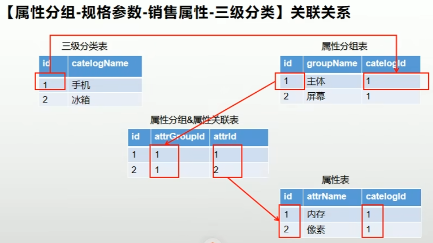

# 问题

category和catelog注意别写混，也别写成cata！
## 前端
前端运行`npm install`会报错一堆。安装py2.7，又报错；换回py3.8想看原报错信息，结果发现没报错了，一切正常运行，不知是何原因。

renrenfast想要使用nacos，须选固定的版本：


查找深度的代码有点bug，自己写了个：
```js
// 计算结点相对全局的最大深度
    countNodeMaxGlobalDepth(node) {
      let maxLevel = node.catLevel;
      let tempLevel = 0;
      if (node.children == null) {
        return maxLevel;
      }
      // 取子节点获得的最大深度
      for (let i = 0; i < node.children.length; i++) {
        tempLevel = this.countNodeMaxGlobalDepth(node.children[i]);
        if (tempLevel > maxLevel) {
          maxLevel = tempLevel;
        }
      }
      return maxLevel;
    }
```

用代码生成器产出的vue时出现404，可能是代码生成器的module名字没设置对。

switch之类的绑定v-model后，可能会莫名给绑定数据一个”初始化“。大致是因为绑定的数据无法被正常识别为真或假，导致默认为假，然后又被转换成默认的假值（inactive-value），看起来就像是被”初始化“了。修改active-value和inactive-value时要注意是字符串还是数字（加冒号v-bind）。

oss上传的组件里面`beforeUpload`方法里面`accessId`的`i`要大写才能符合后端响应。

`endpoint`如果加上http头可能会导致拼接host的时候多余了个http，从而报403。

`category-cascader.vue`里面的这个代码可以直接删掉，剩下的就是完整的“传参用sync后缀，watch监听更新，修改内容就会抛出更新事件，从而自动更新父组件的传入变量“这一双向绑定逻辑。
```js
//还可以使用pubsub-js进行传值
this.PubSub.publish("catPath",v);
```
## 后端
使用代码生成器生成时可能出现`Longblob`类型无法被识别，改成`byte[]`即可。

用docker配置necos的之后必须`--net=host`。

新版openfeign弃用了ribbon，需要spring-cloud-loadbalancer依赖。

SpringCloud2.4以上的版本都需要导入`spring-cloud-starter-bootstrap`依赖才能启用对`bootstrap.properties`的扫描（它的优先级太高了，无法用`application`通知spring去扫描它，只能通过安装依赖解决）。

警惕阿里云的命名一会儿id一会儿key！

P66后端表单校验的时候，高版本的SpringBoot会不回复errors报错详细信息，需要在app.yml里面手动开启：
```yml
server:  
  error:  
    include-message: always  
    include-binding-errors: always
```

`showStatus`校验时，更新的时候应该允许为空，并且无论何时都要是0或1。给自定义的注解里面加上空判断，并且把属性上的注解改成这样：

```java
@NotNull(groups = {AddGroup.class})  
@ListValue(vals = {0, 1}, groups = {UpdateGroup.class, AddGroup.class}) //自定义校验注解  
private Integer showStatus;
```
# 设计
## 项目与Maven结构设计
根目录下的pom聚合了所有模块，也是大部分模块的父工程。它继承于springboot父项目，还定义了一些重要的`<dependencyManagement>`。

`guli-common`模块里面有着通用的代码，其pom里有通用的`<dependencies>`。其他模块把此模块当做依赖来使用。

## Nacos配置中心
每个微服务有自己的命名空间；使用配置分组来切换开发、测试、生产三种环境。

## 其他

- **三级分类表**列出了所有*分类*。
- **属性表**列出了所有*属性*，并归属于*分类*。
- **属性分组表**列出了所有*属性分组*，并归属于*分类*。
- **属性分组&属性关联表**将*属性*归类到*属性分组*中。



- **商品属性值表**规定了SPU对应的基本属性。
- **SKU销售属性值表**在规定了SKU属于哪个SPU的同时规定了对应的销售属性。


# 杂记

## 电商概念

**SPU**(Standard Product Unit)：标准化产品单元。例如iPhone X。

**SKU**(Stock Keeping Unit)：库存量单位，即库存进出计量的单位（仓库给商品计量的最小属性集所决定的对象）。如iPhone X的6+128GB深蓝色版本，符合此要求的产品互相之间理论上不再出现任何差分。

**基本属性**：同一个SPU内就一定完全相同的属性。

**销售属性**：决定库存量（价格）（SKU）的属性。

## PageUtils

这是为了在传大量数据到前端时，只传指定页。是对IPage的封装，而IPage来自于MybatisPlus提供的置于ServiceImpl中的方法。

```java
public com.baomidou.mybatisplus.core.metadata.IPage<T> page(     com.baomidou.mybatisplus.core.metadata.IPage<T> page,
    com.baomidou.mybatisplus.core.conditions.Wrapper<T> queryWrapper )
```

## 传参

谷粒里面存在大量Map传参，但这样可维护性极差（没人知道Map里面会出现什么参数）。写个VO、DTO更好。


