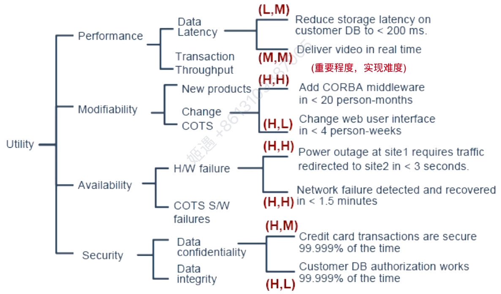
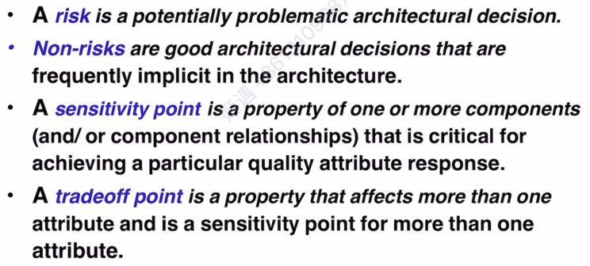

# 关键词

- interact 交互
- maintain 维护
- represent 表示
- interpreters 解释器
- knowledge base 知识库
- evaluation 评估
- precede 先于...发生
- core 核心
- tradeoff 权衡
- utility tree 效用树
- address 解决
- scenarios 场景
- stimulus 刺激（因素）
- recipient 接收者

# 小记

## 文档化

如何文档化，评价准则。

4+1视图与UML。

## 质量属性

质量属性的定义。

质量属性是非功能性需求的子集。

quality attribute scenario 用六要素来描述

>用户在系统正常运行的情况时访问网页的响应时间不超过1s，在这个质量属性描述中，刺激源：用户，
>刺激物：访问网站请求，
>artifact：网站服务器，
>environment：正常运行，
>response：正确响应，返回网页数据，
>response measure：响应时间不超过1s。

属性有六个

回答质量属性的实现时，不要答类别，要给方案。

## ATAM

效用树utility tree，树根为utility，分为**性能、可修改性、可用性、安全**这四个质量属性，每个质量属性分为两个固定方面（只能背），每个方面有多个内容（题目给的），内容有(X，Y)元组，表示(重要程度，实现难度)。

## 架构权衡

考试会直接问定义

- A **risk** is a potentially problematic architectural decision. 未来出现问题的潜在风险。
- **Non-risks** are good architectural decisions that are frequently implicit in the architecture. 没问题的、对项目有帮助的决定。
- A **sensitivity point** is a property of one or more components (and/or component relationships)that is critical for achieving a particular quality attribute response. 一个组件的特性可以影响一个质量属性或目标。
- A **tradeoff point** is a property that affects more than one attribute and is a sensitivity point for more than one attribute. 一个组件的特征可以影响多个质量属性或目标。

## 其他

区分质量属性的时候，可以通过排除功能性需求来排除干扰项。

