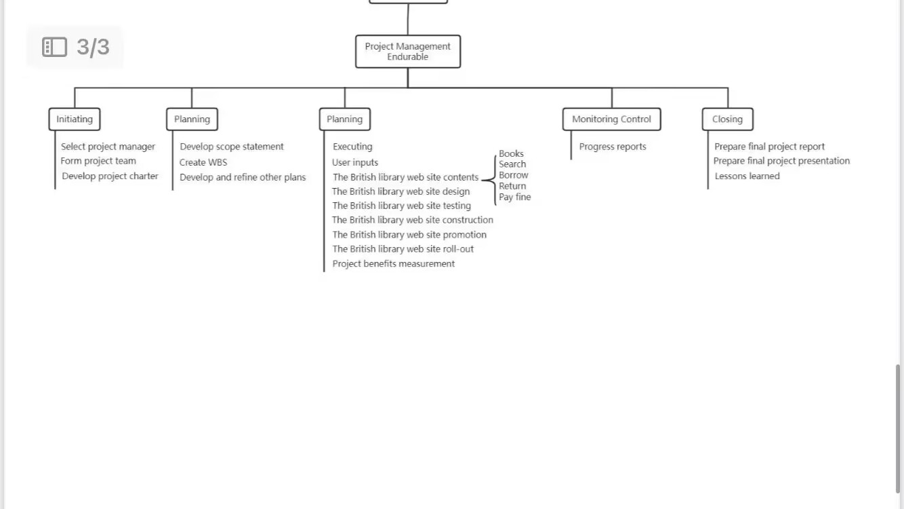

# 关键词

- diverse 多种多样的
- involve 包含，涉及 
- collaboration 协作
- integration 聚合
- sponsor 赞助人
- effective 有效的
- temporary 短暂的，临时的
- portfolio 多的，组合成集的
- agile 敏捷
- proce =process
- defect 缺点
- approval 批准
- inspection 检查
- measure 测量
- acquire 获取
- compress 压缩
- proposal 提议
- compromise 折中
- clause 条款
- statement 声明，报告，评估报告
- evaluate 评估
- hierarchical decomposition 层次分解
- perform 做，执行

# 小记

## 小题

The project scope statement is developed during the Develop Project Charter process - F

## 大题

2：What are the 10 knowledge areas defined in the PMBOK Guide?

- Integration
- Scope
- Schedule
- Cost
- Quality
- Resource
- Communication
- Risk
- Procurement
- Stakeholder

scope, schedule and cost

