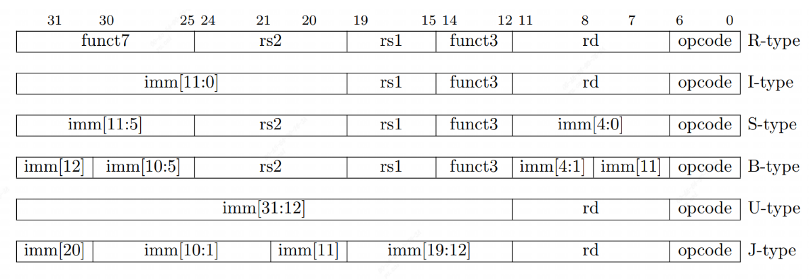
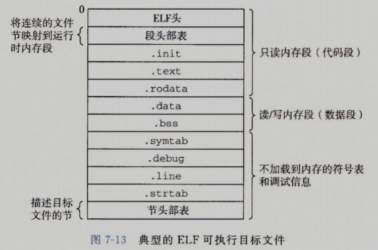

# 杂项知识点

如果使用IFDEF，可能导致某个函数在某个条件下被认为定义后从未被使用，从而出现warning被视为error。只在特定配置下使用的函数要么令其定义被IFDEF包裹，要么设为inline。

使用宏而非inline的一大好处是可以访问上下文的变量，而无须关心“栈逻辑”。

`__VA_ARGS__`是内置的宏，可以被替换为可变参数中的`...`。可以做到把可变的那部分参数给传到另一个可变参数的函数中去。其一大能力就是让宏定义中的可变参数可以是一个语句块，被放到`__VA_ARGS__`所在的地方执行。

`#define concat_temp(x, y) x ## y`可以把x、y合成xy返回。

使用`#xxx`即可将宏接收的几个裸字符转化为字符串。

宏中的注释只能是`/* abc */`这种格式，否则无法换行。

宏有时候可以完成“引用”语义，来直接获取左值。

使用`do{}while(0)`是为了限制变量作用域，保证宏卫生。

printf的fmt部分支持把多个字符串并列写，因此带上MUXDEF等非常好用：
```c
Log("memory read. address: " MUXDEF(PMEM64,"%lu","%u") ", length: %d",addr,len);
```

忽略函数返回值会导致报错，但用变量接收后不使用也会报错。若真不想理会这个返回值，可以加`__attribute__((unused))`。函数有可能不用的时候也可以这样加。
```c
__attribute__((unused)) int result = fscanf(fp, "%63s", elf_func[index].func_name);
```

语句表达式（Statement Expression）是一种特殊的语法结构，它允许在一个表达式中包含多个语句，并将最后一个语句的结果作为整个表达式的结果返回，通常用在宏当中：
```c
int result = ({ int temp = a; a = b; b = temp; a + b; });
```

# pa0

init之后`~/.bashrc`会自动添加两个环境变量（如果不从零开始的话可能得手动添加），以供Makefile直接访问：

```bash
export NEMU_HOME=/home/ayana/workspace/ics2023/nemu                         
export AM_HOME=/home/ayana/workspace/ics2023/abstract-machine
```

`make menuconfig`报错时执行：

```bash
sudo apt-get install bison
sudo apt-get install flex
```


# pa1

配置ccache的时候，只需在`~/.bashrc`加入：

```bash
#让ccache的软链接被提到PATH的最高优先级
export PATH="/usr/lib/ccache:$PATH" 
```

配置时会生成的重要文件包括：
- `nemu/include/generated/autoconf.h`, 阅读C代码时使用
- `nemu/include/config/auto.conf`, 阅读Makefile时使用

`$(CFLAGS)`值如下，是gcc编译的参数：

```bash
-O2 -MMD -Wall -Werror -I/home/user/ics2023/nemu/include
-I/home/user/ics2023/nemu/src/engine/interpreter -I/home/use
r/ics2023/nemu/src/isa/riscv32/include -O2    -D__GUEST_ISA__
=riscv32
```

>我们知道内存是一种RAM, 是一种易失性的存储介质, 这意味着计算机刚启动的时候, 内存中的数据都是无意义的; 而BIOS是固化在ROM/Flash中的, 它们都是非易失性的存储介质, BIOS中的内容不会因为断电而丢失.
 因此在真实的计算机系统中, 计算机启动后首先会把控制权交给BIOS, BIOS经过一系列初始化工作之后, 再从磁盘中将有意义的程序读入内存中执行. 对这个过程的模拟需要了解很多超出本课程范围的细节, 我们在PA中做了简化: 采取约定的方式让CPU直接从约定的内存位置开始执行.

>x86的物理内存是从0开始编址的, 但对于一些ISA来说却不是这样, 例如mips32和riscv32的物理地址均从`0x80000000`开始. 因此对于mips32和riscv32, 其`CONFIG_MBASE`将会被定义成`0x80000000`. 将来CPU访问内存时, 我们会将CPU将要访问的内存地址映射到`pmem`中的相应偏移位置, 这是通过`nemu/src/memory/paddr.c`中的`guest_to_host()`函数实现的. 例如如果mips32的CPU打算访问内存地址`0x80000000`, 我们会让它最终访问`pmem[0]`, 从而可以正确访问客户程序的第一条指令. 这种机制有一个专门的名字, 叫地址映射, 在后续的PA中我们还会再遇到它.

## RTFSC

`init_monitor`：

```c
101 void init_monitor(int argc, char *argv[]) {
102   /* Perform some global initialization. */
103 
104   /* Parse arguments. */
105   parse_args(argc, argv);
106 
107   /* Set random seed. */
108   init_rand();
109 
110   /* Open the log file. */
111   init_log(log_file);
112 
113   /* Initialize memory. */
114   init_mem();
115 
116   /* Initialize devices. */
117   IFDEF(CONFIG_DEVICE, init_device());
118 
119   /* Perform ISA dependent initialization. */
120   init_isa();
121 
122   /* Load the image to memory. This will overwrite the built-in image. */
123   long img_size = load_img();
124 
125   /* Initialize differential testing. */
126   init_difftest(diff_so_file, img_size, difftest_port);
127 
128   /* Initialize the simple debugger. */
129   init_sdb();
130 
131 #ifndef CONFIG_ISA_loongarch32r
132   IFDEF(CONFIG_ITRACE, init_disasm(
133     MUXDEF(CONFIG_ISA_x86,     "i686",
134     MUXDEF(CONFIG_ISA_mips32,  "mipsel",
135     MUXDEF(CONFIG_ISA_riscv,
136       MUXDEF(CONFIG_RV64,      "riscv64",
137                                "riscv32"),
138                                "bad"))) "-pc-linux-gnu"
139   ));
140   #endif
141 
142   /* Display welcome message. */
143   welcome();
144 }
```

`load_img()`函数 (在`nemu/src/monitor/monitor.c`中定义)会将一个有意义的客户程序从[镜像文件](https://en.wikipedia.org/wiki/Disk_image)读入到内存, 覆盖刚才的内置客户程序. 这个镜像文件是运行NEMU的一个可选参数, 在运行NEMU的命令中指定. 如果运行NEMU的时候没有给出这个参数, NEMU将会运行内置客户程序.

Monitor的初始化工作结束后, `main()`函数会继续调用`engine_start()`函数 (在`nemu/src/engine/interpreter/init.c`中定义). 代码会进入简易调试器(Simple Debugger)的主循环`sdb_mainloop()` (在`nemu/src/monitor/sdb/sdb.c`中定义)。

`strtok(str, " ")`使用空格将str字符串分为多个部分，若无结果则返回NULL，否则返回分割后的第一个字符串。之后，str会被存入静态缓冲区，下次要其他被分割字符时直接调用`strtok(NULL, " ")`。

debug函数：

- `Log()`是`printf()`的升级版, 专门用来输出调试信息, 同时还会输出使用`Log()`所在的源文件, 行号和函数. 当输出的调试信息过多的时候, 可以很方便地定位到代码中的相关位置。Log还会将输出也打印到控制台，若不想输出到控制台的话直接调用`log_write`。`Log`自带换行，但`log_write`没有。`Log("Can not find sdcard image: %s", img);`
- `Assert()`是`assert()`的升级版, 当测试条件为假时, 在assertion fail之前可以输出一些信息。`Assert(fp, "Can not open '%s'", img_file);`
- `panic()`用于输出信息并结束程序, 相当于无条件的assertion fail。`panic("unhandle offset = %d", offset);`

```c
 23 #define Log(format, ...) \
 24     _Log(ANSI_FMT("[%s:%d %s] " format, ANSI_FG_BLUE) "\n", \
 25         __FILE__, __LINE__, __func__, ## __VA_ARGS__)
 26 
 27 #define Assert(cond, format, ...) \
 28   do { \
 29     if (!(cond)) { \
 30       MUXDEF(CONFIG_TARGET_AM, printf(ANSI_FMT(format, ANSI_FG_RED) "\n", ## __VA_ARGS__), \
 31         (fflush(stdout), fprintf(stderr, ANSI_FMT(format, ANSI_FG_RED) "\n", ##  __VA_ARGS__))); \
 32       IFNDEF(CONFIG_TARGET_AM, extern FILE* log_fp; fflush(log_fp)); \
 33       extern void assert_fail_msg(); \
 34       assert_fail_msg(); \
 35       assert(cond); \
 36     } \
 37   } while (0)
 38 
 39 #define panic(format, ...) Assert(0, format, ## __VA_ARGS__)
 40 
 41 #define TODO() panic("please implement me")

 59 #define log_write(...) IFDEF(CONFIG_TARGET_NATIVE_ELF, \
 60   do { \
 61     extern FILE* log_fp; \
 62     extern bool log_enable(); \
 63     if (log_enable()) { \
 64       fprintf(log_fp, __VA_ARGS__); \
 65       fflush(log_fp); \
 66     } \
 67   } while (0) \ 
 68 )
 69 
 70 #define _Log(...) \
 71   do { \
 72     printf(__VA_ARGS__); \
 73     log_write(__VA_ARGS__); \
 74   } while (0)

```

q时返回Error1的原因：main会调用src/utils/state.c:int is_exit_status_bad()，里面要求nemu_state.state要妥善处理，此时应当处理为NEMU_QUIT ：

```c
 20 int is_exit_status_bad() {
 21   int good = (nemu_state.state == NEMU_END && nemu_state.halt_ret == 0) 
 22   || (nemu_state.state == NEMU_QUIT);              
 23   return !good;
 24 }
```

## 基础设施

|命令|格式|使用举例|说明|
|---|---|---|---|
|帮助(1)|`help`|`help`|打印命令的帮助信息|
|继续运行(1)|`c`|`c`|继续运行被暂停的程序|
|退出(1)|`q`|`q`|退出NEMU|
|单步执行|`si [N]`|`si 10`|让程序单步执行`N`条指令后暂停执行,  <br>当`N`没有给出时, 缺省为`1`|
|打印程序状态|`info SUBCMD`|`info r`  <br>`info w`|打印寄存器状态  <br>打印监视点信息|
|扫描内存(2)|`x N EXPR`|`x 10 $esp`|求出表达式`EXPR`的值, 将结果作为起始内存  <br>地址, 以十六进制形式输出连续的`N`个4字节|
|表达式求值|`p EXPR`|`p $eax + 1`|求出表达式`EXPR`的值, `EXPR`支持的  <br>运算请见[调试中的表达式求值](https://nju-projectn.github.io/ics-pa-gitbook/ics2023/1.6.html)小节|
|设置监视点|`w EXPR`|`w *0x2000`|当表达式`EXPR`的值发生变化时, 暂停程序执行|
|删除监视点|`d N`|`d 2`|删除序号为`N`的监视点|


只有在当前执行的指令数小于`MAX_INST_TO_PRINT`（默认为10）时，指令内容才会被打印到屏幕上，否则只打印到log中。打印状态的函数是`static void trace_and_difftest(Decode *_this, vaddr_t dnpc)`。`trace_and_difftest`会调用`log_write`，而write前会先判断`log_enable`。启动时的`log_init`也会指定输出路径，默认显示`[src/utils/log.c:28 init_log] Log is written to /home/ayana/workspace/ics2023/nemu/build/nemu-log.txt`。

```
(nemu) si 1
0x80000000: 00 00 02 97 auipc	t0, 0
(nemu) si 1
0x80000004: 00 02 88 23 sb	zero, 16(t0)
(nemu) si 1
0x80000008: 01 02 c5 03 lbu	a0, 16(t0)
(nemu) si 1
0x8000000c: 00 10 00 73 ebreak	
[src/cpu/cpu-exec.c:123 cpu_exec] nemu: HIT GOOD TRAP at pc = 0x8000000c
[src/cpu/cpu-exec.c:88 statistic] host time spent = 303 us
[src/cpu/cpu-exec.c:89 statistic] total guest instructions = 4
[src/cpu/cpu-exec.c:90 statistic] simulation frequency = 13,201 inst/s
(nemu) q
```


```c
//src/utils/log.c
 18 extern uint64_t g_nr_guest_inst; //位于src/cpu/cpu_exec.c，执行一步就加一
 19 FILE *log_fp = NULL;
 20 
 21 void init_log(const char *log_file) {
 22   log_fp = stdout;
 23   if (log_file != NULL) {
 24     FILE *fp = fopen(log_file, "w");
 25     Assert(fp, "Can not open '%s'", log_file);
 26     log_fp = fp;
 27   }
 28   Log("Log is written to %s", log_file ? log_file : "stdout");
 29 }
 30 
 31 bool log_enable() {
 32   return MUXDEF(CONFIG_TRACE, (g_nr_guest_inst >= CONFIG_TRACE_START) &&
 33          (g_nr_guest_inst <= CONFIG_TRACE_END), false);
 34 }  
```

封装好的整数类型：

```c
include/common.h:typedef MUXDEF(CONFIG_ISA64, uint64_t, uint32_t) word_t;
include/common.h:typedef MUXDEF(CONFIG_ISA64, int64_t, int32_t)  sword_t;
```

cpu定义如下：

```c
 21 typedef struct {
 22   word_t gpr[MUXDEF(CONFIG_RVE, 16, 32)]; //寄存器
 23   vaddr_t pc; //Program Counter寄存器
 24 } MUXDEF(CONFIG_RV64, riscv64_CPU_state, riscv32_CPU_state);
```

四个字节刚好八位16进制，如0x80000000。

内存的读写逻辑如下。读的时候高位内存会放在数字的高位。
```c
 21 static inline word_t host_read(void *addr, int len) {
 22   switch (len) {
 23     case 1: return *(uint8_t  *)addr;
 24     case 2: return *(uint16_t *)addr;
 25     case 4: return *(uint32_t *)addr;
 26     IFDEF(CONFIG_ISA64, case 8: return *(uint64_t *)addr);
 27     default: MUXDEF(CONFIG_RT_CHECK, assert(0), return 0);
 28   }
 29 }
 30 
 31 static inline void host_write(void *addr, int len, word_t data) {
 32   switch (len) {
 33     case 1: *(uint8_t  *)addr = data; return;
 34     case 2: *(uint16_t *)addr = data; return;
 35     case 4: *(uint32_t *)addr = data; return;
 36     IFDEF(CONFIG_ISA64, case 8: *(uint64_t *)addr = data; return);
 37     IFDEF(CONFIG_RT_CHECK, default: assert(0));
 38   }
 39 }
```

## 表达式

 `str`成员的长度是有限的, 当你发现缓冲区将要溢出的时候, 要进行相应的处理(思考一下, 你会如何进行处理?), 否则将会造成难以理解的bug.答：直接`assert(0)`最快。

TODO： 编写测试中的表达式生成器。

## 监测点

`cpu-exec.c`若想要访问`monitor/sdb/sdb.h`中的函数，则直接将此函数在`cpu-exec.c`中再声明一下即可。

Kconfig的生成位于`nemu/include/generated/autoconf.h`，出错了就去里面找问题。

**Kconfig会将定义的选项同时放到c代码和Makefile中。**

Kconfig最最末端加上如下代码即可，会自动加上`CONFIG_`前缀：
```kconfig
config WATCHPOINT
	bool "Enable watchpoint"
	default y
```


# pa2

## RTFSC(2)

`exec_once()`会先把当前的PC保存到`s`的成员`pc`和`snpc`中, 其中`s->pc`就是当前指令的PC, 而`s->snpc`则是下一条指令的PC, 这里的`snpc`是"static next PC"的意思。

`isa_exec_once()`会随着取指的过程修改`s->snpc`的值, 使得从`isa_exec_once()`返回后`s->snpc`正好为下一条指令的PC。

`npc`是下一条静态指令, 而`dnpc`是下一条动态指令. 对于顺序执行的指令, 它们的`snpc`和`dnpc`是一样的; 但对于跳转指令, `snpc`和`dnpc`就会有所不同, `dnpc`应该指向跳转目标的指令. 显然, 我们应该使用`s->dnpc`来更新PC, 并且在指令执行的过程中正确地维护`s->dnpc`.

TODO：mips32和riscv32的指令长度只有32位, 因此它们不能像x86那样, 把C代码中的32位常数直接编码到一条指令中. 思考一下, mips32和riscv32应该如何解决这个问题?

BITS取出x的二进制表示中高至hi位、低至lo位的数。而SEXT（**sign-extend**）能将x符号位扩展到len，并返回扩展后的uint64_t。

```c
#define BITMASK(bits) ((1ull << (bits)) - 1)  
#define BITS(x, hi, lo) (((x) >> (lo)) & BITMASK((hi) - (lo) + 1)) // similar to x[hi:lo] in verilog
#define SEXT(x, len) ({ struct { int64_t n : len; } __x = { .n = x }; (uint64_t)__x.n; })
```

```c
 21 #define R(i) gpr(i)
 22 #define Mr vaddr_read
 23 #define Mw vaddr_write
 24 
 25 enum {
 26   TYPE_I, TYPE_U,
 27   TYPE_N, // none
 28 };
 29 
 30 #define src1R() do { *src1 = R(rs); } while (0)
 31 #define src2R() do { *src2 = R(rt); } while (0)
 32 #define immI() do { *imm = SEXT(BITS(i, 15, 0), 16); } while(0)
 33 #define immU() do { *imm = BITS(i, 15, 0); } while(0)
```

INSTPAT(模式字符串, 指令名称, 指令类型, 指令执行操作);
```c
 89 // --- pattern matching wrappers for decode ---
 90 #define INSTPAT(pattern, ...) do { \
 91   uint64_t key, mask, shift; \
	  //解析pattern，与具体数据无关
 92   pattern_decode(pattern, STRLEN(pattern), &key, &mask, &shift); \
 93   if ((((uint64_t)INSTPAT_INST(s) >> shift) & mask) == key) { \
 94     INSTPAT_MATCH(s, ##__VA_ARGS__); \
 95     goto *(__instpat_end); \
 96   } \
 97 } while (0)
 98 
 99 #define INSTPAT_START(name) { const void ** __instpat_end = &&concat(__instpat_end_, name);
100 #define INSTPAT_END(name)   concat(__instpat_end_, name): ; }
```

```c
//src/isa/mips32/inst.c
 46 static int decode_exec(Decode *s) {
 47   int rd = 0;
 48   word_t src1 = 0, src2 = 0, imm = 0;
 49   s->dnpc = s->snpc;
 50 
 51 #define INSTPAT_INST(s) ((s)->isa.inst.val)
 52 #define INSTPAT_MATCH(s, name, type, ... /* execute body */ ) { \
 53   decode_operand(s, &rd, &src1, &src2, &imm, concat(TYPE_, type)); \
 54   __VA_ARGS__ ; \
 55 }
 56 
 57   //添加指令模式
 58   INSTPAT_START();
 59   INSTPAT("001111 ????? ????? ????? ????? ??????", lui    , U, R(rd) = imm << 16);
 60   INSTPAT("100011 ????? ????? ????? ????? ??????", lw     , I, R(rd) = Mr(src1 + imm, 4));
 61   INSTPAT("101011 ????? ????? ????? ????? ??????", sw     , I, Mw(src1 + imm, 4, R(rd)));
 62   
 63   INSTPAT("011100 ????? ????? ????? ????? 111111", sdbbp  , N, NEMUTRAP(s->pc, R(2))); // R(2) is $v0;
 64   INSTPAT("?????? ????? ????? ????? ????? ??????", inv    , N, INV(s->pc));
 65   INSTPAT_END();
 66   
 67   R(0) = 0; // reset $zero to 0
 68   
 69   return 0;
 70 }
```

```c
 35 //取值
 36 static void decode_operand(Decode *s, int *rd, word_t *src1, word_t *src2, word_t *imm, int type) {
 37   uint32_t i = s->isa.inst.val;
 38   int rt = BITS(i, 20, 16);
 39   int rs = BITS(i, 25, 21);
 40   *rd = (type == TYPE_U || type == TYPE_I) ? rt : BITS(i, 15, 11);
 41   switch (type) {
 42     case TYPE_I: src1R(); immI(); break;
 43     case TYPE_U: src1R(); immU(); break;
 44   }
 45 }
```

```c
{ const void ** __instpat_end = &&__instpat_end_;
do {
  uint64_t key, mask, shift;
  pattern_decode("??????? ????? ????? ??? ????? 00101 11", 38, &key, &mask, &shift);
  if ((((uint64_t)s->isa.inst.val >> shift) & mask) == key) {
    {
      decode_operand(s, &rd, &src1, &src2, &imm, TYPE_U);
      R(rd) = s->pc + imm;
    }
    goto *(__instpat_end);
  }
} while (0);
// ...
__instpat_end_: ; }
```

### 第一个C程序

>am-kernels默认被gitignore了。

```bash
bash init.sh am-kernels
```

```bash
cd am-kernels/tests/cpu-tests
make ARCH=riscv32-nemu ALL=dummy run
```

这make会生成如下Makefile.dummy，并进行`make -s -f Makefile.dummy ARCH=riscv32-nemu run`：

```Makefile
  1 NAME = dummy
  2 SRCS = tests/dummy.c
  3 include .../abstract-machine/Makefile
```

```asm
  2 /home/ayana/workspace/ics2023/am-kernels/tests/cpu-tests/build/dummy-riscv32-nemu.elf:     file format elf32-littleriscv
  3 
  4 
  5 Disassembly of section .text:
  6 
  7 80000000 <_start>:
  8 80000000: 00000413            li  s0,0
  9 80000004: 00009117            auipc sp,0x9
 10 80000008: ffc10113            addi  sp,sp,-4 # 80009000 <_end>
 11 8000000c: 00c000ef            jal ra,80000018 <_trm_init> # 24-12=12
	#0 0000000110 0 00000000 00001 1101111
 12 
 13 80000010 <main>:
 14 80000010: 00000513            li  a0,0
 15 80000014: 00008067            ret
 16 
 17 80000018 <_trm_init>:
 18 80000018: ff010113            addi  sp,sp,-16
 19 8000001c: 00000517            auipc a0,0x0
 20 80000020: 01c50513            addi  a0,a0,28 # 80000038 <_etext>
 21 80000024: 00112623            sw  ra,12(sp)
 22 80000028: fe9ff0ef            jal ra,80000010 <main>
 23 8000002c: 00050513            mv  a0,a0
 24 80000030: 00100073            ebreak
 25 80000034: 0000006f            j 80000034 <_trm_init+0x1c>
```

`isa_exec_once`每次都取4字节（32位）指令`inst_fetch(&s->snpc, 4)`，这会改变`s->snpc`使其指向下一条指令。

`INV`调用了`src/engine/interpreter/hostcall.c`的`void invalid_inst(vaddr_t thispc)`。

指令编码在*riscv spec v1的Chapter 24: RV32/64G Instruction Set Listings*。

li这种是pseudoinstructions，类似于宏定义，由其他指令实现。位于*riscv spec v1的Chapter 25: RISC-V Assembly Programmer’s Handbook*。

查指令：[RISC-V Manual](https://jemu.oscc.cc/)

- li看成addi。
- ret 看成 jalr (jump and link register)
- jr rs 就是 jalr x0, 0(rs)

寄存器均使用五位。rs1、rs2、rd、opcode所在的bit范围永远固定。

- R-type：用于寄存器-寄存器操作
- I-type：用于短立即数和访存 load 操作
- S-type：用于访存 store 操作
- B-type：用于条件跳转操作
- U-type：用于长立即数
- J-type：用于无条件跳转

- R: funct7 + rs2 + rs1 + funct3 + rd + opcode
- I: imm12 + rs1 + funct3 + rd + opcode
- S: imm\[11:5\] + rs2 + rs1 + funct3 + imm\[4:0\] + opcode
- B: imm\[12,10:5\] + rs2 + rs1 + funct3 + imm\[4:1,11\] + opcode
- U: imm20 + rd + opcode
- J: imm\[20,10:1,11,19:12\] + rd + opcode



立即数由于存储方式不同，因此读取方式也不同：

```c
#define immJ() do { *imm = (SEXT(BITS(i, 31, 31), 1) << 20) | BITS(i, 30, 21) << 1 BITS(i, 20, 20) << 11 | BITS(i, 19, 12) << 12 ; } while(0)
```

### 更多程序

```bash
add.c           bubble-sort.c  dummy.c  goldbach.c   leap-year.c   max.c       mov-c.c         pascal.c      recursion.c    shuixianhua.c   sum.c            unalign.c
add-longlong.c  crc32.c        fact.c   hello-str.c  load-store.c  mersenne.c  movsx.c         prime.c       select-sort.c  string.c        switch.c         wanshu.c
bit.c           div.c          fib.c    if-else.c    matrix-mul.c  min3.c      mul-longlong.c  quick-sort.c  shift.c        sub-longlong.c  to-lower-case.c
```

```c
  4 #include <am.h>
  5 #include <klib.h>
  6 #include <klib-macros.h>
  7 
  8 __attribute__((noinline))
  9 void check(bool cond) {
 10   if (!cond) halt(1);
 11 }
```

```c
 26 enum {
 27   TYPE_R, TYPE_I, TYPE_S, TYPE_B, TYPE_U, TYPE_J,
 28   TYPE_N, // none
 29 };
 30 
 31 #define src1R() do { *src1 = R(rs1); } while (0)
 32 #define src2R() do { *src2 = R(rs2); } while (0)
 33 #define immI() do { *imm = SEXT(BITS(i, 31, 20), 12); } while(0)
 34 #define immU() do { *imm = SEXT(BITS(i, 31, 12), 20) << 12; } while(0)
 35 #define immS() do { *imm = (SEXT(BITS(i, 31, 25), 7) << 5) | BITS(i, 11, 7); } while(0)
 36 //imm[20,10:1,11,19:12]
 37 #define immJ() do { *imm = (SEXT(BITS(i, 31, 31), 1) << 20) | BITS(i, 30, 21) << 1 | BITS(i, 20, 20) << 11 | BITS(i, 19, 12) << 12 ; } while(0)
 39 //imm[12,10:5] + imm[4:1,11]
 40 #define immB() do { *imm = (SEXT(BITS(i, 31, 31), 1) << 12) | BITS(i, 7, 7) << 11 | BITS(i, 30, 25) << 5 | BITS(i, 11, 8) << 1; } while (0) 
 42 
 43 //取值
 44 static void decode_operand(Decode *s, int *rd, word_t *src1, word_t *src2, word_t *imm, int type) {
 45   uint32_t i = s->isa.inst.val;
 46   int rs1 = BITS(i, 19, 15);
 47   int rs2 = BITS(i, 24, 20);
 48   *rd     = BITS(i, 11, 7);
 49   switch (type) {
 50     case TYPE_R: src1R(); src2R();         break;
 51     case TYPE_I: src1R();          immI(); break;
 52     case TYPE_S: src1R(); src2R(); immS(); break;
 53     case TYPE_B: src1R(); src2R(); immB(); break;
 54     case TYPE_U:                   immU(); break;
 55     case TYPE_J:                   immJ(); break;
 56   }
 57 
 58   Log("Get Value: rs1: %u, src1: %u, rs2: %u, src2: %u, imm: %u, rd: %u",rs1,*src1,rs2,*src2,*imm,*rd);
 59 }
```

[[南大ICS-PA2]指令集实现_HNU_ZHAO的博客-CSDN博客](https://blog.csdn.net/qq_42474104/article/details/130458393)

bge等B型命令后面加z则表示和zero 0进行比较，都是伪指令，完全可以由bge实现（相当于拿寄存器x0进行比较，而x0永远是0）。

有符号操作都进行符号位扩展，无符号操作都进行零扩展。

取有符号数的时候只要在获取无符号数后强转为`sword_t`。

调用函数的时候使用jalr，但尾递归优化后则会使用jr进行无副作用跳转。跳转前会使用sw对ra进行压栈，以保证可以适用于多层调用。


## 程序，运行时环境与AM


>如果我们把这些需求都收集起来, 将它们抽象成统一的API提供给程序, 这样我们就得到了一个可以支撑各种程序运行在各种架构上的库了! 具体地, 每个架构都按照它们的特性实现这组API; 应用程序只需要直接调用这组API即可, 无需关心自己将来运行在哪个架构上. 由于这组统一抽象的API代表了程序运行对计算机的需求, 所以我们把这组API称为抽象计算机.

抽象计算机即为api组成的需求集合，所有api描绘了一个计算机的功能。

>A **cross compiler** is a [compiler](https://en.wikipedia.org/wiki/Compiler "Compiler") capable of creating [executable](https://en.wikipedia.org/wiki/Executable "Executable") code for a [platform](https://en.wikipedia.org/wiki/Computing_platform "Computing platform") other than the one on which the compiler is running. For example, a compiler that runs on a [PC](https://en.wikipedia.org/wiki/Personal_computer "Personal computer") but generates code that runs on an [Android](https://en.wikipedia.org/wiki/Android_(operating_system) "Android (operating system)") [smartphone](https://en.wikipedia.org/wiki/Smartphone "Smartphone") is a cross compiler.

使用交叉编译，让Linux上的gcc编译器生成可以跑在nemu上的代码。

`#define NEMUTRAP(thispc, code) set_nemu_state(NEMU_END, thispc, code)`，code为0的时候就是`GOOD TRAP`。riscv32中，code来自于`R(10)`:`INSTPAT("0000000 00001 00000 000 00000 11100 11", ebreak , N, NEMUTRAP(s->pc, R(10))); // R(10) is $a0`。

`abstract-machine/am/src/platform/nemu/trm.c`中定义了基础api：
- `Area heap`结构用于指示堆区的起始和末尾
- `void putch(char ch)`用于输出一个字符，将字节输出到SERIAL_PORT
- `void halt(int code)`用于结束程序的运行，code为程序返回值
- `void _trm_init()`用于进行TRM相关的初始化工作

`putch`会调用`outb(SERIAL_PORT, ch);`，将ch字节写到SERIAL_PORT内存区域。

```c
#define SERIAL_PORT     (DEVICE_BASE + 0x00003f8)
```

```c
static inline void outb(uintptr_t addr, uint8_t  data) { 
	*(volatile uint8_t  *)addr = data; 
}
```

am中执行的代码都是在nemu上跑的，因此halt_nemu的内联汇编代码也是直接作用到nemu上。

### 不使用sdb

#### 失败

想要不输入c即可直接运行程序的话，就需要定义`CONFIG_TARGET_AM`。

```c
//nemu/src/engine/interpreter/init.c
 20 void engine_start() {
 21 #ifdef CONFIG_TARGET_AM
 22   cpu_exec(-1);
 23 #else
 24   /* Receive commands from user. */
 25   sdb_mainloop();
 26 #endif
 27 }
```

而nemu的Makefile里面在定义`CONFIG_TARGET_AM`宏之后就会变更include，从而切换目标。

```makefile
 56 ifdef CONFIG_TARGET_AM
 57 include $(AM_HOME)/Makefile
 58 LINKAGE += $(ARCHIVES)
 59 else
 60 # Include rules to build NEMU
 61 include $(NEMU_HOME)/scripts/native.mk
 62 endif  
```

发现`nemu/configs/riscv32-am_defconfig`有我们需要的配置:

```txt
  1 CONFIG_TARGET_AM=y
  2 # CONFIG_TRACE is not set
  3 CONFIG_MSIZE=0x2000000
  4 CONFIG_DEVICE=y
```

这个`am_defconfig`又出现在`am-kernels/kernels/nemu/Makefile`。此处的使用方法应当是可以参考的。

```
 22 build_am:
 23   $(MAKE) -C $(NEMU_HOME) $(ISA)-am_defconfig #这一行专门用来将配置进行应用
 24   $(MAKE) -C $(NEMU_HOME) ARCH=$(ARCH) mainargs=$(mainargs) || \
 25     ($(MAKE) restore_config; false)
```

因此，可能在运行前加一行`$(MAKE) -C $(NEMU_HOME) $(ISA)-am_defconfig`就能解决问题。

接下来看要在哪里加。

`abstract-machine/Makefile`里面没有run目标的定义，但发现它包含了另一个Makefile：

```Makefile
-include $(AM_HOME)/scripts/$(ARCH).mk
```

`abstract-machine/scripts/riscv32-nemu.mk`中包含了：

```Makefile
  1 include $(AM_HOME)/scripts/isa/riscv.mk
  2 include $(AM_HOME)/scripts/platform/nemu.mk
```

显然应该动`nemu.mk`。

image是共有的依赖目标，在它里面加上`$(MAKE) -C $(NEMU_HOME) $(ISA)-am_defconfig`就行。

有`CONFIG_TARGET_AM`之后，似乎monitor不会再被链接，因此若有函数调用的话需要套上`IFNDEF(CONFIG_TARGET_AM,...);`。

```c
IFNDEF(CONFIG_TARGET_AM,IFDEF(CONFIG_WATCHPOINT, check_watchpoint()));
```

出现不可控的make循环不停的问题。

对am进行make run之后，会调用nemu的make run，但nemu在开启TARGET_AM的情况下会include am的Makefile，导致其又触发了am的make run。

#### 成功

`abstract-machine/scripts/platform/nemu.mk`中，`NEMUFLAGS`再加一个`-b`。

```c
NEMUFLAGS += -b -l $(shell dirname $(IMAGE).elf)/nemu-log.txt 
```

加入`-b`会导致`init_monitor`调用`sdb_set_batch_mode()`，使得`is_batch_mode`设为1，从而导致`sdb_mainloop`直接调用`cpu_exec(-1)`。

```c
268   if (is_batch_mode) {
269     cmd_c(NULL);
270     return;
271   }
```

>为什么一开始不多看几眼各处的`cpu_exec(-1)`啊QAQ


### 实现常用的库函数

注意size_t是无符号类型，不要弄出负数。

```c
	int i;
	char *t;
	char c;
	t=out;
	char *s,buff[1024]={0};
	while(*fmt != '\0'){
		if(*fmt != '%'){*out++ = *fmt;}
		else{
			switch(*++fmt){
				case 'd':
					i=va_arg(ap,uint32_t);
					itoa(buff,i);
					*out='\0';
					strcat(out,buff);
					out=out+strlen(buff);
					break;
				case 'c':
					c=(char)va_arg(ap,int);
					*out=c;
					out++;
					break;
				case 's':
					s=va_arg(ap,char *);
					*out = '\0';
					strcat(out,s);
					out=out+strlen(s);
					break;
				case 'x':
					i=va_arg(ap,uint32_t);
					itox(buff,i);
					*out='\0';
					strcat(out,buff);
					out=out+strlen(buff);
					break;
				case 'p':
					i=va_arg(ap, uint32_t);
					itox(buff,i);
					*out='\0';
					strcat(out,buff);
					out=out+strlen(buff);
				}
			}
		fmt++;
	}
	*out='\0';
	return out-t; 
	//panic("Not implemented");
```


## 基础设施(2)

### mtrace

TODO： 另外也可以实现mtrace输出的条件, 例如你可能只会关心某一段内存区间的访问, 有了相关的条件控制功能, mtrace使用起来就更加灵活了.
### ftrace

```
riscv64-linux-gnu-readelf -a xxx.elf
```

`Type`属性为`FUNC`的表项就是函数。 
- `Name`: 函数名
- `Value`: 起始地址
- `Size`: 函数的大小

符号表中的name存储的是字符表中的偏移量

直接用linux本地的gcc编译的HelloWorld程序中，字符串被放在`.rodata`里面。

call和ret不匹配的原因是f0和f1被尾递归优化了，从它们触发调用函数的时候是直接jr而非jalr，因此无法识别为函数调用，但ret依旧会发生于跳转后所在的函数。

丢弃elf的符号表后仍能正常运行，但丢弃目标文件的符号表后就无法链接。因为链接需要使用符号来组织关系；但运行时不需要符号，直接用地址访问就行。
```txt
/usr/bin/ld: error in hello.o(.eh_frame); no .eh_frame_hdr table will be created
/usr/bin/ld: /usr/lib/gcc/x86_64-linux-gnu/11/../../../x86_64-linux-gnu/Scrt1.o: in function `_start':
(.text+0x1b): undefined reference to `main'
collect2: error: ld returned 1 exit status
```



实际上，elf会被操作系统解释成bin来执行。nemu传入的程序就是bin，是直接的内存映像的表示。想要分析elf则须额外导入。

程序参数读入：`o = getopt_long(argc, argv, "-be:hl:d:p:", table, NULL)`。`"-be:hl:d:p:"`中，冒号代表需要参数。

[[ELF文件解析] 读取ELF文件\_elf文件在线解析\_HNU\_ZHAO的博客-CSDN博客](https://blog.csdn.net/qq_42474104/article/details/130455138)这个链接是64位的，只要把64全部替换成32即可。[ICS PA2 实验记录 - 知乎](https://zhuanlan.zhihu.com/p/506323862)

TODO： 把trace关掉几个看看能不能跑。

- call: `jalr x1, 0(rs)`或`jal x1, imm`，跳转到rs的值或立即数，将snpc存到ra。
- ret: `jalr x0, 0(x1)`，跳回ra的值。
- 尾递归call: `jalr x0, 0(rs)`，跳转到rs的值，不干任何别的事。

尾递归可能和其他跳转混淆，因此难以加入ftrace。

### AM作为基础设施

在native上即可丢掉nemu，以测试am层及以上的代码的正确性。
```
make ALL=string ARCH=native run
```

AM会做好编译，得到txt、elf、bin，供下层（包括nemu）使用。

native.mk直接带有构建目标，不需要再使用platform：
```makefile
 14 CFLAGS  += -fpie
 15 ASFLAGS += -fpie -pie
 16 comma = ,
 17 LDFLAGS_CXX = $(addprefix -Wl$(comma), $(LDFLAGS))
 18 
 19 image:
 20   @echo + LD "->" $(IMAGE_REL)
 21   @g++ -pie -o $(IMAGE) -Wl,--whole-archive $(LINKAGE) -Wl,-no-whole-archive $(LDFLAGS_CXX) -lSDL2 -ldl
 22 
 23 run: image
 24   $(IMAGE)
 25 
 26 gdb: image
 27   gdb -ex "handle SIGUSR1 SIGUSR2 SIGSEGV noprint nostop" $(IMAGE)
```

可见并没有make nemu，而是直接把在本地编译好的东西给跑起来。

make执行的命令返回值非0，表示命令执行失败，make就会停止并返回Error 1。

如果`abstract-machine/klib/include/klib.h`定义了宏`__NATIVE_USE_KLIB__`，那么klib的所有实现（即`.c`文件）才能被加载；由于klib的函数与对应的glibc里的函数是完全一模一样的，而本地代码的优先级高于标准库，因此会优先使用klib的实现。

在native中，putch的功能就是putchar。

`SRCS = $(shell find src/ -name "*.[cS]")`即让src目录下递归找出的所有文件成为SRCS。

### 测试klib

TODO： 更多测试

### Differential Testing

- DUT(Design Under Test, 测试对象) : 正在写的
- REF(Reference, 参考实现): 可靠的实现

`ref_difftest_regcpy`来自于spike的`difftest_regcpy`：`nemu/tools/spike-diff/difftest.cc:__EXPORT void difftest_regcpy(void* dut, bool direction)`

#### RTFSC寻找寄存器顺序（失败）

ref的状态的传入传出的结构体定义为（其对象名为ctx）：
```c
 39 struct diff_context_t {
 40   word_t gpr[MUXDEF(CONFIG_RVE, 16, 32)];
 41   word_t pc;
 42 };
```

ref的cpu状态定义为：
```c
struct state_t
{
	...
	reg_t pc;
	regfile_t<reg_t, NXPR, true> XPR;
	...
}
```

ref的寄存器状态读写如下所示：
```c
ctx->gpr[i] = state->XPR[i];
state->XPR.write(i, (sword_t)ctx->gpr[i]);
```

而regfile_t是个模板类，其定义如下：
```c
209 template <class T, size_t N, bool zero_reg>
210 class regfile_t
211 {
212 public:
213   void write(size_t i, T value)
214   {
215     if (!zero_reg || i != 0)
216       data[i] = value;
217   }
218   const T& operator [] (size_t i) const
219   {
220     return data[i];
221   }
222   regfile_t()
223   {
224     reset();
225   }
226   void reset()
227   {
228     memset(data, 0, sizeof(data));
229   }
230 private:
231   T data[N];
232 };
```

可见读写的寄存器数组实际为`T data[N]`，其类型为T表示的`reg_t`。与`state_t`同文件下定义了`reg_t`:
```c
typedef reg_t (*insn_func_t)(processor_t*, insn_t, reg_t);
```

至此毫无头绪。

#### isa_difftest_checkregs

CPU_state定义：
```c
 21 typedef struct {
 22   word_t gpr[MUXDEF(CONFIG_RVE, 16, 32)];
 23   vaddr_t pc;
 24 } MUXDEF(CONFIG_RV64, riscv64_CPU_state, riscv32_CPU_state);
```

总共32个寄存器。用`R(i)`就能访问`cpu.gpr[i]`。

#### difftest_skip_ref

有的指令给ref执行的话可能和nemu不一致，此时在执行完指令之后加上`IFDEF(CONFIG_DIFFTEST,difftest_skip_ref())`就能让ref不执行该执行，而是等nemu执行完后直接拷贝nemu的状态。

`difftest_skip_ref`必须在前面声明一下才能被链接到。
```c
 43 #ifdef CONFIG_DIFFTEST
 44 void difftest_skip_ref();
 45 #endif
```

也许riscv32此时根本不需要校准？

## 输入输出

[17 设备的输入输出\_HappyGuya的博客-CSDN博客](https://blog.csdn.net/weixin_43684667/article/details/130084623)

RISC架构只提供内存映射I/O的编址方式。

没有volatile的话，对驱动映射的内存地址的访问可能被简化，导致“中间过程”被略去。

带设备的状态机的构建不考虑设备的状态，也就是说设备的映射内存也不被考虑在内。

>这个扩展之后的状态机模型从微观的角度告诉我们, 设备的输入输出都是通过CPU的**寄存器**来进行数据交互的. 输入输出对程序的影响也仅仅体现在**输入时**会进行一次不能提前确定的状态转移, 这基本上就是程序眼中输入输出的全部.
>使用DMA可以让设备直接输入到内存而非寄存器中。

>`paddr_read()`和`paddr_write()`会判断地址`addr`落在物理内存空间还是设备空间, 若落在物理内存空间, 就会通过`pmem_read()`和`pmem_write()`来访问真正的物理内存; 否则就通过`map_read()`和`map_write()`来访问相应的设备. 从这个角度来看, 内存和外设在CPU来看并没有什么不同, 只不过都是一个字节编址的对象而已。

CPU单纯地访问某个地址，然后内存和设备会瓜分CPU的访问。因此，访问到设备所映射的内存时，并不会去访问内存，而是直接访问设备。

>`cpu_exec()`在执行每条指令之后就会调用`device_update()`函数, 这个函数首先会检查距离上次设备更新是否已经超过一定时间, 若是, 则会尝试刷新屏幕, 并进一步检查是否有按键按下/释放, 以及是否点击了窗口的`X`按钮; 否则则直接返回, 避免检查过于频繁, 因为上述事件发生的频率是很低的.

设备访问是AM的一部分。与TRM不同, 设备访问是为计算机提供输入输出的功能, 因此我们把它们划入一类新的API, 名字叫**IOE(I/O Extension)**。访问设备 = **读/写操作**。

>`reg`其实是一个功能编号, 我们约定在不同的架构中, 同一个功能编号的含义也是相同的, 这样就实现了设备寄存器的抽象.
>`ioe_read()`和`ioe_write()`都是通过抽象寄存器的编号索引到一个处理函数, 然后调用它.

```c
bool ioe_init();
//从编号为`reg`的寄存器中读出内容到缓冲区`buf`中
void ioe_read(int reg, void *buf) { ((handler_t)lut[reg])(buf); }
//往编号为`reg`寄存器中写入缓冲区`buf`中的内容
void ioe_write(int reg, void *buf) { ((handler_t)lut[reg])(buf); }
```

各种设备的功能名加上`AM`前缀后就成为功能ID宏；在加上`_T`后缀后，就是传递数据所用的结构体：
```c
  6 #define AM_DEVREG(id, reg, perm, ...) \
  7   enum { AM_##reg = (id) }; \
  8   typedef struct { __VA_ARGS__; } AM_##reg##_T;
  9 
 10 AM_DEVREG( 1, UART_CONFIG,  RD, bool present);
 11 AM_DEVREG( 2, UART_TX,      WR, char data);
 12 AM_DEVREG( 3, UART_RX,      RD, char data);
 13 AM_DEVREG( 4, TIMER_CONFIG, RD, bool present, has_rtc);
 14 AM_DEVREG( 5, TIMER_RTC,    RD, int year, month, day, hour, minute, second);
 15 AM_DEVREG( 6, TIMER_UPTIME, RD, uint64_t us);
 16 AM_DEVREG( 7, INPUT_CONFIG, RD, bool present);
 17 AM_DEVREG( 8, INPUT_KEYBRD, RD, bool keydown; int keycode);
 18 AM_DEVREG( 9, GPU_CONFIG,   RD, bool present, has_accel; int width, height, vmemsz);
 19 AM_DEVREG(10, GPU_STATUS,   RD, bool ready);
 20 AM_DEVREG(11, GPU_FBDRAW,   WR, int x, y; void *pixels; int w, h; bool sync);
 21 AM_DEVREG(12, GPU_MEMCPY,   WR, uint32_t dest; void *src; int size);
 22 AM_DEVREG(13, GPU_RENDER,   WR, uint32_t root);
 23 AM_DEVREG(14, AUDIO_CONFIG, RD, bool present; int bufsize);
 24 AM_DEVREG(15, AUDIO_CTRL,   WR, int freq, channels, samples);
 25 AM_DEVREG(16, AUDIO_STATUS, RD, int count);
 26 AM_DEVREG(17, AUDIO_PLAY,   WR, Area buf);
 27 AM_DEVREG(18, DISK_CONFIG,  RD, bool present; int blksz, blkcnt);
 28 AM_DEVREG(19, DISK_STATUS,  RD, bool ready);
 29 AM_DEVREG(20, DISK_BLKIO,   WR, bool write; void *buf; int blkno, blkcnt);
 30 AM_DEVREG(21, NET_CONFIG,   RD, bool present);
 31 AM_DEVREG(22, NET_STATUS,   RD, int rx_len, tx_len);
 32 AM_DEVREG(23, NET_TX,       WR, Area buf);
 33 AM_DEVREG(24, NET_RX,       WR, Area buf);
```

>klib中提供了`io_read()`和`io_write()`这两个宏, 它们分别对`ioe_read()`和`ioe_write()`这两个API进行了进一步的封装.

`io_xxx`先定义一个对应的结构体（`AM_XXX_T`）的变量`__io_param`；然后将其以指针形式传给`ioe_xxx`，然后`ioe_xxx`会调用宏对应的目标函数，并将`__io_param`也以指针形式传给目标函数；最后将被修改过的结构体返回：
```c
 18 #define io_read(reg) \
 19   ({ reg##_T __io_param; \
 20     ioe_read(reg, &__io_param); \
 21     __io_param; })
 22 
 23 #define io_write(reg, ...) \
 24   ({ reg##_T __io_param = (reg##_T) { __VA_ARGS__ }; \
 25     ioe_write(reg, &__io_param); })
```

>设备的IO都是跳过difftest的。

AM允许main带有字符串参数：
```bash
make ARCH=riscv32-nemu run mainargs=I-love-PA
```

nemu等使用gcc编译选项`-DMAINARGS=\"$(mainargs)\"`来定义宏MAINARGS，这样就能获取到mainargs的值，于是`_trm_init`将其传给main即可。
```c
 24 void _trm_init() {
 25   int ret = main(mainargs);
 26   halt(ret);
 27 }
```

而在native中，则使用getenv来获取值：
```c
172   const char *args = getenv("mainargs");
173   halt(main(args ? args : "")); // call main here!
```

### 时钟

测试：
```c
  3 void rtc_test() {
  4   AM_TIMER_RTC_T rtc;
  5   int sec = 1;
  6   while (1) {
  7     while(io_read(AM_TIMER_UPTIME).us / 1000000 < sec) ;
  8     rtc = io_read(AM_TIMER_RTC);
  9     printf("%d-%d-%d %02d:%02d:%02d GMT (", rtc.year, rtc.month, rtc.day, rtc.hour, rtc.minute, rtc.second);
 10     if (sec == 1) {
 11       printf("%d second).\n", sec);
 12     } else {
 13       printf("%d seconds).\n", sec);
 14     }
 15     sec ++;
 16   }
 17 }
```


