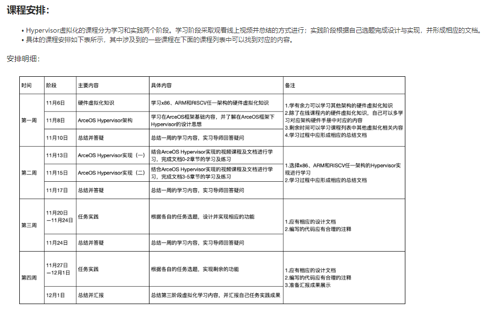

第三阶段项目实习方向介绍：  
  
1 ArceOS单内核Unikernel  

https://os2edu.cn/course/157  

2 ArceOS宏内核  
https://os2edu.cn/course/158  

  
3 Rust for Linux驱动  
https://os2edu.cn/course/159 

  
4 Hypervisor虚拟化  
https://os2edu.cn/course/160  

  
5 ChenLongOS辰龙操作系统发行版  
https://os2edu.cn/course/161 

  
6 基于协程异步机制的操作系统/驱动  
https://os2edu.cn/course/162  

  
项目导师：  
石磊  
闭浩扬  
萧络元  
黄旺  
何家胜  
尤予阳  
  
实习时间：  
项目实习根据不同方向的项目选择和项目导师确定实习内容，第三阶段实习时间4周。  
  
周日11.5晚8点我们将召开项目实习选题会，请大家准时参加。届时会发腾讯会议号在群里。  
  
请入群后将自己的昵称改为如下格式：  
真实姓名-所在/毕业高校-年级/工龄-选题序号  
  
举例：  
李明-清华-工作20年-选5  
朱懿-清华-研一-选3/5  
  
改完昵称后，可以在群里报道，方便项目导师及时了解跟进。第三阶段不再有统一课表，11.5项目实习选题会之后将组建各个项目组的小群，在此之后由项目导师各自组织授课和实习安排。

