# 相关

在./os下`make run BASE=2`即可带测例编译。

# 第零章 操作系统概述

操作系统与运行在用户态软件之间的接口形式就是**应用程序二进制接口 (ABI, Application Binary Interface)**。二进制的形式使其可以面向所有编程语言。

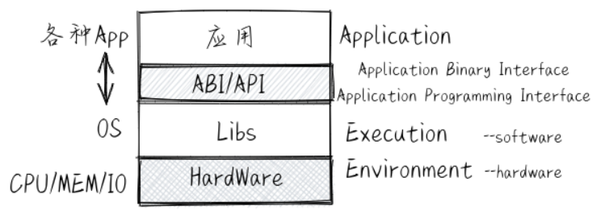


内核主要组成部分：
1. 进程/线程管理：内核负责管理系统中的进程或线程，创建、销毁、调度和切换进程或线程。
2. 内存管理：内核负责管理系统的内存，分配和回收内存空间，并保证进程之间的内存隔离。
3. 文件系统：内核提供文件系统接口，负责管理存储设备上的文件和目录，并允许应用访问文件系统。
4. 网络通信：内核提供网络通信接口，负责管理网络连接并允许应用进行网络通信。
5. 设备驱动：内核提供设备驱动接口，负责管理硬件设备并允许应用和内核其他部分访问设备。
6. 同步互斥：内核负责协调多个进程或线程之间对共享资源的访问。同步功能主要用于解决进程或线程之间的协作问题，互斥功能主要用于解决进程或线程之间的竞争问题。
7. 系统调用接口：内核提供给应用程序访问系统服务的入口，应用程序通过系统调用接口调用操作系统提供的服务，如文件系统、网络通信、进程管理等。

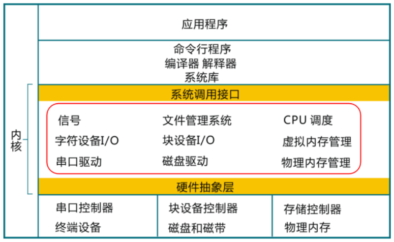

>脱机方式（offline mode）
 基于脱机方式的操作是指没有与计算机进行关联所完成的操作。比如把包含程序的卡片放到卡片机上，把打印纸安装到打印机上等。与此相反的是联机方式（online mode）的操作，即通过与计算机相联所完成的操作，比如计算机把正在运行的应用程序所计算出来的结果通过打印机打印到纸上。
 现在，脱机方式的操作更多的是指断网下进行的操作，联机方式是指在联网下进行的操作。

目前 Linux 有超过三百个的**系统调用接口(System Call Interface)**。下面列出了一些相对比较重要的操作系统接口或抽象，以及它们的大致功能：
- 进程（即程序运行过程）管理：复制创建进程 fork 、退出进程 exit 、执行进程 exec 等。
- 线程管理：线程（即程序的一个执行流）的创建、执行、调度切换等。
- 线程同步互斥的并发控制：互斥锁 mutex 、信号量 semaphore 、管程 monitor 、条件变量 condition variable 等。
- 进程间通信：管道 pipe 、信号 signal 、事件 event 等。
- 虚存管理：内存空间映射 mmap 、改变数据段地址空间大小 sbrk 、共享内存 shm 等。
- 文件 I/O 操作：对存储设备中的文件进行读 read 、写 write 、打开 open 、关闭 close 等操作。
- 外设 I/O 操作：外设包括键盘、显示器、串口、磁盘、时钟 … ，主要采用文件 I/O 操作接口。

抽象概念：
- 文件 (File) 是外设的一种抽象和虚拟化。特别对于存储外设而言，文件是持久存储的抽象。
- 地址空间 (Address Space) 是对内存的抽象和虚拟化。
- 进程 (Process) 是对计算机资源的抽象和虚拟化。而其中最核心的部分是对 CPU 的抽象与虚拟化

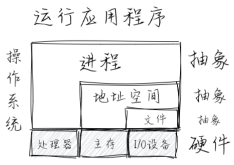

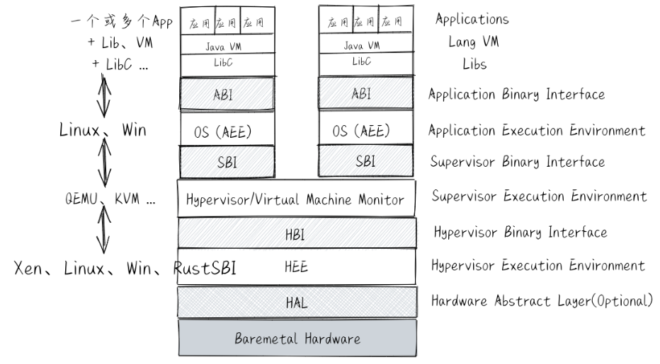

- 物理资源：即计算机硬件资源，如CPU的寄存器、可访问的物理内存等。
- 虚拟资源：即操作系统提供的资源，如文件，网络端口号，网络地址，信号等。

在操作系统中，需要处理三类**异常控制流**：外设**中断** (Device Interrupt) 、**陷入** (Trap) 和**异常** (Exception，也称Fault Interrupt)。

进程上下文：

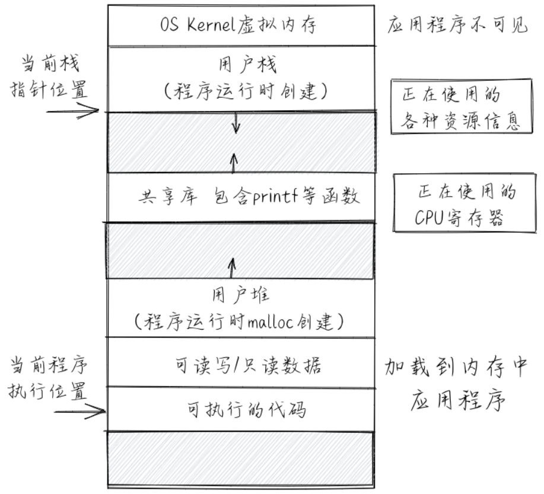

文件：

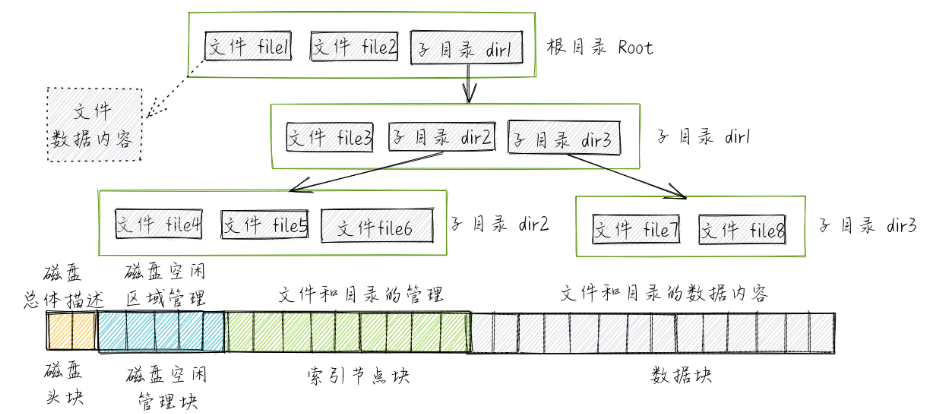


# 第一章 应用程序与基本执行环境

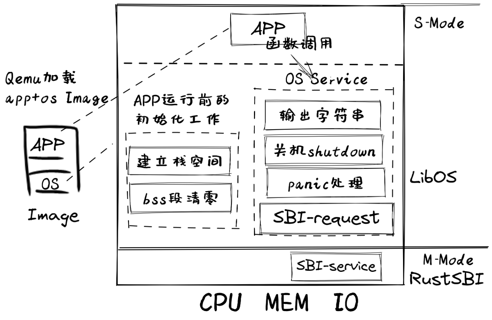

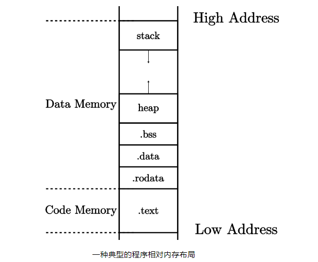

指定交叉编译（target必须是编译器支持的，可以通过`rustup target add riscv64gc-unknown-none-elf`来安装，用`rustc --print target-list`查询已支持的）：
```config
# os/.cargo/config
[build]
target = "riscv64gc-unknown-none-elf"
```

riscv的拓展可以看成功能模块，多一个拓展就多一个功能。

去掉标准库之后，依然可以使用core库。core库不依赖于os，放哪里都能用。

通过编写链接配置文件，把代码段中的入口函数放在最低地址，即可让内存载入的时候起始点就是入口函数。前提是丢弃了没用的元数据，不然起始点可能是元数据而非可执行内容。

- **被调用者保存(Callee-Saved) 寄存器** ：被调用的函数可能会覆盖这些寄存器，需要被调用的函数来保存的寄存器，即由被调用的函数来保证在调用前后，这些寄存器保持不变；
- **调用者保存(Caller-Saved) 寄存器** ：被调用的函数可能会覆盖这些寄存器，需要发起调用的函数来保存的寄存器，即由发起调用的函数来保证在调用前后，这些寄存器保持不变

- sp会被被调用者自行分配、回收、管理，因此是被调用者保存寄存器。
- ra是在被调用者调用结束后进行跳转的目标，因此也是被调用者保存寄存器。
- fp用于被调用者结束后释放栈空间，因此也是被调用者保存寄存器。

>当前执行函数的栈帧的两个边界分别由栈指针 (Stack Pointer, sp(x2))寄存器和栈帧指针（frame pointer,  fp(s0)）寄存器来限定。

栈帧中有：
- `ra` 寄存器保存其返回之后的跳转地址，是一个被调用者保存寄存器；
- 父亲栈帧的结束地址 `fp` ，是一个被调用者保存寄存器；
- 其他被调用者保存寄存器 `s1` ~ `s11` ；
- 函数所使用到的局部变量。
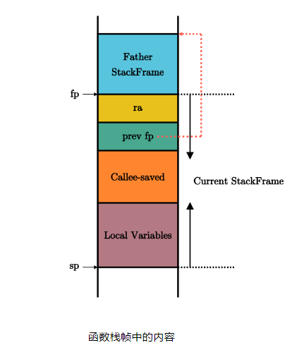

函数调用：
```asmb
# 开场
# 为当前函数分配 64 字节的栈帧
addi        sp, sp, -64
# 将 ra 和 fp 压栈保存
sd  ra, 56(sp)
sd  s0, 48(sp)
# 更新 fp 为当前函数栈帧顶端地址
addi        s0, sp, 64

# 函数执行
# 中间如果再调用了其他函数会修改 ra

# 结尾
# 恢复 ra 和 fp
ld  ra, 56(sp)
ld  s0, 48(sp)
# 退栈
addi        sp, sp, 64
# 返回，使用 ret 指令或其他等价的实现方式
ret
```

可以通过使用space来让栈段直接申请一定的内存，这也可以很方便地检测是否栈溢出。
```asmb
 1# os/src/entry.asm
 2    .section .text.entry
 3    .globl _start
 4_start:
 5    la sp, boot_stack_top # 初始化sp
 6    call rust_main # 入口函数
 7
 8    .section .bss.stack # stack位于.bss.stack段
 9    .globl boot_stack_lower_bound
10boot_stack_lower_bound:
11    .space 4096 * 16 #栈空间
12    .globl boot_stack_top
13boot_stack_top:
```

>全局符号 `sbss` 和 `ebss` 来自于链接脚本，分别指向 `.bss` 段除 `.bss.stack` 以外的起始和终止地址，即指出需要被清零的 `.bss` 段的起始和终止地址，我们在使用这部分数据之前需要将它们初始化为零

通过函数名的方式来获得链接脚本中的符号位置：
```rust
extern "C" {
    fn sbss();
    fn ebss();
}
```


# 第二章 批处理系统

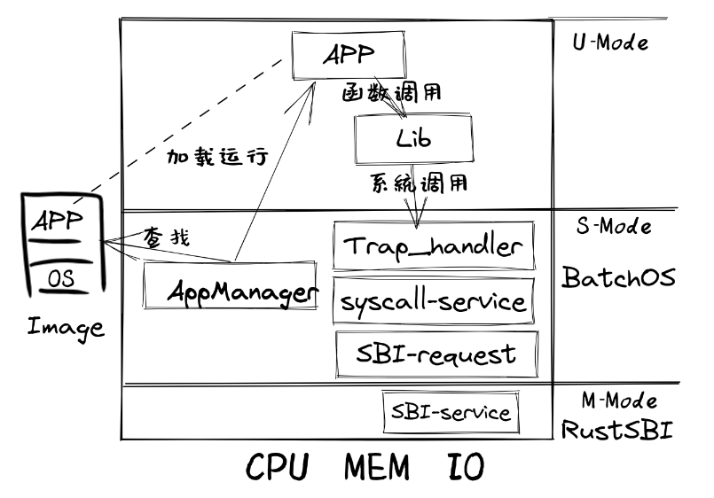

为了让应用程序获得操作系统的函数服务，采用传统的函数调用方式（即通常的 `call` 和 `ret` 指令或指令组合）将会直接绕过硬件的特权级保护检查。所以可以设计新的机器指令：执行环境调用（Execution Environment Call，简称 `ecall` ）和执行环境返回(Execution Environment Return，简称 `eret` )）：
- `ecall` ：具有用户态到内核态的执行环境切换能力的函数调用指令
- `eret` ：具有内核态到用户态的执行环境切换能力的函数返回指令

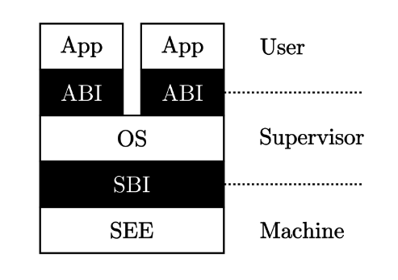

>运行在 M 模式上的软件被称为 **监督模式执行环境** (SEE, Supervisor Execution Environment)，如在操作系统运行前负责加载操作系统的 Bootloader – RustSBI。站在运行在 S 模式上的软件视角来看，它的下面也需要一层执行环境支撑，因此被命名为 SEE，它需要在相比 S 模式更高的特权级下运行，一般情况下 SEE 在 M 模式上运行

执行 `ecall` 这条指令时候则会随着 CPU 当前所处特权级而触发不同的异常，当 CPU 分别处于 M/S/U 三种特权级时执行 `ecall` 这条指令会触发三种异常。

M 模式软件 SEE 和 S 模式的内核之间的接口被称为 **监督模式二进制接口** (Supervisor Binary Interface, SBI)，而内核和 U 模式的应用程序之间的接口被称为 **应用程序二进制接口** (Application Binary Interface, ABI)，当然它有一个更加通俗的名字—— **系统调用** (syscall, System Call) 。

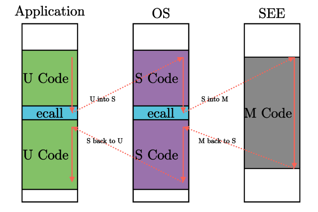

mret在M中用，sret在S中用。

S模式特权指令：

|指令|含义|
|---|---|
|sret|从 S 模式返回 U 模式：在 U 模式下执行会产生非法指令异常|
|wfi|处理器在空闲时进入低功耗状态等待中断：在 U 模式下执行会产生非法指令异常|
|sfence.vma|刷新 TLB 缓存：在 U 模式下执行会产生非法指令异常|
|访问 S 模式 CSR 的指令|通过访问 [sepc/stvec/scause/sscartch/stval/sstatus/satp等CSR](https://rcore-os.cn/rCore-Tutorial-Book-v3/chapter2/4trap-handling.html#term-s-mod-csr) 来改变系统状态：在 U 模式下执行会产生非法指令异常|

>CPU 对物理内存所做的缓存又分成 **数据缓存** (d-cache) 和 **指令缓存** (i-cache) 两部分，分别在 CPU 访存和取指的时候使用。在取指的时候，对于一个指令地址， CPU 会先去 i-cache 里面看一下它是否在某个已缓存的缓存行内，如果在的话它就会直接从高速缓存中拿到指令而不是通过总线访问内存。通常情况下， CPU 会认为程序的代码段不会发生变化，因此 i-cache 是一种只读缓存。但在这里，OS 将修改会被 CPU 取指的内存区域，这会使得 i-cache 中含有与内存中不一致的内容。因此， OS 在这里必须使用取指屏障指令 `fence.i` ，它的功能是保证 **在它之后的取指过程必须能够看到在它之前的所有对于取指内存区域的修改** ，这样才能保证 CPU 访问的应用代码是最新的而不是 i-cache 中过时的内容。

AEE（Application Execution Environment)

在 Trap 触发的一瞬间， CPU 就会切换到 S 特权级并跳转到 `stvec` 所指示的位置。但是在正式进入 S 特权级的 Trap 处理之前，上面 提到过我们必须保存原控制流的寄存器状态，这一般通过内核栈来保存。注意，我们需要用专门为操作系统准备的内核栈，而不是应用程序运行时用到的用户栈。

由于bss段不占用存储空间，只会在运行时占内存，因此很适合用来塞栈。所以可以用全局变量来表示栈。

>换栈是非常简单的，只需将 `sp` 寄存器的值修改为 `get_sp` 的返回值即可。

上下文：
```rust
4pub struct TrapContext {
5    pub x: [usize; 32],
6    pub sstatus: Sstatus,
7    pub sepc: usize,
8}
```

trap时会直接保存上下文到栈中，包括用户的状态和trap处理时的状态。

启动下一个应用程序时，相当于从trap中恢复，但要执行的是其他位置的应用程序，于是内核态给自己编造了一个context，然后走类似于trap恢复的路线。

`__restore` 函数的起始部分会完成 sp←a0，而a0是函数的第一个参数。传参时若传了内核栈的栈顶，就使得在 `__restore` 函数中 `sp` 仍然可以指向内核栈的栈顶。

# 第三章 多道程序和分时多任务

**多道程序** (Multiprogramming) 和 **分时多任务** (Time-Sharing Multitasking)

锯齿螈**多道程序**操作系统 - Multiprog OS（轮流执行）：
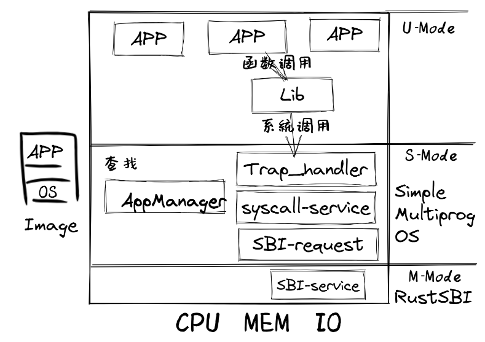

始初龙**协作式多道程序**操作系统 – CoopOS（主动放弃）：
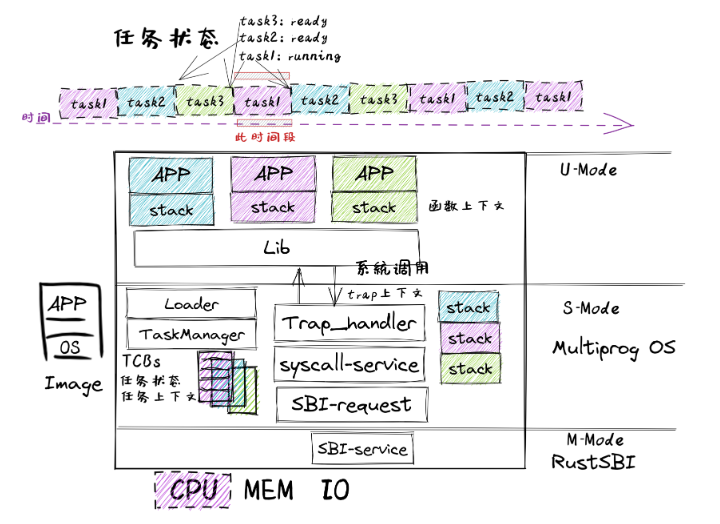

腔骨龙**分时多任务**操作系统 – TimesharingOS（时钟中断）：
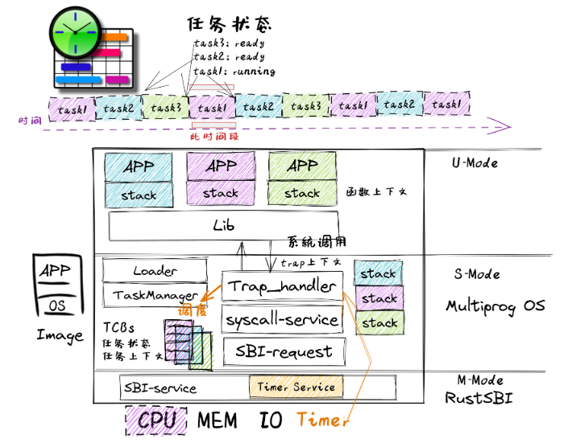

把应用程序的一次执行过程（也是一段控制流）称为一个 **任务** ，把应用执行过程中的一个时间片段上的执行片段或空闲片段称为 “ **计算任务片** ” 或“ **空闲任务片** ” 。当应用程序的所有任务片都完成后，应用程序的一次任务也就完成了。从一个程序的任务切换到另外一个程序的任务称为 **任务切换** 。为了确保切换后的任务能够正确继续执行，操作系统需要支持让任务的执行“暂停”和“继续”。

所有任务的task-context放在os的数据段中，若一个task不在执行，则其上下文都被保存在对应位置。

`__switch` 函数和一个普通的函数之间的核心差别仅仅是它会 **换栈** （即把sp寄存器也作为状态的一部分进行更换或恢复）。

**主动** 调用 `sys_yield` 系统调用意味着应用主动交出 CPU 的使用权给其他应用。

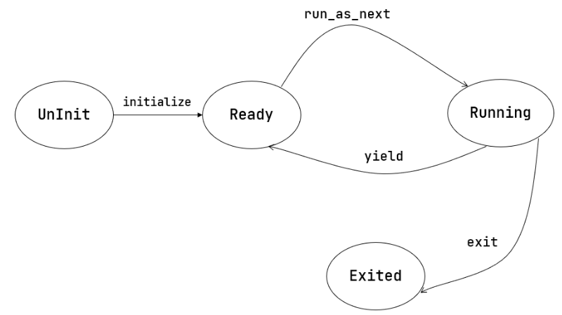

调度算法需要考虑：每次在换出之前给一个应用多少时间片去执行，以及要换入哪个应用。可以从性能（主要是吞吐量和延迟两个指标）和 **公平性** (Fairness) 两个维度来评价调度算法，后者要求多个应用分到的时间片占比不应差距过大。

目前使用**时间片轮转算法** (RR, Round-Robin) 来对应用进行调度。

在判断中断是否会被屏蔽的时候，有以下规则：
- 如果中断的特权级低于 CPU 当前的特权级，则该中断会被屏蔽，不会被处理；
- 如果中断的特权级高于与 CPU 当前的特权级或相同，则需要通过相应的 CSR 判断该中断是否会被屏蔽。

以内核所在的 S 特权级为例，中断屏蔽相应的 CSR 有 `sstatus` 和 `sie` 。`sstatus` 的 `sie` 为 S 特权级的中断使能，能够同时控制三种中断，如果将其清零则会将它们全部屏蔽。即使 `sstatus.sie` 置 1 ，还要看 `sie` 这个 CSR，它的三个字段 `ssie/stie/seie` 分别控制 S 特权级的软件中断、时钟中断和外部中断的中断使能。比如对于 S 态时钟中断来说，如果 CPU 不高于 S 特权级，需要 `sstatus.sie` 和 `sie.stie` 均为 1 该中断才不会被屏蔽；如果 CPU 当前特权级高于 S 特权级，则该中断一定会被屏蔽。

如果中断没有被屏蔽，那么接下来就需要软件进行处理，而具体到哪个特权级进行处理与一些中断代理 CSR 的设置有关。默认情况下，所有的中断都需要到 M 特权级处理。而通过软件设置这些中断代理 CSR 之后，就可以到低特权级处理，但是 Trap 到的特权级不能低于中断的特权级。事实上所有的中断/异常默认也都是到 M 特权级处理的。

>嵌套中断可以分为两部分：在处理一个中断的过程中又被同特权级/高特权级中断所打断。默认情况下硬件会避免同特权级再次发生，但高特权级中断则是不可避免的会再次发生。
 嵌套 Trap 则是指处理一个 Trap（可能是中断或异常）的过程中又再次发生 Trap ，嵌套中断是嵌套 Trap 的一个特例。在内核开发时我们需要仔细权衡哪些嵌套 Trap 应当被允许存在，哪些嵌套 Trap 又应该被禁止，这会关系到内核的执行模型

read到的是计数器，除以时钟频率就能得到时间。

set_next_trigger会计算10ms后应有的时钟频率，并将其设为触发器，到达此计数后就会触发中断。

我们并没有将应用初始 Trap 上下文中的 `sstatus` 中的 `SPIE` 位置为 1 。这将意味着 CPU 在用户态执行应用的时候 `sstatus` 的 `SIE` 为 0 ，根据定义来说，此时的 CPU 会屏蔽 S 态所有中断，自然也包括 S 特权级时钟中断。但是可以观察到我们的应用在用尽一个时间片之后能够正常被打断。这是因为<u>当 CPU 在 U 态接收到一个 S 态时钟中断时会被抢占</u>，这时无论 `SIE` 位是否被设置都会进入 Trap 处理流程


# 第四章 地址空间

>user下的build.py被移除了

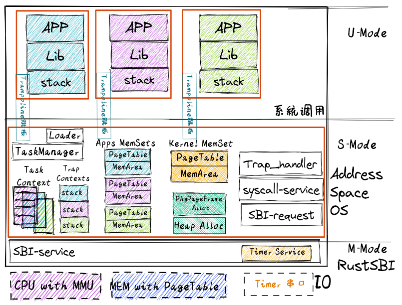

- 内碎片：已被分配出去（属于某个在运行的应用）内存区域，占有这些区域的应用并不使用这块区域（比如内存需求较少的应用占用了大体积的栈预留空间），操作系统也无法利用这块区域。
- 外碎片：还没被分配出去（不属于任何在运行的应用）内存空闲区域，由于太小而无法分配给提出申请内存空间的应用

如果要在操作系统内核中支持动态内存分配，则需要实现在本节开始介绍的一系列功能：初始化堆、分配/释放内存块的函数接口、连续内存分配算法。相对于 C 语言而言，Rust语言在 `alloc` crate 中设定了一套简洁规范的接口，只要实现了这套接口，内核就可以很方便地支持动态内存分配了。

>TODO：理解：
>**为何 C 语言 malloc 的时候不需要提供对齐需求？**
 在 C 语言中，所有对齐要求的最大值是一个平台相关的常数（比如 8 bytes），消耗少量内存即可使得每一次分配都符合这个最大的对齐要求。因此也就不需要区分不同分配的对齐要求了。而在 Rust 中，某些分配的对齐要求的值可能很大，就只能采用更加复杂的方法。

`alloc::boxed::Box`和`alloc::vec::Vec`。

每个应用的地址空间中都预留了一部分空间用于动态内存分配（位于每个应用的全局数据段`.data`段中）。

当 CPU 取指令或者执行一条访存指令的时候，它都是基于虚拟地址访问属于当前正在运行的应用的地址空间。此时，CPU 中的 **内存管理单元** (MMU, Memory Management Unit) 自动将这个虚拟地址进行 **地址转换** (Address Translation) 变为一个物理地址，即这个应用的数据/指令的物理内存位置。也就是说，在 MMU 的帮助下，应用对自己虚拟地址空间的读写才能被实际转化为对于物理内存的访问。
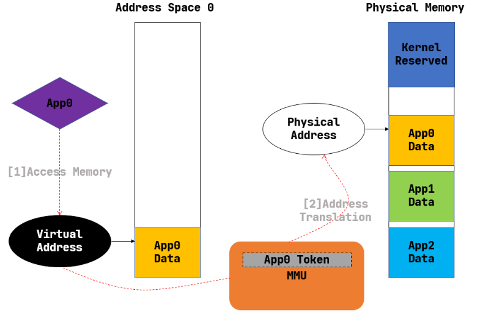


内核始终以一个同样大小的单位来在物理内存上放置应用地址空间中的数据，这样内核就可以使用简单的插槽式内存管理，使得内存分配算法比较简单且**不会产生外碎片**；同时，这个单位的大小要足够小，从而其内部没有被用到的内碎片的大小也足够小，尽可能提高内存利用率，**减少内碎片大小**。这便是我们将要介绍的**分页内存管理**。

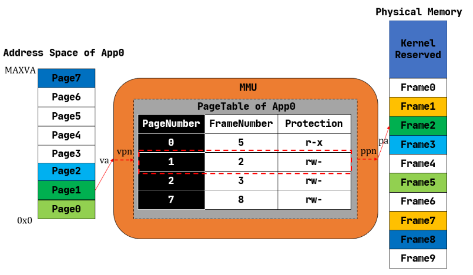

当一个应用的地址空间比较大的时候，页表中的项数会很多（事实上每个虚拟页面都应该对应页表中的一项，上图中我们已经省略掉了那些未被使用的虚拟页面），导致它的容量极速膨胀，已经不再是像之前那样数个寄存器便可存下来的了，CPU 内也没有足够的硬件资源能够将它存下来。因此它只能**作为一种被内核管理的数据结构放在内存中**，但是 CPU 也会直接访问它来查页表，这也就需要内核和硬件之间关于页表的内存布局达成一致。

satp寄存器存储了地址映射的相关配置。分为三个字段：
- `MODE` 控制 CPU 使用哪种页表实现；
- `ASID` 表示地址空间标识符，这里还没有涉及到进程的概念，我们不需要管这个地方；
- `PPN` 存的是根页表所在的物理页号。这样，给定一个虚拟页号，CPU 就可以从三级页表的根页表开始一步步的将其映射到一个物理页号。

39bit vddr -> 56bit pddr

TODO：理解：实际上无论是虚拟地址还是物理地址，真正有意义、能够通过 MMU 的地址转换或是 CPU 内存控制单元的检查的地址仅占其中的很小一部分，因此它们（访问范围）的理论容量上限在目前都没有实际意义。

页编号+页内偏移=唯一确定的地址

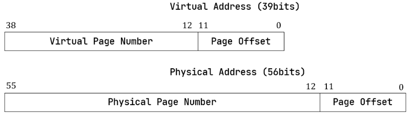

>在 64 位架构上虚拟地址长度确实应该和位宽一致为 64 位，但是在启用 SV39 分页模式下，只有低 39 位是真正有意义的。SV39 分页模式规定 64 位虚拟地址的 [63:39] 这 25 位必须和第 38 位相同，否则 MMU 会直接认定它是一个不合法的虚拟地址。通过这个检查之后 MMU 再取出低 39 位尝试将其转化为一个 56 位的物理地址。
 也就是说，所有 264 个虚拟地址中，只有最低的 256GiB （当第 38 位为 0 时）以及最高的 256GiB （当第 38 位为 1 时）是可能通过 MMU 检查的。当我们写软件代码的时候，一个地址的位宽毋庸置疑就是 64 位，我们要清楚可用的只有最高和最低这两部分，尽管它们已经巨大的超乎想象了；而本节中我们专注于介绍 MMU 的机制，强调 MMU 看到的真正用来地址转换的虚拟地址只有 39 位。

页表：虚拟页号到物理页号的映射。

从物理页号到物理地址的转换只需左移 12 位即可，但是物理地址需要保证它与页面大小对齐才能通过右移转换为物理页号。

使用虚拟页号在页表中查到的信息就是**页表项** (PTE, Page Table Entry)：物理页号和全部的标志位。

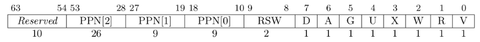

- V(Valid)：仅当位 V 为 1 时，页表项才是合法的；
- R(Read)/W(Write)/X(eXecute)：分别控制索引到这个页表项的对应虚拟页面是否允许读/写/执行；
- U(User)：控制索引到这个页表项的对应虚拟页面是否在 CPU 处于 U 特权级的情况下是否被允许访问；
- G：暂且不理会；
- A(Accessed)：处理器记录自从页表项上的这一位被清零之后，页表项的对应虚拟页面是否被访问过；
- D(Dirty)：处理器记录自从页表项上的这一位被清零之后，页表项的对应虚拟页面是否被修改过。

虚页号（Virtial Page Number， VPN）

使用这种映射方法的一个缺点就是要给所有的页都设一个页表项。因此，必须**按需分配**：刚开始不存任何页表项，让所有虚拟地址全部非法；当内核已经决定好了一个应用的各逻辑段存放位置之后，它就需要负责从零开始以虚拟页面为单位来让该应用的地址空间的某些部分变得合法，反映在该应用的页表上也就是一对对映射顺次被插入进来，自然页表所占据的内存大小也就逐渐增加。

要构建27位虚拟号的索引，使用了Trie。27=9+9+9，每一级匹配9bit，匹配三层。匹配9bit就会产生$2^9$个分支，每个分支都是8Byte，为页表项或者是带标志位的指针（56位物理地址+8位标志位），因此每个结点都会存储刚好4KB的空间，刚好可以塞入一个物理页帧。寻找一个结点的一个分支的方式是：用该结点的物理页帧号转化为地址在加上对应的9bit数值，就得到了8Byte数据所在的地址。

具体来说，假设我们有虚拟地址 $(VPN0,VPN1,VPN2,offset)$ ：
- 我们首先会记录装载「当前所用的一级页表的物理页」的页号到 satp 寄存器中；
- 把 VPN0 作为偏移在一级页表的物理页中找到二级页表的物理页号；
- 把 VPN1 作为偏移在二级页表的物理页中找到三级页表的物理页号；
- 把 VPN2 作为偏移在三级页表的物理页中找到要访问位置的物理页号；
- 物理页号对应的物理页基址（即物理页号左移12位）加上 offset 就是虚拟地址对应的物理地址。

>注意本书将多级页表的根节点称为一级页表，在其他地方则可能以相反的顺序将根节点称为三级页表，这只是表述的习惯不同。

- 当 `V` 为 0 的时候，代表当前指针是一个空指针，无法走向下一级节点，即该页表项对应的虚拟地址范围是无效的；
- 只有当 `V` 为1 且 `R/W/X` 均为 0 时，表示是一个合法的页目录表项，其包含的指针会指向下一级的页表；
- 注意: 当 `V` 为1 且 `R/W/X` 不全为 0 时，表示是一个合法的页表项，其包含了虚地址对应的物理页号。


实践表明绝大部分应用程序的虚拟地址访问过程具有时间局部性和空间局部性的特点，因此用MMU中的 **快表（TLB, Translation Lookaside Buffer）**（在CPU里） 来作为虚拟页号到物理页号的映射的页表缓存。

但如果修改了 satp 寄存器，说明内核切换到了一个与先前映射方式完全不同的页表。此时快表里面存储的映射已经失效了，这种情况下内核要在修改 satp 的指令后面马上使用 sfence.vma 指令刷新清空整个 TLB。

同样，我们手动修改一个页表项之后，也修改了映射，但 TLB 并不会自动刷新清空，我们也需要使用 sfence.vma 指令刷新整个 TLB。注：可以在 sfence.vma 指令后面加上一个虚拟地址，这样 sfence.vma 只会刷新TLB中关于这个虚拟地址的单个映射项。

在分配 `alloc` 的时候，首先会检查栈 `recycled` 内有没有之前回收的物理页号，如果有的话直接弹出栈顶并返回；否则的话我们只能从之前从未分配过的物理页号区间$[current,end)$ 上进行分配，我们分配它的左端点 `current` ，同时将管理器内部维护的 `current` 加 `1` 代表 `current` 已被分配了。回收的页号必然是以前分配过的，这需要进行验证。这实现了类似于堆的访问接口。

内核有时候就需要访问真正的物理地址，但被MMU隔离后难以做到，于是就需要在给出vaddr的情况下知道其paddr。此时可以在内核层使用恒等映射，让vaddr和paddr恒等，从而让内核可以方便地修改目标物理内存。

`Identical` 表示上一节提到的恒等映射方式；而 `Framed` 则表示对于每个虚拟页面都有一个新分配的物理页帧与之对应，虚地址与物理地址的映射关系是相对随机的。恒等映射方式主要是用在启用多级页表之后，内核仍能够在虚存地址空间中访问一个特定的物理地址指向的物理内存。

**逻辑段（MapArea）**：一段连续地址的虚拟内存，该区间内包含的所有虚拟页面都以一种相同的方式（`Identical`或`Framed`）映射到物理页帧。
```rust
pub struct MapArea {
    vpn_range: VPNRange,
    data_frames: BTreeMap<VirtPageNum, FrameTracker>,
    map_type: MapType,
    map_perm: MapPermission,
}
```

data_frames（BTreeMap）会直接保存vaddr到paddr的映射。可见，三级页表树仅仅是为了更好地分配、修改，但依然允许直接存储映射。

**地址空间（MemorySet）**：一系列有关联的不一定连续的逻辑段，这种关联一般是指这些逻辑段组成的虚拟内存空间与一个运行的程序（目前把一个运行的程序称为任务，后续会称为进程）绑定，即这个运行的程序对代码和数据的直接访问范围限制在它关联的虚拟地址空间之内。保证同一地址空间内的任意两个逻辑段不能存在交集。
```rust
pub struct MemorySet {
    page_table: PageTable,
    areas: Vec<MapArea>,
}
```

内核地址空间中，高256GB放跳板和应用的内核栈，中间插入**保护页面(Guard Page)**。低256GB放内核程序相关的段。

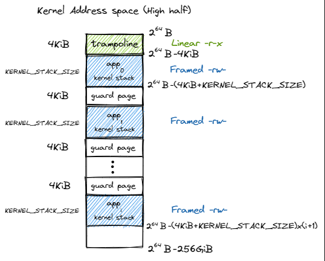

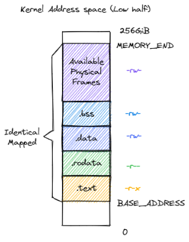

应用地址空间的低256GB存储程序相关段，和一个栈。高256GB存储了跳板和trap上下文。

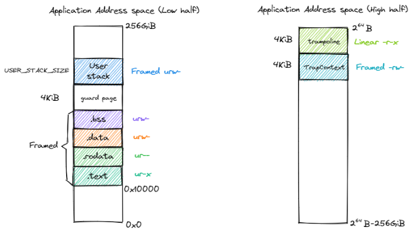

内核可以通过查页表来得知应用所在的地址以进行访问，使得内核层可以干涉应用层。

为了防止切换内核态的时候破坏通用寄存器使得trap context保存不正常，于是在切换内核态之前保存，因此会保存到用户态的地址空间中。

特权级切换和地址空间切换是独立的，因此可以在内核态进行用户地址空间的访问。

call函数时，会直接被编译器弄成jr一个偏移量，在地址空间为用户、而状态为内核时，其行为会不正确。

trap.S是唯一涉及地址空间变换的代码段，因此将其放入按4K对齐的`.text.trampoline`段作为跳板。内核、用户的最高虚拟页都映射到了这段汇编，而且映射的虚拟地址都是完全一样的，相当于让trap.S成为所有地址空间的共识汇集点，所有切换都由此发起。（注：似乎CPU访问PC时也会查询MMU？）

stvec依旧要以内核的形式设置trap入口，因为它是CPU使用的，是直接进入到对应的物理地址，也正对应着direct映射的内核虚拟地址。

translated_byte_buffer会返回在内核地址空间中零散的目标内存区域，返回类型是`Vec<&mut [u8]>`。

每个进程都有一个地址空间，地址空间里面有页表。TaskControlBlock里面存储了地址空间信息。

insert_framed_area可以将一些新的连续页作为新area进行插入。

对`translated_byte_buffer`相关功能做了进一步封装：
```rust
/// 将数据写入到buffer里面
pub fn write_byte_buffer<T>(ans: T, target: *mut T){
    let t_size = core::mem::size_of::<T>();
    let ans_slice = unsafe{
        core::slice::from_raw_parts(&ans as *const T as *const u8, t_size)
    };
    let aims = translated_byte_buffer(crate::task::current_user_token(),
        target as *const u8, t_size);
    
    let mut index: usize = 0;
    for _sub in aims{
        for aim_byte in _sub{
            *aim_byte = ans_slice[index];
            index += 1;
        }
    }
}
```


# 第五章 进程

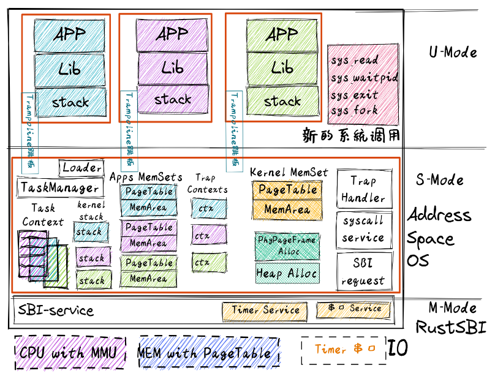

- sys_fork：创建子进程
- sys_waitpid：等待子进程结束并回收子进程资源
- sys_exec：用新的应用内容覆盖当前进程，即达到执行新应用的目的

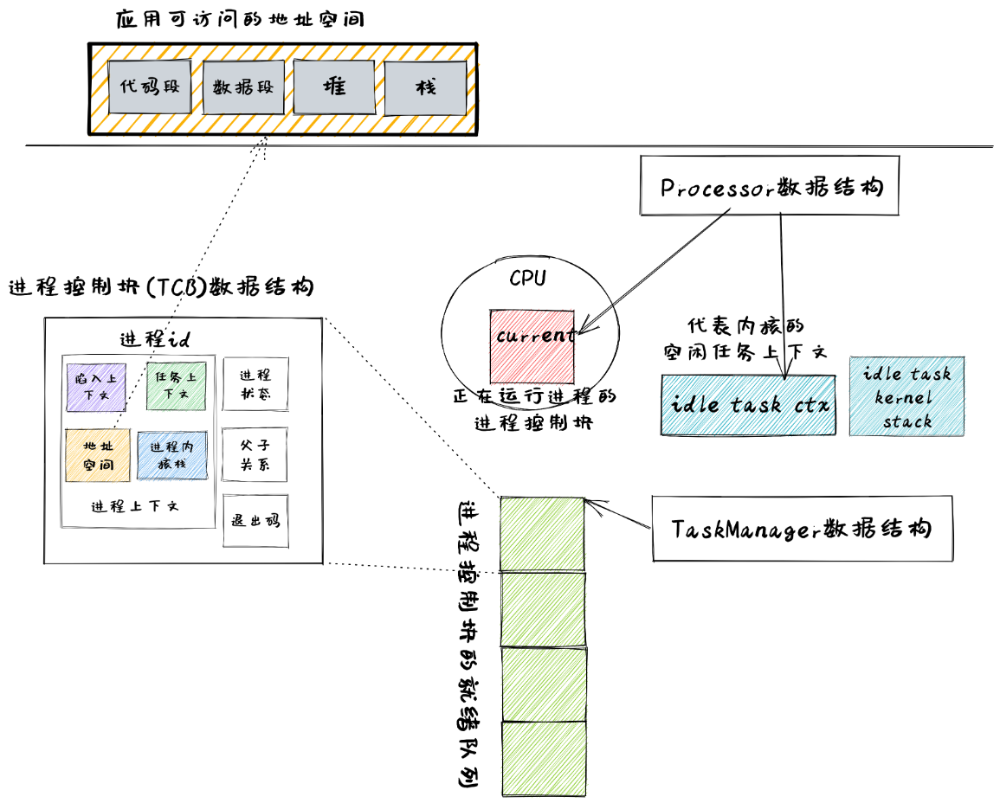

**进程** (Process) 的含义是 **在操作系统管理下的程序的一次执行过程**。

在内核初始化完毕之后会创建一个进程——即 **用户初始进程** (Initial Process) ，它是目前在内核中以硬编码方式创建的唯一一个进程。其他所有的进程都是通过一个名为 `fork` 的系统调用来创建的。


