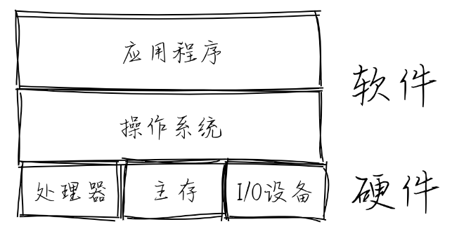

# 第零章

操作系统与运行在用户态软件之间的接口形式就是**应用程序二进制接口 (ABI, Application Binary Interface)**。二进制的形式使其可以面向所有编程语言。

内核主要组成部分：
1. 进程/线程管理：内核负责管理系统中的进程或线程，创建、销毁、调度和切换进程或线程。
2. 内存管理：内核负责管理系统的内存，分配和回收内存空间，并保证进程之间的内存隔离。
3. 文件系统：内核提供文件系统接口，负责管理存储设备上的文件和目录，并允许应用访问文件系统。
4. 网络通信：内核提供网络通信接口，负责管理网络连接并允许应用进行网络通信。
5. 设备驱动：内核提供设备驱动接口，负责管理硬件设备并允许应用和内核其他部分访问设备。
6. 同步互斥：内核负责协调多个进程或线程之间对共享资源的访问。同步功能主要用于解决进程或线程之间的协作问题，互斥功能主要用于解决进程或线程之间的竞争问题。
7. 系统调用接口：内核提供给应用程序访问系统服务的入口，应用程序通过系统调用接口调用操作系统提供的服务，如文件系统、网络通信、进程管理等。

>脱机方式（offline mode）
 基于脱机方式的操作是指没有与计算机进行关联所完成的操作。比如把包含程序的卡片放到卡片机上，把打印纸安装到打印机上等。与此相反的是联机方式（online mode）的操作，即通过与计算机相联所完成的操作，比如计算机把正在运行的应用程序所计算出来的结果通过打印机打印到纸上。
 现在，脱机方式的操作更多的是指断网下进行的操作，联机方式是指在联网下进行的操作。

目前 Linux 有超过三百个的**系统调用接口(System Call Interface)**。下面列出了一些相对比较重要的操作系统接口或抽象，以及它们的大致功能：
- 进程（即程序运行过程）管理：复制创建进程 fork 、退出进程 exit 、执行进程 exec 等。
- 线程管理：线程（即程序的一个执行流）的创建、执行、调度切换等。
- 线程同步互斥的并发控制：互斥锁 mutex 、信号量 semaphore 、管程 monitor 、条件变量 condition variable 等。
- 进程间通信：管道 pipe 、信号 signal 、事件 event 等。
- 虚存管理：内存空间映射 mmap 、改变数据段地址空间大小 sbrk 、共享内存 shm 等。
- 文件 I/O 操作：对存储设备中的文件进行读 read 、写 write 、打开 open 、关闭 close 等操作。
- 外设 I/O 操作：外设包括键盘、显示器、串口、磁盘、时钟 … ，主要采用文件 I/O 操作接口。

抽象概念：
- 文件 (File) 是外设的一种抽象和虚拟化。特别对于存储外设而言，文件是持久存储的抽象。
- 地址空间 (Address Space) 是对内存的抽象和虚拟化。
- 进程 (Process) 是对计算机资源的抽象和虚拟化。而其中最核心的部分是对 CPU 的抽象与虚拟化

- 物理资源：即计算机硬件资源，如CPU的寄存器、可访问的物理内存等。
- 虚拟资源：即操作系统提供的资源，如文件，网络端口号，网络地址，信号等。

在操作系统中，需要处理三类**异常控制流**：外设**中断** (Device Interrupt) 、**陷入** (Trap) 和**异常** (Exception，也称Fault Interrupt)。

进程上下文：

文件：

# 第一章

