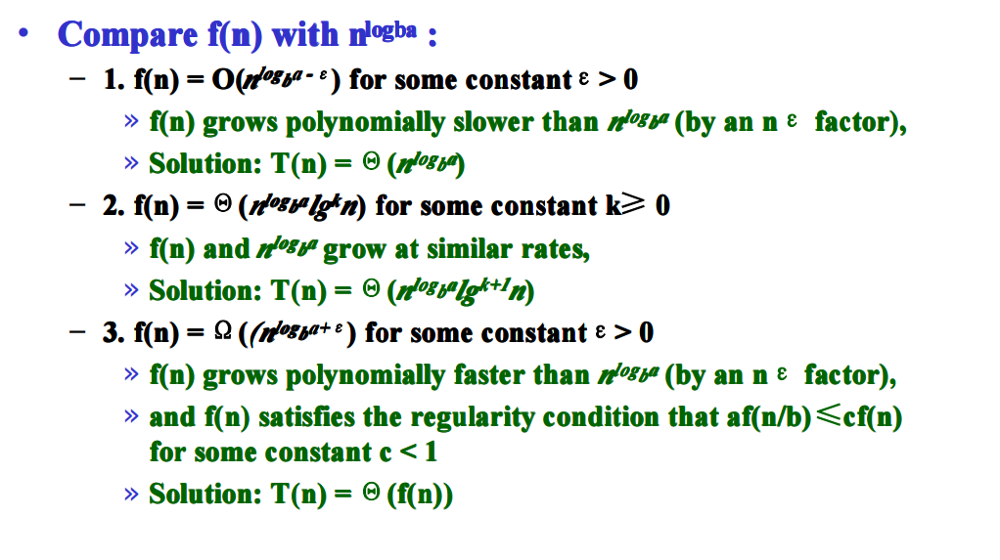
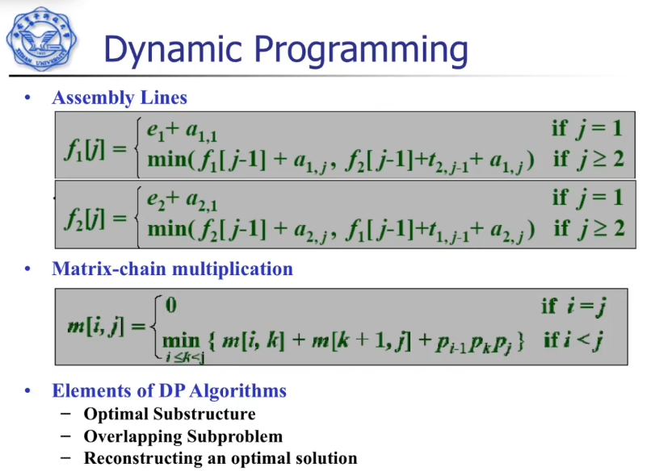
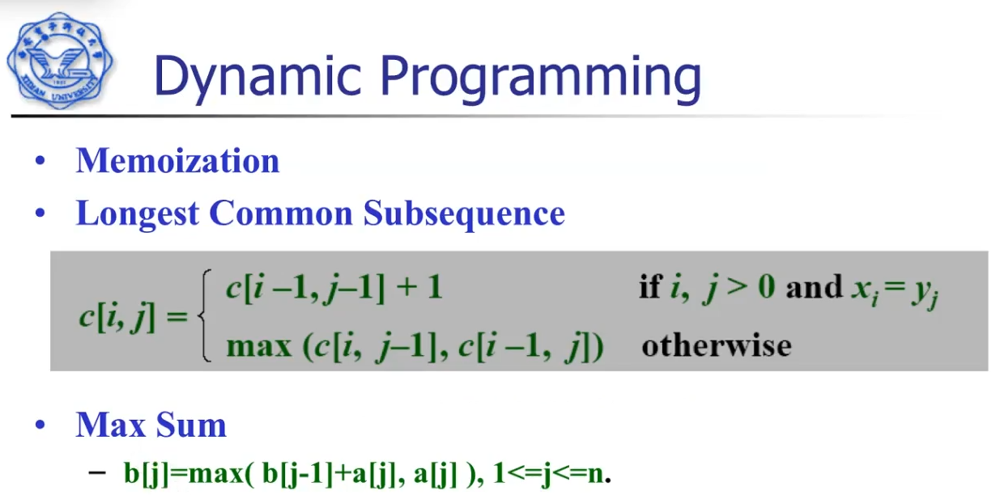
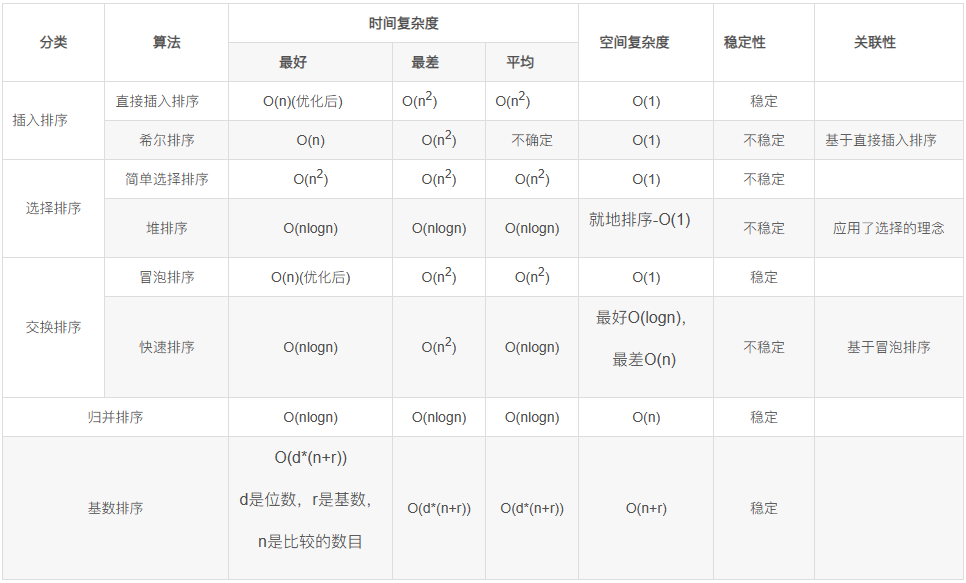

# 关键词

- recursion 递归
- partition 分治
- substitution 代替，代换
- induction 归纳
- stable 稳定的
- recurrences 复现，重现
- auxiliary 辅助的，备用的
- strategy 策略
- greedy 贪心
- knapsack 背包
- Fractional Knapsack 分数背包问题
- relaxation 松弛
- vertice 顶点（图的结点）
- polynomial 多项式的

# 小记

证明O(.)时，n的取值要保证原函数为正。c和n都是正。

O为上界，Ω为下界，两者等同时就有θ。

分治算法： $T(n)=aT(n/b)+D(n)+C(n)$ a为子问题量，b为规模缩减率，D为divide耗时，C为combine耗时。

递归树：T(n)为每一层的D、C耗时加上叶子结点的处理耗时

堆的节点的高度：算上自己，到叶子结点的最大结点总量。

将无序数组变成大顶堆：从下而上遍历所有父结点，若比孩子小则交换。O(n)

堆排序：将根和最后一个堆中结点交换，然后O(lgn)调整为堆。如果是大顶堆的话相当于把最大值固定到后面，到最后结果就是正序。

快排 双指针 把标记拿走。 左边找小于标记的，右边找大于标记的，交换。不断移动直到双指针相撞，此时相撞的左边都是比标记小的，右边都是比标记大的。最后交换标记和相撞点即可。

快排最坏是逆序。

主定理：

DP存最优解的值，求完后用回溯求出最优解。

Dijkstra O(E+VlogV)

Dijkstra正确性：若存在被标记的点v，其路径不为最短路径，则这个点的最短路径中存在一个点u，u不在v目前路径上的，且u必然没被标记（否则最短路径必然能检测到u）；u的距离必然小于v的距离（因为所有边都是正数），因此u必然比v先被标记，出现矛盾。因此被标记的就为最短路径。

Bellman-Ford O(EV) 若存在最短路径，则其长度必然不超过V-1，因此最多迭代V-1次。

Floyd 对任意两个点，取任意个第三个点进行松弛。O(V^3)

SAT：布尔可满足性问题（NPC）

# 考点

每个排序的最好最坏情况

哪些是原地排序，哪些稳定

所有靠比大小的排序算法，其最坏情况Ω(nlgn)

order statistics  partition随便选一个，就能知道小于它的有几个、大于它的有几个，然后看看和要取的偏差多少，在对应分区接着随便选。 最快的算法能达到最坏线性

最大子数组，某个跨越中间点的优化的分治算法θ(nlgn)

Searching: 状态空间树（State Space Tree）的概念，x结点（E-node只能有一个）；限界函数（Bound Function）用处（剪枝，删掉不满足要求的分支）。

Undicidable Problem 不可判定问题，不能对任意输入都有通用解

NPC问题

优先队列

