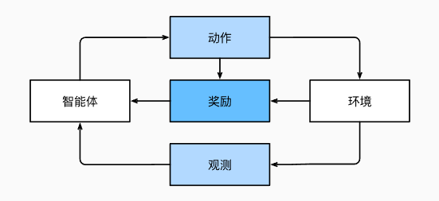

# 基本概念

[1. 引言 — 动手学深度学习 2.0.0 documentation](https://zh.d2l.ai/chapter_introduction/index.html)

## 训练

假设有一个程序，它接收**输入（input）** 后，就会得到**输出（output）**。这个程序有一些**参数（parameter）**，它们控制了程序的行为。通过适当地<u>调整参数</u>，可以让程序的<u>行为</u>更符合我们的预期。任一调整参数后的程序被称为**模型（model）**；通过操作参数而生成的所有不同程序（输入-输出映射）的集合称为“**模型族**”。

当有一个**数据集(dataset)** 后，可以将其放入程序来查看输入输出，并评估好坏，从而调整参数让其行为更好。使用数据集来选择参数的元程序被称为**学习算法（learning algorithm）**。

在机器学习中，**学习（learning）** 是一个**训练（train）** 模型的过程。 通过这个过程，我们可以发现正确的参数集，从而使模型强制执行所需的行为。 换句话说，我们**用数据训练模型**。

训练步骤：
1. 从一个随机初始化参数的模型开始，这个模型基本没有“智能”；
2. 获取一些数据样本（输入和对应的预期输出）；
3. 调整参数，使模型在这些样本中表现得更好；
4. 重复第（2）步和第（3）步，直到模型在任务中的表现令人满意。

> [!note]
> 可见，被训练的程序变成了个黑盒，无需关注其具体逻辑，也能通过自动调参来约束行为。因此，音频输入到智能回答输出可能完全不需要做语音文字识别。

不需要自己设计具体执行逻辑，而是让数据来规定程序该怎么做。这种“通过用数据集来确定程序行为”的方法可以被看作用**数据编程（programming with data）**。

## 核心组件

机器学习的核心组件：
1. 可以用来学习的**数据（data）**；
2. 如何转换数据的**模型（model）**；
3. 一个**目标函数（objective function）**，用来量化模型的有效性；
4. 调整模型参数以优化目标函数的**算法（algorithm）**。

数据集由多个**样本（example, sample）**（或者叫**数据点（data point）** 或者叫**数据实例_data instance）**）组成，这些样本大多是独立同分布的。

通常每个样本由一组称为**特征（features，或协变量（covariates））** 的属性组成。机器学习模型会根据这些属性进行预测。若样本的特征的类别和长度都相同时，说明其特征向量长度是完全一样的，这个长度被称为数据的**维数（dimensionality）**。

> [!example]
> 如果一个图片数据集，所有图片的尺寸和颜色表达方式相同，那么它们就有同等的特征向量长度，其维数为**表达所有像素数据所需的数字数**。

> [!note]
> 与传统机器学习方法相比，深度学习的一个主要优势是可以处理不同长度的数据。

> [!note]
> 深度学习与经典方法的区别主要在于：前者关注的功能强大的模型，这些模型由神经网络错综复杂的交织在一起，包含层层数据转换，因此被称为**深度学习（deep learning）**。

<u>模型的优劣程度</u>的*度量*称为**目标函数（objective function）**（由于很多情况下都是目标函数值越小越优良，因此也称为**损失函数（loss function，或cost function）**）。这种函数往往是可被优化的，即可以知道怎么调整才能让其输出更好。

> [!note]
> - 当任务在试图预测数值时，最常见的损失函数是**平方误差（squared error）**，即预测值与实际值之差的平方。 
> - 当试图解决分类问题时，最常见的目标函数是**最小化错误率**，即预测与实际情况不符的样本比例。 
> 
> 有些目标函数（如平方误差）很容易被优化，有些目标（如错误率）由于不可微性或其他复杂性难以直接优化。 在这些情况下，通常会优化**替代目标**。

可用数据集通常可以分成两部分：
- **训练数据集（training dataset，或训练集（training set））** 用于拟合模型**参数**
- **测试数据集（test dataset，或称为测试集（test set））** 用于**评估**拟合的模型

当一个模型在训练集上表现良好，但不能推广到测试集时，这个模型被称为**过拟合（overfitting）** 的。

大多流行的优化算法通常基于一种基本方法–**梯度下降（gradient descent）** 来调整参数，以降低损失。

## 各种机器学习问题

### 监督学习

**监督学习（supervised learning）** 擅长在“给定输入**特征（feature）**（或者说协变量（covariate））”的情况下预测**标签（label）**（或者说目标（target））（**特征$\rightarrow$标签**）。 每个<u>“特征-标签”对</u>都称为一个**样本（example）**。有时，即使标签是未知的，样本也可以指代输入特征。我们的目标是生成一个模型，<u>能够将任何输入特征映射到标签（即预测）</u>。

- **回归（regression）**：标签是具体的**数值**，如房子信息$\rightarrow$价格。
- **分类（classification）**：标签是**类别（category，正式称为类（class））**。给定一个样本特征，模型为每个可能的类分配一个<u>概率</u>。把分类的各类别的概率乘上该分类的收益（或风险、伤害）就能得到决策的损失函数，从而给出决策。
- **标记问题**：学习预测不相互排斥的类别的问题称为**多标签分类（multi-label classification）**。例如给文章标上多个相关的标签。
- **搜索**：要求结果集有一定的**顺序**，使得用户可以先看到最相关的东西。
- **推荐系统（recommender system）**：进行**个性化**的推荐，以达成目标（如让该用户掏钱或下载）。
- **序列学习**：如果输入之间有相关性，则需要模型对输入有记忆能力（而不能简单当做独立的因变量）。例如视频，通过对每一帧按序解析并结合分析，可以更好地预测下一帧会发生什么。

### 无监督学习

数据中<u>不含有“目标”</u>的机器学习问题通常被为**无监督学习（unsupervised learning）**。即给定数据，但不对输出有明确要求。

- **聚类（clustering）**：将数据分为若干组。
- **主成分分析（principal component analysis）**：能否找到少量的参数来准确地捕捉数据的线性相关属性，即找到能描述数据的最重要的几个方面。
- **因果关系（causality）** 和**概率图模型（probabilistic graphical models）**：找出数据的根本原因。
- **生成对抗性网络（generative adversarial networks）**：提供一种合成数据的方法。

### 与环境互动

上面的所有学习都是先获取完数据再训练，一旦开始训练就与环境不再有关联，因此称为**离线学习（offline learning）**。

如果人工智能拥有与环境互动的能力的话，那么它的行为就必然会对环境产生影响，这需要被顾虑到。这里的人工智能是“**智能代理**”，而不仅是“预测模型”。

### 强化学习

在强化学习问题中，**智能体（agent）** 在一系列的时间步骤上<u>与环境交互</u>。 在每个特定时间点，智能体从环境接收一些**观察（observation）**，并且必须选择一个**动作（action）**，然后通过某种机制（有时称为<u>执行器</u>）将其传输回环境，最后智能体从环境中获得**奖励（reward）**。 此后新一轮循环开始，智能体接收后续观察，并选择后续操作，依此类推。

强化学习的目标是产生一个好的**策略（policy）**。 强化学习智能体选择的“动作”受策略控制，即一个从环境观察映射到行动的功能。

> [!note]
> 强化学习框架的通用性十分强大。 例如，我们可以**将任何监督学习问题转化为强化学习问题**。 假设我们有一个分类问题，可以创建一个强化学习智能体，每个分类对应一个“动作”。 然后，我们可以创建一个环境，该环境给予智能体的奖励。 这个奖励与原始监督学习问题的损失函数是一致的。

- 当环境可被完全观察到时，强化学习问题被称为**马尔可夫决策过程（markov decision process）**。 
- 当状态不依赖于之前的操作时，我们称该问题为**上下文赌博机（contextual bandit problem）**。 
- 当没有状态，只有一组最初未知回报的可用动作时，这个问题就是经典的**多臂赌博机（multi-armed bandit problem）**。

# 线性回归

**回归（regression）** 是能为一个或多个<u>自变量与因变量之间关系</u>建模的一类方法。

**线性回归（linear regression）**假设：
- 自变量和因变量是线性关系。允许包含噪声。
- 任何噪声都比较正常，如遵循正态分布。

对索引为$i$的样本,其输入表示为$\mathbf{x}^{(i)}=[x_1^{(i)},x_2^{(i)}]^\top$，其对应的标签是$y^{(i)}\text{。}$

$w$为**权重（weight）**，$d$为**偏置（bias）**（或offset、intercept），它们是**模型参数（model parameters）**。令$\mathbf x$为单个数据样本的特征，则预测结果$\hat y$可以表示为：
$$\hat{y} = w_1  x_1 + ... + w_d  x_d + b = \mathbf{w}^\top \mathbf{x} + b$$

使用$\mathbf{X} \in \mathbb{R}^{n \times d}$来表示整个数据集的$n$个样本，每一行是一个样本，每一列是一个特征。令特征集合$\mathbf X$的预测结果为$\mathbf{\hat y}$，于是有：
$${\hat{\mathbf{y}}} = \mathbf{X} \mathbf{w} + b$$

线性回归的目标是找到一组权重向量$\mathbf w$和偏置$b$，使得当给定从$\mathbf X$的同分布中取样的新样本特征时，这组权重向量和偏置能够使得<u>新样本预测标签的误差</u>尽可能小。

定义一个样本的平方误差：
$$l^{(i)}(\mathbf{w}, b) = \frac{1}{2} \left(\hat{y}^{(i)} - y^{(i)}\right)^2$$

则所有样本的损失均值：
$$L(\mathbf{w}, b) =\frac{1}{n}\sum_{i=1}^n l^{(i)}(\mathbf{w}, b) =\frac{1}{n} \sum_{i=1}^n \frac{1}{2}\left(\mathbf{w}^\top \mathbf{x}^{(i)} + b - y^{(i)}\right)^2$$

目标是找到$\mathbf{w}^*$和$b^*$来最小化$L$：
$$\mathbf{w}^*, b^* = \operatorname*{argmin}_{\mathbf{w}, b}\  L(\mathbf{w}, b).$$
可以用一个公式简单地表达出来的解叫作**解析解（analytical solution）**。线性回归有解析解。把$b$加入到$\mathbf w$当中，那么就只需要最小化$\|\mathbf{y} - \mathbf{X}\mathbf{w}\|^2$，通过求导就能得到解析解：
$$\mathbf{w}^* = (\mathbf X^\top \mathbf X)^{-1}\mathbf X^\top \mathbf{y}.$$

---
> [!warning]
> 还是没必要抄书了。

这些可以调整但不在训练过程中更新的参数称为**超参数（hyperparameter）**。 **调参（hyperparameter tuning）** 是选择超参数的过程。

