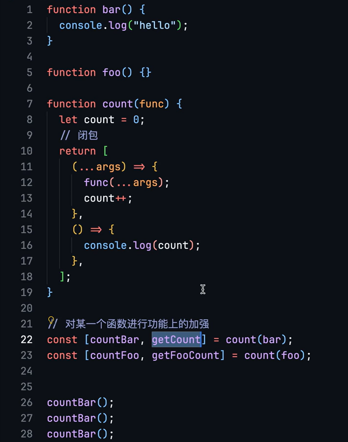

## 加强函数

例如，当我们想实现“统计一个函数的调用次数”时，往往会设一个外部变量count，然后函数内部在最后使用count++。但可以使用闭包技术将当前函数与一个count进行绑定，并且附加逻辑，使得每次调用此函数都会改变count；该count也被绑定到另一个闭包，用于获取count的值。这种**被绑定变量**并且**有附加逻辑**的新函数就是**加强函数**。

在`func(...args)`上下的代码就是调用func的前后自动做的事情。



Rust实现，需要使用Rc来在闭包间共享变量，并且要提前手动clone。

```rust
fn count_function_calls<F, T, R>(f: F) -> (impl Fn(T) -> R, impl Fn() -> usize)  
    where  
        F: Fn(T) -> R, //这样写只支持单一参数的函数f  
{  
    let count = Rc::new(RefCell::new(0));  
    let count_p1 = count.clone();  
    (  
        move |x| {  
            let ret = f(x);  
            *count.borrow_mut() += 1;  
            ret  
        },  
        move || {  
            *count_p1.borrow()  
        }  
    )  
}  
  
// 定义一个函数  
fn add_one(x: i32) -> i32 {  
    x + 1  
}  
  
// 使用count_function_calls函数包装add_one函数  
let (counted_add_one, add_one_counter) = count_function_calls(add_one);  
  
// 调用包装后的函数多次  
let ans = counted_add_one(5);  
println!("Result 1: {}, Function Calls 1: {}", ans, add_one_counter());  
let ans = counted_add_one(8);  
println!("Result 2: {}, Function Calls 2: {}", ans, add_one_counter());
```


## 函数组合 pipe

让初始数据被多个函数加工。

在特殊情况下，初始数据是个oop中的对象，那么如果每个函数都返回对象本身，就可以链式调用实现对对象的不断加工（此时函数像是个方法）。但如果不是对象，就没办法这么做了。

将所有用于加工的函数拼成一个数组`func_arr`，然后就可以基于reduce得到一个被组合的函数，可以接收一个input然后输出被所有函数处理后的结果：
```js
const pipe = (funcs) -> {
	return (input) => {
		return func_arr.reduce((pre,cur)=>{
			return cur(pre);
		}, input);
	}
}
```

cur是当前遍历到的函数，pre是上一次处理的结果。初始数据成为第一个pre，被第一个cur加工后传递给第二个cur，以此类推。

把reduce改成reduceRight，将funcs顺序反过来调用，就是`compose`。

## 柯里化

通过捕获变量来减少函数参数。将函数都柯里化到单参数后就可以塞入pipe。

```js
const curriedMul(i1)=>{
	return(i2)→{
		return(i3)→{
			return multiply(i1,i2,i3);
		};
	};
};
```

调用`curriedMul(1)`时，相当于固定了`i1=1`，返回了个参数用于接下来固定i2，一直到完全固定后才会调用，或者说只剩下一个未固定参数的时候就变成普通函数了。这时候只要调用`curriedMul(1)(2)(3)`即可。

也可以使用数组的来递归地柯里化，可扩展性强：
```js
const curry (fun,arg)
	if (!arg) {
		arg = []
	}
	return(input)=>{
		arg.push(input);
		if (arg.length >= fun.length) {
			return fun(...arg)
		} else {
			return curry(fun, arg);
		}
	};
};

const curriedMul curry(multiply);
console.Log(curriedMul(1)(2)(3));
```

rust的柯里化写法：
```rust
fn main() {  
    let curry_func = move |x| move |y| move |z| x + y + z;  
    let ans: i32 = curry_func(1)(2)(3);  
    println!("{}", ans);  
}
```


