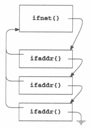
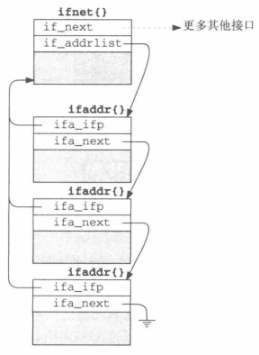
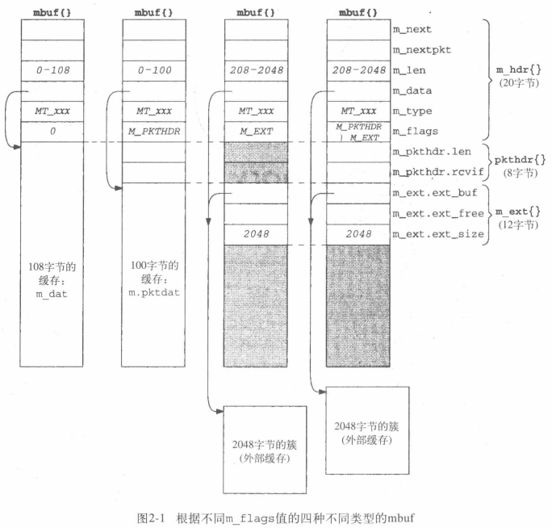
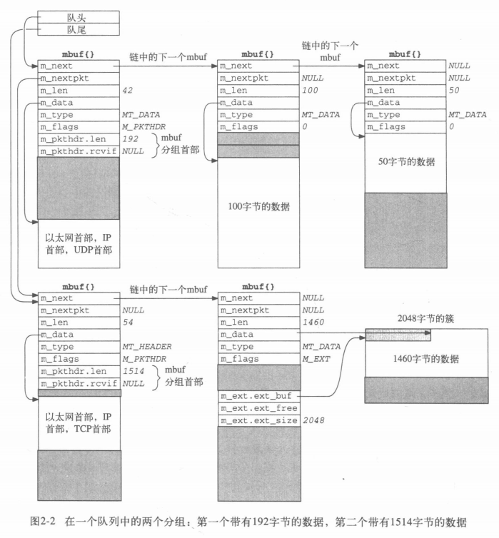

之所以大量使用链表，是为了方便插入删除。
# ifnet

>if=interface

包含所有接口的通用信息。系统初始化时就会给每个网络设备都分配一个`ifnet`，而`if_attach`将这些`ifnet`构造为链表，每个`ifnet`里面都有`if_next`指向链表的下一个结点。

由于一个接口可能使用多个协议需要多个地址，或者使用一个协议也要多个地址，于是一个`ifnet`就需要联结多个`ifaddr`，通过`if_addrlist`链表。

`if_addrlist`示意：


```c
/*
 * Structure describing information about an interface
 * which may be of interest to management entities.
 */
/*
 * Structure defining a queue for a network interface.
 *
 * (Would like to call this struct ``if'', but C isn't PL/1.)
 */
struct ifnet {
	//标识类型
	char	*if_name;		/* name, e.g. ``en'' or ``lo'' */
	//下一个ifnet（作为ifnet链表结点的next）
	struct	ifnet *if_next;		/* all struct ifnets are chained */
	//ifaddr链表（头），一个ifnet关联多个ifaddr
	struct	ifaddr *if_addrlist;	/* linked list of addresses per if */
	
	//if_pcount和if_bpf支持BSD分组过滤器（BPF）
    int	    if_pcount;		/* number of promiscuous listeners */
	caddr_t	if_bpf;			/* packet filter structure */
	
	//接口的”主键“
	u_short	if_index;		/* numeric abbreviation for this if  */
	//对于每个具有相同类型（if_name）的接口来说是“自增主键”
	short	if_unit;		/* sub-unit for lower level driver */
	
	short	if_timer;		/* time 'til if_watchdog called */
	//表示接口操作状态与属性
	short	if_flags;		/* up/down, broadcast, etc. */

	//描述接口的硬件特性
	struct	if_data {
/* generic interface information */
		//指明接口支持的硬件地址类型
		u_char	ifi_type;	/* ethernet, tokenring, etc */
		//数据链路地址长度
		u_char	ifi_addrlen;	/* media address length */
		//实际给分组添加的头部的长度（大于ifi_addrlen）
		u_char	ifi_hdrlen;	/* media header length */
		u_long	ifi_mtu;	/* maximum transmission unit */
		u_long	ifi_metric;	/* routing metric (external only) */
		u_long	ifi_baudrate;	/* linespeed */
/* volatile statistics */
		u_long	ifi_ipackets;	/* packets received on interface */
		u_long	ifi_ierrors;	/* input errors on interface */
		u_long	ifi_opackets;	/* packets sent on interface */
		u_long	ifi_oerrors;	/* output errors on interface */
		u_long	ifi_collisions;	/* collisions on csma interfaces */
		u_long	ifi_ibytes;	/* total number of octets received */
		u_long	ifi_obytes;	/* total number of octets sent */
		u_long	ifi_imcasts;	/* packets received via multicast */
		u_long	ifi_omcasts;	/* packets sent via multicast */
		u_long	ifi_iqdrops;	/* dropped on input, this interface */
		u_long	ifi_noproto;	/* destined for unsupported protocol */
		struct	timeval ifi_lastchange;/* last updated */
	}if_data;
	
/* procedure handles */
	int	(*if_init)		/* init routine */
		__P((int));
	int	(*if_output)		/* output routine (enqueue) */
		__P((struct ifnet *, struct mbuf *, struct sockaddr *,
		     struct rtentry *));
	int	(*if_start)		/* initiate output routine */
		__P((struct ifnet *));
	int	(*if_done)		/* output complete routine */
		__P((struct ifnet *));	/* (XXX not used; fake prototype) */
	int	(*if_ioctl)		/* ioctl routine */
		__P((struct ifnet *, int, caddr_t));
	int	(*if_reset)	
		__P((int));		/* new autoconfig will permit removal */
	int	(*if_watchdog)		/* timer routine */
		__P((int));
		
	//输出队列
	struct	ifqueue {
		struct	mbuf *ifq_head;
		struct	mbuf *ifq_tail;
		int	ifq_len;
		int	ifq_maxlen;
		int	ifq_drops;
	} if_snd;			/* output queue */
};
```

`if_data`里面的这些`ifi_xxx`可以更加快速地访问：

```c
#define	if_mtu		if_data.ifi_mtu
#define	if_type		if_data.ifi_type
#define	if_addrlen	if_data.ifi_addrlen
#define	if_hdrlen	if_data.ifi_hdrlen
#define	if_metric	if_data.ifi_metric
#define	if_baudrate	if_data.ifi_baudrate
#define	if_ipackets	if_data.ifi_ipackets
#define	if_ierrors	if_data.ifi_ierrors
#define	if_opackets	if_data.ifi_opackets
#define	if_oerrors	if_data.ifi_oerrors
#define	if_collisions	if_data.ifi_collisions
#define	if_ibytes	if_data.ifi_ibytes
#define	if_obytes	if_data.ifi_obytes
#define	if_imcasts	if_data.ifi_imcasts
#define	if_omcasts	if_data.ifi_omcasts
#define	if_iqdrops	if_data.ifi_iqdrops
#define	if_noproto	if_data.ifi_noproto
#define	if_lastchange	if_data.ifi_lastchange
```

# ifaddr

存储地址信息。可以分成两部分结构：
1. 存储自己的协议地址与目标的协议地址
2. 维护`if_addrlist`链表

而协议地址又以`sockaddr`结构体存储。

`if_addrlist`具体示意：


```c
struct ifaddr {
	//自己的地址
	struct	sockaddr ifa_addr;	/* address of interface */
	//对方的接口协议地址或者被分配的广播地址，互斥
	union {
		struct	sockaddr ifu_broadaddr;
		struct	sockaddr ifu_dstaddr;
	} ifa_ifu;
	//回指到所属的ifnet
	struct	ifnet *ifa_ifp;		/* back-pointer to interface */
	//下一个ifaddr（作为ifaddr链表结点的next）
	struct	ifaddr *ifa_next;	/* next address for interface */
};
```

# sockaddr

存储具体的地址信息。

`u_char`的存储空间为一个字节。

`sa_data`是结构体的最后一个成员，可变长。但由于`sa_len`只占一个字节，因此`sa_data`的长度也不应超过254字节（带上`len`和`family`为256字节）。

>众所周知C语言可以越界访问内存。而结构体的最后一个成员若是数组，就可以访问到该结构体后面的一段内存。只要在给该结构体分配内存的时候多申请一点儿就不会出问题。

```c
/*
 * Structure used by kernel to store most
 * addresses.
 */
struct sockaddr {
	//指示长度，单位为字节
	u_char	sa_len;			/* total length */
	u_char	sa_family;		/* address family */
	char	sa_data[14];		/* actually longer; address value */
};
```

`sa_family`取值为`AF_xx`：

```c
/*
 * Address families.
 */
#define	AF_UNSPEC	0		/* unspecified */
#define	AF_LOCAL	1		/* local to host (pipes, portals) */
#define	AF_UNIX		AF_LOCAL	/* backward compatibility */
#define	AF_INET		2		/* internetwork: UDP, TCP, etc. */
#define	AF_IMPLINK	3		/* arpanet imp addresses */
#define	AF_PUP		4		/* pup protocols: e.g. BSP */
#define	AF_CHAOS	5		/* mit CHAOS protocols */
#define	AF_NS		6		/* XEROX NS protocols */
#define	AF_ISO		7		/* ISO protocols */
#define	AF_OSI		AF_ISO
#define	AF_ECMA		8		/* european computer manufacturers */
#define	AF_DATAKIT	9		/* datakit protocols */
#define	AF_CCITT	10		/* CCITT protocols, X.25 etc */
#define	AF_SNA		11		/* IBM SNA */
#define AF_DECnet	12		/* DECnet */
#define AF_DLI		13		/* DEC Direct data link interface */
#define AF_LAT		14		/* LAT */
#define	AF_HYLINK	15		/* NSC Hyperchannel */
#define	AF_APPLETALK	16		/* Apple Talk */
#define	AF_ROUTE	17		/* Internal Routing Protocol */
#define	AF_LINK		18		/* Link layer interface */
#define	pseudo_AF_XTP	19		/* eXpress Transfer Protocol (no AF) */
#define	AF_COIP		20		/* connection-oriented IP, aka ST II */
#define	AF_CNT		21		/* Computer Network Technology */
#define pseudo_AF_RTIP	22		/* Help Identify RTIP packets */
#define	AF_IPX		23		/* Novell Internet Protocol */
#define	AF_SIP		24		/* Simple Internet Protocol */
#define pseudo_AF_PIP	25		/* Help Identify PIP packets */

#define	AF_MAX		26
```

# mbuf

>memory buffer

```c
/* header at beginning of each mbuf: */
//所有mbuf都要有的头部
struct m_hdr {
	//把一个分组的mbuf连成链表
	struct	mbuf *mh_next;		/* next buffer in chain */
	//把多个分组连成链表，即把多个链表的表头也连成一个链表
	struct	mbuf *mh_nextpkt;	/* next chain in queue/record */
	int	mh_len;			/* amount of data in this mbuf */
	caddr_t	mh_data;		/* location of data */
	short	mh_type;		/* type of data in this mbuf */
	short	mh_flags;		/* flags; see below */
};

/* record/packet header in first mbuf of chain; valid if M_PKTHDR set */
//有些mbuf的数据部分的第一项，占4+4=8个字节
//用来表示该mbuf是分组的第一个mbuf
struct	pkthdr {
    //该分组的mbuf链表的数据长度总和，即该分组的所有数据长度
	int	len;		/* total packet length */
	//只有接收分组有，指向接收接口ifnet
	struct	ifnet *rcvif;	/* rcv interface */
};

/* description of external storage mapped into mbuf, valid if M_EXT set */
//簇（cluster），外部缓存
struct m_ext {
	caddr_t	ext_buf;		/* start of buffer */
	void	(*ext_free)();		/* free routine if not the usual */
	u_int	ext_size;		/* size of buffer, for ext_free */
};

struct mbuf {
	struct	m_hdr m_hdr;
	union {
		struct {
			//8字节的大分组首部。如果用到了簇，那这首部即使不用也要分配空间
			struct	pkthdr MH_pkthdr;	/* M_PKTHDR set */
			union {
				//使用了簇，剩下的内存全都不需要
				struct	m_ext MH_ext;	/* M_EXT set */
				//不使用簇，则有100字节可以存数据
				char	MH_databuf[MHLEN];
			} MH_dat;
		} MH;
		//满满的108字节
		char	M_databuf[MLEN];		/* !M_PKTHDR, !M_EXT */
	} M_dat;
};
```

两个`union`使得mbuf可以分为四种：


二维mbuf链表图例：



