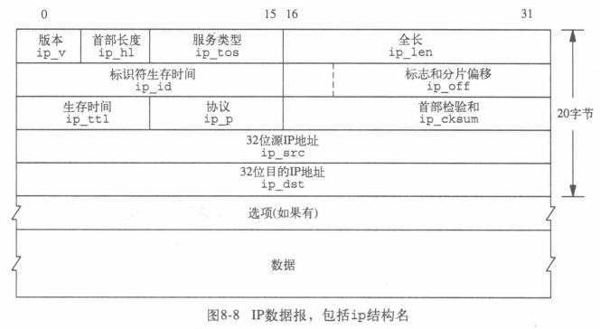
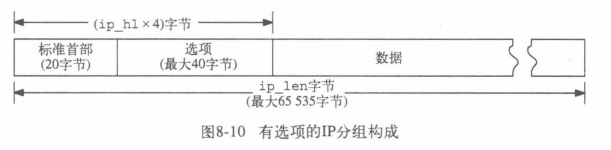

>mtod = mbuf to data

# ip

>short长16bit，-32768~+32767

ip结构体描述的就是标准头部，即下图的“20字节”：



标准首部为20字节，因此ip_hl必须不小于5。大于5则表示IP选项跟在标准首部后面，且长度也是四字节的倍数。




```c
/*
 * Structure of an internet header, naked of options.
 *
 * We declare ip_len and ip_off to be short, rather than u_short
 * pragmatically since otherwise unsigned comparisons can result
 * against negative integers quite easily, and fail in subtle ways.
 */
struct ip {
//ip_hl为头部长度，单位为4字节
#if BYTE_ORDER == LITTLE_ENDIAN 
	u_char	ip_hl:4,		/* header length */
		ip_v:4;			/* version */
#endif
#if BYTE_ORDER == BIG_ENDIAN 
	u_char	ip_v:4,			/* version */
		ip_hl:4;		/* header length */
#endif
	u_char	ip_tos;			/* type of service */
	//max = 2^8-1 = 32767 Byte
	short	ip_len;			/* total length */
	u_short	ip_id;			/* identification */
	short	ip_off;			/* fragment offset field */
#define	IP_DF 0x4000			/* dont fragment flag */
#define	IP_MF 0x2000			/* more fragments flag */
#define	IP_OFFMASK 0x1fff		/* mask for fragmenting bits */
	u_char	ip_ttl;			/* time to live */
	u_char	ip_p;			/* protocol */
	u_short	ip_sum;			/* checksum */
	struct	in_addr ip_src,ip_dst;	/* source and dest address */
};
```


# ip input 
## ipintr

```c
/*
 * Ip input routine.  Checksum and byte swap header.  If fragmented
 * try to reassemble.  Process options.  Pass to next level.
 */
void
ipintr()
{
	register struct ip *ip;
	register struct mbuf *m;
	register struct ipq *fp;
	register struct in_ifaddr *ia;
	int hlen, s;

//每轮循环的开始
next:
	...
	if (m == 0)
		return;
	...

//本机为目的地址时
ours:
	...
	goto next;
	...
	goto found;

found:
	...
	goto next

//差错处理（丢弃）
bad:
	m_freem(m);
	goto next;
}
```

### next

```c
/*
	 * Get next datagram off input queue and get IP header
	 * in first mbuf.
	 */
	s = splimp();
	IF_DEQUEUE(&ipintrq, m);
	splx(s);
	if (m == 0)
		return;
#ifdef	DIAGNOSTIC
	if ((m->m_flags & M_PKTHDR) == 0)
		panic("ipintr no HDR");
#endif
	/*
	 * If no IP addresses have been set yet but the interfaces
	 * are receiving, can't do anything with incoming packets yet.
	 */
	//无IP地址
	if (in_ifaddr == NULL)
		goto bad;
	ipstat.ips_total++;
	if (m->m_len < sizeof (struct ip) &&
	    (m = m_pullup(m, sizeof (struct ip))) == 0) {
		ipstat.ips_toosmall++;
		goto next;
	}
	ip = mtod(m, struct ip *);
	//检查IP版本
	if (ip->ip_v != IPVERSION) {
		ipstat.ips_badvers++;
		goto bad;
	}
	//hlen=4*ip_hl
	hlen = ip->ip_hl << 2;
	//头部长度过小
	if (hlen < sizeof(struct ip)) {	/* minimum header length */
		ipstat.ips_badhlen++;
		goto bad;
	}
	//ip头部被分到了多个mbuf当中
	if (hlen > m->m_len) {
		if ((m = m_pullup(m, hlen)) == 0) {
			ipstat.ips_badhlen++;
			goto next;
		}
		ip = mtod(m, struct ip *);
	}
	//检查校验和（无损数据结果为0）
	if (ip->ip_sum = in_cksum(m, hlen)) {
		ipstat.ips_badsum++;
		goto bad;
	}

	/*
	 * Convert fields to host representation.
	 */
	NTOHS(ip->ip_len);
	if (ip->ip_len < hlen) {
		ipstat.ips_badlen++;
		goto bad;
	}
	NTOHS(ip->ip_id);
	NTOHS(ip->ip_off);

	/*
	 * Check that the amount of data in the buffers
	 * is as at least much as the IP header would have us expect.
	 * Trim mbufs if longer than we expect.
	 * Drop packet if shorter than we expect.
	 */
	//检查m_pkthdr即可知道ip是否传完整了，若丢失字节则丢弃
	if (m->m_pkthdr.len < ip->ip_len) {
		ipstat.ips_tooshort++;
		goto bad;
	}
	if (m->m_pkthdr.len > ip->ip_len) {
		if (m->m_len == m->m_pkthdr.len) {
			m->m_len = ip->ip_len;
			m->m_pkthdr.len = ip->ip_len;
		} else
			//削去多余字节
			m_adj(m, ip->ip_len - m->m_pkthdr.len);
	}

	/*
	 * Process options and, if not destined for us,
	 * ship it on.  ip_dooptions returns 1 when an
	 * error was detected (causing an icmp message
	 * to be sent and the original packet to be freed).
	 */
	//处理选项
	ip_nhops = 0;		/* for source routed packets */
	if (hlen > sizeof (struct ip) && ip_dooptions(m))
		goto next;

	/*
	 * Check our list of addresses, to see if the packet is for us.
	 */
	//遍历in_ifaddr以判断目的地址是否在本机（四种情况）。若在则goto ours。
	for (ia = in_ifaddr; ia; ia = ia->ia_next) {
#define	satosin(sa)	((struct sockaddr_in *)(sa))

		if (IA_SIN(ia)->sin_addr.s_addr == ip->ip_dst.s_addr)
			goto ours;
		if (
#ifdef	DIRECTED_BROADCAST
		    ia->ia_ifp == m->m_pkthdr.rcvif &&
#endif
		    (ia->ia_ifp->if_flags & IFF_BROADCAST)) {
			u_long t;

			if (satosin(&ia->ia_broadaddr)->sin_addr.s_addr ==
			    ip->ip_dst.s_addr)
				goto ours;
			if (ip->ip_dst.s_addr == ia->ia_netbroadcast.s_addr)
				goto ours;
			/*
			 * Look for all-0's host part (old broadcast addr),
			 * either for subnet or net.
			 */
			t = ntohl(ip->ip_dst.s_addr);
			if (t == ia->ia_subnet)
				goto ours;
			if (t == ia->ia_net)
				goto ours;
		}
	}
	//广播相关
	if (IN_MULTICAST(ntohl(ip->ip_dst.s_addr))) {
		struct in_multi *inm;
#ifdef MROUTING
		extern struct socket *ip_mrouter;

		if (ip_mrouter) {
			/*
			 * If we are acting as a multicast router, all
			 * incoming multicast packets are passed to the
			 * kernel-level multicast forwarding function.
			 * The packet is returned (relatively) intact; if
			 * ip_mforward() returns a non-zero value, the packet
			 * must be discarded, else it may be accepted below.
			 *
			 * (The IP ident field is put in the same byte order
			 * as expected when ip_mforward() is called from
			 * ip_output().)
			 */
			ip->ip_id = htons(ip->ip_id);
			if (ip_mforward(m, m->m_pkthdr.rcvif) != 0) {
				ipstat.ips_cantforward++;
				m_freem(m);
				goto next;
			}
			ip->ip_id = ntohs(ip->ip_id);

			/*
			 * The process-level routing demon needs to receive
			 * all multicast IGMP packets, whether or not this
			 * host belongs to their destination groups.
			 */
			if (ip->ip_p == IPPROTO_IGMP)
				goto ours;
			ipstat.ips_forward++;
		}
#endif
		/*
		 * See if we belong to the destination multicast group on the
		 * arrival interface.
		 */
		IN_LOOKUP_MULTI(ip->ip_dst, m->m_pkthdr.rcvif, inm);
		if (inm == NULL) {
			ipstat.ips_cantforward++;
			m_freem(m);
			goto next;
		}
		goto ours;
	}
	if (ip->ip_dst.s_addr == (u_long)INADDR_BROADCAST)
		goto ours;
	if (ip->ip_dst.s_addr == INADDR_ANY)
		goto ours;

	/*
	 * Not for us; forward if possible and desirable.
	 */
	//判断是否能转发
	if (ipforwarding == 0) {
		ipstat.ips_cantforward++;
		m_freem(m);
	} else
		//转发
		ip_forward(m, 0);
	goto next;
```

## ip_forward

```c
/*
 * Forward a packet.  If some error occurs return the sender
 * an icmp packet.  Note we can't always generate a meaningful
 * icmp message because icmp doesn't have a large enough repertoire
 * of codes and types.
 *
 * If not forwarding, just drop the packet.  This could be confusing
 * if ipforwarding was zero but some routing protocol was advancing
 * us as a gateway to somewhere.  However, we must let the routing
 * protocol deal with that.
 *
 * The srcrt parameter indicates whether the packet is being forwarded
 * via a source route. 包含源路由时为1
 */
void
ip_forward(m, srcrt)
	struct mbuf *m;
	int srcrt;
{
	//register关键字用于请求编译器将该变量存于寄存器中
	register struct ip *ip = mtod(m, struct ip *);
	register struct sockaddr_in *sin;
	register struct rtentry *rt;
	int error, type = 0, code;
	struct mbuf *mcopy;
	n_long dest;
	struct ifnet *destifp;

	dest = 0;
#ifdef DIAGNOSTIC
	if (ipprintfs)
		printf("forward: src %x dst %x ttl %x\n", ip->ip_src,
			ip->ip_dst, ip->ip_ttl);
#endif
	//丢弃某些种分组
	if (m->m_flags & M_BCAST || in_canforward(ip->ip_dst) == 0) {
		ipstat.ips_cantforward++;
		m_freem(m);
		return;
	}
	//减少TTL
	HTONS(ip->ip_id);
	if (ip->ip_ttl <= IPTTLDEC) {
		icmp_error(m, ICMP_TIMXCEED, ICMP_TIMXCEED_INTRANS, dest, 0);
		return;
	}
	ip->ip_ttl -= IPTTLDEC;

	//定位下一跳
	sin = (struct sockaddr_in *)&ipforward_rt.ro_dst;
	if ((rt = ipforward_rt.ro_rt) == 0 ||
	    ip->ip_dst.s_addr != sin->sin_addr.s_addr) {
		if (ipforward_rt.ro_rt) {
			RTFREE(ipforward_rt.ro_rt);
			ipforward_rt.ro_rt = 0;
		}
		sin->sin_family = AF_INET;
		sin->sin_len = sizeof(*sin);
		sin->sin_addr = ip->ip_dst;

		rtalloc(&ipforward_rt);
		if (ipforward_rt.ro_rt == 0) {
			icmp_error(m, ICMP_UNREACH, ICMP_UNREACH_HOST, dest, 0);
			return;
		}
		rt = ipforward_rt.ro_rt;
	}

	/*
	 * Save at most 64 bytes of the packet in case
	 * we need to generate an ICMP message to the src.
	 */
	//保存前64字节来发ICMP差错报文
	mcopy = m_copy(m, 0, imin((int)ip->ip_len, 64));

/*--- 决定是否发送ICMP重定向报文 */

#ifdef GATEWAY
	ip_ifmatrix[rt->rt_ifp->if_index +
	     if_index * m->m_pkthdr.rcvif->if_index]++;
#endif
	/*
	 * If forwarding packet using same interface that it came in on,
	 * perhaps should send a redirect to sender to shortcut a hop.
	 * Only send redirect if source is sending directly to us,
	 * and if packet was not source routed (or has any options).
	 * Also, don't send redirect if forwarding using a default route
	 * or a route modified by a redirect.
	 */
#define	satosin(sa)	((struct sockaddr_in *)(sa))
	if (rt->rt_ifp == m->m_pkthdr.rcvif &&
	    (rt->rt_flags & (RTF_DYNAMIC|RTF_MODIFIED)) == 0 &&
	    satosin(rt_key(rt))->sin_addr.s_addr != 0 &&
	    ipsendredirects && !srcrt) {
#define	RTA(rt)	((struct in_ifaddr *)(rt->rt_ifa))
		u_long src = ntohl(ip->ip_src.s_addr);

		if (RTA(rt) &&
		    (src & RTA(rt)->ia_subnetmask) == RTA(rt)->ia_subnet) {
		    if (rt->rt_flags & RTF_GATEWAY)
			dest = satosin(rt->rt_gateway)->sin_addr.s_addr;
		    else
			dest = ip->ip_dst.s_addr;
		    /* Router requirements says to only send host redirects */
		    type = ICMP_REDIRECT;
		    code = ICMP_REDIRECT_HOST;
#ifdef DIAGNOSTIC
		    if (ipprintfs)
		        printf("redirect (%d) to %lx\n", code, (u_long)dest);
#endif
		}
	}

/*---*/

	//调用ip_output把分组转发到ipforward_rt指定的下一跳
	error = ip_output(m, (struct mbuf *)0, &ipforward_rt, IP_FORWARDING
#ifdef DIRECTED_BROADCAST
			    | IP_ALLOWBROADCAST
#endif
						, 0);
	if (error)
		ipstat.ips_cantforward++;
	else {
		ipstat.ips_forward++;
		if (type)
			ipstat.ips_redirectsent++;
		else {
			//发送成功且不用重定向，则事情做完了，不需要mcopy这64字节
			if (mcopy)
				m_freem(mcopy);
			return;
		}
	}
	if (mcopy == NULL)
		return;
	destifp = NULL;

	switch (error) {

	case 0:				/* forwarded, but need redirect */
		/* type, code set above */
		break;

	case ENETUNREACH:		/* shouldn't happen, checked above */
	case EHOSTUNREACH: //找不到主机路由
	case ENETDOWN: //路由对应的输出接口未运行
	case EHOSTDOWN: //接口无法发给主机
	default:
		type = ICMP_UNREACH;
		code = ICMP_UNREACH_HOST;
		break;

	case EMSGSIZE: //对接口来说分组太大且禁止切片
		type = ICMP_UNREACH;
		code = ICMP_UNREACH_NEEDFRAG;
		if (ipforward_rt.ro_rt)
			destifp = ipforward_rt.ro_rt->rt_ifp;
		ipstat.ips_cantfrag++;
		break;

	case ENOBUFS: //(no buffer)接口队列满或内核运存不足
		type = ICMP_SOURCEQUENCH;
		code = 0;
		break;
	}
	icmp_error(mcopy, type, code, dest, destifp);
}
```

# ip output


```c
/*
 * IP output.  The packet in mbuf chain m contains a skeletal IP
 * header (with len, off, ttl, proto, tos, src, dst).
 * The mbuf chain containing the packet will be freed.
 * The mbuf opt, if present, will not be freed.
 */
int
ip_output(m0, opt, ro, flags, imo)
	struct mbuf *m0;
	struct mbuf *opt;
	struct route *ro;
	int flags;
	struct ip_moptions *imo;
{
	register struct ip *ip, *mhip;
	register struct ifnet *ifp;
	register struct mbuf *m = m0;
	register int hlen = sizeof (struct ip);
	int len, off, error = 0;
	struct route iproute;
	struct sockaddr_in *dst;
	struct in_ifaddr *ia;

#ifdef	DIAGNOSTIC
	if ((m->m_flags & M_PKTHDR) == 0)
		panic("ip_output no HDR");
#endif

	//构造IP首部
	if (opt) {
		m = ip_insertoptions(m, opt, &len);
		hlen = len;
	}
	ip = mtod(m, struct ip *); //读取数据
	/*
	 * Fill in IP header.
	 */
	if ((flags & (IP_FORWARDING|IP_RAWOUTPUT)) == 0) {
		ip->ip_v = IPVERSION;
		ip->ip_off &= IP_DF;
		ip->ip_id = htons(ip_id++); //序号自增
		ip->ip_hl = hlen >> 2; //长度/4
		ipstat.ips_localout++;
	} else {
		hlen = ip->ip_hl << 2;
	}

/*--- 路由选择*/
	...

/*--- 源地址选择和分片*/
	...
```

# ip checksum

```c
/*
 * Checksum routine for Internet Protocol family headers (Portable Version).
 *
 * This routine is very heavily used in the network
 * code and should be modified for each CPU to be as fast as possible.
 */

#define ADDCARRY(x)  (x > 65535 ? x -= 65535 : x)
#define REDUCE {l_util.l = sum; sum = l_util.s[0] + l_util.s[1]; ADDCARRY(sum);}

int
in_cksum(m, len)
	register struct mbuf *m;
	register int len;
{
	register u_short *w;
	register int sum = 0;
	register int mlen = 0;
	int byte_swapped = 0;

	union {
		char	c[2];
		u_short	s;
	} s_util;
	union {
		u_short s[2];
		long	l;
	} l_util;

	for (;m && len; m = m->m_next) {
		if (m->m_len == 0)
			continue;
		w = mtod(m, u_short *);
		if (mlen == -1) {
			/*
			 * The first byte of this mbuf is the continuation
			 * of a word spanning between this mbuf and the
			 * last mbuf.
			 *
			 * s_util.c[0] is already saved when scanning previous 
			 * mbuf.
			 */
			s_util.c[1] = *(char *)w;
			sum += s_util.s;
			w = (u_short *)((char *)w + 1);
			mlen = m->m_len - 1;
			len--;
		} else
			mlen = m->m_len;
		if (len < mlen)
			mlen = len;
		len -= mlen;
		/*
		 * Force to even boundary.
		 */
		//奇数时，将多出来的字节保留，以让剩余字节组成字（16位、2字节）
		if ((1 & (int) w) && (mlen > 0)) {
			REDUCE;
			sum <<= 8; //左移8位
			s_util.c[0] = *(u_char *)w;
			w = (u_short *)((char *)w + 1);
			mlen--;
			byte_swapped = 1;
		}
		/*
		 * Unroll the loop to make overhead from
		 * branches &c small.
		 */
		//分三个阶段把字加到和中
		while ((mlen -= 32) >= 0) {
			sum += w[0]; sum += w[1]; sum += w[2]; sum += w[3];
			sum += w[4]; sum += w[5]; sum += w[6]; sum += w[7];
			sum += w[8]; sum += w[9]; sum += w[10]; sum += w[11];
			sum += w[12]; sum += w[13]; sum += w[14]; sum += w[15];
			w += 16;
		}
		mlen += 32;
		while ((mlen -= 8) >= 0) {
			sum += w[0]; sum += w[1]; sum += w[2]; sum += w[3];
			w += 4;
		}
		mlen += 8;
		if (mlen == 0 && byte_swapped == 0)
			continue;
		REDUCE;
		while ((mlen -= 2) >= 0) {
			sum += *w++;
		}
		if (byte_swapped) {
			REDUCE;
			sum <<= 8;
			byte_swapped = 0;
			if (mlen == -1) {
				s_util.c[1] = *(char *)w;
				sum += s_util.s;
				mlen = 0;
			} else
				mlen = -1;
		} else if (mlen == -1)
			s_util.c[0] = *(char *)w;
	}
	if (len)
		printf("cksum: out of data\n");
	if (mlen == -1) {
		/* The last mbuf has odd # of bytes. Follow the
		   standard (the odd byte may be shifted left by 8 bits
		   or not as determined by endian-ness of the machine) */
		s_util.c[1] = 0;
		sum += s_util.s;
	}
	REDUCE;
	return (~sum & 0xffff);
}
```


