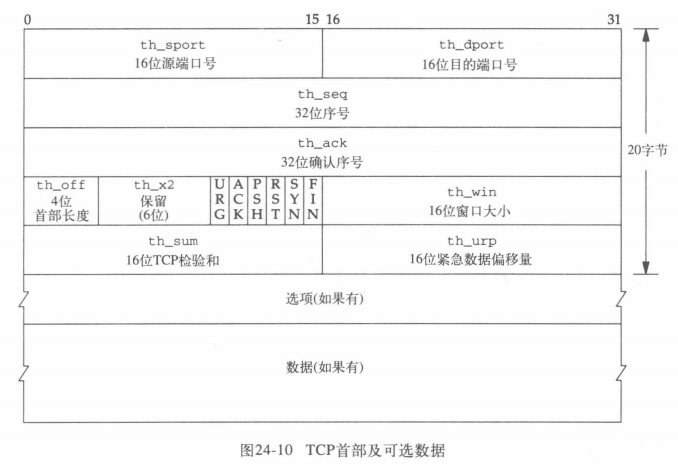
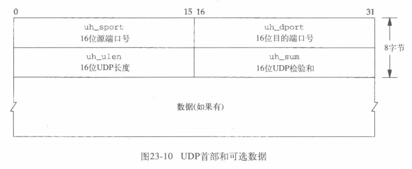

# tcp

> u_char 8bit， u_short 16bit， u_long 32bit 

> `u_char th_x2:4;` 表示`th_x2`只占4bit

```c
typedef	u_long	tcp_seq;
/*
 * TCP header.
 * Per RFC 793, September, 1981.
 */
struct tcphdr {
	u_short	th_sport;		/* source port */
	u_short	th_dport;		/* destination port */
	tcp_seq	th_seq;			/* sequence number */
	tcp_seq	th_ack;			/* acknowledgement number */
#if BYTE_ORDER == LITTLE_ENDIAN 
	u_char	th_x2:4,		/* (unused) */
		th_off:4;		/* data offset */
#endif
#if BYTE_ORDER == BIG_ENDIAN 
	u_char	th_off:4,		/* data offset */
		th_x2:4;		/* (unused) */
#endif
	u_char	th_flags;
#define	TH_FIN	0x01
#define	TH_SYN	0x02
#define	TH_RST	0x04
#define	TH_PUSH	0x08
#define	TH_ACK	0x10
#define	TH_URG	0x20
	u_short	th_win;			/* window */
	u_short	th_sum;			/* checksum */
	u_short	th_urp;			/* urgent pointer */
};
```



# tcp output

## 基本属性

```c
/*
 * Tcp output routine: figure out what should be sent and send it.
 */
int
tcp_output(tp)
	register struct tcpcb *tp;
{
	register struct socket *so = tp->t_inpcb->inp_socket;
	register long len, win;
	int off, flags, error;
	register struct mbuf *m;
	register struct tcpiphdr *ti;
	u_char opt[MAX_TCPOPTLEN];
	unsigned optlen, hdrlen;
	int idle, sendalot;

	/*
	 * Determine length of data that should be transmitted,
	 * and flags that will be used.
	 * If there is some data or critical controls (SYN, RST)
	 * to send, then transmit; otherwise, investigate further.
	 * 目前所有发送的序号都被确认，不需要等待对方的ACK时，为真
	 */
	idle = (tp->snd_max == tp->snd_una);
	if (idle && tp->t_idle >= tp->t_rxtcur)
		/*
		 * We have been idle for "a while" and no acks are
		 * expected to clock out any data we send --
		 * slow start to get ack "clock" running again.
		 * 若不在等ACK并且RTT内没有东西到来，则把拥塞窗口置为1MSS
		 */
		tp->snd_cwnd = tp->t_maxseg;
```

## again 1

```c
again:
	sendalot = 0; //要发送多个报文时为1
	off = tp->snd_nxt - tp->snd_una;
	//win变量第一部分：表示允许的最大发送量
	win = min(tp->snd_wnd, tp->snd_cwnd); //计算拥塞窗口

	flags = tcp_outflags[tp->t_state]; //获取flag位
	/*
	 * If in persist timeout with window of 0, send 1 byte.
	 * Otherwise, if window is small but nonzero
	 * and timer expired, we will send what we can
	 * and go to transmit state.
	 * 强制发送
	 */
	if (tp->t_force) {
		if (win == 0) {
			/*
			 * If we still have some data to send, then
			 * clear the FIN bit.  Usually this would
			 * happen below when it realizes that we
			 * aren't sending all the data.  However,
			 * if we have exactly 1 byte of unset data,
			 * then it won't clear the FIN bit below,
			 * and if we are in persist state, we wind
			 * up sending the packet without recording
			 * that we sent the FIN bit.
			 *
			 * We can't just blindly clear the FIN bit,
			 * because if we don't have any more data
			 * to send then the probe will be the FIN
			 * itself.
			 */
			if (off < so->so_snd.sb_cc) //存在数据
				flags &= ~TH_FIN; //清楚FIN标志
			win = 1; //强迫发一个字节
		} else { //有带外数据要发送
			tp->t_timer[TCPT_PERSIST] = 0;
			tp->t_rxtshift = 0;
		}
	}

	//待发送长度和win大小求最小值
	//off去除了已发送的部分
	len = min(so->so_snd.sb_cc, win) - off; 

	//可能是接收方缩小了窗口
	if (len < 0) {
		/*
		 * If FIN has been sent but not acked,
		 * but we haven't been called to retransmit,
		 * len will be -1.  Otherwise, window shrank
		 * after we sent into it.  If window shrank to 0,
		 * cancel pending retransmit and pull snd_nxt
		 * back to (closed) window.  We will enter persist
		 * state below.  If the window didn't close completely,
		 * just wait for an ACK.
		 */
		len = 0;
		if (win == 0) {
			tp->t_timer[TCPT_REXMT] = 0;
			tp->snd_nxt = tp->snd_una;
		}
	}
	//待发送长度大于MSS，则要求发送MSS
	if (len > tp->t_maxseg) {
		len = tp->t_maxseg;
		sendalot = 1; //标记要发送更多的数据报
	}
	//未发送完毕，所以得清除FIN标志
	if (SEQ_LT(tp->snd_nxt + len, tp->snd_una + so->so_snd.sb_cc))
		flags &= ~TH_FIN;

```

## again 2

> 糊涂窗口综合征（SWS）：接收处理过慢或发送端本身一直发小包，导致这一个连接互相之间一直发小包，而小包里面大部分都是协议头部，导致大比例的资源都被浪费在传输协议头部上

```c
	//win变量第二部分：表示本地接收缓存中可用空间大小，即向对方通知的接收窗口大小
	win = sbspace(&so->so_rcv);

	/*
	 * Sender silly window avoidance.  If connection is idle
	 * and can send all data, a maximum segment,
	 * at least a maximum default-size segment do it,
	 * or are forced, do it; otherwise don't bother.
	 * If peer's buffer is tiny, then send
	 * when window is at least half open.
	 * If retransmitting (possibly after persist timer forced us
	 * to send into a small window), then must resend.
	 */
	//几种发送情况分支，以避免糊涂窗口综合征（SWS）
	if (len) {
		if (len == tp->t_maxseg)
			goto send;
		if ((idle || tp->t_flags & TF_NODELAY) &&
		    len + off >= so->so_snd.sb_cc)
			goto send;
		if (tp->t_force)
			goto send;
		if (len >= tp->max_sndwnd / 2)
			goto send;
		if (SEQ_LT(tp->snd_nxt, tp->snd_max))
			goto send;
	}

	/*
	 * Compare available window to amount of window
	 * known to peer (as advertised window less
	 * next expected input).  If the difference is at least two
	 * max size segments, or at least 50% of the maximum possible
	 * window, then want to send a window update to peer.
	 */
	//判断是否要发送窗口更新报文
	if (win > 0) {
		/* 
		 * "adv" is the amount we can increase the window,
		 * taking into account that we are limited by
		 * TCP_MAXWIN << tp->rcv_scale.
		 */
		//接收方接收窗口与连接上允许的最大窗口大小之间的最小值
		//即TCP当前能够向对端发送的接收窗口的最大值
		long adv = min(win, (long)TCP_MAXWIN << tp->rcv_scale) -
			(tp->rcv_adv - tp->rcv_nxt);

		if (adv >= (long) (2 * tp->t_maxseg))
			goto send;
		if (2 * adv >= (long) so->so_rcv.sb_hiwat)
			goto send;
	}

	//查看各标志位等，发送所需的数据报
	/*
	 * Send if we owe peer an ACK.
	 */
	if (tp->t_flags & TF_ACKNOW)
		goto send;
	if (flags & (TH_SYN|TH_RST))
		goto send;
	if (SEQ_GT(tp->snd_up, tp->snd_una))
		goto send;
	/*
	 * If our state indicates that FIN should be sent
	 * and we have not yet done so, or we're retransmitting the FIN,
	 * then we need to send.
	 */
	if (flags & TH_FIN &&
	    ((tp->t_flags & TF_SENTFIN) == 0 || tp->snd_nxt == tp->snd_una))
		goto send;

	/*
	 * TCP window updates are not reliable, rather a polling protocol
	 * using ``persist'' packets is used to insure receipt of window
	 * updates.  The three ``states'' for the output side are:
	 *	idle			not doing retransmits or persists
	 *	persisting		to move a small or zero window
	 *	(re)transmitting	and thereby not persisting
	 *
	 * tp->t_timer[TCPT_PERSIST]
	 *	is set when we are in persist state.
	 * tp->t_force
	 *	is set when we are called to send a persist packet.
	 * tp->t_timer[TCPT_REXMT]
	 *	is set when we are retransmitting
	 * The output side is idle when both timers are zero.
	 *
	 * If send window is too small, there is data to transmit, and no
	 * retransmit or persist is pending, then go to persist state.
	 * If nothing happens soon, send when timer expires:
	 * if window is nonzero, transmit what we can,
	 * otherwise force out a byte.
	 */
	if (so->so_snd.sb_cc && tp->t_timer[TCPT_REXMT] == 0 &&
	    tp->t_timer[TCPT_PERSIST] == 0) {
		tp->t_rxtshift = 0;
		tcp_setpersist(tp);
	}

	/*
	 * No reason to send a segment, just return.
	 */
	return (0);
```

## send 1

```c
send:
	/*
	 * Before ESTABLISHED, force sending of initial options
	 * unless TCP set not to do any options.
	 * NOTE: we assume that the IP/TCP header plus TCP options
	 * always fit in a single mbuf, leaving room for a maximum
	 * link header, i.e.
	 *	max_linkhdr + sizeof (struct tcpiphdr) + optlen <= MHLEN
	 */
	optlen = 0; //选项长度
	hdrlen = sizeof (struct tcpiphdr); //头部长度
	//如果有SYN
	if (flags & TH_SYN) {
		tp->snd_nxt = tp->iss;
		if ((tp->t_flags & TF_NOOPT) == 0) {
			u_short mss;

			opt[0] = TCPOPT_MAXSEG;
			opt[1] = 4;
			mss = htons((u_short) tcp_mss(tp, 0));
			bcopy((caddr_t)&mss, (caddr_t)(opt + 2), sizeof(mss));
			optlen = 4;
	 
			if ((tp->t_flags & TF_REQ_SCALE) &&
			    ((flags & TH_ACK) == 0 ||
			    (tp->t_flags & TF_RCVD_SCALE))) {
				*((u_long *) (opt + optlen)) = htonl(
					TCPOPT_NOP << 24 |
					TCPOPT_WINDOW << 16 |
					TCPOLEN_WINDOW << 8 |
					tp->request_r_scale);
				optlen += 4;
			}
		}
 	}
 
 	/*
	 * Send a timestamp and echo-reply if this is a SYN and our side 
	 * wants to use timestamps (TF_REQ_TSTMP is set) or both our side
	 * and our peer have sent timestamps in our SYN's.
 	 */
 	//是否要时间戳
 	if ((tp->t_flags & (TF_REQ_TSTMP|TF_NOOPT)) == TF_REQ_TSTMP &&
 	     (flags & TH_RST) == 0 &&
 	    ((flags & (TH_SYN|TH_ACK)) == TH_SYN ||
	     (tp->t_flags & TF_RCVD_TSTMP))) {
		u_long *lp = (u_long *)(opt + optlen);
 
 		/* Form timestamp option as shown in appendix A of RFC 1323. */
 		*lp++ = htonl(TCPOPT_TSTAMP_HDR);
 		*lp++ = htonl(tcp_now);
 		*lp   = htonl(tp->ts_recent);
 		optlen += TCPOLEN_TSTAMP_APPA;
 	}

 	hdrlen += optlen; //头部长度加上选项长度
 
	/*
	 * Adjust data length if insertion of options will
	 * bump the packet length beyond the t_maxseg length.
	 */
	 //若选项会导致长度大于MSS，则要发不止一次
	 if (len > tp->t_maxseg - optlen) {
		len = tp->t_maxseg - optlen;
		sendalot = 1;
	 }


#ifdef DIAGNOSTIC
 	if (max_linkhdr + hdrlen > MHLEN)
		panic("tcphdr too big");
#endif
```

## send 2

```c
	/*
	 * Grab a header mbuf, attaching a copy of data to
	 * be transmitted, and initialize the header from
	 * the template for sends on this connection.
	 */
	if (len) {
		//统计值
		if (tp->t_force && len == 1)
			tcpstat.tcps_sndprobe++;
		else if (SEQ_LT(tp->snd_nxt, tp->snd_max)) {
			tcpstat.tcps_sndrexmitpack++;
			tcpstat.tcps_sndrexmitbyte += len;
		} else {
			tcpstat.tcps_sndpack++;
			tcpstat.tcps_sndbyte += len;
		}
#ifdef notyet
		if ((m = m_copypack(so->so_snd.sb_mb, off,
		    (int)len, max_linkhdr + hdrlen)) == 0) {
			error = ENOBUFS;
			goto out;
		}
		/*
		 * m_copypack left space for our hdr; use it.
		 */
		m->m_len += hdrlen;
		m->m_data -= hdrlen;
#else
		MGETHDR(m, M_DONTWAIT, MT_HEADER);
		if (m == NULL) {
			error = ENOBUFS;
			goto out;
		}
		m->m_data += max_linkhdr; //给链路层
		m->m_len = hdrlen; //mbuf设为头部长度
		//判断长度
		if (len <= MHLEN - hdrlen - max_linkhdr) {
			//够小，直接塞
			m_copydata(so->so_snd.sb_mb, off, (int) len,
			    mtod(m, caddr_t) + hdrlen);
			m->m_len += len;
		} else {
			//太长，新建mbuf
			m->m_next = m_copy(so->so_snd.sb_mb, off, (int) len);
			if (m->m_next == 0)
				len = 0;
		}
#endif
		/*
		 * If we're sending everything we've got, set PUSH.
		 * (This will keep happy those implementations which only
		 * give data to the user when a buffer fills or
		 * a PUSH comes in.)
		 */
		if (off + len == so->so_snd.sb_cc)
			flags |= TH_PUSH;
	} else { //纯ACK
		//统计量
		if (tp->t_flags & TF_ACKNOW)
			tcpstat.tcps_sndacks++;
		else if (flags & (TH_SYN|TH_FIN|TH_RST))
			tcpstat.tcps_sndctrl++;
		else if (SEQ_GT(tp->snd_up, tp->snd_una))
			tcpstat.tcps_sndurg++;
		else
			tcpstat.tcps_sndwinup++;

		MGETHDR(m, M_DONTWAIT, MT_HEADER);
		if (m == NULL) {
			error = ENOBUFS;
			goto out;
		}
		m->m_data += max_linkhdr;
		m->m_len = hdrlen;
	}
	m->m_pkthdr.rcvif = (struct ifnet *)0;
	ti = mtod(m, struct tcpiphdr *);
	if (tp->t_template == 0)
		panic("tcp_output");
	bcopy((caddr_t)tp->t_template, (caddr_t)ti, sizeof (struct tcpiphdr));
```

```c
	/*
	 * Fill in fields, remembering maximum advertised
	 * window for use in delaying messages about window sizes.
	 * If resending a FIN, be sure not to use a new sequence number.
	 * FIN重传，让snd_nxt--
	 */
	if (flags & TH_FIN && tp->t_flags & TF_SENTFIN && 
	    tp->snd_nxt == tp->snd_max)
		tp->snd_nxt--;
	/*
	 * If we are doing retransmissions, then snd_nxt will
	 * not reflect the first unsent octet.  For ACK only
	 * packets, we do not want the sequence number of the
	 * retransmitted packet, we want the sequence number
	 * of the next unsent octet.  So, if there is no data
	 * (and no SYN or FIN), use snd_max instead of snd_nxt
	 * when filling in ti_seq.  But if we are in persist
	 * state, snd_max might reflect one byte beyond the
	 * right edge of the window, so use snd_nxt in that
	 * case, since we know we aren't doing a retransmission.
	 * (retransmit and persist are mutually exclusive...)
	 */
	if (len || (flags & (TH_SYN|TH_FIN)) || tp->t_timer[TCPT_PERSIST])
		ti->ti_seq = htonl(tp->snd_nxt); //填充发送序列号
	else
		ti->ti_seq = htonl(tp->snd_max); //异常情况
	ti->ti_ack = htonl(tp->rcv_nxt); //填充ACK序列号
	//将选项填充进头
	if (optlen) {
		bcopy((caddr_t)opt, (caddr_t)(ti + 1), optlen);
		ti->ti_off = (sizeof (struct tcphdr) + optlen) >> 2;
	}
	ti->ti_flags = flags;
	/*
	 * Calculate receive window.  Don't shrink window,
	 * but avoid silly window syndrome.
	 */
	//窗口设置
	if (win < (long)(so->so_rcv.sb_hiwat / 4) && win < (long)tp->t_maxseg)
		win = 0;
	if (win > (long)TCP_MAXWIN << tp->rcv_scale)
		win = (long)TCP_MAXWIN << tp->rcv_scale;
	if (win < (long)(tp->rcv_adv - tp->rcv_nxt))
		win = (long)(tp->rcv_adv - tp->rcv_nxt);
	ti->ti_win = htons((u_short) (win>>tp->rcv_scale));
	if (SEQ_GT(tp->snd_up, tp->snd_nxt)) {
		ti->ti_urp = htons((u_short)(tp->snd_up - tp->snd_nxt));
		ti->ti_flags |= TH_URG;
	} else
		/*
		 * If no urgent pointer to send, then we pull
		 * the urgent pointer to the left edge of the send window
		 * so that it doesn't drift into the send window on sequence
		 * number wraparound.
		 */
		tp->snd_up = tp->snd_una;		/* drag it along */

	/*
	 * Put TCP length in extended header, and then
	 * checksum extended header and data.
	 */
	if (len + optlen)
		ti->ti_len = htons((u_short)(sizeof (struct tcphdr) +
		    optlen + len));
	ti->ti_sum = in_cksum(m, (int)(hdrlen + len));

	/*
	 * In transmit state, time the transmission and arrange for
	 * the retransmit.  In persist state, just set snd_max.
	 */
	if (tp->t_force == 0 || tp->t_timer[TCPT_PERSIST] == 0) {
		tcp_seq startseq = tp->snd_nxt;

		/*
		 * Advance snd_nxt over sequence space of this segment.
		 */
		if (flags & (TH_SYN|TH_FIN)) {
			if (flags & TH_SYN)
				tp->snd_nxt++;
			if (flags & TH_FIN) {
				tp->snd_nxt++;
				tp->t_flags |= TF_SENTFIN;
			}
		}
		tp->snd_nxt += len;
		if (SEQ_GT(tp->snd_nxt, tp->snd_max)) {
			tp->snd_max = tp->snd_nxt;
			/*
			 * Time this transmission if not a retransmission and
			 * not currently timing anything.
			 */
			if (tp->t_rtt == 0) {
				tp->t_rtt = 1;
				tp->t_rtseq = startseq;
				tcpstat.tcps_segstimed++;
			}
		}

		/*
		 * Set retransmit timer if not currently set,
		 * and not doing an ack or a keep-alive probe.
		 * Initial value for retransmit timer is smoothed
		 * round-trip time + 2 * round-trip time variance.
		 * Initialize shift counter which is used for backoff
		 * of retransmit time.
		 */
		if (tp->t_timer[TCPT_REXMT] == 0 &&
		    tp->snd_nxt != tp->snd_una) {
			tp->t_timer[TCPT_REXMT] = tp->t_rxtcur;
			if (tp->t_timer[TCPT_PERSIST]) {
				tp->t_timer[TCPT_PERSIST] = 0;
				tp->t_rxtshift = 0;
			}
		}
	} else
		if (SEQ_GT(tp->snd_nxt + len, tp->snd_max))
			tp->snd_max = tp->snd_nxt + len;

	/*
	 * Trace.
	 */
	if (so->so_options & SO_DEBUG)
		tcp_trace(TA_OUTPUT, tp->t_state, tp, ti, 0);

	/*
	 * Fill in IP length and desired time to live and
	 * send to IP level.  There should be a better way
	 * to handle ttl and tos; we could keep them in
	 * the template, but need a way to checksum without them.
	 */
	m->m_pkthdr.len = hdrlen + len; //调整mbuf的头部的长度项
#ifdef TUBA
	if (tp->t_tuba_pcb)
		error = tuba_output(m, tp);
	else
#endif
    {
	((struct ip *)ti)->ip_len = m->m_pkthdr.len;
	((struct ip *)ti)->ip_ttl = tp->t_inpcb->inp_ip.ip_ttl;	/* XXX */
	((struct ip *)ti)->ip_tos = tp->t_inpcb->inp_ip.ip_tos;	/* XXX */
#if BSD >= 43
	error = ip_output(m, tp->t_inpcb->inp_options, &tp->t_inpcb->inp_route,
	    so->so_options & SO_DONTROUTE, 0);
#else
	error = ip_output(m, (struct mbuf *)0, &tp->t_inpcb->inp_route, 
	    so->so_options & SO_DONTROUTE);
#endif
    }
	if (error) {
out:
		//分配mbuf失败
		if (error == ENOBUFS) {
			tcp_quench(tp->t_inpcb, 0);
			return (0);
		}
		if ((error == EHOSTUNREACH || error == ENETDOWN)
		    && TCPS_HAVERCVDSYN(tp->t_state)) {
			tp->t_softerror = error;
			return (0);
		}
		return (error);
	}
	tcpstat.tcps_sndtotal++;

	/*
	 * Data sent (as far as we can tell).
	 * If this advertises a larger window than any other segment,
	 * then remember the size of the advertised window.
	 * Any pending ACK has now been sent.
	 */
	if (win > 0 && SEQ_GT(tp->rcv_nxt+win, tp->rcv_adv))
		tp->rcv_adv = tp->rcv_nxt + win;
	tp->last_ack_sent = tp->rcv_nxt; //记录上次发送的ACK
	tp->t_flags &= ~(TF_ACKNOW|TF_DELACK);
	//如果还有数据要发送，则回到again再来一次
	if (sendalot)
		goto again;
	return (0);
}
```
# tcp input


```c
/*
 * TCP input routine, follows pages 65-76 of the
 * protocol specification dated September, 1981 very closely.
 */
void
tcp_input(m, iphlen)
	register struct mbuf *m;
	int iphlen;
{
	register struct tcpiphdr *ti;
	register struct inpcb *inp;
	caddr_t optp = NULL;
	int optlen;
	int len, tlen, off;
	register struct tcpcb *tp = 0;
	register int tiflags;
	struct socket *so;
	int todrop, acked, ourfinisacked, needoutput = 0;
	short ostate;
	struct in_addr laddr;
	int dropsocket = 0;
	int iss = 0;
	u_long tiwin, ts_val, ts_ecr;
	int ts_present = 0;

	tcpstat.tcps_rcvtotal++;
	/*
	 * Get IP and TCP header together in first mbuf.
	 * Note: IP leaves IP header in first mbuf.
	 */
	ti = mtod(m, struct tcpiphdr *);
	if (iphlen > sizeof (struct ip)) //丢弃IP选项
		ip_stripoptions(m, (struct mbuf *)0);
	if (m->m_len < sizeof (struct tcpiphdr)) {
		if ((m = m_pullup(m, sizeof (struct tcpiphdr))) == 0) {
			tcpstat.tcps_rcvshort++;
			return;
		}
		ti = mtod(m, struct tcpiphdr *);
	}

	/*
	 * Checksum extended TCP header and data.
	 */
	tlen = ((struct ip *)ti)->ip_len;
	len = sizeof (struct ip) + tlen;
	ti->ti_next = ti->ti_prev = 0;
	ti->ti_x1 = 0;
	ti->ti_len = (u_short)tlen;
	HTONS(ti->ti_len);
	//计算校验和
	if (ti->ti_sum = in_cksum(m, len)) {
		tcpstat.tcps_rcvbadsum++;
		goto drop;
	}
#endif /* TUBA_INCLUDE */

	/*
	 * Check that TCP offset makes sense,
	 * pull out TCP options and adjust length.		XXX
	 */
	off = ti->ti_off << 2;
	if (off < sizeof (struct tcphdr) || off > tlen) {
		tcpstat.tcps_rcvbadoff++;
		goto drop;
	}
	tlen -= off; //减去TCP首部，得到数据长度
	ti->ti_len = tlen;
	if (off > sizeof (struct tcphdr)) {
		if (m->m_len < sizeof(struct ip) + off) {
			if ((m = m_pullup(m, sizeof (struct ip) + off)) == 0) {
				tcpstat.tcps_rcvshort++;
				return;
			}
			ti = mtod(m, struct tcpiphdr *);
		}
		//获取TCP选项
		optlen = off - sizeof (struct tcphdr);
		optp = mtod(m, caddr_t) + sizeof (struct tcpiphdr);
		/* 
		 * Do quick retrieval of timestamp options ("options
		 * prediction?").  If timestamp is the only option and it's
		 * formatted as recommended in RFC 1323 appendix A, we
		 * quickly get the values now and not bother calling
		 * tcp_dooptions(), etc.
		 */
		if ((optlen == TCPOLEN_TSTAMP_APPA ||
		     (optlen > TCPOLEN_TSTAMP_APPA &&
			optp[TCPOLEN_TSTAMP_APPA] == TCPOPT_EOL)) &&
		     *(u_long *)optp == htonl(TCPOPT_TSTAMP_HDR) &&
		     (ti->ti_flags & TH_SYN) == 0) {
			ts_present = 1;
			ts_val = ntohl(*(u_long *)(optp + 4));
			ts_ecr = ntohl(*(u_long *)(optp + 8));
			optp = NULL;	/* we've parsed the options */
		}
	}
	tiflags = ti->ti_flags;

	/*
	 * Convert TCP protocol specific fields to host format.
	 * 转换为主机字节序
	 */
	NTOHL(ti->ti_seq);
	NTOHL(ti->ti_ack);
	NTOHS(ti->ti_win);
	NTOHS(ti->ti_urp);
```

## findpcb

```c
	/*
	 * Locate pcb for segment.
	 */
findpcb:
	inp = tcp_last_inpcb;
	if (inp->inp_lport != ti->ti_dport ||
	    inp->inp_fport != ti->ti_sport ||
	    inp->inp_faddr.s_addr != ti->ti_src.s_addr ||
	    inp->inp_laddr.s_addr != ti->ti_dst.s_addr) {
		inp = in_pcblookup(&tcb, ti->ti_src, ti->ti_sport,
		    ti->ti_dst, ti->ti_dport, INPLOOKUP_WILDCARD);
		if (inp)
			tcp_last_inpcb = inp;
		++tcpstat.tcps_pcbcachemiss;
	}

	/*
	 * If the state is CLOSED (i.e., TCB does not exist) then
	 * all data in the incoming segment is discarded.
	 * If the TCB exists but is in CLOSED state, it is embryonic,
	 * but should either do a listen or a connect soon.
	 */
	if (inp == 0)
		goto dropwithreset;
	tp = intotcpcb(inp);
	if (tp == 0)
		goto dropwithreset;
	if (tp->t_state == TCPS_CLOSED) //关掉，丢弃
		goto drop;
	
	/* Unscale the window into a 32-bit value. */
	if ((tiflags & TH_SYN) == 0) //调整窗口大小
		tiwin = ti->ti_win << tp->snd_scale;
	else
		tiwin = ti->ti_win;

	so = inp->inp_socket;
	if (so->so_options & (SO_DEBUG|SO_ACCEPTCONN)) {
		if (so->so_options & SO_DEBUG) {
			ostate = tp->t_state;
			tcp_saveti = *ti;
		}
		if (so->so_options & SO_ACCEPTCONN) {
			so = sonewconn(so, 0);
			if (so == 0)
				goto drop;
			/*
			 * This is ugly, but ....
			 *
			 * Mark socket as temporary until we're
			 * committed to keeping it.  The code at
			 * ``drop'' and ``dropwithreset'' check the
			 * flag dropsocket to see if the temporary
			 * socket created here should be discarded.
			 * We mark the socket as discardable until
			 * we're committed to it below in TCPS_LISTEN.
			 */
			dropsocket++;
			inp = (struct inpcb *)so->so_pcb;
			inp->inp_laddr = ti->ti_dst;
			inp->inp_lport = ti->ti_dport;
#if BSD>=43
			inp->inp_options = ip_srcroute();
#endif
			tp = intotcpcb(inp);
			tp->t_state = TCPS_LISTEN;

			/* Compute proper scaling value from buffer space
			 */
			while (tp->request_r_scale < TCP_MAX_WINSHIFT &&
			   TCP_MAXWIN << tp->request_r_scale < so->so_rcv.sb_hiwat)
				tp->request_r_scale++;
		}
	}

	/*
	 * Segment received on connection.
	 * Reset idle time and keep-alive timer.
	 */
	tp->t_idle = 0;
	tp->t_timer[TCPT_KEEP] = tcp_keepidle;

	/*
	 * Process options if not in LISTEN state,
	 * else do it below (after getting remote address).
	 */
	if (optp && tp->t_state != TCPS_LISTEN)
		tcp_dooptions(tp, optp, optlen, ti,
			&ts_present, &ts_val, &ts_ecr);

	/* 
	 * Header prediction: check for the two common cases
	 * of a uni-directional data xfer.  If the packet has
	 * no control flags, is in-sequence, the window didn't
	 * change and we're not retransmitting, it's a
	 * candidate.  If the length is zero and the ack moved
	 * forward, we're the sender side of the xfer.  Just
	 * free the data acked & wake any higher level process
	 * that was blocked waiting for space.  If the length
	 * is non-zero and the ack didn't move, we're the
	 * receiver side.  If we're getting packets in-order
	 * (the reassembly queue is empty), add the data to
	 * the socket buffer and note that we need a delayed ack.
	 */
	if (tp->t_state == TCPS_ESTABLISHED &&
	    (tiflags & (TH_SYN|TH_FIN|TH_RST|TH_URG|TH_ACK)) == TH_ACK &&
	    (!ts_present || TSTMP_GEQ(ts_val, tp->ts_recent)) &&
	    ti->ti_seq == tp->rcv_nxt &&
	    tiwin && tiwin == tp->snd_wnd &&
	    tp->snd_nxt == tp->snd_max) {

		/* 
		 * If last ACK falls within this segment's sequence numbers,
		 *  record the timestamp.
		 */
		if (ts_present && SEQ_LEQ(ti->ti_seq, tp->last_ack_sent) &&
		   SEQ_LT(tp->last_ack_sent, ti->ti_seq + ti->ti_len)) {
			tp->ts_recent_age = tcp_now;
			tp->ts_recent = ts_val;
		}

		//处理ACK
		if (ti->ti_len == 0) {
			if (SEQ_GT(ti->ti_ack, tp->snd_una) &&
			    SEQ_LEQ(ti->ti_ack, tp->snd_max) &&
			    tp->snd_cwnd >= tp->snd_wnd) {
				/*
				 * this is a pure ack for outstanding data.
				 */
				++tcpstat.tcps_predack;
				if (ts_present)
					tcp_xmit_timer(tp, tcp_now-ts_ecr+1);
				else if (tp->t_rtt &&
					    SEQ_GT(ti->ti_ack, tp->t_rtseq))
					tcp_xmit_timer(tp, tp->t_rtt);
				acked = ti->ti_ack - tp->snd_una; //确认的字节数
				tcpstat.tcps_rcvackpack++;
				tcpstat.tcps_rcvackbyte += acked;
				sbdrop(&so->so_snd, acked); //删掉缓存中已被确认的数据
				tp->snd_una = ti->ti_ack;
				m_freem(m); //free掉mbuf

				/*
				 * If all outstanding data are acked, stop
				 * retransmit timer, otherwise restart timer
				 * using current (possibly backed-off) value.
				 * If process is waiting for space,
				 * wakeup/selwakeup/signal.  If data
				 * are ready to send, let tcp_output
				 * decide between more output or persist.
				 */
				if (tp->snd_una == tp->snd_max)
					tp->t_timer[TCPT_REXMT] = 0;
				else if (tp->t_timer[TCPT_PERSIST] == 0)
					tp->t_timer[TCPT_REXMT] = tp->t_rxtcur;

				if (so->so_snd.sb_flags & SB_NOTIFY)
					sowwakeup(so);
				if (so->so_snd.sb_cc)
					(void) tcp_output(tp);
				return;
			}
		} else if (ti->ti_ack == tp->snd_una &&
		    tp->seg_next == (struct tcpiphdr *)tp &&
		    ti->ti_len <= sbspace(&so->so_rcv)) {
			/*
			 * this is a pure, in-sequence data packet
			 * with nothing on the reassembly queue and
			 * we have enough buffer space to take it.
			 */
			++tcpstat.tcps_preddat;
			tp->rcv_nxt += ti->ti_len;
			tcpstat.tcps_rcvpack++;
			tcpstat.tcps_rcvbyte += ti->ti_len;
			/*
			 * Drop TCP, IP headers and TCP options then add data
			 * to socket buffer.
			 */
			m->m_data += sizeof(struct tcpiphdr)+off-sizeof(struct tcphdr);
			m->m_len -= sizeof(struct tcpiphdr)+off-sizeof(struct tcphdr);
			sbappend(&so->so_rcv, m);
			sorwakeup(so);
			tp->t_flags |= TF_DELACK;
			return;
		}
	}

	/*
	 * Drop TCP, IP headers and TCP options.
	 * 扔掉头部和选项
	 */
	m->m_data += sizeof(struct tcpiphdr)+off-sizeof(struct tcphdr);
	m->m_len  -= sizeof(struct tcpiphdr)+off-sizeof(struct tcphdr);

	/*
	 * Calculate amount of space in receive window,
	 * and then do TCP input processing.
	 * Receive window is amount of space in rcv queue,
	 * but not less than advertised window.
	 */
	{ int win;

	//调整窗口
	win = sbspace(&so->so_rcv);
	if (win < 0)
		win = 0;
	tp->rcv_wnd = max(win, (int)(tp->rcv_adv - tp->rcv_nxt));
	}
```

## switch

```c
	//根据当前状态做出不同行为
	switch (tp->t_state) {

	/*
	 * If the state is LISTEN then ignore segment if it contains an RST.
	 * If the segment contains an ACK then it is bad and send a RST.
	 * If it does not contain a SYN then it is not interesting; drop it.
	 * Don't bother responding if the destination was a broadcast.
	 * Otherwise initialize tp->rcv_nxt, and tp->irs, select an initial
	 * tp->iss, and send a segment:
	 *     <SEQ=ISS><ACK=RCV_NXT><CTL=SYN,ACK>
	 * Also initialize tp->snd_nxt to tp->iss+1 and tp->snd_una to tp->iss.
	 * Fill in remote peer address fields if not previously specified.
	 * Enter SYN_RECEIVED state, and process any other fields of this
	 * segment in this state.
	 */
	//LISTEN状态
	case TCPS_LISTEN: {
		struct mbuf *am;
		register struct sockaddr_in *sin;

		if (tiflags & TH_RST)
			goto drop;
		if (tiflags & TH_ACK)
			goto dropwithreset;
		if ((tiflags & TH_SYN) == 0)
			goto drop;
		/*
		 * RFC1122 4.2.3.10, p. 104: discard bcast/mcast SYN
		 * in_broadcast() should never return true on a received
		 * packet with M_BCAST not set.
		 */
		if (m->m_flags & (M_BCAST|M_MCAST) ||
		    IN_MULTICAST(ti->ti_dst.s_addr))
			goto drop;
		am = m_get(M_DONTWAIT, MT_SONAME);	/* XXX */
		if (am == NULL)
			goto drop;
		am->m_len = sizeof (struct sockaddr_in);
		sin = mtod(am, struct sockaddr_in *);
		sin->sin_family = AF_INET;
		sin->sin_len = sizeof(*sin);
		sin->sin_addr = ti->ti_src;
		sin->sin_port = ti->ti_sport;
		bzero((caddr_t)sin->sin_zero, sizeof(sin->sin_zero));
		laddr = inp->inp_laddr;
		if (inp->inp_laddr.s_addr == INADDR_ANY)
			inp->inp_laddr = ti->ti_dst;
		if (in_pcbconnect(inp, am)) {
			inp->inp_laddr = laddr;
			(void) m_free(am);
			goto drop;
		}
		(void) m_free(am);
		tp->t_template = tcp_template(tp);
		if (tp->t_template == 0) {
			tp = tcp_drop(tp, ENOBUFS);
			dropsocket = 0;		/* socket is already gone */
			goto drop;
		}
		if (optp)
			tcp_dooptions(tp, optp, optlen, ti,
				&ts_present, &ts_val, &ts_ecr);
		if (iss)
			tp->iss = iss;
		else
			tp->iss = tcp_iss;
		tcp_iss += TCP_ISSINCR/2;
		tp->irs = ti->ti_seq;
		tcp_sendseqinit(tp);
		tcp_rcvseqinit(tp);
		tp->t_flags |= TF_ACKNOW;
		tp->t_state = TCPS_SYN_RECEIVED;
		tp->t_timer[TCPT_KEEP] = TCPTV_KEEP_INIT;
		dropsocket = 0;		/* committed to socket */
		tcpstat.tcps_accepts++;
		goto trimthenstep6;
		}

	/*
	 * If the state is SYN_SENT:
	 *	if seg contains an ACK, but not for our SYN, drop the input.
	 *	if seg contains a RST, then drop the connection.
	 *	if seg does not contain SYN, then drop it.
	 * Otherwise this is an acceptable SYN segment
	 *	initialize tp->rcv_nxt and tp->irs
	 *	if seg contains ack then advance tp->snd_una
	 *	if SYN has been acked change to ESTABLISHED else SYN_RCVD state
	 *	arrange for segment to be acked (eventually)
	 *	continue processing rest of data/controls, beginning with URG
	 */
	//已经发送了SYN报文段，等待接收SYN报文段以及对发送的SYN报文段的ACK
	case TCPS_SYN_SENT:
		if ((tiflags & TH_ACK) &&
		    (SEQ_LEQ(ti->ti_ack, tp->iss) ||
		     SEQ_GT(ti->ti_ack, tp->snd_max)))
			goto dropwithreset;
		if (tiflags & TH_RST) {
			if (tiflags & TH_ACK)
				tp = tcp_drop(tp, ECONNREFUSED);
			goto drop;
		}
		if ((tiflags & TH_SYN) == 0)
			goto drop;
		if (tiflags & TH_ACK) {
			tp->snd_una = ti->ti_ack;
			if (SEQ_LT(tp->snd_nxt, tp->snd_una))
				tp->snd_nxt = tp->snd_una;
		}
		tp->t_timer[TCPT_REXMT] = 0;
		tp->irs = ti->ti_seq;
		tcp_rcvseqinit(tp);
		tp->t_flags |= TF_ACKNOW;
		if (tiflags & TH_ACK && SEQ_GT(tp->snd_una, tp->iss)) {
			tcpstat.tcps_connects++;
			soisconnected(so);
			tp->t_state = TCPS_ESTABLISHED;
			/* Do window scaling on this connection? */
			if ((tp->t_flags & (TF_RCVD_SCALE|TF_REQ_SCALE)) ==
				(TF_RCVD_SCALE|TF_REQ_SCALE)) {
				tp->snd_scale = tp->requested_s_scale;
				tp->rcv_scale = tp->request_r_scale;
			}
			(void) tcp_reass(tp, (struct tcpiphdr *)0,
				(struct mbuf *)0);
			/*
			 * if we didn't have to retransmit the SYN,
			 * use its rtt as our initial srtt & rtt var.
			 */
			if (tp->t_rtt)
				tcp_xmit_timer(tp, tp->t_rtt);
		} else
			tp->t_state = TCPS_SYN_RECEIVED;

trimthenstep6:
		/*
		 * Advance ti->ti_seq to correspond to first data byte.
		 * If data, trim to stay within window,
		 * dropping FIN if necessary.
		 */
		ti->ti_seq++;
		if (ti->ti_len > tp->rcv_wnd) {
			todrop = ti->ti_len - tp->rcv_wnd;
			m_adj(m, -todrop);
			ti->ti_len = tp->rcv_wnd;
			tiflags &= ~TH_FIN;
			tcpstat.tcps_rcvpackafterwin++;
			tcpstat.tcps_rcvbyteafterwin += todrop;
		}
		tp->snd_wl1 = ti->ti_seq - 1;
		tp->rcv_up = ti->ti_seq;
		goto step6;
	}

	/*
	 * States other than LISTEN or SYN_SENT.
	 * First check timestamp, if present.
	 * Then check that at least some bytes of segment are within 
	 * receive window.  If segment begins before rcv_nxt,
	 * drop leading data (and SYN); if nothing left, just ack.
	 * 
	 * RFC 1323 PAWS: If we have a timestamp reply on this segment
	 * and it's less than ts_recent, drop it.
	 */
	if (ts_present && (tiflags & TH_RST) == 0 && tp->ts_recent &&
	    TSTMP_LT(ts_val, tp->ts_recent)) {

		/* Check to see if ts_recent is over 24 days old.  */
		if ((int)(tcp_now - tp->ts_recent_age) > TCP_PAWS_IDLE) {
			/*
			 * Invalidate ts_recent.  If this segment updates
			 * ts_recent, the age will be reset later and ts_recent
			 * will get a valid value.  If it does not, setting
			 * ts_recent to zero will at least satisfy the
			 * requirement that zero be placed in the timestamp
			 * echo reply when ts_recent isn't valid.  The
			 * age isn't reset until we get a valid ts_recent
			 * because we don't want out-of-order segments to be
			 * dropped when ts_recent is old.
			 */
			tp->ts_recent = 0;
		} else {
			tcpstat.tcps_rcvduppack++;
			tcpstat.tcps_rcvdupbyte += ti->ti_len;
			tcpstat.tcps_pawsdrop++;
			goto dropafterack;
		}
	}

	todrop = tp->rcv_nxt - ti->ti_seq;
	if (todrop > 0) {
		if (tiflags & TH_SYN) {
			tiflags &= ~TH_SYN;
			ti->ti_seq++;
			if (ti->ti_urp > 1) 
				ti->ti_urp--;
			else
				tiflags &= ~TH_URG;
			todrop--;
		}
		if (todrop >= ti->ti_len) {
			tcpstat.tcps_rcvduppack++;
			tcpstat.tcps_rcvdupbyte += ti->ti_len;
			/*
			 * If segment is just one to the left of the window,
			 * check two special cases:
			 * 1. Don't toss RST in response to 4.2-style keepalive.
			 * 2. If the only thing to drop is a FIN, we can drop
			 *    it, but check the ACK or we will get into FIN
			 *    wars if our FINs crossed (both CLOSING).
			 * In either case, send ACK to resynchronize,
			 * but keep on processing for RST or ACK.
			 */
			if ((tiflags & TH_FIN && todrop == ti->ti_len + 1)
#ifdef TCP_COMPAT_42
			  || (tiflags & TH_RST && ti->ti_seq == tp->rcv_nxt - 1)
#endif
			   ) {
				todrop = ti->ti_len;
				tiflags &= ~TH_FIN;
				tp->t_flags |= TF_ACKNOW;
			} else {
				/*
				 * Handle the case when a bound socket connects
				 * to itself. Allow packets with a SYN and
				 * an ACK to continue with the processing.
				 */
				if (todrop != 0 || (tiflags & TH_ACK) == 0)
					goto dropafterack;
			}
		} else {
			tcpstat.tcps_rcvpartduppack++;
			tcpstat.tcps_rcvpartdupbyte += todrop;
		}
		m_adj(m, todrop);
		ti->ti_seq += todrop;
		ti->ti_len -= todrop;
		if (ti->ti_urp > todrop)
			ti->ti_urp -= todrop;
		else {
			tiflags &= ~TH_URG;
			ti->ti_urp = 0;
		}
	}

	/*
	 * If new data are received on a connection after the
	 * user processes are gone, then RST the other end.
	 */
	if ((so->so_state & SS_NOFDREF) &&
	    tp->t_state > TCPS_CLOSE_WAIT && ti->ti_len) {
		tp = tcp_close(tp);
		tcpstat.tcps_rcvafterclose++;
		goto dropwithreset;
	}

	/*
	 * If segment ends after window, drop trailing data
	 * (and PUSH and FIN); if nothing left, just ACK.
	 */
	todrop = (ti->ti_seq+ti->ti_len) - (tp->rcv_nxt+tp->rcv_wnd);
	if (todrop > 0) {
		tcpstat.tcps_rcvpackafterwin++;
		if (todrop >= ti->ti_len) {
			tcpstat.tcps_rcvbyteafterwin += ti->ti_len;
			/*
			 * If a new connection request is received
			 * while in TIME_WAIT, drop the old connection
			 * and start over if the sequence numbers
			 * are above the previous ones.
			 */
			if (tiflags & TH_SYN &&
			    tp->t_state == TCPS_TIME_WAIT &&
			    SEQ_GT(ti->ti_seq, tp->rcv_nxt)) {
				iss = tp->rcv_nxt + TCP_ISSINCR;
				tp = tcp_close(tp);
				goto findpcb;
			}
			/*
			 * If window is closed can only take segments at
			 * window edge, and have to drop data and PUSH from
			 * incoming segments.  Continue processing, but
			 * remember to ack.  Otherwise, drop segment
			 * and ack.
			 */
			if (tp->rcv_wnd == 0 && ti->ti_seq == tp->rcv_nxt) {
				tp->t_flags |= TF_ACKNOW;
				tcpstat.tcps_rcvwinprobe++;
			} else
				goto dropafterack;
		} else
			tcpstat.tcps_rcvbyteafterwin += todrop;
		m_adj(m, -todrop);
		ti->ti_len -= todrop;
		tiflags &= ~(TH_PUSH|TH_FIN);
	}

	/*
	 * If last ACK falls within this segment's sequence numbers,
	 * record its timestamp.
	 */
	if (ts_present && SEQ_LEQ(ti->ti_seq, tp->last_ack_sent) &&
	    SEQ_LT(tp->last_ack_sent, ti->ti_seq + ti->ti_len +
		   ((tiflags & (TH_SYN|TH_FIN)) != 0))) {
		tp->ts_recent_age = tcp_now;
		tp->ts_recent = ts_val;
	}

	/*
	 * If the RST bit is set examine the state:
	 *    SYN_RECEIVED STATE:
	 *	If passive open, return to LISTEN state.
	 *	If active open, inform user that connection was refused.
	 *    ESTABLISHED, FIN_WAIT_1, FIN_WAIT2, CLOSE_WAIT STATES:
	 *	Inform user that connection was reset, and close tcb.
	 *    CLOSING, LAST_ACK, TIME_WAIT STATES
	 *	Close the tcb.
	 */
	if (tiflags&TH_RST) switch (tp->t_state) {

	//在连接未建立阶段出现RST，关闭
	case TCPS_SYN_RECEIVED:
		so->so_error = ECONNREFUSED;
		goto close;

	//在连接状态或者在连接未完全关闭阶段出现RST，关闭
	case TCPS_ESTABLISHED:
	case TCPS_FIN_WAIT_1:
	case TCPS_FIN_WAIT_2:
	case TCPS_CLOSE_WAIT:
		so->so_error = ECONNRESET;
	close:
		tp->t_state = TCPS_CLOSED;
		tcpstat.tcps_drops++;
		tp = tcp_close(tp);
		goto drop;

	case TCPS_CLOSING:
	case TCPS_LAST_ACK:
	case TCPS_TIME_WAIT:
		tp = tcp_close(tp);
		goto drop;
	}
```

## ack

```c

	/*
	 * If a SYN is in the window, then this is an
	 * error and we send an RST and drop the connection.
	 * 还有SYN，丢弃并向对端发送RST
	 */
	if (tiflags & TH_SYN) {
		tp = tcp_drop(tp, ECONNRESET);
		goto dropwithreset;
	}

	/*
	 * If the ACK bit is off we drop the segment and return.
	 * 没有ACK，丢弃
	 */
	if ((tiflags & TH_ACK) == 0)
		goto drop;
	
	/*
	 * Ack processing.
	 * 根据ACK更新数据
	 */
	switch (tp->t_state) {

	/*
	 * In SYN_RECEIVED state if the ack ACKs our SYN then enter
	 * ESTABLISHED state and continue processing, otherwise
	 * send an RST.
	 */
	case TCPS_SYN_RECEIVED:
		if (SEQ_GT(tp->snd_una, ti->ti_ack) ||
		    SEQ_GT(ti->ti_ack, tp->snd_max))
			goto dropwithreset;
		tcpstat.tcps_connects++;
		soisconnected(so);
		tp->t_state = TCPS_ESTABLISHED;
		/* Do window scaling? */
		if ((tp->t_flags & (TF_RCVD_SCALE|TF_REQ_SCALE)) ==
			(TF_RCVD_SCALE|TF_REQ_SCALE)) {
			tp->snd_scale = tp->requested_s_scale;
			tp->rcv_scale = tp->request_r_scale;
		}
		(void) tcp_reass(tp, (struct tcpiphdr *)0, (struct mbuf *)0);
		tp->snd_wl1 = ti->ti_seq - 1;
		/* fall into ... */

	/*
	 * In ESTABLISHED state: drop duplicate ACKs; ACK out of range
	 * ACKs.  If the ack is in the range
	 *	tp->snd_una < ti->ti_ack <= tp->snd_max
	 * then advance tp->snd_una to ti->ti_ack and drop
	 * data from the retransmission queue.  If this ACK reflects
	 * more up to date window information we update our window information.
	 */
	case TCPS_ESTABLISHED:
	case TCPS_FIN_WAIT_1:
	case TCPS_FIN_WAIT_2:
	case TCPS_CLOSE_WAIT:
	case TCPS_CLOSING:
	case TCPS_LAST_ACK:
	case TCPS_TIME_WAIT:

		if (SEQ_LEQ(ti->ti_ack, tp->snd_una)) {
			if (ti->ti_len == 0 && tiwin == tp->snd_wnd) {
				tcpstat.tcps_rcvdupack++;
				/*
				 * If we have outstanding data (other than
				 * a window probe), this is a completely
				 * duplicate ack (ie, window info didn't
				 * change), the ack is the biggest we've
				 * seen and we've seen exactly our rexmt
				 * threshhold of them, assume a packet
				 * has been dropped and retransmit it.
				 * Kludge snd_nxt & the congestion
				 * window so we send only this one
				 * packet.
				 *
				 * We know we're losing at the current
				 * window size so do congestion avoidance
				 * (set ssthresh to half the current window
				 * and pull our congestion window back to
				 * the new ssthresh).
				 *
				 * Dup acks mean that packets have left the
				 * network (they're now cached at the receiver) 
				 * so bump cwnd by the amount in the receiver
				 * to keep a constant cwnd packets in the
				 * network.
				 */
				if (tp->t_timer[TCPT_REXMT] == 0 ||
				    ti->ti_ack != tp->snd_una)
					tp->t_dupacks = 0;
				else if (++tp->t_dupacks == tcprexmtthresh) {
					tcp_seq onxt = tp->snd_nxt;
					u_int win =
					    min(tp->snd_wnd, tp->snd_cwnd) / 2 /
						tp->t_maxseg;

					if (win < 2)
						win = 2;
					tp->snd_ssthresh = win * tp->t_maxseg;
					tp->t_timer[TCPT_REXMT] = 0;
					tp->t_rtt = 0;
					tp->snd_nxt = ti->ti_ack;
					tp->snd_cwnd = tp->t_maxseg;
					(void) tcp_output(tp);
					tp->snd_cwnd = tp->snd_ssthresh +
					       tp->t_maxseg * tp->t_dupacks;
					if (SEQ_GT(onxt, tp->snd_nxt))
						tp->snd_nxt = onxt;
					goto drop;
				} else if (tp->t_dupacks > tcprexmtthresh) {
					tp->snd_cwnd += tp->t_maxseg;
					(void) tcp_output(tp);
					goto drop;
				}
			} else
				tp->t_dupacks = 0;
			break;
		}
		/*
		 * If the congestion window was inflated to account
		 * for the other side's cached packets, retract it.
		 */
		if (tp->t_dupacks > tcprexmtthresh &&
		    tp->snd_cwnd > tp->snd_ssthresh)
			tp->snd_cwnd = tp->snd_ssthresh;
		tp->t_dupacks = 0;
		if (SEQ_GT(ti->ti_ack, tp->snd_max)) {
			tcpstat.tcps_rcvacktoomuch++;
			goto dropafterack;
		}
		acked = ti->ti_ack - tp->snd_una;
		tcpstat.tcps_rcvackpack++;
		tcpstat.tcps_rcvackbyte += acked;

		/*
		 * If we have a timestamp reply, update smoothed
		 * round trip time.  If no timestamp is present but
		 * transmit timer is running and timed sequence
		 * number was acked, update smoothed round trip time.
		 * Since we now have an rtt measurement, cancel the
		 * timer backoff (cf., Phil Karn's retransmit alg.).
		 * Recompute the initial retransmit timer.
		 */
		if (ts_present)
			tcp_xmit_timer(tp, tcp_now-ts_ecr+1);
		else if (tp->t_rtt && SEQ_GT(ti->ti_ack, tp->t_rtseq))
			tcp_xmit_timer(tp,tp->t_rtt);

		/*
		 * If all outstanding data is acked, stop retransmit
		 * timer and remember to restart (more output or persist).
		 * If there is more data to be acked, restart retransmit
		 * timer, using current (possibly backed-off) value.
		 */
		if (ti->ti_ack == tp->snd_max) {
			tp->t_timer[TCPT_REXMT] = 0;
			needoutput = 1;
		} else if (tp->t_timer[TCPT_PERSIST] == 0)
			tp->t_timer[TCPT_REXMT] = tp->t_rxtcur;
		/*
		 * When new data is acked, open the congestion window.
		 * If the window gives us less than ssthresh packets
		 * in flight, open exponentially (maxseg per packet).
		 * Otherwise open linearly: maxseg per window
		 * (maxseg^2 / cwnd per packet), plus a constant
		 * fraction of a packet (maxseg/8) to help larger windows
		 * open quickly enough.
		 */
		{
		register u_int cw = tp->snd_cwnd;
		register u_int incr = tp->t_maxseg;

		if (cw > tp->snd_ssthresh)
			incr = incr * incr / cw + incr / 8;
		tp->snd_cwnd = min(cw + incr, TCP_MAXWIN<<tp->snd_scale);
		}
		if (acked > so->so_snd.sb_cc) {
			tp->snd_wnd -= so->so_snd.sb_cc;
			sbdrop(&so->so_snd, (int)so->so_snd.sb_cc);
			ourfinisacked = 1;
		} else {
			sbdrop(&so->so_snd, acked);
			tp->snd_wnd -= acked;
			ourfinisacked = 0;
		}
		if (so->so_snd.sb_flags & SB_NOTIFY)
			sowwakeup(so);
		tp->snd_una = ti->ti_ack;
		if (SEQ_LT(tp->snd_nxt, tp->snd_una))
			tp->snd_nxt = tp->snd_una;

		switch (tp->t_state) {

		/*
		 * In FIN_WAIT_1 STATE in addition to the processing
		 * for the ESTABLISHED state if our FIN is now acknowledged
		 * then enter FIN_WAIT_2.
		 */
		case TCPS_FIN_WAIT_1:
			if (ourfinisacked) {
				/*
				 * If we can't receive any more
				 * data, then closing user can proceed.
				 * Starting the timer is contrary to the
				 * specification, but if we don't get a FIN
				 * we'll hang forever.
				 */
				if (so->so_state & SS_CANTRCVMORE) {
					soisdisconnected(so);
					tp->t_timer[TCPT_2MSL] = tcp_maxidle;
				}
				tp->t_state = TCPS_FIN_WAIT_2;
			}
			break;

	 	/*
		 * In CLOSING STATE in addition to the processing for
		 * the ESTABLISHED state if the ACK acknowledges our FIN
		 * then enter the TIME-WAIT state, otherwise ignore
		 * the segment.
		 */
		case TCPS_CLOSING:
			if (ourfinisacked) {
				tp->t_state = TCPS_TIME_WAIT;
				tcp_canceltimers(tp);
				tp->t_timer[TCPT_2MSL] = 2 * TCPTV_MSL;
				soisdisconnected(so);
			}
			break;

		/*
		 * In LAST_ACK, we may still be waiting for data to drain
		 * and/or to be acked, as well as for the ack of our FIN.
		 * If our FIN is now acknowledged, delete the TCB,
		 * enter the closed state and return.
		 */
		case TCPS_LAST_ACK:
			if (ourfinisacked) {
				tp = tcp_close(tp);
				goto drop;
			}
			break;

		/*
		 * In TIME_WAIT state the only thing that should arrive
		 * is a retransmission of the remote FIN.  Acknowledge
		 * it and restart the finack timer.
		 */
		case TCPS_TIME_WAIT:
			tp->t_timer[TCPT_2MSL] = 2 * TCPTV_MSL;
			goto dropafterack;
		}
	}
```

## step6

```c
step6:
	/*
	 * Update window information.
	 * Don't look at window if no ACK: TAC's send garbage on first SYN.
	 */
	if ((tiflags & TH_ACK) &&
	    (SEQ_LT(tp->snd_wl1, ti->ti_seq) || tp->snd_wl1 == ti->ti_seq &&
	    (SEQ_LT(tp->snd_wl2, ti->ti_ack) ||
	     tp->snd_wl2 == ti->ti_ack && tiwin > tp->snd_wnd))) {
		/* keep track of pure window updates */
		if (ti->ti_len == 0 &&
		    tp->snd_wl2 == ti->ti_ack && tiwin > tp->snd_wnd)
			tcpstat.tcps_rcvwinupd++;
		tp->snd_wnd = tiwin; //更新发送窗口
		tp->snd_wl1 = ti->ti_seq; //更新确认号
		tp->snd_wl2 = ti->ti_ack; //更新ack号
		if (tp->snd_wnd > tp->max_sndwnd)
			tp->max_sndwnd = tp->snd_wnd;
		needoutput = 1;
	}

	/*
	 * Process segments with URG.
	 */
	if ((tiflags & TH_URG) && ti->ti_urp &&
	    TCPS_HAVERCVDFIN(tp->t_state) == 0) {
		/*
		 * This is a kludge, but if we receive and accept
		 * random urgent pointers, we'll crash in
		 * soreceive.  It's hard to imagine someone
		 * actually wanting to send this much urgent data.
		 */
		if (ti->ti_urp + so->so_rcv.sb_cc > sb_max) {
			ti->ti_urp = 0;			/* XXX */
			tiflags &= ~TH_URG;		/* XXX */
			goto dodata;			/* XXX */
		}
		/*
		 * If this segment advances the known urgent pointer,
		 * then mark the data stream.  This should not happen
		 * in CLOSE_WAIT, CLOSING, LAST_ACK or TIME_WAIT STATES since
		 * a FIN has been received from the remote side. 
		 * In these states we ignore the URG.
		 *
		 * According to RFC961 (Assigned Protocols),
		 * the urgent pointer points to the last octet
		 * of urgent data.  We continue, however,
		 * to consider it to indicate the first octet
		 * of data past the urgent section as the original 
		 * spec states (in one of two places).
		 */
		if (SEQ_GT(ti->ti_seq+ti->ti_urp, tp->rcv_up)) {
			tp->rcv_up = ti->ti_seq + ti->ti_urp;
			so->so_oobmark = so->so_rcv.sb_cc +
			    (tp->rcv_up - tp->rcv_nxt) - 1;
			if (so->so_oobmark == 0)
				so->so_state |= SS_RCVATMARK;
			sohasoutofband(so);
			tp->t_oobflags &= ~(TCPOOB_HAVEDATA | TCPOOB_HADDATA);
		}
		/*
		 * Remove out of band data so doesn't get presented to user.
		 * This can happen independent of advancing the URG pointer,
		 * but if two URG's are pending at once, some out-of-band
		 * data may creep in... ick.
		 */
		if (ti->ti_urp <= ti->ti_len
#ifdef SO_OOBINLINE
		     && (so->so_options & SO_OOBINLINE) == 0
#endif
		     )
			tcp_pulloutofband(so, ti, m);
	} else
		/*
		 * If no out of band data is expected,
		 * pull receive urgent pointer along
		 * with the receive window.
		 */
		if (SEQ_GT(tp->rcv_nxt, tp->rcv_up))
			tp->rcv_up = tp->rcv_nxt;
```

## dodata等

```c
//处理接收的数据
dodata:							/* XXX */

	/*
	 * Process the segment text, merging it into the TCP sequencing queue,
	 * and arranging for acknowledgment of receipt if necessary.
	 * This process logically involves adjusting tp->rcv_wnd as data
	 * is presented to the user (this happens in tcp_usrreq.c,
	 * case PRU_RCVD).  If a FIN has already been received on this
	 * connection then we just ignore the text.
	 */
	if ((ti->ti_len || (tiflags&TH_FIN)) &&
	    TCPS_HAVERCVDFIN(tp->t_state) == 0) {
		TCP_REASS(tp, ti, m, so, tiflags);
		/*
		 * Note the amount of data that peer has sent into
		 * our window, in order to estimate the sender's
		 * buffer size.
		 */
		len = so->so_rcv.sb_hiwat - (tp->rcv_adv - tp->rcv_nxt);
	} else {
		m_freem(m);
		tiflags &= ~TH_FIN;
	}

	/*
	 * If FIN is received ACK the FIN and let the user know
	 * that the connection is closing.
	 */
	if (tiflags & TH_FIN) {
		if (TCPS_HAVERCVDFIN(tp->t_state) == 0) {
			socantrcvmore(so);
			tp->t_flags |= TF_ACKNOW;
			tp->rcv_nxt++;
		}
		switch (tp->t_state) {

	 	/*
		 * In SYN_RECEIVED and ESTABLISHED STATES
		 * enter the CLOSE_WAIT state.
		 */
		case TCPS_SYN_RECEIVED:
		case TCPS_ESTABLISHED:
			tp->t_state = TCPS_CLOSE_WAIT;
			break;

	 	/*
		 * If still in FIN_WAIT_1 STATE FIN has not been acked so
		 * enter the CLOSING state.
		 */
		case TCPS_FIN_WAIT_1:
			tp->t_state = TCPS_CLOSING;
			break;

	 	/*
		 * In FIN_WAIT_2 state enter the TIME_WAIT state,
		 * starting the time-wait timer, turning off the other 
		 * standard timers.
		 */
		case TCPS_FIN_WAIT_2:
			tp->t_state = TCPS_TIME_WAIT;
			tcp_canceltimers(tp);
			tp->t_timer[TCPT_2MSL] = 2 * TCPTV_MSL;
			soisdisconnected(so);
			break;

		/*
		 * In TIME_WAIT state restart the 2 MSL time_wait timer.
		 */
		case TCPS_TIME_WAIT:
			tp->t_timer[TCPT_2MSL] = 2 * TCPTV_MSL;
			break;
		}
	}
	if (so->so_options & SO_DEBUG)
		tcp_trace(TA_INPUT, ostate, tp, &tcp_saveti, 0);

	/*
	 * Return any desired output.
	 */
	if (needoutput || (tp->t_flags & TF_ACKNOW))
		(void) tcp_output(tp);
	return;

//丢弃并发送ACK
dropafterack:
	/*
	 * Generate an ACK dropping incoming segment if it occupies
	 * sequence space, where the ACK reflects our state.
	 */
	if (tiflags & TH_RST)
		goto drop;
	m_freem(m);
	tp->t_flags |= TF_ACKNOW;
	(void) tcp_output(tp);
	return;

//丢弃并发送RST
dropwithreset:
	/*
	 * Generate a RST, dropping incoming segment.
	 * Make ACK acceptable to originator of segment.
	 * Don't bother to respond if destination was broadcast/multicast.
	 */
	if ((tiflags & TH_RST) || m->m_flags & (M_BCAST|M_MCAST) ||
	    IN_MULTICAST(ti->ti_dst.s_addr))
		goto drop;
	if (tiflags & TH_ACK)
		tcp_respond(tp, ti, m, (tcp_seq)0, ti->ti_ack, TH_RST);
	else {
		if (tiflags & TH_SYN)
			ti->ti_len++;
		tcp_respond(tp, ti, m, ti->ti_seq+ti->ti_len, (tcp_seq)0,
		    TH_RST|TH_ACK);
	}
	/* destroy temporarily created socket */
	if (dropsocket)
		(void) soabort(so);
	return;

//丢弃
drop:
	/*
	 * Drop space held by incoming segment and return.
	 */
	if (tp && (tp->t_inpcb->inp_socket->so_options & SO_DEBUG))
		tcp_trace(TA_DROP, ostate, tp, &tcp_saveti, 0);
	m_freem(m);
	/* destroy temporarily created socket */
	if (dropsocket)
		(void) soabort(so);
	return;
#ifndef TUBA_INCLUDE
}
```

# udp
```c
/*
 * Udp protocol header.
 * Per RFC 768, September, 1981.
 */
struct udphdr {
	u_short	uh_sport;		/* source port */
	u_short	uh_dport;		/* destination port */
	short	uh_ulen;		/* udp length */
	u_short	uh_sum;			/* udp checksum */
};
```




