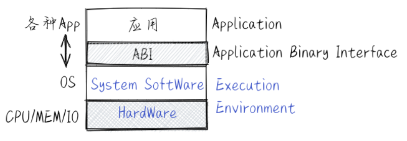
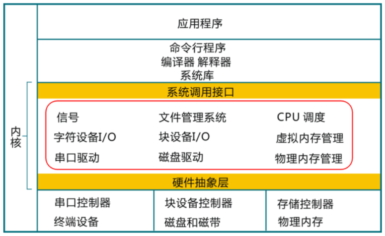

# 第零章





内核主要组成部分：
1. 进程/线程管理：内核负责管理系统中的进程或线程，创建、销毁、调度和切换进程或线程。
2. 内存管理：内核负责管理系统的内存，分配和回收内存空间，并保证进程之间的内存隔离。
3. 文件系统：内核提供文件系统接口，负责管理存储设备上的文件和目录，并允许应用访问文件系统。
4. 网络通信：内核提供网络通信接口，负责管理网络连接并允许应用进行网络通信。
5. 设备驱动：内核提供设备驱动接口，负责管理硬件设备并允许应用和内核其他部分访问设备。
6. 同步互斥：内核负责协调多个进程或线程之间对共享资源的访问。同步功能主要用于解决进程或线程之间的协作问题，互斥功能主要用于解决进程或线程之间的竞争问题。
7. 系统调用接口：内核提供给应用程序访问系统服务的入口，应用程序通过系统调用接口调用操作系统提供的服务，如文件系统、网络通信、进程管理等。



>脱机方式（offline mode）
 基于脱机方式的操作是指没有与计算机进行关联所完成的操作。比如把包含程序的卡片放到卡片机上，把打印纸安装到打印机上等。与此相反的是联机方式（online mode）的操作，即通过与计算机相联所完成的操作，比如计算机把正在运行的应用程序所计算出来的结果通过打印机打印到纸上。
 现在，脱机方式的操作更多的是指断网下进行的操作，联机方式是指在联网下进行的操作。


```
{
  "builder": {
    "gc": {
      "defaultKeepStorage": "20GB",
      "enabled": true
    }
  },
  "experimental": false
}
```


