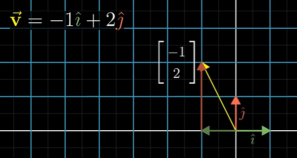
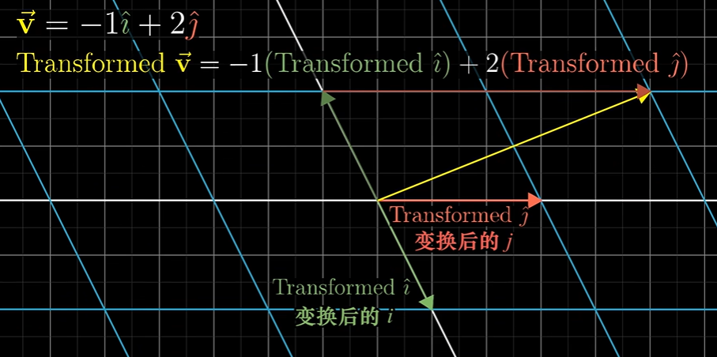

# 线性代数的本质

## 向量

形式上就是多个数字的组合，在物理上可以用来表示方向+长度。

一个向量可以使用一个点来表示，相当于把箭头的尾部放在坐标原点，那么头部所在点就能代表这个向量。

## 矩阵与线性变换

线性变化要满足两点性质：
1. 直线（连续的点）在变换后还是直线。
2. 原点不变。

假设有坐标轴（基底）$\widehat{i}$和$\widehat{j}$：
$$
\widehat{i}=\begin{bmatrix} 1 \\ 0 \end{bmatrix},
\widehat{j}=\begin{bmatrix} 0 \\ 1 \end{bmatrix}
$$

若向量$\vec{v}=\begin{bmatrix} -1 \\ 2 \end{bmatrix}$，则可以使用它们表示成：
$$\vec{v}=-1\widehat{i}+2\widehat{j}$$

当空间进行一次线性变换后，$\widehat{i}$和$\widehat{j}$都发生了变化，但$\vec{v}$与它们的关系却保持不变。假设这些向量经过变换变成了：
$$
\displaylines{
Tran(\widehat{i})=\begin{bmatrix} 1 \\ -2 \end{bmatrix},
Tran(\widehat{j})=\begin{bmatrix} 3 \\ 0 \end{bmatrix} \\
Tran(\vec{v})=\begin{bmatrix} 5 \\ 2 \end{bmatrix}
}
$$

发现依然满足：
$$
\begin{aligned}
Tran(\vec{v})&= -1 Tran(\widehat{i})+2Tran(\widehat{j}) \\
&= -1 \begin{bmatrix} 1 \\ -2 \end{bmatrix} +
2 \begin{bmatrix} 3 \\ 0 \end{bmatrix} \\
&= \begin{bmatrix} -1(1) + 2(3) \\ -1(-2) + 2(0) \end{bmatrix} \\
&= \begin{bmatrix} 5 \\ 2 \end{bmatrix}
\end{aligned}
$$

实际上，将两个基底在线性变换后变成的两个列向量合在一起，就是一个表示该线性变换的矩阵；对原向量左乘该矩阵，就能得到线性变换后的向量：

$$
\begin{aligned}
Tran(\vec{v})&= M*\vec{v} \\
&= \begin{bmatrix} 1 & 3 \\ -2 & 0 \end{bmatrix} 
\begin{bmatrix} -1 \\ 2 \end{bmatrix} \\
&= -1 \begin{bmatrix} 1 \\ -2 \end{bmatrix} +
2 \begin{bmatrix} 3 \\ 0 \end{bmatrix} \\
&= \begin{bmatrix} -1(1) + 2(3) \\ -1(-2) + 2(0) \end{bmatrix} \\
&= \begin{bmatrix} 5 \\ 2 \end{bmatrix}
\end{aligned}
$$
把数字换成符号，可以得到一个等式：

$$
\begin{bmatrix} x_i & x_j \\ y_i & y_j \end{bmatrix} \begin{bmatrix} x \\ y \end{bmatrix} 
= x \begin{bmatrix} x_i \\ y_i \end{bmatrix} + y \begin{bmatrix} x_j \\ y_j \end{bmatrix}
= \begin{bmatrix} x_i * x + x_j * y \\ y_i * x + y_j * y \end{bmatrix}
$$

---

举个例子，如果要进行一次线性变换，使得二维空间被逆时针旋转90度，那么，可以知道：
$$
Tran(\widehat{i})=\begin{bmatrix} 0 \\ 1 \end{bmatrix},
Tran(\widehat{j})=\begin{bmatrix} -1 \\ 0 \end{bmatrix}
$$
于是可以直接写出线性变换对应的矩阵：
$$
\begin{bmatrix} 0 & -1 \\ 1 & 0 \end{bmatrix}
$$

将任意向量左乘该矩阵，就能使其旋转90度，如：
$$
\begin{bmatrix} 0 & -1 \\ 1 & 0 \end{bmatrix}
\begin{bmatrix} -1 \\ 2 \end{bmatrix}
= \begin{bmatrix} -2 \\ -1 \end{bmatrix}
$$
---

用这个视角来看，一个原地不动的线性变换对应的矩阵自然就是单位矩阵，因为：
$$
Tran(\widehat{i})=\begin{bmatrix} 1 \\ 0 \end{bmatrix},
Tran(\widehat{j})=\begin{bmatrix} 0 \\ 1 \end{bmatrix}
$$

直接得到矩阵：
$$
\begin{bmatrix} 1 & 0 \\ 0 & 1 \end{bmatrix}
$$

# 施密特正交化（Schmidt orthogonalization）

$$
\begin{cases}
\beta_1=\alpha_1 \\
\beta_2=\alpha_2-{(\alpha_2,\beta_1) \over (\beta_1,\beta_1)}*\beta_1 \\
...
\end{cases}
$$

可以看做：$\beta_n$为$\alpha_n$减去$\alpha_n$在前面的所有$\beta$在上的投影。即后面$\beta$要避开前面的所有$\beta$，保持正交。

# 可对角化

若存在可逆矩阵P，使得$A=PDP^{-1}$且D为对角矩阵，则A可对角化。其中D的对角线每一项都是A的特征值，P的每个列向量都是A的特征向量。

因此可对角化的充要条件就是由所有特征向量组成的矩阵为可逆矩阵；即n个特征向量线性无关；即有n个互不相同的特征值时必然可对角化；即对特征值的每个重根，其对应的线性无关的特征向量数与重数相同。

