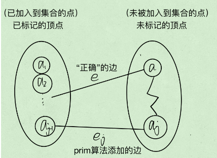
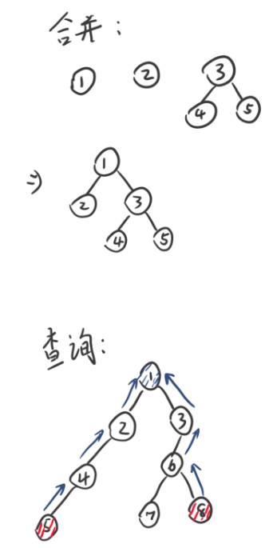
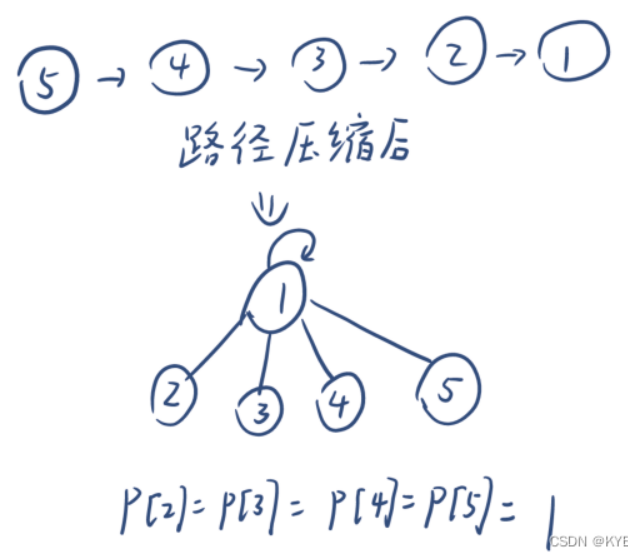
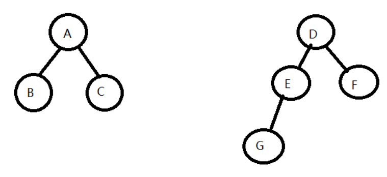
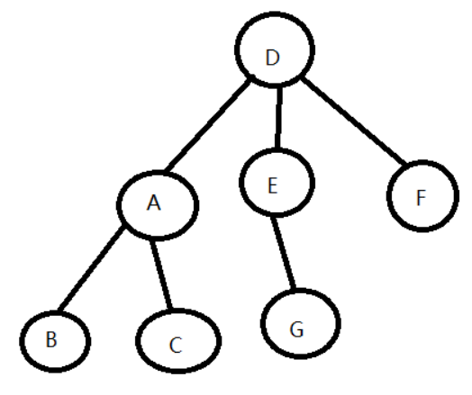

# 单调栈

[84. 柱状图中最大的矩形 题解 - 力扣（LeetCode）](https://leetcode.cn/problems/largest-rectangle-in-histogram/solution/zhu-zhuang-tu-zhong-zui-da-de-ju-xing-by-leetcode-/)

维护一个栈，使得入栈前，若栈顶比入栈元素大（或小），则进行弹栈，直到栈顶元素比入栈元素小（或大）为止。使得栈底到栈顶递增（或递减）。每个元素的入栈和出栈都可以触发一些事件、结果。

# 快速幂

时间复杂度$O(logN)$。可以很容易地改成快速加算法。

```cpp
double quickMul(double x, int N) {
	if (N == 0) {
		return 1.0;
	}
	double y = quickMul(x, N / 2);
	//奇数时quickMul(x, N / 2)少算了个x，要补上
	return N % 2 == 0 ? y * y : y * y * x; 
}

double myPow(double x, int n) {
	return N >= 0 ? quickMul(x, N) : 1.0 / quickMul(x, -N);
}
```

# 堆

## 建堆

指从无序数组建立堆。

两种方式：向下调整法和向上调整法。

- 无论是哪种调整法，其最坏情况就是调整直至碰顶或底。
- 都是从根节点开始往后遍历。

向下调整，越高的点调整的次数越多，同时越高的点总数越少，复杂度为O(n)。

向上调整，越低的点调整的次数越多，同时越低的点总数越多，复杂度为O(nlogn)。

因此，向下调整更优。

## 调整

一般每次只有一个结点破坏了堆，而只调整这个结点就能重塑堆，无论它在顶点还是叶子。复杂度为O(logn)。

## 优先级队列

[239. 滑动窗口最大值 题解 - 力扣（LeetCode）](https://leetcode.cn/problems/sliding-window-maximum/solution/hua-dong-chuang-kou-zui-da-zhi-by-leetco-ki6m/)

是用堆实现的，可以插入新元素，或访问/弹出堆顶元素。

# 快排

双指针。把标记拿走。 左边找小于标记的，右边找大于标记的，交换。不断移动直到双指针相撞，此时相撞的左边都是比标记小的，右边都是比标记大的。最后交换标记和相撞点即可。

>相撞有两种情形：
>先移动的指针到达其目标后等待，被后移动的撞上；
>后移动的指针交换完毕后，被下一轮先移动的撞上。
>这两种情形相撞的点都是满足先移动指针目标的点。
>
>因此：
>当选取最左边的元素为基准元素时，先移动的指针一定要是右边的指针（撞在小于目标处）。
>当选取最右边的元素为基准元素时，先移动的指针一定要是左边的指针（撞在大于目标处）。

# 二叉树

## 构造二叉树

### 前序&后序

前序和后序不能唯一确定二叉树，原因是当一个节点只有一个孩子的时候无法确定是左孩子还是右孩子。

但依然能唯一确定右视图（每一层的最右侧结点），只要默认为左孩子即可：

```cpp
#include <iostream>
#include <vector>
#include <queue>
using namespace std;

struct TreeNode {
    int val;
    TreeNode* left;
    TreeNode* right;
    TreeNode(int x) : val(x), left(nullptr), right(nullptr) {}
};

TreeNode* buildTree(vector<int>& preorder, vector<int>& postorder) {
    if (preorder.empty() || postorder.empty()) {
        return nullptr;
    }
    //若不知道放在左边还是右边，则默认左边 
    int rootVal = preorder[0];
    TreeNode* root = new TreeNode(rootVal);
    if (preorder.size() == 1) {
        return root;
    }
    int leftSize = 0;
    while (postorder[leftSize] != preorder[1]) {
        leftSize++;
    }
    vector<int> leftPreorder(preorder.begin() + 1, preorder.begin() + leftSize + 2);
    vector<int> leftPostorder(postorder.begin(), postorder.begin() + leftSize + 1);
    vector<int> rightPreorder(preorder.begin() + leftSize + 2, preorder.end());
    vector<int> rightPostorder(postorder.begin() + leftSize + 1, postorder.end() - 1);
    root->left = buildTree(leftPreorder, leftPostorder);
    root->right = buildTree(rightPreorder, rightPostorder);
    return root;
}

vector<int> rightSideView(TreeNode* root) {
    vector<int> result;
    if (root == nullptr) {
        return result;
    }
    queue<TreeNode*> q;
    q.push(root);
    while (!q.empty()) {
        int size = q.size();
        for (int i = 0; i < size; i++) {
            TreeNode* node = q.front();
            cout<<node->val<<" ";
            q.pop();
            if (i == size - 1) {
                result.push_back(node->val);
               	cout<<endl;
            }
            if (node->left != nullptr) {
                q.push(node->left);
            }
            if (node->right != nullptr) {
                q.push(node->right);
            }
        }
    }
    return result;
}

int main() {
    //vector<int> preorder = {1, 2, 4, 5, 3, 6, 7};
    //vector<int> postorder = {4, 5, 2, 6, 7, 3, 1};
    
    //vector<int> preorder = {1, 2, 4, 7, 5, 3, 6};
    //vector<int> postorder = {7, 4, 5, 2, 6, 3, 1};
    
    vector<int> preorder = {1, 2, 4, 7, 3, 6};
    vector<int> postorder = {7, 4, 2, 6, 3, 1};
    
    TreeNode* root = buildTree(preorder, postorder);
    
    // 对构建的二叉树进行操作
    vector<int> rightView = rightSideView(root);
    cout << "Right View: ";
    for (int num : rightView) {
        cout << num << " ";
    }
    cout << endl;
    
    return 0;
}
```

# 背包问题

## 01背包

可以化为01背包问题的所有问题的抽象表述：存在一系列元素$\omega_i$，要么归属于A，要么归属于B，没有其他选项；每个元素都有权值$v_i$，遍历中也存在限制条件$p_j$；通过遍历元素的归属，过程中满足限制条件，观察权值变化，得出答案。

经典01背包中，元素就是各个物体，A是放入背包，B是舍弃，权值是价值，限制条件是A中总体积不能越界（界限由遍历过程决定，最大为A的容量），遍历过程中权值取大，答案在体积最大、遍历完所有元素处。

注意，以值的形式成为数组长度的“体积”指的是背包的容量而不是装的物体的体积。

$f [i] [j] = max (f [i - 1] [j], f [i - 1] [j - w [i]] + v [j])$

即按顺序考虑物品i，从小到大考虑背包大小，对每个背包大小只能：
- 不装i，等价于考虑i-1时的同大小背包的最优解。
- 装i，则装之前对应的状态是考虑i-1时小了$w[i]$的背包的最优解。

dp数组的大小为$(item\_num+1)*(max\_size+1)$，物品为0处表示不考虑任何物品时的状态。

dp数组元素的类型与意义可以随意变化。不需要考虑权重大小、只考虑可能性的时候，dp数组的类型为bool。计算可能性数量的时候，将两个来源的可能性数量相加即可。

若想要使用滚动数组的话，注意很多时候需要从大到小遍历，这样的话就不会访问到当前物品的变化。

## 恰好装满的01背包

考虑第i个物品时，它的最优解只能：
- 来自于i-1中容量相同的背包。
- 来自于i-1中容量为0~$max- w [i]$的背包。

而若有解，则最后一个物品（i）的最大容量背包必然是刚好装满的，于是：
- 如果它来自于前者情形，由于容量和已装物品都不变，因此也必然是刚好装满的。
- 如果它来自于后者情形，则放入物品i之前的背包也必然是刚好装满的。

得出结论，**最终解一路上的来源全是恰好装满的背包**，因此不装满的背包的情形可以全部扔掉。初始时只有背包容量为0才满足此要求。

[494. 目标和](https://leetcode.cn/problems/target-sum/)

>可以转化为恰好装满的01背包的问题：给出一些数$x_i$和一个常数h，求x的某个组合，使得$\sum x_i=h$，并给出满足此状态下$f(x_i,...,x_j)$ 的最大值。
>将$x_i$全部加上一个大常数后，都转化为正数；物品i的体积就是数的大小$x_i$，而其价值由函数f决定。

有的问题并不要求最后装满，而是看所有物品能否凑出哪些体积，这就需要结束后遍历dp数组中最后一个物品的所有容量情况：[1049. 最后一块石头的重量 II](https://leetcode.cn/problems/last-stone-weight-ii/)

由此还能看出能转化为01背包的问题中可能共有的性质：每个物品要么属于A，要么属于B，但所有物品的总值sum在一开始就可以求出来，因此$A=sum-B$。那么就可以推出$ans=A-B=sum-2*B$，以ans的范围来确定B的范围，从而转化为“把多少物品归类到B”的01背包问题。


# Floyd

结果为图上任意两个点之间的最短路径。

有两个矩阵，记录i->j最短距离的D矩阵和用于回溯的S矩阵，尺寸都为V\*V。

S矩阵存储最短路径i->j要经过的第一个节点。如1->5->6->8时，$S[1][8]=5$；则下次就会去找$S[5][8]$=6，然后$S[6][8]=8$；$8==8$，S矩阵值与终点相同，则是找完路径了。

初始化：遍历所有边(i,j，len)，$D[i][j]=len$ ；对任意的i，j，$S[i][j]=j$ 。（这里对S矩阵的初始化比较暴力，可能在非强连通图内出问题）

```python
#使用所有结点去松弛其他结点
for k in range(self.V):
	#遍历所有结点组合，让其被k结点松弛
	for i in range(self.V):
		for j in range(self.V):
			if self.D[i][j]>self.D[i][k]+self.D[k][j]:
				#松弛
				self.D[i][j]=self.D[i][k]+self.D[k][j]
				#取i->k路径的第一个途径结点作为i->j路径的第一个途径结点 
				self.S[i][j]=self.S[i][k] 
```


# 前缀和

```cpp
for(int i=1;i<len;i++){
	a[i]+=a[i-1];
}
```

## 快速求连续子数组的和

对整个数组求前缀和得到数组d，则第i项到第j项这一子数组（长度为j-i+1）的和为$d[j]-d[i-1]$。

## 区间加同一个数

需求：有一个全0的长度为n的数组a，每次令区间$[x_i,y_i]$都加上$k_i$，如此操作t次。

暴力加的时间复杂度最坏为$O(n*t)$。

可以让$a[x_i]+=k_i$，$a[y_i]-=k_i$；然后对a求前缀和.此时复杂度为$O(n+t)$。

# 最小生成树

对于有n个顶点的**连通图**，必然存在**极小连通子图**，它由原图的所有顶点和部分边组成，且没有环；当任意的<u>原图中有但极小连通子图中没有的边</u>加入极小连通子图中时，会出现环。极小连通子图又叫生成树。

生成树中的所有边的权值和最小时，称为**最小生成树**。

## Prim

设结果点集U，剩余点集V-U。U初始为随机一点。对边(n1,n2)，且n1在U中、n2在V-U中，求最小的这样的边；然后将这个边作为结果树的一部分，且将n2加入到U。

具体来说，要维护”未加入的各个点到结果树的距离“这一数组。每次选取数组中最小的点，加入到结果树中，并对其他所有未加入的点进行松弛。时间复杂度$O(n^2)$，与边数无关，适合稠密图。

### 正确性证明

首先，Prim能产生生成树。归纳证明：

1. 结果树只有一个点时，和最小生成树的部分相同。
2. 下面证明添加一条边后依然与最小生成树部分相同。**假设Prim不产生最小生成树**，则：由于Prim产生的是生成树（或者说由于其策略），所以其上必然会存在一条边$e_j$连接U和V-U；同理最小生成树也会存在一条连接的边$e$。由于假设了Prim不能生成最小生成树，因此两个边不同。此时：
	1. 如果$e>e_j$，则最小生成树比Prim的生成树还大，矛盾。
	2. 如果$e=e_j$，则Prim产生的必然也是最小生成树，与假设矛盾。
	3. 如果$e<e_j$，则与Prim的策略矛盾。

于是，Prim生成的必然是最小生成树。



## Kruskal

每次将最小的边加入到结果树中，但不能形成环。

对所有边进行排序，然后从小到大插入到结果树中；同时用并查集检测是否存在环，若存在，则取消插入并将此边丢弃（略过）。最大的时间复杂度在于排序，因此时间复杂度为$O(eloge)$

### 正确性证明

假设T是用kruskal求出来的最小生成树，而U是这个图的最小生成树。

假设T != U，那么至少存在一条边在T中，不在U中。那么我们希望证明T和U中所有边的权值之和是相等的。假设存在k条边存在T中不存在U中。 

接下来进行k次变换： 每次将在T中不在U中的最小的边f拿出来放到U中，那么U中必然形成一条唯一的环路，我们取出这个环路上最小的且不再T中的边e放回到T中以让U变回最小生成树。这样的边e一定是存在的，因为如果e原来就在T中，那么就会带上f形成环路，但T是没有环路的。 

现在证明f和e的关系，如果f和e相等的，那么k次变换后，T和U的权值之和是相等的，那么证明就成立了。 

1. 假设f < e,那么后来形成的U是权值之和更小了，与U是最小生成树矛盾。 
2. 假设f > e,那么根据kruskal的做法，e是在f之前被取出来的边但是被舍弃了，一定是因为e和比e小的边形成了环路，而比e小的边都是存在U中的，而e和这些边并没有形成环路，于假设矛盾。 

所以f = e。 


# 拓扑排序

在一个有向无环图，所有的点能被拓扑排序成一个序列，其中如果u->v，则u在v前。

步骤：找到一个入度为0的点，将其添加到序列的末端，然后在图上去掉该点和相关的边（使得其他点的入度减小）。如此循环直到所有点被加入序列。

具体实现中，将入度为0的点都存储在队列中，每次取出一个进行一次操作；删除一条边时，就检测此边连接的另一个点是否入度为0，若为0则将其添加到队列中用于下一次的循环。

# 关键路径

从源点到终点的最长路径。AOE权值在边上，AOV权值在点上。

从源点到终点通过拓扑排序得到所有点的最早开始时间，再从终点到源点通过拓扑排序得到所有点的最迟开始时间。两者相等的路径即为关键路径。

对AOV来说，一个点的结束时间等于下一个点的开始时间。而一个点的结束时间比它的开始时间大了它的权值。对AOE来说，一个点的开始和结束时间可视为相等，但一个点的结束时间比下一个点的开始时间小了它的权值。

# 并查集

对若干个元素进行同类合并，比如把有亲戚关系的人都合并到同一个集合里面，就能知道一群人可以分为几个家族。

每个元素都归属于一个元素，因此并查集是个森林；每个集合都是一个树；每个树结点只知道它的父结点；树根结点归属于它自己。

## 基本步骤

每一个集合都由其树根结点代表。

1. 初始化: 将每个元素都独立地作为一个集合。
2. 合并（union）: 若元素a和b有关系，则合并其所在集合。令b集合的树根归属于a集合的树根。
3. 查找（find）: 寻找一个元素的所在集合。一直向上查归属直到找到树根。




## 优化

### 路径压缩

树的结构是可以修改的，只要树根正确即可。因此，在查找的时候，若a元素属于以r元素为树根的集合，则令a直接归属r。此时查询的平均时间复杂度为$O(logN)$。



### 按秩合并

此处将秩（rank）定义为树的深度。合并集合a和集合b时，若a的深度小于等于b的深度，则让a挂到b的树根下。小于时，结果深度同b；等于时，结果深度为b深度加1。因此要维护好每个集合的秩，这样在合并时可以准确计算出新集合的秩而不需重新遍历树。此时查询的平均时间复杂度为$O(logN)$。





### 同时使用

两者也可同时使用，使得查询的平均时间复杂度降为$O(\alpha(N))$，为反阿克曼函数，可视为常数。

过程中可能由于路径压缩导致树的深度减少，此时也无需修改秩。可以理解为按秩合并尽可能优化了合并后的前几次查询。

### 应用

#### 连通性

[LeetCode 200 岛屿数量](https://leetcode.cn/problems/number-of-islands/)

```cpp
class UnionFind {
public:
    UnionFind(vector<vector<char>>& grid) {
        count = 0;
        int m = grid.size();
        int n = grid[0].size();
        for (int i = 0; i < m; ++i) {
            for (int j = 0; j < n; ++j) {
                if (grid[i][j] == '1') {
	                //刚开始时每个1都独立成树，归属于自己
                    parent.push_back(i * n + j);
                    ++count;
                }
                else {
                    parent.push_back(-1);
                }
                //秩的绝对大小没有意义，可以直接设为0
                rank.push_back(0);
            }
        }
    }

    int find(int i) {
        if (parent[i] != i) {
	        //查找的同时进行路径压缩
            parent[i] = find(parent[i]);
        }
        return parent[i];
    }

    void unite(int x, int y) {
        int rootx = find(x);
        int rooty = find(y);
        if (rootx != rooty) {
	        //合并到大秩的树里面去
            if (rank[rootx] < rank[rooty]) {
                swap(rootx, rooty);
            }
            parent[rooty] = rootx;
            //等秩会导致深度多一个
            if (rank[rootx] == rank[rooty]) rank[rootx] += 1;
            --count;
        }
    }

    int getCount() const {
        return count;
    }

private:
    vector<int> parent;
    vector<int> rank;
    int count;
};

class Solution {
public:
    int numIslands(vector<vector<char>>& grid) {
        int nr = grid.size();
        if (!nr) return 0;
        int nc = grid[0].size();

        UnionFind uf(grid);
        int num_islands = 0;
        //这里不需要上下左右都看着unite。由于是从左上遍历到右下，因此只要合并左边和上边就行了。
        for (int r = 0; r < nr; ++r) {
            for (int c = 0; c < nc; ++c) {
                if (grid[r][c] == '1') {
                    grid[r][c] = '0';
                    if (r - 1 >= 0 && grid[r-1][c] == '1') uf.unite(r * nc + c, (r-1) * nc + c);
                    if (r + 1 < nr && grid[r+1][c] == '1') uf.unite(r * nc + c, (r+1) * nc + c);
                    if (c - 1 >= 0 && grid[r][c-1] == '1') uf.unite(r * nc + c, r * nc + c - 1);
                    if (c + 1 < nc && grid[r][c+1] == '1') uf.unite(r * nc + c, r * nc + c + 1);
                }
            }
        }

        return uf.getCount();
    }
};

作者：LeetCode
链接：https://leetcode.cn/problems/number-of-islands/solution/dao-yu-shu-liang-by-leetcode/
来源：力扣（LeetCode）
著作权归作者所有。商业转载请联系作者获得授权，非商业转载请注明出处。
```

#### 检测环

初始时图上每个点都独立为一个集合。如果同一集合内的两个点又被合并，则说明有环。此时相当于a点和b点已经通过根结点c连通，但还是有其他连通路径，则必然存在环。

# 单调队列

[239. 滑动窗口最大值 题解 - 力扣（LeetCode）](https://leetcode.cn/problems/sliding-window-maximum/solution/hua-dong-chuang-kou-zui-da-zhi-by-leetco-ki6m/) 方法2

在队尾插入元素前，将队尾比自己小的元素都弹出来。这使得从队首到队尾单调递减。

# 弗洛伊德循环查找算法

目的：检测单向、不可一对多的链表上的环。

快慢指针都从起点出发，快指针每次移动一个，慢指针每次移动两个。若无环，则快指针会碰到末端；若有环，则两个指针会相遇。时间在$O(n)$内。

[202. 快乐数 题解 - 力扣（LeetCode）](https://leetcode.cn/problems/happy-number/solution/kuai-le-shu-by-leetcode-solution/)的题解2有动画演示。


# 杂记

追求输出效率时不要用endl。

多层for循环时尤其要注意局部性（使得算法对cache友好），比如使用临时变量复制内存数据以多次读；也要注意减少内存访问次数，比如使用临时变量复制内存数据进行多次写，然后把结果写回内存。


