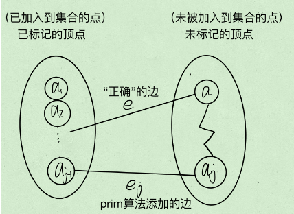

[← 算法](%E7%AE%97%E6%B3%95.md)

# Floyd 最短路

结果为图上任意两个点之间的最短路径。

有两个矩阵，记录i->j最短距离的D矩阵和用于回溯的S矩阵，尺寸都为V\*V。

S矩阵存储最短路径i->j要经过的第一个节点。如1->5->6->8时，$S[1][8]=5$；则下次就会去找$S[5][8]$=6；然后$S[6][8]=8$，检查发现$8==8$，即S矩阵值与终点相同，则是找完路径了。

初始化：遍历所有边(i,j，len)，$D[i][j]=len$ ；对任意的i，j，$S[i][j]=j$ 。（这里对S矩阵的初始化比较暴力，可能在非强连通图内出问题）

```python
#使用所有结点去松弛其他结点
for k in range(self.V):
	#遍历所有结点组合，让其被k结点松弛
	for i in range(self.V):
		for j in range(self.V):
			if self.D[i][j]>self.D[i][k]+self.D[k][j]:
				#松弛
				self.D[i][j]=self.D[i][k]+self.D[k][j]
				#取i->k路径的第一个途径结点作为i->j路径的第一个途径结点 
				self.S[i][j]=self.S[i][k] 
```


# 最小生成树

对于有n个顶点的**连通图**，必然存在**极小连通子图**，它由原图的所有顶点和部分边组成，且没有环；当任意的<u>原图中有但极小连通子图中没有的边</u>加入极小连通子图中时，会出现环。极小连通子图又叫生成树。

生成树中的所有边的权值和最小时，称为**最小生成树**。

## Prim

设结果点集$U$，剩余点集$V-U$。$U$初始为随机一点。对边$(n_1,n_2)$，且$n_1$在$U$中、$n_2$在$V-U$中，求最小的这样的边；然后将这个边作为结果树的一部分，且将$n_2$加入到$U$。

具体来说，要维护”未加入的各个点到结果树的距离“这一数组。每次选取数组中最小的点，加入到结果树中，并对其他所有未加入的点进行松弛。时间复杂度$O(n^2)$，与边数无关，适合稠密图。

### 正确性证明

首先，Prim能产生生成树。归纳证明：

1. 结果树只有一个点时，和最小生成树的部分相同。
2. 下面证明添加一条边后依然与最小生成树部分相同。**假设Prim不产生最小生成树**，则：由于Prim产生的是生成树（或者说由于其策略），所以其上必然会存在一条边$e_j$连接$U$和$V-U$；同理最小生成树也会存在一条连接的边$e$。由于假设了Prim不能生成最小生成树，因此两个边不同。此时：
	1. 如果$e>e_j$，则最小生成树比Prim的生成树还大，矛盾。
	2. 如果$e=e_j$，则Prim产生的必然也是最小生成树，与假设矛盾。
	3. 如果$e<e_j$，则与Prim的策略矛盾。

于是，Prim生成的必然是最小生成树。



## Kruskal

每次将最小的边加入到结果树中，但不能形成环。

对所有边进行排序，然后从小到大插入到结果树中；同时用并查集检测是否存在环，若存在，则取消插入并将此边丢弃（略过）。最大的时间复杂度在于排序，因此时间复杂度为$O(E \log E)$.

### 正确性证明

假设$T$是用Kruskal求出来的最小生成树，而U是这个图的最小生成树。

假设$T \neq U$，那么至少存在一条边在$T$中，不在$U$中。那么我们希望证明$T$和$U$中所有边的权值之和是相等的。假设存在$k$条边存在$T$中不存在$U$中。 

接下来进行$k$次变换： 每次将在$T$中不在$U$中的最小的边$f$拿出来放到$U$中，那么$U$中必然形成一条唯一的环路，我们取出这个环路上最小的且不再T中的边$e$放回到$T$中以让$U$变回最小生成树。这样的边$e$一定是存在的，因为如果$e$原来就在$T$中，那么就会带上$f$形成环路，但$T$是没有环路的。 

现在证明$f$和$e$的关系，如果$f$和$e$相等的，那么$k$次变换后，$T$和$U$的权值之和是相等的，那么证明就成立了。 

1. 假设$f < e$,那么后来形成的U是权值之和更小了，与$U$是最小生成树矛盾。 
2. 假设$f > e$,那么根据Kruskal的做法，$e$是在$f$之前被取出来的边但是被舍弃了，一定是因为$e$和比$e$小的边形成了环路，而比$e$小的边都是存在$U$中的，而$e$和这些边并没有形成环路，于假设矛盾。 

所以f = e。 


# 拓扑排序

在一个有向无环图，所有的点能被拓扑排序成一个序列，其中如果u->v，则u在v前。

## BFS

步骤：找到一个入度为0的点，将其添加到序列的末端，然后在图上去掉该点和相关的边（使得其他点的入度减小）。如此循环直到所有点被加入序列。

具体实现中，将入度为0的点都存储在队列中，每次取出一个进行一次操作；删除一条边时，就检测此边连接的另一个点是否入度为0，若为0则将其添加到队列中用于下一次的循环。

如果到最后, 入度为0的点已经没了, 却还有尚未完成的任务, 则不存在拓扑排序.

这样的写法可用于并发调度, 因为它是正向的, 且可以随时给出**当前的所有可用任务**.

[207. 课程表 - 力扣（LeetCode）](https://leetcode.cn/problems/course-schedule)(下面的代码没有记录路径, 但是很方便):
```cpp
bool canFinish(int numCourses, vector<vector<int>>& prerequisites) {
	vector<int> dep(numCourses);
	vector<vector<int>> next(numCourses);
	for(auto&& v: prerequisites) {
		int from = v[0];
		int to = v[1];
		dep[to]++;
		next[from].push_back(to);
	}

	queue<int> avail;
	int finished = 0;
	for(int i = 0; i<numCourses; i++) {
		if(dep[i] == 0) {
			avail.push(i);
			finished++;
		}
	}

	while(!avail.empty()) {
		int c = avail.front();
		avail.pop();
		for(auto&& aim: next[c]) {
			dep[aim]--;
			if(dep[aim] == 0) {
				avail.push(aim);
				finished++;
			}
		}
	}

	return finished == numCourses;
}
```

## DFS

- 单纯检测有没有环。遍历与调度顺序无关。
- 如果搜索到还在搜索流程中的点的话, 就认为检测到了环, 于是马上认为没有拓扑排序. 
- 无视再度遍历到的已回溯的节点.
- 最后将结果数组(栈)反转就得到拓扑排序.

[210. 课程表 II - 力扣（LeetCode）](https://leetcode.cn/problems/course-schedule-ii)
```cpp
class Solution {
public:
    vector<int> findOrder(int numCourses, vector<vector<int>>& prerequisites) {
        visited.resize(numCourses);
        edges.resize(numCourses);
        res.reserve(numCourses);
        for(auto&& v: prerequisites) {
            edges[v[1]].push_back(v[0]);
        }

        for(int i = 0; i< numCourses; i++) {
            if(visited[i] == 0) {
                dfs(i);
            }
        }

        if(circle) {
            return {};
        }
        ranges::reverse(res);
        return res;
    }

    void dfs(int node) {
        // cout<<node<<endl;
        visited[node] = 1;
        for(auto& next: edges[node]) {
            if(visited[next] == 1) {
                circle = true;
                return;
            }
            if(visited[next] == 0) {
                dfs(next);
            }
            if(circle) {
                return;
            }
        }

        // cout<<"push"<<node<<endl;
        res.push_back(node);
        visited[node] = 2;
    }

    vector<vector<int>> edges;
    vector<int> visited;
    bool circle;
    vector<int> res;
};
```

# 关键路径

从源点到终点的最长路径。AOE权值在边上，AOV权值在点上。

从源点到终点通过拓扑排序得到所有点的最早开始时间，再从终点到源点通过拓扑排序得到所有点的最迟开始时间。两者相等的路径即为关键路径。

对AOV来说，一个点的结束时间等于下一个点的开始时间。而一个点的结束时间比它的开始时间大了它的权值。对AOE来说，一个点的开始和结束时间可视为相等，但一个点的结束时间比下一个点的开始时间小了它的权值。

# Dijkstra

[核对：MIT 最短路讲义](https://ocw.mit.edu/courses/6-046j-introduction-to-algorithms-sma-5503-fall-2005/c0da168ddb4a6f7f252ca4461080bf71_lec17.pdf)。

用于计算非负权图中一个结点到其他结点的最短距离。每次选当前距离最小的未确定结点，松弛它的出边。

下面保留原来的 **reverse_dijkstra** 用途：求所有结点**到 aim** 的距离。因此遍历的是原图的入边 `matrix[i][node]`；无向图看不出转置差别，有向图会。

约定：方阵、aim 合法；`matrix[u][v]` 是 u→v 的非负 int 权重，`-1` 表示无边；返回值 `-1` 表示不可达。节点数可用 int 表示，距离用 long long，避免 int 路径和溢出。

```cpp
#include <vector>
#include <queue>
#include <functional>
#include <utility>
using Matrix = std::vector<std::vector<int>>;

auto reverse_dijkstra(const Matrix& matrix, int aim)
    -> std::vector<long long> {
    int n = static_cast<int>(matrix.size());
    std::vector<long long> dis(n, -1);
    dis[aim] = 0;
    using Item = std::pair<long long, int>;
    std::priority_queue<Item, std::vector<Item>, std::greater<>> pq;
    pq.emplace(0, aim);
    while (!pq.empty()) {
        auto [distance, node] = pq.top();
        pq.pop();
        if (distance != dis[node]) continue; // 旧的队列项
        for (int i = 0; i < n; ++i) {
            int weight = matrix[i][node]; // 原图 i -> node
            if (weight < 0) continue;     // 无边，不参与松弛
            auto next = distance + weight;
            if (dis[i] < 0 || next < dis[i]) {
                dis[i] = next;
                pq.emplace(next, i);
            }
        }
    }
    return dis;
}
```

负权边不适用 Dijkstra。矩阵每次扫描一整列，稀疏图改用反图的邻接表更合适。

