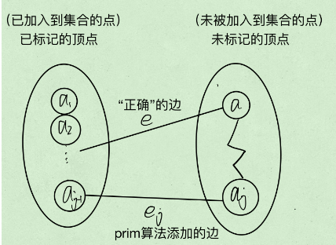
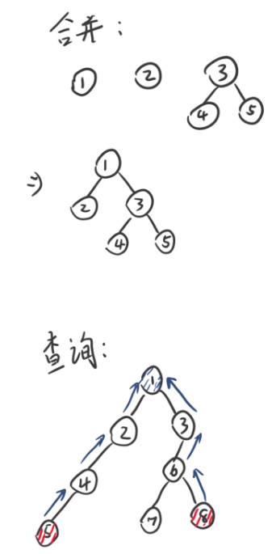
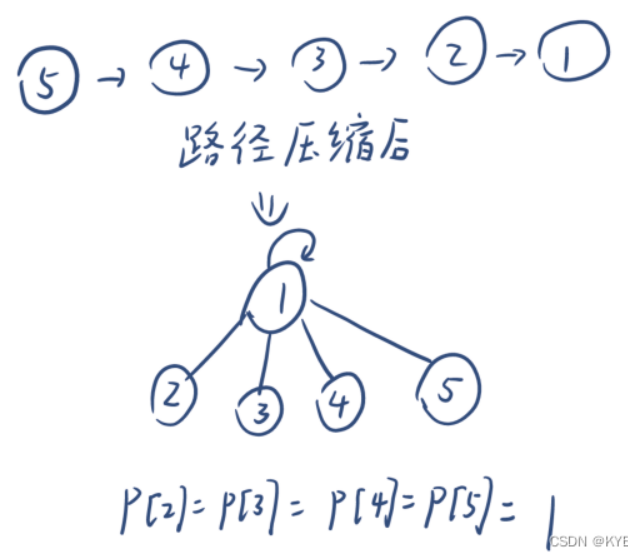
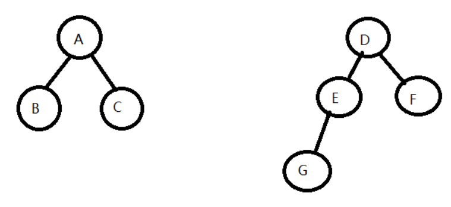
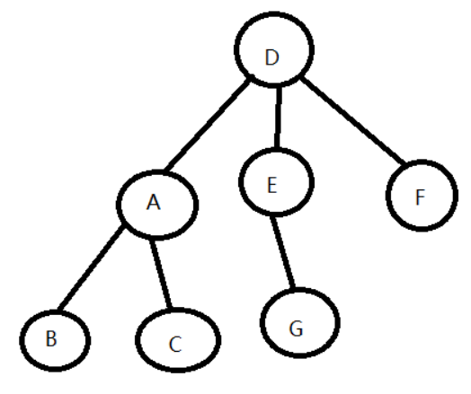
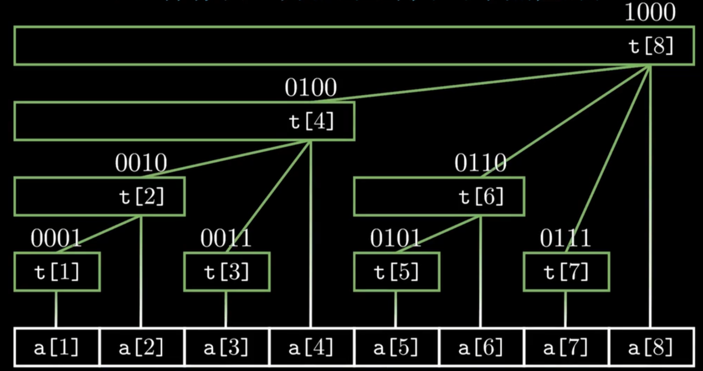
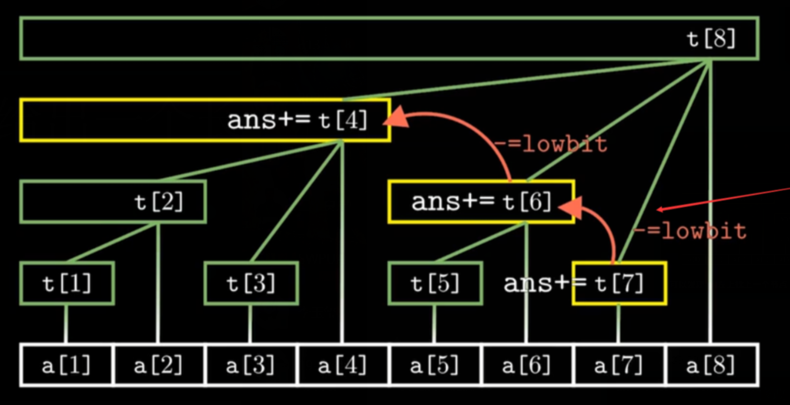

[GitHub - youngyangyang04/leetcode-master: 《代码随想录》LeetCode 刷题攻略：200道经典题目刷题顺序，共60w字的详细图解，视频难点剖析，50余张思维导图，支持C++，Java，Python，Go，JavaScript等多语言版本，从此算法学习不再迷茫！🔥🔥 来看看，你会发现相见恨晚！🚀](https://github.com/youngyangyang04/leetcode-master)

# 理论

## 主定理（Master Theorem）

假设有递推关系式：
$$T(n)=aT\left(\frac nb\right)+f(n)$$
其中$n$为问题规模，$a$为递推的子问题数量，$\frac nb$为每个子问题的规模（假设每个子问题的规模基本一样），$f\left(n\right)$为递推以外进行的计算工作。$a\geq1$, $b>1$为常数。则：

1. 若$f\left(n\right)=O\left(n^{log_ba-\varepsilon}\right),\varepsilon>0$，那么$T\left(n\right)=\Theta\left(n^{\log_ba}\right)$。
2. 若$f\left(n\right)=\Theta\left(n^{\log_ba}\log^kn\right),k\geq0$，那么$T\left(n\right)=\Theta\left(n^{\log_ba}\log^{k+1} n\right)$。
3. 若$f\left(n\right)=\Omega\left(n^{\log_ba+\varepsilon}\right),\varepsilon>0$，且对于某个常数$c<1$和所有充分大的$n$有$af\left(\frac nb\right)\leq cf\left(n\right)$,那么$T\left(n\right)=\Theta\left(f\left(n\right)\right)$。

第二种情况，经常有$k=0$，此时写成：若$f\left(n\right)=\Theta\left(n^{\log_ba}\right)$，那么$T\left(n\right)=\Theta\left(n^{\log_ba}\log n\right)$。


# 二级指针链表操作

一般要存储cur和pre两个指针进行操作，而且要么对头结点进行特判，要么就要创建一个虚拟头结点，浪费空间。使用二级指针的本质就是只创建虚拟头结点的next指针，而无须管val。实际上，链表的头结点的指针是必须存储的（不然就无法访问链表了），对其再取地址是完全合理的。

[LeetCode 203. 移除链表元素](https://leetcode.cn/problems/remove-linked-list-elements)
```cpp
ListNode* removeElements(ListNode* head, int val) {
	ListNode** p = &head;
	while(*p) {
		ListNode* curr = *p;
		if(curr -> val == val) {
			*p = curr -> next;
		} else {
			p = &(curr -> next);
		}
	}
	return head;
}
```

[LeetCode 138. 随机链表的复制](https://leetcode.cn/problems/copy-list-with-random-pointer/description/)
```cpp
Node *copyRandomList(Node *head) {
	if (head == nullptr) {
		return nullptr;
	}

	// 旧节点到新节点
	unordered_map<Node *, Node *> nodePair;
	Node *newHead;
	Node **npPtr = &newHead;
	Node *p = head;
	while (p != nullptr) {
		*npPtr = new Node(p->val);
		nodePair.insert({p, *npPtr});

		// next
		npPtr = &(*npPtr)->next;
		p = p->next;
	}

	// 处理random
	Node *np = newHead;
	p = head;
	while (p != nullptr) {
		if(p->random != nullptr) {
			auto nextNewNode = nodePair.at(p->random);
			np->random = nextNewNode;
		}
		np = np->next;
		p = p->next;
	}

	return newHead;
}
```
# 二分法

当整数a<b时，$a + (b - a) / 2$等价于$(a + b) / 2$。

```rust
pub fn minimize_array_value(nums: Vec<i32>) -> i32 {
	let mut left = 0;
	let mut right = nums.iter().max().unwrap().clone();
	let mut mid = -1;
	while(left<right){
		mid = left+(right-left)/2;
		//println!("{} {} {}",left,right,mid);
		if Self::check(&nums,mid){
			right = mid; //没有-1
		}else{
			left = mid+1;
		}
	}
	//此时left=right且满足right侧的要求
	//println!("end: {} {} {}",left,right,mid);
	left
}
```

# 利用红黑树set

## 利用插入失败机制检测重复区间

[Leetcode 729. 我的日程安排表I](https://leetcode.cn/problems/my-calendar-i)

```cpp
class MyCalendar {
  public:
    MyCalendar() {}

    bool book(int start, int end) {
        auto interval = Interval(start, end);
        auto insertRes = intervalSets.emplace(move(interval));
        return insertRes.second;
    }

  private:
    struct Interval {
        int left, right;

        Interval(int l, int r) : left(l), right(r) {}

        bool operator<(const Interval &other) const {
            // 如果自己的left比某一个right大，但right又比某一个left大，则失败
            return right <= other.left; // right是开区间
        }
    };

    set<Interval> intervalSets;
};
```
# 快速幂

时间复杂度$O(logN)$。可以很容易地改成快速加算法。

```cpp
// 递归
int quickPowRecursive(int base, int exp) {
    if (exp == 0) return 1; // 基本情况
    if (exp % 2 == 0) {
        int half = quickPowRecursive(base, exp / 2);
        return half * half; // 偶数情况
    } else {
        return base * quickPowRecursive(base, exp - 1); // 奇数情况
    }
}
```

```cpp
// 迭代
int quickPowIterative(int base, int exp) {
    int result = 1;
    while (exp > 0) {
        if (exp % 2 == 1) {
            result *= base; // 如果指数是奇数
        }
        base *= base; // 平方底数
        exp /= 2; // 指数减半
    }
    return result;
}
```

# 栈

有时可以使用栈顶`stack.top()`元素来存储当前的状态，以实现类似递归的效果：[LeetCode 856. 括号的分数](https://leetcode.cn/problems/score-of-parentheses)。


# 堆

## 建堆

指从无序数组建立堆。

两种方式：向下调整法和向上调整法。

- 无论是哪种调整法，其最坏情况就是调整直至碰顶或底。
- 都是从根节点开始往后遍历。

向下调整，越高的点调整的次数越多，同时越高的点总数越少，复杂度为O(n)。

向上调整，越低的点调整的次数越多，同时越低的点总数越多，复杂度为O(nlogn)。

因此，向下调整更优。

## 调整

一般每次只有一个结点破坏了堆，而只调整这个结点就能重塑堆，无论它在顶点还是叶子。复杂度为O(logn)。

## 优先级队列

[LeetCode 239. 滑动窗口最大值 题解 - 力扣（LeetCode）](https://leetcode.cn/problems/sliding-window-maximum/solution/hua-dong-chuang-kou-zui-da-zhi-by-leetco-ki6m/)

是用堆实现的，可以插入新元素，或访问/弹出堆顶元素。

# 快排

双指针。把标记拿走。 左边找小于标记的，右边找大于标记的，交换。不断移动直到双指针相撞，此时相撞的左边都是比标记小的，右边都是比标记大的。最后交换标记和相撞点即可。

>相撞有两种情形：
>先移动的指针到达其目标后等待，被后移动的撞上；
>后移动的指针交换完毕后，被下一轮先移动的撞上。
>这两种情形相撞的点都是满足先移动指针目标的点。
>
>因此：
>当选取最左边的元素为基准元素时，先移动的指针一定要是右边的指针（撞在小于目标处）。
>当选取最右边的元素为基准元素时，先移动的指针一定要是左边的指针（撞在大于目标处）。

# 二叉树

## 最近公共祖先

[LeetCode 236. 二叉树的最近公共祖先](https://leetcode.cn/problems/lowest-common-ancestor-of-a-binary-tree/)

p、q的最近公共祖先必然满足以下条件的其中一个，且其他结点都不满足：
- 左子树里面有其一，右子树里面有另一个
- 自己就是其一，某一个子树里面有另一个

使用后序遍历，将是否存在的信息向上传递，直到找到一点满足此条件，并且仅能找到一点。

在特殊情况下，若求树根到p、q的路径比较简单（如二叉搜索树），则可以直接比对路径的最终重合点。

## 构造二叉树

[“看我就够了”三种遍历方式构造二叉树的通解](https://leetcode.cn/problems/construct-binary-tree-from-preorder-and-postorder-traversal/solutions/290943/kan-wo-jiu-gou-liao-san-chong-bian-li-fang-shi-gou/)

算法模式：定义一个函数，其功能为：**由order1的连续的某一段和order2的等长的连续的某一段来构造一棵树**。构造时，先寻找划分位置（在中序中寻找前序或者后序的数字即为**当前的树根**；在后序中寻找前序的数字即为**左子树的树根**），然后根据**order的性质**与**子树的尺寸**来划分左右子树对应的order范围，并进行递归构建。

寻找划分位置时可以用哈希表加速。

### 前序&中序

[LeetCode 105. 从前序与中序遍历序列构造二叉树](https://leetcode.cn/problems/construct-binary-tree-from-preorder-and-inorder-traversal/)

根结点为`pre[pre_start]`，找到其在in中的位置，就能将in划分为左右子树，然后根据划分的尺寸将pre也划分为左右子树。

左右子树范围：
- in:
	- 左子树：`[inorder_start,index-1]`
	- 右子树：`[index+1, inorder_end]`
- pre:
	- 左子树：`[pre_start+1, pre_start+1 + (index-1 - inorder_start)]` 
	- 右子树：`[(pre_start+1 + (index-1 - inorder_start)) + 1, pre_end]`

在前序遍历中，左子树起始位置为pre_start+1,左子树结点一共有`index-1 - inorder_start`个。右子树起始位置为左子树终止位置+1，直到最后。

```cpp
unordered_map<int, int> index;

TreeNode* myBuildTree(const vector<int>& preorder, const vector<int>& inorder, int preorder_left, int preorder_right, int inorder_left, int inorder_right) {
	if (preorder_left > preorder_right) {
		return nullptr;
	}
	
	// 前序遍历中的第一个节点就是根节点
	int preorder_root = preorder_left;
	// 在中序遍历中定位根节点
	int inorder_root = index[preorder[preorder_root]];
	
	// 先把根节点建立出来
	TreeNode* root = new TreeNode(preorder[preorder_root]);
	// 得到左子树中的节点数目
	int size_left_subtree = inorder_root - inorder_left;
	// 递归地构造左子树，并连接到根节点
	// 先序遍历中「从 左边界+1 开始的 size_left_subtree」个元素就对应了中序遍历中「从 左边界 开始到 根节点定位-1」的元素
	root->left = myBuildTree(preorder, inorder, preorder_left + 1, preorder_left + size_left_subtree, inorder_left, inorder_root - 1);
	// 递归地构造右子树，并连接到根节点
	// 先序遍历中「从 左边界+1+左子树节点数目 开始到 右边界」的元素就对应了中序遍历中「从 根节点定位+1 到 右边界」的元素
	root->right = myBuildTree(preorder, inorder, preorder_left + size_left_subtree + 1, preorder_right, inorder_root + 1, inorder_right);
	return root;
}

TreeNode* buildTree(vector<int>& preorder, vector<int>& inorder) {
	int n = preorder.size();
	// 构造哈希映射，帮助我们快速定位根节点
	for (int i = 0; i < n; ++i) {
		index[inorder[i]] = i;
	}
	return myBuildTree(preorder, inorder, 0, n - 1, 0, n - 1);
}
```

### 中序&后序

根结点为`post[post_end]`，找到其在in中的位置，就能将in划分为左右子树，然后根据划分的尺寸将post也划分为左右子树。

左右子树范围：
- in:
	- 左子树：`[inorder_start,index-1]`
	- 右子树：`[index+1, inorder_end]`
- post:
	- 左子树：`[post_start, post_start + (index-1 - inorder_start)]` 
	- 右子树：`[(pre_start + (index-1 - inorder_start)) + 1, post_end - 1]`

在后序遍历中，左子树起始位置为`post_start`，左子树结点一共有`index-1 - inorder_start`个。右子树起始位置为左子树终止位置+1，直到最后-1（因为最后是当前的根结点）。右子树也可以换一种形式表达：右子树的终止位置为`post_end - 1`,右子树结点一共有`inorder_end - (index+1)`个，因此表示为`[post_end - 1 - (inorder_end - (index+1)), post_end - 1]`。

有一个巧合，如果先造右子树、再造左子树的话，就相当于从后往前一个一个消费后序遍历，因此如果把后序遍历的下标提取为全局变量，且每构造一个节点就进行一次左移的话，就不需要记它了。

```cpp
int post_idx;
unordered_map<int, int> idx_map;

TreeNode* helper(int in_left, int in_right, vector<int>& inorder, vector<int>& postorder){
	// 如果这里没有节点构造二叉树了，就结束
	if (in_left > in_right) {
		return nullptr;
	}

	// 选择 post_idx 位置的元素作为当前子树根节点
	int root_val = postorder[post_idx];
	TreeNode* root = new TreeNode(root_val);

	// 根据 root 所在位置分成左右两棵子树
	int index = idx_map[root_val];

	// 下标减一
	post_idx--;
	// 构造右子树
	root->right = helper(index + 1, in_right, inorder, postorder);
	// 构造左子树
	root->left = helper(in_left, index - 1, inorder, postorder);
	return root;
}

TreeNode* buildTree(vector<int>& inorder, vector<int>& postorder) {
	// 从后序遍历的最后一个元素开始
	post_idx = (int)postorder.size() - 1;

	// 建立（元素，下标）键值对的哈希表
	int idx = 0;
	for (auto& val : inorder) {
		idx_map[val] = idx++;
	}
	return helper(0, (int)inorder.size() - 1, inorder, postorder);
}
```
### 前序&后序

[LeetCode 889. 根据前序和后序遍历构造二叉树](https://leetcode.cn/problems/construct-binary-tree-from-preorder-and-postorder-traversal/)

根节点为`pre[pre_start]`,同时也是`post[post_end]`。

左子树的根节点为`pre[pre_start+1]`，在post中寻找它，即可将post划分为左右子树，然后根据划分的尺寸把pre也划分为左右子树。

左右子树范围：
- post
	- 左子树：`[post_start,index]`
	- 右子树：`[index+1, post_end-1]` 
- pre
	- 左子树：`[pre_start+1, pre_start+1 + (index - post_start)]`
	- 右子树：`[(pre_start+1 + (index - post_start)) + 1, pre_end]`

在前序遍历中，左子树起始位置为`pre_start+1`,左子树的结点个数一共有`index - post_start`个，在起点后连续排布；右子树起始位置为左子树终止位置+1，直到最后。


```cpp
TreeNode* constructFromPrePost(vector<int>& preorder, vector<int>& postorder) {
	return build(preorder,postorder,0,preorder.size()-1,0,postorder.size()-1);
}

TreeNode* build(vector<int> &pre, vector<int> &post,
	int preStart,int preEnd,int postStart,int postEnd){
	if(preStart > preEnd || postStart>postEnd){
		return nullptr;
	}

	TreeNode* root = new TreeNode(pre[preStart]);

	//防止pre[preStart+1]越界
	if(preStart == preEnd){
		return root;
	}

	//寻找postorder中的左根结点pre[preStart+1]的位置
	//可以用unordered_map加速
	int index = 0;
	while(post[index]!=pre[preStart+1]){
		index++;
	}

	int leftPreEnd = preStart+1+index-postStart;
	root->left = build(pre,post,
		preStart+1,leftPreEnd,
		postStart,index);
	root->right = build(pre,post,
		leftPreEnd+1,preEnd,
		index+1,postEnd-1);

	return root;
}
```

前序和后序不能唯一确定二叉树，原因是当一个节点只有一个孩子的时候无法确定是左孩子还是右孩子。

但依然能唯一确定右视图（每一层的最右侧结点），只要默认为左孩子即可：

```cpp
#include <iostream>
#include <vector>
#include <queue>
using namespace std;

struct TreeNode {
    int val;
    TreeNode* left;
    TreeNode* right;
    TreeNode(int x) : val(x), left(nullptr), right(nullptr) {}
};

TreeNode* buildTree(vector<int>& preorder, vector<int>& postorder) {
    if (preorder.empty() || postorder.empty()) {
        return nullptr;
    }
    //若不知道放在左边还是右边，则默认左边 
    int rootVal = preorder[0];
    TreeNode* root = new TreeNode(rootVal);
    if (preorder.size() == 1) {
        return root;
    }
    int leftSize = 0;
    while (postorder[leftSize] != preorder[1]) {
        leftSize++;
    }
    vector<int> leftPreorder(preorder.begin() + 1, preorder.begin() + leftSize + 2);
    vector<int> leftPostorder(postorder.begin(), postorder.begin() + leftSize + 1);
    vector<int> rightPreorder(preorder.begin() + leftSize + 2, preorder.end());
    vector<int> rightPostorder(postorder.begin() + leftSize + 1, postorder.end() - 1);
    root->left = buildTree(leftPreorder, leftPostorder);
    root->right = buildTree(rightPreorder, rightPostorder);
    return root;
}

vector<int> rightSideView(TreeNode* root) {
    vector<int> result;
    if (root == nullptr) {
        return result;
    }
    queue<TreeNode*> q;
    q.push(root);
    while (!q.empty()) {
        int size = q.size();
        for (int i = 0; i < size; i++) {
            TreeNode* node = q.front();
            cout<<node->val<<" ";
            q.pop();
            if (i == size - 1) {
                result.push_back(node->val);
               	cout<<endl;
            }
            if (node->left != nullptr) {
                q.push(node->left);
            }
            if (node->right != nullptr) {
                q.push(node->right);
            }
        }
    }
    return result;
}

int main() {
    //vector<int> preorder = {1, 2, 4, 5, 3, 6, 7};
    //vector<int> postorder = {4, 5, 2, 6, 7, 3, 1};
    
    //vector<int> preorder = {1, 2, 4, 7, 5, 3, 6};
    //vector<int> postorder = {7, 4, 5, 2, 6, 3, 1};
    
    vector<int> preorder = {1, 2, 4, 7, 3, 6};
    vector<int> postorder = {7, 4, 2, 6, 3, 1};
    
    TreeNode* root = buildTree(preorder, postorder);
    
    // 对构建的二叉树进行操作
    vector<int> rightView = rightSideView(root);
    cout << "Right View: ";
    for (int num : rightView) {
        cout << num << " ";
    }
    cout << endl;
    
    return 0;
}
```

# 背包问题

## 01背包

可以化为01背包问题的所有问题的抽象表述：存在一系列元素$\omega_i$，要么归属于A，要么归属于B，没有其他选项；每个元素都有权值$v_i$，遍历中也存在限制条件$p_j$；通过遍历元素的归属，过程中满足限制条件，观察权值变化，得出答案。

经典01背包中，元素就是各个物体，A是放入背包，B是舍弃，权值是价值，限制条件是A中总体积不能越界（界限由遍历过程决定，最大为A的容量），遍历过程中权值取大，答案在体积最大、遍历完所有元素处。

注意，以值的形式成为数组长度的“体积”指的是背包的容量而不是装的物体的体积。

$f [i] [j] = max (f [i - 1] [j], f [i - 1] [j - w [i]] + v [j])$

即按顺序考虑物品i，从小到大考虑背包大小，对每个背包大小只能：
- 不装i，等价于考虑i-1时的同大小背包的最优解。
- 装i，则装之前对应的状态是考虑i-1时小了$w[i]$的背包的最优解。

dp数组的大小为$(item\_num+1)*(max\_size+1)$，物品为0处表示不考虑任何物品时的状态。

dp数组元素的类型与意义可以随意变化。不需要考虑权重大小、只考虑可能性的时候，dp数组的类型为bool。计算可能性数量的时候，将两个来源的可能性数量相加即可。

若想要使用滚动数组的话，注意很多时候需要从大到小遍历，这样的话就不会访问到当前物品的变化。

**滚动数组优化后，数组考前的一段不会改变，可以直接跳过不遍历。**

### 恰好装满的01背包

考虑第i个物品时，它的最优解只能：
- 来自于i-1中容量相同的背包。
- 来自于i-1中容量为0~$max- w [i]$的背包。

而若有解，则最后一个物品（i）的最大容量背包必然是刚好装满的，于是：
- 如果它来自于前者情形，由于容量和已装物品都不变，因此也必然是刚好装满的。
- 如果它来自于后者情形，则放入物品i之前的背包也必然是刚好装满的。

得出结论，**最终解一路上的来源全是恰好装满的背包**，因此不装满的背包的情形可以全部扔掉。初始时只有背包容量为0才满足此要求。

[LeetCode 494. 目标和](https://leetcode.cn/problems/target-sum/)

>可以转化为恰好装满的01背包的问题：给出一些数$x_i$和一个常数h，求x的某个组合，使得$\sum x_i=h$，并给出满足此状态下$f(x_i,...,x_j)$ 的最大值。
>将$x_i$全部加上一个大常数后，都转化为正数；物品i的体积就是数的大小$x_i$，而其价值由函数f决定。

有的问题并不要求最后装满，而是看所有物品能否凑出哪些体积，这就需要结束后遍历dp数组中最后一个物品的所有容量情况：[LeetCode 1049. 最后一块石头的重量 II](https://leetcode.cn/problems/last-stone-weight-ii/)

由此还能看出能转化为01背包的问题中可能共有的性质：每个物品要么属于A，要么属于B，但所有物品的总值sum在一开始就可以求出来，因此$A=sum-B$。那么就可以推出$ans=A-B=sum-2*B$，以ans的范围来确定B的范围，从而转化为“把多少物品归类到B”的01背包问题。

## 完全背包

有N件物品和一个能背重量为W的背包，第i件物品的重量为$weight[i]$,价值为$value[i]$。**每件物品有无限个(也就是可以放入背包多次）**，求怎样可以使背包物品价值总量最大。

dp数组只有一维，大小为$max\_size+1$。

求组合的总数时，对每个物品，都更新一次dp数组。从前往后遍历，每次都是如$dp[i] += dp[i - k]$的形式利用更小下标的状态，这样就可让当前物品被重复加入多次，不重不漏，因为再怎么重复添加当前物品也只会和下标小的有关，且重复物品的先后是没有意义的。[LeetCode 518. 零钱兑换 II](https://leetcode.cn/problems/coin-change-ii/)

```cpp
int change(int amount, vector<int>& coins) {
	vector<int> dp(amount + 1);
	dp[0] = 1;
	for (int& coin : coins) {
		for (int i = coin; i <= amount; i++) {
			dp[i] += dp[i - coin];
		}
	}
	return dp[amount];
}
```

求排列的总数时，同一个物品不能堆在一起算了，必须每个$dp[i]$都考虑了所有情况后，才能将其用于更靠后的$dp[i]$。此时遍历的层次顺序刚好与组合问题反过来。这种问题也能等价地看成**可以走多种步数的爬楼梯问题**，每次都把所有步数种类遍历一遍。[LeetCode 377. 组合总和 Ⅳ](https://leetcode.cn/problems/combination-sum-iv/)

```cpp
int combinationSum4(vector<int>& nums, int target) {
	vector<int> dp(target + 1);
	dp[0] = 1;
	for (int i = 1; i <= target; i++) {
		for (int& num : nums) {
			if (num <= i) {
				dp[i] += dp[i - num];
			}
		}
	}
	return dp[target];
}
```

排列问题略加变形[LeetCode 139. 单词拆分](https://leetcode.cn/problems/word-break/)，下面两种解法逻辑上等价：

```cpp
bool wordBreak1(string s, vector<string>& wordDict) {
	auto wordDictSet = unordered_set <string> ();
	for (auto word: wordDict) {
		wordDictSet.insert(word);
	}

	auto dp = vector <bool> (s.size() + 1);
	dp[0] = true;
	for (int i = 1; i <= s.size(); ++i) {
		//下面的j循环等价于将wordDict中的每个字符串都试过去，让前面的状态转移到后面
		//但这样写更加简洁
		for (int j = 0; j < i; ++j) {
			if (dp[j] && wordDictSet.find(s.substr(j, i - j)) != wordDictSet.end()) {
				dp[i] = true;
				break;
			}
		}
	}

	return dp[s.size()];
}

bool wordBreak2(string s, vector<string>& wordDict) {
	vector<int> dp(s.size()+1,false);
	dp[0]=true;
	for(int i=1;i<=s.size();i++){
		for(auto w:wordDict){
			int w_size = w.size();
			if(!dp[i] && i>=w_size){
				dp[i] = dp[i-w_size] && s.substr(i-w_size,w_size) == w;
			}
			if(dp[i]){
				break;
			}
		}
	}

	return dp[s.size()];
}
```

# Floyd

结果为图上任意两个点之间的最短路径。

有两个矩阵，记录i->j最短距离的D矩阵和用于回溯的S矩阵，尺寸都为V\*V。

S矩阵存储最短路径i->j要经过的第一个节点。如1->5->6->8时，$S[1][8]=5$；则下次就会去找$S[5][8]$=6，然后$S[6][8]=8$；$8==8$，S矩阵值与终点相同，则是找完路径了。

初始化：遍历所有边(i,j，len)，$D[i][j]=len$ ；对任意的i，j，$S[i][j]=j$ 。（这里对S矩阵的初始化比较暴力，可能在非强连通图内出问题）

```python
#使用所有结点去松弛其他结点
for k in range(self.V):
	#遍历所有结点组合，让其被k结点松弛
	for i in range(self.V):
		for j in range(self.V):
			if self.D[i][j]>self.D[i][k]+self.D[k][j]:
				#松弛
				self.D[i][j]=self.D[i][k]+self.D[k][j]
				#取i->k路径的第一个途径结点作为i->j路径的第一个途径结点 
				self.S[i][j]=self.S[i][k] 
```


# 前缀和 / 差分数组

将一个数组求前缀和数组：
```cpp
prefixSum[0] = arr[0];
for (int i = 1; i < n; ++i) {
	prefixSum[i] = prefixSum[i - 1] + arr[i];
}
```

将一个数组求差分数组：
```cpp
diff[0] = arr[0];
for (int i = 1; i < n; ++i) {
	diff[i] = arr[i] - arr[i - 1];
}
```

**对差分数组求前缀和就能得到原数组**。

- 差分数组的**单点修改**等价于原数组的**区间修改**（整个区间加同一个数）
- 差分数组的**前缀和**等价于原数组的**单点查询**

> [!note]
> 前缀和数组与差分数组在不需要保留原数组的时候可以原地构造。

> [!note]
> 前缀和的一些情景下并不需要保存整个结果数组，只需要追踪最后一个数即可，那么就可以写成简单的数组元素累加求和，只不过每加一次就进行一次逻辑判断。

## 前缀和数组：快速求连续子数组的和

加工一次，就可以进行多次快速查询。仅适用于不变的数组。

[LeetCode 303. 区域和检索 - 数组不可变](https://leetcode.cn/problems/range-sum-query-immutable)

```cpp
class NumArray {
public:
    vector<int> sums;

    NumArray(vector<int>& nums) {
        int n = nums.size();
        sums.resize(n + 1);
        for (int i = 0; i < n; i++) {
            sums[i + 1] = sums[i] + nums[i];
        }
    }

    int sumRange(int i, int j) {
        return sums[j + 1] - sums[i];
    }
};
```

对整个数组求前缀和得到数组d，则第i项到第j项这一子数组（长度为j-i+1）的和为$d[j]-d[i-1]$。

## 差分数组：区间修改 / 区间组合

可以计算每个点被几个区间给覆盖：[LeetCode 1450. 在既定时间做作业的学生人数](https://leetcode.cn/problems/number-of-students-doing-homework-at-a-given-time)；可以用来求多个区间的并集的模：[LeetCode 2848. 与车相交的点](https://leetcode.cn/problems/points-that-intersect-with-cars)。（此时不需要保留整个前缀和结果数组）

需求：有一个全0的长度为n的数组a，每次令区间$[x_i,y_i]$都加上$k_i$，如此操作t次。暴力加的时间复杂度最坏为$O(n*t)$。可以让$a[x_i]+=k_i$，$a[y_i]-=k_i$；然后对a求前缀和。此时复杂度为$O(n+t)$。

# 最小生成树

对于有n个顶点的**连通图**，必然存在**极小连通子图**，它由原图的所有顶点和部分边组成，且没有环；当任意的<u>原图中有但极小连通子图中没有的边</u>加入极小连通子图中时，会出现环。极小连通子图又叫生成树。

生成树中的所有边的权值和最小时，称为**最小生成树**。

## Prim

设结果点集U，剩余点集V-U。U初始为随机一点。对边(n1,n2)，且n1在U中、n2在V-U中，求最小的这样的边；然后将这个边作为结果树的一部分，且将n2加入到U。

具体来说，要维护”未加入的各个点到结果树的距离“这一数组。每次选取数组中最小的点，加入到结果树中，并对其他所有未加入的点进行松弛。时间复杂度$O(n^2)$，与边数无关，适合稠密图。

### 正确性证明

首先，Prim能产生生成树。归纳证明：

1. 结果树只有一个点时，和最小生成树的部分相同。
2. 下面证明添加一条边后依然与最小生成树部分相同。**假设Prim不产生最小生成树**，则：由于Prim产生的是生成树（或者说由于其策略），所以其上必然会存在一条边$e_j$连接U和V-U；同理最小生成树也会存在一条连接的边$e$。由于假设了Prim不能生成最小生成树，因此两个边不同。此时：
	1. 如果$e>e_j$，则最小生成树比Prim的生成树还大，矛盾。
	2. 如果$e=e_j$，则Prim产生的必然也是最小生成树，与假设矛盾。
	3. 如果$e<e_j$，则与Prim的策略矛盾。

于是，Prim生成的必然是最小生成树。



## Kruskal

每次将最小的边加入到结果树中，但不能形成环。

对所有边进行排序，然后从小到大插入到结果树中；同时用并查集检测是否存在环，若存在，则取消插入并将此边丢弃（略过）。最大的时间复杂度在于排序，因此时间复杂度为$O(eloge)$

### 正确性证明

假设T是用kruskal求出来的最小生成树，而U是这个图的最小生成树。

假设T != U，那么至少存在一条边在T中，不在U中。那么我们希望证明T和U中所有边的权值之和是相等的。假设存在k条边存在T中不存在U中。 

接下来进行k次变换： 每次将在T中不在U中的最小的边f拿出来放到U中，那么U中必然形成一条唯一的环路，我们取出这个环路上最小的且不再T中的边e放回到T中以让U变回最小生成树。这样的边e一定是存在的，因为如果e原来就在T中，那么就会带上f形成环路，但T是没有环路的。 

现在证明f和e的关系，如果f和e相等的，那么k次变换后，T和U的权值之和是相等的，那么证明就成立了。 

1. 假设f < e,那么后来形成的U是权值之和更小了，与U是最小生成树矛盾。 
2. 假设f > e,那么根据kruskal的做法，e是在f之前被取出来的边但是被舍弃了，一定是因为e和比e小的边形成了环路，而比e小的边都是存在U中的，而e和这些边并没有形成环路，于假设矛盾。 

所以f = e。 


# 拓扑排序

在一个有向无环图，所有的点能被拓扑排序成一个序列，其中如果u->v，则u在v前。

步骤：找到一个入度为0的点，将其添加到序列的末端，然后在图上去掉该点和相关的边（使得其他点的入度减小）。如此循环直到所有点被加入序列。

具体实现中，将入度为0的点都存储在队列中，每次取出一个进行一次操作；删除一条边时，就检测此边连接的另一个点是否入度为0，若为0则将其添加到队列中用于下一次的循环。

# 关键路径

从源点到终点的最长路径。AOE权值在边上，AOV权值在点上。

从源点到终点通过拓扑排序得到所有点的最早开始时间，再从终点到源点通过拓扑排序得到所有点的最迟开始时间。两者相等的路径即为关键路径。

对AOV来说，一个点的结束时间等于下一个点的开始时间。而一个点的结束时间比它的开始时间大了它的权值。对AOE来说，一个点的开始和结束时间可视为相等，但一个点的结束时间比下一个点的开始时间小了它的权值。

# 前缀树 Trie

[Internet路由之路由表查找算法概述-哈希/LC-Trie树/256-way-mtrie树\_ip mtrie-CSDN博客](https://blog.csdn.net/armlinuxww/article/details/89370677?utm_medium=distribute.pc_relevant.none-task-blog-2~default~baidujs_baidulandingword~default-0-89370677-blog-115477491.235^v38^pc_relevant_anti_t3&spm=1001.2101.3001.4242.1&utm_relevant_index=3)

经典的Trie如下：
```cpp
class TrieNode {
public:
    std::unordered_map<char, TrieNode*> children;
    bool isEndOfWord;

    TrieNode() {
        isEndOfWord = false;
    }
};

class Trie {
private:
    TrieNode* root;

public:
    Trie() {
        root = new TrieNode();
    }

    void insert(const std::string& word) {
        TrieNode* current = root;
        for (char c : word) {
            if (current->children.find(c) == current->children.end()) {
                current->children[c] = new TrieNode();
            }
            current = current->children[c];
        }
        current->isEndOfWord = true;
    }

    bool search(const std::string& word) {
        TrieNode* current = root;
        for (char c : word) {
            if (current->children.find(c) == current->children.end()) {
                return false;
            }
            current = current->children[c];
        }
        return current->isEndOfWord;
    }
};
```

LC-Trie(Level Compressed Trie)对层级进行压缩，相当于把**稀疏树**中间不可能出现命中的区域给压缩，从而减小内存消耗。

>一个节点，如果它只有两个节点且左右节点都存在，用两个子节点代替这个节点，如果节点的两个节点都为叶子节点，则停止替换。
# 并查集

对若干个元素进行同类合并，比如把有亲戚关系的人都合并到同一个集合里面，就能知道一群人可以分为几个家族。

每个元素都归属于一个元素，因此并查集是个森林；每个集合都是一个树；每个树结点只知道它的父结点；树根结点归属于它自己。

## 基本步骤

每一个集合都由其树根结点代表。

1. 初始化: 将每个元素都独立地作为一个集合。
2. 合并（union）: 若元素a和b有关系，则合并其所在集合。令b集合的树根归属于a集合的树根。
3. 查找（find）: 寻找一个元素的所在集合。一直向上查归属直到找到树根。




## 优化

### 路径压缩

树的结构是可以修改的，只要树根正确即可。因此，在查找的时候，若a元素属于以r元素为树根的集合，则令a直接归属r。此时查询的平均时间复杂度为$O(logN)$。



### 按秩合并

此处将秩（rank）定义为树的深度。合并集合a和集合b时，若a的深度小于等于b的深度，则让a挂到b的树根下。小于时，结果深度同b；等于时，结果深度为b深度加1。因此要维护好每个集合的秩，这样在合并时可以准确计算出新集合的秩而不需重新遍历树。此时查询的平均时间复杂度为$O(logN)$。





### 同时使用

两者也可同时使用，使得查询的平均时间复杂度降为$O(\alpha(N))$，为反阿克曼函数，可视为常数。

过程中可能由于路径压缩导致树的深度减少，此时也无需修改秩。可以理解为按秩合并**尽可能优化了合并后的前几次查询**。

> 但是这样可能会增加内存负担，应该不太值得。

### 应用

#### 连通性

[LeetCode 547 省份数量](https://leetcode.cn/problems/number-of-provinces)

```cpp
class UnionFind {
public:
    UnionFind(const int n) {
        count = n;
        parent = vector<int>(n);
        // 秩的绝对大小没有意义，可以直接设为0(树根)
        rank = vector<int>(n, 0);
        
        for (int i = 0; i < n; ++i) {
            // 刚开始时每个1都独立成树，归属于自己
            parent[i] = i;
        }
    }

    int find(int i) {
        if (parent[i] != i) {
	        //查找的同时进行路径压缩
          parent[i] = find(parent[i]);
        }
        return parent[i];
    }

    void unite(int x, int y) {
        int rootx = find(x);
        int rooty = find(y);
        if (rootx != rooty) {
	        //合并到大秩的树里面去
          if (rank[rootx] < rank[rooty]) {
              swap(rootx, rooty);
          }
          parent[rooty] = rootx;
          //等秩会导致深度多一个
          if (rank[rootx] == rank[rooty]) {
              rank[rootx] += 1;
          }
          count--;
        }
    }

    int getCount() const {
        return count;
    }

private:
    int count;
    vector<int> parent;
    vector<int> rank;
};

class Solution {
public:
    int findCircleNum(vector<vector<int>>& isConnected) {
        int n = isConnected.size();
        auto uf = UnionFind(n);

        for(int i = 0; i < n; i++) {
            for(int j = 0; j < i; j++) {
                if(isConnected[i][j] == 1) {
                    uf.unite(i, j);
                }
            }
        }

        auto ans = uf.getCount();
        return ans;
    }
};
```

[LeetCode 200 岛屿数量](https://leetcode.cn/problems/number-of-islands/)

```cpp
class UnionFind {
public:
    UnionFind(vector<vector<char>>& grid) {
        count = 0;
        int m = grid.size();
        int n = grid[0].size();
        for (int i = 0; i < m; ++i) {
            for (int j = 0; j < n; ++j) {
                if (grid[i][j] == '1') {
	                //刚开始时每个1都独立成树，归属于自己
                    parent.push_back(i * n + j);
                    ++count;
                }
                else {
                    parent.push_back(-1);
                }
                //秩的绝对大小没有意义，可以直接设为0
                rank.push_back(0);
            }
        }
    }

    int find(int i) {
        if (parent[i] != i) {
	        //查找的同时进行路径压缩
            parent[i] = find(parent[i]);
        }
        return parent[i];
    }

    void unite(int x, int y) {
        int rootx = find(x);
        int rooty = find(y);
        if (rootx != rooty) {
	        //合并到大秩的树里面去
            if (rank[rootx] < rank[rooty]) {
                swap(rootx, rooty);
            }
            parent[rooty] = rootx;
            //等秩会导致深度多一个
            if (rank[rootx] == rank[rooty]) rank[rootx] += 1;
            --count;
        }
    }

    int getCount() const {
        return count;
    }

private:
    vector<int> parent;
    vector<int> rank;
    int count;
};

class Solution {
public:
    int numIslands(vector<vector<char>>& grid) {
        int nr = grid.size();
        if (!nr) return 0;
        int nc = grid[0].size();

        UnionFind uf(grid);
        int num_islands = 0;
        //这里不需要上下左右都看着unite。由于是从左上遍历到右下，因此只要合并左边和上边就行了。
        for (int r = 0; r < nr; ++r) {
            for (int c = 0; c < nc; ++c) {
                if (grid[r][c] == '1') {
                    grid[r][c] = '0';
                    if (r - 1 >= 0 && grid[r-1][c] == '1') uf.unite(r * nc + c, (r-1) * nc + c);
                    if (r + 1 < nr && grid[r+1][c] == '1') uf.unite(r * nc + c, (r+1) * nc + c);
                    if (c - 1 >= 0 && grid[r][c-1] == '1') uf.unite(r * nc + c, r * nc + c - 1);
                    if (c + 1 < nc && grid[r][c+1] == '1') uf.unite(r * nc + c, r * nc + c + 1);
                }
            }
        }

        return uf.getCount();
    }
};
```

#### 检测环

初始时图上每个点都独立为一个集合。如果同一集合内的两个点又被合并，则说明有环。此时相当于a点和b点已经通过根结点c连通，但还是有其他连通路径，则必然存在环。

# 单调栈

[84. 柱状图中最大的矩形 题解 - 力扣（LeetCode）](https://leetcode.cn/problems/largest-rectangle-in-histogram/solution/zhu-zhuang-tu-zhong-zui-da-de-ju-xing-by-leetcode-/)

维护一个栈，使得入栈前，若栈顶比入栈元素大（或小），则进行弹栈，直到栈顶元素比入栈元素小（或大）为止。使得栈底到栈顶递增（或递减）。每个元素的入栈和出栈都可以触发一些事件、结果。

# 单调队列

在队尾插入元素前，将队尾比自己小的元素都弹出来。这使得从队首到队尾单调递减。逻辑上一个元素离开时, 如果它等于队首元素, 则让队首弹出, 以表示最大值改变. 要使用**双端队列**.

在滑动窗口（或者双指针）中，可以使用单调队列来维护窗口内元素的最大值。因为当新元素加入的时候, 老的但又比新元素还小的元素就都完全没用了, 可以安全地被剔除; 同时, 队首又能一直得到当前的最大值, 并在最大值所在元素离开范围的时候及时淘汰.

典型: [239. 滑动窗口最大值 题解 - 力扣（LeetCode）](https://leetcode.cn/problems/sliding-window-maximum/solution/hua-dong-chuang-kou-zui-da-zhi-by-leetco-ki6m/) 方法2

[LeetCode 1696. 跳跃游戏IV](https://leetcode.cn/problems/jump-game-vi)

[LeetCode 2398. 预算内的最多机器人数目](https://leetcode.cn/problems/maximum-number-of-robots-within-budget)


# 最大值最小化 & 最小值最大化

拿最大值最小化来讨论，其等价于求某个值$k\in [begin,end]$，在满足$f(k)$时的最小值，$f(k)$即为“最值”泛函。 这类问题中，$f(k)$通常存在一个临界点h，使得$k<h \rightarrow f(k) \wedge k \geq h \rightarrow f(k)$ ，这和“在有序数列中查找大于某个值的最小数”是等价的，也就是说可以在$[begin,end]$上使用二分法求解。

使用二分法遍历最值，检查遇到的各个值是否符合要求，直到找到临界点。时间复杂度$O(n)=log(A)*time(check\_function)$。

[2439. 最小化数组中的最大值](https://leetcode.cn/problems/minimize-maximum-of-array/)

```rust
pub fn minimize_array_value(nums: Vec<i32>) -> i32 {
	let mut left = 0;
	let mut right = nums.iter().max().unwrap().clone();
	let mut mid = -1;
	//二分法寻找最小的能通过check的数字，总复杂度为O(n*logA)，A为数组最大最小值的差
	while(left<right){
		mid = left+(right-left)/2;
		if Self::check(&nums,mid){
			right = mid;
		}else{
			left = mid+1;
		}
	}
	left
}

//检查k是否满足要求，复杂度为O(n)
fn check(nums: &Vec<i32> , k: i32) -> bool{
	let mut have: i64 = 0;
	for n in nums.iter(){
		//看看能帮忙填补多少，有剩则盈，没剩则亏
		have += (&k-n) as i64;
		//遍历到的n的前面这部分数组已经压力爆炸，则失败
		if have<0{
			return false;
		}
	}
	return true;
}
```

# 弗洛伊德循环查找算法

目的：检测单向、不可一对多的链表上的环。

快慢指针都从起点出发，快指针每次移动一个，慢指针每次移动两个。若无环，则快指针会碰到末端；若有环，则两个指针会相遇。时间在$O(n)$内。

[202. 快乐数 题解 - 力扣（LeetCode）](https://leetcode.cn/problems/happy-number/solution/kuai-le-shu-by-leetcode-solution/)的题解2有动画演示。

这种算法还能用来计算环的入点：[LeetCode 142. 环形链表 II](https://leetcode.cn/problems/linked-list-cycle-ii)。当快慢指针第一次相遇的时候另设一个慢指针b从头跑，忽略快指针，之前的慢指针a继续走。当b走到之前慢指针a和快指针相遇的地方的时候，a就总共走了快指针之前走的距离，于是a和b构成了一组快慢指针，应当是在同一个点相遇。如果想让两个速度一样的指针在环里（或者说重合），那只有在他们入环的时候相遇才能一直重合、一直“相遇”。所以由此可以推论出两个慢指针第一次相遇的点就是入环的节点。

# 线段树

假设有长度为$n$的数组`nums`，其元素俩俩结合（通常是求和）生成一个父结点，各父节点又俩俩结合生成更上层的结点，直到顶端结点（代表整个数组），就构成了其线段树。数组长度为$2^x$时为完全二叉树，否则数组尾部的几个元素不写在最后一层。
## 结构

作为叶子数量受限的二叉树，假设要表示的数组大小为n，则线段树的结点数为：
$$\text{Size} = 2 \times 2^{\lceil \log_2 n \rceil} - 1$$

显然可知$\text{Size} < 4 * n$ （当$n = 2^x + 1$时尺寸被放得最大）。于是，可以直接使用一个$4*n$长度的数组`tree`来存储一个线段树（多余空间不会造成任何影响）。

一个线段树的结点可以表示一个区间（用闭区间表示），而这个区间可以由父结点计算得到，这在自上而下的遍历中很有用。

假设当前结点的下标为$index$，能表示区间$[l,r]$，令$mid = (l + r) / 2$，则：
- 顶端结点下标：$0$
- 顶端结点能表示的区间：$[0, n-1]$
- 左孩子下标：$lchild = index * 2 + 1$
- 左孩子能表示的区间：$[l, mid]$
- 右孩子下标：$rchild = index * 2 + 2$
- 右孩子能表示的区间：$[mid + 1, r]$

由于顶端结点能表示的区间右边界直接取了$n-1$，不一定贴合$2^x$，因此取$mid$的时候很有可能提早出现$l=r$的情况，会直接成为叶子。因此，**线段树非常“不满”**（但表示成数组的时候必然是**连续**的）。

**自上而下遍历**时，要为子结点计算$l$，$r$和$index$。

下面主要使用[LeetCode 307. 区域和检索 - 数组可修改](https://leetcode.cn/problems/range-sum-query-mutable)为例子。
## 构造

由于线段树非常“不满”，因此只能**通过自上而下递归遍历来完成构造**。核心思路是先一直往下遍历，不断计算其应属区间$[l,r]$，直到$l=r$，即叶子结点，此时就令`tree[index] := nums[l]`。子结点都构造完毕后，父结点就可以通过`tree[lchild]`和`tree[rchild]`获取子结点的数据，从而构造自身。

```cpp
class NumArray {
  public:
    NumArray(vector<int> &nums) {
        len = nums.size();
        tree.resize(len * 4);
        buildTree(nums, 0, len - 1, 0);
    }

  private:
    int len;
    vector<int> tree;

    void buildTree(const vector<int> &nums, 
				    int l, int r, int treeIndex) {
        // 叶子
        if (l == r) {
            tree[treeIndex] = nums[l];
            return;
        }

        int mid = (l + r) / 2;
        int lchild = treeIndex * 2 + 1;
        buildTree(nums, l, mid, lchild);
        buildTree(nums, mid + 1, r, lchild + 1);
        // 更新区间和
        tree[treeIndex] = tree[lchild] + tree[lchild + 1];
    }
};
```

> [!tip]
> 如果问题中有连续的多个独立区间，也可以使用线段树进行**区间的区间管理**，而不是把区间给拆散。例如[LeetCode 580. 矩形面积 II 官方题解](https://leetcode.cn/problems/rectangle-area-ii/solutions/1825859/ju-xing-mian-ji-ii-by-leetcode-solution-ulqz/?envType=problem-list-v2&envId=8dbE0noK)的线段树法，其线段树的l和r依然只是普通的数组下标，但一个数组元素代表了一个区间，因此每个结点都可以表示多个连续独立区间的总和信息。

> [!tip]
> 线段树不仅只能简单求和，**所有允许二合一的逻辑的情景均可兼容**。在[LeetCode 580. 矩形面积 II 官方题解](https://leetcode.cn/problems/rectangle-area-ii/solutions/1825859/ju-xing-mian-ji-ii-by-leetcode-solution-ulqz/?envType=problem-list-v2&envId=8dbE0noK)的线段树法中，一个线段树结点包含了若干连续独立区间的长度信息，结点更新时要结合更多的信息进行复杂判断与计算（依然基于子结点）。

## 区间求和

对数组的目标区间$[left, right]$进行求和的话，就需要把相关区间都加起来，大区间用完后，两边零散的部分要拿小区间接着求。

自上而下遍历所有可能相关的区间。递归函数的语义为：**”给出当前结点所表示的区间与目标区间的重合部分的和“**。显然，代入根节点即可得到答案。

> [!note] 怎么知道每个线段树结点要求哪部分区间？
> 一个结点要么直接提交自己的区间和，要么只能通过子结点来求得子区间的和，同时非祖先关系的结点所表示的区间不可能重合，因此任何的求和都**不会出现重复计算**，所以可以在遍历时一直保持`left`和`right`不变，然后求重合部分即可。

遍历到一个线段树结点时，有三种情况：
1. **当前结点的区间与目标区间完全不重合**。直接返回0即可。
2. **当前结点的区间完全在目标区间内**。即整个节点都要被目标节点用来求和，因此直接把当前结点的区间和返回即可，不需要往下遍历了。
3. **当前结点的区间与目标区间部分重合**。此时就需要通过子结点来求子区间的和。显然，此时重合的区间必然完全贴合当前结点的区间的左边或右边，不过这个性质目前用不到。子区间自己会检测具体情况，因此无脑往下递归即可，然后把左右区间给出的答案加起来作为返回值。

```cpp
class NumArray {
  public:
    NumArray(vector<int> &nums) {
        ...
    }

    int sumRange(int left, int right) {
        return sumRangeTree(left, right, 0, len - 1, 0);
    }

  private:
    int len;
    vector<int> tree;

    int sumRangeTree(const int &left, const int &right, 
					    int l, int r, int treeIndex) {
        // 不在范围内
        if (right < l || r < left) {
            return 0;
        }

        // 完全覆盖
        if (left <= l && r <= right) {
            return tree[treeIndex];
        }

        // 部分覆盖
        int mid = (l + r) / 2;
        int lchild = treeIndex * 2 + 1;
        int lSum = sumRangeTree(left, right, l, mid, lchild);
        int rSum = sumRangeTree(left, right, mid + 1, r, lchild + 1);
        return lSum + rSum;
    }
};
```

## 元素更新

更新一个数组元素后，所有相关的区间都会受到影响，即线段树**从根部到某叶子节点的所有结点都需要进行修改**。

如果可以提前得知线段树结点要怎么修改的话（例如让元素加一个值，那每个相关结点都只需要加一个值即可），可以直接尾递归快速完成更新。但是如果无法预知的话（也许可以通过独立维护数组数据来进行预知），就需要重新通过递归自底向上计算相关结点的数值。

```cpp
class NumArray {
  public:
    NumArray(vector<int> &nums) {
        ...
    }

    void update(int index, int val) { 
	    updateTree(index, val, 0, len - 1, 0);
    }

  private:
    int len;
    vector<int> tree;

    void updateTree(const int &index, const int &val, int l, int r,
                    int treeIndex) {
        // 叶子
        if (l == r) {
            tree[treeIndex] = val;
            return;
        }

        int mid = (l + r) / 2;
        int lchild = treeIndex * 2 + 1;
        if (index <= mid) {
            updateTree(index, val, l, mid, lchild);
        } else {
            updateTree(index, val, mid + 1, r, lchild + 1);
        }
        // 更新区间和
        tree[treeIndex] = tree[lchild] + tree[lchild + 1];
    }
};
```

## 其他

使用两个**动态线段树**（只记录用的到的线段树下标）来**以区间为单位标记占用情况**（此题线段树不是最优解）：[Leetcode 729. 我的日程安排表I](https://leetcode.cn/problems/my-calendar-i)


# 树状数组 / 二叉索引树 / BIT

树状数组，也称为**二叉索引树（Binary Indexed Tree, BIT）**，可以实现对一个数组的单点更新和区间求和，功能与线段树类似。可以在支持**单点更新**的同时快速求取**前缀和**（从而快速进行**区间求和**）。

数组元素根据其下标的二进制数位值来进行层层分组，如10000~10011的元素（第一位和第二位自由，但第三位为0，且更高位数相同的数字）都被10100管理。

使用$n+1$长度的数组即可保存BIT。

> [!notice]
> 下标是从1开始的！下标0项永不修改，只有在求前缀和时出场。



可见，**二进制的最低位的1的位置**（或者说**最低位的1所对应的值**）决定了当前下标属于哪一**层**。定义这种寻找数字的二进制最低位1的值的函数为：

$$lowbit(x) = ( \sim x + 1 ) \land x = x \& (-x)$$

```cpp
int lowBit(int x) {
	return x & -x;
}
```

## 单点更新

BIT的一个重要的性质是，结点x的父结点可以通过`lowbit`快速寻找：

$$parent(x) = x + lowbit(x)$$

这使得，若令父结点代表所有子结点区间，则当一个元素发生更新时，可以很快一路更新所有相关父节点：

```cpp
void add(int index, const int &val) {
	while (index <= len) {
		tree[index] += val;
		index += lowbit(index);
	}
}
```

显然，一个节点的数据只会影响它的祖先结点，因此更新时无需理会其他结点。时间复杂度为$O(logN)$。

## 构建

在长度为$len+1$的全0数组上**使用add将nums放入tree当中**来完成构建。

```cpp
NumArray(vector<int> &nums) : nums(nums) {
	len = nums.size();
	tree.resize(len + 1);
	for (int i = 0; i < len; i++) {
		add(i + 1, nums[i]);
	}
}
```

## 区间求和

BIT可以快速求$[0, x]$区间的和，即**前缀和** $prefixSum(x)$。以$lowbit(i)$为间隔往前寻找所需的区间代表，加在一起就是结果。



要求$[x,y]$的区间和时，只要求$prefixSum(y) - prefixSum(x - 1)$即可。时间复杂度为$O(logN)$。

```cpp
int prefixSum(int index) {
	int ans = 0;
	while (index > 0) {
		ans += tree[index];
		index -= lowbit(index);
	}
	return ans;
}
```
## 完整样例代码

[LeetCode 307. 区域和检索 - 数组可修改](https://leetcode.cn/problems/range-sum-query-mutable)

```cpp
class NumArray {
  public:
    NumArray(vector<int> &nums) : nums(nums) {
        len = nums.size();
        tree.resize(len + 1);
        for (int i = 0; i < len; i++) {
            add(i + 1, nums[i]);
        }
    }

    void update(int index, int val) {
        int addNum = val - nums[index];
        nums[index] = val;
        add(index + 1, addNum);
    }

    int sumRange(int left, int right) {
        return prefixSum(right + 1) - prefixSum(left);
    }

  private:
    int len;
    // BIT
    vector<int> tree;
    // 存一份原数据
    vector<int> &nums;

    int lowbit(int x) {
        return x & -x;
    }

    void add(int index, const int &val) {
        while (index <= len) {
            tree[index] += val;
            index += lowbit(index);
        }
    }

    int prefixSum(int index) {
        int ans = 0;
        while (index > 0) {
            ans += tree[index];
            index -= lowbit(index);
        }
        return ans;
    }
};
```
## 区间更新，单点查询

让BIT管理目标数组的差分数组就能完成区间更新（差分的单点更新）和单点查询（差分的前缀和）操作了（[前缀和 / 差分数组](算法/算法.md#前缀和%20差分数组)）。

# 具体问题

## 数组的子序列的计算结果的极值问题（前缀式最优解问题）

> 这种问题本质是dp，但那样理解过于复杂。

此思考方式的核心出发点在于对遍历的极致利用。遍历到当前项时，其**范围内的子问题的局部最优解也已经被解决**，同时**不会出现超范围数据**。因此可以说使用滑动窗口的[LeetCode 2555. 两个线段获得的最多奖品](https://leetcode.cn/problems/maximize-win-from-two-segments)也是同一类型的题。我称之为**前缀式最优解问题**。

[LeetCode 121. 买卖股票的最佳时机](https://leetcode.cn/problems/best-time-to-buy-and-sell-stock)

```cpp
int maxProfit(vector<int>& prices) {
	int inf = 1e9;
	int minprice = inf, maxprofit = 0;
	for (int price: prices) {
		maxprofit = max(maxprofit, price - minprice);
		minprice = min(price, minprice);
	}
	return maxprofit;
}
```

[LeetCode 1014. 最佳观光组合](https://leetcode.cn/problems/best-sightseeing-pair)

```cpp
int maxScoreSightseeingPair(vector<int> &values) {
	int maxVi = values[0];
	int ans = 0;
	for (int j = 1; j < values.size(); ++j) {
		ans = max(ans, values[j] - j + maxVi);
		maxVi = max(maxVi, values[j] + j);
	}
	return ans;
}
```

求**两个一组**的组合的极值（有的可以取**同一个值（重合）**，有的不能，但可以类似地考虑），且组合内不能交换位置（题121的减法没有交换律，相当于靠前的那个数要加符号，即求值函数不同；题1014的出发点和目的地的求值函数也是不同的）。看起来只能暴力搜索。但是，问题中，确定了右值的位置，就能确定左值的范围；且不管右值具体是什么数，局部最优解都**要求左值为极值（即基于左值的局部最优解）**（同时**求极值的过程也与右值无关**）（这两题的左右值是简单相加，更好理解）。

这种问题里，任意**前缀数组的左值极值**可以通过遍历一次来计算；因此，只需要再遍历右值，将对应右值与其前面的数组的左值极值相结合，得到**基于右值的局部最优解**，那么遍历结束就能得到全局最优解。

又注意到，每个右值所使用的左值最优解都是从**比它下标小一个的数组得到的**，因此左右值的遍历是几乎同步的。所以不需要维护左值最优解数组，只需要一齐遍历就行了。当右值下的子问题开始被解决的时候，左值的子问题（单纯求极值）也**刚刚被解决完了**。由于是不能重合的，因此左值的子问题需要**在上一个下标解决**（详见重合的讨论）。

注意，各个子问题的初始解需要进行初始化，因为初始解可能在求最大值时为负数或在求最小值时为整数，不能简单地初始化为0。

**重要：** 问题可能允许或不允许**重合**，这可以通过调整一次遍历内计算的**先后顺序**来适应。例如题121和题1014都是不能重合，于是**先计算下游解（右值），再计算上游数据（左值）**；而题123是完全可以重合的，因此直接**按计算逻辑顺序从左往右**写下来即可。

[LeetCode 123.买卖股票的最佳时机 III](https://leetcode.cn/problems/best-time-to-buy-and-sell-stock-iii)将两个一组的组合扩展到了四个一组，但本质没有变，依然是独立地求最左值局部最优解，然后求带上第二个值的局部最优解，然后是第三个值，最后是第四个值。此题允许重合（因为重合不影响和的值，同时题干也不要求最低购买次数）。

```cpp
int maxProfit(vector<int>& prices) {
	int n = prices.size();
	int buy1 = -prices[0], sell1 = 0;
	int buy2 = -prices[0], sell2 = 0;
	for (int i = 1; i < n; ++i) {
		buy1 = max(buy1, -prices[i]);
		sell1 = max(sell1, buy1 + prices[i]);
		buy2 = max(buy2, sell1 - prices[i]);
		sell2 = max(sell2, buy2 + prices[i]);
	}
	return sell2;
}
```

这些例子的问题模型其实可以更简洁：子序列的每一项的**函数值**（函数与其在子序列的**位置**有关）**加起来**的最大值（减法也可以把减号变成被减数的负号）。于是，它就要求每一项的函数值都要是最大值，唯一限制每一项的最大值的要素是下标的取值范围。

显然，**更多固定个数为一组的问题**也能以相同的思路解决。

继续推广，**任意个数（动态个数）为一组的问题**也能以相同思路解决。[LeetCode 188. 买卖股票的最佳时机](https://leetcode.cn/problems/best-time-to-buy-and-sell-stock-iv)的个数是2k。我们可以建立一个长度为2k的状态数组。对任意的状态下标，其**函数都是确定**的（偶数为买入，奇数为卖出）。对这2k的数之和求最优解，只需要从第一个开始求局部最优解，一直到最后一个即可。对价格数组的遍历也同样只需要一次。本题是**允许重合**的（因为重合不影响和的值，同时题干也不要求最低购买次数），因此从前往后遍历状态数组即可（如果不能重合的话，如强制买卖各k此且不能为同一天，那就得从后往前遍历了）。初始状态依然是使用**首日价格**来初始化（如果不能重合的话，第一天以外的状态可能都得设为`INT_MIN`）。

```cpp
int maxProfit(int k, vector<int> &prices) {
	int statusLen = 2 * k;
	vector<int> status(2 * k);
	// 买入要取负
	for (int d = 0; d < statusLen; d += 2) {
		status[d] = -prices[0];
	}

	for (auto &&price : prices) {
		status[0] = max(status[0], -price);
		for (int d = 1; d < statusLen; d++) {
			if (d % 2 == 0) {
				// 买入
				status[d] = max(status[d], status[d - 1] - price);
			} else {
				// 卖出
				status[d] = max(status[d], status[d - 1] + price);
			}
		}
	}

	return status.back();
}
```

## 因数匹配


给出数组`nums1`、`nums2`，如果`nums2`的某个数是`nums1`的某个数的因数（即`nums1[i] = t * nums2[j]`），则加入统计。

[LeetCode 3164. 优质数对的总数 II](https://leetcode.cn/problems/find-the-number-of-good-pairs-ii)

由于要匹配的是“等于”，因此可以使用哈希表存储`nums1`（弄成桶），然后遍历`nums2`和`t`，当`t * nums2[j]`存在于`nums1`中时，即可加入统计。为了计算每次t的**遍历边界**，要维护`nums1`的最大值`max1`，使得在固定`nums2[j]`、遍历`t`的情况下，当`t * nums2[j] > max1`时，停止遍历，跳到下一个`nums2`。另外，`nums2`也可以进行弄成桶进行去重。

这种算法的复杂度往往远低于$O(n^2)$。假设`nums1`长度为$l_1$，`nums2`长度为$l_2$。最坏情况下，两个数组的桶化**没有进行任何去重**。此时总的匹配操作次数为：

$$\frac{max_1}{nums2[0]} + \frac{max_1}{nums2[1]} + \cdots + \frac{max_1}{nums2[l_2 - 1]} 
= max_1 \times \sum_{i = 0}^{l_2-1}\frac{1}{nums2[i]}$$
可见`nums1`对操作次数的影响只有最大值`max1`。显然，`num2`的元素越小，操作次数就越多；又为了保证不被桶化去重，因此最坏情况下应有`nums2[i] = i + 1`（不能有0）。于是比较操作次数为：

$$max1 \times \sum_{n = 1}^{l_2}\frac{1}{n} < max_1 \times (\ln{(l_2+1}) + \gamma)$$

是一个**调和级数**，与对数相近，其中$\gamma \approx 0.5772156649$为欧拉-马歇罗尼常数。

加上桶操作，总共的时间复杂度为：

$$O(l_1 + l_2 + max_1 \times \ln{l_2})$$

## 接雨水TODO

# 工具算法

## 均匀映射

使用Fisher-Yates洗牌算法可以实现将一个数据均匀洗牌：
```cpp
#include <iostream>
#include <vector>
#include <random>
#include <algorithm>

std::vector<int> shuffleMapping(int N) {
    std::vector<int> mapping(N);
    for (int i = 0; i < N; i++) {
        mapping[i] = i;
    }
    std::random_device rd;
    std::mt19937 gen(rd());
    for (int i = N - 1; i > 0; i--) {
        std::uniform_int_distribution<int> dis(0, i);
        int j = dis(gen);
        std::swap(mapping[i], mapping[j]);
    }
    return mapping;
}

int main() {
    int N = 10; // 你的N值
    std::vector<int> result = shuffleMapping(N);
    for (int i = 0; i < N; i++) {
        std::cout << result[i] << " ";
    }
    return 0;
}
```

# 杂记

追求输出效率时不要用endl。

多层for循环时尤其要注意局部性（使得算法对cache友好），比如使用临时变量复制内存数据以多次读；也要注意减少内存访问次数，比如使用临时变量复制内存数据进行多次写，然后把结果写回内存。


