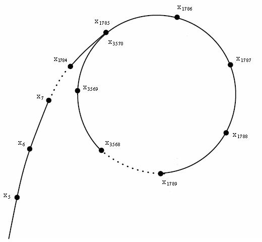

[← 算法](%E7%AE%97%E6%B3%95.md)

# 筛法

筛法就是求不大于N的正整数中有几个**素数**.

## Euler 筛法 (线性筛)

让所有合数都被其**最小素因子**筛掉.

对于每个目标数$pi$, 保证其最小素因子都是$p$.

要在第一次遇到$p$是$i$因子的时候就退出对`prime_list`的遍历, 因为这意味着此时的$p$是$i$的最小素因子, 因此对任意$q>p$, $q*i$的最小素因子都是$p$而非$q$.

时间复杂度为$O(N)$.

```rust
/// 使用Euler筛法获取素数信息.
fn euler_sieve(max_number: usize) -> Vec<bool> {
    let mut prime_list = Vec::with_capacity(max_number / 2);
    let mut not_prime: Vec<bool> = vec![false; max_number + 1];

    for i in 2..=max_number {
        if !not_prime[i] {
            prime_list.push(i);
        }
        for p in &prime_list {
            let aim_num = i as u128 * (*p as u128);
            if aim_num > max_number as u128 {
                break;
            }
            not_prime[aim_num as usize] = true;
            // 第一次遇到p是i的因子的时候就退出对p的遍历
            if i % p == 0 {
                break;
            }
        }
    }

    not_prime
}
```


# 素数判定 

## Miller–Rabin 素性测试

[素数 - OI Wiki](https://oi-wiki.org/math/number-theory/prime/#millerrabin-%E7%B4%A0%E6%80%A7%E6%B5%8B%E8%AF%95)

`MR_TEST_TIME` 应当不小于8. 虽然有不确定性, 但能接触到的整数都很有保证.

```rust
fn miller_rabin(n: u128) -> bool {
    if n < 3 || n % 2 == 0 {
        return n == 2;
    }
    if n % 3 == 0 {
        return n == 3;
    }

    let mut u = n - 1;
    let mut t = 0;
    while u % 2 == 0 {
        u /= 2;
        t += 1;
    }

    const MR_TEST_TIME: u32 = 10;
    for _ in 0..MR_TEST_TIME {
        // a in [2, n-2]
        let a = fastrand::u128(2..=(n - 2));
        let mut v = quick_pow_mod(a, u, n);
        if v == 1 {
            continue;
        }

        let mut pass = false;
        for _ in 0..t {
            if v == n - 1 {
                pass = true;
                break;
            }
            v = mul_mod(v, v, n);
        }
        if !pass {
            return false;
        }
    }
    return true;
}
```
# 最大公约数 (gcd)

**欧几里得算法 (Euclidean algorithm)**:
$$gcd(a,b) = gcd(b, a \mod b)$$

时间复杂度为$O(\log \max(a,b))$.

```cpp
// 递归
int gcd(int a, int b) {
	if (b == 0) return a;
	return gcd(b, a % b);
}

// 迭代
int gcd(int a, int b) {
	while (b != 0) {
		int tmp = a;
		a = b;
		b = tmp % b;
	}
	return a;
}
```

# 分解因数 Pollard-Rho

[分解质因数 - OI Wiki](https://oi-wiki.org/math/number-theory/pollard-rho/)

最暴力的分解算法就是在$[2, \sqrt N]$中遍历:
```cpp
vector<int> breakdown(int N) {
	vector<int> result;
	for (int i = 2; i * i <= N; i++) {
		// 如果 i 能够整除 N，说明 i 为 N 的一个质因子。
		if (N % i == 0) {  
			while (N % i == 0) N /= i;
			result.push_back(i);
		}
	}
	// N 留下了一个素数
	if (N != 1) {  
		result.push_back(N);
	}
	return result;
}
```

Pollard-Rho 算法是一个随机算法, 可以在$O(N^{\frac 1 4}\log N)$下找到$N$的一个**非平凡因子**(即$N$的非$1$非$N$的因子). 可以认为, 一次 Pollard-Rho 算法的调用将$N$分解为$A\times B$. 那么, 只需要**递归**再分别分解$A$和$B$直到它们都是**素数**, 就可以得到$N$的**分解质因数**结果.

设$p$是$N$的**最小素因子**(同时也是$N$的最小非平凡因子). $O(p) = O(\sqrt N)$. 

> [!info]
> 使用$p$来衡量这个算法的最高复杂度, 可以忽略剩下的因子.

令
$$f(x) = x^2 + c \mod N, c \in [1, N)$$
可知, 如果$x \equiv y \pmod{p}$, 则必然有$f(x) \equiv f(y) \pmod{p}$. 这也称作$f$满足$\mathbb{Z}_p$上的自映射 (把$p$换成$N$的其他非平凡因子也成立).

> [!info] 证明
> $$f(x) = x^2 + c \mod N = x^2 + c - k_x N = x^2 + c - k_x k_p p$$
> 其中$k_x$是由$x$决定的整数, $k_p = N / p$也是个整数(因为$p\mid N$). 
> 
> 又有:
> $$g(x) = x^2 + c \mod p = x^2 + c - k_x^\prime p$$
> 
> 显然可得:
> $$f(x) \equiv x^2 + c \pmod{p}$$
> 
> 于是得到:
> $$f(x) \equiv f(y) \pmod{p}$$

定义一个序列, 为$f$函数的不断**嵌套**(一般$x_1=0$): 
$$x_1, x_2 = f(x_1), x_3 = f(x_2), \cdots$$

由于$x_i$能取的数有限(最多只有$N$种数), 后一个数又仅由前一个数决定, 那么序列一直往后必然会出现循环, 类似符号$\rho$ (混循环):


由$f(x)$的自映射性质可以得到: 在序列中, 若$h\mid |x_j - x_i|$, 则必然有$h\mid |x_{j+1} - x_{i+1}|$. 因此, 序列中**同等距离**的任意点对之差都是<u>同样的</u>某个$h$ (有可能是平凡的1) 的<u>倍数</u>. 为了用*下面的方式*求出非平凡因子, 就要尝试不同的$h$, 因此每次都要用**不同的距离**来计算.

使用$gcd(|x_i - x_j|, N)$就能算出在距离$j - i$下能得到的$N$的因子(1忽略不算).

假如$gcd(|x_i - x_j|, N) = h$, 说明$x_i \equiv x_j \pmod{h}$. 由于$x_i$是用$f(x)$生成的, 可以看成是一次单纯的伪随机生成, 同时$N$有最小非平凡因子$p$接近$\sqrt N$, 因此用[生日悖论](%E5%A4%8D%E6%9D%82%E6%80%A7%E4%B8%8E%E8%BF%91%E4%BC%BC%E7%AE%97%E6%B3%95.md#%E7%94%9F%E6%97%A5%E6%82%96%E8%AE%BA)可以认为这种情况首次发生的期望尝试次数(**时间复杂度**)为$O(\sqrt p) = O(N^{\frac 1 4})$.

注意, 不断扩大距离$j-i$时, 可能遇到两点值相等 (如<u>Floyd判环</u>检测到环), 就相当于$x_i^\prime \equiv x_j^\prime \pmod{N}$ , 此时$gcd(|x_i^\prime - x_j^\prime|, N) = N$ (表示$x_i$取模之前其差刚好是N的倍数), 或者单纯的说$|x_i - x_j| = 0$. 这是无意义的. 距离更加大时, 由于环的特性, 就相当于是把$i$和$j$调换顺序, 结果都是重复的. 因此当**出现重复**时, 需要调整$f(x)$的常数$c$然后**重新计算**.

> [!note]
> $f(x)$要满足的性质总结:
> - 满足$\mathbb{Z}_p$上的**自映射**. 可以推导出等距离上的等价.
> - 足够的伪随机性.
> 
> 只要满足以上性质的函数都可以使用. 但实践中一般使用:
> $$f(x) = x^2 + c, c \ne 0, -2$$


## 实现: Floyd 判环

```cpp
ll Pollard_Rho(ll N) {
	ll c = rand() % (N - 1) + 1;
	ll t = f(0, c, N);
	ll r = f(f(0, c, N), c, N);
	while (t != r) {
		ll d = gcd(abs(t - r), N);
		// 找到非平凡因子, 马上返回
		if (d > 1) return d;
		t = f(t, c, N);
		r = f(f(r, c, N), c, N);
	}
	// 失败, 要求重新调用, 以调整c进行重新计算
	return N;
}
```

## 倍增优化

可以把多次的$|x_i - x_j|$乘在一起, 乘$k$次数后一次性求gcd, 即求 $gcd(\prod|x_i - x_j| \mod N, N)$, 得到的也是个非平凡因子. 一般取$k=128$.

这可以使复杂度近似于$O(N^{\frac 1 4})$.

Brent 判环且加上倍增优化的 Pollard-Rho 算法实现:
```rust
/// Pollard-Rho 寻找非平凡因子.
fn pollard_rho(n: u128) -> Option<u128> {
    // f(x) = x^2 + c mod n
    let c = fastrand::u128(1..n);
    let fx = |x: u128| {
        let x_sq = mul_mod(x, x, n);
        let value = (U256::from(x_sq) + c) % n;
        value.as_u128()
    };

    // Brent 判环
    let mut slow: u128 = 0;
    let mut quick: u128 = 0;
    // 每轮快指针走的次数. 指数增长
    let mut ptr_goal = 1;
    loop {
        // 累积乘积
        let mut gathered_val: u128 = 1;
        for step in 1..=ptr_goal {
            quick = fx(quick);
            gathered_val = mul_mod(gathered_val, big_abs(quick, slow), n);
            // 指针相遇
            if gathered_val == 0 {
                return None;
            }

            // 倍增优化
            const GCD_ROUND: u32 = 127;
            if step % GCD_ROUND == 0 {
                let factor = gcd(gathered_val, n);
                if factor > 1 {
                    // 非平凡因子
                    return Some(factor);
                }
            }
        }

        // 倍增优化剩余乘积
        let factor = gcd(gathered_val, n);
        if factor > 1 {
            // 非平凡因子
            return Some(factor);
        }

        ptr_goal *= 2;
        slow = quick;
    }
}
```

## 应用: 求最大素因子

下面的素性检测`check_prime`可以使用[Miller–Rabin](#Miller%E2%80%93Rabin%20%E7%B4%A0%E6%80%A7%E6%B5%8B%E8%AF%95)实现.
```rust
/// 递归求最大素因子.
fn calculate_max_factor(mut n: u128, max_factor: &mut u128) {
    // 不可能有新解, 截断
    if n <= *max_factor || n < 2 {
        return;
    }

    // 素因子
    if check_prime(n) {
        *max_factor = max(*max_factor, n);
        return;
    }

    let p;
    loop {
        if let Some(factor) = pollard_rho(n) {
            p = factor;
            break;
        }
    }
    // 消去n中的p因子
    while n % p == 0 {
        n /= p;
    }
    // 递归
    calculate_max_factor(n, max_factor);
    calculate_max_factor(p, max_factor);
}
```


