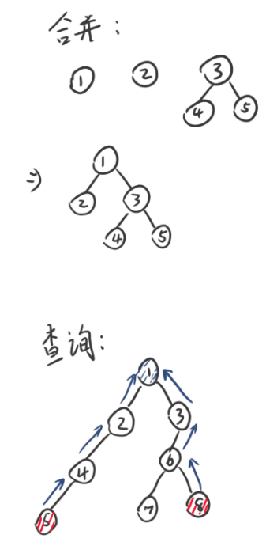
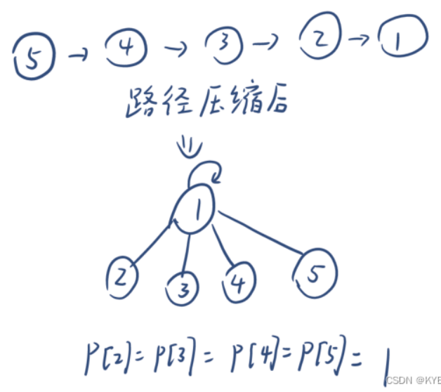
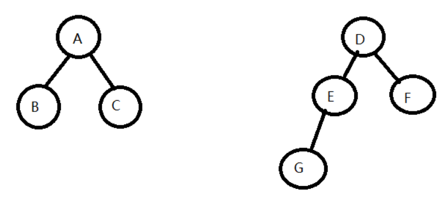
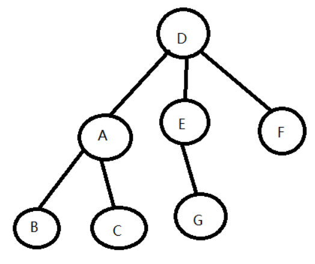
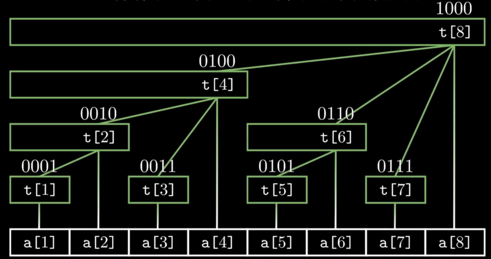
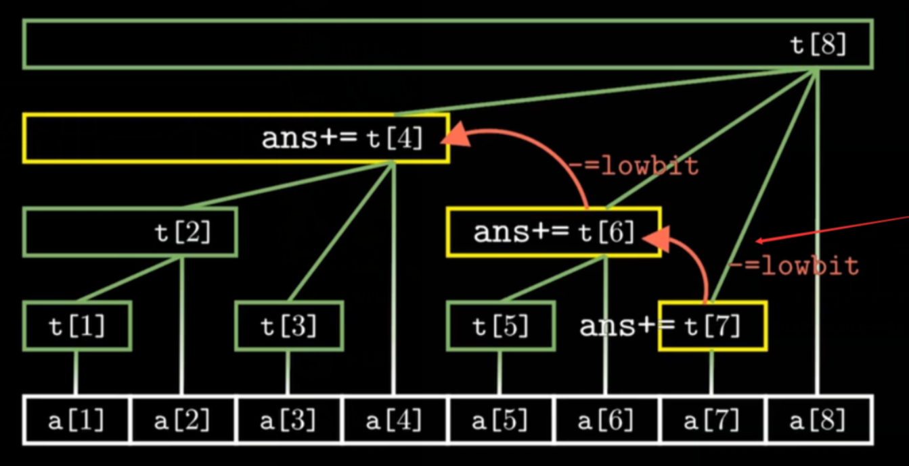

[← 算法](%E7%AE%97%E6%B3%95.md)

# 前缀树 Trie

[Internet路由之路由表查找算法概述-哈希/LC-Trie树/256-way-mtrie树\_ip mtrie-CSDN博客](https://blog.csdn.net/armlinuxww/article/details/89370677?utm_medium=distribute.pc_relevant.none-task-blog-2~default~baidujs_baidulandingword~default-0-89370677-blog-115477491.235^v38^pc_relevant_anti_t3&spm=1001.2101.3001.4242.1&utm_relevant_index=3)

经典的Trie如下：
```cpp
class TrieNode {
public:
    std::unordered_map<char, TrieNode*> children;
    bool isEndOfWord;

    TrieNode() {
        isEndOfWord = false;
    }
};

class Trie {
private:
    TrieNode* root;

public:
    Trie() {
        root = new TrieNode();
    }

    void insert(const std::string& word) {
        TrieNode* current = root;
        for (char c : word) {
            if (current->children.find(c) == current->children.end()) {
                current->children[c] = new TrieNode();
            }
            current = current->children[c];
        }
        current->isEndOfWord = true;
    }

    bool search(const std::string& word) {
        TrieNode* current = root;
        for (char c : word) {
            if (current->children.find(c) == current->children.end()) {
                return false;
            }
            current = current->children[c];
        }
        return current->isEndOfWord;
    }
};
```

LC-Trie(Level Compressed Trie)对层级进行压缩，相当于把**稀疏树**中间不可能出现命中的区域给压缩，从而减小内存消耗。

>一个节点，如果它只有两个节点且左右节点都存在，用两个子节点代替这个节点，如果节点的两个节点都为叶子节点，则停止替换。
# 并查集 (Union-Find)

对若干个元素进行同类合并，比如把有亲戚关系的人都合并到同一个集合里面，就能知道一群人可以分为几个家族。

每个元素都归属于一个元素，因此并查集是个森林；每个集合都是一个树；每个树结点只知道它的父结点；树根结点归属于它自己。

## 基本步骤

每一个集合都由其树根结点代表。

1. 初始化: 将每个元素都独立地作为一个集合。
2. 合并（union）: 若元素a和b有关系，则合并其所在集合。令b集合的树根归属于a集合的树根。
3. 查找（find）: 寻找一个元素的所在集合。一直向上查归属直到找到树根。




## 优化

### 路径压缩

树的结构是可以修改的，只要树根正确即可。因此，在查找的时候，若a元素属于以r元素为树根的集合，则令a直接归属r。此时查询的平均时间复杂度为$O(logN)$。



### 按秩合并

此处将秩（rank）定义为树的深度。合并集合a和集合b时，若a的深度小于等于b的深度，则让a挂到b的树根下。小于时，结果深度同b；等于时，结果深度为b深度加1。因此要维护好每个集合的秩，这样在合并时可以准确计算出新集合的秩而不需重新遍历树。此时查询的平均时间复杂度为$O(logN)$。





### 同时使用

两者也可同时使用，使得查询的平均时间复杂度降为$O(\alpha(N))$，为反阿克曼函数，可视为常数。

过程中可能由于路径压缩导致树的深度减少，此时也无需修改秩。可以理解为按秩合并**尽可能优化了合并后的前几次查询**。

> 但是这样可能会增加内存负担，应该不太值得。

### 应用

#### 连通性

[LeetCode 547 省份数量](https://leetcode.cn/problems/number-of-provinces)

```cpp
class UnionFind {
public:
    UnionFind(const int n) {
        count = n;
        parent = vector<int>(n);
        // 秩的绝对大小没有意义，可以直接设为0(树根)
        rank = vector<int>(n, 0);
        
        for (int i = 0; i < n; ++i) {
            // 刚开始时每个1都独立成树，归属于自己
            parent[i] = i;
        }
    }

    int find(int i) {
        if (parent[i] != i) {
	        //查找的同时进行路径压缩
          parent[i] = find(parent[i]);
        }
        return parent[i];
    }

    void unite(int x, int y) {
        int rootx = find(x);
        int rooty = find(y);
        if (rootx != rooty) {
	        //合并到大秩的树里面去
          if (rank[rootx] < rank[rooty]) {
              swap(rootx, rooty);
          }
          parent[rooty] = rootx;
          //等秩会导致深度多一个
          if (rank[rootx] == rank[rooty]) {
              rank[rootx] += 1;
          }
          count--;
        }
    }

    int getCount() const {
        return count;
    }

private:
    int count;
    vector<int> parent;
    vector<int> rank;
};

class Solution {
public:
    int findCircleNum(vector<vector<int>>& isConnected) {
        int n = isConnected.size();
        auto uf = UnionFind(n);

        for(int i = 0; i < n; i++) {
            for(int j = 0; j < i; j++) {
                if(isConnected[i][j] == 1) {
                    uf.unite(i, j);
                }
            }
        }

        auto ans = uf.getCount();
        return ans;
    }
};
```

[LeetCode 200 岛屿数量](https://leetcode.cn/problems/number-of-islands/)

```cpp
class UnionFind {
public:
    UnionFind(vector<vector<char>>& grid) {
        count = 0;
        int m = grid.size();
        int n = grid[0].size();
        for (int i = 0; i < m; ++i) {
            for (int j = 0; j < n; ++j) {
                if (grid[i][j] == '1') {
	                //刚开始时每个1都独立成树，归属于自己
                    parent.push_back(i * n + j);
                    ++count;
                }
                else {
                    parent.push_back(-1);
                }
                //秩的绝对大小没有意义，可以直接设为0
                rank.push_back(0);
            }
        }
    }

    int find(int i) {
        if (parent[i] != i) {
	        //查找的同时进行路径压缩
            parent[i] = find(parent[i]);
        }
        return parent[i];
    }

    void unite(int x, int y) {
        int rootx = find(x);
        int rooty = find(y);
        if (rootx != rooty) {
	        //合并到大秩的树里面去
            if (rank[rootx] < rank[rooty]) {
                swap(rootx, rooty);
            }
            parent[rooty] = rootx;
            //等秩会导致深度多一个
            if (rank[rootx] == rank[rooty]) rank[rootx] += 1;
            --count;
        }
    }

    int getCount() const {
        return count;
    }

private:
    vector<int> parent;
    vector<int> rank;
    int count;
};

class Solution {
public:
    int numIslands(vector<vector<char>>& grid) {
        int nr = grid.size();
        if (!nr) return 0;
        int nc = grid[0].size();

        UnionFind uf(grid);
        int num_islands = 0;
        //这里不需要上下左右都看着unite。由于是从左上遍历到右下，因此只要合并左边和上边就行了。
        for (int r = 0; r < nr; ++r) {
            for (int c = 0; c < nc; ++c) {
                if (grid[r][c] == '1') {
                    grid[r][c] = '0';
                    if (r - 1 >= 0 && grid[r-1][c] == '1') uf.unite(r * nc + c, (r-1) * nc + c);
                    if (r + 1 < nr && grid[r+1][c] == '1') uf.unite(r * nc + c, (r+1) * nc + c);
                    if (c - 1 >= 0 && grid[r][c-1] == '1') uf.unite(r * nc + c, r * nc + c - 1);
                    if (c + 1 < nc && grid[r][c+1] == '1') uf.unite(r * nc + c, r * nc + c + 1);
                }
            }
        }

        return uf.getCount();
    }
};
```

#### 检测环

初始时图上每个点都独立为一个集合。如果同一集合内的两个点又被合并，则说明有环。此时相当于a点和b点已经通过根结点c连通，但还是有其他连通路径，则必然存在环。

# 单调栈

[739. 每日温度 - 力扣（LeetCode）](https://leetcode.cn/problems/daily-temperatures)

[84. 柱状图中最大的矩形 题解 - 力扣（LeetCode）](https://leetcode.cn/problems/largest-rectangle-in-histogram/solution/zhu-zhuang-tu-zhong-zui-da-de-ju-xing-by-leetcode-/)

维护一个栈，使得入栈前，若栈顶比入栈元素大（或小），则进行弹栈，直到栈顶元素比入栈元素小（或大）为止。使得栈底到栈顶递增（或递减）。每个元素的入栈和出栈都可以触发一些事件、结果。

[42. 接雨水 - 力扣（LeetCode）](https://leetcode.cn/problems/trapping-rain-water)题中, 使用单调栈来一行一行地收集雨水，即每次弹出后都意味着检测到了能接住雨水的凹形区域；且由于计算的是凹形区域, 所以虽然每次弹出栈顶一个元素, 但要查看两个元素(即也要看弹出后的新栈顶).


# 单调队列

要使用**双端队列**.

- 逻辑上新增一个元素时, 将队尾比该元素小的项都弹出来, 然后把该元素塞入。这使得从队首到队尾单调递减。
- 逻辑上删除一个元素时, 如果它等于队首元素, 则让队首弹出, 以表示最大值改变; 否则可知该元素被忽视, 不产生影响.
	- 或者单纯存储数组下标，在删除元素的时候，如果队首的下标等于被删除元素的下标，则弹出队首。

在滑动窗口（或者双指针）中，可以使用单调队列来维护**窗口内元素的最大值**。因为当新元素加入的时候, 老的但又比新元素还小的元素就都完全没用了, 可以安全地被剔除; 同时, 队首又能一直得到当前的最大值, 并在最大值所在元素离开范围的时候及时淘汰.

典型: [239. 滑动窗口最大值 题解 - 力扣（LeetCode）](https://leetcode.cn/problems/sliding-window-maximum/solution/hua-dong-chuang-kou-zui-da-zhi-by-leetco-ki6m/) 方法2

dp的状态如果是取决于它之前的一个滑动窗口内的状态, 那也需要单调栈来维护相关状态的最优值. [LeetCode 1696. 跳跃游戏IV](https://leetcode.cn/problems/jump-game-vi)

[LeetCode 2398. 预算内的最多机器人数目](https://leetcode.cn/problems/maximum-number-of-robots-within-budget)

[918. 环形子数组的最大和 题解 - 力扣（LeetCode）](https://leetcode.cn/problems/maximum-sum-circular-subarray/solutions/2350660/huan-xing-zi-shu-zu-de-zui-da-he-by-leet-elou/) 方法3, 维护前缀数组中固定长度范围里的最小值.

# 最大值最小化 & 最小值最大化

拿最大值最小化来讨论，其等价于求某个值$k\in [begin,end]$，在满足$f(k)$时的最小值，$f(k)$即为“最值”泛函。 这类问题中，$f(k)$通常存在一个临界点h，使得$k<h \rightarrow f(k) \wedge k \geq h \rightarrow f(k)$ ，这和“在有序数列中查找大于某个值的最小数”是等价的，也就是说可以在$[begin,end]$上使用二分法求解。

使用二分法遍历**最值**（对答案进行遍历，因为其中一个单向区间的答案全部符合要求，但另一个区间全部不符合要求），检查遇到的各个值是否符合要求，直到找到临界点。时间复杂度$O(n)=log(A)*time(check\_function)$。

[2439. 最小化数组中的最大值](https://leetcode.cn/problems/minimize-maximum-of-array/)
```rust
pub fn minimize_array_value(nums: Vec<i32>) -> i32 {
	let mut left = 0;
	let mut right = nums.iter().max().unwrap().clone();
	let mut mid = -1;
	//二分法寻找最小的能通过check的数字，总复杂度为O(n*logA)，A为数组最大最小值的差
	while(left<right){
		mid = left+(right-left)/2;
		if Self::check(&nums,mid){
			right = mid;
		}else{
			left = mid+1;
		}
	}
	left
}

//检查k是否满足要求，复杂度为O(n)
fn check(nums: &Vec<i32> , k: i32) -> bool{
	let mut have: i64 = 0;
	for n in nums.iter(){
		//看看能帮忙填补多少，有剩则盈，没剩则亏
		have += (&k-n) as i64;
		//遍历到的n的前面这部分数组已经压力爆炸，则失败
		if have<0{
			return false;
		}
	}
	return true;
}
```


# 环检测
## Floyd 判环 (龟兔赛跑)

目的：检测单向、不可一对多的链表上的环。

快慢指针都从起点出发，快指针每次移动一个，慢指针每次移动两个。若无环，则快指针会碰到末端；若有环，则两个指针会相遇。时间在$O(n)$内。

[202. 快乐数 题解 - 力扣（LeetCode）](https://leetcode.cn/problems/happy-number/solution/kuai-le-shu-by-leetcode-solution/)的题解2有动画演示。

这种算法还能用来求取**环的入点**：[LeetCode 142. 环形链表 II](https://leetcode.cn/problems/linked-list-cycle-ii)。当快慢指针第一次相遇的时候另设一个慢指针b从头跑，忽略快指针，之前的慢指针a继续走。当b走到之前慢指针a和快指针相遇的地方的时候，a就总共走了快指针之前走的距离，于是a和b构成了一组快慢指针，应当是**在同一个点相遇**。如果想让两个速度一样的指针在环里相遇（或者说重合），那只可能是<u>在他们入环的时候就已相遇</u>, 并且一直连在一起走到目标点。所以由此可以推论出两个慢指针第一次相遇的点就是环的入点。例如
[287. 寻找重复数 - 力扣（LeetCode）](https://leetcode.cn/problems/find-the-duplicate-number)：
```cpp
int findDuplicate(vector<int>& nums) {
	int slow = 0, fast = 0;
	do {
		slow = nums[slow];
		fast = nums[nums[fast]];
	} while(slow != fast);
	
	slow = 0;
	while(slow != fast) {
		slow = nums[slow];
		fast = nums[fast];
	}
	return slow;
}
```

## Brent 判环

Brent 判环对 Floyd 判环进行常数上的改进. $k$从$1$开始递增, 设两个指针A和B. 在第$k$轮, 让A等在原地, B向前移动$2^k$步，如果在过程中B遇到了A, 则说明已经得到环, 否则让A瞬移到B的位置，然后继续下一轮。

可以证明，这样得到环所需调用次数永远不大于 Floyd 判环, 可测得平均时间少了 24%.

# 红黑树

- 自动平衡的二叉搜索树(AVL)保证任意结点的子树高度差不超过1.
- 红黑树保证最长路径不超过最短路径的2倍.

- **查找**：AVL树更优（高度更低）；
- **插入/删除**：红黑树更优（调整次数更少）。
- 内存开销: 红黑树仅需1 bit存储颜色信息，而AVL树需存储平衡因子（通常2-3 bits）.


# 线段树

假设有长度为$n$的数组`nums`，其元素俩俩结合（通常是求和）生成一个父结点，各父节点又俩俩结合生成更上层的结点，直到顶端结点（代表整个数组），就构成了其线段树。数组长度为$2^x$时为完全二叉树，否则数组尾部的几个元素不写在最后一层。
## 结构

作为叶子数量受限的二叉树，假设要表示的数组大小为n，则线段树的结点数为：
$$\text{Size} = 2 \times 2^{\lceil \log_2 n \rceil} - 1$$

显然可知$\text{Size} < 4 * n$ （当$n = 2^x + 1$时尺寸被放得最大）。于是，可以直接使用一个$4*n$长度的数组`tree`来存储一个线段树（多余空间不会造成任何影响）。

一个线段树的结点可以表示一个区间（用闭区间表示），而这个区间可以由父结点计算得到，这在自上而下的遍历中很有用。

假设当前结点的下标为$index$，能表示区间$[l,r]$，令$mid = (l + r) / 2$，则：
- 顶端结点下标：$0$
- 顶端结点能表示的区间：$[0, n-1]$
- 左孩子下标：$lchild = index * 2 + 1$
- 左孩子能表示的区间：$[l, mid]$
- 右孩子下标：$rchild = index * 2 + 2$
- 右孩子能表示的区间：$[mid + 1, r]$

由于顶端结点能表示的区间右边界直接取了$n-1$，不一定贴合$2^x$，因此取$mid$的时候很有可能提早出现$l=r$的情况，会直接成为叶子。因此，**线段树非常“不满”**（但表示成数组的时候必然是**连续**的）。

**自上而下遍历**时，要为子结点计算$l$，$r$和$index$。

下面主要使用[LeetCode 307. 区域和检索 - 数组可修改](https://leetcode.cn/problems/range-sum-query-mutable)为例子。
## 构造

由于线段树非常“不满”，因此只能**通过自上而下递归遍历来完成构造**。核心思路是先一直往下遍历，不断计算其应属区间$[l,r]$，直到$l=r$，即叶子结点，此时就令`tree[index] := nums[l]`。子结点都构造完毕后，父结点就可以通过`tree[lchild]`和`tree[rchild]`获取子结点的数据，从而构造自身。

```cpp
class NumArray {
  public:
    NumArray(vector<int> &nums) {
        len = nums.size();
        tree.resize(len * 4);
        buildTree(nums, 0, len - 1, 0);
    }

  private:
    int len;
    vector<int> tree;

    void buildTree(const vector<int> &nums, 
				    int l, int r, int treeIndex) {
        // 叶子
        if (l == r) {
            tree[treeIndex] = nums[l];
            return;
        }

        int mid = (l + r) / 2;
        int lchild = treeIndex * 2 + 1;
        buildTree(nums, l, mid, lchild);
        buildTree(nums, mid + 1, r, lchild + 1);
        // 更新区间和
        tree[treeIndex] = tree[lchild] + tree[lchild + 1];
    }
};
```

> [!tip]
> 如果问题中有连续的多个独立区间，也可以使用线段树进行**区间的区间管理**，而不是把区间给拆散。例如[LeetCode 580. 矩形面积 II 官方题解](https://leetcode.cn/problems/rectangle-area-ii/solutions/1825859/ju-xing-mian-ji-ii-by-leetcode-solution-ulqz/?envType=problem-list-v2&envId=8dbE0noK)的线段树法，其线段树的l和r依然只是普通的数组下标，但一个数组元素代表了一个区间，因此每个结点都可以表示多个连续独立区间的总和信息。

> [!tip]
> 线段树不仅只能简单求和，**所有允许二合一的逻辑的情景均可兼容**。在[LeetCode 580. 矩形面积 II 官方题解](https://leetcode.cn/problems/rectangle-area-ii/solutions/1825859/ju-xing-mian-ji-ii-by-leetcode-solution-ulqz/?envType=problem-list-v2&envId=8dbE0noK)的线段树法中，一个线段树结点包含了若干连续独立区间的长度信息，结点更新时要结合更多的信息进行复杂判断与计算（依然基于子结点）。

## 区间求和

对数组的目标区间$[left, right]$进行求和的话，就需要把相关区间都加起来，大区间用完后，两边零散的部分要拿小区间接着求。

自上而下遍历所有可能相关的区间。递归函数的语义为：**”给出当前结点所表示的区间与目标区间的重合部分的和“**。显然，代入根节点即可得到答案。

> [!note] 怎么知道每个线段树结点要求哪部分区间？
> 一个结点要么直接提交自己的区间和，要么只能通过子结点来求得子区间的和，同时非祖先关系的结点所表示的区间不可能重合，因此任何的求和都**不会出现重复计算**，所以可以在遍历时一直保持`left`和`right`不变，然后求重合部分即可。

遍历到一个线段树结点时，有三种情况：
1. **当前结点的区间与目标区间完全不重合**。直接返回0即可。
2. **当前结点的区间完全在目标区间内**。即整个节点都要被目标节点用来求和，因此直接把当前结点的区间和返回即可，不需要往下遍历了。
3. **当前结点的区间与目标区间部分重合**。此时就需要通过子结点来求子区间的和。显然，此时重合的区间必然完全贴合当前结点的区间的左边或右边，不过这个性质目前用不到。子区间自己会检测具体情况，因此无脑往下递归即可，然后把左右区间给出的答案加起来作为返回值。

```cpp
class NumArray {
  public:
    NumArray(vector<int> &nums) {
        ...
    }

    int sumRange(int left, int right) {
        return sumRangeTree(left, right, 0, len - 1, 0);
    }

  private:
    int len;
    vector<int> tree;

    int sumRangeTree(const int &left, const int &right, 
					    int l, int r, int treeIndex) {
        // 不在范围内
        if (right < l || r < left) {
            return 0;
        }

        // 完全覆盖
        if (left <= l && r <= right) {
            return tree[treeIndex];
        }

        // 部分覆盖
        int mid = (l + r) / 2;
        int lchild = treeIndex * 2 + 1;
        int lSum = sumRangeTree(left, right, l, mid, lchild);
        int rSum = sumRangeTree(left, right, mid + 1, r, lchild + 1);
        return lSum + rSum;
    }
};
```

## 元素更新

更新一个数组元素后，所有相关的区间都会受到影响，即线段树**从根部到某叶子节点的所有结点都需要进行修改**。

如果可以提前得知线段树结点要怎么修改的话（例如让元素加一个值，那每个相关结点都只需要加一个值即可），可以直接尾递归快速完成更新。但是如果无法预知的话（也许可以通过独立维护数组数据来进行预知），就需要重新通过递归自底向上计算相关结点的数值。

```cpp
class NumArray {
  public:
    NumArray(vector<int> &nums) {
        ...
    }

    void update(int index, int val) { 
	    updateTree(index, val, 0, len - 1, 0);
    }

  private:
    int len;
    vector<int> tree;

    void updateTree(const int &index, const int &val, int l, int r,
                    int treeIndex) {
        // 叶子
        if (l == r) {
            tree[treeIndex] = val;
            return;
        }

        int mid = (l + r) / 2;
        int lchild = treeIndex * 2 + 1;
        if (index <= mid) {
            updateTree(index, val, l, mid, lchild);
        } else {
            updateTree(index, val, mid + 1, r, lchild + 1);
        }
        // 更新区间和
        tree[treeIndex] = tree[lchild] + tree[lchild + 1];
    }
};
```

## 其他

使用两个**动态线段树**（只记录用的到的线段树下标）来**以区间为单位标记占用情况**（此题线段树不是最优解）：[Leetcode 729. 我的日程安排表I](https://leetcode.cn/problems/my-calendar-i)


# 树状数组 / 二叉索引树 / BIT

树状数组，也称为**二叉索引树（Binary Indexed Tree, BIT）**，可以实现对一个数组的单点更新和区间求和，功能与线段树类似。可以在支持**单点更新**的同时快速求取**前缀和**（从而快速进行**区间求和**）。

数组元素根据其下标的二进制数位值来进行层层分组，如10000~10011的元素（第一位和第二位自由，但第三位为0，且更高位数相同的数字）都被10100管理。

使用$n+1$长度的数组即可保存BIT。

> [!notice]
> 下标是从1开始的！下标0项永不修改，只有在求前缀和时出场。



可见，**二进制的最低位的1的位置**（或者说**最低位的1所对应的值**）决定了当前下标属于哪一**层**。定义这种寻找数字的二进制最低位1的值的函数为：

$$lowbit(x) = ( \sim x + 1 ) \land x = x \& (-x)$$

```cpp
int lowBit(int x) {
	return x & -x;
}
```

## 单点更新

BIT的一个重要的性质是，结点x的父结点可以通过`lowbit`快速寻找：

$$parent(x) = x + lowbit(x)$$

这使得，若令父结点代表所有子结点区间，则当一个元素发生更新时，可以很快一路更新所有相关父节点：

```cpp
void add(int index, const int &val) {
	while (index <= len) {
		tree[index] += val;
		index += lowbit(index);
	}
}
```

显然，一个节点的数据只会影响它的祖先结点，因此更新时无需理会其他结点。时间复杂度为$O(logN)$。

## 构建

在长度为$len+1$的全0数组上**使用add将nums放入tree当中**来完成构建。

```cpp
NumArray(vector<int> &nums) : nums(nums) {
	len = nums.size();
	tree.resize(len + 1);
	for (int i = 0; i < len; i++) {
		add(i + 1, nums[i]);
	}
}
```

## 区间求和

BIT可以快速求$[0, x]$区间的和，即**前缀和** $prefixSum(x)$。以$lowbit(i)$为间隔往前寻找所需的区间代表，加在一起就是结果。



要求$[x,y]$的区间和时，只要求$prefixSum(y) - prefixSum(x - 1)$即可。时间复杂度为$O(logN)$。

```cpp
int prefixSum(int index) {
	int ans = 0;
	while (index > 0) {
		ans += tree[index];
		index -= lowbit(index);
	}
	return ans;
}
```
## 完整样例代码

[LeetCode 307. 区域和检索 - 数组可修改](https://leetcode.cn/problems/range-sum-query-mutable)

```cpp
class NumArray {
  public:
    NumArray(vector<int> &nums) : nums(nums) {
        len = nums.size();
        tree.resize(len + 1);
        for (int i = 0; i < len; i++) {
            add(i + 1, nums[i]);
        }
    }

    void update(int index, int val) {
        int addNum = val - nums[index];
        nums[index] = val;
        add(index + 1, addNum);
    }

    int sumRange(int left, int right) {
        return prefixSum(right + 1) - prefixSum(left);
    }

  private:
    int len;
    // BIT
    vector<int> tree;
    // 存一份原数据
    vector<int> &nums;

    int lowbit(int x) {
        return x & -x;
    }

    void add(int index, const int &val) {
        while (index <= len) {
            tree[index] += val;
            index += lowbit(index);
        }
    }

    int prefixSum(int index) {
        int ans = 0;
        while (index > 0) {
            ans += tree[index];
            index -= lowbit(index);
        }
        return ans;
    }
};
```

## 区间更新，单点查询

让BIT管理目标数组的差分数组就能完成区间更新（差分的单点更新）和单点查询（差分的前缀和）操作了（[前缀和 / 差分数组](%E5%8A%A8%E6%80%81%E8%A7%84%E5%88%92%E4%B8%8E%E5%BA%8F%E5%88%97%E6%8A%80%E5%B7%A7.md#%E5%89%8D%E7%BC%80%E5%92%8C%20%2F%20%E5%B7%AE%E5%88%86%E6%95%B0%E7%BB%84)）。


